[[统计学与数据科学 Statistics and Data Science]]
# 卡方检验完整详解（Chi-square Test）

## **目录**

1. 什么是卡方检验？
2. 卡方检验的类型
3. 卡方分布的数学原理
4. 拟合优度检验（Goodness-of-Fit Test）
5. 独立性检验（Test of Independence）
6. 同质性检验（Test of Homogeneity）
7. 完整计算示例
8. 前提假设与注意事项
9. 效应量与实际意义
10. 可视化与图表
11. 与其他检验的比较

---

## **一、什么是卡方检验？**

### 基本定义

**卡方检验 (Chi-square Test / χ² Test)** 是一种**非参数统计方法 (non-parametric statistical method)**，用于检验**分类变量 (categorical variables)** 之间的关系。

### 核心思想

比较**观测频数 (observed frequencies)** 与**期望频数 (expected frequencies)** 之间的差异：

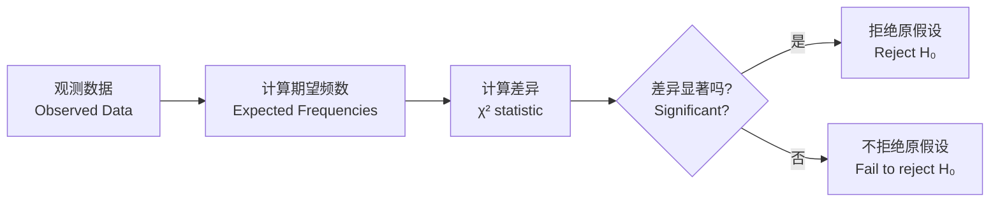

### 为什么叫"卡方"？

检验统计量服从**卡方分布 (chi-square distribution, χ² distribution)**，用希腊字母 χ（chi，读作"kai"）的平方表示。

---

## **二、卡方检验的类型**

### 三种主要类型

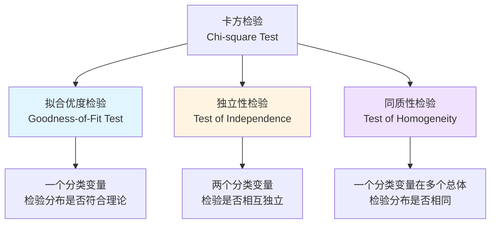

### 对比表

| 类型         | 变量数            | 研究问题          | 例子             |
| ---------- | -------------- | ------------- | -------------- |
| **拟合优度检验** | 1 个分类变量        | 观测分布是否符合理论分布？ | 骰子是否公平？        |
| **独立性检验**  | 2 个分类变量        | 两个变量是否相互独立？   | 性别与专业选择是否有关？   |
| **同质性检验**  | 1 个分类变量 + 多个总体 | 不同总体的分布是否相同？  | 三个城市的政治倾向是否一致？ |

---

## **三、卡方分布的数学原理**

### 卡方统计量的公式

$$\chi^2 = \sum_{i=1}^{k} \frac{(O_i - E_i)^2}{E_i}$$

**符号说明**：
- **χ²**：卡方统计量 (chi-square statistic)
- **O_i**：第 i 类的观测频数 (observed frequency)
- **E_i**：第 i 类的期望频数 (expected frequency)
- **k**：类别总数 (number of categories)

### 公式的直观理解

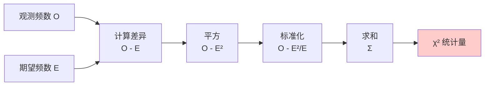

**为什么要平方？**
- 消除正负号，只关注差异的大小
- 放大较大的差异

**为什么要除以 E_i？**
- 标准化 (standardization)：考虑期望频数的大小
- 期望频数大时，同样的差异相对不那么重要

---

### 卡方分布的特征

**卡方分布 (χ² distribution)** 是一个**连续概率分布 (continuous probability distribution)**，由**自由度 (degrees of freedom, df)** 决定。

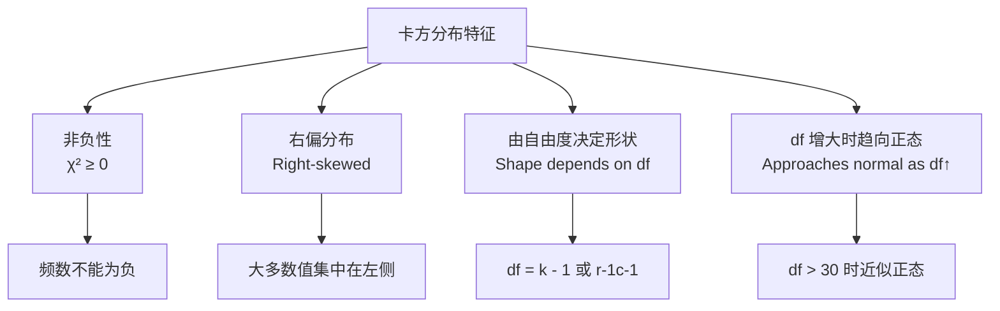

**自由度的计算**：
- **拟合优度检验**：df = k - 1 - p
  - k：类别数
  - p：估计的参数个数
  
- **独立性/同质性检验**：df = (r - 1) × (c - 1)
  - r：行数 (number of rows)
  - c：列数 (number of columns)

---

### 卡方分布的可视化

不同自由度下的卡方分布：

```
概率密度
    |
0.5 |     df=1
    |    /\
0.4 |   /  \___
    |  /       \___  df=2
0.3 | /            \___
    |/                 \___  df=5
0.2 |                      \___
    |                          \___  df=10
0.1 |                              \___
    |_________________________________________
    0   2   4   6   8   10  12  14  16  18  χ²
```

**关键特征**：
- df = 1 时：在 χ² = 0 处有最大值
- df = 2 时：指数递减
- df > 2 时：先上升后下降，峰值右移
- df 越大，分布越对称，越接近正态分布

---

## **四、拟合优度检验（Goodness-of-Fit Test）**

### 什么是拟合优度检验？

检验**一个分类变量的观测分布**是否符合**某个理论分布 (theoretical distribution)**。

### 适用场景

| 研究问题           | 分类变量      | 理论分布         |
| -------------- | --------- | ------------ |
| 骰子是否公平？        | 点数（1-6）   | 均匀分布（各 1/6）  |
| 遗传比例是否符合孟德尔定律？ | 表型（显性/隐性） | 3:1          |
| 出生月份是否均匀分布？    | 月份（1-12）  | 均匀分布（各 1/12） |
| 交通事故是否符合泊松分布？  | 事故次数      | 泊松分布         |

---

### 假设检验步骤

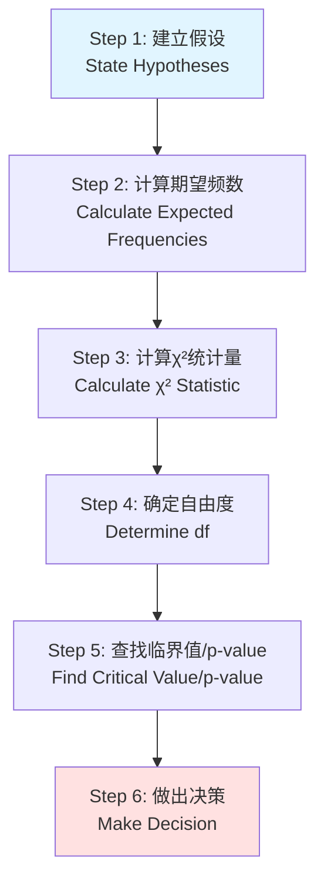

---

### 完整示例：骰子公平性检验

#### 研究问题

某人掷骰子 60 次，记录每个点数出现的次数，检验骰子是否公平。

#### 数据

| 点数 | 观测频数 (O) |
|------|-------------|
| 1 | 8 |
| 2 | 12 |
| 3 | 9 |
| 4 | 11 |
| 5 | 13 |
| 6 | 7 |
| **总计** | **60** |

---

#### Step 1: 建立假设

**原假设 (H₀)**：骰子是公平的，每个点数出现的概率相等
$$H_0: p_1 = p_2 = p_3 = p_4 = p_5 = p_6 = \frac{1}{6}$$

**备择假设 (H₁)**：骰子不公平，至少有一个点数的概率不等于 1/6
$$H_1: \text{至少存在一个 } p_i \neq \frac{1}{6}$$

**显著性水平 (significance level)**：α = 0.05

---

#### Step 2: 计算期望频数

如果骰子公平，每个点数的期望频数：

$$E_i = n \times p_i = 60 \times \frac{1}{6} = 10$$

| 点数 | 观测频数 (O) | 期望频数 (E) |
|------|-------------|-------------|
| 1 | 8 | 10 |
| 2 | 12 | 10 |
| 3 | 9 | 10 |
| 4 | 11 | 10 |
| 5 | 13 | 10 |
| 6 | 7 | 10 |

---

#### Step 3: 计算 χ² 统计量

$$\chi^2 = \sum_{i=1}^{6} \frac{(O_i - E_i)^2}{E_i}$$

**逐项计算**：

| 点数 | O | E | O - E | (O - E)² | (O - E)²/E |
|------|---|---|-------|----------|-----------|
| 1 | 8 | 10 | -2 | 4 | 0.4 |
| 2 | 12 | 10 | 2 | 4 | 0.4 |
| 3 | 9 | 10 | -1 | 1 | 0.1 |
| 4 | 11 | 10 | 1 | 1 | 0.1 |
| 5 | 13 | 10 | 3 | 9 | 0.9 |
| 6 | 7 | 10 | -3 | 9 | 0.9 |
| **总计** | | | | | **χ² = 2.8** |

---

#### Step 4: 确定自由度

$$df = k - 1 = 6 - 1 = 5$$

**解释**：
- k = 6（6 个类别）
- 减 1 是因为总频数固定（60），知道 5 个类别的频数后，第 6 个自动确定

---

#### Step 5: 查找临界值

查 χ² 分布表，df = 5, α = 0.05：

$$\chi^2_{critical} = 11.07$$

或者计算 p-value：

$$p = P(\chi^2_{(5)} > 2.8) \approx 0.73$$

---

#### Step 6: 做出决策

**判断标准**：
- χ² = 2.8 < χ²_critical = 11.07
- p = 0.73 > α = 0.05

**结论**：**不能拒绝原假设 (fail to reject H₀)**

**解释**：没有足够证据表明骰子不公平。观测频数与期望频数的差异可以用随机波动 (random variation) 解释。

---

### 拟合优度检验的可视化

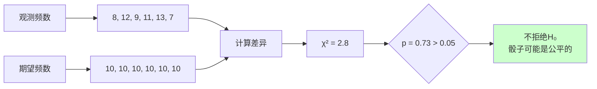

---

## **五、独立性检验（Test of Independence）**

### 什么是独立性检验？

检验**两个分类变量**之间是否**相互独立 (independent)**。

### 独立性的含义

**统计独立 (statistical independence)**：一个变量的分布不受另一个变量的影响。

**数学定义**：
$$P(A \cap B) = P(A) \times P(B)$$

**直观理解**：
- 知道一个人的性别，不能帮助预测其专业选择 → 独立
- 知道一个人的性别，可以更好地预测其专业选择 → 不独立（有关联）

---

### 适用场景

| 研究问题 | 变量 1 | 变量 2 |
|---------|--------|--------|
| 性别与专业选择是否有关？ | 性别（男/女） | 专业（理工/文科） |
| 吸烟与肺癌是否有关？ | 吸烟状态（吸烟/不吸烟） | 肺癌（有/无） |
| 教育水平与收入是否有关？ | 教育水平（高中/本科/研究生） | 收入（低/中/高） |
| 治疗方法与治愈率是否有关？ | 治疗方法（A/B/C） | 结果（治愈/未治愈） |

---

### 列联表（Contingency Table）

独立性检验使用**列联表 (contingency table / cross-tabulation)** 展示数据。

**2×2 列联表示例**：

|  | 专业 A | 专业 B | 行总计 |
|---|--------|--------|--------|
| **男性** | a | b | a + b |
| **女性** | c | d | c + d |
| **列总计** | a + c | b + d | n |

**r×c 列联表**：
- r 行 (rows)
- c 列 (columns)
- r × c 个单元格 (cells)

---

### 期望频数的计算

**公式**：

$$E_{ij} = \frac{(\text{第 i 行总计}) \times (\text{第 j 列总计})}{\text{总样本量}}$$

$$E_{ij} = \frac{R_i \times C_j}{n}$$

**逻辑**：
- 如果两个变量独立，单元格的期望频数 = 边际概率的乘积
- 例如：P(男性且专业A) = P(男性) × P(专业A)

---

### 完整示例：性别与专业选择

#### 研究问题

调查 200 名大学生的性别和专业选择，检验性别与专业选择是否独立。

#### 数据（列联表）

|  | 理工科 | 文科 | 行总计 |
|---|--------|------|--------|
| **男性** | 60 | 40 | 100 |
| **女性** | 30 | 70 | 100 |
| **列总计** | 90 | 110 | 200 |

---

#### Step 1: 建立假设

**原假设 (H₀)**：性别与专业选择相互独立
$$H_0: \text{性别与专业选择无关联}$$

**备择假设 (H₁)**：性别与专业选择不独立
$$H_1: \text{性别与专业选择有关联}$$

**显著性水平**：α = 0.05

---

#### Step 2: 计算期望频数

**公式**：$E_{ij} = \frac{R_i \times C_j}{n}$

**男性-理工科**：
$$E_{11} = \frac{100 \times 90}{200} = 45$$

**男性-文科**：
$$E_{12} = \frac{100 \times 110}{200} = 55$$

**女性-理工科**：
$$E_{21} = \frac{100 \times 90}{200} = 45$$

**女性-文科**：
$$E_{22} = \frac{100 \times 110}{200} = 55$$

---

**期望频数表**：

|  | 理工科 | 文科 | 行总计 |
|---|--------|------|--------|
| **男性** | 45 | 55 | 100 |
| **女性** | 45 | 55 | 100 |
| **列总计** | 90 | 110 | 200 |

---

#### Step 3: 计算 χ² 统计量

$$\chi^2 = \sum_{i=1}^{r} \sum_{j=1}^{c} \frac{(O_{ij} - E_{ij})^2}{E_{ij}}$$

**逐个单元格计算**：

| 单元格 | O | E | O - E | (O - E)² | (O - E)²/E |
|--------|---|---|-------|----------|-----------|
| 男-理工 | 60 | 45 | 15 | 225 | 5.00 |
| 男-文科 | 40 | 55 | -15 | 225 | 4.09 |
| 女-理工 | 30 | 45 | -15 | 225 | 5.00 |
| 女-文科 | 70 | 55 | 15 | 225 | 4.09 |
| **总计** | | | | | **χ² = 18.18** |

---

#### Step 4: 确定自由度

$$df = (r - 1) \times (c - 1) = (2 - 1) \times (2 - 1) = 1$$

**解释**：
- 2 行 2 列的列联表
- 知道 1 个单元格的频数后，其他 3 个可以通过边际总计推算出来

---

#### Step 5: 查找临界值

查 χ² 分布表，df = 1, α = 0.05：

$$\chi^2_{critical} = 3.84$$

或者计算 p-value：

$$p = P(\chi^2_{(1)} > 18.18) < 0.001$$

---

#### Step 6: 做出决策

**判断标准**：
- χ² = 18.18 > χ²_critical = 3.84
- p < 0.001 < α = 0.05

**结论**：**拒绝原假设 (reject H₀)**

**解释**：性别与专业选择之间存在显著关联 (significant association)。

**具体模式**：
- 男性更倾向选择理工科（60 vs 45 期望）
- 女性更倾向选择文科（70 vs 55 期望）

---

### 独立性检验的流程图

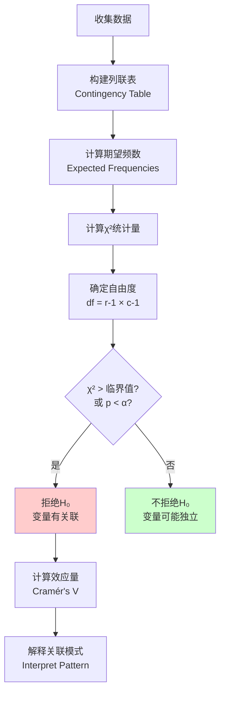

---

## **六、同质性检验（Test of Homogeneity）**

### 什么是同质性检验？

检验**一个分类变量在多个总体中的分布**是否相同。

### 与独立性检验的区别

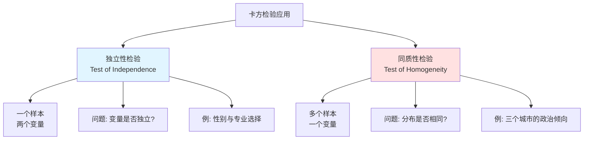

| 特征 | 独立性检验 | 同质性检验 |
|------|-----------|-----------|
| **样本数** | 1 个样本 | 多个独立样本 |
| **变量数** | 2 个分类变量 | 1 个分类变量 |
| **研究问题** | 两个变量是否独立？ | 多个总体的分布是否相同？ |
| **抽样方式** | 随机抽样，同时观测两个变量 | 从不同总体分别抽样 |
| **例子** | 性别与专业选择是否有关？ | 三个城市的政治倾向是否一致？ |

**重要**：虽然研究问题不同，但**计算方法完全相同**！

---

### 适用场景

| 研究问题 | 总体 | 分类变量 |
|---------|------|---------|
| 三个城市的政治倾向是否一致？ | 城市 A, B, C | 政治倾向（左/中/右） |
| 不同年龄组的产品偏好是否相同？ | 年轻/中年/老年 | 产品偏好（A/B/C）| 不同医院的治疗效果是否一致？ | 医院 1, 2, 3 | 治疗结果（治愈/好转/无效） |
| 不同地区的疾病分布是否相同？ | 北方/南方/西部 | 疾病类型（A/B/C/D） |

---

### 完整示例：三个城市的政治倾向

#### 研究问题

从三个城市各随机抽取 100 名选民，调查其政治倾向，检验三个城市的政治倾向分布是否相同。

#### 数据（列联表）

|  | 左翼 | 中间 | 右翼 | 行总计 |
|---|------|------|------|--------|
| **城市 A** | 35 | 40 | 25 | 100 |
| **城市 B** | 25 | 50 | 25 | 100 |
| **城市 C** | 45 | 30 | 25 | 100 |
| **列总计** | 105 | 120 | 75 | 300 |

---

#### Step 1: 建立假设

**原假设 (H₀)**：三个城市的政治倾向分布相同
$$H_0: p_{A,左} = p_{B,左} = p_{C,左}, \; p_{A,中} = p_{B,中} = p_{C,中}, \; p_{A,右} = p_{B,右} = p_{C,右}$$

**备择假设 (H₁)**：至少有一个城市的政治倾向分布不同
$$H_1: \text{至少存在一对城市的分布不同}$$

**显著性水平**：α = 0.05

---

#### Step 2: 计算期望频数

**公式**：$E_{ij} = \frac{R_i \times C_j}{n}$

**城市 A - 左翼**：
$$E_{11} = \frac{100 \times 105}{300} = 35$$

**城市 A - 中间**：
$$E_{12} = \frac{100 \times 120}{300} = 40$$

**城市 A - 右翼**：
$$E_{13} = \frac{100 \times 75}{300} = 25$$

**同理计算其他单元格**：

|  | 左翼 | 中间 | 右翼 |
|---|------|------|------|
| **城市 A** | 35 | 40 | 25 |
| **城市 B** | 35 | 40 | 25 |
| **城市 C** | 35 | 40 | 25 |

---

#### Step 3: 计算 χ² 统计量

| 单元格 | O | E | O - E | (O - E)² | (O - E)²/E |
|--------|---|---|-------|----------|-----------|
| A-左翼 | 35 | 35 | 0 | 0 | 0.00 |
| A-中间 | 40 | 40 | 0 | 0 | 0.00 |
| A-右翼 | 25 | 25 | 0 | 0 | 0.00 |
| B-左翼 | 25 | 35 | -10 | 100 | 2.86 |
| B-中间 | 50 | 40 | 10 | 100 | 2.50 |
| B-右翼 | 25 | 25 | 0 | 0 | 0.00 |
| C-左翼 | 45 | 35 | 10 | 100 | 2.86 |
| C-中间 | 30 | 40 | -10 | 100 | 2.50 |
| C-右翼 | 25 | 25 | 0 | 0 | 0.00 |
| **总计** | | | | | **χ² = 10.72** |

---

#### Step 4: 确定自由度

$$df = (r - 1) \times (c - 1) = (3 - 1) \times (3 - 1) = 4$$

**解释**：
- 3 个城市（行）
- 3 种政治倾向（列）
- df = 2 × 2 = 4

---

#### Step 5: 查找临界值

查 χ² 分布表，df = 4, α = 0.05：

$$\chi^2_{critical} = 9.49$$

计算 p-value：

$$p = P(\chi^2_{(4)} > 10.72) \approx 0.03$$

---

#### Step 6: 做出决策

**判断标准**：
- χ² = 10.72 > χ²_critical = 9.49
- p = 0.03 < α = 0.05

**结论**：**拒绝原假设 (reject H₀)**

**解释**：三个城市的政治倾向分布存在显著差异。

**具体模式**：
- **城市 A**：分布较均衡
- **城市 B**：中间派比例最高（50%）
- **城市 C**：左翼比例最高（45%）

---

### 同质性检验的可视化

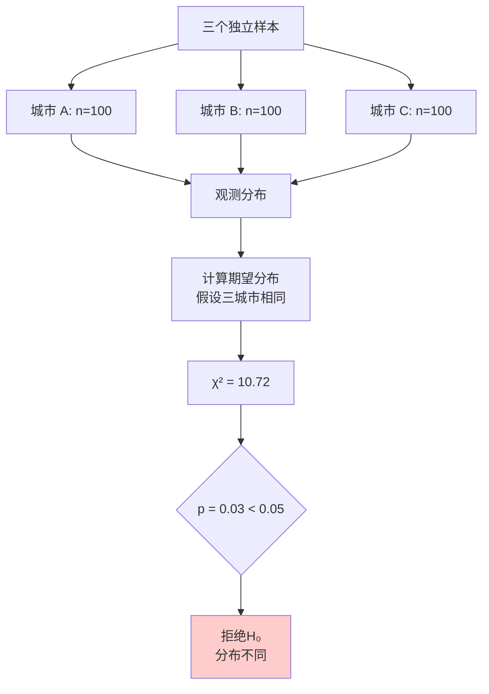

---

## **七、卡方检验的前提假设与注意事项**

### 前提假设 (Assumptions)

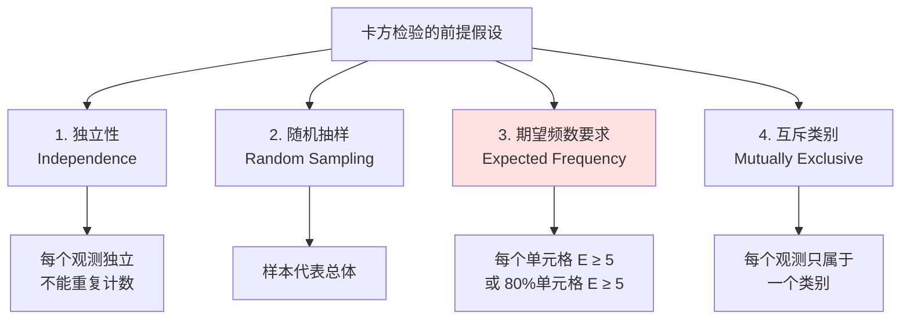

---

### 1. 独立性假设 (Independence Assumption)

**要求**：每个观测值必须相互独立。

**违反的例子**：
- ❌ 同一个人被重复计数
- ❌ 配对数据（如夫妻、双胞胎）
- ❌ 聚类数据（如同一班级的学生）

**正确做法**：
- ✅ 每个个体只计数一次
- ✅ 使用随机抽样
- ✅ 对于配对数据，使用 **McNemar 检验 (McNemar's Test)**

---

### 2. 期望频数要求 (Expected Frequency Requirement)

**经验法则 (Rule of Thumb)**：

**严格标准**：
- 所有单元格的期望频数 E ≥ 5

**宽松标准**：
- 至少 80% 的单元格 E ≥ 5
- 没有单元格 E < 1

**为什么有这个要求？**
- 卡方分布是**连续分布 (continuous distribution)**
- 频数是**离散的 (discrete)**
- 期望频数太小时，连续分布的近似不准确

---

### 期望频数不足时的解决方案

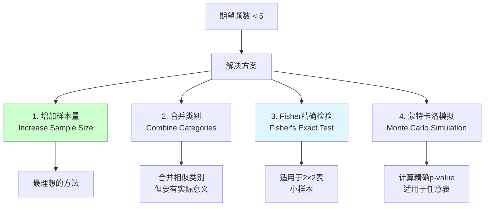

---

### Fisher 精确检验 (Fisher's Exact Test)

**适用场景**：
- 2×2 列联表
- 样本量小，期望频数 < 5

**原理**：
- 计算所有可能的列联表配置
- 在边际总计固定的条件下
- 计算观测到当前或更极端结果的精确概率

**例子**：

|  | 治愈 | 未治愈 | 总计 |
|---|------|--------|------|
| **治疗组** | 8 | 2 | 10 |
| **对照组** | 3 | 7 | 10 |
| **总计** | 11 | 9 | 20 |

期望频数：
- 治疗组-治愈：E = 10×11/20 = 5.5
- 部分单元格期望频数 < 5

**使用 Fisher 精确检验**：
- 计算精确 p-value
- 不依赖卡方近似

---

### 3. 样本量要求 (Sample Size)

**最小样本量**：
- 没有固定规则
- 取决于列联表的大小和期望效应量

**经验法则**：
- **2×2 表**：总样本量至少 20-40
- **3×3 表**：总样本量至少 50-100
- **更大的表**：需要更多样本

**功效分析 (Power Analysis)**：
- 使用 G*Power 等软件
- 根据期望效应量、α、功效 (1-β) 计算所需样本量

---

### 4. 数据类型要求

**适用数据**：
- ✅ **频数数据 (frequency data / count data)**
- ✅ 分类变量 (categorical variables)
- ✅ 名义变量 (nominal variables)
- ✅ 有序变量 (ordinal variables)

**不适用数据**：
- ❌ **比例数据 (proportion data)**
- ❌ 连续变量 (continuous variables)
- ❌ 百分比 (percentages)

**常见错误**：

❌ **错误示例**：
|  | 治愈率 |
|---|--------|
| **治疗组** | 80% |
| **对照组** | 60% |

✅ **正确示例**：
|  | 治愈 | 未治愈 |
|---|------|--------|
| **治疗组** | 8 | 2 |
| **对照组** | 6 | 4 |

---

## **八、效应量 (Effect Size)**

### 为什么需要效应量？

**p-value 的局限性**：
- 只告诉我们差异是否显著
- 不告诉我们差异有多大
- 受样本量影响：样本量大时，微小差异也可能显著

**效应量的价值**：
- 衡量关联的**强度 (strength)**
- 不受样本量影响
- 便于跨研究比较

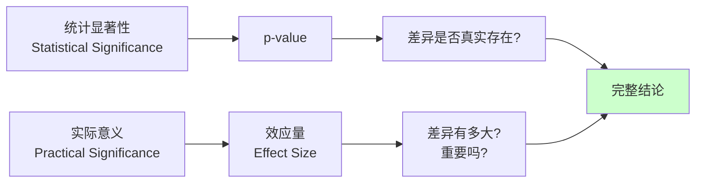

---

### 常用效应量指标

#### 1. Phi 系数 (Phi Coefficient, φ)

**适用**：2×2 列联表

**公式**：

$$\phi = \sqrt{\frac{\chi^2}{n}}$$

**取值范围**：0 ≤ φ ≤ 1

**解释标准** (Cohen, 1988)：
- **0.10**：小效应 (small effect)
- **0.30**：中等效应 (medium effect)
- **0.50**：大效应 (large effect)

---

#### 2. Cramér's V

**适用**：任意 r×c 列联表（最常用）

**公式**：

$$V = \sqrt{\frac{\chi^2}{n \times \min(r-1, c-1)}}$$

**符号说明**：
- n：总样本量
- r：行数
- c：列数
- min(r-1, c-1)：行数-1 和列数-1 中的较小值

**取值范围**：0 ≤ V ≤ 1

**解释标准**：

| 列联表大小 | 小效应 | 中等效应 | 大效应 |
|-----------|--------|---------|--------|
| **2×2** | 0.10 | 0.30 | 0.50 |
| **3×3** | 0.07 | 0.21 | 0.35 |
| **4×4** | 0.06 | 0.17 | 0.29 |

---

#### 3. 列联系数 (Contingency Coefficient, C)

**公式**：

$$C = \sqrt{\frac{\chi^2}{\chi^2 + n}}$$

**取值范围**：0 ≤ C < 1

**缺点**：
- 最大值取决于列联表大小
- 不同大小的表无法直接比较
- **不推荐使用**，建议用 Cramér's V

---

### 效应量计算示例

#### 示例 1：性别与专业选择（2×2 表）

前面的例子：
- χ² = 18.18
- n = 200
- r = 2, c = 2

**Phi 系数**：
$$\phi = \sqrt{\frac{18.18}{200}} = \sqrt{0.0909} = 0.30$$

**Cramér's V**：
$$V = \sqrt{\frac{18.18}{200 \times \min(1, 1)}} = \sqrt{\frac{18.18}{200}} = 0.30$$

**解释**：中等效应，性别与专业选择有中等程度的关联。

---

#### 示例 2：三城市政治倾向（3×3 表）

前面的例子：
- χ² = 10.72
- n = 300
- r = 3, c = 3

**Cramér's V**：
$$V = \sqrt{\frac{10.72}{300 \times \min(2, 2)}} = \sqrt{\frac{10.72}{600}} = \sqrt{0.0179} = 0.13$$

**解释**：小到中等效应，三个城市的政治倾向差异较小。

---

### 效应量的可视化

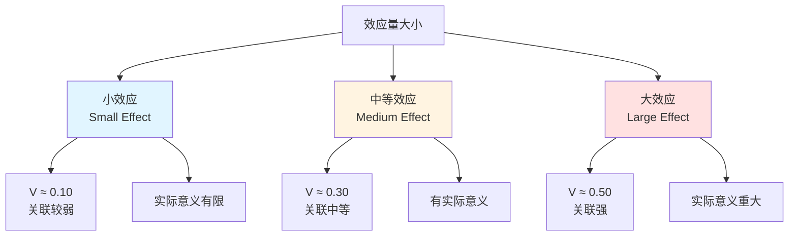

---

## **九、卡方检验的可视化**

### 1. 条形图 (Bar Chart)

**适用**：展示各类别的频数分布

**拟合优度检验示例**：

```
频数
 14 |
 12 |     ■
 10 | ■   ■   ■   ■   ■
  8 | ■   ■   ■   ■   ■   ■
  6 | ■   ■   ■   ■   ■   ■
  4 | ■   ■   ■   ■   ■   ■
  2 | ■   ■   ■   ■   ■   ■
  0 |_________________________
      1   2   3   4   5   6
           骰子点数

  ■ 观测频数 (Observed)
  --- 期望频数 (Expected = 10)
```

---

### 2. 分组条形图 (Grouped Bar Chart)

**适用**：独立性检验、同质性检验

**性别与专业选择示例**：

```
频数
 70 |
 60 |     ■■■
 50 |     ■■■
 40 |     ■■■  □□□
 30 |     ■■■  □□□  ■■■
 20 |     ■■■  □□□  ■■■  □□□
 10 |     ■■■  □□□  ■■■  □□□
  0 |_________________________________
         理工科      文科
         
  ■■■ 男性 (Male)
  □□□ 女性 (Female)
```

---

### 3. 堆叠条形图 (Stacked Bar Chart)

**适用**：展示比例分布

```
100%|
    |  □□□□□□□□□□□□□□□□□□□□
 80%|  □□□□□□□□□□□□□□□□□□□□
    |  □□□□□□□□□□□□□□□□□□□□
 60%|  ■■■■■■■■■■■■■■■■■■■■
    |  ■■■■■■■■■■■■■■■■■■■■
 40%|  ■■■■■■■■■■■■■■■■■■■■
    |  ■■■■■■■■■■■■■■■■■■■■
 20%|  ■■■■■■■■■■■■■■■■■■■■
    |  ■■■■■■■■■■■■■■■■■■■■
  0%|_________________________________
         男性              女性
         
  ■■■ 理工科 (60%)    □□□ 文科 (40%)
  ■■■ 理工科 (30%)    □□□ 文科 (70%)
```

---

### 4. 马赛克图 (Mosaic Plot)

**适用**：展示列联表的结构和关联

**特点**：
- 矩形面积 = 频数
- 宽度 = 行边际分布
- 高度 = 列边际分布
- 颜色 = 残差 (residuals)

```
        理工科              文科
    |-------------|---------------------|
    |             |                     |
    |   男性-理工  |      男性-文科       |  男性
    |   (60)      |       (40)          |  50%
    |   +残差     |       -残差         |
    |-------------|---------------------|
    |             |                     |
    | 女性-理工    |      女性-文科       |  女性
    |   (30)      |       (70)          |  50%
    |   -残差     |       +残差         |
    |-------------|---------------------|
       45%              55%
```

**颜色编码**：
- 🔴 红色：观测频数 > 期望频数（正残差）
- 🔵 蓝色：观测频数 < 期望频数（负残差）
- ⚪ 白色：观测频数 ≈ 期望频数

---

### 5. 热图 (Heatmap)

**适用**：大型列联表

```
         左翼    中间    右翼
城市A    35     40     25     颜色深浅
         ■■     ■■■    ■      代表频数
                              
城市B    25     50     25     ■ = 低频数
         ■      ■■■■   ■      ■■ = 中频数
                              ■■■ = 高频数
城市C    45     30     25
         ■■■    ■■     ■
```

---

### 6. 残差图 (Residual Plot)

**标准化残差 (Standardized Residuals)**：

$$r_{ij} = \frac{O_{ij} - E_{ij}}{\sqrt{E_{ij}}}$$

**调整残差 (Adjusted Residuals)**：

$$r_{ij}^{adj} = \frac{O_{ij} - E_{ij}}{\sqrt{E_{ij}(1 - p_{i.})(1 - p_{.j})}}$$

**解释**：
- |r| > 2：该单元格对 χ² 贡献较大
- |r| > 3：非常显著的偏离

**可视化**：

```
调整残差
  +3 |              ●
     |
  +2 |        ●
     |
  +1 |
     |___●_________●________
   0 |
     |
  -1 |
     |        ●
  -2 |
     |              ●
  -3 |
     |_________________________
       男-理工 男-文科 女-理工 女-文科
```

---

## **十、卡方检验与其他检验的比较**

### 1. 卡方检验 vs t 检验

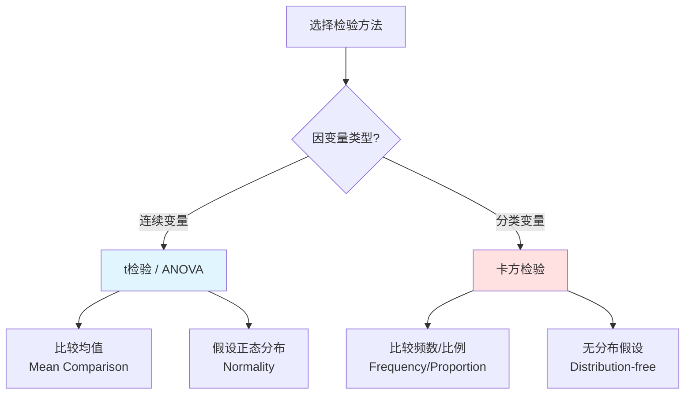

| 特征 | t 检验 | 卡方检验 |
|------|--------|---------|
| **因变量** | 连续变量 | 分类变量 |
| **比较对象** | 均值 | 频数/比例 |
| **参数/非参数** | 参数检验 | 非参数检验 |
| **分布假设** | 正态分布 | 无要求 |
| **样本量要求** | 较小（n≥30） | 较大（期望频数≥5） |
| **例子** | 比较男女身高均值 | 比较男女专业选择比例 |

---

### 2. 卡方检验 vs Fisher 精确检验

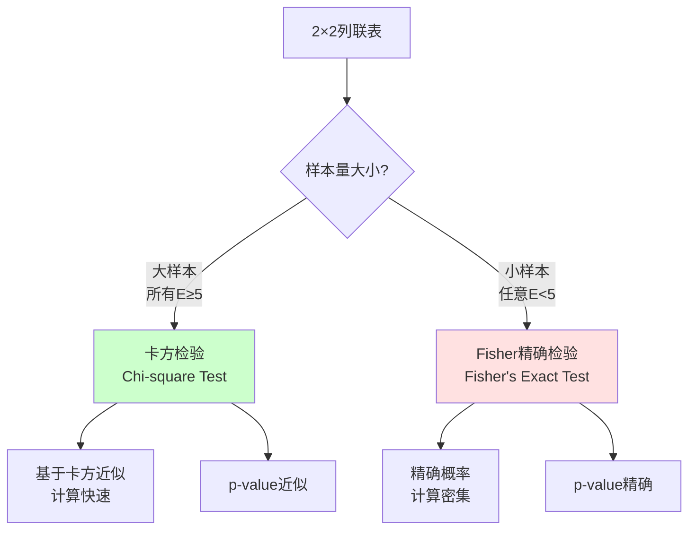

| 特征 | 卡方检验 | Fisher 精确检验 |
|------|---------|----------------|
| **适用表格** | 任意 r×c | 主要用于 2×2 |
| **样本量** | 大样本 | 小样本 |
| **计算方法** | 近似 | 精确 |
| **计算速度** | 快 | 慢（大样本时） |
| **p-value** | 近似值 | 精确值 |
| **推荐使用** | E≥5 时 | E<5 时 |

---

### 3. 卡方检验 vs McNemar 检验

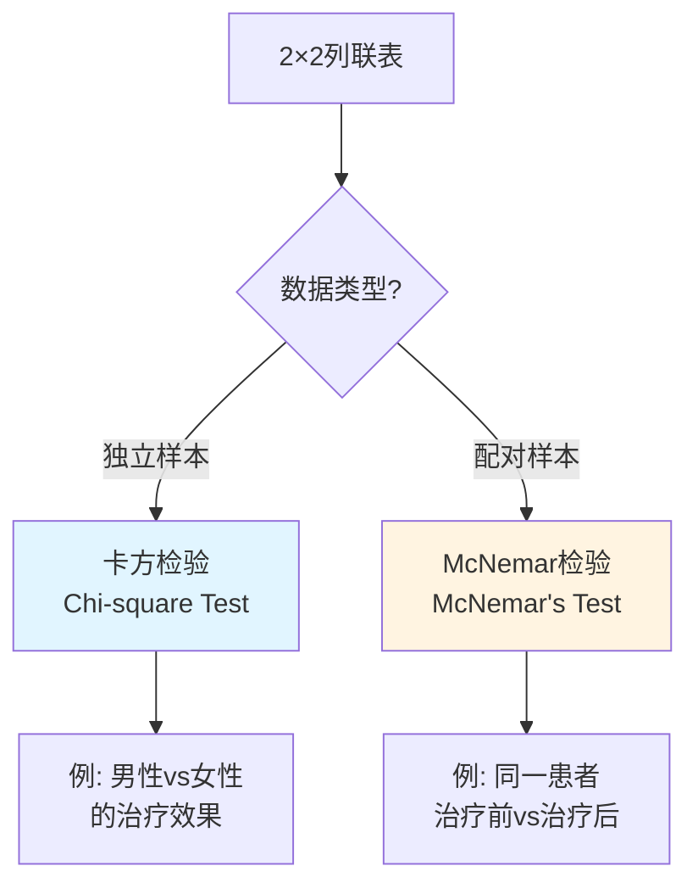

**McNemar 检验适用场景**：
- 配对数据 (paired data)
- 前后测试 (before-after)
- 匹配病例对照研究 (matched case-control)

**例子**：

|  | 治疗后改善 | 治疗后未改善 |
|---|-----------|-------------|
| **治疗前改善** | a | b |
| **治疗前未改善** | c | d |

**McNemar 统计量**：

$$\chi^2 = \frac{(b - c)^2}{b + c}$$

只关注**不一致的配对 (discordant pairs)**：b 和 c

---

### 4. 卡方检验 vs Cochran-Mantel-Haenszel 检验

**CMH 检验 (Cochran-Mantel-Haenszel Test)**：
- 控制第三个变量的影响
- 检验分层后的关联

**例子**：

研究吸烟与肺癌的关系，但需要控制年龄的影响。

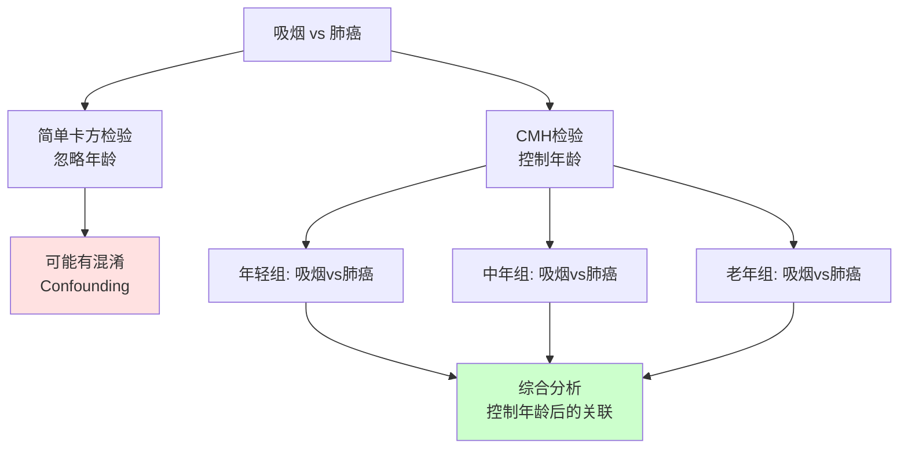

---

### 5. 卡方检验 vs 逻辑回归

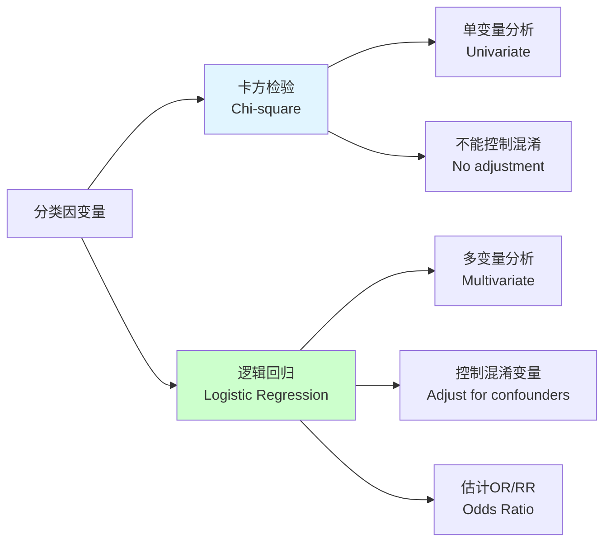

| 特征 | 卡方检验 | 逻辑回归 |
|------|---------|---------|
| **变量数** | 通常 1-2 个 | 可以多个 |
| **控制混淆** | 不能 | 可以 |
| **效应量** | Cramér's V | Odds Ratio |
| **连续自变量** | 需要分类 | 可以直接使用 |
| **复杂度** | 简单 | 复杂 |
| **解释性** | 直观 | 需要理解OR |

**建议**：
- 初步探索：卡方检验
- 深入分析：逻辑回归

---

## **十一、卡方检验的完整报告示例**

### APA 格式报告

#### 示例 1：独立性检验

**研究问题**：性别与专业选择是否有关？

**结果报告**：

> 使用卡方独立性检验 (chi-square test of independence) 分析性别与专业选择之间的关系。结果显示，性别与专业选择之间存在显著关联，χ²(1, N = 200) = 18.18, p < .001, Cramér's V = 0.30。具体而言，男性更倾向选择理工科（60% vs 30%），而女性更倾向选择文科（70% vs 40%）。效应量为中等，表明性别对专业选择有实际影响。

**表格**：

**表 1**  
*性别与专业选择的列联表*

|  | 理工科 | 文科 | 总计 |
|---|--------|------|------|
| 男性 | 60 (60%) | 40 (40%) | 100 |
| 女性 | 30 (30%) | 70 (70%) | 100 |
| 总计 | 90 (45%) | 110 (55%) | 200 |

*注*：χ²(1) = 18.18, p < .001, V = 0.30

---

#### 示例 2：拟合优度检验

**研究问题**：骰子是否公平？

**结果报告**：

> 使用卡方拟合优度检验 (chi-square goodness-of-fit test) 检验骰子的公平性。在 60 次投掷中，各点数的观测频数与期望频数（均为 10）的差异不显著，χ²(5, N = 60) = 2.80, p = .73。因此，没有足够证据拒绝骰子公平的假设。

---

### 完整的研究报告结构

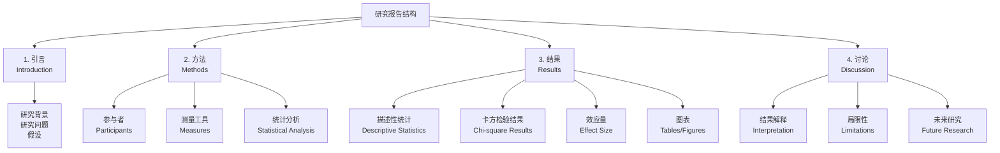

---

### 方法部分 (Methods Section)

**参与者 (Participants)**：
> 本研究共招募 200 名大学生（男性 100 名，女性 100 名），年龄范围 18-22 岁（M = 20.1, SD = 1.3）。参与者通过随机抽样从某大学学生名单中选取。

**测量 (Measures)**：
> 收集参与者的性别（男性/女性）和专业选择（理工科/文科）信息。

**统计分析 (Statistical Analysis)**：
> 使用卡方独立性检验分析性别与专业选择之间的关联。显著性水平设定为 α = .05（双侧检验）。计算 Cramér's V 作为效应量指标。所有分析使用 R 4.3.0 软件完成。

---

### 结果部分 (Results Section)

**描述性统计**：
> 表 1 展示了性别与专业选择的列联表。在 100 名男性中，60 名（60%）选择理工科，40 名（40%）选择文科。在 100 名女性中，30 名（30%）选择理工科，70 名（70%）选择文科。

**推断统计**：
> 卡方检验结果显示，性别与专业选择之间存在显著关联，χ²(1, N = 200) = 18.18, p < .001。Cramér's V = 0.30，表明中等效应量。

**残差分析**：
> 标准化残差分析显示，男性-理工科单元格（r = +2.24）和女性-文科单元格（r = +2.24）的观测频数显著高于期望频数，而男性-文科（r = -2.02）和女性-理工科（r = -2.02）的观测频数显著低于期望频数。

---

### 讨论部分 (Discussion Section)

**结果解释**：
> 研究结果支持性别与专业选择存在关联的假设。男性显著更倾向选择理工科，而女性显著更倾向选择文科。这一发现与先前研究一致（Smith et al., 2020），可能反映了社会性别角色期望、兴趣差异或教育环境的影响。

**实际意义**：
> 中等效应量（V = 0.30）表明，虽然性别与专业选择有关联，但性别并非唯一决定因素。其他因素如个人兴趣、家庭背景、职业规划等也可能发挥重要作用。

**局限性**：
> 本研究存在以下局限：（1）样本仅来自一所大学，可能限制结果的推广性；（2）仅考察性别与专业选择的关联，未控制其他潜在混淆变量；（3）横断面设计无法推断因果关系。

**未来研究方向**：
> 未来研究可以：（1）扩大样本范围，包括多所大学；（2）使用多变量分析（如逻辑回归）控制混淆变量；（3）采用纵向设计追踪专业选择的变化过程。

---

## **十二、卡方检验的常见错误与陷阱**

### 错误 1：使用比例而非频数

❌ **错误做法**：

|  | 治愈率 |
|---|--------|
| 治疗组 | 80% |
| 对照组 | 60% |

✅ **正确做法**：

|  | 治愈 | 未治愈 | 总计 |
|---|------|--------|------|
| 治疗组 | 8 | 2 | 10 |
| 对照组 | 6 | 4 | 10 |

**原因**：卡方检验需要**原始频数 (raw frequencies)**，不能用比例或百分比。

---

### 错误 2：期望频数过小时仍使用卡方检验

❌ **错误做法**：

|  | 是 | 否 | 总计 |
|---|----|----|------|
| 组 A | 2 | 8 | 10 |
| 组 B | 1 | 9 | 10 |

期望频数：E = 1.5（< 5）

仍然使用卡方检验 → **不准确**

✅ **正确做法**：
- 使用 **Fisher 精确检验**
- 或增加样本量
- 或合并类别（如果合理）

---

### 错误 3：多重比较未校正

**场景**：对同一数据集进行多次卡方检验

❌ **错误做法**：
- 检验 1：性别 vs 专业 A（p = .04）
- 检验 2：性别 vs 专业 B（p = .03）
- 检验 3：性别 vs 专业 C（p = .02）
- 结论：所有关联都显著

**问题**：**Type I error 膨胀 (inflation)**

✅ **正确做法**：
- 使用 **Bonferroni 校正**：α_adjusted = α / k
  - 例如：α = .05, k = 3 → α_adjusted = .05/3 = .017
- 或使用 **FDR 校正 (False Discovery Rate)**
- 或使用**多分类变量的卡方检验**（一次性检验）

---

### 错误 4：混淆独立性检验与同质性检验

**关键区别**：

| 特征 | 独立性检验 | 同质性检验 |
|------|-----------|-----------|
| **抽样方式** | 一个样本，观测两个变量 | 多个独立样本，观测一个变量 |
| **研究问题** | 两个变量是否独立？ | 多个总体的分布是否相同？ |

**虽然计算方法相同，但研究设计和解释不同！**

---

### 错误 5：忽略效应量

❌ **错误报告**：
> "卡方检验显著，χ²(1) = 4.2, p = .04，因此性别与专业选择有关。"

✅ **正确报告**：
> "卡方检验显著，χ²(1) = 4.2, p = .04, V = 0.15，但效应量较小，表明关联较弱。"

**原因**：
- 大样本时，微小差异也可能显著
- 必须报告效应量评估实际意义

---

### 错误 6：因果推断

❌ **错误结论**：
> "性别导致专业选择差异。"

✅ **正确结论**：
> "性别与专业选择存在关联。"

**原因**：
- 卡方检验只能检验**关联 (association)**
- 不能推断**因果关系 (causation)**
- 可能存在**第三变量 (third variable)** 或**反向因果 (reverse causation)**


---

### 错误 7：违反独立性假设

❌ **错误场景**：
- 同一个人被计数多次
- 配对数据（如夫妻）
- 聚类数据（如同一班级的学生）

✅ **正确做法**：
- 确保每个观测独立
- 配对数据使用 **McNemar 检验**
- 聚类数据使用**多层模型 (multilevel models)**

---

### 错误 8：忽略单元格贡献

**问题**：只看总体 χ² 值，不分析哪些单元格贡献最大

✅ **正确做法**：
- 计算**标准化残差 (standardized residuals)**
- 识别哪些单元格偏离期望最大
- 解释具体的关联模式

**示例**：

| 单元格 | 观测 | 期望 | 残差 | 标准化残差 |
|--------|------|------|------|-----------|
| 男-理工 | 60 | 45 | +15 | **+2.24** |
| 男-文科 | 40 | 55 | -15 | -2.02 |
| 女-理工 | 30 | 45 | -15 | -2.24 |
| 女-文科 | 70 | 55 | +15 | **+2.02** |

**解释**：男性-理工科和女性-文科的观测频数显著高于期望。

---

## **十三、卡方检验的扩展与变体**

### 1. 趋势卡方检验 (Chi-square Test for Trend)

**适用**：有序分类变量 (ordinal variables)

**例子**：检验教育水平（高中/本科/研究生）与收入（低/中/高）是否存在线性趋势。

**Cochran-Armitage 趋势检验**：
- 检验是否存在单调趋势 (monotonic trend)
- 比普通卡方检验更有统计功效

**公式**：

$$\chi^2_{trend} = \frac{n \left( \sum_{i} s_i p_i - \bar{s} \right)^2}{\bar{p}(1-\bar{p}) \sum_{i} n_i (s_i - \bar{s})^2}$$

其中：
- s_i：第 i 组的得分（如 1, 2, 3）
- p_i：第 i 组的比例
- n_i：第 i 组的样本量

---

### 2. 分层卡方检验 (Stratified Chi-square Test)

**Cochran-Mantel-Haenszel (CMH) 检验**：
- 控制第三个变量（分层变量）
- 检验在控制分层变量后，两个变量是否仍有关联

**例子**：

研究吸烟与肺癌的关系，控制年龄。

```mermaid
graph TD
    A[总体关联] --> B[年轻组<br/>吸烟 vs 肺癌]
    A --> C[中年组<br/>吸烟 vs 肺癌]
    A --> D[老年组<br/>吸烟 vs 肺癌]
    
    B --> E[CMH统计量<br/>综合各层的关联]
    C --> E
    D --> E
    
    E --> F{控制年龄后<br/>关联仍显著?}
    
    style E fill:#ccffcc
```

**CMH 统计量**：

$$\chi^2_{CMH} = \frac{\left[ \sum_{k} (a_k - E[a_k]) \right]^2}{\sum_{k} Var(a_k)}$$

---

### 3. 精确检验的扩展

**Freeman-Halton 扩展**：
- Fisher 精确检验的推广
- 适用于 r×c 表（不限于 2×2）
- 计算所有可能表格的精确概率

**蒙特卡洛模拟 (Monte Carlo Simulation)**：
- 当精确计算太复杂时
- 通过模拟估计 p-value
- 适用于大型列联表

---

### 4. 加权卡方检验 (Weighted Chi-square Test)

**适用**：
- 样本来自不同总体，需要加权
- 调查数据中的抽样权重

**例子**：
- 全国调查中，不同地区的抽样比例不同
- 需要根据人口比例加权

---

# 卡方检验总结

## **核心概念**

**卡方检验 (Chi-square Test)** 是用于**分类变量**的非参数统计方法，通过比较**观测频数**与**期望频数**的差异来检验假设。

### 核心公式

$$\chi^2 = \sum \frac{(O - E)^2}{E}$$

- **O**：观测频数 (Observed frequency)
- **E**：期望频数 (Expected frequency)

---

## **三种主要类型**

```mermaid
graph TD
    A[卡方检验] --> B[拟合优度检验<br/>Goodness-of-Fit]
    A --> C[独立性检验<br/>Test of Independence]
    A --> D[同质性检验<br/>Test of Homogeneity]
    
    B --> B1[1个变量<br/>检验分布是否符合理论]
    C --> C1[2个变量<br/>检验是否相互独立]
    D --> D1[多个总体<br/>检验分布是否相同]
```

| 类型 | 变量 | 研究问题 | 例子 |
|------|------|---------|------|
| **拟合优度** | 1个分类变量 | 分布是否符合理论？ | 骰子是否公平？ |
| **独立性** | 2个分类变量 | 两变量是否独立？ | 性别与专业选择有关吗？ |
| **同质性** | 1个变量+多总体 | 不同总体分布是否相同？ | 三城市政治倾向一致吗？ |

---

## **检验步骤**

```mermaid
graph LR
    A[1.建立假设] --> B[2.计算期望频数]
    B --> C[3.计算χ²统计量]
    C --> D[4.确定自由度]
    D --> E[5.查找p-value]
    E --> F[6.做出决策]
```

### 自由度计算

- **拟合优度**：df = k - 1（k = 类别数）
- **独立性/同质性**：df = (r - 1) × (c - 1)（r = 行数，c = 列数）

### 决策标准

- **χ² > 临界值** 或 **p < α** → 拒绝原假设
- **χ² ≤ 临界值** 或 **p ≥ α** → 不拒绝原假设

---

## **前提假设（重要！）**

| 假设 | 要求 | 违反后果 |
|------|------|---------|
| **独立性** | 每个观测独立 | 结果无效 |
| **期望频数** | 所有单元格 E ≥ 5 | 使用Fisher精确检验 |
| **数据类型** | 必须是频数，不能是比例 | 结果错误 |
| **随机抽样** | 样本代表总体 | 推广性受限 |

---

## **效应量 (Effect Size)**

### Cramér's V（最常用）

$$V = \sqrt{\frac{\chi^2}{n \times \min(r-1, c-1)}}$$

### 解释标准

| 列联表 | 小效应 | 中等效应 | 大效应 |
|--------|--------|---------|--------|
| **2×2** | 0.10 | 0.30 | 0.50 |
| **3×3** | 0.07 | 0.21 | 0.35 |

**重要**：必须同时报告 p-value 和效应量！

---

## **常见错误**

❌ **使用比例而非频数**  
❌ **期望频数<5时仍用卡方检验**  
❌ **多重比较未校正**  
❌ **忽略效应量**  
❌ **推断因果关系**（只能说明关联）  
❌ **违反独立性假设**

---

## **与其他检验的选择**

```mermaid
graph TD
    A{数据类型?} --> B[连续变量]
    A --> C[分类变量]
    
    B --> D[t检验/ANOVA]
    
    C --> E{样本量?}
    E -->|大样本<br/>E≥5| F[卡方检验]
    E -->|小样本<br/>E<5| G[Fisher精确检验]
    
    C --> H{数据结构?}
    H -->|独立样本| F
    H -->|配对样本| I[McNemar检验]
```

---

## **完整报告模板**

> 使用卡方独立性检验分析[变量1]与[变量2]之间的关系。结果显示，两变量之间存在显著关联，χ²(df, N = n) = X.XX, p = .XXX, Cramér's V = X.XX。具体而言，[描述关联模式]。效应量为[小/中/大]，表明[实际意义解释]。

---

## **关键要点总结**

1. **适用于分类变量**，比较频数差异
2. **三种类型**：拟合优度、独立性、同质性
3. **必须检查前提**：独立性、期望频数≥5
4. **必须报告效应量**：Cramér's V
5. **只能说明关联**，不能推断因果
6. **小样本用Fisher精确检验**
7. **配对数据用McNemar检验**
8. **多重比较需校正α水平**

---

## **快速决策树**

```mermaid
graph TD
    A[开始] --> B{变量类型?}
    B -->|连续| C[用t检验/ANOVA]
    B -->|分类| D{几个变量?}
    
    D -->|1个| E[拟合优度检验]
    D -->|2个| F{独立样本?}
    
    F -->|是| G{期望频数≥5?}
    F -->|否| H[McNemar检验]
    
    G -->|是| I[卡方独立性检验]
    G -->|否| J[Fisher精确检验]
    
    style I fill:#ccffcc
    style J fill:#ffe1e1
    style H fill:#fff4e1
```

---
