# Advance_Assessment 2

---

##  目录

- [ 项目整体架构](#-项目整体架构)
- [ 模块依赖关系](#-模块依赖关系)
- [ 类继承体系](#️-类继承体系)
- [ 完整数据流水线](#-完整数据流水线)
- [ 模块 1：load_raw_records](#-模块-1load_raw_records)
- [ 模块 2：build_posts](#️-模块-2build_posts)
- [ 模块 3：count_embedded_likes](#-模块-3count_embedded_likes)
- [ 模块 4：descendants_of](#-模块-4descendants_of)
- [ 模块 5：solution_remover 装饰器](#-模块-5solution_remover-装饰器)
- [ 端到端调用示例](#-端到端调用示例)

---

## Structure

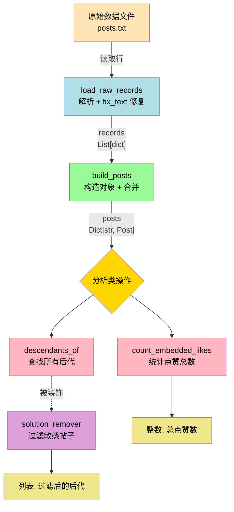

---

## 模块依赖关系

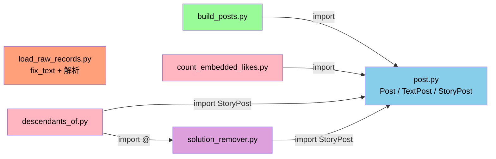

>  **`load_raw_records.py` 不依赖任何项目内模块**，纯文本处理；其他文件都围绕 `post.py` 的类展开。

---

##  类继承体系

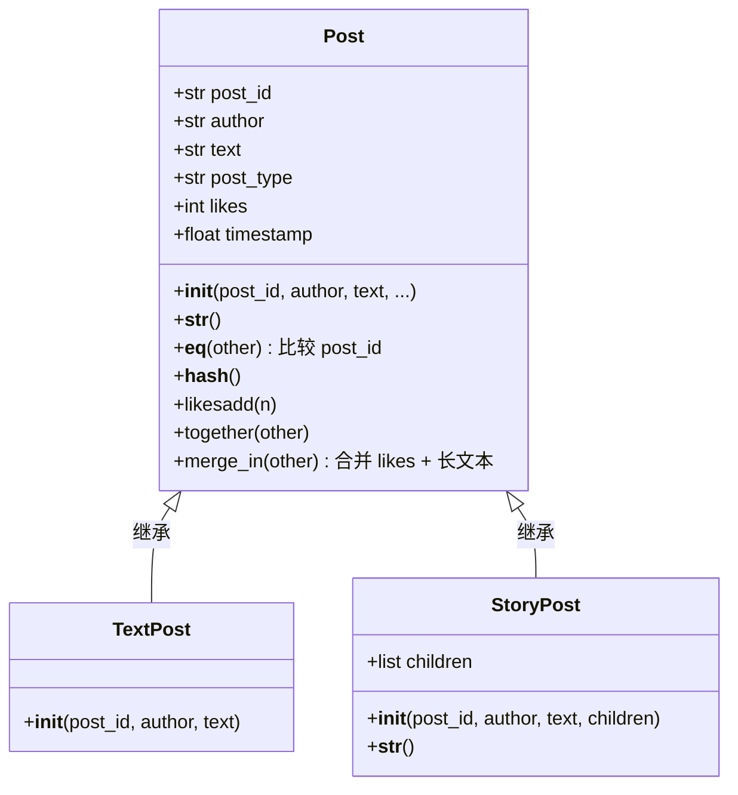

###  三种类的核心区别

| 类 | 是否有 children | 角色 | 在树中的位置 |
|----|----------------|------|-------------|
| `Post` | ❌ | 抽象基类 | 不直接使用 |
| `TextPost` | ❌ | 普通文本帖 |  叶子节点 |
| `StoryPost` | ✅ | 故事帖（可包含其他帖） |  分支节点 |

---

##  完整数据流水线

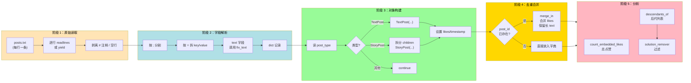

---

##  模块 1：load_raw_records

> **职责**：把 `posts.txt` 文件每一行原始字符串解析为 `dict`，并修复 `text` 字段。

 `fix_text` 字符修复算法

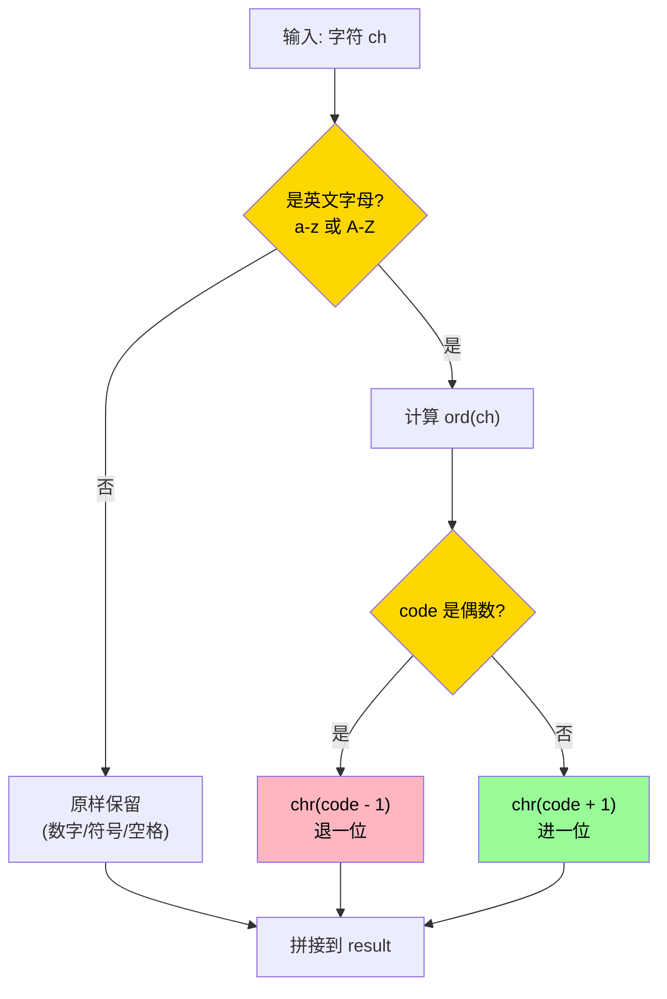

>  **示例**：`'b'`（ord=98，偶数）→ `'a'`；`'a'`（ord=97，奇数）→ `'b'`。这是个**对称变换**：fix_text(fix_text(x)) == x

###  `load_raw_records` 主流程

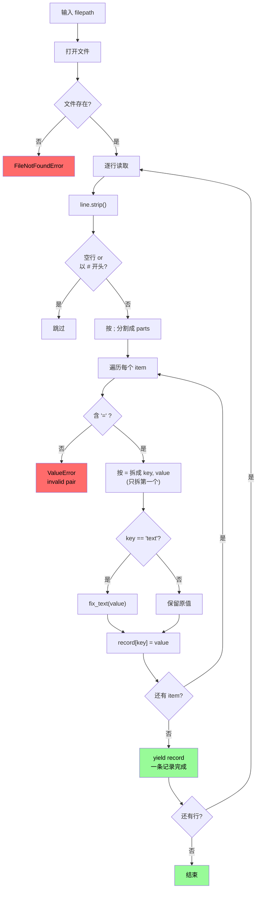

### 文件中的两个版本对比

| 版本 | 实现方式 | 特点 |
|------|---------|------|
| 第 1 个（被覆盖） | `f.readlines()` 一次读完 → `return list` | 占内存  |
| 第 2 个（生效） | `for line in f` + `yield record` | **生成器**，省内存 |

>  **注意**：Python 中**后定义的函数会覆盖前面的同名函数**，所以实际生效的是第二个 `yield` 版本！

---

##  模块 2：build_posts

> **职责**：把 `dict` 列表转换为 `Post` 对象字典，处理重复 ID 时合并。

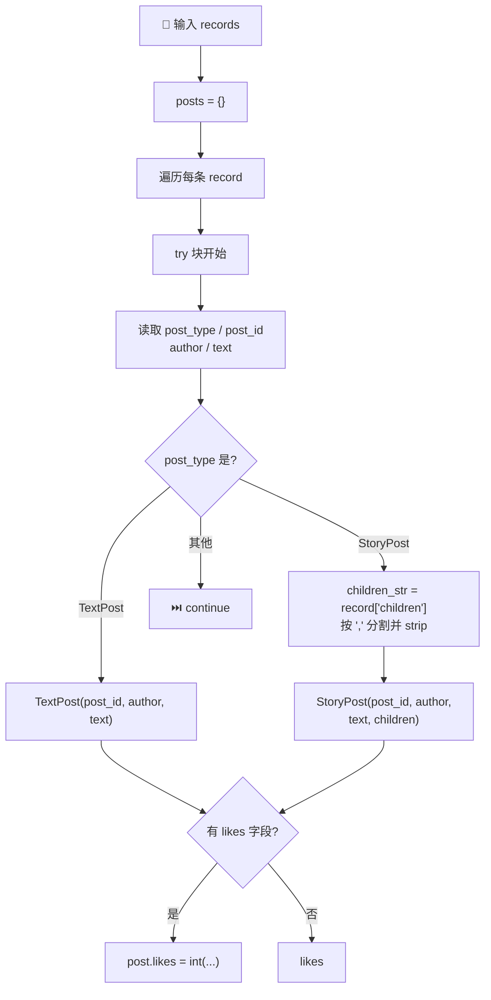

---

## 模块 3：`post.py`
[[Python 技术文档#第 7 章 面向对象编程]][[Computer science foundation note#第 18 章 面向对象核心概念]]
### `Post.__init__` 参数校验流程

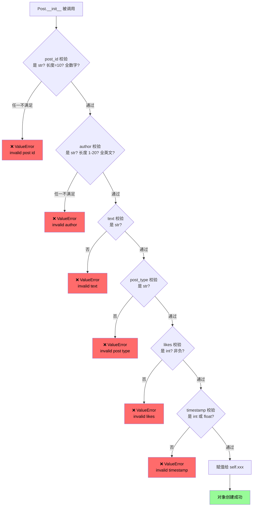

---

###  `StoryPost` 额外校验流程

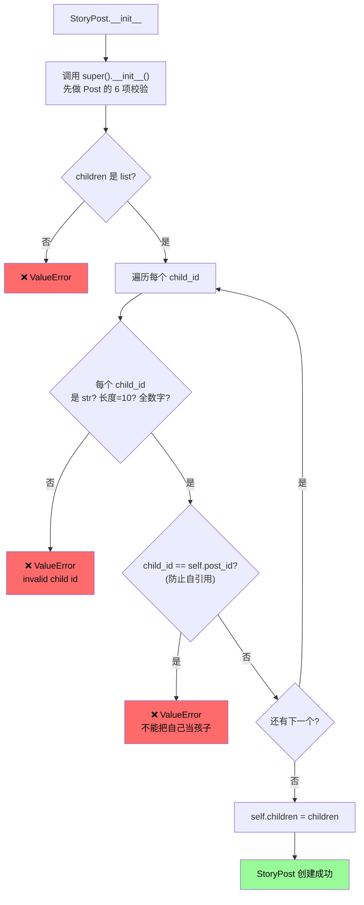

---

### `Post.merge_in` 合并方法流程

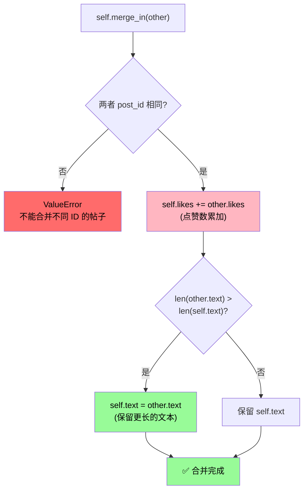

> 💡 **设计哲学**：合并时**点赞累加**（数据汇总），但**文本保留较长版本**（信息更全）。

---

## 模块4：`count_embedded_likes` — 统计点赞总数
[[Python 技术文档#**第 15 章：递归函数（Recursive Functions）**]][[Computer science foundation note#13.7 递归 vs 迭代（互相转换）]]
> **职责**：递归统计某个帖子**自己 + 所有后代**的总点赞数。

### 函数主流程

````mermaid

flowchart TD
    A[" count_embedded_likes<br/>post_id, posts"] --> B["post = posts[post_id]"]
    B --> C[" total = post.likes"]
    C --> D{"post 是 StoryPost?"}
    D -->|"否 叶子节点"| E[" 无孩子可遍历"]
    D -->|是| F["遍历 post.children"]
    F --> G["取出 child_id"]
    G --> H[" 递归调用<br/>count_embedded_likes"]
    H --> I["接收返回值 sub_total"]
    I --> J["total += sub_total"]
    J --> K{"还有下个 child?"}
    K -->|是| G
    K -->|否| L["所有孩子处理完毕"]
    E --> M[" return total"]
    L --> M

    style C fill:#FFD700,color:#000
    style H fill:#FFB6C1,color:#000
    style J fill:#98FB98,color:#000
    style M fill:#87CEEB,color:#000
```

````

---

###  递归调用栈示意（树形展开）

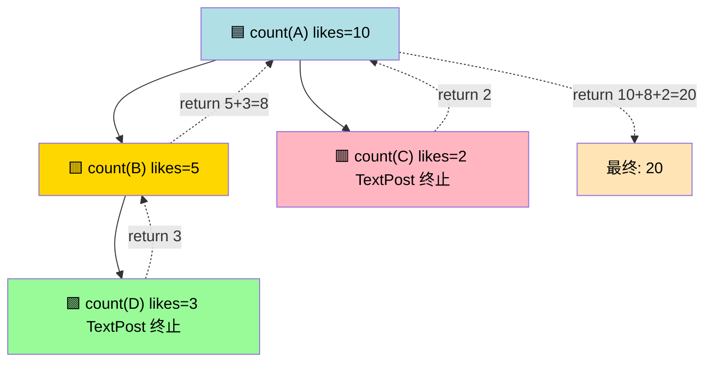

---

## 模块5：`descendants_of` — 后代查询
[[Python 技术文档#**第 15 章：递归函数（Recursive Functions）**]][[Computer science foundation note#13.7 递归 vs 迭代（互相转换）]]
> **职责**：递归收集某个帖子的所有**后代**帖子（去重 + 过滤无点赞 + 排除 solution）。

###  函数主流程

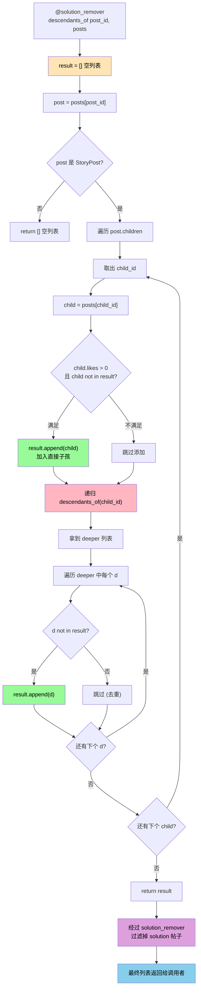

---

###  关键设计要点

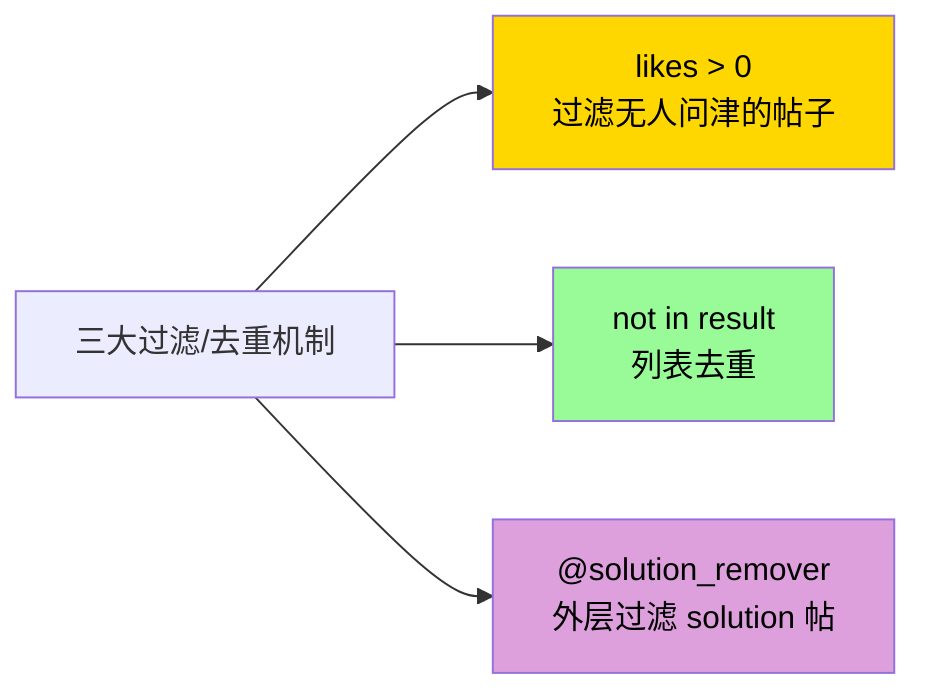

---

## 模块6： `solution_remover` — 装饰器过滤
[[Python 技术文档#**14.2 装饰器（Decorators）**]]

> **职责**：作为装饰器，**自动过滤掉返回列表中**任何 `text` 包含 "solution"（不区分大小写）的 `StoryPost`。

###  装饰器

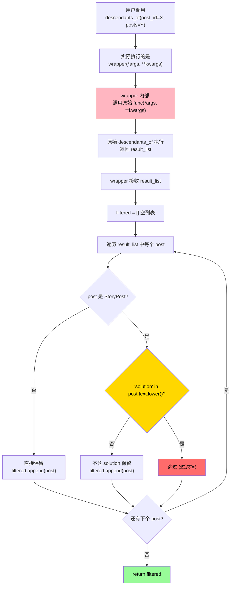

---

### 装饰器结构（洋葱模型）

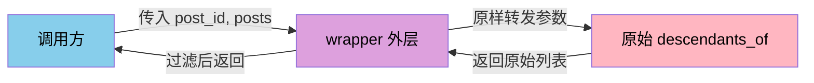

