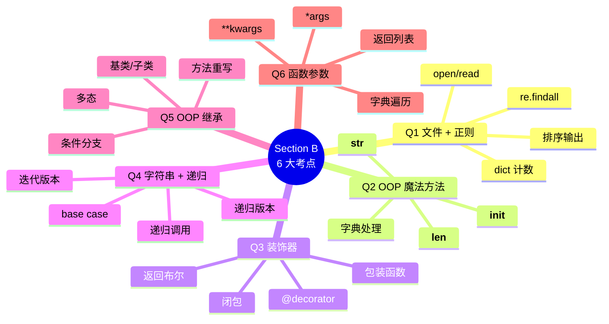

我来读取 Section B 的内容，然后整理考点。

Section B 从第 520 行开始。让我读取完整的 Section B 内容。

已经读完整个 Section B（共 6 道题）。现在为你整理考点。

---

#  INFO1110 Mock Final - Section B 考点整理

---

##  总览：Section B 考什么？

> **Section B = 进阶代码题**，6 道题全部是**手写代码**，每题考一个核心进阶概念。



---

## 六大考点详细拆解

###  考点 1：**文件读取 + 正则表达式**（Q1）

> **任务：** 读 Python 文件，找出所有重复定义的函数名

#### 涉及知识点：

| 知识点 | API / 语法 |
|--------|-----------|
| **用户输入** | `input("Enter a python file name: ")` |
| **文件读取** | `with open(filename) as f: content = f.read()` |
| **正则表达式** | `import re` + `re.findall()` |
| **正则模式** | `r"def\s+(\w+)\s*\("` ← 用**分组**提取函数名 |
| **字典计数** | `dict[name] = dict.get(name, 0) + 1` |
| **保持顺序** | Python 3.7+ dict 自动按插入顺序 |
| **筛选** | `if count > 1: print(...)` |

####  关键陷阱：

- ✅ 函数名**区分大小写**（`foo` ≠ `Foo`）
- ✅ 必须**按首次出现顺序**输出
- ✅ 没有重复时**不输出任何东西**
- ✅ 输出格式：`name count`（空格分隔）

####  模板代码：

```python
import re

filename = input("Enter a python file name: ")
with open(filename) as f:
    content = f.read()

names = re.findall(r"def\s+(\w+)\s*\(", content)

counts = {}
for name in names:
    counts[name] = counts.get(name, 0) + 1

for name, count in counts.items():
    if count > 1:
        print(f"{name} {count}")
```

# 🎯 正则表达式练习题（5 道，由易到难）

先给你一份**速查表**，再开始做题👇

---

## 📋 正则速查表（常用）

### 字符匹配
| 符号 | 含义 | 例子 |
|------|------|------|
| `.` | 任意字符（除换行） | `a.c` → `abc`, `a1c` |
| `\d` | 数字 `[0-9]` | `\d\d` → `42` |
| `\D` | 非数字 | |
| `\w` | 字母/数字/下划线 | `\w+` → `hello_1` |
| `\W` | 非 `\w` | |
| `\s` | 空白（空格、Tab、换行） | |
| `\S` | 非空白 | |
| `[abc]` | a 或 b 或 c | |
| `[^abc]` | 不是 a/b/c | |
| `[a-z]` | 小写字母 | |

### 数量词
| 符号 | 含义 |
|------|------|
| `*` | 0 次或多次 |
| `+` | 1 次或多次 |
| `?` | 0 次或 1 次 |
| `{n}` | 正好 n 次 |
| `{n,}` | 至少 n 次 |
| `{n,m}` | n 到 m 次 |

### 位置 & 分组
| 符号 | 含义 |
|------|------|
| `^` | 开头 |
| `$` | 结尾 |
| `()` | 分组（可提取） |
| `\|` | 或 |

### Python 用法
```python
import re

re.match(pattern, text)      # 从开头匹配
re.search(pattern, text)     # 找第一个匹配
re.findall(pattern, text)    # 找所有匹配，返回列表
re.sub(pattern, repl, text)  # 替换
```

---

## 📝 题目 1：⭐ 提取所有数字

从下面的文本中**提取所有数字**：

```python
text = "我今年25岁，住在3楼，电话是13812345678"
# 期望输出: ['25', '3', '13812345678']
```

**提示**：用 `re.findall()` + `\d+`

---

## 📝 题目 2：⭐⭐ 验证手机号

写一个正则**判断字符串是否是合法的中国手机号**：
- 11 位数字
- 第 1 位是 `1`
- 第 2 位是 `3-9`

```python
# 合法
"13812345678"   # ✅
"15987654321"   # ✅

# 不合法
"12812345678"   # ❌（第二位是2）
"1381234567"    # ❌（10位）
"138123456789"  # ❌（12位）
"abc12345678"   # ❌（有字母）
```

**提示**：用 `re.match()` + `^` 和 `$`

---

## 📝 题目 3：⭐⭐ 提取邮箱

从一段文本中**提取所有邮箱地址**：

```python
text = "联系我：alice@gmail.com 或 bob_123@qq.com，备用：admin@my-site.org"
# 期望输出: ['alice@gmail.com', 'bob_123@qq.com', 'admin@my-site.org']
```

**邮箱格式**：`用户名@域名.后缀`
- 用户名：字母/数字/下划线
- 域名：字母/数字/横线
- 后缀：字母（2-6 位）

---

## 📝 题目 4：⭐⭐⭐ 隐藏手机号中间 4 位

把文本中所有手机号的**中间 4 位替换成 `****`**：

```python
text = "我的电话是13812345678，老板的是15987654321"
# 期望输出: "我的电话是138****5678，老板的是159****4321"
```

**提示**：用 `re.sub()` + **分组** `()` + 反向引用 `\1` `\2`

---

## 📝 题目 5：⭐⭐⭐⭐ 解析日期

从文本中**提取所有日期**，并把**年、月、日分别提取出来**：

```python
text = "会议时间：2024-03-15，截止日期：2024-12-31，备份日期 2023-06-01"

# 期望输出（列表，每项是元组）：
# [('2024', '03', '15'), ('2024', '12', '31'), ('2023', '06', '01')]
```

**提示**：用 `re.findall()` + **3 个分组** `(\d{4})-(\d{2})-(\d{2})`

---

## 🎯 做题方式

1. **每道题打开编辑器写代码**
2. 用 `print()` 验证输出
3. **写完一道发我一道**（或全部一起发）
4. 卡住了直接问，**不要硬猜**

---

## 💡 起手模板

```python
import re

# 题目 1
text = "我今年25岁，住在3楼，电话是13812345678"
result = re.findall(r"???", text)   # 把 ??? 替换成你的正则
print(result)
```

> 🔑 **小技巧**：Python 写正则时**前面加 `r`**（原始字符串），避免反斜杠转义问题：
> - ✅ `r"\d+"` 
> - ❌ `"\d+"`（容易踩坑）

---
---

### 考点 2：**OOP 魔法方法（Dunder Methods）**（Q2）

> **任务：** 实现 `Radio` 类的 `__init__`、`__str__`、`__len__`

#### 涉及知识点：

| 魔法方法 | 触发场景 | 必须返回 |
|---------|---------|---------|
| `__init__` | `Radio(programmes)` | 无（None）|
| `__str__` | `print(radio)` / `str(radio)` | **字符串** |
| `__len__` | `len(radio)` | **整数** |

#### 关键陷阱：

1. **字典 key 类型混合**：`"station"` 是字符串，`1,2,3,4` 是整数
2. **AM/PM 转换**：
   - `0–11` → `am`
   - `12` → `pm`（12 不减）
   - `13–24` → 减 12 后加 `pm`
3. **`__len__` 必须返回 int**，不能返回 float/str

####  模板代码：

```python
class Radio:
    def __init__(self, programmes: dict):
        self.name = programmes["station"]
        self.times = [programmes[i] for i in [1, 2, 3, 4]]

    def __str__(self):
        result = "Starting times:"
        for start, _ in self.times:
            if start < 12:
                result += f" {start}am"
            else:
                hour = start - 12 if start > 12 else 12
                result += f" {hour}pm"
        return result

    def __len__(self):
        return sum(end - start for start, end in self.times)
```

---

###  考点 3：**装饰器（Decorator）**（Q3）

> **任务：** 写一个装饰器 `whether_foundation_section`，把"返回成绩字符串"的函数包装成"返回布尔值"

#### 涉及知识点：

| 知识点 | 说明 |
|--------|------|
| **装饰器结构** | 函数套函数（外层接受函数，内层是 wrapper） |
| **闭包** | wrapper 可以访问外层函数 `func` |
| **`@语法糖`** | `@decorator` 等价于 `func = decorator(func)` |
| **逻辑转换** | `"Pass"` → `False`（不需要做）；其他 → `True`（需要做）|

####  模板代码：

```python
def whether_foundation_section(func):
    def wrapper(*args, **kwargs):
        grade = func(*args, **kwargs)
        return grade != "Pass"   # Pass → False, 其他 → True
    return wrapper

@whether_foundation_section
def best_ever_grade(name, *grades):
    if "Pass" in grades:
        return "Pass"
    return "Not Pass Yet"
```

####  三层结构记忆：

```python
def 装饰器(原函数):           # ← 第 1 层：接受函数
    def wrapper(*args, **kw):  # ← 第 2 层：包装函数
        result = 原函数(*args, **kw)
        return 改造后的result  # ← 第 3 层：返回新值
    return wrapper             # ← 返回 wrapper
```

---

### 考点 4：**递归 + 字符串处理**（Q4）

> **任务：** 解码 `"a3b2c1"` → `"aaabbc"`，分别写**迭代版**和**递归版**

#### (a) 迭代版本

```python
def r1e_decode(s):
    result = ""
    for i in range(0, len(s), 2):    # 步长 2
        letter = s[i]
        count = int(s[i + 1])
        result += letter * count
    return result
```

#### (b) 递归版本（重点！）

| 必须满足 | 说明 |
|---------|------|
| ✅ 调用自己 | 必须有 `recursive_r1e_decode(...)` |
| ✅ 只能 1 个参数 | 不能加 `index=0` 这种辅助参数 |
| ✅ 不能用全局变量 | 不能用 `global` |
| ✅ 不能用函数属性 | 不能用 `func.x = ...` |

####  模板代码：

```python
def recursive_r1e_decode(s):
    if not s:                        # ← Base case：空字符串
        return ""
    letter = s[0]
    count = int(s[1])
    return letter * count + recursive_r1e_decode(s[2:])  # ← 递归调用剩余部分
```

####  递归三要素：

1. **Base case**（停止条件）：`if not s: return ""`
2. **缩小问题**：`s[2:]`（每次去掉前 2 个字符）
3. **合并结果**：`letter * count + 递归结果`

---

###  考点 5：**OOP 继承 + 多态**（Q5）

> **任务：** 实现 `Instrument` 基类 + `Piano` 和 `DrumKit` 子类

#### 涉及知识点：

| 知识点 | 说明 |
|--------|------|
| **基类构造** | `Instrument(note_count)` |
| **方法继承** | `Piano` / `DrumKit` 继承 `Instrument` |
| **方法重写** | 子类的 `play()` 覆盖父类的 |
| **`super().__init__()`** | 子类调用父类构造（可选）|
| **条件分支** | `DrumKit` 根据鼓的数量打印不同消息 |

####  模板代码：

```python
class Instrument:
    def __init__(self, note_count: int):
        self.note_count = note_count

    def play(self):
        print(f"Playing across {self.note_count} notes.")


class Piano(Instrument):
    def __init__(self):
        super().__init__(0)   # 或不调用父类，直接 pass

    def play(self):
        print("Piano plays a grand melody.")


class DrumKit(Instrument):
    def __init__(self, drums: int):
        self.drums = drums

    def play(self):
        if self.drums == 5:
            print("Five-piece groove incoming!")
        else:
            print(f"Thumping on {self.drums} drums.")
```

####  多态测试：

```python
band = [inst, p, five, big]
for i in band:
    i.play()   # ← 同样的 .play() 调用，行为不同 = 多态
```

---

###  考点 6：**`**kwargs` 关键字参数**（Q6）

> **任务：** 用关键字参数动态传入学生名字，返回通过的学生列表

#### 涉及知识点：

| 知识点 | 语法 |
|--------|------|
| **位置参数** | `grades` |
| **关键字参数** | `**kwargs` |
| **遍历 kwargs** | `for key, value in kwargs.items()` |
| **嵌套字典查找** | `grades[name]` → tuple/list |
| **全部通过判断** | `all(g == "Pass" for g in grades[name])` |

####  模板代码：

```python
def passed(grades, **students):
    result = []
    for key, name in students.items():    # student_1='alice', ...
        if name in grades:
            test, assign = grades[name]
            if test == "Pass" and assign == "Pass":
                result.append(name)
    return result
```

####  关键陷阱：

1. **只检查传入的学生**：`bob` 即使全 Pass，没作为 kwargs 传入就不返回
2. **必须两项都 Pass** 才算通过
3. **`**students`** 接收所有 `student_x=name` 形式的参数

---

##  考点总结表（速查）

| Q | 考点 | 核心 API/语法 | 难度 |
|---|------|--------------|------|
| **Q1** | 文件 + 正则 | `re.findall`, `dict.get`, `with open` | ⭐⭐⭐ |
| **Q2** | OOP 魔法方法 | `__init__`, `__str__`, `__len__` | ⭐⭐⭐ |
| **Q3** | 装饰器 | `def wrapper`, 闭包, `@语法` | ⭐⭐⭐⭐ |
| **Q4** | 递归 | base case + 自调用 + 缩小问题 | ⭐⭐⭐⭐ |
| **Q5** | OOP 继承多态 | `class A(B)`, 方法重写, `super()` | ⭐⭐⭐ |
| **Q6** | `**kwargs` | `**students`, `.items()` | ⭐⭐⭐ |

---

##  复习优先级建议

```mermaid
flowchart LR
    A[ 必须掌握] --> A1[Q5 继承多态<br/>最常见]
    A --> A2[Q2 魔法方法<br/>固定套路]
    A --> A6[Q6 kwargs<br/>简单送分]
    
    B[ 重点突破] --> B3[Q3 装饰器<br/>三层结构记牢]
    B --> B4[Q4 递归<br/>base case 是关键]
    
    C[⚡ 细节注意] --> C1[Q1 正则<br/>记住 r'