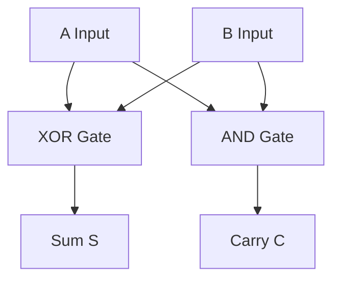
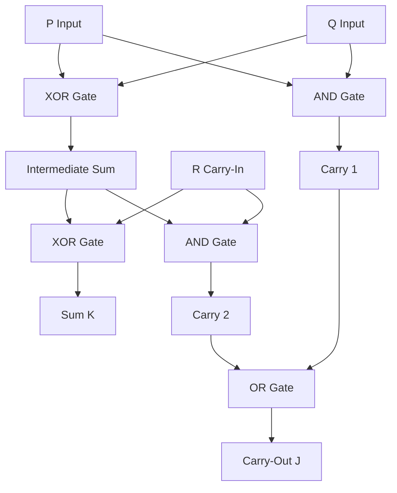
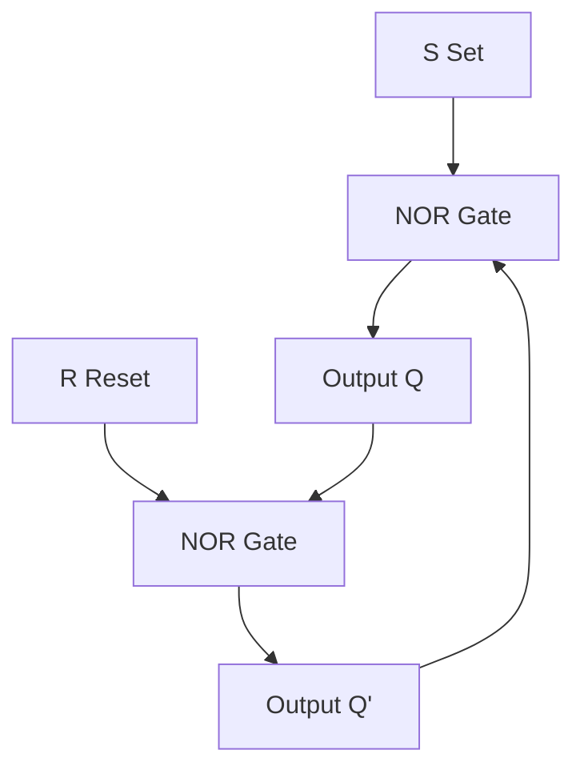
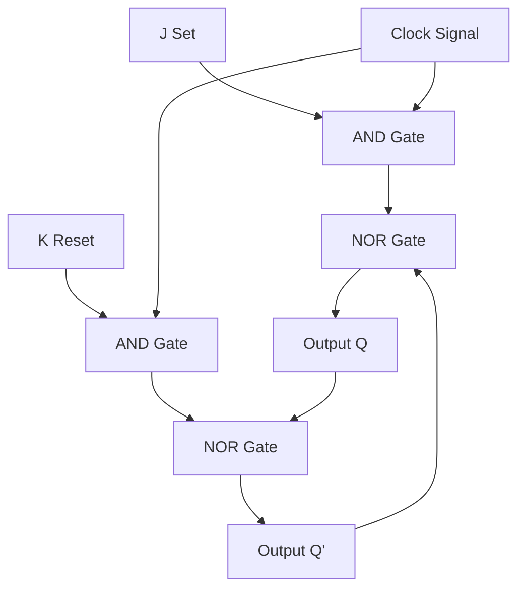
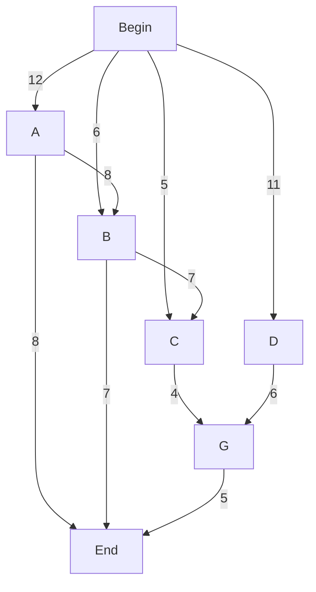
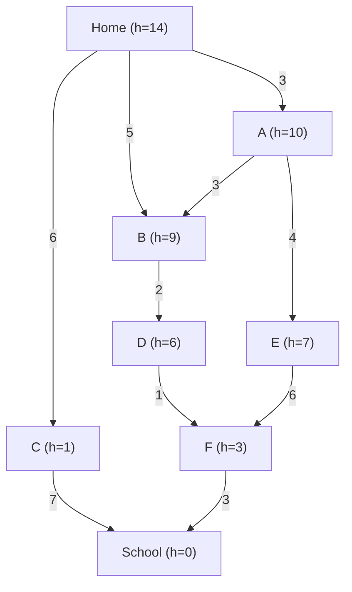

# A2 COMPUTER SCIENCE
## 13 Data Representation
### **13.1 用户定义的数据类型 (User-defined Data Types)**  

---

#### **13.1.1 用户定义的数据类型 (User-defined Data Types)**  

用户定义的数据类型允许程序员根据特定需求创建数据类型。这些类型可以分为 **复合数据类型（Composite Data Types）** 和 **非复合数据类型（Non-Composite Data Types）**，其中常见的非复合类型包括 **枚举类型（Enumerated Data Types）** 和 **指针类型（Pointer Data Types）**。  

User-defined data types allow programmers to create their own types tailored to specific requirements. These types can be categorized into **Composite Data Types** and **Non-Composite Data Types**, with common examples of non-composite types including **Enumerated Data Types** and **Pointer Data Types**.  

---

##### **定义 (Definition)**  
用户定义的数据类型是程序员根据需求创建的类型，用于逻辑且高效地表示数据，增强代码的可读性和模块化。  
A user-defined data type is a programmer-created type designed to represent data logically and efficiently, enhancing readability and modularity.  

##### **用途 (Purpose)**  
- 为解决复杂问题提供更好的数据抽象。  
  Provides better abstraction for solving complex problems.  
- 模拟现实世界中的实体和交互。  
  Facilitates modeling of real-world entities and interactions.  
- 提升代码的模块化和可重用性。  
  Improves code modularity and reusability.  

---

#### **13.1.2 复合数据类型 (Composite Data Types)**  

##### **定义 (Definition)**  
复合数据类型组合多个数据元素形成一个逻辑结构，例如 **记录（Record）**、**集合（Set）** 和 **类/对象（Class/Object）**。  
Composite data types combine multiple data elements into one logical structure, such as **records**, **sets**, and **classes/objects**.  

##### **用途 (Purpose)**  
适用于表示复杂实体，比如一个人（姓名、年龄、地址）或一个商品（编号、价格、数量）。  
Ideal for representing complex entities, such as a person (name, age, address) or a product (ID, price, quantity).  

##### **示例 (Examples)**  

###### **伪代码 (Pseudocode)**  
```plaintext
TYPE Product
    ID : INTEGER
    Name : STRING
    Price : REAL
ENDTYPE

DECLARE Item : Product
Item.ID ← 101
Item.Name ← "Laptop"
Item.Price ← 799.99

OUTPUT Item.Name // 输出: Laptop
```

###### **Python**  
```python
class Product:
    def __init__(self, id, name, price):
        self.id = id
        self.name = name
        self.price = price

# 使用示例 (Example usage)
item = Product(101, "Laptop", 799.99)
print(item.name)  # 输出: Laptop
```

---

#### **13.1.3 非复合数据类型 (Non-Composite Data Types)**  

##### **定义 (Definition)**  
非复合数据类型表示单一的原子值。常见的示例包括 **枚举类型（Enumerated）** 和 **指针类型（Pointer）**。  
Non-composite data types represent single atomic values. Common examples include **Enumerated Data Types** and **Pointer Data Types**.  

---

##### **13.1.3.1 枚举数据类型 (Enumerated Data Types)**  

###### **定义 (Definition)**  
枚举类型是一种有限命名值集合的数据类型，这些值通常作为常量使用。  
An enumerated type is a user-defined type consisting of a finite set of named values, often used as constants.  

###### **用途 (Purpose)**  
适用于表示预定义的类别，比如星期几、方向或有限状态机中的状态。  
Useful for representing predefined categories like days of the week, directions, or states in a finite state machine.  

###### **示例 (Examples)**  

**伪代码 (Pseudocode)**  
```plaintext
TYPE DayOfWeek = (Monday, Tuesday, Wednesday, Thursday, Friday, Saturday, Sunday)

DECLARE Today : DayOfWeek
Today ← Monday

IF Today = Friday THEN
    OUTPUT "Weekend is coming!"
ENDIF
```

**Python**  
```python
from enum import Enum

class DayOfWeek(Enum):
    Monday = 1
    Tuesday = 2
    Wednesday = 3
    Thursday = 4
    Friday = 5
    Saturday = 6
    Sunday = 7

# 使用示例 (Example usage)
today = DayOfWeek.Friday
if today == DayOfWeek.Friday:
    print("Weekend is coming!")  # 输出: Weekend is coming!
```

---

##### **13.1.3.2 指针数据类型 (Pointer Data Types)**  

###### **定义 (Definition)**  
指针类型存储另一个变量或数据结构的内存地址，用于动态内存管理和间接引用。  
A pointer type stores the memory address of another variable or data structure, enabling dynamic memory management and indirect referencing.  

###### **用途 (Purpose)**  
通常用于链表、树和动态数组。  
Commonly used in linked lists, trees, and dynamic arrays.  

###### **示例 (Examples)**  

**伪代码 (Pseudocode)**  
```plaintext
DECLARE Pointer : INTEGER
DECLARE Data : ARRAY[1:5] OF INTEGER

Pointer ← ADDRESS(Data[1]) // 指针指向数组第一个元素的地址
OUTPUT Pointer // 输出内存地址
```

**Python**  
> Python 不支持显式指针，但可以使用引用实现类似功能。  
Python does not support explicit pointers, but references can achieve similar functionality.  
```python
class Node:
    def __init__(self, value):
        self.value = value
        self.next = None  # 指针指向下一个节点 (Pointer to the next node)

# 使用示例 (Example usage): 链表 (Linked list)
node1 = Node(10)
node2 = Node(20)

node1.next = node2  # 设置指针指向下一个节点 (Setting pointer to the next node)

print(node1.value)  # 输出: 10 (Output: 10)
print(node1.next.value)  # 输出: 20 (Output: 20)
```

---

#### **13.1.4 对比表 (Comparison Table)**  

| **数据类型 (Data Type)** | **定义 (Definition)**                                                                                   | **用途 (Example Use Case)**              |
|--------------------------|---------------------------------------------------------------------------------------------------------|------------------------------------------|
| 枚举类型 (Enumerated)    | 有限命名值的集合。用于变量值在有限范围内的情况。                                                        | 星期几、方向、有限状态机中的状态。       |
| 指针类型 (Pointer)       | 存储另一个变量或对象的内存地址，用于动态内存管理和间接引用。                                             | 链表、树、图等动态结构。                 |
| 复合类型 (Composite)     | 将相关数据组合成一个逻辑单元，用于表示复杂实体。                                                        | 人员信息、购物车中的商品等。             |

---

### **13.2 文件组织与访问 (File Organisation and Access)**  

---

#### **13.2.1 文件组织方法 (Methods of File Organisation)**  

##### **定义 (Definition)**  
文件组织是指在存储设备上安排文件记录的方式，以便高效存储和访问数据。  
File organisation refers to the arrangement of file records on storage devices for efficient data storage and retrieval.  

##### **常见方法 (Common Methods)**  
1. **顺序组织 (Serial Organisation)**  
   - 文件记录按添加顺序存储，没有特定的排序。  
   - 适用于简单的数据存储，例如日志文件。  
   - Serial organisation stores records in the order they are added, with no particular arrangement.  

2. **连续组织 (Sequential Organisation)**  
   - 根据关键字段（Key Field）对记录排序。  
   - 适合需要顺序访问的数据，例如学生成绩表按学号排序。  
   - Sequential organisation arranges records based on a key field.  

3. **随机组织 (Random Organisation)**  
   - 使用记录键（Record Key）直接存储和访问记录。  
   - 适合需要快速访问的数据，例如数据库索引。  
   - Random organisation uses a record key for direct storage and access.  

##### **示例 (Example)**  
| **文件组织方法 (File Organisation Method)** | **描述 (Description)**                                             | **应用场景 (Use Case)**                  |  
|--------------------------------------------|--------------------------------------------------------------------|------------------------------------------|  
| 顺序组织 (Serial Organisation)             | 按记录添加顺序存储，无排序。                                        | 日志文件、临时数据记录。                 |  
| 连续组织 (Sequential Organisation)         | 根据关键字段排序记录，支持顺序访问。                                 | 学生名单按学号排序、交易记录。           |  
| 随机组织 (Random Organisation)             | 使用记录键直接访问记录，支持快速检索。                               | 数据库索引、库存管理系统。               |  

---

#### **13.2.2 文件访问方法 (Methods of File Access)**  

##### **定义 (Definition)**  
文件访问是指从存储设备读取或写入文件记录的过程。  
File access refers to the process of reading and writing file records from storage devices.  

##### **常见方法 (Common Methods)**  
1. **顺序访问 (Sequential Access)**  
   - 按记录顺序逐一读取文件内容。  
   - 适合顺序组织和连续组织的文件。  
   - Sequential access reads file contents one record at a time in order.  

2. **直接访问 (Direct Access)**  
   - 使用记录键直接访问特定记录。  
   - 适合随机组织的文件。  
   - Direct access retrieves specific records using a record key.  

##### **示例 (Example)**  
| **文件访问方法 (File Access Method)** | **描述 (Description)**                                             | **应用场景 (Use Case)**                  |  
|---------------------------------------|--------------------------------------------------------------------|------------------------------------------|  
| 顺序访问 (Sequential Access)          | 按记录顺序逐一读取文件内容。                                        | 读取日志文件或连续存储的数据。           |  
| 直接访问 (Direct Access)              | 使用记录键直接访问特定记录。                                        | 数据库检索或库存管理。                   |  

---

#### **13.2.3 哈希算法 (Hashing Algorithms)**  

##### **定义 (Definition)**  
哈希算法是一种将输入数据转换为固定长度散列值的数学函数，用于快速存储和检索数据。  
Hashing algorithms are mathematical functions that convert input data into fixed-length hash values for fast storage and retrieval.  

##### **用途 (Purpose)**  
1. **读取数据 (Reading Data)**  
   - 使用哈希值快速定位文件中的记录。  
   - Hash values enable quick retrieval of records in a file.  

2. **写入数据 (Writing Data)**  
   - 根据哈希算法将数据存储到随机或连续文件中。  
   - Hashing algorithms allocate data efficiently in random or sequential files.  

##### **示例 (Example)**  
**伪代码 (Pseudocode)**  
```plaintext
HASH_FUNCTION(Key) = MOD(Key, TableSize)

DECLARE TableSize : INTEGER ← 10
DECLARE RecordKey : INTEGER ← 1234

Index ← HASH_FUNCTION(RecordKey) // 哈希函数计算存储索引
OUTPUT Index // 输出: 4
```

**Python**  
```python
def hash_function(key, table_size):
    return key % table_size  # 哈希函数

# 示例使用 (Example usage)
table_size = 10
record_key = 1234

index = hash_function(record_key, table_size)
print(f"Record should be stored at index: {index}")  # 输出: Record should be stored at index: 4
```

---
### **13.3 浮点数、表示与操作 (Floating-point Numbers, Representation and Manipulation)**  

---

#### **13.3.1 二进制浮点数的格式描述 (Format of Binary Floating-point Numbers)**  

##### **定义 (Definition)**  
二进制浮点数是一种用于表示实数的数值表示方法，包含两个部分：尾数 (Mantissa) 和指数 (Exponent)。  

##### **关键点 (Key Points)**  
1. **尾数 (Mantissa)**  
   - 表示数字的精确部分，是浮点数的有效位。  
   - 尾数通常是标准化的形式（最高有效位为非零）。  

2. **指数 (Exponent)**  
   - 指定尾数的范围或位置，用于调整小数点的位置。  
   - 使用二进制补码形式表示负数指数。  

##### **浮点数的表示形式**  
浮点数可以表示为：  
`浮点数 = 尾数 × 2^(指数)`  
例如：二进制浮点数 `1.101 × 2^3`，其中：  
- 尾数 = `1.101`  
- 指数 = `3`  

---

#### **13.3.2 二进制浮点数与十进制的转换 (Conversion Between Binary Floating-point and Denary Numbers)**  

##### **转换步骤 (Steps for Conversion)**  
1. **二进制转十进制 (Binary to Denary)**  
   - 解码尾数，将其转换为十进制值。  
   - 根据指数的值调整小数点的位置。  

   示例：  
   - 尾数 `1.101` 转换为十进制值：  
     `1 × 2^0 + 1 × 2^(-1) + 0 × 2^(-2) + 1 × 2^(-3) = 1 + 0.5 + 0 + 0.125 = 1.625`  
   - 指数 `3` 表示将小数点向右移动 3 位，即：  
     `1.625 × 2^3 = 1.625 × 8 = 13.0`  

2. **十进制转二进制 (Denary to Binary)**  
   - 将十进制数转换为二进制形式。  
   - 分离尾数和指数部分。  

---

#### **13.3.3 浮点数的标准化 (Normalisation of Floating-point Numbers)**  

##### **定义 (Definition)**  
标准化是将浮点数调整为尾数的最高有效位为非零值的形式，以提高计算精度和存储效率。  

##### **标准化的原因 (Reasons for Normalisation)**  
- 确保尾数的最高有效位存储最重要的信息，提高浮点数的表示精度。  
- 减少冗余表示，优化存储空间和计算效率。  

---

#### **13.3.4 二进制表示近似值的后果 (Consequences of Binary Representation Approximation)**  

##### **定义 (Definition)**  
由于浮点数使用有限的位数表示，可能导致真实数值与近似值之间的偏差。  

##### **后果 (Consequences)**  
1. **溢出 (Overflow)**  
   - 当数值超出浮点数表示范围时发生。  

2. **下溢 (Underflow)**  
   - 当数值接近零但无法表示时发生。  

---

#### **13.3.5 二进制表示的舍入误差 (Rounding Errors in Binary Representation)**  

##### **定义 (Definition)**  
舍入误差是由于尾数位数不足导致的近似值与真实值之间的差异。  

##### **舍入误差的原因 (Causes of Rounding Errors)**  
- 尾数位数不足，无法精确表示某些实数。  
- 舍入规则（如向零舍入、向最近值舍入）会影响结果精度。  

---

#### **13.3.6 浮点数的具体计算方法 (How to Calculate Floating-point Numbers)**  

##### **浮点数表示结构 (Floating-point Representation Structure)**  
浮点数表示为：  
`浮点数 = 尾数 × 2^(指数)`  
- **尾数 (Mantissa)**：表示具体的数值部分。  
- **指数 (Exponent)**：表示尾数的倍率或范围。  

---

##### **具体计算步骤 (Steps for Calculation)**  
1. **解析浮点数表示 (Parsing the Floating-point Representation)**  
   - 从浮点数中提取尾数、指数和符号位。  

2. **计算尾数值 (Calculate the Value of the Mantissa)**  
   - 将尾数转换为十进制值。  
     示例：尾数 `1.101` 转换为：  
     `1 × 2^0 + 1 × 2^(-1) + 0 × 2^(-2) + 1 × 2^(-3) = 1 + 0.5 + 0 + 0.125 = 1.625`  

3. **调整小数点位置 (Apply the Exponent Adjustment)**  
   - 根据指数值进行调整，例如：  
     指数 `3` 表示将小数点向右移动 3 位：  
     `1.625 × 2^3 = 1.625 × 8 = 13.0`  

4. **应用符号位 (Apply the Sign Bit)**  
   - 如果符号位为 `1`，结果为负数；如果符号位为 `0`，结果为正数。  

---

##### **示例计算 (Example Calculation)**  

###### **示例 1：二进制浮点数 `1.101 × 2^3`**  
1. **解析表示**：尾数 `1.101`，指数 `3`，符号位 `0`（正数）。  
2. **计算尾数值**：  
     `1.101 = 1 + 0.5 + 0.125 = 1.625`  
3. **调整小数点位置**：  
     `1.625 × 2^3 = 1.625 × 8 = 13.0`  
4. **应用符号位**：符号位为 `0`，结果为正：  
     **结果 = 13.0**  

###### **示例 2：浮点数 `-0.1101 × 2^(-2)`**  
1. **解析表示**：尾数 `0.1101`，指数 `-2`，符号位 `1`（负数）。  
2. **计算尾数值**：  
     `0.1101 = 0 + 0.5 + 0.25 + 0 + 0.0625 = 0.8125`  
3. **调整小数点位置**：  
     `0.8125 × 2^(-2) = 0.8125 × 0.25 = 0.203125`  
4. **应用符号位**：符号位为 `1`，结果为负：  
     **结果 = -0.203125**  

---

## Communication and internet technologies

---

### **14.1 协议 (Protocols)**  

---

#### **14.1.1 协议的重要性 (Why Protocols Are Essential for Communication Between Computers)**  

##### **定义 (Definition)**  
协议是用于规范计算机之间通信的一组规则或标准。它确保数据在网络中以标准化的方式发送和接收。  
Protocols are a set of rules or standards that govern communication between computers. They ensure data is sent and received in a standardized manner across networks.  

##### **协议的重要性 (Importance of Protocols)**  
1. **一致性 (Consistency)**  
   - 确保不同设备和系统可以相互理解，避免数据混乱或丢失。  
   - Ensures that different devices and systems can understand each other, avoiding data corruption or loss.  

2. **互操作性 (Interoperability)**  
   - 允许不同硬件和软件平台之间进行无缝通信。  
   - Allows seamless communication between different hardware and software platforms.  

3. **可靠性 (Reliability)**  
   - 确保数据能够完整且准确地传输到目标设备。  
   - Ensures that data is transmitted completely and accurately to the destination device.  

4. **安全性 (Security)**  
   - 提供数据加密、验证和完整性检查等功能，保护数据传输。  
   - Provides features like encryption, authentication, and integrity checks to secure data transmission.  

---

#### **14.1.2 协议栈的概念 (Protocol Stack and Its Functionality)**  

##### **定义 (Definition)**  
协议栈是协议实现的一种分层结构，每一层负责特定的功能。协议栈的分层设计使得网络通信更高效、更易管理。  
A protocol stack is a layered structure for implementing protocols, where each layer handles specific functionality. The layered design makes network communication more efficient and manageable.  

##### **协议栈的分层 (Layers in a Protocol Stack)**  
1. **应用层 (Application Layer)**  
   - 提供用户与网络交互的功能，负责处理高层应用数据（如网页浏览、邮件）。  
   - Examples: HTTP, SMTP, FTP.  

2. **传输层 (Transport Layer)**  
   - 负责数据的分段、传输和错误检测，确保数据可靠传输。  
   - Examples: TCP, UDP.  

3. **网络层 (Internet Layer)**  
   - 负责数据的路径选择和逻辑地址（IP地址）管理，确保数据包到达正确目标。  
   - Examples: IP.  

4. **链路层 (Link Layer)**  
   - 负责物理设备之间的数据传输，包括数据帧的创建和传输。  
   - Examples: Ethernet, Wi-Fi.  

##### **协议栈的应用 (Application of Protocol Stack)**  
- 当一台主机向另一台主机发送消息时，数据从协议栈的顶部（应用层）向下传递到链路层。随后，数据通过网络传输到目标主机，并从协议栈的底部向上处理，直到应用层。  
- When a host sends a message to another host, data flows down the protocol stack from the application layer to the link layer. The data is transmitted over the network and processed up the stack at the destination host.  

---

#### **14.1.3 TCP/IP 协议套件 (TCP/IP Protocol Suite)**  

##### **定义 (Definition)**  
TCP/IP 是一种广泛使用的协议套件，用于互联网通信。它由多个协议组成，分为四个主要层级：应用层、传输层、网络层和链路层。  
TCP/IP is a widely used protocol suite for internet communication. It consists of multiple protocols organized into four main layers: Application, Transport, Internet, and Link.  

##### **TCP/IP 协议层的功能和目的 (Purpose and Function of Each Layer)**  
1. **应用层 (Application Layer)**  
   - 提供网络服务，如网页浏览 (HTTP)、文件传输 (FTP)、电子邮件 (SMTP)。  
   - Examples: HTTP, SMTP, FTP.  

2. **传输层 (Transport Layer)**  
   - 负责数据分段、传输和重组，确保可靠的端到端通信。  
   - Examples: TCP, UDP.  

3. **网络层 (Internet Layer)**  
   - 负责路由数据包并分配逻辑地址（IP地址）。  
   - Examples: IP.  

4. **链路层 (Link Layer)**  
   - 负责设备之间的物理数据传输，包括数据帧创建。  
   - Examples: Ethernet, Wi-Fi.  

---

#### **14.1.4 常见协议及其用途 (Common Protocols and Their Purposes)**  

##### **HTTP (HyperText Transfer Protocol)**  
- 用途：用于网页浏览，允许客户端与服务器交换网页数据。  
- Purpose: Enables web browsing by allowing clients and servers to exchange webpage data.  

##### **FTP (File Transfer Protocol)**  
- 用途：用于文件上传和下载，支持远程文件管理。  
- Purpose: Facilitates file upload and download, supporting remote file management.  

##### **POP3 (Post Office Protocol v3)**  
- 用途：用于电子邮件接收，允许客户端从邮件服务器下载邮件到本地。  
- Purpose: Enables email retrieval by downloading messages from the mail server to the client.  

##### **IMAP (Internet Message Access Protocol)**  
- 用途：用于电子邮件接收，允许客户端直接管理邮件服务器上的邮件。  
- Purpose: Allows email management directly on the mail server without downloading.  

##### **SMTP (Simple Mail Transfer Protocol)**  
- 用途：用于电子邮件发送，负责将邮件发送到目标服务器。  
- Purpose: Facilitates email sending to the destination server.  

##### **BitTorrent**  
- 用途：用于点对点 (P2P) 文件共享，允许用户分布式下载文件。  
- Purpose: Enables peer-to-peer (P2P) file sharing, allowing users to download files in a distributed manner.  

##### **Wi-Fi (Wireless Fidelity)**  
- 用途：一种无线局域网协议，允许设备通过无线信号连接到网络。  
- Purpose: A wireless LAN protocol that enables devices to connect to networks via radio signals.  

##### **蓝牙 (Bluetooth)**  
- 用途：用于短距离无线通信，支持设备之间的数据传输和连接。  
- Purpose: A short-range wireless communication protocol for data transfer and device connectivity.  

##### **WiMAX (Worldwide Interoperability for Microwave Access)**  
- 用途：提供长距离无线宽带连接，适用于城域网。  
- Purpose: Provides long-range wireless broadband connectivity, suitable for metropolitan area networks.  

##### **以太网 (Ethernet)**  
- 用途：有线网络协议，支持局域网内的数据帧传输。  
- Purpose: A wired network protocol for transmitting data frames within a local area network (LAN).  

---
### **14.2 电路交换与分组交换 (Circuit Switching, Packet Switching)**  

---

#### **14.2.1 电路交换 (Circuit Switching)**  

##### **定义 (Definition)**  
电路交换是一种通信技术，在发送方和接收方之间建立专用通信路径（电路），并保持连接直到通信完成。  
Circuit switching is a communication method that establishes a dedicated communication path (circuit) between the sender and receiver, maintaining the connection until the communication is complete.  

##### **工作原理 (How It Works)**  
1. **连接建立 (Connection Establishment)**  
   - 在通信开始前，必须通过信号建立一条专用的物理路径。  
   - A dedicated physical path must be established via signaling before communication begins.  

2. **数据传输 (Data Transmission)**  
   - 数据在该专用路径上传输，没有中断或竞争。  

3. **连接释放 (Connection Release)**  
   - 通信结束后，专用路径被断开，资源释放。  

##### **优缺点 (Pros and Cons)**  

| **优点 (Pros)**              | **缺点 (Cons)**                                |
|------------------------------|-----------------------------------------------|
| **稳定的连接**：专用路径保证稳定的通信，不受其他用户干扰。 | **资源浪费**：未使用时仍占用资源，效率低下。     |
| **适合实时通信**：适用于电话和视频通话等实时任务。 | **建立连接时间长**：通信前需要建立连接，增加延迟。 |
| **无数据丢失**：数据按顺序传输，无分组丢失或乱序问题。 | **扩展性差**：固定资源分配，难以支持更多用户。   |
| **简单的网络处理**：数据流无需复杂的路由或重组。 | **故障影响大**：路径中断会完全中断通信。         |

##### **适用场景 (Where It Is Applicable)**  
- 电话网络 (Telephone Networks)。  
- 视频通话和其他实时通信 (Video Calls and Other Real-time Communications)。  

---

#### **14.2.2 分组交换 (Packet Switching)**  

##### **定义 (Definition)**  
分组交换是一种通信技术，将数据分割成多个小分组，通过共享网络路径独立路由到目标设备。每个分组可以独立选择路径。  
Packet switching is a communication method that splits data into small packets, which are independently routed through shared network paths to the destination. Each packet can take a different route.  

##### **工作原理 (How It Works)**  
1. **数据分组 (Data Packetization)**  
   - 数据被分割成多个分组，每个分组包含目标地址和顺序信息。  
   - Data is divided into packets, each containing destination and sequence information.  

2. **分组路由 (Packet Routing)**  
   - 分组通过网络路由器独立传输，每个分组可能选择不同路径。  
   - Packets are independently routed through the network, possibly taking different paths.  

3. **分组重组 (Packet Reassembly)**  
   - 接收方根据分组的顺序信息重新组合数据。  
   - The receiver reassembles the packets into the correct order based on sequence information.  

##### **优缺点 (Pros and Cons)**  

| **优点 (Pros)**              | **缺点 (Cons)**                                |
|------------------------------|-----------------------------------------------|
| **资源共享**：动态分配网络资源，提高效率。         | **延迟**：分组因路径不同及网络拥塞可能产生较高延迟。 |
| **灵活性高**：分组可通过不同路径传输，增强容错性。   | **数据丢失**：网络拥塞或故障可能导致分组丢失，需要重传。 |
| **扩展性强**：支持大量用户和动态流量管理。         | **数据重组复杂**：接收端需要重组分组，增加处理复杂性。   |
| **成本效益高**：资源共享降低网络整体成本。         | **实时性能不佳**：实时通信中可能因延迟和丢包受影响。    |
| **支持多种数据类型**：同时适用于文本、音频、视频等。 | **故障处理复杂**：路径故障时需重新选择路由。           |

##### **适用场景 (Where It Is Applicable)**  
- 数据网络，如互联网 (Data Networks, e.g., the Internet)。  
- 非实时通信，如电子邮件和文件传输 (Non-real-time Communications, e.g., Emails and File Transfers)。  

---

#### **14.2.3 路由器在分组交换中的功能 (Function of a Router in Packet Switching)**  

##### **路由器的作用 (Role of Routers)**  
1. **分组转发 (Packet Forwarding)**  
   - 根据分组的目标地址，将其转发到网络的下一个节点。  
   - Forward packets to the next node in the network based on their destination address.  

2. **路径选择 (Path Selection)**  
   - 路由器使用路由算法选择最佳路径，确保高效传输。  
   - Routers use routing algorithms to select the best paths for efficient transmission.  

3. **流量管理 (Traffic Management)**  
   - 路由器处理网络拥塞，避免延迟和丢包。  
   - Manage network congestion to avoid delays and packet loss.  

4. **协议支持 (Protocol Support)**  
   - 路由器支持多种协议（如 TCP/IP），确保不同设备间的兼容性。  
   - Support multiple protocols (e.g., TCP/IP) to ensure compatibility between devices.  

---

#### **14.2.4 分组交换如何传递消息 (Packet Switching for Passing Messages)**  

##### **传递消息的步骤 (Steps to Pass Messages Using Packet Switching)**  
1. **发送端 (Sender)**  
   - 数据被分割为分组，每个分组包含目标地址、顺序信息和数据内容。  
   - The sender divides the data into packets, each containing destination address, sequence information, and data content.  

2. **传输过程 (Transmission Process)**  
   - 分组通过共享网络路径传输，每个分组可能选择不同路径。  
   - Packets are transmitted through shared network paths, with each packet potentially taking a different route.  

3. **接收端 (Receiver)**  
   - 接收端根据分组的顺序信息重新组合数据。若分组丢失，可请求重传。  
   - The receiver reassembles the data based on sequence information. Lost packets can be requested for retransmission.  

##### **应用场景 (Application Scenarios)**  
- **互联网通信 (Internet Communication)**：如网页浏览、电子邮件、视频流媒体。  
- **云服务 (Cloud Services)**：分组交换保证动态负载分配和高效数据传输。  

---

##### **电路交换 vs 分组交换对比总结 (Comparison Summary: Circuit Switching vs Packet Switching)**  

| **特点**                  | **电路交换 (Circuit Switching)**                | **分组交换 (Packet Switching)**                   |
|---------------------------|------------------------------------------------|--------------------------------------------------|
| **连接方式**              | 专用路径，持续连接                              | 动态共享路径，分组独立传输                       |
| **适用场景**              | 实时通信（如电话、视频通话）                    | 数据网络（如互联网、电子邮件、文件传输）         |
| **数据传输顺序**          | 保证顺序，无数据丢失                            | 分组可能乱序，需要重组                           |
| **资源利用率**            | 低效：未使用时仍占用资源                        | 高效：资源按需动态分配                           |
| **延迟**                  | 建立连接时间长，但传输过程延迟低                | 分组传输延迟较高，尤其在网络拥塞时               |
| **扩展性**                | 扩展性差：固定资源分配                         | 扩展性强：支持大量用户和动态流量管理             |
| **故障容错性**            | 容错性低：路径中断通信完全中断                  | 容错性高：分组可通过不同路径传输                 |
| **实时性能**              | 优秀：适合电话或视频通话等实时通信              | 表现较差：实时通信可能因延迟和丢包受影响         |
| **网络处理复杂性**        | 简单：无路由或数据重组需求                      | 高复杂性：需要路由选择和分组重组                 |
| **数据丢失**              | 无数据丢失                                      | 网络拥塞时可能丢包，需要重传                     |
| **成本效益**              | 资源浪费导致成本较高                            | 资源共享降低网络整体成本                             |
| **适用数据类型**          | 适用于音频和视频等连续流数据                    | 同时支持文本、音频、视频等多种数据类型           |

---
## Hardware

### 15.1 RISC & CISC Processors  

#### **RISC** （简化指令集计算机）  
- Fewer instructions （指令数量少）  
- Simpler instructions （指令更简单）  
- A small number of instruction formats （指令格式种类少）  
- Single-cycle instructions whenever possible （尽可能使用单周期指令）  
- Fixed-length instructions （固定长度指令）  
- Only load and store instructions to address memory （仅使用 `load` 和 `store` 指令访问内存）  
- Fewer addressing modes （寻址模式较少）  
- Multiple register sets （多个寄存器集）  
- Hard-wired control unit （硬连线控制单元）  
- Pipelining easier （更易实现流水线）  

#### **CISC** （复杂指令集计算机）  
- More instructions （指令数量多）  
- Complicated instructions （指令更复杂）  
- Many instruction formats （多种指令格式）  
- Multi-cycle instructions （多周期指令）  
- May types of instructions to address memory （可通过多种指令访问内存）  
- More addressing modes （寻址模式更多）  
- Fewer registers （寄存器数量较少）  
- Microprogrammed control unit （微程序化控制单元）  
- Pipelining much difficult （更难实现流水线）  

---

### RISC vs. CISC 对比表格  

| **特性**           | **RISC** （简化指令集计算机）  | **CISC** （复杂指令集计算机）    |
| ------------------ | ------------------------------ | -------------------------------- |
| **指令数量**       | 较少                           | 较多                             |
| **指令复杂度**     | 简单                           | 复杂                             |
| **指令长度**       | 固定长度                       | 可变长度                         |
| **执行周期**       | 单周期指令为主                 | 通常为多周期指令                 |
| **寄存器数量**     | 多个寄存器                     | 寄存器较少                       |
| **寻址模式**       | 较少                           | 较多                             |
| **流水线实现难度** | 容易                           | 因指令复杂度较高而较难实现       |
| **控制单元**       | 硬连线控制单元（硬件实现逻辑） | 微程序化控制单元（软件实现逻辑） |

---

### 15.1.2 Pipelining （流水线）

- **Instruction level parallelism** （指令级并行）  
  - Used extensively in RISC processor-based systems to reduce the time taken to run processes  
    （在基于 RISC 处理器的系统中广泛使用，用于减少程序运行所需时间）  
  - Multiple registers are employed （使用多个寄存器以实现流水线处理）  

#### **流水线的阶段**  
1. Instruction fetch (IF) （取指令）  
2. Instruction decode (ID) （指令译码）  
3. Operand fetch (OF) （操作数获取）  
4. Instruction execution (IE) （指令执行）  
5. Result write back (WB) （结果写回）  

---

### 15.1.3 Interrupt Handling in CISC and RISC Processors （CISC 和 RISC 处理器的中断处理）
- As soon as the interrupt is detected, the current processes are paused and moved into registers  
  （当中断发生时，当前进程会暂停并将状态存储到寄存器中）  
- The ISR (Interrupt Service Routine) is loaded onto the pipeline and is executed  
  （中断服务程序 ISR 会加载到流水线中并执行）  
- When the interrupt has been serviced, the paused processes are resumed by bringing them back from the registers to the pipeline  
  （中断处理完成后，暂停的进程会从寄存器中恢复并重新加载到流水线中继续运行）  


### 15.2.1 Pipelining for Five-Stage Instruction Handling （五阶段指令处理的流水线）

#### 流水线的实现条件  
- **To implement pipelining**: The processor must have five independent units, each handling one of the five stages (IF, ID, OF, IE, WB).  
  **（流水线的实现需要处理器具有五个独立单元，每个单元负责处理五个阶段之一：取指令、指令译码、操作数获取、指令执行、结果写回。）**

#### 流水线的工作原理  
- **RISC Processors and Register Sets**: RISC processors require many register sets. Each processor unit must access its own set of registers to handle the instruction and its stage.  
  **（RISC 处理器需要多个寄存器集。每个处理单元需要访问自己的寄存器集以处理指令及其阶段。）**

- **Stages Representation**:  
  - The stages of the pipeline are represented as:  
    - 1.1 (Instruction 1, Stage 1: IF)  
    - 1.2 (Instruction 1, Stage 2: ID), and so on.  

#### 流水线的执行过程  
- **Initial Stage**: Initially, only the first stage of the first instruction (`1.1`) enters the pipeline.  
  **（起初，仅第一条指令的第一个阶段进入流水线。）**

- **Clock Cycle Progression**:  
  - At **Clock Cycle 6**, the first instruction has completed all stages and exited the pipeline.  
  - At the same time, the pipeline is processing different stages of five consecutive instructions (e.g., Instruction 2 at Stage 5, Instruction 6 just entered Stage 1).  
  **（在第 6 个时钟周期，第一条指令完成所有阶段并离开流水线，同时流水线正在处理五条指令的不同阶段。）**

- **Efficiency**: Without pipelining, processing would take **5 times longer** as each instruction would need to complete sequentially.  
  **（如果没有流水线，处理时间将延长 5 倍，因为每条指令都需要顺序完成。）**

#### 流水线的缺点（特别是中断处理）  
- **Interrupt Handling**:  
  - One major disadvantage of pipelining is interrupt handling.  
  - When an interrupt occurs, the pipeline must **remove all instructions currently being processed** and handle the interrupt.  
  **（流水线的主要缺点是中断处理。当发生中断时，流水线需要清除当前处理的所有指令并处理中断。）**

---

#### 表格示例：流水线时钟周期的指令分布  
| **Processor Units** | **Clock Cycle 1** | **Clock Cycle 2** | **Clock Cycle 3** | **Clock Cycle 4** | **Clock Cycle 5** | **Clock Cycle 6** | **Clock Cycle 7** |
| ------------------- | ----------------- | ----------------- | ----------------- | ----------------- | ----------------- | ----------------- | ----------------- |
| **IF (取指令)**     | 1.1               | 2.1               | 3.1               | 4.1               | 5.1               | 6.1               | 7.1               |
| **ID (指令译码)**   |                   | 1.2               | 2.2               | 3.2               | 4.2               | 5.2               | 6.2               |
| **OF (操作数获取)** |                   |                   | 1.3               | 2.3               | 3.3               | 4.3               | 5.3               |
| **IE (指令执行)**   |                   |                   |                   | 1.4               | 2.4               | 3.4               | 4.4               |
| **WB (结果写回)**   |                   |                   |                   |                   | 1.5               | 2.5               | 3.5               |

### 15.3 Parallel Processing （并行处理）

#### **SISD** （单指令单数据流）  
- **Full Name**: Single Instruction Single Data stream （单指令单数据流）  
- Found in the early computers （早期计算机中常见）  
- Contains a single processor; thus, there is no pipelining  
  **（仅包含一个处理器，因此不支持流水线处理。）**  

---

#### **SIMD** （单指令多数据流）  
- **Full Name**: Single Instruction Multiple Data stream （单指令多数据流）  
- Found in array processors （常见于阵列处理器中）  
- Contains multiple processors, which have their own memory  
  **（包含多个处理器，每个处理器都有自己的内存。）**  

---

#### **MISD** （多指令单数据流）  
- **Full Name**: Multiple Instruction Single Data stream （多指令单数据流）  
- Used to sort large quantities of data （用于处理大量数据）  
- Contains multiple processors which process the same data  
  **（包含多个处理器，这些处理器同时处理相同的数据。）**  

---

#### **MIMD** （多指令多数据流）  
- **Full Name**: Multiple Instruction Multiple Data stream （多指令多数据流）  
- Found in modern personal computers （现代个人计算机中常见）  
- Each processor executes a different individual instruction  
  **（每个处理器执行不同的独立指令。）**  

---

#### **Massively Parallel Computers** （大规模并行计算机）  
- Computers that contain vast amounts of processing power  
  **（包含大量处理能力的计算机。）**  
- Has a bus structure to support multiple processors and a network infrastructure to support multiple ‘Host’ computers  
  **（通过总线结构支持多个处理器，并通过网络基础设施支持多个主机计算机。）**  
- Commonly used to solve highly complex mathematical problems  
  **（通常用于解决高度复杂的数学问题。）**  

---

### 表格总结：并行处理架构对比  

| **架构类型**           | **全名**         | **特点**                                       | **应用场景**                      |
| ---------------------- | ---------------- | ---------------------------------------------- | --------------------------------- |
| **SISD**               | 单指令单数据流   | 单处理器，不支持流水线处理                     | 早期计算机                        |
| **SIMD**               | 单指令多数据流   | 多个处理器，每个处理器拥有自己的内存           | 阵列处理器                        |
| **MISD**               | 多指令单数据流   | 多个处理器同时处理相同的数据，适合处理大量数据 | 数据排序等特殊场景                |
| **MIMD**               | 多指令多数据流   | 每个处理器执行不同的指令，支持高度并行化       | 现代多核处理器、分布式计算系统    |
| **Massively Parallel** | 大规模并行计算机 | 包含大量处理器和主机系统，适合解决复杂数学问题 | 超级计算机、高性能计算（HPC）系统 |


### 15.4 Virtual Machines （虚拟机）

#### **What is a Virtual Machine?** （什么是虚拟机？）  
- **A virtual machine** is a software-based emulation of a physical computer. **虚拟机是物理计算机的基于软件的模拟。**  
- **Process interaction**: Processes interact with the software interface provided by the OS, giving the illusion of dedicated hardware. **进程通过操作系统提供的软件接口进行交互，提供与硬件完全一致的虚拟体验。**  
- **Role of OS Kernel**: The OS kernel handles interaction with the actual host hardware. **操作系统内核负责与实际主机硬件的交互。**

---

### 15.4.1 **Pros and Cons of Virtual Machines** （虚拟机的优缺点）  

| **Pros** （优点）                                            | **Cons** （缺点）                                            |
| ------------------------------------------------------------ | ------------------------------------------------------------ |
| **Flexibility**: Allows multiple operating systems (OS) to run on a single system. **灵活性：允许多个操作系统在一台机器上运行。** | **Performance Drop**: Virtual machines typically have lower performance compared to running directly on native OS. **性能下降：虚拟机相较于直接运行在本地操作系统上的性能通常较低。** |
| **Cost Efficiency**: Reduces hardware costs by enabling multiple OS instances on a single machine. **成本效益：通过在单台机器上运行多个操作系统实例，减少了硬件成本。** | **Resource Intensive**: Requires significant RAM, CPU, and storage resources from the host machine. **资源消耗大：需要主机提供大量的内存（RAM）、CPU 和存储资源。** |
| **Scalability**: Easy to replicate virtual machines for testing or deployment purposes. **可扩展性：可以轻松复制虚拟机，用于测试或部署目的。** | **Complex Implementation**: High time and effort required for setup and maintenance. **实现复杂：部署和维护需要较高的时间和精力投入。** |
| **Isolation**: Provides a secure environment by isolating each virtual machine from others. **隔离性：通过隔离每个虚拟机，为系统提供一个安全的环境。** | **Limited Hardware Access**: Virtual machines may have restricted access to certain hardware capabilities. **硬件访问受限：虚拟机可能无法完全访问某些硬件功能。** |
| **Disaster Recovery**: Simplifies backup and recovery processes as virtual machines can be easily restored. **灾难恢复：简化了备份和恢复过程，因为虚拟机可以轻松恢复。** | **Overhead**: Virtualization introduces overhead, consuming some of the host machine's resources. **开销大：虚拟化引入了额外的开销，消耗了一部分主机资源。** |
| **Legacy Support**: Allows legacy OS and software to run on modern hardware. **旧版支持：允许在现代硬件上运行旧版操作系统和软件。** | **Compatibility Issues**: May experience compatibility problems with certain software or hardware. **兼容性问题：可能会遇到某些软件或硬件的兼容性问题。** |

---

### 15.4.2 **Examples and Usage** （应用场景与用途）  

| **Scenario** （场景）                                        | **Description** （描述） |
| ------------------------------------------------------------ | ------------------------ |
| **Legacy Software Support**: Allows running older software or OS on modern hardware. **旧版软件支持：允许在现代硬件上运行旧版软件或操作系统。** |                          |
| **Server Consolidation**: Reduces hardware needs by consolidating multiple servers into virtual machines on a single host. **服务器整合：通过将多个服务器整合为单台主机上的虚拟机，减少硬件需求。** |                          |
| **Application Testing**: Developers use virtual machines to test software on different OS without needing multiple physical devices. **应用程序测试：开发人员通过虚拟机在不同操作系统上测试软件，无需多个物理设备。** |                          |
| **Disaster Recovery**: Simplifies recovery by easily restoring virtual machines from backups. **灾难恢复：通过从备份中轻松恢复虚拟机，简化了恢复流程。** |                          |
| **Cloud Computing**: Forms the foundation of cloud platforms, enabling scalable and flexible services. **云计算：作为云平台的基础，支持可扩展和灵活的服务。** |                          |

### 15.5 基本逻辑门

#### 15.5.1.1  AND 门 (与门)
- **功能**: 当且仅当**所有输入都为1**时，输出为1。
- **布尔表达式**: Y = A·B
- **真值表**:

| **A** | **B** | **Y (A·B)** |
|-------|-------|-------------|
|   0   |   0   |      0      |
|   0   |   1   |      0      |
|   1   |   0   |      0      |
|   1   |   1   |      1      |

- **ASCII 符号**:
```
        _______
 A ----|       |
       |  AND  |---- Y
 B ----|_______|
```

---

#### 15.5.1.2 OR 门 (或门)
- **功能**: 当**任意输入为1**时，输出为1。
- **布尔表达式**: Y = A + B
- **真值表**:

| **A** | **B** | **Y (A+B)** |
|-------|-------|-------------|
|   0   |   0   |      0      |
|   0   |   1   |      1      |
|   1   |   0   |      1      |
|   1   |   1   |      1      |

- **ASCII 符号**:
```
        _______
 A ----|       |
       |   OR  |---- Y
 B ----|_______|
```

---

#### 15.5.1.3 NOT 门 (非门)
- **功能**: 对输入取反，输入为1时输出为0，输入为0时输出为1。
- **布尔表达式**: Y = A'
- **真值表**:

| **A** | **Y (A')** |
|-------|------------|
|   0   |     1      |
|   1   |     0      |

- **ASCII 符号**:
```
        _______
 A ----|       |
       |  NOT  |---- Y
      |_______|
```

---

#### 15.5.1.4 NAND 门 (与非门)
- **功能**: AND门的输出取反，**当所有输入都为1时，输出为0**，否则输出为1。
- **布尔表达式**: Y = (A·B)'
- **真值表**:

| **A** | **B** | **Y (A·B')** |
|-------|-------|--------------|
|   0   |   0   |      1       |
|   0   |   1   |      1       |
|   1   |   0   |      1       |
|   1   |   1   |      0       |

- **ASCII 符号**:
```
        _______
 A ----|       |
       |  NAND |---- Y
 B ----|_______|
```

---

#### 15.5.1.5 NOR 门 (或非门)
- **功能**: OR门的输出取反，**当所有输入都为0时，输出为1**，否则输出为0。
- **布尔表达式**: Y = (A+B)'
- **真值表**:

| **A** | **B** | **Y (A+B')** |
|-------|-------|--------------|
|   0   |   0   |      1       |
|   0   |   1   |      0       |
|   1   |   0   |      0       |
|   1   |   1   |      0       |

- **ASCII 符号**:
```
        _______
 A ----|       |
       |  NOR  |---- Y
 B ----|_______|
```

---

#### 15.5.1.6 XOR 门 (异或门)
- **功能**: 当**两个输入不同**时，输出为1；否则输出为0。
- **布尔表达式**: Y = A⊕B
- **真值表**:

| **A** | **B** | **Y (A⊕B)** |
|-------|-------|-------------|
|   0   |   0   |      0      |
|   0   |   1   |      1      |
|   1   |   0   |      1      |
|   1   |   1   |      0      |

- **ASCII 符号**:
```
        _______
 A ----|       |
       |  XOR  |---- Y
 B ----|_______|
```

---

### 15.5.2 真值表总结

| **A** | **B** | **AND (A·B)** | **OR (A+B)** | **NAND (A·B')** | **NOR (A+B')** | **XOR (A⊕B)** |
|-------|-------|---------------|--------------|-----------------|----------------|---------------|
|   0   |   0   |       0       |      0       |        1        |       1        |       0       |
|   0   |   1   |       0       |      1       |        1        |       0        |       1       |
|   1   |   0   |       0       |      1       |        1        |       0        |       1       |
|   1   |   1   |       1       |      1       |        0        |       0        |       0       |

NOT门真值表：

| **A** | **Y (A')** |
|-------|------------|
|   0   |     1      |
|   1   |     0      |

---

以下是使用 **Mermaid** 表示半加器（Half-Adder）和全加器（Full-Adder）的整理内容。你可以直接将这些代码复制到支持 Mermaid 的 Markdown 编辑器（如 Typora）中查看。

---

### **15.5.3 Half-Adder and Full-Adder** （半加器与全加器）

---

### **Half-Adder** （半加器）

- **Definition**:  
  A half-adder adds two binary digits and outputs the sum (S) and their carry (C).  
  **（半加器对两个二进制位相加，并输出和（S）及进位（C）。）**

- **Key Component**:  
  A XOR gate acts like a half-adder.  
  **（异或门的功能类似于半加器。）**

| **Input** （输入） | **Output** （输出） |
| ------------------ | ------------------- |
| **A**              | **B**               |
| 0                  | 0                   |
| 0                  | 1                   |
| 1                  | 0                   |
| 1                  | 1                   |

#### **Half-Adder Circuit Diagram (Mermaid)**



---

### **Full-Adder** （全加器）

- **Definition**:  
  A full-adder adds three binary digits (two inputs and one carry-in) and outputs the sum (K) and their carry-out (J).  
  **（全加器对三个二进制位（两个输入和一个进位输入）相加，并输出和（K）及进位输出（J）。）**

| **Input** （输入） | **Output** （输出） |
| ------------------ | ------------------- |
| **P**              | **Q**               |
| 0                  | 0                   |
| 0                  | 0                   |
| 0                  | 1                   |
| 0                  | 1                   |
| 1                  | 0                   |
| 1                  | 0                   |
| 1                  | 1                   |
| 1                  | 1                   |

#### **Full-Adder Circuit Diagram (Mermaid)**



---

### **Key Differences Between Half-Adder and Full-Adder** （半加器与全加器的主要区别）

| **Feature** （特点）            | **Half-Adder** （半加器）                   | **Full-Adder** （全加器）                             |
| ------------------------------- | ------------------------------------------- | ----------------------------------------------------- |
| **Inputs** （输入数量）         | Two binary digits （两个二进制位）          | Three binary digits （三个二进制位，包括进位输入）    |
| **Outputs** （输出数量）        | Sum (S) and Carry (C) （和与进位）          | Sum (K) and Carry-Out (J) （和与进位输出）            |
| **Carry Handling** （进位处理） | Does not handle carry-in （不处理进位输入） | Handles carry-in and carry-out （处理进位输入与输出） |
| **Complexity** （复杂度）       | Simple （简单）                             | Slightly more complex （稍微复杂）                    |

---


### **15.6 Flip-Flops**

#### **定义**  
触发器（Flip-Flops）是能够存储单个二进制位（0 或 1）的基本存储单元。  
- **Flip-Flops can store a single bit of data as 0 or 1.**

#### **用途**  
- 计算机使用二进制位来存储数据。  
- 触发器可以用于存储多个数据位，最终构成存储器。  
- **Memory can be created from flip-flops.**

---

#### 15.6.1 **SR Flip-Flops**

##### **定义**  
SR触发器（Set-Reset Flip-Flop）是最基本的触发器，由两个交叉连接的 **NOR 门** 或 **NAND 门** 构成，用于存储一个二进制位。  
- **S (Set)**: 用于将输出设置为 1。  
- **R (Reset)**: 用于将输出复位为 0。  

---

##### **真值表**

| **S** | **R** | **Q (Output)** | **Q' (Complement)** | **状态**           |
| ----- | ----- | -------------- | ------------------- | ------------------ |
| 0     | 0     | 保持           | 保持                | 保持（无变化）     |
| 0     | 1     | 0              | 1                   | 复位               |
| 1     | 0     | 1              | 0                   | 设置               |
| 1     | 1     | 无效           | 无效                | 禁止状态（不可用） |

---

##### **逻辑图 (Mermaid)**  
以下是使用 **NOR 门** 实现的 SR触发器逻辑图：



---

#### 15.6.2 **JK Flip-Flops**

##### **定义**  
JK触发器是 SR触发器的改进版，它解决了 SR触发器在 `S=1` 和 `R=1` 时的无效状态问题。  
- **J (Set)**: 类似于 SR触发器中的 S。  
- **K (Reset)**: 类似于 SR触发器中的 R。  

---

##### **真值表**

| **J** | **K** | **Q (Output)** | **状态**                 |
| ----- | ----- | -------------- | ------------------------ |
| 0     | 0     | 保持           | 保持（无变化）           |
| 0     | 1     | 0              | 复位                     |
| 1     | 0     | 1              | 设置                     |
| 1     | 1     | Q' (反转)      | 触发器状态翻转（Toggle） |

---

##### **逻辑图 (Mermaid)**  
以下是 JK触发器的逻辑图：



---

### **SR 和 JK 触发器的区别**

| **特点**     | **SR Flip-Flop** | **JK Flip-Flop**       |
| ------------ | ---------------- | ---------------------- |
| **无效状态** | S=1, R=1 时无效  | 无效状态被解决         |
| **功能**     | 基本二进制存储   | 增加翻转功能（Toggle） |
| **复杂度**   | 简单             | 较复杂                 |


### **15.7 Boolean Algebra（布尔代数）**

#### **定义（Definition）**  
布尔代数是一种数学体系，基于逻辑运算和集合论的基本原理，广泛应用于数字电路设计和逻辑控制。  
**(Boolean algebra is a mathematical system based on the principles of logical operations and set theory. It is widely used in digital circuit design and logical control.)**

---

#### **布尔代数定律（Boolean Algebra Laws）**

##### **1. 双重补码律（Double Complement Law）**  
- 定义：一个变量的两次取反等于变量本身。  
  **(The double complement of a variable equals the variable itself.)**  
  - 公式：  
    $$\overline{\overline{A}} = A$$

##### **2. 恒等律（Identity Law）**  
- 定义：与 1 相与的变量保持不变，与 0 相或的变量保持不变。  
  **(A variable ANDed with 1 remains unchanged, and a variable ORed with 0 remains unchanged.)**  
  - 公式：  
    $$A \cdot 1 = A$$  
    $$A + 0 = A$$  

##### **3. 零律（Null Law）**  
- 定义：与 0 相与结果为 0，与 1 相或结果为 1。  
  **(A variable ANDed with 0 is 0, and a variable ORed with 1 is 1.)**  
  - 公式：  
    $$A \cdot 0 = 0$$  
    $$A + 1 = 1$$  

##### **4. 幂等律（Idempotent Law）**  
- 定义：与自身相与或相或，结果保持不变。  
  **(A variable ANDed or ORed with itself remains unchanged.)**  
  - 公式：  
    $$A \cdot A = A$$  
    $$A + A = A$$  

##### **5. 逆律（Inverse Law）**  
- 定义：一个变量与其补码相与为 0，与其补码相或为 1。  
  **(A variable ANDed with its complement is 0, and ORed with its complement is 1.)**  
  - 公式：  
    $$A \cdot \overline{A} = 0$$  
    $$A + \overline{A} = 1$$  

##### **6. 交换律（Commutative Law）**  
- 定义：与或运算的顺序可以交换，结果不变。  
  **(The order of AND or OR operations can be swapped without changing the result.)**  
  - 公式：  
    $$A \cdot B = B \cdot A$$  
    $$A + B = B + A$$  

##### **7. 结合律（Associative Law）**  
- 定义：与或运算的结合方式不影响结果。  
  **(The way AND or OR operations are grouped does not affect the result.)**  
  - 公式：  
    $$ (A \cdot B) \cdot C = A \cdot (B \cdot C) $$  
    $$ (A + B) + C = A + (B + C) $$  

##### **8. 分配律（Distributive Law）**  
- 定义：与或运算遵循分配律。  
  **(AND and OR operations follow the distributive property.)**  
  - 公式：  
    $$ A \cdot (B + C) = A \cdot B + A \cdot C $$  
    $$ A + (B \cdot C) = (A + B) \cdot (A + C) $$  

##### **9. 吸收律（Absorption Law）**  
- 定义：吸收律简化了布尔表达式。  
  **(The absorption law simplifies Boolean expressions.)**  
  - 公式：  
    $$ A + (A \cdot B) = A $$  
    $$ A \cdot (A + B) = A $$  

##### **10. 德摩根定律（De Morgan's Law）**  
- 定义：德摩根定律描述了与或运算的补码。  
  **(De Morgan's laws describe the complement of AND and OR operations.)**  
  - 公式：  
    $$ \overline{A \cdot B} = \overline{A} + \overline{B} $$  
    $$ \overline{A + B} = \overline{A} \cdot \overline{B} $$  

---

#### **示范（Example）**

##### **简化表达式（Simplify the Expression）**  
**问题（Problem）**:  
简化以下布尔表达式：  
$$ (A + B) \cdot (A + \overline{B}) $$

**解答（Solution）**:  
1. 根据分配律展开：  
   $$ = A \cdot (A + \overline{B}) + B \cdot (A + \overline{B}) $$  
2. 根据幂等律和逆律：  
   $$ = A + A \cdot \overline{B} + B \cdot A + B \cdot \overline{B} $$  
   （因为 \(B \cdot \overline{B} = 0\)）  
3. 简化：  
   $$ = A + B \cdot A + A \cdot \overline{B} + 0 $$  
4. 根据吸收律：  
   $$ = A + B $$  

**最终结果（Final Result）**:  
$$ (A + B) \cdot (A + \overline{B}) = A + B $$

以下是重新整理后的内容，包含中英双语标题和描述，并提供了一个示范。

---

### **15.8 Karnaugh Maps（卡诺图）**

#### **定义（Definition）**  
- **卡诺图（Karnaugh Maps）** 是一种从真值表中获取简化布尔代数表达式的方法。它通过减少逻辑电路的数量，使设计更加高效。  
  **(Karnaugh Maps are a method of obtaining a simplified Boolean algebra expression from a truth table. They minimize the number of logic circuits, thus making it more efficient.)**

- **与或积（Sum of Products, SOP）**：表示输出中为 1 的所有组合。  
  **(Sum of Products: all the combinations that lead to 1 in the output.)**

---

#### **方法论（Methodology）**  
处理卡诺图的步骤如下：  
**(The methodology for handling Karnaugh Maps is as follows:)**

1. **观察趋势（Look for trends）**  
   尝试寻找输出中的模式，从而预测最终表达式中可能出现的项。  
   **(Try to look for trends in the output, thus predicting the presence of a term in the final expression.)**

2. **绘制卡诺图（Draw Karnaugh Map）**  
   将真值表的值填入卡诺图中，生成对应的格子表。  
   **(Draw out a Karnaugh Map by filling in the truth table values into the table.)**

3. **选择组（Select groups）**  
   将输出中为 1 的比特以偶数组（如 2、4、6 等）进行分组；如果无法分组，则将单个输入作为一个组。  
   **(Select groups of ‘1’ bits in even quantities (2, 4, 6, etc.); if not possible, then consider a single input as a group.)**

4. **卡诺图特性（Wrap around columns）**  
   注意卡诺图中的列是环绕连接的，这意味着边界可以相互连接。  
   **(Note: Karnaugh Maps wrap around columns.)**

5. **保持不变值（Retain constant values）**  
   在每个组内，只保留那些值始终保持不变的变量。  
   **(Within each group, only the values that remain constant are retained.)**

---

#### **示范（Example）**  
**问题（Problem）**:  
简化以下真值表对应的布尔表达式：  

| A    | B    | C    | Output |
| ---- | ---- | ---- | ------ |
| 0    | 0    | 0    | 0      |
| 0    | 0    | 1    | 1      |
| 0    | 1    | 0    | 1      |
| 0    | 1    | 1    | 1      |
| 1    | 0    | 0    | 0      |
| 1    | 0    | 1    | 1      |
| 1    | 1    | 0    | 1      |
| 1    | 1    | 1    | 1      |

**步骤（Steps）**:  
1. **绘制卡诺图（Draw Karnaugh Map）**  
   根据真值表绘制卡诺图：  

   | AB \ C | 0    | 1    |
   | ------ | ---- | ---- |
   | 00     | 0    | 1    |
   | 01     | 1    | 1    |
   | 11     | 1    | 1    |
   | 10     | 0    | 1    |

2. **分组（Group the ‘1’ values）**  
   将输出为 1 的值分组：  
   - 第一组：包含 \(B = 1\) 的所有值。  
   - 第二组：包含 \(C = 1\) 的所有值。  

3. **提取表达式（Extract the simplified expression）**  
   - 第一组的结果项：\(B\)  
   - 第二组的结果项：\(C\)  

   简化后的布尔表达式为：  
   $$ Output = B + C $$

---

## 16 System software
以下是重新整理后的内容，标题从 **三级标题** 开始，包含中英双语描述，并保持清晰的结构。

---

### **16.1 Purposes of an Operating System (OS)**  **操作系统的用途**
#### **Maximizing Resource Use（资源利用最大化）**  

##### **1. Memory（内存管理）**  
- **分区内存（Partitioning main memory）**  
  将主内存划分为静态分区和动态分区，使多个程序可以同时运行。  
  **(Partitioning main memory into static and dynamic partitions allows more than one program to be available.)**

- **释放未使用的内存（Removing unused items）**  
  当进程终止后，将未使用的内存从 RAM 中移除，并将内存分区标记为可用状态。  
  **(Removing unused items from RAM as soon as the process is terminated and marking the partition as available.)**

- **虚拟内存（Virtual memory）**  
  使用分页技术（paging）在内存和磁盘之间交换数据，从而扩展内存容量。  
  **(Use virtual memory with paging to swap parts of the memory and the disk.)**

---

##### **2. Disk（磁盘管理）**  
- **文件压缩（Compressing files）**  
  压缩文件以减少文件大小，从而允许存储更多的大型文件。  
  **(Compressing files in order to decrease the size and to allow for more larger files to be stored.)**

- **磁盘碎片整理（Using defragmentation software）**  
  使用碎片整理软件将磁盘文件重新排列为连续的存储块，从而减少访问时间。  
  **(Using defragmentation software so that files are arranged contiguously in the disk, thereby reducing access times.)**

- **数据缓存（Caching data）**  
  将频繁传输的数据缓存在磁盘或 RAM 中，以提高读写速度。  
  **(Caching data that is frequently transferred to/from the disk either on the disk or in RAM.)**

---

#### **User Interface（用户界面）**  
- **隐藏硬件复杂性（Hide hardware complexity）**  
  隐藏硬件的复杂性，使用户无需直接处理底层硬件。  
  **(Hides complexities of the hardware from the user.)**

- **提供访问权限（Give access to hardware/software）**  
  根据用户需求，为硬件和软件系统提供访问权限，而无需涉及后台操作。  
  **(Gives users access to the hardware/software systems depending on their needs without involving them with the backend.)**

- **用户界面示例（Examples of UI）**  
  用户界面包括 GUI（图形用户界面）和 CLI（命令行界面）。  
  **(Examples include GUIs and CLIs.)**

---

#### **Multi-Tasking（多任务处理）**  
- **定义**  
  管理多个程序的并发执行，使它们看起来像是同时运行。  
  **(Managing the execution of multiple programs that appear to be running simultaneously.)**

---

#### **Process（进程）**  
- **定义**  
  进程是正在执行的代码。  
  **(A process is the code being executed.)**

---

#### **Program（程序）**  
- **定义**  
  程序是已编写的代码。  
  **(A program is the code that has been written.)**

---

### **示范（Example）**

##### **问题（Problem）**  
假设有一个操作系统需要管理以下资源场景：  
- **场景 1**: 有两个程序在执行，程序 A 使用 60MB 内存，程序 B 使用 120MB 内存。  
- **场景 2**: 磁盘中存储了一些大型视频文件，需要优化存储空间。

##### **解决方案（Solution）**  
1. **场景 1 - 内存管理**  
   - 使用动态分区内存技术，为程序 A 和程序 B 分配内存。  
   - 当程序 B 执行完毕后，释放其占用的内存，使其可供其他程序使用。  
   - 如果内存不足，可启用虚拟内存，将部分数据分页到磁盘。  

2. **场景 2 - 磁盘管理**  
   - 压缩视频文件以减少其存储空间。  
   - 使用磁盘碎片整理工具，将分散的文件块排列为连续的块以减少访问时间。  
   - 将常用的视频文件缓存在 RAM 或磁盘缓存中，以加快读取速度。  

---

以下是整理后的内容，标题从 **三级标题** 开始，包含中英双语描述，格式清晰且逻辑流畅。

---

### **16.2 Process Scheduling（进程调度）**

#### **定义（Definition）**  
**进程调度（Process Scheduling）** 是根据不同进程的需求，将 CPU 的时间分配给各个进程的过程。  
**(Process scheduling is the process of allocating the CPU's time on different processes based on their needs.)**

---

#### **重要性（Importance）**  
进程调度在操作系统中至关重要，主要有以下作用：  
**(Process scheduling is essential in operating systems for the following reasons:)**

- **支持多任务处理（Allows multi-tasking）**  
  允许多个任务看似同时运行，从而提高系统效率。  
  **(Allows for multi-tasking to take place.)**

- **确保 CPU 的高利用率（Ensures CPU utilization）**  
  确保 CPU 始终处于繁忙状态，避免资源浪费。  
  **(Ensures the CPU is busy at all times.)**

- **公平分配 CPU（Fair allocation of CPU）**  
  保证所有程序都能公平地访问 CPU，从而高效执行。  
  **(Makes sure that all programs have fair access to the CPU so that they can be executed efficiently.)**

- **防止饥饿（Prevents starvation）**  
  确保没有进程长期无法获得 CPU 时间。  
  **(Prevents starvation.)**

---

#### **进程状态（Process States）**  
每个进程在生命周期内会经历以下几种状态：  
**(Each process goes through the following states during its lifecycle:)**

1. **就绪状态（Ready）**  
   - 定义：进程未在运行，但已准备好等待 CPU 的处理。  
   **(The process is not currently being executed. It is in the queue waiting for the processor’s attention.)**

2. **运行状态（Running）**  
   - 定义：进程正在 CPU 上执行，当前获得处理器的资源。  
   **(The process is being executed and currently has the processor’s attention.)**

3. **阻塞状态（Blocked）**  
   - 定义：进程因等待某事件（如用户输入）而暂停运行。  
   **(The process is waiting for an event before it can continue running, like waiting for user input.)**

4. **终止状态（Terminated）**  
   - 定义：进程执行完毕并从队列中移除。  
   **(The process has finished execution and has been removed from the queue.)**

---

#### **调度算法（Scheduling Algorithms）**  
操作系统使用以下几种常见的调度算法来管理进程执行：  
**(Operating systems use the following common scheduling algorithms to manage process execution:)**

1. **最短作业优先（Shortest Job First, SJF）**  
   - 定义：按照任务执行时间从短到长的顺序执行，较短的作业优先处理。  
   - 优势：减少总的等待时间，使 CPU 能在较短时间内完成更多任务。  
   **(Processes are executed in ascending order based on the time needed to execute the task, with smaller jobs being executed first. This allows the CPU to execute more processes in a smaller amount of time.)**

2. **时间片轮转（Round Robin, RR）**  
   - 定义：为每个进程分配固定时间片，并在时间片内完成执行或切换至下一个进程。  
   - 优势：避免某个进程长时间占用 CPU，防止饥饿现象。  
   **(Each process is allocated a specific amount of time from the CPU. Their execution takes place within these time frames. This helps prevent starvation.)**

3. **先到先服务（First Come First Served, FCFS）**  
   - 定义：按照进程到达的顺序依次执行，无复杂的调度逻辑。  
   - 优势：简单易实现，处理器开销较小。  
   **(No complex logic involved; processes are executed in the order they are requested. There is less processor overhead due to its simplicity.)**

4. **最短剩余时间优先（Shortest Remaining Time, SRT）**  
   - 定义：按照剩余执行时间的长短顺序执行，剩余时间短的任务优先。  
   - 优势：减少进程间的等待时间，优化处理效率。  
   **(Processes are executed in order of shortest remaining time for execution. It ensures there is smaller waiting time between process execution.)**

---

#### **中断处理（Interrupt Handling）**  
当中断发生时，操作系统需要快速响应并调整进程状态：  
**(When an interrupt occurs, the operating system must respond quickly and adjust the process state:)**

1. **中断处理逻辑（Interrupt logic）**  
   - 运行中的进程被移至就绪状态，而中断的任务被转移到运行状态以便及时处理。  
   **(The process in the running state is moved to the ready state, and the interrupt is moved to the running state so that it may be serviced.)**

2. **低级调度器（Low-Level Scheduler）**  
   - 决定处于就绪状态的进程中，哪个进程应进入运行状态，基于优先级或位置。  
   **(Decides which of the processes in the ready state should be moved to the running state based on their priority/position.)**

3. **高级调度器（High-Level Scheduler）**  
   - 决定哪些进程应从后备存储中加载到就绪状态。  
   **(Decides which of the processes should be loaded from the backing store into the ready state.)**

---

### **示范（Example）**

##### **问题（Problem）**  
假设有以下进程需要调度：  

| 进程 | 到达时间 | 执行时间 |
| ---- | -------- | -------- |
| P1   | 0 ms     | 6 ms     |
| P2   | 2 ms     | 4 ms     |
| P3   | 4 ms     | 2 ms     |

##### **解决方案（Solution）**  
1. **使用最短作业优先（SJF）算法**  
   - 按执行时间排列：P3、P2、P1。  
   - 执行顺序：  
     - \(P3\) 执行 2 ms，完成时间为 6 ms；  
     - \(P2\) 执行 4 ms，完成时间为 10 ms；  
     - \(P1\) 执行 6 ms，完成时间为 16 ms。  

2. **计算平均等待时间**  
   - \(P1\) 等待时间 = \(10 - 6 = 4\) ms；  
   - \(P2\) 等待时间 = \(6 - 2 = 4\) ms；  
   - \(P3\) 等待时间 = \(2 - 0 = 2\) ms；  
   - 平均等待时间 = \((4 + 4 + 2) / 3 = 3.33\) ms。  

**结果（Result）**:  
使用 SJF 算法，平均等待时间为 **3.33 ms**。

---

### **16.3 Memory Management（内存管理）**

#### **Virtual Memory（虚拟内存）**  
虚拟内存是通过临时使用二级存储（如硬盘）来模拟额外主内存的技术，允许程序只将部分数据加载到 RAM 中并在两者之间交换数据。  
**(Virtual memory temporarily uses secondary storage to simulate additional main memory, as only part of a program needs to be in RAM. Data is swapped between the two.)**

---

#### **Paging（分页）**  
分页是一种将大型进程划分为多个相等大小页面的内存管理方式，主要步骤包括：  
**(Paging is a memory management method that divides a large process into pages of equal sizes. The main steps include:)**

1. **RAM 分区（Divide RAM into frames）**  
   - RAM 被划分为固定大小的框架（frames）。  
   **(The RAM is divided into frames.)**

2. **虚拟内存划分（Divide virtual memory into pages）**  
   - 虚拟内存被划分为与框架相同大小的页面（pages）。  
   **(Virtual memory is divided into same-sized blocks called pages with fixed sizes.)**

3. **页表映射（Page table mapping）**  
   - 创建页表（page table）以将逻辑地址翻译为物理地址，并跟踪所有空闲框架。  
   **(A page table is created to translate logical addresses to physical addresses and track all the free frames.)**

4. **页面交换（Page swapping）**  
   - 根据需要在内存和虚拟内存之间交换页面。  
   **(Pages are swapped between them as necessary.)**

5. **页面替换（Page replacement）**  
   - 当内存中没有空闲空间时，旧页面会被新页面替换。替换算法包括：  
     - **先入先出（FIFO）**  
     - **最少使用页面（Least Recently Used, LRU）**  
     - **最近最少使用页面（Recently Least Used, RLU）**  
     **(When there is no empty space in the memory, a page gets replaced with a new one. The replacement algorithm is either First In First Out (FIFO), Least Recently Used (LRU), or Recently Least Used (RLU).)**

---

#### **Key Terms（关键术语）**

1. **Page（页面）**  
   - 虚拟内存被划分为相等大小的块，称为页面。  
   **(Virtual memory is divided into equal blocks called pages.)**

2. **Page Frame（页面框架）**  
   - 主内存被划分为与页面大小相等的部分，称为框架。  
   **(Main memory is divided into parts equal in size to a page.)**

3. **Page Table（页表）**  
   - 页表包含页面到页面框架的映射关系。  
   **(The page table contains the mappings of pages to page frames.)**

---

#### **Segmentation（分段）**  
分段是一种将大型进程划分为多个段的内存管理技术，段的大小可以不相等。  
**(Segmentation is a memory management technique that divides a large process into segments, which need not be of the same size.)**

---

#### **Disk Thrashing（磁盘抖动）**  
磁盘抖动是指当页面需要频繁从 RAM 和磁盘之间交换时，导致系统不断加载和卸载相同页面，从而降低性能。  
**(Disk thrashing occurs when pages are needed in RAM as soon as they are moved to the disk, leading to continuous swapping of the same pages because the pages being swapped in and out are interdependent.)**

---

### **示范（Example）**

##### **问题（Problem）**  
假设有一个虚拟内存系统，其中 RAM 的大小为 16KB，被划分为 4KB 的框架，而虚拟地址空间为 64KB。进程需要加载 6 页到内存中。

#### **解决方案（Solution）**  

1. **框架分配（Frame Allocation）**  
   - 主内存的大小为 16KB，每个框架大小为 4KB，因此主内存中有：  
     16KB ÷ 4KB = 4（框架）。  
   - 虚拟内存的大小为 64KB，每个页面大小为 4KB，因此虚拟内存中有：  
     64KB ÷ 4KB = 16（页）。

2. **页面加载（Page Loading and Swapping）**  
   - 开始时，4 页被加载到内存中，其他 2 页存储在虚拟内存中。  
   - 在进程执行时，使用页表跟踪逻辑地址到物理地址的映射关系。  
   - 当需要访问未加载的页面时，会触发页面置换机制（例如使用 FIFO 或 LRU 算法）。 

##### **结果（Result）**  
通过分页机制，进程可以在有限的 RAM 中运行，而无需一次性加载所有页面。

---

以下是整理后的内容，包含中英双语描述，分层次清晰，便于理解。

---

### **16.4 Translation Software 翻译软件**

#### **Interpreter（解释器）**  
解释器逐行读取代码并检查语句是否存在错误。如果没有错误，代码将被执行；如果发现错误，将生成报告并停止执行。解释器有助于调试程序。  
**(An interpreter reads line by line and checks statements for errors. If no errors are found, the code is executed; otherwise, a report is made and the interpreter stops execution. It is easier for debugging.)**

---

#### **Lexical Analysis（词法分析）**  
词法分析是将代码从字符串转换为具有意义的标记（tokens）的过程，主要步骤包括：  
**(Lexical analysis is the process of converting code from strings into meaningful tokens. The main steps include:)**

1. **字符转换为标记（Convert characters to tokens）**  
   - 将字符从字符串转换为标记。  
   **(Characters are converted from strings into tokens.)**

2. **移除注释（Remove comments）**  
   - 从代码中移除所有注释部分。  
   **(Comments are removed.)**

3. **符号表管理（Symbol table management）**  
   - 符号表存储标识符（identifiers）和关键字（keywords）。  
   **(The symbol table stores identifiers and keywords.)**

4. **关键字表管理（Keyword table management）**  
   - 关键字表存储保留字及其对应的操作符。  
   **(The keyword table stores reserved words used and their matching operators.)**

**Tokens（标记）：**  
标记是具有特定含义的字符串。  
**(Tokens are strings with an assigned meaning.)**

---

#### **Syntax Analysis（语法分析）**  
语法分析是检查代码是否符合特定语法规则的过程，并生成解析树（parse tree）。  
**(Syntax analysis is the process of checking whether the code adheres to specific grammar rules and generating a parse tree.)**  

- **主要功能（Main functions）：**  
  - 为代码生成反波兰表示法（Reverse Polish Notation, RPN）。  
  - 报告语法错误。  
  **(A parse tree is generated for reverse Polish notation, and syntax errors are reported.)**

---

#### **Code Generation（代码生成）**  
代码生成是将高层语言转换为目标代码（object code）的过程。  
**(Code generation is the process of generating object code from the source code.)**

---

#### **Code Optimization（代码优化）**  
代码优化是改进代码执行效率的过程，目的是减少执行时间或资源消耗。  
**(Code optimization is the process of improving the code to reduce execution time or resource consumption.)**

---

### **示范（Example）**

##### **问题（Problem）**  
假设有一段简单的代码：  
```python
x = 10
y = x + 5
print(y)
```

##### **翻译过程（Translation Process）**

1. **词法分析（Lexical Analysis）：**  
   - 将代码转换为标记（tokens）：  
     - `x` (identifier)，`=` (assignment)，`10` (literal)，等。  

2. **语法分析（Syntax Analysis）：**  
   - 检查语法是否正确，例如 `=` 是赋值操作符，`+` 是加法操作符。  
   - 生成解析树：  
     ```
     Assign(x, Add(10, 5))
     ```

3. **代码生成（Code Generation）：**  
   - 生成目标代码，例如：  
     ```
     LOAD 10  
     ADD 5  
     STORE x  
     PRINT x
     ```

4. **代码优化（Code Optimization）：**  
   - 优化目标代码，例如减少不必要的加载或存储操作。  

##### **结果（Result）**  
最终代码执行输出为：  
```
15
```

---

以下是整理后的内容，包含中英双语描述，结构清晰，便于理解。

---

### **16.5 Backus-Naur Form (BNF) Notation**  **巴科斯-诺尔范式（BNF）表示法**


#### **定义（Definition）**  
BNF 是一种用于直观表达语言语法的形式化表示法，用来描述编程语言或其他语言的语法规则。  
**(BNF is a formal notation used for visually expressing the grammar of a language. It is commonly used to describe the syntax of programming languages or other formal languages.)**

---

#### **示例（Example）**

以下是一个简单的 BNF 示例，用于定义变量、无符号整数和赋值语句的语法规则。  
**(Below is a simple BNF example that defines the grammar for variables, unsigned integers, and assignment statements.)**

##### **BNF 表示法（BNF Notation）**
```bnf
<variable> ::= <letter> <unsigned integer>

<unsigned integer> ::= <digit> | <digit> <digit>

<letter> ::= X | Y | Z

<digit> ::= 1 | 2 | 3

<operator> ::= + | - | *

<assignment statement> ::= <variable> = <variable> <operator> <variable>
```

##### **解释（Explanation）**

1. `<variable>`  
   - 定义为由一个字母 (`<letter>`) 开头，后接一个无符号整数 (`<unsigned integer>`)。  
   **(A variable starts with a letter (`<letter>`) followed by an unsigned integer (`<unsigned integer>`).)**  

2. `<unsigned integer>`  
   - 定义为一个数字 (`<digit>`) 或两个数字组合。  
   **(An unsigned integer is defined as a single digit (`<digit>`) or a combination of two digits.)**

3. `<letter>`  
   - 定义为字母 `X`、`Y` 或 `Z`。  
   **(A letter is defined as `X`, `Y`, or `Z`.)**

4. `<digit>`  
   - 定义为数字 `1`、`2` 或 `3`。  
   **(A digit is defined as `1`, `2`, or `3`.)**

5. `<operator>`  
   - 定义为加号（+）、减号（-）或乘号（*）。  
   **(An operator is defined as `+`, `-`, or `*`.)**

6. `<assignment statement>`  
   - 定义为一个变量 (`<variable>`) 左侧接等号 (`=`)，右侧是一个由变量、运算符和另一个变量组成的表达式。  
   **(An assignment statement consists of a variable (`<variable>`), followed by an equal sign (`=`), and an expression containing a variable, an operator, and another variable.)**

---

#### **图示（Graphical Representation）**

以下是上述 BNF 规则的可视化图示：  
**(Below is a visual representation of the above BNF rules:)**

- **变量（Variable）：**  
  `<variable>` 是由 `<letter>` 和 `<unsigned integer>` 组成。

- **无符号整数（Unsigned Integer）：**  
  `<unsigned integer>` 是由一个或两个 `<digit>` 组成。

- **赋值语句（Assignment Statement）：**  
  `<assignment statement>` 是由 `<variable>`、等号、运算符和另一个变量组成。

---

### **16.6 Reverse Polish Notation (RPN)**  **逆波兰表示法**
#### **定义（Definition）**  
逆波兰表示法（RPN）是一种无歧义的表达方式，用于从左到右表示表达式，而无需使用括号或运算符优先级规则。  
**(Reverse Polish Notation (RPN) is an unambiguous method for representing an expression from left to right without needing rules of precedence or brackets.)**

---

#### **优势（Advantages）**  

1. **无需括号或运算符优先级（No brackets or precedence of operators needed）**  
   - 表达式中不需要括号或优先级规则。  

2. **易于计算（Simpler to evaluate）**  
   - 由于操作符按计算所需的顺序排列，因此计算更简单。  

3. **无需回溯（No backtracking required）**  
   - 评估过程中无需回溯，表达式可以直接从左到右计算。  

---

#### **使用栈的计算方式（Uses with a Stack）**  

1. **从左到右读取表达式（RPN expression is read left to right）**  
   - 依次读取表达式中的值和操作符。  

2. **值入栈（Numbers are pushed into the stack）**  
   - 如果是数值，将其压入栈中。  

3. **操作符出栈计算（Operators pop values）**  
   - 如果是操作符，从栈中弹出最后两个值，执行操作后将结果压回栈中。  

4. **重复直到结束（Repeat until the end）**  
   - 持续重复上述步骤，直到表达式读取完毕。  

---

#### **示例（Examples）**  

##### **示例 1**  
**中缀表达式（Infix Expression）：**  
\((a - b) * (a + c) / 7\)  

**转换为 RPN：**  
\(a b - a c + * 7 /\)  

##### **示例 2**  
**中缀表达式（Infix Expression）：**  
\(a / b * 4 + a - b\)  

**转换为 RPN：**  
\(a b / 4 * a + b -\)  

---

#### **额外例子（Additional Examples）**  

##### **示例 3**  
**中缀表达式（Infix Expression）：**  
\(x + y * z\)  

**转换为 RPN：**  
\(x y z * +\)  

**计算过程（Evaluation）：**  
1. 将 \(x\)、\(y\)、\(z\) 压入栈中。  
2. 遇到乘号 `*`，弹出 \(y\) 和 \(z\)，计算 \(y * z\)，将结果压回栈中。  
3. 遇到加号 `+`，弹出 \(x\) 和 \(y * z\)，计算 \(x + (y * z)\)。  

---

##### **示例 4**  
**中缀表达式（Infix Expression）：**  
\((a + b) * (c - d)\)  

**转换为 RPN：**  
\(a b + c d - *\)  

**计算过程（Evaluation）：**  
1. 将 \(a\)、\(b\)、\(c\)、\(d\) 压入栈中。  
2. 遇到加号 `+`，弹出 \(a\) 和 \(b\)，计算 \(a + b\)，将结果压回栈中。  
3. 遇到减号 `-`，弹出 \(c\) 和 \(d\)，计算 \(c - d\)，将结果压回栈中。  
4. 遇到乘号 `*`，弹出 \(a + b\) 和 \(c - d\)，计算 \((a + b) * (c - d)\)。  

---

## 17 Security ##

### **17.1 Encryption**  

#### **定义（Definition）**  
加密是一种将数据转换为不可读格式的过程。  
**(Encryption is the process of converting data into an unreadable format.)**

---

#### **Plain Text（明文）**  
加密之前的数据。  
**(Data before applying encryption.)**

---

#### **Cipher Text（密文）**  
加密之后的数据。  
**(Data after applying encryption.)**

---

### **17.1.1 Key Encryption（密钥加密）**  

**密钥加密的目的（Purposes）：**  
1. 确保消息是可信的（Authenticity）。  
   **(To ensure a message is authentic.)**  
2. 确保消息在传输过程中未被篡改。  
   **(To ensure a message isn’t altered during transmission.)**  
3. 确保只有预期的接收者能够理解消息。  
   **(To ensure that only the intended receiver can understand the message.)**  
4. 确保发送者和接收者不能否认参与传输。  
   **(To ensure that neither the sender nor receiver can deny involvement in the transmission.)**

---

### **17.1.2 Public Key（公钥）**  
公钥是公开的，用于加密数据，它的加密数据可以用匹配的私钥解密。  
**(A public key is shared. It is used to encrypt data so that it can be decrypted with its matching private key.)**

---

### **17.1.3 Private Key（私钥）**  
私钥是保密的，用于解密由匹配公钥加密的数据。  
**(A private key is never shared. It is used to decrypt data that was encrypted with its matching public key.)**

---

### **17.1.4 Symmetric Encryption（对称加密）**  
对称加密中，发送方和接收方使用同一个密钥进行加密和解密。  
**(In symmetric encryption, a single key is used for both encryption and decryption. The key is shared between the sender and the receiver.)**

**缺点（Disadvantages）：**  
1. 密钥需要安全地交换。  
   **(The key has to be exchanged securely.)**  
2. 一旦密钥被泄露，它可以解密已发送和已接收的消息。  
   **(Once compromised, it can decrypt both sent and received messages.)**  
3. 无法确保消息来源或数据完整性。  
   **(Cannot ensure the origin or integrity of data.)**

---

### **17.1.5 Asymmetric Encryption（非对称加密）**  
非对称加密使用一对密钥：公钥和私钥。消息用公钥加密，并用匹配的私钥解密。  
**(Asymmetric encryption uses two keys: a public key and a private key. The message is encrypted with the public key and decrypted using the matching private key.)**

---

### **17.1 Encryption: Symmetric VS Asymmetric & Quantum Cryptography**

---

### **17.1.1 Symmetric vs Asymmetric Encryption Comparison**

#### **对称加密与非对称加密比较**

| Feature            | Symmetric Encryption                     | Asymmetric Encryption               |
| ------------------ | ---------------------------------------- | ----------------------------------- |
| **Number of Keys** | 1 key for both encryption and decryption | 2 keys (public key and private key) |
| **Is Key Shared**  | Yes                                      | Only public key                     |
| **Security**       | Less secure (key needs to be shared)     | More secure                         |
| **Complexity**     | Simple                                   | Complex                             |
| **Speed**          | Fast                                     | Slow                                |
| **Key Length**     | Short                                    | Longer                              |

---

### **17.1.2 Security Concerns in Transmission**

#### **传输过程中的安全问题**

1. **Confidentiality（保密性）：**  
   只有预期的接收者能够解密消息。  
   **(Only the intended recipient should be able to decrypt the message.)**

2. **Authenticity（真实性）：**  
   接收者必须知道发送密文的人是谁。  
   **(Receiver must know who sent the ciphertext.)**

3. **Integrity（完整性）：**  
   消息在传输过程中不得被修改。  
   **(Message must not be modified during transmission.)**

4. **Non-repudiation（不可否认性）：**  
   发送方和接收方都不能否认参与传输。  
   **(Neither the sender nor the receiver should be able to deny involvement in the transmission.)**

---

### **17.1.3 Quantum Cryptography**

#### **量子密码学**

量子密码学利用光子的特性构建几乎无法破解的加密系统。  
**(Quantum Cryptography is used to produce a virtually unbreakable encryption system using the properties of photons.)**

---

#### **Advantages（优点）：**

1. **More secure（更安全）：**  
   基于量子特性，几乎无法破解。  
   **(Much more secure as it is nearly un-hackable.)**

2. **Eavesdropping detection（监听检测）：**  
   能够检测到是否被窃听。  
   **(Eavesdropping can be detected.)**

3. **Longer keys（更长的密钥）：**  
   可以使用更长的密钥。  
   **(Longer keys can be used.)**

4. **Almost un-hackable（几乎无法破解）：**  
   消息难以被复制或在以后解密。  
   **(Cannot be copied and decrypted at a later time.)**

---

#### **Disadvantages（缺点）：**

1. **Limited range（距离限制）：**  
   仅适用于短距离传输。  
   **(Only works for short distances.)**

2. **High cost（高成本）：**  
   维护与设置成本高昂。  
   **(High cost for maintenance and setup.)**

3. **Lack of features（缺乏功能）：**  
   缺乏数字签名、认证电子邮件等重要功能。  
   **(Lacks important features like digital signature, certified mail, etc.)**

4. **High error rate（高错误率）：**  
   由于技术较新，错误率较高。  
   **(High error rate due to being new.)**

5. **Signal instability（信号不稳定）：**  
   传输过程中可能改变光的极化状态。  
   **(Polarization of light may be altered during transmission.)**

---

### **17.2 Encryption Protocols**

#### **Purpose（目的）**  
1. 在互联网通信中提供更高的安全性，使双方能够识别和验证彼此，并以保密和完整的方式进行通信。  
   **(Allow for more security when communicating over the internet, as it allows two parties to identify and verify each other and communicate confidentially with integrity.)**  

2. 提供数据加密。  
   **(Provides encryption.)**  

#### **Working（工作原理）**  

1. **SSL/TLS 连接的建立：**  
   两个应用程序之间启动 SSL/TLS 连接。  
   **(An SSL/TLS connection is initiated between two applications.)**  

2. **通信双方角色：**  
   发起连接的是客户端，接收连接的是服务器。  
   **(The one initiating it is the client. The one receiving it is the server.)**  

3. **握手过程（Handshake）：**  
   会话以握手开始。  
   **(The session begins with a handshake.)**  

4. **服务器发送证书和公钥：**  
   服务器发送其数字证书和公钥。  
   **(The server sends its digital certificate and public key.)**  

5. **客户端验证服务器身份：**  
   客户端确认服务器的身份。  
   **(The client confirms the server’s identity.)**  

6. **协议协商与密钥生成：**  
   双方协商加密算法，并生成对称会话密钥。  
   **(The encryption algorithm is agreed upon, and the symmetric session keys are generated.)**  

#### **Use Cases（使用场景）**  

1. **密码或会话令牌传输：**  
   用于传输敏感数据，如密码或会话令牌。  
   **(Transmitting passwords or session cookies.)**  

2. **在线购物和银行网站：**  
   为电子商务和网上银行提供安全的连接。  
   **(Online shopping and banking websites.)**  

---

### **17.3 Digital Certification**

---

#### **Digital Certificate（数字证书）**

数字证书是由认证机构（CA）颁发的，用于验证实体的身份并确保通信的安全性。  
**(A digital certificate is issued by a Certificate Authority (CA) to verify an entity's identity and ensure secure communication.)**

**流程（Process）：**  
1. **申请证书：**  
   组织向认证机构（CA）发送请求。  
   **(An organization sends a request to the Certificate Authority (CA).)**  

2. **发送信息：**  
   组织发送其公钥、身份验证信息，以及 CA 所需的任何其他附加信息。  
   **(They send their public key, identity verification information, and any additional information required by the CA.)**  

3. **验证与颁发：**  
   CA 验证组织的身份，并用其私钥对证书进行加密后颁发证书。  
   **(The CA verifies their identity and issues the certificate after encrypting it with their private key.)**

---

#### **Digital Signature（数字签名）**

数字签名是一种利用加密技术验证消息真实性和完整性的方法。  
**(A digital signature is a method of using encryption to verify the authenticity and integrity of a message.)**

**流程（Process）：**  
1. **生成摘要：**  
   消息通过哈希算法生成摘要。  
   **(The message is put through a hashing algorithm to produce a digest.)**  

2. **加密摘要：**  
   摘要使用发送方的私钥加密，生成数字签名。  
   **(This digest is then encrypted with the sender’s private key, creating the digital signature.)**  

3. **解密与验证：**  
   - 接收方使用其私钥解密消息和数字签名。  
     **(When received, the message and the digital signature are decrypted with the receiver’s private key.)**  
   - 数字签名使用发送方的公钥解密。  
     **(The digital signature is decrypted with the sender’s public key.)**  
   - 解密后的消息通过相同的哈希算法生成摘要，并与发送方的摘要进行比较。  
     **(The decrypted message is put through the same hashing function to produce a digest, which is compared to the sender’s digest.)**  

4. **验证结果：**  
   如果两个摘要一致，则消息未被篡改。  
   **(If the two digests match, the message has not been tampered with.)**

---

## 18 Artificial Intelligence (AI) ##

以下是将英文部分用括号标注的 Typora 格式代码：

---

### **18.1 Graphs**

#### **Definition（定义）**
图是一种包含节点集合的抽象数据类型。这些节点通过边相互连接。节点通常有一个名称，边通常有一个数值（如权重）。  
（**A graph is an abstract datatype that contains a collection of nodes. These nodes are connected to each other with edges. A node usually has a name, and an edge usually has a numerical value.**）

##### **示例（Example）**
图的一个例子是 A* 或 Dijkstra 算法。节点表示位置，边表示它们之间的距离。  
（**One example of graphs is A* or Dijkstra's algorithm. The nodes represent locations, and the edges represent the distance between them.**）

##### **图示**
以下是一个示例图，展示了节点和边的关系以及权重：



---

#### **Use of Graphs（图的用途）**

1. **节点关系表示（Representing relationships between nodes）**  
   图能够表达不同节点之间的关系。  
   （**Graphs provide relationships between different nodes.**）

2. **AI问题解决（Solving AI problems）**  
   图允许将 AI 问题定义为两个节点之间的最优路径。  
   （**Allows AI problems to be defined as the most efficient route between two nodes.**）

3. **算法分析（Algorithm analysis）**  
   图可以通过机器学习算法（如 A*）进行分析和计算。  
   （**Analyzed by machine learning algorithms such as A* to perform calculations.**）

4. **神经网络表示（Representing neural networks）**  
   图也可以用来表示神经网络。  
   （**Graphs can also be used to represent neural networks.**）

---

以下是将 **18.2 A* & Dijkstra’s Algorithm** 整理为 Typora 格式的代码：

---

### **18.2 A* & Dijkstra’s Algorithm**

#### **Introduction（简介）**
这些算法用于根据距离在两个节点之间找到最短路径。  
（**These algorithms are used to find the shortest route between two nodes based on the distance.**）

---

#### **How to Implement A* Algorithm?（如何实现 A* 算法？）**
以下是 A* 算法实现的示例：  
（**Below is an example of the implementation of the A* Algorithm:**）

1. **h** 是启发值（heuristic value）。  
   （**h is the heuristic value.**）  
2. **g** 是移动成本（movement cost）。  
   （**g is the movement cost.**）  
3. **F** 是 g 和 h 的总和（sum of g and h values）。  
   （**F is the sum of g and h values.**）

---

#### **Steps（步骤）**

1. **从 Home 开始**：  
   从 Home 节点开始。Home 到 Home 的成本为 0，因此 g = 0。Home 的启发值为 h = 14，因此 f = g + h = 14。  
   （**Start from the Home. The cost from Home to Home is 0, so g=0. The heuristic cost of a home is 14, so h=14 and f=g+h=14.**）

2. **计算邻近节点**：  
   Home 节点有三个邻近节点：A、B 和 C。从 Home 到这些节点的 g、h 和 f 值如下表所示：  
   （**Now, there are three immediate nodes from home: A, B, and C. Calculate the values of g, h and f for A, B and C from home and write them in the table.**）

3. **选择最小的 F 值节点**：  
   选择 F 值最小的节点（在此例中为节点 A）。  
   （**Select the node whose f value is the shortest (in this case, Node A).**）

4. **计算下一步节点**：  
   从 A 节点有两个邻近节点：B 和 E。计算这些节点的 g 值并加上 A 的 g 值，然后加上对应的 h 值以得出 f 值。  
   （**From A, there are two immediate nodes, B and E. Calculate the g value for each node and add the g value of A. Then, add the corresponding h values to get f for each node.**）

5. **继续计算路径**：  
   从 E 节点有两个邻近节点：School 和 F。计算每个节点的 g 值并加上 E 的 g 值，然后加上对应的 h 值以得出 f 值。  
   （**From E, there are two immediate nodes, School and F. Calculate the g value for each node and add the g value of E. Then, add the corresponding h values to get f for each node.**）

6. **到达 School 节点**：  
   从 F 到 School，计算 g 值（3）并加上 F 的 g 值（8），然后计算 f 值。  
   （**From F to School, add the g value (3) to the g value of F (8) and calculate f.**）

---

#### **Final Path（最终路径）**
最终路径为：Home → A → E → F → School。  
（**Final path = Home → A → E → F → School.**）

---

#### **Graph Representation（图示）**
以下是 A* 算法的图示：



---

#### **Calculation Table（计算表格）**
以下是所有节点的 g、h 和 f 值的计算：

| **Node** | **Cost from Home (g)** | **Heuristic (h)** | **Total (f=g+h)** |
| -------- | ---------------------- | ----------------- | ----------------- |
| Home     | 0                      | 14                | 14                |
| A        | 3                      | 10                | 13                |
| B        | 5                      | 9                 | 14                |
| C        | 6                      | 1                 | 7                 |
| D        | 7+1=8                  | 6                 | 14                |
| E        | 3+4=7                  | 7                 | 14                |
| F        | 6+7=13                 | 3                 | 16                |
| School   | 8+3=11                 | 0                 | 11                |

---


以下是将 **18.3 Neural Networks & Machine Learning** 整理为 Typora 格式的代码：

---

### **18.3 Neural Networks & Machine Learning**

#### **Neural Networks（神经网络）**
神经网络是基于人类大脑模型构建的。  
（**Neural networks are modelled on the human brain.**）

- 它们包含输入和输出节点，以及一个或多个隐藏层。  
  （**They contain input and output nodes as well as one or more hidden layers.**）  
- 每个输入节点被分配一个特定权重，这些权重被相加，并通过激活函数计算输出值。  
  （**Each input node is assigned a specific weight, these weights are summed, and an activation function calculates a value for the output.**）  
- 每个隐藏层都重复这个过程，从而实现强化学习。  
  （**Repeated for each layer within the network thereby allowing reinforcement learning to take place.**）  

---

##### **Use of Hidden Layers（隐藏层的作用）**
隐藏层的主要作用包括：  
（**Use of Hidden Layers:**）  

1. 允许深度学习的发生。  
   （**Allow deep learning to take place.**）  
2. 让网络独立做出决策。  
   （**Allows the network to make decisions independently.**）  
3. 提高输出的准确性。  
   （**Helps to improve the accuracy of the output.**）  

---

#### **Machine Learning（机器学习）**
机器学习是人工智能的一个领域，其中计算机通过提供的数据和过去的经验学习如何在给定任务中提高性能，而无需显式编程。  
（**Machine learning is a field of artificial intelligence in which computers learn from provided data and past experiences in order to improve its performance in a given task without explicitly being programmed to know how to do the task.**）  

**示例（Example）**：  
例如，与其告诉计算机如何识别广告虚假产品的邮件，我们可以提供大量数据，由计算机自行识别其中的模式。  
（**For example, rather than telling the computer that emails that advertise free products are most likely scams we feed it a lot of data and it identifies that pattern on its own.**）  

---

#### **Deep Learning（深度学习）**
深度学习是机器学习的一个子集，它模拟人类大脑的决策和数据处理能力。  
（**A subset of machine learning that simulates the decision making and data processing abilities of the human brain.**）  

##### **Benefits（优势）**
1. 能够处理非常大的数据集。  
   （**Good with extremely large sets of data.**）  
2. 擅长处理非结构化数据。  
   （**Good with unstructured data.**）  
3. 可以识别隐藏模式。  
   （**Can identify hidden patterns.**）  

---

#### **Reinforcement Learning（强化学习）**
强化学习允许计算机做出最大化奖励的决策，然后根据表现评级。随着时间推移，计算机学习正确的决策并基于过去的经验进行调整。  
（**Reinforcement learning allows the computers to make decisions that maximize the reward, it is then graded based on how well it performed. Over time the computer learns the correct decisions it needs to make based on its past experiences.**）  

---

#### **Supervised Learning（监督学习）**
在监督学习中，计算机接收带有标签的测试数据，并识别导致数据被特定方式标记的模式。这使得它能够预测新数据的标签。  
（**In supervised learning the computer is fed labelled test data, and it identifies the patterns that led to the data being labelled in a specific way. This allows it to then predict labels for new unseen data.**）

---

#### **Unsupervised Learning（无监督学习）**
在无监督学习中，计算机接收未标记的测试数据，并识别隐藏模式。  
（**In unsupervised learning the computer is fed unlabelled test data, and it identifies hidden patterns.**）

---

#### **Back Propagation of Errors（误差反向传播）**
一种算法识别机器学习中的误差，然后从输出层开始，向隐藏层再到输入层反向调整模型以提高准确性。  
（**An algorithm identifies errors with the machine learning and is then used to adjust the model for improved accuracy by starting at the output layer and working backwards through the hidden layers to the input layer.**）

**示例（Example）**：  
如果你投掷一个球却未击中目标，你会检查偏离目标的距离，然后调整角度和力量，下次投掷时更接近目标。  
（**For example, if you threw a ball and missed your target. You'd check how far off you were from the target and then adjust things like angle and strength the next time you threw the ball.**）

---

#### **Regression（回归）**
回归是一种数学函数，用于根据先前的结果找到最佳拟合的输出数据，以预测未来的值。  
（**Regression is finding a mathematical function that best fits out output data based on the previous results in order to predict the future value.**）
