# 飞机离线学习包：手搓 8 位二进制计算机
---
## Part 0：基础知识自检 & 补充（开飞机前先看这一节）

> 这一节做两件事：
> 1. **自检表**：列出你笔记里**已经掌握**的内容，告诉你"放心，会用到，但不用复习了"。
> 2. **补全表**：列出你笔记里**没有但本项目必须**的内容，**全部在这里讲完**，后面就不再展开。

---

### 0.1 自检表：你笔记里已经够用的内容

读 PDF 时遇到下表中的概念，**直接跳过去查你的笔记**，本文档不重复。

| 项目里出现的概念 | 你笔记里的位置 | 你掌握的程度足够吗 |
|---|---|---|
| 二进制 / 十进制 / 十六进制互转 | §30.4、§30.5 | 够 |
| 位（bit）/ 字节（byte）/ 字 | §30.4 | 够 |
| 原码 / 反码 / 补码、负数表示 | §30.5（极完整） | **完全够**，ALU 减法部分直接对应 |
| 按位与/或/非/异或、移位 | §23.5.2、§23.5.3 | 够 |
| 命题逻辑、真值表、德摩根 | §21.3、§21.4 | **完全够**，逻辑门部分直接对应 |
| 冯·诺依曼五大件 | §30.3 | 够 |
| 取指 → 译码 → 执行（指令周期） | §30.3 | 够 |
| 通用/指令/程序计数器/状态寄存器分类 | §30.2 | 够 |
| 累加器（Accumulator）= ALU 的临时寄存器 | §30.3（运算器组成） | 够 |
| 冯·诺依曼瓶颈（单总线） | §30.3 | 够 |
| 内存按地址访问、地址空间 | §30.4 | 够 |
| 高级语言 → 汇编 → 机器码 | §1.1–§1.5 | 够 |
| 操作码 + 操作数 | §1.5、§30.3 | 够 |

**结论**：理论侧你 **80% 已经准备好了**，剩下的全是物理/电路的"翻译层"。

---

### 0.2 补全表：你笔记没有，但 100% 用得上的知识点

下面 10 个小节，每个 1–3 分钟读完。读完后再翻 PDF 不会有任何陌生术语。

---

#### 0.2.1 电压、GND、VCC —— 把"电"翻译成"信号"

只需要这 3 行就够：

| 术语 | 你只需理解为 |
|---|---|
| **GND（地）** | 电压基准点（=0V）；逻辑 0 的源头；原理图里所有"向下三角"符号 |
| **VCC / +5V** | 系统电源；逻辑 1 的源头 |
| **电压（V）** | 一根导线"现在是 0 还是 1"，由它决定：$0\text{V}\to 0$，$+5\text{V}\to 1$ |

**唯一公式**——欧姆定律：

$$
V = I \cdot R
$$

整份 PDF 你只用这一个公式判断"LED 串个电阻不会烧"，其他物理一律不需要。

---

#### 0.2.2 电阻 / 电容 —— 这台机器里出现的两种被动元件

| 元件 | 类比 | 在本机的用途 |
|---|---|---|
| **电阻 R**（Ω） | 限流器 | LED 串联 200/220Ω 防烧；按键的"上拉"用 10kΩ |
| **电容 C**（F） | 微型蓄电池 | 给芯片电源滤毛刺（100nF 去耦）；和电阻一起决定时钟频率（10μF + R） |

记住一句话：**原理图里看到 `100nF` 跨在 VCC—GND 之间，无脑当"电源滤波"，跟逻辑分析无关，可以直接忽略**。

---

#### 0.2.3 数字电路两条铁律

**铁律 1：任何输入引脚必须明确接 0 或 1，绝不能悬空。**

类比：未初始化变量 = 任何值都可能。
- 强制为 0：接 GND（"下拉"）
- 强制为 1：通过电阻接 VCC（"上拉"，常用 10kΩ）

**铁律 2：一根总线同一时刻只能有一个"写入者"。**

两个芯片同时往同一根线上输出不同值 → 物理短路 → 烧片。
解决方案：每个输出端加一个使能开关 EN，只有 EN=1 时才驱动总线。这就是下一节的**三态门**。

---

#### 0.2.4 三态门（Tri-state Buffer）—— 总线分时复用的灵魂

普通门有两态：0、1。三态门多了一态 **Z（高阻 = 断开）**：

$$
\text{输出} =
\begin{cases}
\text{输入}, & \text{EN}=1 \\
Z\text{（高阻，等价于物理断开）}, & \text{EN}=0
\end{cases}
$$

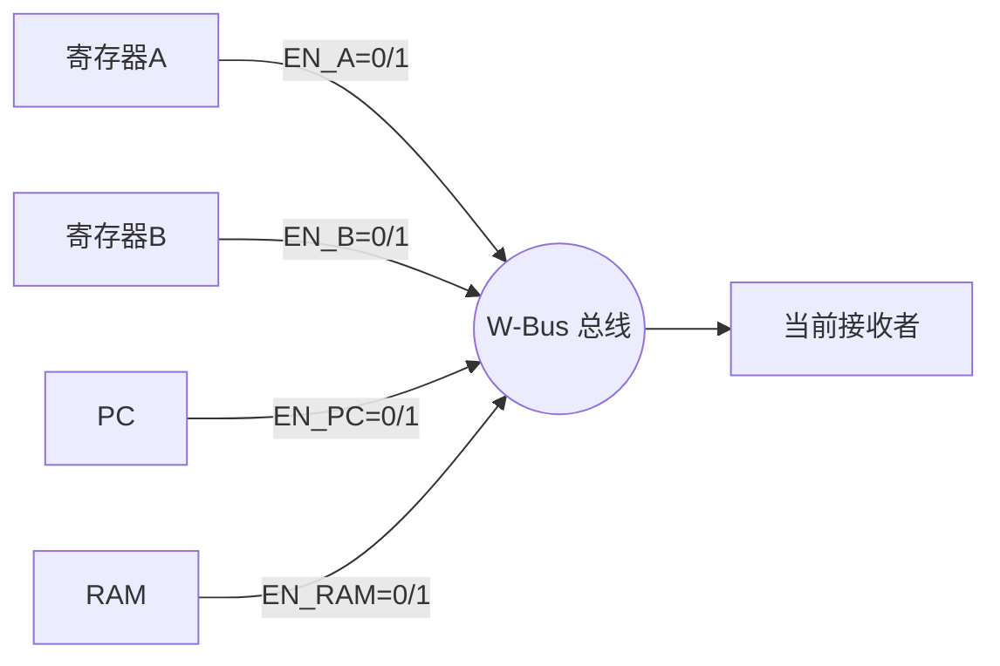

**控制单元的核心职责**：保证任意时刻**最多只有一个 EN=1**。这就是你笔记里"冯·诺依曼瓶颈"具体的物理实现——总线靠"分时"用一根。

对应 PDF 中的芯片：**74LS245**（8 位双向三态总线驱动器），出现在所有连接总线的模块上。

---

#### 0.2.5 上拉电阻 —— 让按键有"默认值"

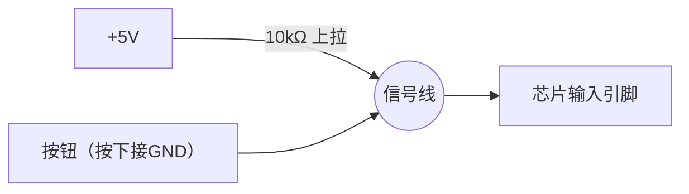

- **没按按钮**：信号线被 10kΩ 弱拉到 5V → **逻辑 1**（默认值）
- **按下按钮**：信号线短到 GND → **逻辑 0**

复位键、单步键全是这个套路。看到原理图里按钮配 10kΩ 接 VCC，就是它。

---

#### 0.2.6 时钟（CLK）与上升沿 —— 全机的"心跳"

时钟信号长这样的方波：

```
        ┌──┐    ┌──┐    ┌──┐
────────┘  └────┘  └────┘  └────
        ↑       ↑       ↑
      上升沿  上升沿  上升沿
```

- **上升沿**（0→1 跳变那一瞬）：所有寄存器同时采样输入并更新输出。
- **频率** $f$ 由 555 定时器外接的 R、C 决定：

$$
f \approx \frac{1.44}{(R_1 + 2R_2)\cdot C}
$$

调电位器（可变电阻）= 调速度。手动模式下，按一次按键 = 人工产生一次上升沿，让你看清每一拍。

> 你笔记 §30.3 的"指令周期"在硬件层就是被这个时钟一拍一拍推动的。

---

#### 0.2.7 锁存器 vs 触发器 —— 1 位"内存"的两种实现

| 类型 | 何时更新 Q | 类比 |
|---|---|---|
| **D 锁存器**（电平触发） | EN=1 期间 Q 持续跟随 D | 推开就一直开的门 |
| **D 触发器**（边沿触发） | 仅在 CLK 上升沿那一瞬采样 D | 闪光灯，按一下记一帧 |

行为伪代码（D 触发器）：

```python
on rising_edge(CLK):
    if EN:
        Q = D     # 锁存
    # else 保持原值
```

**8 个 D 触发器并起来 = 1 个 8 位寄存器** = 你笔记 §30.2 里 EAX 的硬件原型。

对应 PDF 芯片：**74LS173**（4 位 D 触发器，本机用得最多，10 片）。

---

#### 0.2.8 全加器 —— 把你笔记里的二进制加法变成硅片

1 位全加器的真值表（直接从你笔记 §23 推导出来）：

| $A$ | $B$ | $C_{in}$ | $S$（和） | $C_{out}$（进位） |
|---|---|---|---|---|
| 0 | 0 | 0 | 0 | 0 |
| 0 | 0 | 1 | 1 | 0 |
| 0 | 1 | 0 | 1 | 0 |
| 0 | 1 | 1 | 0 | 1 |
| 1 | 0 | 0 | 1 | 0 |
| 1 | 0 | 1 | 0 | 1 |
| 1 | 1 | 0 | 0 | 1 |
| 1 | 1 | 1 | 1 | 1 |

公式：

$$
S = A \oplus B \oplus C_{in}, \qquad
C_{out} = (A \wedge B) \vee \big((A \oplus B)\wedge C_{in}\big)
$$

把 8 个 1 位全加器串成一行 = 8 位加法器。本机用 **74LS283**（4 位全加器）级联两片实现。

**减法怎么做？** 直接用你笔记 §30.5 的补码公式：

$$
A - B = A + \overline{B} + 1 \pmod{2^8}
$$

硬件用 XOR 门（74LS86）做"可控取反"——SU=0 时 B 原样通过，SU=1 时 B 逐位翻转，同时把 SU 当作 $C_{in}$。这就是"一台只有加法器的 CPU 怎么做减法"的真相。

---

#### 0.2.9 EEPROM —— 把它当"硬件版的 dict"

**E**lectrically **E**rasable **P**rogrammable **ROM**：可电擦写的只读存储器，断电不丢数据。

行为完全等价于一个**只读字典/数组**：

$$
\text{output}[8\text{ bit}] = \text{ROM}[\text{address}[11\text{ bit}]]
$$

```python
# 心智模型
rom = {0x000: 0xAB, 0x001: 0x3C, ...}   # 烧录时写好
def read(addr):
    return rom[addr]                     # 运行时只读
```

本机两个用途：

1. **控制单元**（卡片 18）：把 `(opcode, T节拍, flags)` 当 key，查出"这一拍激活哪些控制信号"。这个表叫**微码（microcode）**。
2. **二进制→BCD 显示**（卡片 21）：把 8 位二进制数当 key，查

## 目录

- [Part A：电学最小集（你笔记里没有的物理）](#part-a电学最小集你笔记里没有的物理)
- [Part B：怎么读原理图（符号速查表）](#part-b怎么读原理图符号速查表)
- [Part C：22 张卡片导览（含每张对应你笔记的位置）](#part-c22-张卡片导览)
- [Part D：自创指令集与示例程序逐行解析](#part-d自创指令集与示例程序逐行解析)
- [Part E：常见困惑速查](#part-e常见困惑速查)

---

## Part A：电学最小集（你笔记里没有的物理）

> 你只需要把"电"理解成**信号**，整套体系就和你写程序的直觉对齐了。

### A.1 把电翻译成程序员语言

| 电学名词 | 程序员心智模型 | 在这台机器里出现的形式 |
|---|---|---|
| **电压**（V，伏特） | "这根线现在是 1 还是 0" | $0\text{V}=$ 逻辑 0；$+5\text{V}=$ 逻辑 1 |
| **GND（地）** | 数轴的原点；"逻辑 0 的源头" | 原理图里所有向下的三角符号 |
| **VCC / +5V** | "逻辑 1 的源头" | 给所有 74 系列芯片供电 |
| **电流**（A，安培） | 单位时间流过的电荷量；"够用就行，多了烧" | 板子有 1A 保险丝兜底 |
| **电阻 R**（Ω） | 限流元件 | LED 串联的 200/220Ω；上拉用的 10kΩ |
| **电容 C**（F） | "微型电池/小水库"，能短时间存电 | 555 定时用的 10μF；芯片旁边的 100nF |
| **LED** | 单向小灯，过电流就亮 | 显示总线/寄存器/标志位 |

**唯一要记住的物理公式**——欧姆定律：

$$
V = I \cdot R \quad\Longleftrightarrow\quad I = \frac{V}{R}
$$

举例：原理图里 LED 串了 $R_1=200\,\Omega$ 接到 5V，电流约为

$$
I \approx \frac{5\text{V} - 2\text{V}_{\text{LED}}}{200\,\Omega} = 15\text{ mA}
$$

——LED 正常亮。**整份说明书你不需要再算任何电路**，知道这个量级即可。

### A.2 数字电路两条铁律（极重要）

**铁律 1：任何输入都必须是确定的 0 或 1，不能"悬空"。**
悬空（什么都不接）会被环境噪声乱推，相当于一个未初始化的变量。
- 想强制为 0：接 GND（叫"下拉"）。
- 想强制为 1：接 VCC（叫"上拉"，常通过 10kΩ 电阻）。
- 这就是说明书里反复说"未使用的输入端接地"的原因。

**铁律 2：总线上同一时刻只允许一个"驱动者"。**
两个芯片同时往一根线上写不同电平 = "总线竞争"，结果未定义，烧片是常事。
- 解决方法：每个芯片都加一个"使能"开关 EN，只有 EN=1 时才允许它输出。
- 这就引出下一节的 **三态门**。

### A.3 三种你必须懂的电学小机制

#### A.3.1 上拉电阻（Pull-up）

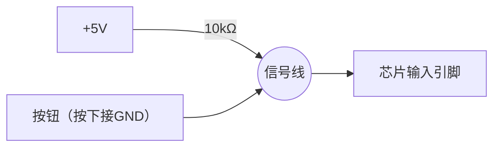

- 按钮**没按时**：信号线被 10kΩ 微弱拉到 5V → 逻辑 1。
- 按钮**按下时**：信号线直接短到 GND → 逻辑 0。
- 作用：让按键、开关有一个确定的"默认值"。这台机器的复位键、单步按键全靠它。

#### A.3.2 去耦电容（Decoupling Capacitor）

每个芯片的 VCC 和 GND 之间都贴一颗 100nF 电容。功能：**把电源上的毛刺吸掉**。
你只要看到原理图里有个 `C? 100nF` 跨在 VCC—GND 之间，无脑当成"电源滤波"，不影响逻辑分析。

#### A.3.3 三态门 / 总线驱动器（Tri-state Buffer）

普通门只有两态：0、1。三态门多一态 **Z（高阻态）**——相当于"把这根线给我断开"。

$$
\text{输出} =
\begin{cases}
\text{输入}, & \text{EN}=1 \\
\text{Z（高阻 / 断开）}, & \text{EN}=0
\end{cases}
$$

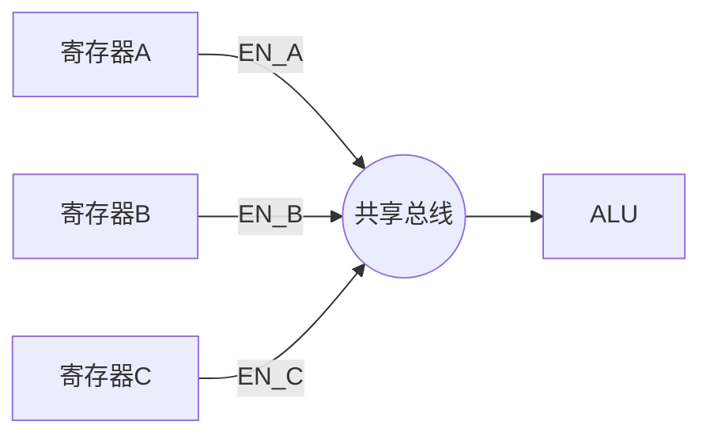

控制单元保证**任意时刻只有一个 EN=1**，其它都 Z。这就是冯·诺依曼"分时复用一根总线"的硬件实现。说明书里的 `74LS245` 就是干这个的（双向 8 位三态总线驱动器）。

### A.4 时钟与方波

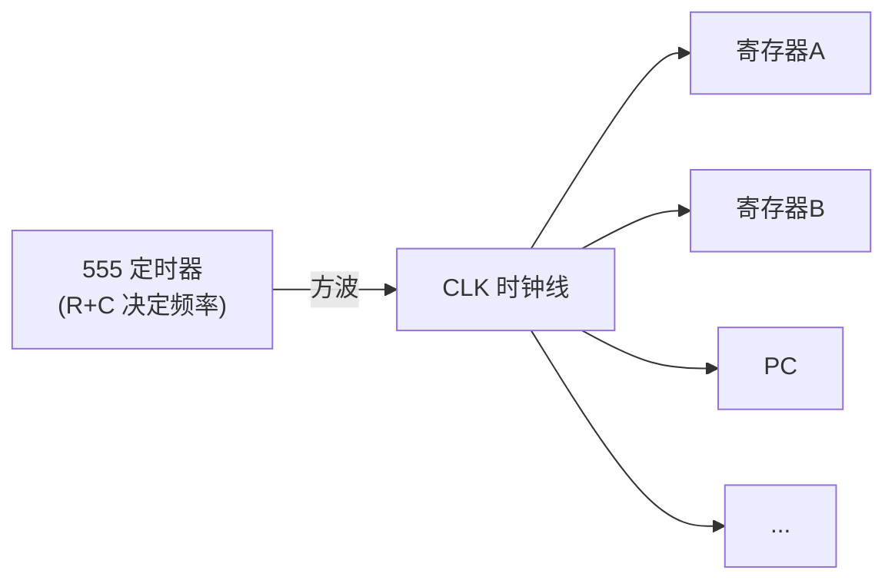

时钟方波长这样：

```
   ┌──┐  ┌──┐  ┌──┐
───┘  └──┘  └──┘  └──   高低交替
   ↑     ↑
 上升沿  上升沿
```

- **上升沿**（0→1 跳变那一瞬）= 全机统一的"心跳"。所有寄存器都在这一瞬同时更新。
- **频率**由 555 外接的 R 和 C 决定：

$$
f \approx \frac{1.44}{(R_1+2R_2) \cdot C}
$$

调电位器就是在调 R，从而调速度。手动模式下，按一次按键 = 手工产生一次上升沿。

> 你笔记里"指令周期 Fetch→Decode→Execute"——每一步都是被这个时钟驱动的。

---

## Part B：怎么读原理图（符号速查表）

### B.1 标识规则

| 标号前缀 | 含义 | 例子 |
|---|---|---|
| `U` | 一颗芯片（IC） | `U5 NE555P` |
| `R` | 电阻 | `R23 1k` |
| `C` | 电容 | `C4 100nF` |
| `LED` | 发光二极管 | `LED15` |
| `SW` | 开关/拨码 | `SW1 DSWB08`（8 位拨码） |
| `J` / 排母 | 接插件 | 模块间公对公排线插这里 |
| 引脚旁写数字 | 该引脚在芯片上的物理编号 | `1, 2, …, 16` |
| 信号名后带 `#` 或 `'` 或上划线 | **低电平有效**（=0 才生效） | `1E#`, `WE`, `OE` |

### B.2 一眼认出是哪种芯片

这块板子上的"演员表"——每个芯片对应你笔记里的什么概念：

| 芯片型号                         | 数量  | 是什么                  | 对应笔记/卡片                   |
| ---------------------------- | --- | -------------------- | ------------------------- |
| **NE555P**                   | 2   | 定时器，产生方波             | 时钟（A.4 节）                 |
| **SN74LS04**（在 SN74LS14 里也含） | —   | 反相器（NOT）             | 你笔记 §21.3 否定              |
| **SN74LS08**                 | 1   | 4 个 2 输入 AND         | 你笔记 §21.3 合取              |
| **SN74LS02**                 | 2   | 4 个 2 输入 NOR         | NOR=NOT(OR)               |
| **SN74HC00**                 | 1   | 4 个 2 输入 NAND        | NAND=NOT(AND)             |
| **SN74LS86**                 | 2   | 4 个 2 输入 XOR         | 你笔记 §21.3 异或              |
| **SN74LS14**                 | 3   | 6 个**施密特反相器**（按键消抖）  | 见 B.3                     |
| **SN74LS76**                 | 1   | 双 JK 触发器（边沿存 1 位）    | 你笔记 §30.2 寄存器             |
| **SN74LS173**                | 10  | 4 位 D 型寄存器（边沿触发，带使能） | A 寄存器、B 寄存器、IR、Out 等都用它   |
| **SN74LS161**                | 2   | 4 位同步计数器             | **PC 程序计数器**、T 节拍计数器      |
| **SN74LS283**                | 2   | 4 位全加器（级联成 8 位）      | **ALU 主体**                |
| **SN74LS157**                | 4   | 4 位 2:1 多路复用器        | 用于做 A/补码 切换实现减法           |
| **SN74LS245**                | 6   | 8 位三态总线驱动器           | 总线分时复用（A.3.3）             |
| **SN74LS139**                | 1   | 2:4 译码器              | 控制信号译码                    |
| **SN74LS219**                | 2   | 64 位 RAM（16×4）       | **16 字节程序内存**（两片拼成 16×8）  |
| **AT28C16**                  | 3   | 2K×8 EEPROM          | 控制单元微码 + 二进制转 BCD 查找表     |
| **74HC595**                  | 2   | 8 位移位寄存器             | 驱动数码管                     |
| **Arduino Nano**             | 1   | 单片机                  | 给 EEPROM 烧程序的"程序员"（卡片 20） |

> 看到陌生芯片，回这张表查；查不到的就当"普通逻辑门组合"，不影响理解整体。

### B.3 几个新概念扫盲

- **施密特反相器（74LS14）**：普通反相器在输入电压"忽高忽低"边界时会颤抖，施密特版本带"迟滞"，输入必须**明显**越过阈值才翻转。**用途：按键消抖**。机械按键按下瞬间会"哒哒哒"抖几次，没消抖会被当成多次按键。
- **D 触发- **D 触发器（74LS173）**：1 位"内存单元"，行为如下

$$
Q_{\text{下一拍}} =
\begin{cases}
D, & \text{时钟上升沿且 EN}=1 \\
Q_{\text{当前}}, & \text{其它时刻}
\end{cases}
$$

  程序员心智模型：

  ```python
  if rising_edge(CLK) and EN:
      Q = D          # 锁存
  else:
      pass           # 保持原值
  ```

  把 8 个 D 触发器并起来 = 8 位寄存器 = 你笔记里的 EAX/EBX。

- **同步计数器（74LS161）**：每个时钟上升沿自动 `+1`，可清零、可加载新值。**这就是 PC**。

- **全加器（74LS283）**：硬件实现

$$
S_i = A_i \oplus B_i \oplus C_{\text{in}}, \qquad
C_{\text{out}} = (A_i \wedge B_i) \vee \big((A_i \oplus B_i) \wedge C_{\text{in}}\big)
$$

  把 4 位的 283 串两片就是 8 位加法器。**减法**怎么做？看 Part C 卡片 11。

- **多路复用器（74LS157，2:1 MUX）**：
  
$$
Y =
\begin{cases}
A, & S=0 \\
B, & S=1
\end{cases}
$$

  程序员心智：`Y = A if S==0 else B`。本机用它在"原值 / 取反"之间切换，做减法。

- **EEPROM（AT28C16）**：可电擦写的只读存储器，断电不丢。**关键用法**：把它当**纯函数查找表**

$$
\text{output} = f(\text{address})
$$

  你给它输入地址 = 给 `f` 传参，它返回该地址里事先烧好的字节 = 函数返回值。本机两个用途：
    1. **控制单元**：地址 = `(Opcode, T节拍)`，输出 = 该拍各模块的使能信号。
    2. **二进制→BCD**：地址 = 8 位二进制数（0–255），输出 = 该数对应的十进制 BCD 编码（卡片 21）。

### B.4 看图三步法

> 拿到一张原理图，按这个顺序看，永远不会迷路。

1. **找芯片型号**（U? 后面那串字母）→ 查 B.2 表，知道这是哪种"演员"。
2. **看引脚名字**而不是引脚号：`CLK`、`D0..D7`、`Q0..Q7`、`EN`、`OE#`、`WE#` 已经说清了功能。
3. **顺着信号线追"输入从哪来、输出到哪去"**，把它当函数调用图来读。

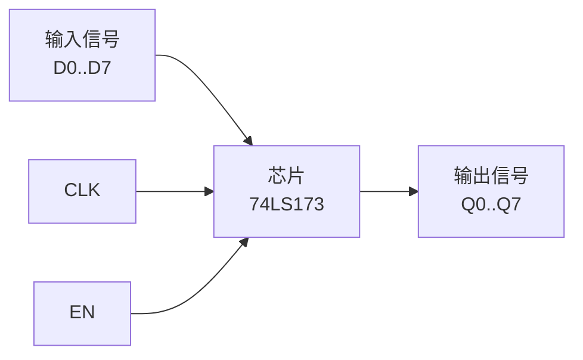

---

## Part C：22 张卡片导览

> 说明书把整机分 5 层 22 张卡片。下面给每张卡片做"摘要 + 翻你笔记哪里 + 物理补充"。

### 第一层：基础逻辑（卡片 1–4）

#### 卡片 1：与/或/非门基础

- **核心**：用 74LS08（AND）、74LS02（NOR）、74LS04（NOT）做出三种基本门。
- **翻你笔记**：`Computer science foundation note.md` §21.3《命题逻辑与真值表》——四个真值表你已经有了，照着比对芯片输出即可。
- **物理补充**：唯一的新概念是**怎么用电压表示真值**（A.1 表）。

#### 卡片 2：异或门 / 同或门

- **核心**：74LS86 做 XOR；NXOR = NOT(XOR)。
- **翻你笔记**：§21.3 异或；§23.5.2 异或在位运算的应用（"找出唯一出现一次的数"那段)。
- **关键事实**：异或就是"一位加法但不进位"——这是 ALU 的种子。

$$
A \oplus B = (A+B) \bmod 2
$$

#### 卡片 3：半加器 / 全加器

- **半加器**：两个 1 位相加，输出和 $S$ 与进位 $C$。

$$
S = A \oplus B,\qquad C = A \wedge B
$$

- **全加器**：再加一个进位输入 $C_{\text{in}}$（公式见 B.3 节）。
- **翻你笔记**：§23 二进制运算（你的"5 + (-3)"补码加法那一节就是把它扩到 8 位的样子）。

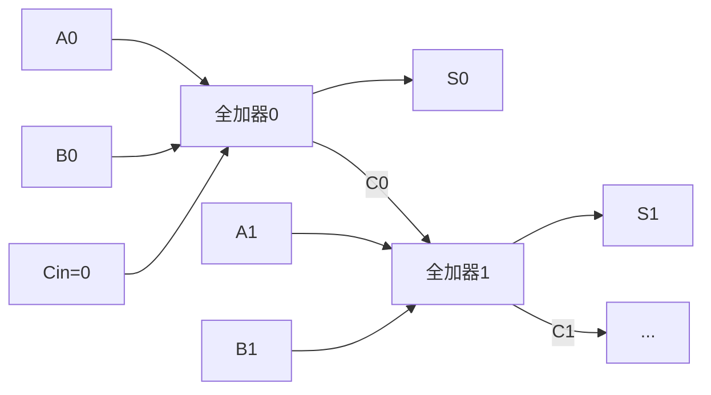

#### 卡片 4：编码器 / 译码器（74LS139）

- **2:4 译码器**：2 根输入选出 4 根输出中的 1 根置低，其它高。心智模型：

```python
def decode_2to4(a1, a0):
    out = [1, 1, 1, 1]
    out[a1*2 + a0] = 0       # 选中那一根 = 0（低有效）
    return out
```

- **用途**：根据 PC 高 2 位选 4 个 RAM 区块；根据 Opcode 选哪条指令。
- **翻你笔记**：没直接对应章节，按上面伪代码理解即可。

---

### 第二层：时序逻辑（卡片 5–8）

#### 卡片 5：D 锁存器 / D 触发器（74LS173 / 74LS76）

- 两者区别：

| 名称 | 何时更新 | 类比 |
|---|---|---|
| **锁存器**（电平触发） | EN=1 期间持续跟随 D | 一扇推开就一直开的门 |
| **触发器**（边沿触发） | 仅在 CLK 上升沿那一瞬采样 D | 闪光灯，按一下记一帧 |

- 本机几乎全部用**边沿触发**——保证所有寄存器在"心跳"那一瞬同步更新。
- **翻你笔记**：§30.2 寄存器定义。

#### 卡片 6：时钟模块（NE555 + 74LS14）

- 555 产生方波（A.4 节公式）。
- 自动模式：555 直接进 CLK。
- 手动模式：按键经 74LS14 消抖后进 CLK。
- 切换由一个拨动开关决定。

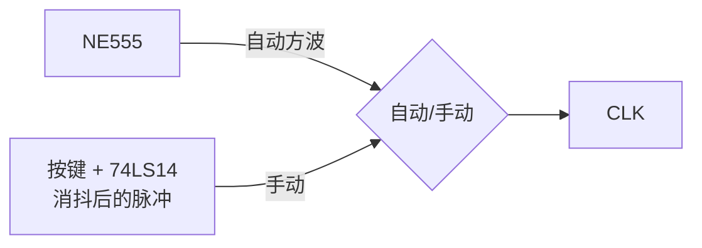

#### 卡片 7：4 位计数器（74LS161）

- 行为伪代码：

```python
on rising_edge(CLK):
    if CLR == 0:        # 复位
        Q = 0
    elif LD == 0:       # 加载
        Q = D
    elif CE == 1:       # 计数使能
        Q = (Q + 1) % 16
    else:
        pass            # 保持
```

- **正是 PC 的实现**，4 位 → 寻址 $2^4=16$ 字节。
- **翻你笔记**：§30.3"程序计数器 PC"那段。

#### 卡片 8：8 位寄存器（两片 74LS173）

- 两片 4 位拼成 8 位。带三态输出 → 直接挂总线。
- 控制信号约定：

| 信号 | 含义 | 有效值 |
|---|---|---|
| `?I` | Input：把总线上的值装进来 | 1 |
| `?O` | Output：把自己的值放上总线 | 1 |

- 例：`AI` = A 寄存器 in；`AO` = A 寄存器 out。

---

### 第三层：ALU、总线、寄存器组（卡片 9–12）

#### 卡片 9：8 位总线（W-Bus）

- 一根 8 根线的"公共车道"。所有想读/写的模块都挂上去，但任意时刻只有一个使能输出（铁律 2 + 三态门 A.3.3）。
- **翻你笔记**：§30.3 冯·诺依曼瓶颈那段——"单一总线"就是这玩意儿。

#### 卡片 10：A 寄存器 与 B 寄存器（累加器）

- 两个挂在总线上的 8 位寄存器，是 ALU 的"两条胳膊"。
- A 寄存器 = 累加器 ACC，所有运算结果默认回到 A。
- **翻你笔记**：§30.1"累加器"那段。

#### 卡片 11：ALU（74LS283 + 74LS86 + 74LS157）

这张卡片最值得花时间。**减法怎么变加法**，和你笔记 §23 补码完全对得上。

**8 位补码减法**：

$$
A - B = A + (\overline{B} + 1) \pmod{2^8}
$$

硬件实现：

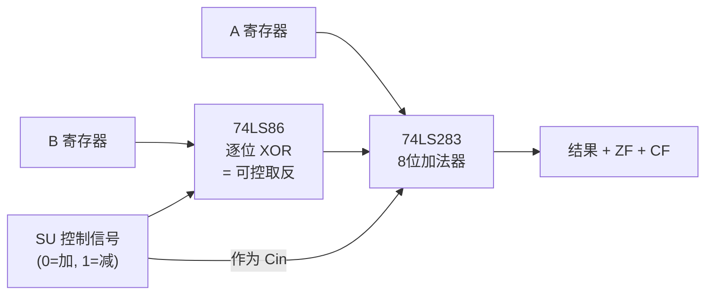

- 当 `SU=0`：B 原样进加法器，$\text{Cin}=0$，结果 $A+B$。
- 当 `SU=1`：B 被逐位 XOR 翻转 $=\overline{B}$，$\text{Cin}=1$，结果 $A+\overline{B}+1=A-B$。

  这正是你笔记里"-3 的补码 = 反码+1"的硬件版本。

**两个标志位**：
- `ZF`（Zero Flag）：8 位结果全 0 时为 1（用 8 输入 NOR 即可）。
- `CF`（Carry Flag）：最高位的 $C_{\text{out}}$。

#### 卡片 12：指令寄存器 IR

- 一颗 8 位寄存器，存当前正在执行的那条指令。
- 8 位指令格式：

$$
\underbrace{[7\,6\,5\,4]}_{\text{Opcode 4位}}\;
\underbrace{[3\,2\,1\,0]}_{\text{操作数 4位（地址或立即数）}}
$$

- **高 4 位**送给控制单元译码（决定干什么）。
- **低 4 位**送地址总线（决定操作哪个内存单元）。
- **翻你笔记**：§30.3 IR 定义；§1.5 汇编里"机器码 = 操作码 + 操作数"。

---

### 第四层：寄存器组与内存（卡片 13–16）

#### 卡片 13：输出寄存器 Out

- 一颗 8 位寄存器，专门保存"要给数码管显示的值"。
- 为什么不让 ALU 直接驱动数码管？因为总线分时复用，ALU 要去干别的。Out 把结果**锁存**住，下次结果来之前一直显示。
- - **翻你笔记**：§30.2"寄存器是 CPU 的工作台"——Out 就是一个"专职显示工"的寄存器。

#### 卡片 14：MAR（Memory Address Register，内存地址寄存器）

- 一颗 4 位寄存器，存"当前要访问的内存地址"。为什么 4 位？因为这台机只有 16 字节内存，$2^4=16$。
- 工作流程：

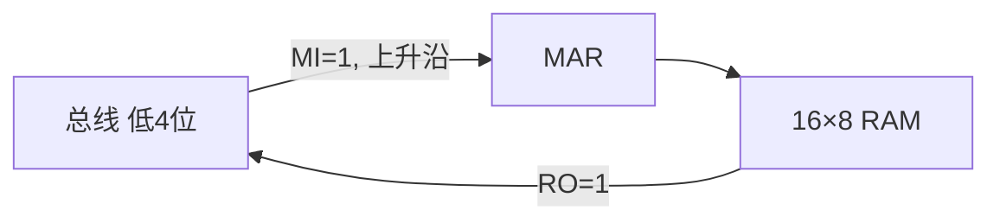

- **翻你笔记**：§30.3"地址总线 / 数据总线"那段——MAR 就是地址总线的来源。

#### 卡片 15：RAM（74LS219 ×2，组成 16×8）

- 74LS219 是 64 位（16×4）静态 RAM，两片并起来 = 16 字节。
- 关键控制信号：

| 信号 | 含义 |
|---|---|
| `RI` | RAM in，把总线值写进 `MAR` 指定的地址 |
| `RO` | RAM out，把 `MAR` 指定地址的值放到总线 |
| `WE#` | 内部写使能，由 `RI` + 时钟组合产生 |

- **关键事实**：地址不是用拨码开关直接选，而是先把地址值放到总线 → `MI=1` 装入 MAR → 再用 `RI` 或 `RO` 读写。这一步分离非常重要，它让"地址也是数据"——程序可以**计算地址**（虽然这台机的指令集没用到，但硬件已经支持）。
- **翻你笔记**：§30.3"主存按地址访问"那段；冯·诺依曼"程序和数据统一存储"——你现在看到的就是它的最小实现。

#### 卡片 16：手动编程面板

- 一组 8 位拨码 + 4 位拨码 + 几个按钮，让你**不用键盘**就能往 RAM 里塞机器码：

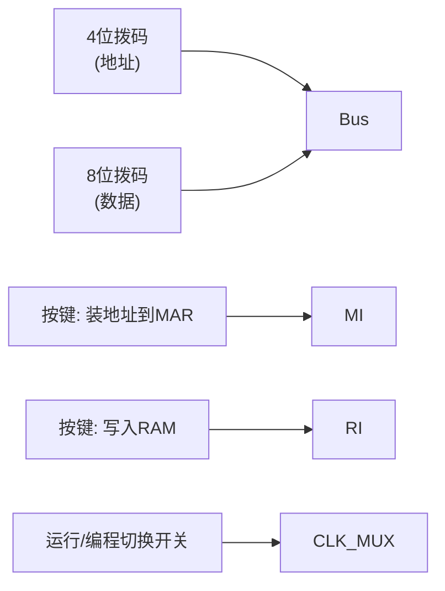

- 编程流程（跟你写汇编后烧录的过程一一对应）：
    1. 切到"编程模式"（断开 CLK，断开 PC，让 RAM 接受外部输入）。
    2. 拨地址 → 按"装地址"。
    3. 拨数据 → 按"写入"。
    4. 重复 16 次填满（或填到够用为止）。
    5. 切回"运行模式"，按复位，开始执行。

---

### 第五层：控制单元 + 整机（卡片 17–22）

#### 卡片 17：节拍计数器 T（74LS161）

- 每条指令分若干"微步"（micro-step），用一个 3 位计数器 T 计数：$T_0, T_1, T_2, \dots, T_5$。
- 每个时钟上升沿 T 自增 1；执行完一条指令到指定步数就清零，回到 $T_0$。
- 类比：**指令周期里的"小拍子"**。

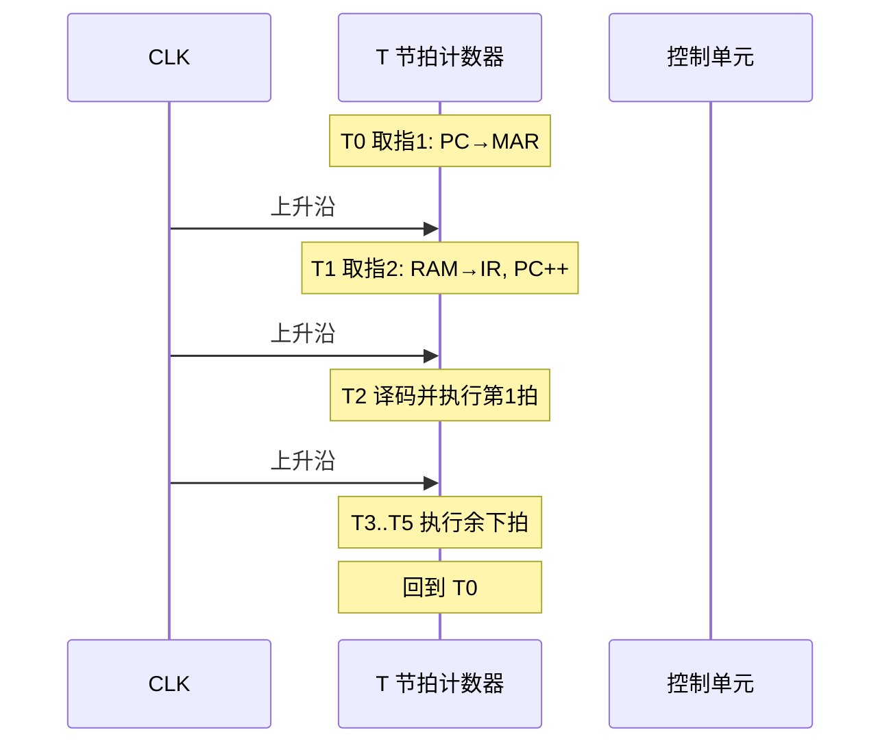

- **翻你笔记**：§30.3 指令执行周期 Fetch→Decode→Execute——这里把它精细化到了"每一拍"。

#### 卡片 18：控制单元 CU（核心！3 片 AT28C16 EEPROM）

这是整台机器最"聪明"的部分。但本质就是一个**纯函数查找表**：

$$
\text{ControlSignals}[24] = f\big(\text{Opcode}[4],\; T[3],\; \text{Flags}[2]\big)
$$

- **输入**（地址线）：当前指令的 4 位 Opcode + 3 位 T 节拍 + 2 位 标志位（ZF, CF）= 9 位 → 共 $2^9=512$ 个地址。
- **输出**（数据线）：24 个控制信号，比如 `HLT, MI, RI, RO, IO, II, AI, AO, ΣO, SU, BI, OI, CE, CO, J, FI, ...`。每个信号决定"下一拍谁干活"。
- 因为 EEPROM 一次只能输出 8 位，所以用 **3 片**并联，每片负责 8 个信号 → 凑够 24 位。

**"微码"思想**：每条指令对应一段控制信号序列。例如 `LDA addr`（把内存某处加载进 A）的微码序列：

| T | 干什么 | 激活的控制信号 |
|---|---|---|
| T0 | PC → MAR（取指地址） | `CO, MI` |
| T1 | RAM → IR, PC++ | `RO, II, CE` |
| T2 | IR 低 4 位 → MAR（操作数地址） | `IO, MI` |
| T3 | RAM → A | `RO, AI` |
| T4 | T 清零 | （隐含） |

**翻你笔记**：§1.5"机器码 → CPU 直接执行"——你现在看到了"直接执行"的真正含义：每个 bit 都对应一根真实的导线被拉高拉低。

#### 卡片 19：标志寄存器 FR（74LS76）

- 2 个 D 触发器存 ZF 和 CF。
- 控制信号 `FI=1` 时，把 ALU 当前算出的 ZF/CF 锁存进来。
- 条件跳转指令（JNZ, JC）就是把 FR 的值送进 EEPROM 的地址线，让 CU 决定"跳还是不跳"。

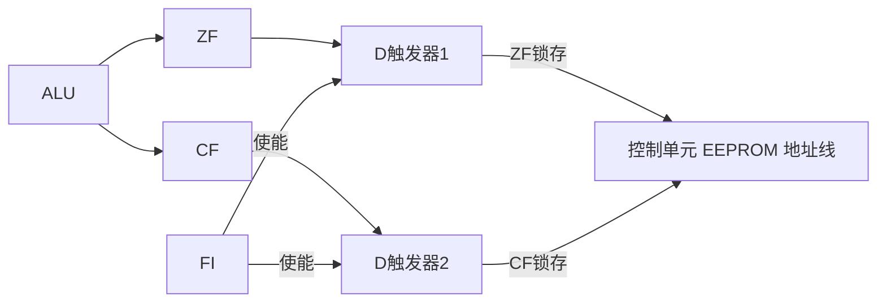

- **翻你笔记**：§30 状态寄存器 / FLAGS。

#### 卡片 20：用 Arduino 给 EEPROM 烧写

- AT28C16 出厂是空白的，必须先烧入控制信号表（卡片 18 的真值表）和 BCD 转换表（卡片 21）。
- Arduino Nano + 2 片 74HC595（移位寄存器，把 Arduino 不够用的 GPIO 扩展成 16 位地址线）就组成一个**简易烧录器**。
- 你只需要知道：**Arduino 在这套系统里不参与运行，只是"出厂前的工具"**。运行时它可以拔掉。
- **翻你笔记**：§1.4 编译/解释——把高级表（C 数组）"编译"成 EEPROM 二进制内容，烧进去就再也不变。

#### 卡片 21：数码管显示（二进制转 BCD）

- 用户期望看十进制（如 `123`），但寄存器里是二进制（`01111011`）。
- 笨办法：在 CPU 里跑除法 → 这台机没有除法器。
- 聪明办法：**EEPROM 当查找表**

$$
\text{BCD}[12] = \text{ROM}[\,\text{BinaryValue}[8]\,]
$$

  地址是 8 位二进制（0–255），输出 12 位 BCD（百位、十位、个位各 4 位）。然后 74HC595 把 BCD 推到三个共阴数码管。
- **翻你笔记**：§1.5 关于"用空间换时间"的思想——这就是最朴素的查找表加速。

#### 卡片 22：整机联调

- 把所有模块通过排母 + 排线插起来，共享同一根 W-Bus、同一根 CLK、同一根 RST。
- 一张完整的数据通路图：

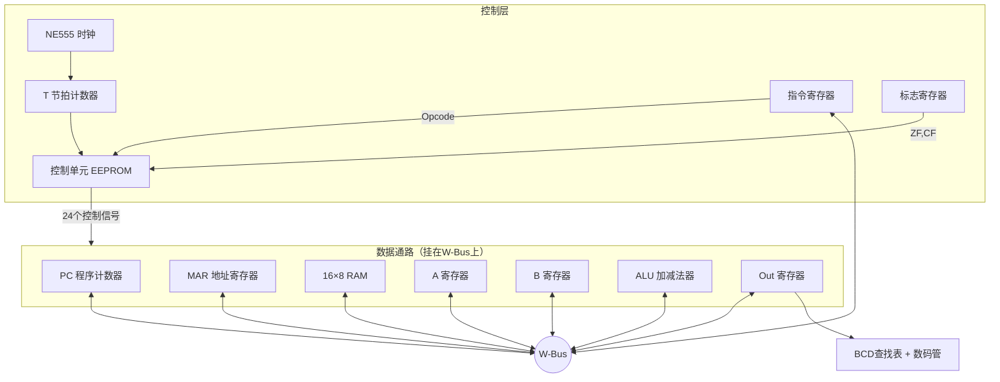

把这张图记牢，22 张卡片就串成一台真·CPU 了。

---

## Part D：自创指令集与示例程序逐行解析

### D.1 指令格式回顾

$$
\text{指令} = \underbrace{\text{Opcode}[4\text{ bit}]}_{\text{高4位}} \;\Vert\; \underbrace{\text{Operand}[4\text{ bit}]}_{\text{低4位}}
$$

低 4 位含义随指令而定：可能是**地址**（0–15），也可能是**立即数**（0–15），也可能**没用**。

### D.2 指令集对照表

| 助记符 | Opcode (二进制) | 操作 | 类比高级语言 |
|---|---|---|---|
| `NOP` | `0000` | 不做任何事 | `pass` |
| `LDA addr` | `0001 aaaa` | A ← RAM[aaaa] | `A = mem[addr]` |
| `ADDA addr` | `0010 aaaa` | A ← A + RAM[addr] | `A += mem[addr]` |
| `SUBA addr` | `0011 aaaa` | A ← A − RAM[addr] | `A -= mem[addr]` |
| `STA addr` | `0100 aaaa` | RAM[addr] ← A | `mem[addr] = A` |
| `LDI imm` | `0101 iiii` | A ← imm（立即数） | `A = imm` |
| `JMP addr` | `0110 aaaa` | PC ← addr | `goto addr` |
| `JNZ addr` | `0111 aaaa` | 若 ZF=0 则 PC ← addr | `if A != 0: goto addr` |
| `SUBAI imm` | `1000 iiii` | A ← A − imm | `A -= imm` |
| `OUT` | `1110 ----` | Out ← A，显示 | `print(A)` |
| `HLT` | `1111 ----` | 停机 | `exit()` |

> **翻你笔记**：§1.5 汇编与机器码的对应；§30 操作码 / 操作数的概念。把这张表当成"这台 CPU 的 ISA"——它就是一台麻雀虽小但五脏俱全的指令集架构。

### D.3 加法程序逐行解析（0 + 5 = 5）

源代码（来自说明书）：

| 地址 | 助记 | 机器码 | 含义 |
|---|---|---|---|
| 0 | `LDI 0` | `0101 0000` | A ← 0 |
| 1 | `ADDA 15` | `0010 1111` | A ← A + RAM[15] |
| 2 | `OUT` | `1110 0000` | 显示 A |
| 3 | `HLT` | `1111 0000` | 停机 |
| 15 | 数据 | `0000 0101` | 数字 5 |

执行轨迹（按"每条指令分微步"展开）：

```
PC=0  取指: RAM[0]=01010000 → IR=01010000
       执行 LDI 0:  A ← 0000 0000

PC=1  取指: RAM[1]=00101111 → IR=00101111
       执行 ADDA 15:
         IR低4位=1111 → MAR=15
         RAM[15]=00000101 → B
         ALU: A+B = 0+5 = 5 → A

PC=2  取指: RAM[2]=11100000 → IR
       执行 OUT: Out ← A=5  → 数码管显示 "5"

PC=3  取指: RAM[3]=11110000 → IR
       执行 HLT: 时钟被门控住，CPU 冻结
```

**翻你笔记**：§30.3 取指-译码-执行；§1.5 PC 自增。

### D.4 减法程序（15 − 5 = 10）

| 地址 | 助记 | 机器码 |
|---|---|---|
| 0 | `LDI 15` | `0101 1111` |
| 1 | `SUBA 15` | `0011 1111` |
| 2 | `OUT` | `1110 0000` |
| 3 | `HLT` | `1111 0000` |
| 15 | 数据 5 | `0000 0101` |

关键步骤在 `SUBA 15`：硬件层面发生了什么？回看卡片 11 的 ALU 框图——`SU=1` 让 B=`00000101` 经 XOR 翻转成 `11111010`，再加 `Cin=1`，得到 `11111011`（即补码 −5）。最后 A=`00001111`(15) 加 `11111011`(−5) = `00001010`(10)，CF=1 表示进位（这里被丢弃）。

完美对应你笔记 §23《二进制补码加减》。

### D.5 连加程序（每按一次时钟，A 增加 2，无限循环）

说明书的代码（部分）：

```
0  LDI 0       0101 0000      A ← 0
1  ADDA 15     0010 1111      A ← A + RAM[15] (=2)
2  OUT         1110 0000      显示
3  JMP 1       0110 0001      跳回地址1
15 数据 2       0000 0010
```

执行：

$$
A: 0 \to 2 \to 4 \to 6 \to 8 \to \dots
$$

直到 A 超过 255 时溢出回 0（8 位无符号环）。这就是你笔记 §23 提到的"位宽溢出"在硬件上的真实表现。

### D.6 乘法程序（4 × 3 = 12）—— 重点

这是说明书最复杂的例子，也是你**理解条件跳转和循环**的试金石。

**算法思路**（高级语言版）：

```python
sum = 0
x = 3        # 循环计数
y = 4        # 被加数
while x != 0:
    sum += y
    x   -= 1
print(sum)   # 12
```

**机器码版本**（直接抄说明书表）：

| 标号 | 地址 | 助记 | 机器码 | 注释 |
|---|---|---|---|---|
|  | 0 | `LDA 14` | `0001 1110` | A ← x（初值 3） |
|  | 1 | `SUBAI 0` | `1000 0000` | A ← A−0，目的是**让 ALU 算一次以更新 ZF** |
| start | 2 | `JNZ 6` | `0111 0110` | 若 ZF=0（即 x≠0），跳到 6 继续；否则顺序往下 |
|  | 3 | `LDA 15` | `0001 1111` | A ← sum |
|  | 4 | `OUT` | `1110 0000` | 显示结果 |
|  | 5 | `HLT` | `1111 0000` | 停机 |
| continue | 6 | `LDA 15` | `0001 1111` | A ← sum |
|  | 7 | `ADDA 13` | `0010 1101` | A ← sum + y |
|  | 8 | `STA 15` | `0100 1111` | sum ← A |
|  | 9 | `LDA 14` | `0001 1110` | A ← x |
|  | 10 | `SUBAI 1` | `1000 0001` | A ← x − 1 |
|  | 11 | `STA 14` | `0100 1110` | x ← A |
|  | 12 | `JMP 2` | `0110 0010` | 回到 start，重新判 ZF |
|  | 13 | y=4 | `0000 0100` | 数据 |
|  | 14 | x=3 | `0000 0011` | 数据 |
|  | 15 | sum=0 | `0000 0000` | 数据 |

**关键技巧**：地址 1 那条 `SUBAI 0` 看似什么都没干，其实**逼 ALU 跑一次以刷新 ZF 标志位**。因为 `LDA` 不经过 ALU，它装载完后 ZF 还是上一次的值。这是真实 CPU 设计中的常见小陷阱——**载入指令不影响标志位**。

**控制流图**：

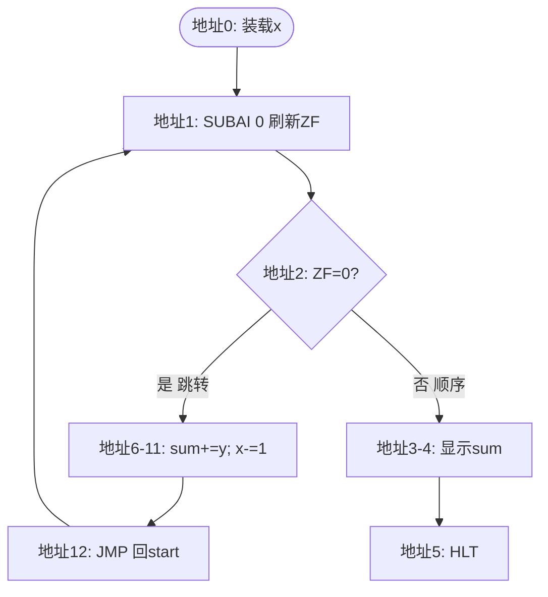

**循环展开追踪**（手算验证）：

| 轮次 | x | sum | A 末态 | ZF |
|---|---|---|---|---|
| 进入循环前 | 3 | 0 | 3 | 0 |
| 第1次结束 | 2 | 4 | 2 | 0 |
| 第2次结束 | 1 | 8 | 1 | 0 |
| 第3次结束 | 0 | 12 | 0 | 1 |
| 跳转判断 | — | — | — | 1 → 不跳，顺序往下 → 输出 12 |

完美。

**翻你笔记**：§30 条件跳转；你之前 ML 笔记里"梯度下降的 while 循环"其实就是这个结构的高级语言版。

---

## Part E：常见困惑速查

### E.1 为什么本机用低电平有效（带 `#` 的信号）？

TTL 芯片在历史上"拉低"比"拉高"驱动能力强，所以使能/复位/写信号传统上用低电平有效。看到 `1E#=0` 表示"使能开启"，看到 `WE#=0` 表示"正在写"。

### E.2 CPU 一个周期到底发生了什么？

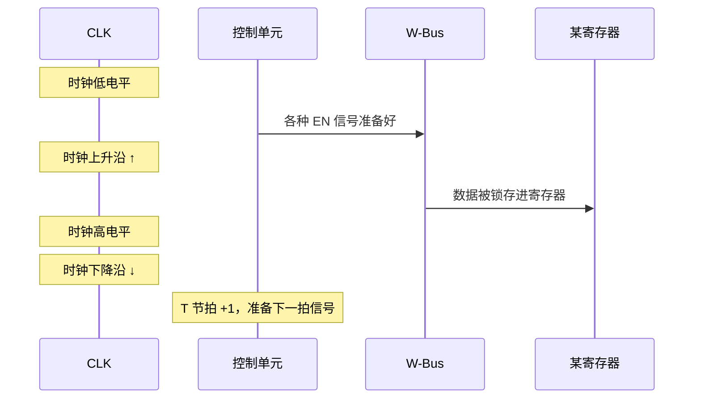

**核心事实**：所有"赋值"动作都发生在**上升沿那一瞬**。低电平期间是给控制信号"摆好姿势"的时间。

### E.3 为什么需要 16 字节 RAM？4 位地址够干嘛？

够写一个乘法循环（13 条指令 + 3 个变量）正好填满。这台机的目的不是真去算东西，而是让你**亲眼看到**"一段二进制如何驱动一台真实的硅片完成图灵计算"。

**翻你笔记**：§1.5 图灵机；任何能做条件跳转 + 任意修改内存的机器都是图灵完备的——这台 16 字节小机器在数学上和你的笔记本电脑等价（只是慢、内存小）。

### E.4 W-Bus 上一瞬间究竟有几个值？

**永远只有 1 个**。物理上一根线就是一个电压。控制单元的全部工作就是保证：**任意一拍，最多一个 `?O` 信号为 1，可以多个 `?I` 同时为 1**（多个寄存器可以同时读总线，但只能一个写总线）。

### E.5 标志位 ZF 是怎么"自动"算出来的？

8 个数据位 → 8 输入或非门（用 NOR 链或 NAND 树搭）：

$$
\text{ZF} = \overline{S_7 \vee S_6 \vee \dots \vee S_0}
$$

只有全 0 时 ZF=1。是个**纯组合逻辑**，不需要时钟。
但要"记住"它供后面指令用，必须用 `FI` 信号在 ALU 算完那一拍把它锁进 FR（卡片 19）。

### E.6 EEPROM 烧错了怎么办？

拔下来重新插到 Arduino 烧录器上覆盖即可（"E"=Electrically，可电擦写）。这就是为什么不用 ROM 而用 EEPROM——给 DIY 留了改 bug 的余地。

### E.7 整机最容易出错的三个地方

1. **悬空输入**：未用的引脚忘记接 GND/VCC，行为飘忽。
2. **总线竞争**：两个 `?O` 同时为 1，烧片或数据错乱。
3. **时钟太快**：脉冲短于芯片传播延迟，结果还没稳定就被锁存。本机 555 起始频率压得很低（几 Hz–几十 Hz），就是为了让你**用肉眼看清每一拍**。

---

## 附：你完全不需要懂的部分（直接跳过）

- 555 内部的比较器/分压器结构
- TTL 工艺的输入阈值电压细节
- EEPROM 的浮栅晶体管原理
- 排阻 vs 单电阻的封装差别（功能完全一样，只是省空间）
- 三色 LED 的颜色驱动（板子只是当指示灯用）

这些懂了不影响读图，不懂也不影响读图。**你的目标是计算机体系结构，不是模电**。

---

