[[Python 技术文档#**第19章：数据分析与扩展库入门 (Data Analysis and Extension Libraries)**]][[COMPUTER SCIENCE 2nd]]
[[TensorBoard]][[TensorFlow-Serving]][[TorchServe]][[ONNX-Runtime]][[LlamaIndex]][[Transformers]][[YOLO]][[OpenCV]][[CatBoost]][[Scikit-Learn]][[Scikit-Learn]][[TensorFlow]][[Keras]][[JAX]][[PyTorch]]
## **第一章 机器学习导论  Introduction**
### 1. What is Machine Learning
#### 定义
- Arthur Samuel (1959)：让计算机在没有被明确编程的情况下学习
- Tom Mitchell (1998)：T (Task)、E (Experience)、P (Performance)
#### 传统编程 vs 机器学习
- 传统编程：规则 + 数据 → 答案
- 机器学习：数据 + 答案 + 规则 → 答案

##### 1. 传统编程 (Traditional Programming)

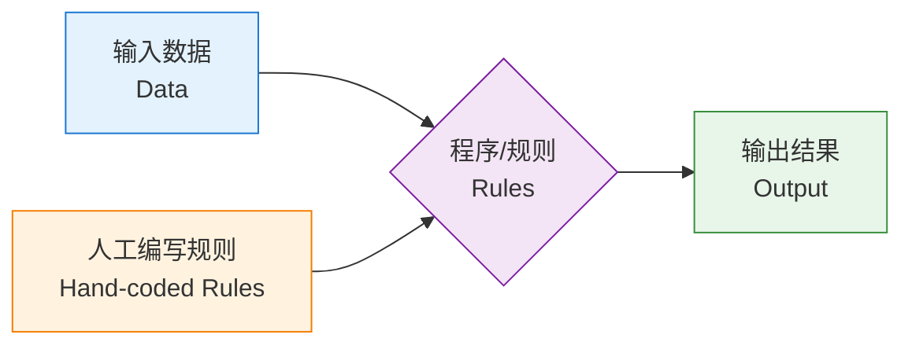

##### 2. 机器学习 (Machine Learning)

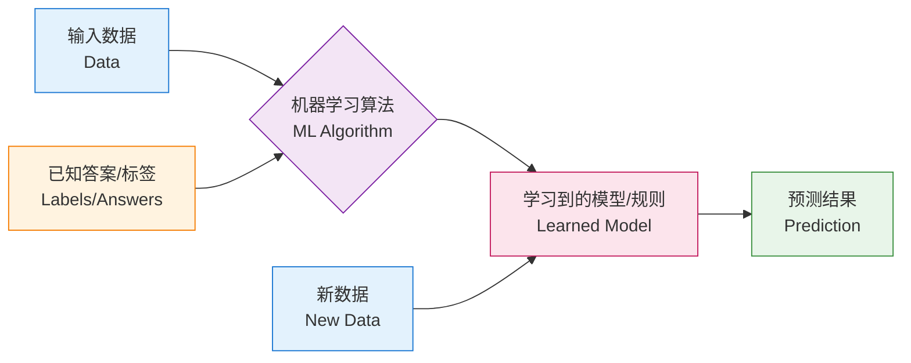

| 对比维度 |  传统编程 (Traditional Programming) |  机器学习 (Machine Learning) |
|---------|------------------------------------|-------------------------------|
| **核心思想** | 人类编写规则，计算机执行 | 计算机从数据中自动学习规则 |
| **输入** | 数据 + 规则 (Rules) | 数据 + 标签 (Labels) |
| **输出** | 答案 (Answer) | 模型 / 规则 (Model) |
| **规则来源** | 程序员手工编写 | 算法自动从数据中学习 |
| **适用问题** | 逻辑明确、规则清晰的问题 | 规则复杂、难以显式描述的问题 |
| **典型例子** | 计算器、排序算法、银行系统 | 图像识别、语音识别、推荐系统 |
| **数据依赖** | 不强依赖大量数据 | 强依赖大量高质量数据 |
| **可解释性** | 强，逻辑透明可追踪 | 较弱（尤其深度学习是"黑盒"） |
| **维护方式** | 修改代码逻辑 | 重新训练模型 / 更新数据 |
| **应对变化** | 需要人工修改规则 | 可通过新数据自动适应 |
| **开发周期** | 编码 → 测试 → 部署 | 数据准备 → 训练 → 评估 → 部署 |
| **错误处理** | 调试代码 (Debug) | 调参、改模型、加数据 |
| **计算资源** | 一般较低 | 训练阶段消耗大（CPU/GPU） |
| **性能上限** | 取决于程序员的能力 | 取决于数据质量和模型能力 |
| **示例任务** | "判断数字是否为偶数" | "判断邮件是否为垃圾邮件" |

---
 ### 2. Why ML
 - 解决难以用规则描述的问题（图像、语音、自然语言）
- 处理大规模数据
- 自动适应新数据
- 应用场景：推荐系统、自动驾驶、医疗诊断、金融风控…
---
### 3. Types of ML
1. **监督学习 (Supervised Learning)**
    - 有标签数据
    - 分类 (Classification) / 回归 (Regression)
2. **无监督学习 (Unsupervised Learning)**
    - 无标签数据
    - 聚类 (Clustering) / 降维 (Dimensionality Reduction)
3. **半监督学习 (Semi-supervised Learning)**
4. **强化学习 (Reinforcement Learning)**
    - Agent、Environment、Reward


---
### 4.  Three Key Elements of Machine Learning

机器学习的本质可以用一句话概括：

> **机器学习 = 数据 (Data) + 模型 (Model) + 算法 (Algorithm)**

也有学者表述为：**数据、模型、策略 + 算法**（李航《统计学习方法》中的"三要素"）。下面我会两种说法都讲清楚 

---

####  一、Mermaid 总览图

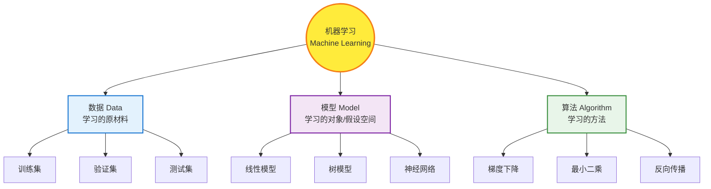

---

#### 1️.数据 (Data) — 学习的"原材料"

#####  定义
数据是机器学习的**基础**，模型从数据中学习规律。没有数据，就没有机器学习。

#####  数据的组成
| 概念 | 含义 | 示例 |
|------|------|------|
| 样本 (Sample) | 一条数据记录 | 一封邮件 |
| 特征 (Feature) | 描述样本的属性 | 邮件标题、长度、关键词 |
| 标签 (Label) | 目标输出 | 是否为垃圾邮件 |
| 数据集 (Dataset) | 样本的集合 | 10000 封邮件 |

#####  数据的划分
- **训练集 (Training Set)**：用于训练模型 (~60-80%)
- **验证集 (Validation Set)**：用于调参 (~10-20%)
- **测试集 (Test Set)**：用于最终评估 (~10-20%)

#####  数据质量决定上限
> **"Garbage in, garbage out"**（垃圾进，垃圾出）
> 数据决定了模型的天花板，算法只是逼近这个上限。

---

#### 2.模型 (Model) — 学习的"对象"

##### 定义
模型是从输入到输出的**映射函数** $f: X \rightarrow Y$，也称作**假设 (Hypothesis)**。

#####  假设空间 (Hypothesis Space)
所有可能模型的集合，记作 $\mathcal{H}$。机器学习的过程就是在 $\mathcal{H}$ 中找到最优的 $f$。

#####  常见模型分类
| 类别 | 代表模型 | 应用 |
|------|---------|------|
| 线性模型 | 线性回归、逻辑回归 | 简单分类/回归 |
| 树模型 | 决策树、随机森林、XGBoost | 表格数据 |
| 概率模型 | 朴素贝叶斯、HMM | 文本、序列 |
| 核方法 | SVM | 中小数据集 |
| 神经网络 | CNN、RNN、Transformer | 图像、语音、NLP |

#####  数学表示
$$
y = f(x; \theta)
$$
其中 $\theta$ 是模型参数（待学习）。

---

#### 3️.算法 (Algorithm) — 学习的"方法"

#####  定义
算法是**如何从数据中学到模型参数 $\theta$** 的具体方法，即**优化求解过程**。

#####  常见优化算法
| 算法 | 用途 |
|------|------|
| 梯度下降 (Gradient Descent) | 最常用的通用优化方法 |
| 随机梯度下降 (SGD) | 大数据场景 |
| 最小二乘法 (Least Squares) | 线性回归解析解 |
| 牛顿法 / 拟牛顿法 | 二阶优化 |
| 反向传播 (Backpropagation) | 神经网络专用 |
| EM 算法 | 含隐变量的概率模型 |

#####  算法要解决的问题
- 如何**快速**找到最优解？
- 如何**避免**陷入局部最优？
- 如何在**大数据**下高效计算？

---

####  二、李航《统计学习方法》版本：模型 + 策略 + 算法

如果你看的是统计学习方法相关教材，三要素表述略有不同：

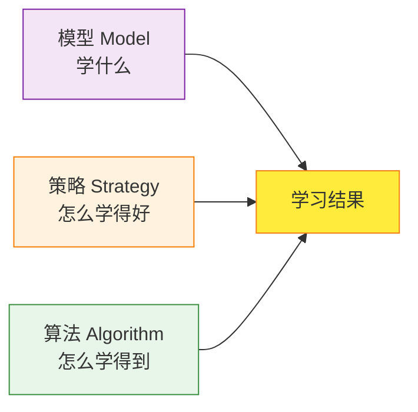

| 要素 | 含义 | 举例 |
|------|------|------|
| **模型 (Model)** | 假设空间，要学习的函数形式 | 线性函数 $y = wx+b$ |
| **策略 (Strategy)** | 学习的目标/准则，即**损失函数**和优化目标 | 最小化均方误差 MSE |
| **算法 (Algorithm)** | 求解模型参数的具体计算方法 | 梯度下降法 |

---

####  三、三要素之间的关系

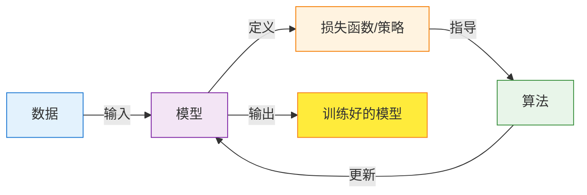

#####  用"做菜"比喻理解：
| 三要素 | 做菜类比 |
|--------|---------|
| 数据 | 食材 |
| 模型 | 菜谱（要做什么菜） |
| 策略 | 评价标准（好不好吃） |
| 算法 | 烹饪步骤（怎么做） |

---

> **"数据是燃料，模型是引擎，算法是驾驶技术"** 

或者：

> **数据**告诉你"有什么"
> **模型**告诉你"想学什么"
> **策略**告诉你"什么算学好了"
> **算法**告诉你"怎么学到"

---

1. **数据**是基础（决定上限）
2. **模型**是载体（决定形式）
3. **算法**是手段（决定效率）
4. 三者**缺一不可**，相互配合才能完成机器学习任务。
---

### 5. How Machine Learning Works 

机器学习的工作过程，本质上是一个 **"从数据中学习规律 → 用规律做预测"** 的循环过程。下面从**整体流程、核心机制、数学原理、形象比喻**四个角度来讲解。
![[Pasted image 20260510023018.png]]
---

#### 1.整体工作流程图

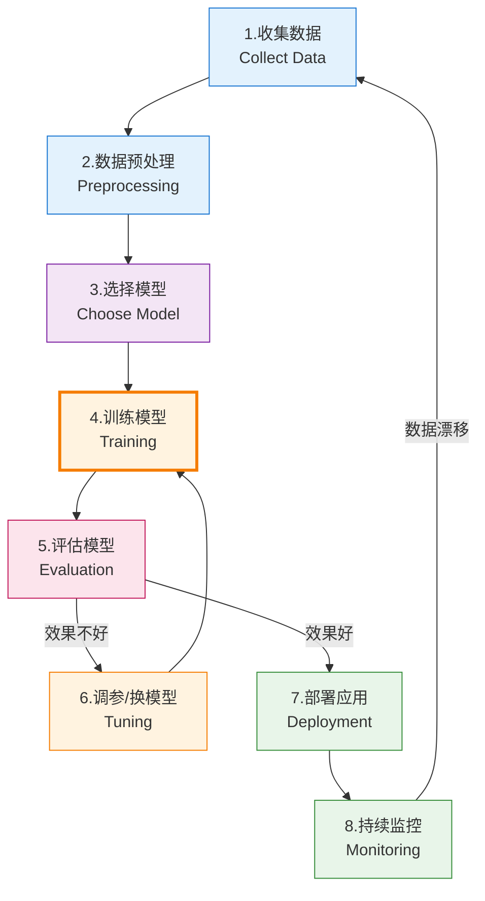
![[Pasted image 20260510023037.png]]

---

#### 2.机器学习的核心机制：训练与预测

机器学习分为**两个阶段**：

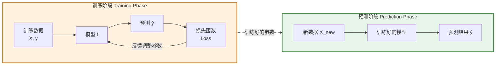

---

#### 3.训练过程详解（核心）

机器学习的"学习"过程，本质就是 **不断调整模型参数，让预测越来越准** 的过程。

##### 训练循环 (Training Loop)

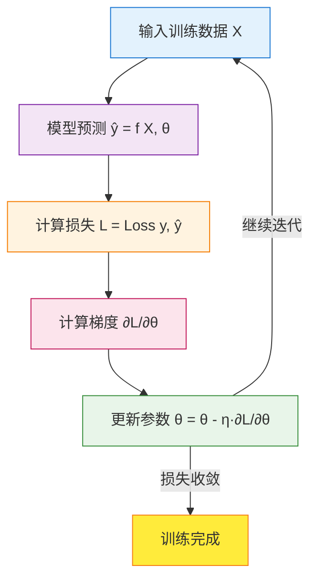

##### 四个关键步骤

| 步骤 | 公式 | 作用 |
|------|------|------|
| ① 前向传播 | $\hat{y} = f(x; \theta)$ | 模型根据当前参数做预测 |
| ② 计算损失 | $L = \text{Loss}(y, \hat{y})$ | 衡量预测值与真实值的差距 |
| ③ 计算梯度 | $g = \frac{\partial L}{\partial \theta}$ | 找到损失下降最快的方向 |
| ④ 更新参数 | $\theta \leftarrow \theta - \eta \cdot g$ | 朝梯度反方向迈一小步 |

其中 $\eta$ 是**学习率 (Learning Rate)**，控制每一步的"步长"。

---

#### 4.举个具体例子：房价预测

假设我们要根据**房屋面积**预测**房价**。

##### Step 1：准备数据
| 面积 (㎡) | 房价 (万元) |
|---------|------------|
| 50 | 150 |
| 80 | 240 |
| 100 | 300 |
| 120 | 360 |

##### Step 2：选择模型
假设是线性关系：
$$
\hat{y} = w \cdot x + b
$$
- $x$：面积
- $\hat{y}$：预测房价
- $w, b$：要学习的参数

##### Step 3：定义损失函数（均方误差 MSE）
$$
L = \frac{1}{n}\sum_{i=1}^{n}(y_i - \hat{y}_i)^2
$$

##### Step 4：训练（迭代优化）

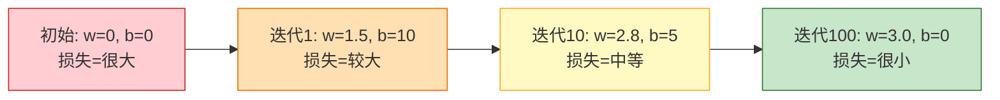

最终学到：$\hat{y} = 3.0 \cdot x$，即每平米 3 万元。

##### Step 5：预测新数据
新房 90㎡ → 预测房价 = 3.0 × 90 = **270 万元**

---

#### 5.损失函数与优化的可视化

##### 把训练想象成"下山"

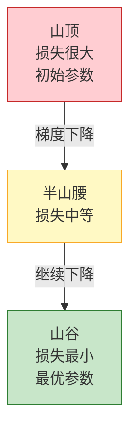

- **山的高度** = 损失值 (Loss)
- **位置** = 模型参数 $\theta$
- **下山方向** = 负梯度方向
- **步长** = 学习率 $\eta$
- **目标** = 找到山谷最低点（最优参数）

---

#### 6.机器学习"学到了什么"

模型通过训练，学到的其实是 **数据中的统计规律 / 模式 (Patterns)**：

| 任务类型 | 学到的"规律" |
|---------|-------------|
| 房价预测 | 面积越大 → 房价越高的线性关系 |
| 垃圾邮件识别 | "免费"、"中奖"等词 → 垃圾邮件的关联 |
| 图像识别 | 边缘 → 纹理 → 形状 → 物体的层次特征 |
| 推荐系统 | 用户A和B兴趣相似 → 互相推荐喜欢的东西 |

**本质**：机器学习就是在 **高维空间中找到一个函数**，让它能很好地拟合数据中的规律。

---

#### 7.形象比喻：学生学习

| 机器学习过程 | 学生学习类比 |
|-------------|-------------|
| 训练数据 | 教材 + 习题 |
| 模型 | 学生的大脑 |
| 参数 | 大脑中的知识 |
| 损失函数 | 考试错题数量 |
| 梯度下降 | 根据错题改进学习方法 |
| 学习率 | 改进的力度 |
| 验证集 | 模拟考试 |
| 测试集 | 期末考试 |
| 过拟合 | 死记硬背，遇新题不会做 |
| 欠拟合 | 没学好，连原题都做错 |

---

#### 8.常见问题与挑战

| 问题 | 表现 | 解决思路 |
|------|------|---------|
| **过拟合** | 训练好，测试差 | 正则化、增加数据、Dropout |
| **欠拟合** | 训练差，测试也差 | 换更复杂模型、加特征 |
| **学习率太大** | 损失震荡不收敛 | 调小学习率 |
| **学习率太小** | 训练太慢 | 调大学习率 |
| **数据不平衡** | 偏向多数类 | 重采样、加权损失 |
| **数据泄漏** | 测试效果虚高 | 严格划分训练/测试集 |

---

### 6. Types of Machine Learning

机器学习根据**学习方式**和**数据特点**，主要分为四大类型。下面逐一详细讲解。

---

#### 1. 总览：机器学习的四大类型

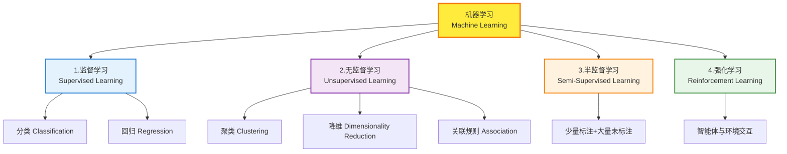

##### 快速对比表

| 类型 | 数据特点 | 学习目标 | 典型应用 |
|------|---------|---------|---------|
| 监督学习 | 有标签 (X, y) | 学习 X→y 的映射 | 房价预测、图像分类 |
| 无监督学习 | 无标签 (只有X) | 发现数据内在结构 | 用户分群、异常检测 |
| 半监督学习 | 少量有标签+大量无标签 | 结合两者优势 | 医疗影像、网页分类 |
| 强化学习 | 环境反馈 (奖励) | 学习最优决策策略 | 游戏AI、机器人控制 |

---

#### 2. 监督学习 (Supervised Learning)

##### 定义
给定带**标签 (Label)** 的训练数据，让模型学习从**输入 X** 到**输出 y** 的映射函数 $f: X \rightarrow Y$。

##### 工作原理图


##### 两大子类

###### (1) 分类 (Classification) —— 预测离散类别

| 任务 | 输入 | 输出（标签） |
|------|------|------------|
| 垃圾邮件识别 | 邮件内容 | 垃圾 / 正常（二分类） |
| 手写数字识别 | 图像像素 | 0~9（多分类） |
| 疾病诊断 | 体检数据 | 患病 / 健康 |
| 情感分析 | 文本 | 正面/负面/中性 |

**常见算法**：
- 逻辑回归 (Logistic Regression)
- 决策树 (Decision Tree)
- 随机森林 (Random Forest)
- 支持向量机 (SVM)
- 朴素贝叶斯 (Naive Bayes)
- K近邻 (KNN)
- 神经网络 (Neural Network)

###### (2) 回归 (Regression) —— 预测连续数值

| 任务 | 输入 | 输出（数值） |
|------|------|------------|
| 房价预测 | 面积、地段等 | 房价（万元） |
| 股票预测 | 历史价格 | 明日价格 |
| 销量预测 | 广告投入 | 销售额 |
| 温度预测 | 气象数据 | 温度（℃） |

**常见算法**：
- 线性回归 (Linear Regression)
- 岭回归 (Ridge)
- Lasso 回归
- 多项式回归 (Polynomial Regression)
- 回归树、回归森林
- 神经网络

##### 分类 vs 回归

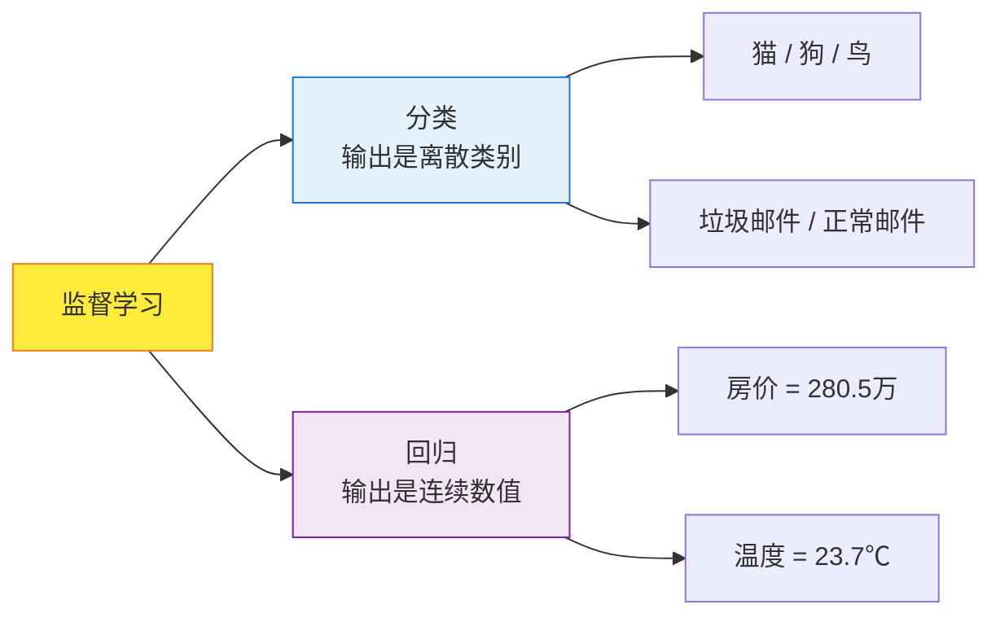

##### 优缺点

| 优点 | 缺点 |
|------|------|
| 准确率高，效果可控 | 需要大量标注数据（昂贵） |
| 评估指标明确 | 无法发现新类别 |
| 应用广泛、成熟 | 标注质量影响巨大 |

---

#### 3. 无监督学习 (Unsupervised Learning)

###### 定义
训练数据**没有标签**，让模型自己发现数据中的**内在结构、规律或模式**。

###### 工作原理图

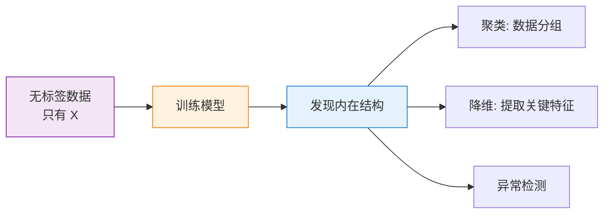

##### 三大子类

###### (1) 聚类 (Clustering) —— 把相似的数据分到一组

| 应用 | 说明 |
|------|------|
| 用户分群 | 电商根据消费行为划分用户 |
| 文档归类 | 自动把新闻分成体育/财经/娱乐 |
| 图像分割 | 把图像中相似的像素归为一类 |
| 基因分析 | 将功能相似的基因聚为一组 |

**常见算法**：
- K-Means
- 层次聚类 (Hierarchical Clustering)
- DBSCAN
- 高斯混合模型 (GMM)

###### (2) 降维 (Dimensionality Reduction) —— 减少特征数量但保留主要信息

| 应用 | 说明 |
|------|------|
| 数据可视化 | 把100维数据压到2维以画图 |
| 特征压缩 | 加速训练、减少存储 |
| 去噪 | 保留主成分，去除噪声 |

**常见算法**：
- PCA (主成分分析)
- t-SNE
- UMAP
- 自编码器 (Autoencoder)

###### (3) 关联规则 (Association Rules) —— 发现数据间的关联

经典案例：**啤酒与尿布**——超市发现买尿布的顾客经常一起买啤酒。

**常见算法**：
- Apriori
- FP-Growth

##### 优缺点

| 优点 | 缺点 |
|------|------|
| 不需要标注数据，成本低 | 结果难以评估和解释 |
| 能发现未知模式 | 准确性不如监督学习 |
| 适合探索性数据分析 | 调参较为困难 |

---

#### 4. 半监督学习 (Semi-Supervised Learning)

##### 定义
使用**少量有标签数据 + 大量无标签数据**进行训练，结合监督和无监督学习的优点。

##### 适用场景
当标注成本很高，但无标签数据容易获得时：
- 医疗影像（专家标注昂贵）
- 网页分类（网页海量但标注困难）
- 语音识别（音频多但转写慢）

##### 工作原理图

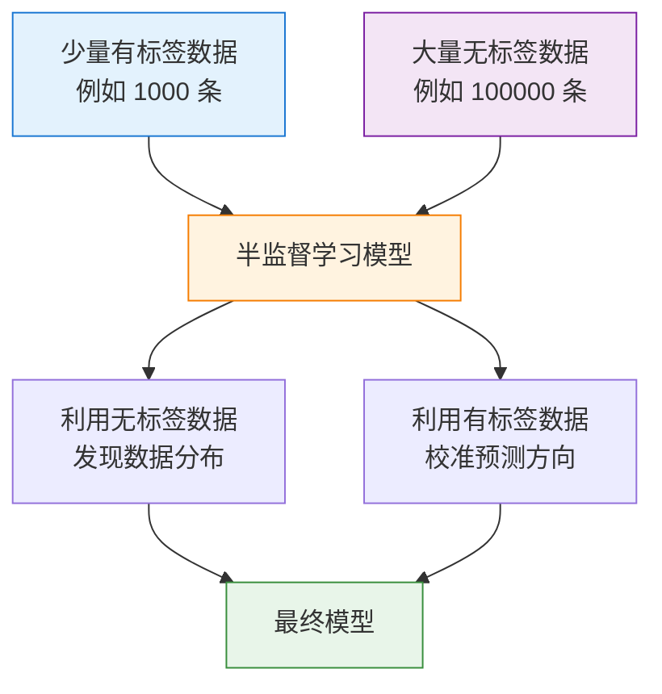

##### 常见方法

| 方法 | 思想 |
|------|------|
| 自训练 (Self-Training) | 用模型给无标签数据打"伪标签"，再训练 |
| 协同训练 (Co-Training) | 训练多个模型，相互标注 |
| 标签传播 (Label Propagation) | 通过图结构把标签传给相似样本 |
| 一致性正则化 | 对扰动后的样本要求模型预测一致 |

##### 优缺点

| 优点 | 缺点 |
|------|------|
| 减少标注成本 | 算法复杂 |
| 利用大量无标签数据 | 伪标签错误可能传播 |
| 实际应用价值大 | 需要谨慎选择方法 |

---

#### 5. 强化学习 (Reinforcement Learning)

##### 定义
**智能体 (Agent)** 通过与**环境 (Environment)** 不断交互，根据获得的**奖励 (Reward)** 来学习最优的**策略 (Policy)**。

##### 核心要素

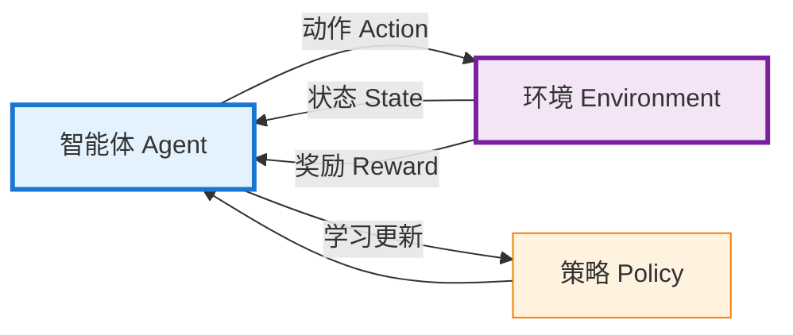

| 要素 | 含义 | 游戏类比 |
|------|------|---------|
| Agent (智能体) | 决策者 | 玩家 |
| Environment (环境) | 智能体所处的世界 | 游戏世界 |
| State (状态) | 当前情况 | 当前画面 |
| Action (动作) | 智能体的选择 | 按键操作 |
| Reward (奖励) | 反馈信号 | 得分增减 |
| Policy (策略) | 决策规则 | 玩游戏的方法 |

##### 工作流程

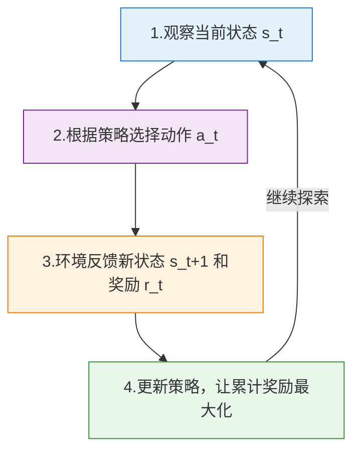

##### 典型应用

| 应用 | 说明 |
|------|------|
| 游戏 AI | AlphaGo（围棋）、Dota2 OpenAI Five |
| 机器人控制 | 机械臂抓取、双足行走 |
| 自动驾驶 | 路径规划、决策 |
| 推荐系统 | 长期用户满意度优化 |
| 金融交易 | 股票自动交易 |
| 大语言模型 | RLHF（人类反馈强化学习） |

##### 常见算法

- Q-Learning
- SARSA
- DQN (Deep Q-Network)
- Policy Gradient
- Actor-Critic
- PPO (近端策略优化)
- A3C

##### 探索 vs 利用 (Exploration vs Exploitation)

强化学习的核心权衡：
- **利用 (Exploitation)**：选择已知收益最高的动作
- **探索 (Exploration)**：尝试新的动作以发现更好的策略

例：吃饭时选**老地方**（利用）还是**新餐厅**（探索）？

##### 优缺点

| 优点 | 缺点 |
|------|------|
| 能解决决策序列问题 | 训练过程长，样本效率低 |
| 不需要标签 | 奖励设计困难 |
| 可超越人类水平 | 难以保证安全性 |

---

#### 6. 四种类型综合对比


##### 全方位对比表

| 维度 | 监督学习 | 无监督学习 | 半监督学习 | 强化学习 |
|------|---------|-----------|----------|---------|
| 数据要求 | 全部有标签 | 全部无标签 | 部分有标签 | 环境交互数据 |
| 学习目标 | 预测标签 | 发现结构 | 利用未标注提升 | 最大化累计奖励 |
| 反馈类型 | 直接（标签） | 无 | 部分直接 | 延迟（奖励） |
| 典型任务 | 分类、回归 | 聚类、降维 | 网页分类 | 游戏、控制 |
| 评估难度 | 简单 | 困难 | 中等 | 困难 |
| 应用成熟度 | 最高 | 较高 | 中等 | 快速发展 |

---

#### 7. 其他重要的衍生类型

除了四大主流类型，还有一些重要的细分方向：

| 类型 | 简介 | 应用场景 |
|------|------|---------|
| **自监督学习** (Self-Supervised) | 从数据本身构造标签 | BERT、GPT 预训练 |
| **迁移学习** (Transfer Learning) | 把在A任务学到的知识迁移到B任务 | 用 ImageNet 预训练做医学影像 |
| **元学习** (Meta-Learning) | 学习如何学习，快速适应新任务 | 少样本学习 |
| **联邦学习** (Federated Learning) | 数据不出本地，多方协同训练 | 隐私保护场景 |
| **主动学习** (Active Learning) | 模型主动挑选最有价值的样本去标注 | 降低标注成本 |
| **在线学习** (Online Learning) | 数据流式到达，模型实时更新 | 推荐系统、广告 |

---

#### 8. 如何选择合适的学习类型

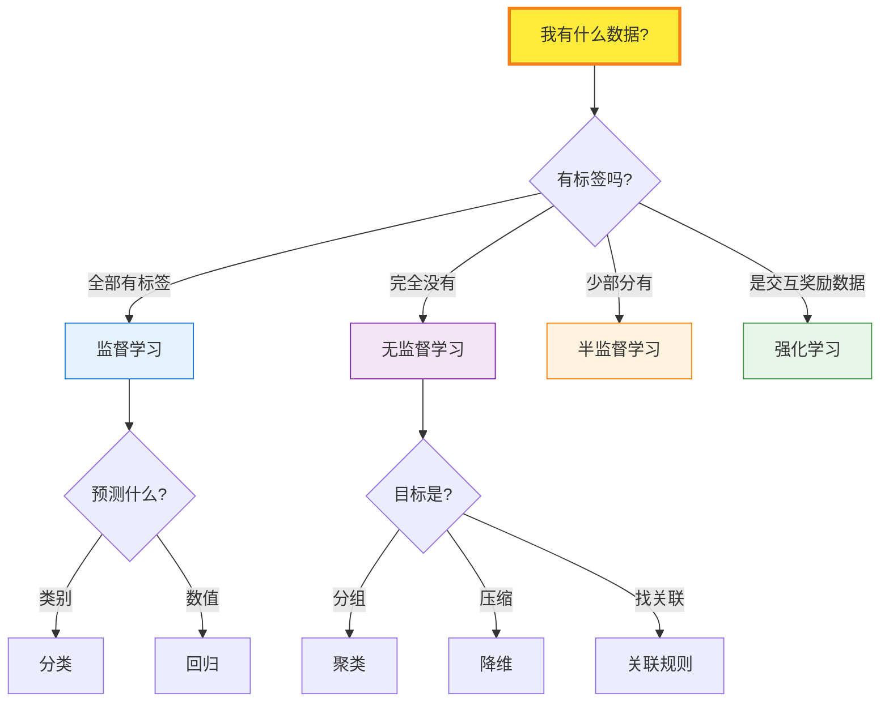

---

#### 9. 本节小结

**记忆口诀**：

> - **监督学习**：有老师教（有标签），学预测
> - **无监督学习**：自学（无标签），找规律
> - **半监督学习**：半自学半教（少量标签），求性价比
> - **强化学习**：在试错中成长（环境反馈），学决策

**一句话总结**：

> 机器学习的类型本质上是由**数据形式**和**学习目标**决定的——有什么样的数据，就用什么样的学习方法。

---


#### 机器学习的扩展领域 (Extensions of Machine Learning)

随着研究的深入，机器学习衍生出许多重要的扩展领域。这些领域有的是**学习范式的创新**（如自监督学习），有的是**模型结构的革命**（如深度学习），有的是**应用场景的特化**（如联邦学习）。下面逐一详细讲解。

---
### 7.  Future

#### 1. 扩展领域全景图

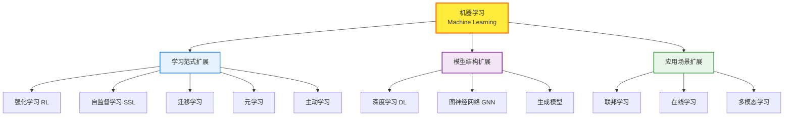

---

#### 2. 深度学习 (Deep Learning)

##### 定义
深度学习是基于**多层神经网络**的机器学习方法，通过**层层抽象**的方式自动从数据中学习**层次化的特征表示**。

> 深度学习不是与监督/无监督学习并列的概念，而是一种**模型实现方式**，可应用于各种学习范式。

##### 与传统机器学习的区别

```mermaid
flowchart LR
    subgraph TRAD[传统机器学习]
        A1[原始数据] --> A2[人工特征工程]
        A2 --> A3[简单模型]
        A3 --> A4[预测]
    end
    
    subgraph DL[深度学习]
        B1[原始数据] --> B2[神经网络<br/>自动学习特征]
        B2 --> B3[预测]
    end
    
    style TRAD fill:#e3f2fd,stroke:#1976d2,stroke-width:2px
    style DL fill:#f3e5f5,stroke:#7b1fa2,stroke-width:2px
```

##### 神经网络基本结构

```mermaid
flowchart LR
    subgraph IN[输入层]
        I1[x1]
        I2[x2]
        I3[x3]
    end
    subgraph HID1[隐藏层1]
        H1[h1]
        H2[h2]
        H3[h3]
        H4[h4]
    end
    subgraph HID2[隐藏层2]
        H5[h1]
        H6[h2]
        H7[h3]
    end
    subgraph OUT[输出层]
        O1[y1]
        O2[y2]
    end
    
    I1 --> H1 & H2 & H3 & H4
    I2 --> H1 & H2 & H3 & H4
    I3 --> H1 & H2 & H3 & H4
    H1 & H2 & H3 & H4 --> H5 & H6 & H7
    H5 & H6 & H7 --> O1 & O2
    
    style IN fill:#e3f2fd,stroke:#1976d2
    style HID1 fill:#fff3e0,stroke:#f57c00
    style HID2 fill:#fff3e0,stroke:#f57c00
    style OUT fill:#e8f5e9,stroke:#388e3c
```

##### 层次化特征学习（以图像识别为例）

```mermaid
flowchart LR
    A[原始像素] --> B[第1层<br/>边缘、线条]
    B --> C[第2层<br/>纹理、角点]
    C --> D[第3层<br/>局部形状<br/>眼睛、鼻子]
    D --> E[第4层<br/>整体物体<br/>人脸]
    E --> F[输出: 这是张三]
    
    style A fill:#e3f2fd,stroke:#1976d2
    style F fill:#e8f5e9,stroke:#388e3c
```

##### 主要的深度学习架构

| 架构 | 全称 | 擅长领域 | 代表应用 |
|------|------|---------|---------|
| **CNN** | 卷积神经网络 | 图像、视频 | 图像分类、目标检测 |
| **RNN/LSTM** | 循环神经网络 | 序列数据 | 早期机器翻译、语音 |
| **Transformer** | 注意力机制 | 序列、多模态 | GPT、BERT、ChatGPT |
| **GAN** | 生成对抗网络 | 图像生成 | DeepFake、AI绘画 |
| **Diffusion** | 扩散模型 | 图像/视频生成 | Stable Diffusion、Sora |
| **GNN** | 图神经网络 | 图结构数据 | 社交网络、分子分析 |
| **Autoencoder** | 自编码器 | 降维、生成 | 异常检测、特征提取 |

##### 深度学习核心机制：反向传播

```mermaid
flowchart LR
    A[输入] -->|前向传播| B[预测]
    B --> C[计算损失]
    C -->|反向传播<br/>逐层求梯度| D[更新所有层参数]
    D -.下一轮.-> A
    
    style A fill:#e3f2fd,stroke:#1976d2
    style B fill:#fff3e0,stroke:#f57c00
    style C fill:#fce4ec,stroke:#c2185b
    style D fill:#e8f5e9,stroke:#388e3c
```

##### 优缺点

| 优点 | 缺点 |
|------|------|
| 自动特征学习，免去人工特征工程 | 需要大量数据 |
| 处理复杂非线性问题能力强 | 计算资源消耗大（需GPU） |
| 端到端学习 | 可解释性差（黑盒） |
| 在图像、语音、NLP上达到SOTA | 训练时间长，调参困难 |

---

#### 3. 强化学习 (Reinforcement Learning)

##### 定义
智能体通过与环境**交互**，根据**奖励信号**学习最优**决策策略**，目标是**最大化长期累计奖励**。

##### 核心数学框架：马尔可夫决策过程 (MDP)

强化学习问题通常建模为 MDP，包含五元组 $(S, A, P, R, \gamma)$：

| 符号 | 含义 |
|------|------|
| $S$ | 状态空间 (State Space) |
| $A$ | 动作空间 (Action Space) |
| $P(s'\|s,a)$ | 状态转移概率 |
| $R(s,a)$ | 奖励函数 |
| $\gamma$ | 折扣因子 (0~1)，衡量未来奖励的重要性 |

**目标**：找到最优策略 $\pi^*$，使累计奖励最大化：
$$
\pi^* = \arg\max_\pi \mathbb{E}\left[\sum_{t=0}^{\infty} \gamma^t R(s_t, a_t)\right]
$$

##### 强化学习的算法分类

```mermaid
flowchart TB
    RL[强化学习] --> A[基于价值<br/>Value-Based]
    RL --> B[基于策略<br/>Policy-Based]
    RL --> C[Actor-Critic<br/>结合两者]
    RL --> D[基于模型<br/>Model-Based]
    
    A --> A1[Q-Learning]
    A --> A2[DQN 深度Q网络]
    A --> A3[Double DQN]
    
    B --> B1[REINFORCE]
    B --> B2[Policy Gradient]
    
    C --> C1[A2C / A3C]
    C --> C2[PPO 近端策略优化]
    C --> C3[SAC]
    
    D --> D1[Dyna-Q]
    D --> D2[MuZero]
    
    style RL fill:#ffeb3b,stroke:#f57f17,stroke-width:3px
    style A fill:#e3f2fd,stroke:#1976d2
    style B fill:#f3e5f5,stroke:#7b1fa2
    style C fill:#fff3e0,stroke:#f57c00
    style D fill:#e8f5e9,stroke:#388e3c
```

##### Q-Learning 核心公式

$$
Q(s,a) \leftarrow Q(s,a) + \alpha \left[ r + \gamma \max_{a'} Q(s',a') - Q(s,a) \right]
$$

- $Q(s,a)$：在状态 $s$ 下采取动作 $a$ 的价值
- $\alpha$：学习率
- $r$：当前奖励
- $\gamma \max_{a'} Q(s',a')$：未来最大期望奖励

##### 深度强化学习 (Deep RL)

将**深度学习** + **强化学习**结合，用神经网络近似 Q 函数或策略函数。

| 里程碑 | 年份 | 成就 |
|--------|------|------|
| DQN | 2013 | 玩 Atari 游戏达到人类水平 |
| AlphaGo | 2016 | 击败围棋世界冠军李世石 |
| AlphaZero | 2017 | 仅靠自我对弈精通围棋、国际象棋 |
| OpenAI Five | 2018 | 击败 Dota2 世界冠军战队 |
| AlphaStar | 2019 | 在星际争霸2中达到宗师水平 |
| MuZero | 2020 | 不需规则也能掌握多种游戏 |
| ChatGPT | 2022 | RLHF 让大模型对齐人类偏好 |

##### RLHF（人类反馈强化学习）

ChatGPT 等大模型对齐的关键技术：

```mermaid
flowchart TB
    A[1.预训练大模型<br/>SFT 监督微调] --> B[2.训练奖励模型<br/>用人类偏好数据]
    B --> C[3.PPO 强化学习<br/>用奖励模型优化输出]
    C --> D[对齐人类偏好的模型]
    
    style A fill:#e3f2fd,stroke:#1976d2
    style B fill:#f3e5f5,stroke:#7b1fa2
    style C fill:#fff3e0,stroke:#f57c00
    style D fill:#e8f5e9,stroke:#388e3c,stroke-width:3px
```

---

#### 4. 自监督学习 (Self-Supervised Learning, SSL)

##### 定义
**从数据本身构造监督信号**，无需人工标注，让模型从大量无标签数据中学习有用的特征表示。

> 自监督学习被认为是通往**通用人工智能**的关键，是当今大模型（GPT、BERT、CLIP等）的核心技术。

##### 核心思想：从数据中"挖坑"再"填坑"

```mermaid
flowchart LR
    A[原始数据] --> B[人为构造任务<br/>遮挡、打乱、预测下一个]
    B --> C[模型学习恢复原数据]
    C --> D[过程中学到有用表示]
    
    style A fill:#e3f2fd,stroke:#1976d2
    style B fill:#fff3e0,stroke:#f57c00
    style C fill:#f3e5f5,stroke:#7b1fa2
    style D fill:#e8f5e9,stroke:#388e3c
```

##### 经典任务范式

###### (1) 文本领域

| 方法 | 任务 | 代表模型 |
|------|------|---------|
| 掩码语言建模 (MLM) | 遮住部分词，预测被遮的词 | BERT |
| 自回归语言建模 (CLM) | 根据前文预测下一个词 | GPT |
| 句子顺序预测 (SOP) | 判断两句话顺序是否正确 | ALBERT |

**例**：原句"今天天气真好" → 训练样本"今天 [MASK] 真好" → 模型预测 [MASK] = "天气"

###### (2) 图像领域

| 方法 | 任务 | 代表模型 |
|------|------|---------|
| 对比学习 | 同图不同变换=正样本，异图=负样本 | SimCLR、MoCo |
| 掩码图像建模 | 遮住图像块，预测像素 | MAE |
| 拼图任务 | 把图打乱再让模型还原 | Jigsaw |
| 旋转预测 | 判断图像旋转了多少度 | RotNet |

###### (3) 多模态

| 方法 | 任务 | 代表模型 |
|------|------|---------|
| 图文对齐 | 让匹配的图文嵌入接近 | CLIP |
| 跨模态生成 | 文本生成图像 / 图像生成文本 | DALL-E、BLIP |

##### 自监督学习流程

```mermaid
flowchart TB
    A[海量无标签数据] --> B[预训练阶段<br/>自监督任务]
    B --> C[学到通用特征表示]
    C --> D{下游任务}
    D --> D1[少量标签微调<br/>Fine-tuning]
    D --> D2[零样本应用<br/>Zero-shot]
    D --> D3[小样本学习<br/>Few-shot]
    
    style A fill:#e3f2fd,stroke:#1976d2
    style B fill:#fff3e0,stroke:#f57c00,stroke-width:3px
    style C fill:#f3e5f5,stroke:#7b1fa2
    style D1 fill:#e8f5e9,stroke:#388e3c
    style D2 fill:#e8f5e9,stroke:#388e3c
    style D3 fill:#e8f5e9,stroke:#388e3c
```

##### 与其他学习方式的关系

| 维度 | 监督学习 | 无监督学习 | 自监督学习 |
|------|---------|-----------|----------|
| 标签来源 | 人工标注 | 无 | 数据本身自动生成 |
| 数据量需求 | 中等 | 大 | 极大（越大越好） |
| 学到的特征 | 任务专用 | 通用但弱 | 通用且强 |
| 代表应用 | 分类器 | 聚类 | GPT、BERT 等大模型 |

##### 为什么自监督学习是革命性的

> Yann LeCun 比喻：**如果智能是一块蛋糕，自监督学习就是蛋糕本身，监督学习是糖衣，强化学习是樱桃。**

- 互联网上有海量无标签数据（文本、图像、视频）
- 人工标注成本极高
- 自监督让模型能从全部数据中学习
- 是大语言模型（LLM）成功的根基

---

#### 5. 其他重要扩展领域

##### (1) 迁移学习 (Transfer Learning)

把在**源任务**上学到的知识，迁移到**目标任务**。

```mermaid
flowchart LR
    A[源任务<br/>大数据集] --> B[预训练模型]
    B --> C[迁移参数]
    C --> D[目标任务<br/>小数据集]
    D --> E[微调 Fine-tune]
    E --> F[高性能模型]
    
    style A fill:#e3f2fd,stroke:#1976d2
    style B fill:#fff3e0,stroke:#f57c00
    style F fill:#e8f5e9,stroke:#388e3c
```

**应用**：用 ImageNet 预训练模型 → 迁移到医学影像分类

##### (2) 元学习 (Meta-Learning) —— "学会学习"

让模型能够**快速适应新任务**，仅需少量样本就能学会。

| 范式 | 核心思想 |
|------|---------|
| MAML | 学习一个好的初始参数，几步就能适应新任务 |
| Prototypical Networks | 学习样本到类原型的距离度量 |
| Memory-Augmented | 用外部记忆存储已学知识 |

**应用**：少样本图像分类、个性化推荐

##### (3) 联邦学习 (Federated Learning)

数据**不出本地**，多方协同训练模型。

```mermaid
flowchart TB
    S[中央服务器<br/>聚合模型]
    C1[客户端A<br/>本地数据]
    C2[客户端B<br/>本地数据]
    C3[客户端C<br/>本地数据]
    
    C1 -->|上传模型参数| S
    C2 -->|上传模型参数| S
    C3 -->|上传模型参数| S
    S -->|下发全局模型| C1
    S -->|下发全局模型| C2
    S -->|下发全局模型| C3
    
    style S fill:#ffeb3b,stroke:#f57f17,stroke-width:3px
    style C1 fill:#e3f2fd,stroke:#1976d2
    style C2 fill:#f3e5f5,stroke:#7b1fa2
    style C3 fill:#e8f5e9,stroke:#388e3c
```

**应用**：手机输入法预测、医院间联合建模（保护隐私）

##### (4) 多模态学习 (Multimodal Learning)

同时处理多种数据形式（文本、图像、语音、视频）。

| 模型 | 模态组合 | 能力 |
|------|---------|------|
| CLIP | 图像 + 文本 | 图文检索、零样本分类 |
| DALL-E | 文本 → 图像 | 文生图 |
| GPT-4V | 文本 + 图像 | 多模态对话 |
| Sora | 文本 → 视频 | 视频生成 |
| Whisper | 语音 → 文本 | 语音识别 |

##### (5) 生成式 AI (Generative AI)

学习数据分布，生成新样本。

| 类型 | 代表模型 | 应用 |
|------|---------|------|
| 自回归模型 | GPT 系列 | 文本生成 |
| GAN | StyleGAN | 人脸生成 |
| VAE | β-VAE | 图像生成、表征学习 |
| 扩散模型 | Stable Diffusion、DALL-E 3 | AI 绘画 |
| Flow 模型 | Normalizing Flow | 概率密度估计 |

##### (6) 在线学习 (Online Learning)

数据**流式到达**，模型**实时更新**，不存储全部历史数据。

**应用**：广告点击率预测、新闻推荐、股票交易

##### (7) 主动学习 (Active Learning)

模型**主动挑选**最有价值的样本请求标注，降低标注成本。

```mermaid
flowchart LR
    A[未标注数据池] --> B[模型选择<br/>最不确定的样本]
    B --> C[人工标注]
    C --> D[加入训练集]
    D --> E[重新训练模型]
    E -.循环.-> B
    
    style A fill:#e3f2fd,stroke:#1976d2
    style B fill:#fff3e0,stroke:#f57c00
    style C fill:#fce4ec,stroke:#c2185b
    style E fill:#e8f5e9,stroke:#388e3c
```

---

#### 6. 扩展领域之间的关系

```mermaid
flowchart TB
    DL[深度学习<br/>提供强大模型] --> SSL[自监督学习<br/>预训练大模型]
    SSL --> LLM[大语言模型<br/>GPT/BERT]
    DL --> RL[深度强化学习]
    LLM --> RLHF[RLHF<br/>对齐人类偏好]
    RL --> RLHF
    DL --> MM[多模态学习]
    SSL --> MM
    MM --> AGI[通用人工智能<br/>AGI 探索方向]
    DL --> GEN[生成式AI<br/>AIGC]
    SSL --> GEN
    
    style DL fill:#e3f2fd,stroke:#1976d2,stroke-width:2px
    style SSL fill:#f3e5f5,stroke:#7b1fa2,stroke-width:2px
    style RL fill:#fff3e0,stroke:#f57c00,stroke-width:2px
    style LLM fill:#e8f5e9,stroke:#388e3c,stroke-width:3px
    style AGI fill:#ffeb3b,stroke:#f57f17,stroke-width:3px
```

**关键洞察**：
- **深度学习**提供了强大的**模型基础**
- **自监督学习**提供了利用海量数据的**学习范式**
- **强化学习**提供了**决策与对齐**机制
- 三者结合 → 催生了 ChatGPT、GPT-4 等当代 AI 突破

---

#### 7. 综合对比表

| 扩展领域 | 核心创新 | 主要应用 | 代表技术 |
|---------|---------|---------|---------|
| 深度学习 | 多层神经网络自动学习特征 | 图像、语音、NLP | CNN、[[Transformer]] |
| 强化学习 | 通过奖励学习决策策略 | 游戏、机器人 | DQN、PPO |
| 自监督学习 | 从数据本身构造标签 | 大模型预训练 | BERT、GPT、MAE |
| 迁移学习 | 知识跨任务迁移 | 小数据场景 | Fine-tuning |
| 元学习 | 学会快速学习 | 少样本学习 | MAML |
| 联邦学习 | 数据不出本地协同训练 | 隐私保护 | FedAvg |
| 多模态学习 | 跨模态融合理解 | 图文生成 | CLIP、GPT-4V |
| 生成式AI | 学分布生成新样本 | AIGC | Diffusion、GAN |
| 在线学习 | 流式实时更新 | 推荐、广告 | FTRL |
| 主动学习 | 主动选样本降标注成本 | 数据稀缺场景 | 不确定性采样 |

---

#### 8. 未来发展趋势

```mermaid
flowchart LR
    A[当前阶段] --> B[未来方向]
    
    A --> A1[大模型<br/>LLM]
    A --> A2[多模态<br/>融合]
    A --> A3[AI Agent<br/>自主智能体]
    
    B --> B1[更强的<br/>推理能力]
    B --> B2[具身智能<br/>Embodied AI]
    B --> B3[世界模型<br/>World Model]
    B --> B4[AGI<br/>通用人工智能]
    
    style A fill:#e3f2fd,stroke:#1976d2
    style B fill:#e8f5e9,stroke:#388e3c
    style B4 fill:#ffeb3b,stroke:#f57f17,stroke-width:3px
```

**关键趋势**：
1. **大模型化**：参数规模持续扩大，能力涌现
2. **多模态化**：文本、图像、语音、视频统一建模
3. **智能体化**：从被动响应到主动规划与执行
4. **具身化**：与物理世界交互，机器人 + AI
5. **轻量化**：模型压缩、端侧部署
6. **可信化**：可解释性、安全性、对齐

---

#### 9. 本节小结

**核心要点**：

> - **深度学习**：用多层神经网络自动学习特征，是当代 AI 的基石
> - **强化学习**：通过试错与奖励学习决策，是 AI 自主行动的关键
> - **自监督学习**：从数据本身造标签，是大模型成功的核心
> - **三者融合** → 催生了 ChatGPT 等当代 AI 革命

**一句话总结**：

> 机器学习的扩展领域，本质上都是为了解决 **"如何让机器从更多类型的数据、更少的人工干预、更复杂的环境中学习"** 这一根本问题。

**学习路径建议**：

```mermaid
flowchart LR
    A[机器学习基础] --> B[深度学习]
    B --> C{选择方向}
    C --> D1[计算机视觉<br/>CNN, Diffusion]
    C --> D2[自然语言处理<br/>Transformer, LLM]
    C --> D3[强化学习<br/>DQN, PPO]
    C --> D4[多模态<br/>CLIP, GPT-4V]
    
    style A fill:#e3f2fd,stroke:#1976d2
    style B fill:#f3e5f5,stroke:#7b1fa2,stroke-width:3px
    style C fill:#fff3e0,stroke:#f57c00
```

---

### 8. Python 四大机器学习库详解 (Top 4 Python ML Libraries)

Python 之所以成为机器学习的主流语言，很大程度上得益于其丰富而强大的生态库。下面详细讲解四大核心机器学习库。

---

#### 1. 四大库总览

```mermaid
flowchart TB
    PY[Python 机器学习生态] --> A[Scikit-learn<br/>传统机器学习]
    PY --> B[TensorFlow<br/>深度学习/工业级]
    PY --> C[PyTorch<br/>深度学习/研究级]
    PY --> D[Keras<br/>高层封装/易用]
    
    A --> A1[分类、回归、聚类<br/>经典算法]
    B --> B1[Google出品<br/>生产部署强]
    C --> C1[Meta出品<br/>研究界主流]
    D --> D1[简洁易学<br/>已并入TF]
    
    style PY fill:#ffeb3b,stroke:#f57f17,stroke-width:3px
    style A fill:#e3f2fd,stroke:#1976d2,stroke-width:2px
    style B fill:#fff3e0,stroke:#f57c00,stroke-width:2px
    style C fill:#fce4ec,stroke:#c2185b,stroke-width:2px
    style D fill:#e8f5e9,stroke:#388e3c,stroke-width:2px
```

##### 快速对比表

| 库 | 出品方 | 定位 | 难度 | 主要用途 |
|----|-------|------|------|---------|
| Scikit-learn | 社区 | 传统机器学习 | ★★ | 经典算法、数据挖掘 |
| TensorFlow | Google | 深度学习框架 | ★★★★ | 工业部署、移动端 |
| PyTorch | Meta (Facebook) | 深度学习框架 | ★★★ | 学术研究、快速开发 |
| Keras | 社区 / Google | 高层 API | ★ | 快速原型、入门 |

---

#### 2. Scikit-learn：传统机器学习的瑞士军刀

##### 简介
- **官网**：https://scikit-learn.org
- **创立**：2007 年
- **特点**：经典机器学习算法的最完整实现，API 设计统一优雅

##### 核心特点

| 特点 | 说明 |
|------|------|
| API 统一 | 所有模型都是 `fit()` / `predict()` 接口 |
| 算法丰富 | 涵盖几乎所有传统机器学习算法 |
| 文档完善 | 文档与示例非常详细 |
| 工具齐全 | 数据预处理、特征工程、模型评估一应俱全 |
| 不支持 GPU | 主要面向 CPU 上的传统算法 |

##### 功能模块全景

```mermaid
flowchart TB
    SK[Scikit-learn] --> A[监督学习]
    SK --> B[无监督学习]
    SK --> C[模型选择]
    SK --> D[预处理]
    SK --> E[特征工程]
    SK --> F[评估指标]
    
    A --> A1[分类: SVM, RF, KNN]
    A --> A2[回归: Linear, Ridge, Lasso]
    
    B --> B1[聚类: KMeans, DBSCAN]
    B --> B2[降维: PCA, t-SNE]
    
    C --> C1[交叉验证]
    C --> C2[网格搜索]
    
    D --> D1[标准化、归一化]
    D --> D2[缺失值处理]
    
    E --> E1[特征选择]
    E --> E2[特征提取]
    
    F --> F1[准确率、F1、AUC]
    F --> F2[MSE、R²]
    
    style SK fill:#e3f2fd,stroke:#1976d2,stroke-width:3px
```

##### 典型代码示例：鸢尾花分类

```python
from sklearn.datasets import load_iris
from sklearn.model_selection import train_test_split
from sklearn.ensemble import RandomForestClassifier
from sklearn.metrics import accuracy_score, classification_report

# 1. 加载数据
iris = load_iris()
X, y = iris.data, iris.target

# 2. 划分训练集和测试集
X_train, X_test, y_train, y_test = train_test_split(
    X, y, test_size=0.2, random_state=42
)

# 3. 创建并训练模型
model = RandomForestClassifier(n_estimators=100, random_state=42)
model.fit(X_train, y_train)

# 4. 预测
y_pred = model.predict(X_test)

# 5. 评估
print(f"准确率: {accuracy_score(y_test, y_pred):.4f}")
print(classification_report(y_test, y_pred, target_names=iris.target_names))
```

##### 适用场景

| 适合 | 不适合 |
|------|-------|
| 结构化数据（表格） | 大规模深度学习 |
| 中小规模数据集 | 图像、语音原始数据 |
| 快速建立基线模型 | 需要 GPU 加速的任务 |
| 数据挖掘、商业分析 | 端到端神经网络 |

##### 优缺点

| 优点 | 缺点 |
|------|------|
| 学习曲线平缓，文档优秀 | 不支持深度学习 |
| API 一致性极佳 | 不支持 GPU |
| 算法覆盖全面 | 难以处理超大数据 |
| 与 NumPy/Pandas 完美配合 | 模型部署能力较弱 |

---

#### 3. TensorFlow：工业级深度学习框架

##### 简介
- **官网**：https://www.tensorflow.org
- **出品**：Google Brain 团队，2015 年开源
- **当前版本**：TensorFlow 2.x（默认集成 Keras）
- **特点**：工业级部署能力强，全平台支持

##### 核心特点

| 特点 | 说明 |
|------|------|
| 计算图 | 支持静态图（性能优）和动态图（Eager Mode） |
| 全平台部署 | 服务器、移动端 (TF Lite)、浏览器 (TF.js)、嵌入式 |
| TPU 支持 | 原生支持 Google TPU 加速 |
| 分布式训练 | 完善的多机多卡训练支持 |
| 生态完善 | TFX 全套生产化工具链 |

##### TensorFlow 生态全景

```mermaid
flowchart TB
    TF[TensorFlow 核心] --> A[训练]
    TF --> B[部署]
    TF --> C[扩展]
    
    A --> A1[Keras<br/>高层API]
    A --> A2[tf.data<br/>数据管道]
    A --> A3[tf.distribute<br/>分布式训练]
    
    B --> B1[TF Serving<br/>服务器部署]
    B --> B2[TF Lite<br/>移动端]
    B --> B3[TF.js<br/>浏览器]
    B --> B4[TFX<br/>生产管道]
    
    C --> C1[TF Hub<br/>预训练模型]
    C --> C2[TF Probability<br/>概率编程]
    C --> C3[TF Agents<br/>强化学习]
    
    style TF fill:#fff3e0,stroke:#f57c00,stroke-width:3px
```

##### 典型代码示例：MNIST 手写数字识别

```python
import tensorflow as tf
from tensorflow.keras import layers, models

# 1. 加载数据
(X_train, y_train), (X_test, y_test) = tf.keras.datasets.mnist.load_data()
X_train, X_test = X_train / 255.0, X_test / 255.0  # 归一化

# 2. 构建模型
model = models.Sequential([
    layers.Flatten(input_shape=(28, 28)),
    layers.Dense(128, activation='relu'),
    layers.Dropout(0.2),
    layers.Dense(10, activation='softmax')
])

# 3. 编译模型
model.compile(
    optimizer='adam',
    loss='sparse_categorical_crossentropy',
    metrics=['accuracy']
)

# 4. 训练
model.fit(X_train, y_train, epochs=5, validation_split=0.1)

# 5. 评估
test_loss, test_acc = model.evaluate(X_test, y_test)
print(f"测试准确率: {test_acc:.4f}")

# 6. 保存模型
model.save('mnist_model.h5')
```

##### 适用场景

| 适合 | 不适合 |
|------|-------|
| 工业级生产部署 | 快速实验、研究探索 |
| 移动端/嵌入式部署 | 小规模简单任务 |
| 大规模分布式训练 | 入门学习（陡峭曲线） |
| 需要 TPU 加速 | 调试复杂模型 |

##### 优缺点

| 优点 | 缺点 |
|------|------|
| 工业级部署能力最强 | 学习曲线较陡 |
| 全平台、全设备支持 | 早期版本 API 混乱 |
| Google 强力支持，文档丰富 | 调试相对困难 |
| 性能优化到位 | 研究界使用率低于 PyTorch |

---

#### 4. PyTorch：研究界的最爱

##### 简介
- **官网**：https://pytorch.org
- **出品**：Meta (Facebook) AI Research，2016 年发布
- **特点**：动态计算图、Pythonic 风格、研究友好
- **现状**：学术论文中使用率超过 80%

##### 核心特点

| 特点 | 说明 |
|------|------|
| 动态计算图 | 边定义边执行，调试如普通 Python |
| Pythonic | API 设计符合 Python 习惯 |
| 灵活性高 | 适合复杂、定制化模型 |
| 社区活跃 | HuggingFace 等顶级生态围绕它构建 |
| 部署能力 | TorchScript、TorchServe 持续完善 |

##### PyTorch 生态全景

```mermaid
flowchart TB
    PT[PyTorch 核心] --> A[基础组件]
    PT --> B[领域库]
    PT --> C[生态工具]
    
    A --> A1[torch.nn<br/>神经网络]
    A --> A2[torch.optim<br/>优化器]
    A --> A3[torch.autograd<br/>自动求导]
    A --> A4[DataLoader<br/>数据加载]
    
    B --> B1[torchvision<br/>视觉]
    B --> B2[torchaudio<br/>音频]
    B --> B3[torchtext<br/>文本]
    
    C --> C1[HuggingFace<br/>预训练模型]
    C --> C2[PyTorch Lightning<br/>训练框架]
    C --> C3[TorchServe<br/>部署]
    
    style PT fill:#fce4ec,stroke:#c2185b,stroke-width:3px
```

##### 典型代码示例：MNIST 手写数字识别

```python
import torch
import torch.nn as nn
import torch.optim as optim
from torch.utils.data import DataLoader
from torchvision import datasets, transforms

# 1. 数据准备
transform = transforms.Compose([
    transforms.ToTensor(),
    transforms.Normalize((0.1307,), (0.3081,))
])

train_dataset = datasets.MNIST('./data', train=True, download=True, transform=transform)
train_loader = DataLoader(train_dataset, batch_size=64, shuffle=True)

# 2. 定义模型
class Net(nn.Module):
    def __init__(self):
        super().__init__()
        self.fc1 = nn.Linear(28*28, 128)
        self.fc2 = nn.Linear(128, 10)
        self.dropout = nn.Dropout(0.2)
    
    def forward(self, x):
        x = x.view(-1, 28*28)
        x = torch.relu(self.fc1(x))
        x = self.dropout(x)
        x = self.fc2(x)
        return x

# 3. 初始化模型、损失函数、优化器
device = torch.device('cuda' if torch.cuda.is_available() else 'cpu')
model = Net().to(device)
criterion = nn.CrossEntropyLoss()
optimizer = optim.Adam(model.parameters(), lr=0.001)

# 4. 训练循环
for epoch in range(5):
    for batch_idx, (data, target) in enumerate(train_loader):
        data, target = data.to(device), target.to(device)
        optimizer.zero_grad()
        output = model(data)
        loss = criterion(output, target)
        loss.backward()
        optimizer.step()
    print(f'Epoch {epoch+1}, Loss: {loss.item():.4f}')

# 5. 保存模型
torch.save(model.state_dict(), 'mnist_pytorch.pth')
```

##### 适用场景

| 适合 | 不适合 |
|------|-------|
| 学术研究、论文复现 | 移动端嵌入式部署 |
| 复杂、定制化模型 | 极致性能优化场景 |
| NLP（HuggingFace 生态） | 不熟悉 Python 的团队 |
| 快速实验迭代 | — |

##### 优缺点

| 优点 | 缺点 |
|------|------|
| 动态图，调试方便 | 早期部署能力弱（已改善） |
| Pythonic，学习曲线友好 | 移动端支持不如 TF |
| 研究界主流，论文复现容易 | 工业部署生态不如 TF 完整 |
| HuggingFace 等顶级生态 | — |

---

#### 5. Keras：极简易用的高层封装

##### 简介
- **官网**：https://keras.io
- **创立**：2015 年，作者 François Chollet（Google）
- **现状**：自 TF 2.0 起成为 TensorFlow 的官方高层 API
- **新动向**：Keras 3.0 支持多后端（TF / PyTorch / JAX）

##### 核心特点

| 特点 | 说明 |
|------|------|
| 极简 API | 几行代码即可搭建模型 |
| 模块化 | 神经网络层、损失、优化器可自由组合 |
| 入门友好 | 深度学习入门首选 |
| 多后端支持 | Keras 3.0 支持 TF/PyTorch/JAX |

##### Keras 三种建模方式

```mermaid
flowchart TB
    K[Keras] --> A[Sequential API<br/>顺序模型]
    K --> B[Functional API<br/>函数式模型]
    K --> C[Subclassing API<br/>自定义模型]
    
    A --> A1[简单线性堆叠<br/>最易用]
    B --> B1[多输入/多输出<br/>共享层]
    C --> C1[完全自定义<br/>类似 PyTorch]
    
    style K fill:#e8f5e9,stroke:#388e3c,stroke-width:3px
```

##### 典型代码示例：三种 API 对比

###### (1) Sequential API（最简单）

```python
from tensorflow.keras.models import Sequential
from tensorflow.keras.layers import Dense, Dropout

model = Sequential([
    Dense(128, activation='relu', input_shape=(784,)),
    Dropout(0.2),
    Dense(10, activation='softmax')
])
```

###### (2) Functional API（更灵活）

```python
from tensorflow.keras import Input, Model
from tensorflow.keras.layers import Dense, Dropout

inputs = Input(shape=(784,))
x = Dense(128, activation='relu')(inputs)
x = Dropout(0.2)(x)
outputs = Dense(10, activation='softmax')(x)
model = Model(inputs=inputs, outputs=outputs)
```

###### (3) Subclassing API（最灵活）

```python
from tensorflow.keras import Model
from tensorflow.keras.layers import Dense, Dropout

class MyModel(Model):
    def __init__(self):
        super().__init__()
        self.dense1 = Dense(128, activation='relu')
        self.dropout = Dropout(0.2)
        self.dense2 = Dense(10, activation='softmax')
    
    def call(self, inputs):
        x = self.dense1(inputs)
        x = self.dropout(x)
        return self.dense2(x)

model = MyModel()
```

##### 适用场景

| 适合 | 不适合 |
|------|-------|
| 深度学习入门 | 极复杂的研究模型 |
| 快速原型开发 | 需要底层控制的场景 |
| 教学和演示 | 极致性能优化 |
| 标准任务（CV、NLP） | — |

##### 优缺点

| 优点 | 缺点 |
|------|------|
| 极致简洁，新手友好 | 灵活性受限 |
| 文档优秀，示例丰富 | 高度封装，难以调试底层 |
| 多后端支持（3.0+） | 复杂模型仍需直接用 TF/PyTorch |

---

#### 6. 四大库全方位对比

##### 综合对比表

| 维度 | Scikit-learn | TensorFlow | PyTorch | Keras |
|------|-------------|-----------|---------|-------|
| **类型** | 传统ML | 深度学习 | 深度学习 | 高层API |
| **难度** | ★★ | ★★★★ | ★★★ | ★ |
| **GPU 支持** | 不支持 | 优秀 | 优秀 | 通过后端 |
| **动态图** | — | 支持(2.x) | 原生支持 | 通过后端 |
| **部署能力** | 一般 | 极强 | 良好 | 通过后端 |
| **学术使用率** | — | 较低 | 极高 | 中等 |
| **工业使用率** | 高 | 极高 | 高 | 高 |
| **学习曲线** | 平缓 | 陡峭 | 适中 | 极平缓 |
| **代码量** | 极少 | 多 | 中等 | 极少 |
| **调试难度** | 简单 | 较难 | 简单 | 简单 |
| **社区活跃度** | 高 | 极高 | 极高 | 高 |

##### 同一任务代码量对比（MNIST 分类）

```mermaid
flowchart LR
    A[Keras<br/>~20 行] --> B[Scikit-learn<br/>~10 行]
    B --> C[PyTorch<br/>~40 行]
    C --> D[TensorFlow原生<br/>~50 行]
    
    style A fill:#e8f5e9,stroke:#388e3c
    style B fill:#e3f2fd,stroke:#1976d2
    style C fill:#fce4ec,stroke:#c2185b
    style D fill:#fff3e0,stroke:#f57c00
```

---

#### 7. 如何选择合适的库

```mermaid
flowchart TB
    Q[我要做什么?] --> A{任务类型?}
    
    A -->|表格数据/<br/>传统机器学习| B[Scikit-learn]
    A -->|深度学习| C{使用目的?}
    
    C -->|学习入门| D[Keras]
    C -->|学术研究| E[PyTorch]
    C -->|工业部署| F[TensorFlow]
    C -->|快速原型| D
    
    B --> B1[随机森林、SVM<br/>聚类、降维]
    D --> D1[简单CNN/RNN<br/>标准任务]
    E --> E1[复杂模型<br/>论文复现<br/>HuggingFace]
    F --> F1[移动端部署<br/>大规模分布式<br/>TPU 训练]
    
    style Q fill:#ffeb3b,stroke:#f57f17,stroke-width:3px
    style B fill:#e3f2fd,stroke:#1976d2
    style D fill:#e8f5e9,stroke:#388e3c
    style E fill:#fce4ec,stroke:#c2185b
    style F fill:#fff3e0,stroke:#f57c00
```

##### 选择决策表

| 你的场景 | 推荐库 |
|---------|-------|
| 数据科学竞赛（结构化数据） | Scikit-learn + XGBoost |
| 深度学习入门学习 | Keras |
| 大学研究、论文复现 | PyTorch |
| 公司产品需要部署到手机 | TensorFlow + TF Lite |
| 大语言模型微调 | PyTorch + HuggingFace |
| 浏览器内运行模型 | TensorFlow.js |
| 数据挖掘、商业分析 | Scikit-learn |
| Kaggle 计算机视觉竞赛 | PyTorch / TensorFlow |
| 需要快速搭建 baseline | Keras |

---

#### 8. 四大库的协作关系

实际项目中，这些库经常**配合使用**：

```mermaid
flowchart LR
    A[NumPy/Pandas<br/>数据处理] --> B[Scikit-learn<br/>预处理/基线模型]
    B --> C{是否需要<br/>深度学习?}
    C -->|否| D[Scikit-learn<br/>训练评估]
    C -->|是| E[Keras/TF/PyTorch<br/>构建训练]
    E --> F[部署平台]
    F --> F1[TF Serving]
    F --> F2[TorchServe]
    F --> F3[ONNX 跨框架]
    
    style A fill:#fff9c4,stroke:#f9a825
    style B fill:#e3f2fd,stroke:#1976d2
    style E fill:#fce4ec,stroke:#c2185b
    style F fill:#e8f5e9,stroke:#388e3c
```

##### 典型工作流

1. **数据处理**：Pandas / NumPy
2. **特征工程**：Scikit-learn
3. **基线模型**：Scikit-learn
4. **深度学习**：PyTorch / TensorFlow / Keras
5. **模型部署**：TF Serving / TorchServe / ONNX

---

#### 9. 其他重要的相关库

除了四大主流库，还有许多重要的辅助库：

| 库 | 定位 | 说明 |
|----|------|------|
| **NumPy** | 数值计算 | 多维数组的基石 |
| **Pandas** | 数据处理 | 表格数据处理首选 |
| **Matplotlib / Seaborn** | 可视化 | 数据图表绘制 |
| **XGBoost** | 梯度提升 | Kaggle 神器，结构化数据王者 |
| **LightGBM** | 梯度提升 | 微软出品，速度极快 |
| **CatBoost** | 梯度提升 | Yandex 出品，处理类别特征好 |
| **HuggingFace Transformers** | NLP | 大语言模型生态 |
| **JAX** | 数值计算 | Google 新一代框架，函数式 |
| **PyTorch Lightning** | 训练框架 | 简化 PyTorch 训练流程 |
| **FastAI** | 深度学习封装 | 基于 PyTorch 的高层 API |
| **OpenCV** | 计算机视觉 | 图像处理基础库 |
| **NLTK / spaCy** | NLP | 文本处理基础库 |
| **Gym / Gymnasium** | 强化学习 | 强化学习环境标准 |
| **Stable-Baselines3** | 强化学习 | RL 算法实现库 |

---

#### 10. 安装与环境配置

```bash
# 创建虚拟环境（推荐用 conda）
conda create -n ml python=3.10
conda activate ml

# 安装四大库
pip install scikit-learn        # Scikit-learn
pip install tensorflow          # TensorFlow（自带 Keras）
pip install torch torchvision   # PyTorch（CPU版）

# GPU 版 PyTorch（CUDA 11.8）
pip install torch torchvision --index-url https://download.pytorch.org/whl/cu118

# 配套数据科学库
pip install numpy pandas matplotlib seaborn jupyter
```

---

#### 11. 本节小结

##### 核心要点

> - **Scikit-learn**：传统机器学习首选，API 优雅，算法齐全
> - **TensorFlow**：工业部署王者，全平台支持
> - **PyTorch**：研究界主流，灵活易调试
> - **Keras**：高层封装，入门最佳

##### 一句话总结

> **Scikit-learn 学传统ML，Keras 入门深度学习，PyTorch 做研究，TensorFlow 搞部署。**

##### 学习路径建议

```mermaid
flowchart LR
    A[第1阶段<br/>NumPy/Pandas] --> B[第2阶段<br/>Scikit-learn]
    B --> C[第3阶段<br/>Keras 入门DL]
    C --> D{选择方向}
    D --> E[研究方向<br/>PyTorch + HuggingFace]
    D --> F[工业方向<br/>TensorFlow + TF Lite]
    
    style A fill:#fff9c4,stroke:#f9a825
    style B fill:#e3f2fd,stroke:#1976d2
    style C fill:#e8f5e9,stroke:#388e3c
    style E fill:#fce4ec,stroke:#c2185b
    style F fill:#fff3e0,stroke:#f57c00
```

---

# 第二章 python机器学习 PYML

## 1. 大库基础机器学习库

### NumPy：数值计算的基础

#### 什么是 NumPy？

**NumPy 就像是数学计算的计算器**，但功能强大无数倍。它是 Python 科学计算的基础库，提供了高效的多维数组对象。

#### NumPy 的核心概念

##### 1. 数组（Array）
```python
# NumPy 数组基础操作
import numpy as np

# 创建数组的不同方式
print("=== NumPy 数组创建 ===")

# 从列表创建
arr1 = np.array([1, 2, 3, 4, 5])
print(f"从列表创建：{arr1}")

# 创建等差数组
arr2 = np.arange(0, 10, 2)  # 0到10，步长为2
print(f"等差数组：{arr2}")

# 创建等间隔数组
arr3 = np.linspace(0, 1, 5)  # 0到1，5个点
print(f"等间隔数组：{arr3}")

# 创建特殊数组
zeros_arr = np.zeros((2, 3))  # 2行3列的零数组
ones_arr = np.ones((2, 3))    # 2行3列的一数组
identity_arr = np.eye(3)      # 3x3单位矩阵

print(f"零数组：\n{zeros_arr}")
print(f"一数组：\n{ones_arr}")
print(f"单位矩阵：\n{identity_arr}")
```
##### 2. 数组操作
```python
# 数组的基本操作
print("\n=== 数组基本操作 ===")

# 数组属性
arr = np.array([[1, 2, 3], [4, 5, 6]])
print(f"数组：\n{arr}")
print(f"形状：{arr.shape}")
print(f"维度：{arr.ndim}")
print(f"元素个数：{arr.size}")
print(f"数据类型：{arr.dtype}")

# 数组索引和切片
print(f"第一行：{arr[0]}")
print(f"第一列：{arr[:, 0]}")
print(f"元素[1,2]：{arr[1, 2]}")

# 数组运算
arr1 = np.array([1, 2, 3])
arr2 = np.array([4, 5, 6])

print(f"加法：{arr1 + arr2}")
print(f"乘法：{arr1 * arr2}")
print(f"点积：{np.dot(arr1, arr2)}")

# 统计函数
data = np.array([1, 2, 3, 4, 5, 6, 7, 8, 9, 10])
print(f"均值：{np.mean(data)}")
print(f"标准差：{np.std(data)}")
print(f"最大值：{np.max(data)}")
print(f"最小值：{np.min(data)}")
print(f"中位数：{np.median(data)}")
```
##### NumPy 实际应用示例
```python
# NumPy 实际应用：简单线性回归
def numpy_linear_regression():
    """使用 NumPy 实现简单线性回归"""
    
    # 生成示例数据
    np.random.seed(42)
    X = 2 * np.random.rand(100, 1)  # 特征
    y = 4 + 3 * X + np.random.randn(100, 1)  # 标签 + 噪声
    
    # 添加 x0 = 1 到 X
    X_b = np.c_[np.ones((100, 1)), X]  # 添加偏置项
    
    # 使用正规方程求解：θ = (X^T * X)^(-1) * X^T * y
    theta_best = np.linalg.inv(X_b.T.dot(X_b)).dot(X_b.T).dot(y)
    
    print("=== NumPy 线性回归示例 ===")
    print(f"学习到的参数：截距={theta_best[0][0]:.2f}, 斜率={theta_best[1][0]:.2f}")
    
    # 预测
    X_new = np.array([[0], [2]])
    X_new_b = np.c_[np.ones((2, 1)), X_new]
    y_predict = X_new_b.dot(theta_best)
    
    print(f"预测结果：X=0 时 y={y_predict[0][0]:.2f}, X=2 时 y={y_predict[1][0]:.2f}")
    
    return theta_best, X, y

# 运行示例
theta, X, y = numpy_linear_regression()
```
### Pandas：数据处理的利器
#### 什么是 Pandas？

**Pandas 就像是数据处理的瑞士军刀**，提供了强大的数据结构和数据分析工具，特别适合处理表格型数据。

#### Pandas 的核心数据结构

##### 1. Series（一维数据）
```python
# Pandas Series 基础操作
import pandas as pd

print("=== Pandas Series ===")

# 从列表创建 Series
s1 = pd.Series([1, 2, 3, 4, 5])
print(f"从列表创建：\n{s1}")

# 带索引的 Series
s2 = pd.Series([10, 20, 30], index=['a', 'b', 'c'])
print(f"\n带索引的 Series：\n{s2}")

# 从字典创建 Series
s3 = pd.Series({'数学': 90, '英语': 85, '物理': 88})
print(f"\n从字典创建：\n{s3}")

# Series 操作
print(f"\n访问元素：s2['b'] = {s2['b']}")
print(f"切片：s2[0:2] =\n{s2[0:2]}")
print(f"统计信息：\n{s2.describe()}")
```
##### 2. DataFrame（二维数据）
```python
# Pandas DataFrame 基础操作
print("\n=== Pandas DataFrame ===")

# 创建 DataFrame
data = {
    '姓名': ['张三', '李四', '王五', '赵六'],
    '年龄': [25, 30, 35, 28],
    '城市': ['北京', '上海', '广州', '深圳'],
    '薪资': [15000, 20000, 18000, 22000]
}

df = pd.DataFrame(data)
print("原始 DataFrame：")
print(df)

# DataFrame 基本操作
print(f"\nDataFrame 形状：{df.shape}")
print(f"\n列名：{list(df.columns)}")
print(f"\n数据类型：\n{df.dtypes}")

# 选择数据
print(f"\n选择'姓名'列：\n{df['姓名']}")
print(f"\n选择前两行：\n{df.head(2)}")
print(f"\n选择年龄大于28的行：\n{df[df['年龄'] > 28]}")

# 统计信息
print(f"\n数值列的统计信息：\n{df.describe()}")

# 添加新列
df['年薪'] = df['薪资'] * 12
print(f"\n添加年薪列后：\n{df}")
```
##### Pandas 数据处理示例
```python
# Pandas 数据处理完整示例
def pandas_data_processing():
    """演示 Pandas 数据处理的完整流程"""
    
    print("=== Pandas 数据处理示例 ===")
    
    # 1. 创建示例数据
    np.random.seed(42)
    n_samples = 1000
    
    data = {
        '学生ID': range(1, n_samples + 1),
        '姓名': [f'学生{i}' for i in range(1, n_samples + 1)],
        '年龄': np.random.randint(18, 25, n_samples),
        '性别': np.random.choice(['男', '女'], n_samples),
        '数学成绩': np.random.normal(75, 15, n_samples),
        '英语成绩': np.random.normal(80, 12, n_samples),
        '物理成绩': np.random.normal(72, 18, n_samples),
        '班级': np.random.choice(['一班', '二班', '三班'], n_samples)
    }
    
    df = pd.DataFrame(data)
    
    # 2. 数据清洗
    print("原始数据形状：", df.shape)
    
    # 处理异常值（成绩应在 0-100 之间）
    score_columns = ['数学成绩', '英语成绩', '物理成绩']
    for col in score_columns:
        df[col] = df[col].clip(0, 100)
    
    # 3. 特征工程
    # 计算总分和平均分
    df['总分'] = df[score_columns].sum(axis=1)
    df['平均分'] = df[score_columns].mean(axis=1)
    
    # 添加等级
    def get_grade(score):
        if score >= 90:
            return 'A'
        elif score >= 80:
            return 'B'
        elif score >= 70:
            return 'C'
        elif score >= 60:
            return 'D'
        else:
            return 'F'
    
    df['等级'] = df['平均分'].apply(get_grade)
    
    # 4. 数据分析
    print("\n=== 数据分析结果 ===")
    
    # 基本统计
    print("各科平均分：")
    print(df[score_columns].mean())
    
    # 按班级分析
    print("\n各班级平均分：")
    class_avg = df.groupby('班级')['平均分'].mean()
    print(class_avg)
    
    # 按性别分析
    print("\n性别分布：")
    gender_count = df['性别'].value_counts()
    print(gender_count)
    
    # 等级分布
    print("\n等级分布：")
    grade_dist = df['等级'].value_counts().sort_index()
    print(grade_dist)
    
    # 5. 数据筛选
    print("\n=== 特定数据筛选 ===")
    
    # 优秀学生（平均分 > 85）
    excellent_students = df[df['平均分'] > 85].head(5)
    print("优秀学生（前5名）：")
    print(excellent_students[['姓名', '平均分', '等级']])
    
    # 各班级最高分学生
    print("\n各班级最高分学生：")
    top_students = df.loc[df.groupby('班级')['平均分'].idxmax()]
    print(top_students[['班级', '姓名', '平均分']])
    
    return df

# 运行示例
student_df = pandas_data_processing()
```
### Matplotlib：数据可视化的画笔

#### 什么是 Matplotlib？

**Matplotlib 就像是数据艺术家的画笔**，可以将枯燥的数据转换成直观的图表，帮助我们理解数据中的模式和关系。

#### Matplotlib 基础图表
```python
# Matplotlib 基础图表示例
import matplotlib.pyplot as plt
import numpy as np

# 设置中文字体（防止中文显示为方框）
plt.rcParams['font.sans-serif'] = ['SimHei', 'Arial Unicode MS']
plt.rcParams['axes.unicode_minus'] = False

def matplotlib_basic_charts():
    """演示 Matplotlib 基础图表"""
    
    print("=== Matplotlib 基础图表示例 ===")
    
    # 1. 折线图
    plt.figure(figsize=(12, 8))
    
    plt.subplot(2, 3, 1)
    x = np.linspace(0, 10, 100)
    y1 = np.sin(x)
    y2 = np.cos(x)
    plt.plot(x, y1, label='sin(x)')
    plt.plot(x, y2, label='cos(x)')
    plt.title('三角函数')
    plt.xlabel('x')
    plt.ylabel('y')
    plt.legend()
    plt.grid(True)
    
    # 2. 散点图
    plt.subplot(2, 3, 2)
    np.random.seed(42)
    x = np.random.randn(100)
    y = 2 * x + np.random.randn(100) * 0.5
    plt.scatter(x, y, alpha=0.6, c='blue')
    plt.title('散点图')
    plt.xlabel('X')
    plt.ylabel('Y')
    
    # 3. 柱状图
    plt.subplot(2, 3, 3)
    categories = ['A', 'B', 'C', 'D', 'E']
    values = [23, 45, 56, 78, 32]
    plt.bar(categories, values, color=['red', 'green', 'blue', 'orange', 'purple'])
    plt.title('柱状图')
    plt.xlabel('类别')
    plt.ylabel('数值')
    
    # 4. 直方图
    plt.subplot(2, 3, 4)
    data = np.random.normal(100, 15, 1000)
    plt.hist(data, bins=30, alpha=0.7, color='skyblue', edgecolor='black')
    plt.title('直方图')
    plt.xlabel('数值')
    plt.ylabel('频数')
    
    # 5. 饼图
    plt.subplot(2, 3, 5)
    sizes = [30, 25, 20, 15, 10]
    labels = ['A', 'B', 'C', 'D', 'E']
    colors = ['gold', 'lightcoral', 'lightskyblue', 'lightgreen', 'plum']
    plt.pie(sizes, labels=labels, colors=colors, autopct='%1.1f%%', startangle=90)
    plt.title('饼图')
    
    # 6. 箱线图
    plt.subplot(2, 3, 6)
    data1 = np.random.normal(0, 1, 100)
    data2 = np.random.normal(2, 1, 100)
    data3 = np.random.normal(-2, 1, 100)
    plt.boxplot([data1, data2, data3], labels=['组1', '组2', '组3'])
    plt.title('箱线图')
    plt.ylabel('数值')
    
    plt.tight_layout()
    plt.show()
    
    print("图表已显示！")

# 运行示例
matplotlib_basic_charts()
```
##### 高级可视化示例
```python
# 高级可视化示例
def advanced_visualization():
    """演示高级可视化技巧"""
    
    print("=== 高级可视化示例 ===")
    
    # 创建更复杂的数据
    np.random.seed(42)
    n_points = 200
    
    # 生成相关数据
    x = np.random.randn(n_points)
    y = 2 * x + np.random.randn(n_points) * 0.5
    colors = np.random.rand(n_points)
    sizes = 1000 * np.random.rand(n_points)
    
    # 1. 气泡图
    plt.figure(figsize=(15, 5))
    
    plt.subplot(1, 3, 1)
    scatter = plt.scatter(x, y, c=colors, s=sizes, alpha=0.6, cmap='viridis')
    plt.colorbar(scatter, label='颜色值')
    plt.title('气泡图')
    plt.xlabel('X')
    plt.ylabel('Y')
    
    # 2. 热力图
    plt.subplot(1, 3, 2)
    data = np.random.randn(10, 10)
    im = plt.imshow(data, cmap='coolwarm', aspect='auto')
    plt.colorbar(im, label='数值')
    plt.title('热力图')
    
    # 3. 子图组合
    plt.subplot(1, 3, 3)
    
    # 创建子图
    gs = plt.GridSpec(2, 2, subplot_kw={'projection': 'polar'})
    
    ax1 = plt.subplot(gs[0, 0])
    theta = np.linspace(0, 2*np.pi, 100)
    r = np.sin(3*theta)
    ax1.plot(theta, r)
    ax1.set_title('极坐标图')
    
    ax2 = plt.subplot(gs[0, 1])
    categories = ['A', 'B', 'C', 'D']
    values = [15, 30, 45, 10]
    ax2.bar(categories, values)
    ax2.set_title('柱状图')
    
    ax3 = plt.subplot(gs[1, :])
    x_line = np.linspace(0, 10, 100)
    y_line1 = np.sin(x_line)
    y_line2 = np.cos(x_line)
    ax3.plot(x_line, y_line1, label='sin')
    ax3.plot(x_line, y_line2, label='cos')
    ax3.set_title('组合图')
    ax3.legend()
    
    plt.tight_layout()
    plt.show()
    
    print("高级图表已显示！")

# 运行示例
advanced_visualization()
```
### Scikit-learn：机器学习的瑞士军刀

#### 什么是 Scikit-learn？

**Scikit-learn 就像是机器学习的工具箱**，提供了从数据预处理到模型训练、评估的完整工具链，是 Python 机器学习的事实标准。

#### Scikit-learn 核心功能
```python
# Scikit-learn 核心功能示例
from sklearn.datasets import make_classification, load_iris
from sklearn.model_selection import train_test_split
from sklearn.preprocessing import StandardScaler, LabelEncoder
from sklearn.linear_model import LogisticRegression
from sklearn.ensemble import RandomForestClassifier
from sklearn.svm import SVC
from sklearn.metrics import accuracy_score, classification_report, confusion_matrix

def scikit_learn_basics():
    """演示 Scikit-learn 的核心功能"""
    
    print("=== Scikit-learn 核心功能示例 ===")
    
    # 1. 数据生成
    X, y = make_classification(
        n_samples=1000, 
        n_features=20, 
        n_classes=3, 
        n_informative=15,
        random_state=42
    )
    
    print(f"数据形状：X={X.shape}, y={y.shape}")
    print(f"类别分布：{np.bincount(y)}")
    
    # 2. 数据划分
    X_train, X_test, y_train, y_test = train_test_split(
        X, y, test_size=0.2, random_state=42, stratify=y
    )
    
    print(f"训练集大小：{X_train.shape[0]}")
    print(f"测试集大小：{X_test.shape[0]}")
    
    # 3. 数据预处理
    scaler = StandardScaler()
    X_train_scaled = scaler.fit_transform(X_train)
    X_test_scaled = scaler.transform(X_test)
    
    print("数据标准化完成")
    
    # 4. 模型训练和比较
    models = {
        '逻辑回归': LogisticRegression(random_state=42),
        '随机森林': RandomForestClassifier(n_estimators=100, random_state=42),
        '支持向量机': SVC(random_state=42)
    }
    
    results = {}
    
    for name, model in models.items():
        print(f"\n训练 {name}...")
        
        # 训练模型
        model.fit(X_train_scaled, y_train)
        
        # 预测
        y_pred = model.predict(X_test_scaled)
        
        # 评估
        accuracy = accuracy_score(y_test, y_pred)
        results[name] = accuracy
        
        print(f"{name} 准确率：{accuracy:.4f}")
        print(f"分类报告：\n{classification_report(y_test, y_pred)}")
    
    # 5. 结果比较
    print("\n=== 模型比较 ===")
    for name, accuracy in results.items():
        print(f"{name}: {accuracy:.4f}")
    
    best_model = max(results, key=results.get)
    print(f"\n最佳模型：{best_model}")
    
    return models[best_model]

# 运行示例
best_model = scikit_learn_basics()
```
#### 完整的机器学习流程
```python
# 完整的机器学习流程示例
def complete_ml_pipeline():
    """演示完整的机器学习流程"""
    
    print("=== 完整机器学习流程 ===")
    
    # 1. 加载数据
    iris = load_iris()
    X = iris.data
    y = iris.target
    feature_names = iris.feature_names
    target_names = iris.target_names
    
    print(f"数据集：{iris.DESCR.split('\n')[0]}")
    print(f"特征数量：{len(feature_names)}")
    print(f"类别数量：{len(target_names)}")
    
    # 2. 数据探索
    df = pd.DataFrame(X, columns=feature_names)
    df['target'] = y
    
    print("\n数据预览：")
    print(df.head())
    
    print("\n数据统计：")
    print(df.describe())
    
    # 3. 数据可视化
    plt.figure(figsize=(12, 4))
    
    plt.subplot(1, 2, 1)
    for i, target_name in enumerate(target_names):
        plt.scatter(
            df[df['target'] == i]['sepal length (cm)'],
            df[df['target'] == i]['sepal width (cm)'],
            label=target_name
        )
    plt.xlabel('花萼长度')
    plt.ylabel('花萼宽度')
    plt.title('花萼尺寸分布')
    plt.legend()
    
    plt.subplot(1, 2, 2)
    for i, target_name in enumerate(target_names):
        plt.scatter(
            df[df['target'] == i]['petal length (cm)'],
            df[df['target'] == i]['petal width (cm)'],
            label=target_name
        )
    plt.xlabel('花瓣长度')
    plt.ylabel('花瓣宽度')
    plt.title('花瓣尺寸分布')
    plt.legend()
    
    plt.tight_layout()
    plt.show()
    
    # 4. 数据准备
    X_train, X_test, y_train, y_test = train_test_split(
        X, y, test_size=0.3, random_state=42, stratify=y
    )
    
    # 5. 模型训练
    from sklearn.ensemble import RandomForestClassifier
    model = RandomForestClassifier(n_estimators=100, random_state=42)
    model.fit(X_train, y_train)
    
    # 6. 模型评估
    y_pred = model.predict(X_test)
    accuracy = accuracy_score(y_test, y_pred)
    
    print(f"\n模型准确率：{accuracy:.4f}")
    print("\n混淆矩阵：")
    print(confusion_matrix(y_test, y_pred))
    print("\n分类报告：")
    print(classification_report(y_test, y_pred, target_names=target_names))
    
    # 7. 特征重要性
    feature_importance = model.feature_importances_
    feature_df = pd.DataFrame({
        '特征': feature_names,
        '重要性': feature_importance
    }).sort_values('重要性', ascending=False)
    
    print("\n特征重要性：")
    print(feature_df)
    
    # 8. 特征重要性可视化
    plt.figure(figsize=(8, 4))
    plt.bar(feature_df['特征'], feature_df['重要性'])
    plt.title('特征重要性')
    plt.xlabel('特征')
    plt.ylabel('重要性')
    plt.xticks(rotation=45)
    plt.tight_layout()
    plt.show()
    
    return model, feature_df

# 运行示例
trained_model, feature_importance = complete_ml_pipeline()
```
### 四库协同工作示例
```python
# 四库协同工作：完整的机器学习项目
def four_libraries_integration():
    """演示 NumPy、Pandas、Matplotlib、Scikit-learn 的协同工作"""
    
    print("=== 四库协同工作示例 ===")
    
    # 1. NumPy：生成模拟数据
    np.random.seed(42)
    n_samples = 500
    
    # 生成特征
    study_hours = np.random.uniform(1, 10, n_samples)  # 学习时间
    sleep_hours = np.random.uniform(5, 9, n_samples)   # 睡眠时间
    practice_tests = np.random.randint(0, 20, n_samples) # 练习题数量
    
    # 生成标签（考试成绩），基于特征的线性组合加噪声
    exam_scores = (
        5 * study_hours + 
        3 * sleep_hours + 
        2 * practice_tests + 
        np.random.normal(0, 10, n_samples)
    )
    
    # 确保分数在 0-100 范围内
    exam_scores = np.clip(exam_scores, 0, 100)
    
    # 2. Pandas：创建数据框并进行数据处理
    df = pd.DataFrame({
        '学习时间': study_hours,
        '睡眠时间': sleep_hours,
        '练习题数': practice_tests,
        '考试成绩': exam_scores
    })
    
    # 添加等级列
    df['等级'] = pd.cut(df['考试成绩'], 
                       bins=[0, 60, 70, 80, 90, 100], 
                       labels=['F', 'D', 'C', 'B', 'A'])
    
    print("数据预览：")
    print(df.head())
    print(f"\n数据形状：{df.shape}")
    print(f"\n等级分布：")
    print(df['等级'].value_counts().sort_index())
    
    # 3. Matplotlib：数据可视化
    plt.figure(figsize=(15, 10))
    
    # 子图1：特征分布
    plt.subplot(2, 3, 1)
    df[['学习时间', '睡眠时间', '练习题数']].hist(bins=20, ax=plt.gca())
    plt.title('特征分布')
    
    # 子图2：成绩分布
    plt.subplot(2, 3, 2)
    plt.hist(df['考试成绩'], bins=20, alpha=0.7, color='skyblue')
    plt.title('考试成绩分布')
    plt.xlabel('分数')
    plt.ylabel('频数')
    
    # 子图3：学习时间 vs 成绩
    plt.subplot(2, 3, 3)
    plt.scatter(df['学习时间'], df['考试成绩'], alpha=0.6)
    plt.xlabel('学习时间')
    plt.ylabel('考试成绩')
    plt.title('学习时间与成绩关系')
    
    # 子图4：睡眠时间 vs 成绩
    plt.subplot(2, 3, 4)
    plt.scatter(df['睡眠时间'], df['考试成绩'], alpha=0.6, color='orange')
    plt.xlabel('睡眠时间')
    plt.ylabel('考试成绩')
    plt.title('睡眠时间与成绩关系')
    
    # 子图5：练习题数 vs 成绩
    plt.subplot(2, 3, 5)
    plt.scatter(df['练习题数'], df['考试成绩'], alpha=0.6, color='green')
    plt.xlabel('练习题数')
    plt.ylabel('考试成绩')
    plt.title('练习题数与成绩关系')
    
    # 子图6：等级分布饼图
    plt.subplot(2, 3, 6)
    grade_counts = df['等级'].value_counts()
    plt.pie(grade_counts.values, labels=grade_counts.index, autopct='%1.1f%%')
    plt.title('等级分布')
    
    plt.tight_layout()
    plt.show()
    
    # 4. Scikit-learn：机器学习建模
    from sklearn.linear_model import LinearRegression
    from sklearn.ensemble import RandomForestRegressor
    from sklearn.metrics import mean_squared_error, r2_score
    
    # 准备数据
    X = df[['学习时间', '睡眠时间', '练习题数']]
    y = df['考试成绩']
    
    X_train, X_test, y_train, y_test = train_test_split(
        X, y, test_size=0.2, random_state=42
    )
    
    # 训练线性回归模型
    lr_model = LinearRegression()
    lr_model.fit(X_train, y_train)
    lr_pred = lr_model.predict(X_test)
    lr_mse = mean_squared_error(y_test, lr_pred)
    lr_r2 = r2_score(y_test, lr_pred)
    
    # 训练随机森林模型
    rf_model = RandomForestRegressor(n_estimators=100, random_state=42)
    rf_model.fit(X_train, y_train)
    rf_pred = rf_model.predict(X_test)
    rf_mse = mean_squared_error(y_test, rf_pred)
    rf_r2 = r2_score(y_test, rf_pred)
    
    # 模型比较
    print("\n=== 模型比较 ===")
    print(f"线性回归：MSE={lr_mse:.2f}, R²={lr_r2:.4f}")
    print(f"随机森林：MSE={rf_mse:.2f}, R²={rf_r2:.4f}")
    
    # 线性回归系数
    print(f"\n线性回归系数：")
    for feature, coef in zip(X.columns, lr_model.coef_):
        print(f"{feature}: {coef:.2f}")
    
    # 随机森林特征重要性
    print(f"\n随机森林特征重要性：")
    for feature, importance in zip(X.columns, rf_model.feature_importances_):
        print(f"{feature}: {importance:.4f}")
    
    # 预测结果可视化
    plt.figure(figsize=(12, 5))
    
    plt.subplot(1, 2, 1)
    plt.scatter(y_test, lr_pred, alpha=0.6)
    plt.plot([y_test.min(), y_test.max()], [y_test.min(), y_test.max()], 'r--')
    plt.xlabel('真实成绩')
    plt.ylabel('预测成绩')
    plt.title('线性回归预测结果')
    
    plt.subplot(1, 2, 2)
    plt.scatter(y_test, rf_pred, alpha=0.6)
    plt.plot([y_test.min(), y_test.max()], [y_test.min(), y_test.max()], 'r--')
    plt.xlabel('真实成绩')
    plt.ylabel('预测成绩')
    plt.title('随机森林预测结果')
    
    plt.tight_layout()
    plt.show()
    
    return {
        'data': df,
        'linear_model': lr_model,
        'rf_model': rf_model,
        'linear_metrics': {'mse': lr_mse, 'r2': lr_r2},
        'rf_metrics': {'mse': rf_mse, 'r2': rf_r2}
    }

# 运行完整示例
results = four_libraries_integration()
```

## 2. 常用数据类型
本章将介绍机器学习中最常见的四种数据类型：数值型、文本型、图像型和类别型数据。

**数据类型就像是食材的种类**，不同的食材需要不同的处理方法。同样，不同类型的数据也需要不同的处理技术和算法。
### 数据类型分类（机器学习/数据分析视角）

---

```mermaid
flowchart TB
    A[数据类型] --> B[数值型数据]
    A --> C[文本型数据]
    A --> D[图像型数据]
    A --> E[类别型数据]
    
    B --> B1["连续型<br/>身高、体重、温度"]
    B --> B2["离散型<br/>计数、评分"]
    
    C --> C1["结构化文本<br/>邮件、评论"]
    C --> C2["非结构化文本<br/>文章、聊天记录"]
    
    D --> D1["灰度图像"]
    D --> D2["彩色图像"]
    D --> D3["视频序列"]
    
    E --> E1["名义型<br/>性别、血型"]
    E --> E2["有序型<br/>等级、评级"]
    
    style A fill:#fff59d,stroke:#f57f17,stroke-width:3px
    style B fill:#aed581
    style C fill:#aed581
    style D fill:#aed581
    style E fill:#aed581
    style B1 fill:#c5e1a5
    style B2 fill:#c5e1a5
    style C1 fill:#c5e1a5
    style C2 fill:#c5e1a5
    style D1 fill:#c5e1a5
    style D2 fill:#c5e1a5
    style D3 fill:#c5e1a5
    style E1 fill:#c5e1a5
    style E2 fill:#c5e1a5
```

---

#### 1. 四大数据类型详解

##### 1️ 数值型数据（Numerical Data）

> **可以做数学运算的数字**

| 子类 | 特点 | 例子 |
|------|------|------|
| **连续型** | 可以取任意小数 | 身高 175.3cm、体重 65.5kg、温度 36.7℃ |
| **离散型** | 只能取整数（可数） | 班级人数 30、评分 4分、订单数 12 |

##### 处理方式

```python
import numpy as np

# 连续型：标准化
heights = np.array([170, 175, 180, 165])
normalized = (heights - heights.mean()) / heights.std()

# 离散型：直接使用 或 分箱
scores = np.array([1, 2, 3, 4, 5])
```

---

##### 2️ 文本型数据（Text Data）

> **由文字组成的数据**

| 子类 | 特点 | 例子 |
|------|------|------|
| **结构化文本** | 格式固定、字段明确 | 邮件（发件人/标题/正文）、评论（评分+内容） |
| **非结构化文本** | 自由格式，无固定结构 | 文章、小说、聊天记录、新闻 |

##### 处理方式

```python
# 文本通常需要转成数字才能用
from sklearn.feature_extraction.text import TfidfVectorizer

texts = ["I love Python", "Python is great"]
vectorizer = TfidfVectorizer()
features = vectorizer.fit_transform(texts)
```

---

##### 3️ 图像型数据（Image Data）

> **由像素点组成的视觉数据**

| 子类 | 维度 | 例子 |
|------|------|------|
| **灰度图像** | 2D：(高, 宽) | 黑白照片、X光片 |
| **彩色图像** | 3D：(高, 宽, 3) | RGB照片、网络图片 |
| **视频序列** | 4D：(帧, 高, 宽, 3) | 短视频、监控录像 |

##### 处理方式

```python
import numpy as np

# 灰度图：二维数组
gray_img = np.zeros((28, 28))           # 28x28 像素

# 彩色图：三维数组（RGB）
color_img = np.zeros((256, 256, 3))     # 256x256，3通道

# 视频：四维数组
video = np.zeros((30, 256, 256, 3))     # 30帧
```

---

##### 4️ 类别型数据（Categorical Data）

> **表示"种类/标签"的数据**

| 子类 | 特点 | 例子 |
|------|------|------|
| **名义型** | 无大小顺序 | 性别（男/女）、血型（A/B/O）、颜色（红/蓝） |
| **有序型** | 有大小顺序 | 等级（高/中/低）、评级（★★★★★） |

##### 处理方式

```python
import pandas as pd

# 名义型：独热编码 One-Hot
gender = pd.get_dummies(['男', '女', '男', '女'])

# 有序型：标签编码 Label Encoding
rating_map = {'低': 1, '中': 2, '高': 3}
ratings = ['高', '低', '中']
encoded = [rating_map[r] for r in ratings]    # [3, 1, 2]
```

---

#### 2. 关键对比：名义型 vs 有序型

```mermaid
flowchart LR
    A[类别型数据] --> B{有顺序大小吗?}
    
    B -->|❌ 没有顺序| C[名义型]
    B -->|✅ 有顺序| D[有序型]
    
    C --> C1["性别: 男/女<br/>(男 ≠ 大于 女)"]
    C --> C2["血型: A/B/O/AB"]
    C --> C3["颜色: 红/绿/蓝"]
    C --> C4["编码: One-Hot"]
    
    D --> D1["评级: 优/良/中/差<br/>(优 > 良 > 中 > 差)"]
    D --> D2["学历: 博士>硕士>本科"]
    D --> D3["满意度: 1星~5星"]
    D --> D4["编码: Label Encoding"]
    
    style C fill:#bbdefb
    style D fill:#f8bbd0
```

#####  重要区别

> **名义型不能比较大小**！男 ≠ 大于女  
> **有序型可以比较**！优秀 > 良好 > 及格

---

#### 3. 不同数据类型的处理流程

```mermaid
flowchart TB
    A[原始数据] --> B{什么类型?}
    
    B -->|数值型| C[标准化/归一化<br/>StandardScaler]
    B -->|文本型| D[向量化<br/>TF-IDF / Word2Vec]
    B -->|图像型| E[像素归一化<br/>除以255]
    B -->|类别型| F{名义还是有序?}
    
    F -->|名义型| G[One-Hot 编码]
    F -->|有序型| H[Label 编码]
    
    C --> Z[输入模型]
    D --> Z
    E --> Z
    G --> Z
    H --> Z
    
    style A fill:#fff59d
    style Z fill:#c8e6c9,stroke:#2e7d32,stroke-width:3px
```

---

#### 4. 实例：一个数据集中的多种类型

##### 例：电商用户数据

| 字段 | 数据类型 | 子类 |
|------|---------|------|
| 年龄 | 数值型 | 连续型 |
| 购买次数 | 数值型 | 离散型 |
| 商品评论 | 文本型 | 非结构化 |
| 商品图片 | 图像型 | 彩色图像 |
| 性别 | 类别型 | 名义型 |
| VIP 等级 | 类别型 | 有序型 |

##### 代码示例

```python
import pandas as pd

data = pd.DataFrame({
    '年龄': [25, 30, 35],                              # 连续型
    '购买次数': [3, 7, 12],                            # 离散型
    '评论': ['好', '一般', '很棒'],                    # 文本型
    '性别': ['男', '女', '男'],                        # 名义型
    'VIP等级': ['金', '银', '钻'],                     # 有序型
})

print(data)
```

---

#### 5. 本节小结

##### 知识结构

```mermaid
mindmap
  root((数据类型))
    数值型
      连续型 身高
      离散型 评分
    文本型
      结构化 邮件
      非结构化 文章
    图像型
      灰度图
      彩色图
      视频
    类别型
      名义型 性别
      有序型 等级
```

##### 核心要点

| 类型 | 关键操作 |
|------|---------|
| 数值型 | 标准化 / 归一化 |
| 文本型 | 向量化（变成数字） |
| 图像型 | 归一化 / 卷积处理 |
| 类别型 | One-Hot / Label 编码 |

> **数据进模型前，所有类型最终都要变成"数字"！**

---
# 第三章 数据处理 Data processing
[[R技术文档#3.6 数据清洗与预处理（Data Cleaning and Preprocessing）]]
[[Polars]][[Pandas]][[NumPy]]
## 数据理解 Data Understanding

### 数据理解 Data Understanding
在开始任何机器学习项目之前，比如预测房价、识别图片中的猫狗，或者推荐你喜欢的电影，我们首先需要面对一个最基础也最关键的环节：**数据理解**。
Before starting any machine learning project, such as predicting housing prices, identifying cats and dogs in pictures, or recommending your favorite movies, we first need to face the most fundamental and critical step: * * data understanding * *.

你可以把数据理解想象成一位侦探在调查案件前，仔细研究所有线索和档案的过程。如果不了解线索（数据）的来龙去脉、真伪和含义，后续的任何推理（建模）都可能建立在错误的基础上。
You can imagine data as a detective carefully studying all the clues and files before investigating a case. If the origin, authenticity, and meaning of the clues (data) are not understood, any subsequent reasoning (modeling) may be based on errors.

数据理解是整个机器学习流程的基石，它决定了我们后续如何清洗数据、选择模型，并最终影响模型的成败。

#### What is data understanding?
数据理解，顾名思义，就是深入认识你手中的数据集。它的核心目标是回答以下几个问题：

- **What data do I have？**（数据的结构和类型）
- **How is the data quality？**（数据是否干净、完整、可靠）
- **What is the data saying？**（数据中隐藏了哪些模式、关系和分布）

这个过程不涉及复杂的代码和算法，更多的是通过观察、统计和可视化来获得对数据的"直觉"。
This process does not involve complex code and algorithms, but rather relies on observation, statistics, and visualization to gain an "intuition" about the data.

#### 数据理解的核心步骤与工具

我们将使用 Python 中最流行的数据分析库 **Pandas** 和可视化库 **Matplotlib/Seaborn** 来进行演示。请确保你已经安装了它们 (`pip install pandas matplotlib seaborn`)。
##### 步骤一：初次见面——加载与概览
首先，我们需要把数据加载到程序中，并快速浏览其整体样貌。
```python
import pandas as pd
import matplotlib.pyplot as plt
import seaborn as sns

# 1. 加载数据（这里以经典的鸢尾花数据集为例，你也可以加载自己的CSV文件）
# 从网络加载
url = "https://raw.githubusercontent.com/uiuc-cse/data-fa14/gh-pages/data/iris.csv"
df = pd.read_csv(url)

# 或者从本地文件加载
# df = pd.read_csv('your_dataset.csv')

# 2. 查看数据的前几行 - 第一印象
print("数据的前5行：")
print(df.head())
print("\n" + "="*50 + "\n")

# 3. 查看数据的整体信息：行数、列数、数据类型、内存占用
print("数据集的基本信息：")
print(df.info())
print("\n" + "="*50 + "\n")

# 4. 查看数据的形状（多少行，多少列）
print(f"数据集形状：{df.shape}") # 输出 (行数， 列数)
print(f"共有 {df.shape[0]} 条样本， {df.shape[1]} 个特征。")
```
**代码解析**：

- `df.head()`：像翻阅一本书的目录一样，快速查看数据的前几行，了解数据长什么样。
- `df.info()`：这是数据的"体检报告"。它会告诉你：
    - 每列的名称（`Column`）
    - 非空值的数量（`Non-Null Count`），可以立刻发现是否有数据缺失
    - 数据类型（`Dtype`），如 `int64`（整数）， `float64`（小数）， `object`（文本或混合类型）
- `df.shape`：直接获取数据表的维度。

##### 步骤二：质量检查——发现缺失与异常
数据很少是完美无缺的。常见的"数据病"包括**缺失值**（某些位置是空的）和**异常值**（某些数字大得离谱或小得离谱）。
```python
# 1. 检查缺失值
print("各特征缺失值数量：")
print(df.isnull().sum())
print("\n" + "="*50 + "\n")

# 如果缺失值很多，可以计算缺失比例
missing_ratio = df.isnull().sum() / len(df) * 100
print("各特征缺失值比例（%）:")
print(missing_round)
print("\n" + "="*50 + "\n")

# 2. 检查数值型特征的统计摘要 - 可以发现异常值的线索
print("数值型特征的统计描述：")
print(df.describe())
```
**代码解析**：

- `df.isnull().sum()`：计算每一列中空值（`NaN`）的总数。
- `df.describe()`：生成数值列的统计摘要，包括：
    - `count`：数量（可用于再次确认缺失）
    - `mean`：平均值
    - `std`：标准差（数据波动大小）
    - `min`：最小值
    - `25%`, `50%`（中位数）, `75%`：四分位数
    - `max`：最大值
    - **通过观察 `min` 和 `max`，你可以初步判断是否有异常值**（例如，年龄列出现 200 岁）。
##### 步骤三：深入洞察——分布与关系可视化
文字和数字是抽象的，而图表能让我们直观地"看到"数据。这是数据理解中最有趣的部分。
```python
# 设置图表风格
sns.set(style="whitegrid")

# 1. 单变量分布 - 了解每个特征自身的分布情况
fig, axes = plt.subplots(2, 2, figsize=(12, 8)) # 创建2x2的画布
features = ['sepal_length'， 'sepal_width'， 'petal_length'， 'petal_width']
colors = ['skyblue'， 'lightgreen'， 'salmon'， 'gold']

for i, (ax, feature, color) in enumerate(zip(axes.flat, features, colors)):
    # 绘制直方图（分布）与核密度估计曲线
    sns.histplot(df[feature], kde=True, ax=ax, color=color, bins=20)
    ax.set_title(f'{feature} 的分布'， fontsize=14)
    ax.set_xlabel(feature)
    ax.set_ylabel('频数')

plt.tight_layout()
plt.show()

# 2. 箱线图 - 查看数据分布与异常值（更直观）
plt.figure(figsize=(10, 6))
# 选择数值列绘制箱线图
df_box = df.drop(columns=['species']) # 假设'species'是文本标签列，先去掉
sns.boxplot(data=df_box)
plt.title('各数值特征的箱线图（查看分布与异常值）'， fontsize=14)
plt.xticks(rotation=45)
plt.show()

# 3. 变量间关系 - 散点图矩阵
print("\n绘制特征间关系的散点图矩阵...（这能帮助我们发现特征之间的关联）")
# 使用Seaborn的pairplot， hue参数可以根据类别着色（如鸢尾花的品种）
sns.pairplot(df, hue='species'， height=2.5)
plt.suptitle('特征关系散点图矩阵（按种类着色）'， y=1.02, fontsize=16)
plt.show()

# 4. 相关性热力图 - 量化特征间的线性关系
plt.figure(figsize=(8, 6))
# 计算数值特征之间的相关系数
numeric_df = df.select_dtypes(include=['float64'， 'int64'])
correlation_matrix = numeric_df.corr()
sns.heatmap(correlation_matrix, annot=True, cmap='coolwarm'， center=0, square=True)
plt.title('特征相关性热力图'， fontsize=14)
plt.show()
```
**图表解析**：

- **直方图**：展示了某个特征（如花瓣长度）的值是如何分布的。是集中在某个区间，还是分散的？
- **箱线图**：
    - 箱子中间的线代表**中位数**。
    - 箱子的上下边界代表**第25%（Q1）和75%（Q3）分位数**。
    - 上下延伸的"须"通常代表合理范围（Q1-1.5IQR 到 Q3+1.5IQR）。
    - **单独的点**很可能就是**异常值**！
- **散点图矩阵**：同时查看任意两个特征之间的关系。点呈带状分布说明可能相关。
- **相关性热力图**：用颜色和数字（-1 到 1）精确表示两个特征的线性相关程度。
    - **1**：完全正相关（一个变大，另一个也变大）
    - **-1**：完全负相关（一个变大，另一个变小）
    - **0**：没有线性关系

## 数据清洗 Data Cleaning
在机器学习中，我们常常听到一句话："垃圾进，垃圾出"，这句话生动地比喻了数据质量对于模型性能的决定性影响。

想象一下，你是一位大厨，准备烹饪一道美味佳肴。即使你的厨艺再高超，如果食材不新鲜、有泥沙或者残缺不全，最终做出的菜肴也必然大打折扣。

在机器学习中，**原始数据**就是我们的"食材"，而**数据清洗**就是那个至关重要的"备菜"过程。它旨在识别、纠正或移除数据中的错误、不一致、重复和不完整的部分，为后续的模型"烹饪"准备好干净、高质量的"食材"。

### 1.  数据清洗为何如此重要？

在深入技术细节之前，让我们先理解为什么数据清洗是机器学习流程中不可或缺的一环。

#### 1.1 提升模型性能与准确性

脏数据（如异常值、错误值）会误导模型学习错误的规律。清洗后的干净数据能让模型更准确地捕捉数据中的真实模式，从而做出更可靠的预测。

#### 1.2 保证分析结果的可靠性

无论是探索性数据分析还是最终的商业决策，基于错误数据得出的结论都是危险的。数据清洗确保了分析基础的坚实可靠。

#### 1.3 提高算法稳定性

许多机器学习算法对数据质量非常敏感。例如，基于距离的算法（如 KNN、SVM）会受异常值的严重影响，而缺失值可能导致整个样本无法被使用。

#### 1.4 节省计算资源与时间

清洗掉无关、重复的数据可以减少数据集大小，从而降低模型训练的计算成本和时间。

为了更直观地理解数据清洗在机器学习全流程中的位置，请看下面的流程图：

```mermaid
flowchart TB
    A[原始数据收集] --> B[数据清洗]
    B --> C[特征工程]
    C --> D[模型训练]
    D --> E[模型评估]
    E --> F{性能达标?}
    F -->|No| B
    F -->|Yes| G[模型部署]
    
    style A fill:#aed581,stroke:#558b2f,stroke-width:2px
    style B fill:#aed581,stroke:#558b2f,stroke-width:2px
    style C fill:#aed581,stroke:#558b2f,stroke-width:2px
    style D fill:#aed581,stroke:#558b2f,stroke-width:2px
    style E fill:#aed581,stroke:#558b2f,stroke-width:2px
    style F fill:#aed581,stroke:#558b2f,stroke-width:2px
    style G fill:#aed581,stroke:#558b2f,stroke-width:2px
```

### 2. 常见的数据问题与清洗策略

数据清洗通常针对以下几类常见问题展开。我们可以通过一个简单的表格来快速了解：

| 问题类型     | 描述                              | 可能的影响               | 常用清洗策略                 |
| :------- | :------------------------------ | :------------------ | :--------------------- |
| **缺失值 missing value**  | 数据记录中某些字段的值为空（NaN, NULL）。       | 导致样本被丢弃，信息损失，计算错误。  | 删除、填充（均值/中位数/众数/预测）。   |
| **异常值 outlier**  | 与大多数数据明显偏离的极端值。                 | 扭曲统计结果，影响模型性能。      | 识别（IQR、Z-Score）后删除或修正。 |
| **重复值 duplicate value**  | 数据集中存在完全相同的记录。                  | 使模型过度偏向重复样本，影响泛化能力。 | 识别并删除重复项。              |
| **不一致性 inconsistency** | 数据格式、单位或编码不统一（如"男"、"Male"、"M"）。 | 导致分组和分析错误。          | 标准化、规范化、映射转换。          |
| **错误值 Error value**  | 明显不合逻辑的值（如年龄为-1或300岁）。          | 产生毫无意义的分析结果。        | 根据业务逻辑进行修正或设为缺失。       |

接下来，我们将使用 Python 的 `pandas` 和 `numpy` 库，通过具体代码来演示如何解决这些问题。
### 3. 动手实践：使用 Python 进行数据清洗
假设我们有一个名为 `customer_data.csv` 的客户数据集，它包含了一些典型的数据质量问题。
#### 3.1 环境准备与数据加载
```python
# 导入必要的库
import pandas as pd
import numpy as np

# 加载数据集
df = pd.read_csv('customer_data.csv') # 请替换为你的文件路径

# 查看数据的基本信息和前几行
print("数据集形状（行，列）:", df.shape)
print("\n数据前5行：")
print(df.head())
print("\n数据基本信息：")
print(df.info())
print("\n数据统计描述：")
print(df.describe())
```
#### 3.2 处理缺失值
发现缺失值是第一步。`pandas` 提供了方便的方法。
```python
# 1. 检查缺失值
print("各列缺失值数量：")
print(df.isnull().sum())

# 2. 处理缺失值 - 方法一：删除
# 删除任何包含缺失值的行（适用于缺失值很少的情况）
df_dropped = df.dropna()
print(f"\n删除缺失值后，数据形状: {df_dropped.shape}")

# 3. 处理缺失值 - 方法二：填充
# 更常用的方法是根据列的特性进行填充
df_filled = df.copy()

# 对于数值型列（如'年龄'），用中位数填充（比均值更抗异常值影响）
if '年龄' in df_filled.columns:
    df_filled['年龄'].fillna(df_filled['年龄'].median(), inplace=True)

# 对于分类列（如'城市'），用众数（最频繁出现的值）填充
if '城市' in df_filled.columns:
    df_filled['城市'].fillna(df_filled['城市'].mode()[0], inplace=True)

# 对于可能随时间变化的列（如'上次消费金额'），有时用0填充更有业务意义
if '上次消费金额' in df_filled.columns:
    df_filled['上次消费金额'].fillna(0, inplace=True)

print("\n填充缺失值后，各列缺失值数量：")
print(df_filled.isnull().sum())
```
#### 3.3 识别与处理异常值
异常值处理需要谨慎，因为有时它们代表了重要的特殊事件。
```python
# 我们以'年收入'为例，假设它应该是一个合理的正值
if '年收入' in df_filled.columns:
    # 方法一：使用四分位距（IQR）法识别
    Q1 = df_filled['年收入'].quantile(0.25)
    Q3 = df_filled['年收入'].quantile(0.75)
    IQR = Q3 - Q1
    lower_bound = Q1 - 1.5 * IQR
    upper_bound = Q3 + 1.5 * IQR

    # 找出异常值
    outliers = df_filled[(df_filled['年收入'] < lower_bound) | (df_filled['年收入'] > upper_bound)]
    print(f"\n使用IQR法发现的'年收入'异常值数量: {len(outliers)}")

    # 处理异常值：这里选择用上下边界值进行截断（Winsorization）
    df_filled['年收入'] = np.where(df_filled['年收入'] > upper_bound, upper_bound,
                                   np.where(df_filled['年收入'] < lower_bound, lower_bound, df_filled['年收入']))

    print("已对'年收入'的异常值进行截断处理。")
```
#### 3.4 处理重复值
重复的记录会增加计算负担并可能带来偏差。
```python
# 检查并删除完全重复的行
duplicate_rows = df_filled.duplicated()
print(f"\n发现完全重复的行数: {duplicate_rows.sum()}")

# 删除这些重复行，只保留第一次出现的记录
df_cleaned = df_filled.drop_duplicates()
print(f"删除重复值后，数据形状: {df_cleaned.shape}")
```
#### 3.5 处理不一致性
确保数据格式和值的统一。
```python
# 1. 标准化文本格式：例如，将'城市'列统一为首字母大写
if '城市' in df_cleaned.columns:
    df_cleaned['城市'] = df_cleaned['城市'].str.title()

# 2. 映射统一值：例如，将性别信息统一为'男'和'女'
if '性别' in df_cleaned.columns:
    gender_mapping = {'male': '男', 'female': '女', 'M': '男', 'F': '女'}
    df_cleaned['性别'] = df_cleaned['性别'].replace(gender_mapping)
    # 也可以使用 .map() 函数，但 .replace() 更灵活，未指定的值保持不变

# 3. 转换数据类型：确保数值列是数字类型
if '年龄' in df_cleaned.columns:
    df_cleaned['年龄'] = pd.to_numeric(df_cleaned['年龄'], errors='coerce') # errors='coerce'将错误转换为NaN
    # 转换后，可以再次用中位数填充因转换产生的新NaN
    df_cleaned['年龄'].fillna(df_cleaned['年龄'].median(), inplace=True)

print("\n数据清洗完成！查看清洗后的数据前5行：")
print(df_cleaned.head())
```
###4. 总结与最佳实践
通过上面的步骤，我们已经完成了一轮基本的数据清洗。记住，数据清洗不是一个一次性的步骤，而是一个迭代的过程。以下是一些最佳实践：

1. **先探索，后清洗**：在动手清洗之前，务必使用 `df.describe()`、`df.info()`、可视化（如直方图、箱线图）等手段充分了解你的数据。
2. **备份原始数据**：永远保留一份原始的、未经修改的数据副本。所有清洗操作都应在副本上进行。
3. **记录清洗步骤**：将你的清洗逻辑（如为什么用中位数填充、异常值的边界如何确定）记录下来。这对于项目可复现性和团队协作至关重要。
4. **结合业务逻辑**：数据清洗不是纯数学操作。例如，"年龄=0"在人口统计数据中是错误，但在婴幼儿产品数据中可能是合理的。始终与领域专家保持沟通。
5. **迭代进行**：清洗后，进入建模阶段。如果模型效果不佳，应回头检查数据质量，可能需要调整清洗策略。

数据清洗可能占到一个数据科学项目 **60%-80%** 的时间，虽然繁琐，但它是构建强大、可靠机器学习模型的基石。掌握了它，你就为成为优秀的数据科学家迈出了坚实的一步。

---
## 特征工程 Feature Engineering
### 1. Introduction
想象一下，你是一位厨师，要做一道美味的菜肴，机器学习模型就像你的"烹饪算法"，而原始数据就是你从市场买回来的各种食材：有蔬菜、肉类、调料，但可能有些是带泥的，有些是整块的，有些味道很冲。**特征工程**，就是将这些原始"食材"进行清洗、切割、腌制、搭配，最终处理成可以直接下锅烹饪的"半成品"的过程，它是连接原始数据与机器学习模型的桥梁，是决定模型性能上限的关键步骤。
**特征工程 = 把"原始数据"加工成"模型能理解、能学好"的输入**

### 2. 为什么特征工程这么重要？
**数据和特征决定了机器学习的上限，模型和算法只是逼近这个上限。**
```mermaid
pie title Data Science 项目时间分配
    "特征工程+数据处理" : 70
    "模型训练" : 15
    "调参优化" : 10
    "部署上线" : 5

```
### 3. 特征工程的核心操作
特征工程主要包含三大类操作：**特征处理**、**特征构造**和**特征选择**。

#### 1. 特征处理

这是最基础的一步，目的是将原始数据"清洗"成干净、规整的格式。

##### a) 处理缺失值

数据中经常存在缺失值（如 `NaN`, `NULL`），需要合理处理。

| 处理方法                 | 说明                            | 适用场景            |
| :------------------- | :---------------------------- | :-------------- |
| **删除 Delete**        | 直接删除缺失值所在的行或列                 | 缺失数据极少，或该特征不重要时 |
| **填充 Fill **         | 用某个值填充，如均值、中位数、众数或一个特殊值（如 -1） | 最常用的方法，适用于各种情况  |
| **插值 interpolation** | 用时间序列或相邻数据点进行插值计算             | 时间序列数据          |
|                      |                               |                 |

**代码示例（使用 Python 的 pandas 库）：**
```python
import pandas as pd
import numpy as np

# 创建一个包含缺失值的示例 DataFrame
data = {'年龄': [25, np.nan, 30, 35, np.nan],
        '工资': [50000, 54000, np.nan, 62000, 58000],
        '城市': ['北京', '上海', '广州', np.nan, '北京']}
df = pd.DataFrame(data)
print("原始数据：")
print(df)

# 1. 删除缺失值（删除任何包含 NaN 的行）
df_dropped = df.dropna()
print("\n删除缺失值后：")
print(df_dropped)

# 2. 填充缺失值
# 数值列用均值填充
df_filled = df.copy()
df_filled['年龄'].fillna(df_filled['年龄'].mean(), inplace=True)
df_filled['工资'].fillna(df_filled['工资'].mean(), inplace=True)
# 类别列用众数填充
df_filled['城市'].fillna(df_filled['城市'].mode()[0], inplace=True)
print("\n填充缺失值后：")
print(df_filled)
```
##### b) 处理异常值

异常值是与大部分数据明显不同的值，可能会干扰模型。常用检测方法有：

- **标准差法**：认为超出均值 ± 3倍标准差范围的值是异常值。
- **箱线图法**：认为小于 `Q1 - 1.5*IQR` 或大于 `Q3 + 1.5*IQR` 的值是异常值（`IQR = Q3 - Q1`）。

处理方式可以是删除、替换为边界值或视为缺失值处理。

##### c) 数据标准化/归一化
##### 标准化公式

$$
z = \frac{x - \mu}{\sigma}
$$
- $\mu$ = 均值
- $\sigma$ = 标准差


许多模型（如 SVM、KNN、神经网络）对特征的尺度敏感。我们需要将不同尺度的特征转换到同一尺度。

|方法|公式|说明|适用场景|
|:--|:--|:--|:--|
|**标准化**|`(x - 均值) / 标准差`|处理后数据均值为0，标准差为1|数据分布近似正态分布时|
|**归一化**|`(x - min) / (max - min)`|将数据缩放到 [0, 1] 区间|数据边界明确，需要快速计算时|
###### 如何选择？
```mermaid
flowchart TD
    A[要做特征缩放] --> B{数据特点?}
    B -->|有明显异常值<br/>已被处理| C[StandardScaler<br/>标准化]
    B -->|需要 0-1 范围<br/>比如神经网络| D[MinMaxScaler<br/>归一化]
    B -->|异常值多| E[RobustScaler<br/>抗异常值]
    
    style C fill:#c8e6c9
    style D fill:#bbdefb
    style E fill:#fff59d
```
```mermaid
flowchart TD
    A[df 所有列] --> B[num_cols<br/>所有数值列]
    A --> C[cat_cols<br/>所有类别列]
    
    B --> D[survived<br/>标签 y]
    B --> E[feature_num_cols<br/>数值特征 X]
    
    E --> F[pclass]
    E --> G[age]
    E --> H[sibsp]
    E --> I[parch]
    E --> J[fare]
    
    style D fill:#ffcdd2
    style E fill:#c8e6c9
    style B fill:#fff59d

```
**代码示例（使用 scikit-learn 库）：**
```python
from sklearn.preprocessing import StandardScaler, MinMaxScaler
import numpy as np

# 示例数据
data = np.array([[1000, 25],
                 [1500, 30],
                 [800, 20],
                 [1200, 28]])

# 标准化
scaler_standard = StandardScaler()
data_standardized = scaler_standard.fit_transform(data)
print("标准化后的数据（均值~0， 标准差~1）：")
print(data_standardized)
print(f"均值： {data_standardized.mean(axis=0)}")
print(f"标准差： {data_standardized.std(axis=0)}")

# 归一化
scaler_minmax = MinMaxScaler()
data_normalized = scaler_minmax.fit_transform(data)
print("\n归一化后的数据（范围[0,1]）：")
print(data_normalized)
```
#### 2. 特征构造

通过组合或转换现有特征，创造出新的、更具预测力的特征。

##### a) 对数值特征进行变换

- **多项式特征**：创建特征的平方、立方等，帮助线性模型学习非线性关系。
- **分箱**：将连续年龄分为"青年"、"中年"、"老年"等区间，将连续数据离散化。
- **数学变换**：使用对数、指数等变换改变数据分布。

##### b) 对类别特征进行编码

机器学习模型无法直接处理"北京"、"上海"这样的文本。需要将其转换为数字。
```mermaid
flowchart TD
    A[类别特征] --> B{有几个类别?}
    B -->|2 个| C[Label Encoding<br/>0/1 即可]
    B -->|3 个以上| D{类别有顺序吗?}
    D -->|有顺序<br/>如:小/中/大| E[Label Encoding<br/>0,1,2]
    D -->|无顺序<br/>如:红/绿/蓝| F[One-Hot Encoding]
    
    style C fill:#c8e6c9
    style E fill:#fff59d
    style F fill:#bbdefb

```
|方法|说明|特点|
|:--|:--|:--|
|**标签编码**|为每个类别分配一个唯一整数，如 `北京:0， 上海:1`|简单，但可能引入错误的顺序关系（模型可能认为 1>0）|
|**独热编码**|为每个类别创建一个新的二进制特征（0或1）|能消除顺序误解，但若类别很多，会导致特征维度爆炸|
```python
import pandas as pd
from sklearn.preprocessing import LabelEncoder, OneHotEncoder

# 示例数据
df_cat = pd.DataFrame({'城市': ['北京', '上海', '广州', '北京', '深圳']})

# 标签编码
le = LabelEncoder()
df_cat['城市_标签编码'] = le.fit_transform(df_cat['城市'])
print("标签编码结果：")
print(df_cat)

# 独热编码
# 方法1: 使用 pandas 的 get_dummies
df_onehot_pd = pd.get_dummies(df_cat['城市'], prefix='城市')
print("\n使用 pandas 进行独热编码：")
print(df_onehot_pd)

# 方法2: 使用 sklearn 的 OneHotEncoder (更常用于管道)
ohe = OneHotEncoder(sparse_output=False) # sparse_output=False 返回数组而非稀疏矩阵
encoded_array = ohe.fit_transform(df_cat[['城市']]) # 注意输入是二维的
print("\n使用 sklearn 进行独热编码（数组形式）：")
print(encoded_array)
print("新特征名称：", ohe.get_feature_names_out())
```
#### 3. 特征选择

从所有特征中挑选出最重要的一个子集，以降低维度、减少过拟合风险。
**"算出每个特征和 `预测值` 的相关程度，取绝对值后从大到小排序"**

|方法|说明|
|:--|:--|
|**过滤法**|根据特征与目标变量的统计相关性（如方差、卡方检验、互信息）进行排序筛选。独立于任何模型。|
|**包裹法**|将特征选择看作一个搜索问题，使用模型性能作为评价标准（如递归特征消除 RFE）。效果较好，但计算成本高。|
|**嵌入法**|在模型训练过程中自动进行特征选择（如 L1 正则化 LASSO 回归、树模型的特征重要性）。|

**代码示例（基于特征重要性进行选择）：**
```python
from sklearn.datasets import load_breast_cancer
from sklearn.ensemble import RandomForestClassifier
import pandas as pd
import matplotlib.pyplot as plt

# 加载数据集
data = load_breast_cancer()
X = pd.DataFrame(data.data, columns=data.feature_names)
y = data.target

# 训练一个随机森林模型，它会计算特征重要性
model = RandomForestClassifier(n_estimators=100, random_state=42)
model.fit(X, y)

# 获取特征重要性
importances = model.feature_importances_
feature_importance_df = pd.DataFrame({
    '特征': data.feature_names,
    '重要性': importances
}).sort_values('重要性', ascending=False)

print("特征重要性排序：")
print(feature_importance_df.head(10)) # 查看最重要的10个特征

# 可视化
plt.figure(figsize=(10, 6))
plt.barh(feature_importance_df['特征'][:10], feature_importance_df['重要性'][:10])
plt.xlabel('特征重要性')
plt.title('Top 10 特征重要性')
plt.gca().invert_yaxis() # 让最重要的在顶部
plt.show()

# 假设我们选择重要性大于0.03的特征
selected_features = feature_importance_df[feature_importance_df['重要性'] > 0.03]['特征'].tolist()
print(f"\n筛选出的特征： {selected_features}")
```
#### 代码示例详解
```python
import pandas as pd  
import matplotlib.pyplot as plt  
import seaborn as sns  
from sklearn.datasets import load_breast_cancer  
from sklearn.ensemble import RandomForestClassifier  
import pandas as pd  
import matplotlib.pyplot as plt  
from sklearn.preprocessing import StandardScaler, MinMaxScaler, LabelEncoder  
from seaborn import load_dataset  
import numpy as np  
  
  
df = load_dataset('titanic')  
print(df.head())  
  
# 选出所有数值列，批量填充均值 select dtypes .columns return keys#num_cols = df.select_dtypes(include=['int64', 'float64']).columns  
#df[num_cols] = df[num_cols].fillna(df[num_cols].mean())  
#df[] = 子集 fillna(mean)# 选出所有类别列，批量填充众数 select object#cat_cols = df.select_dtypes(include=['object' , 'category']).columns  
#df[cat_cols] = df[cat_cols].fillna(df[cat_cols].mode().iloc[0])  
#mode return a lot of (serise) .iloc[0] return idex 0  
num_cols = df.select_dtypes(include=np.number).columns         # 所有数值  
cat_cols = df.select_dtypes(exclude=np.number).columns         # 所有非数值  
# 分离特征和标签  
target = 'survived'  
feature_num_cols = [c for c in num_cols if c != target]   # 排除标签  
print("\n要缩放的列：", feature_num_cols)  
#nomalize  
scaler = StandardScaler()  
df[feature_num_cols] = scaler.fit_transform(df[feature_num_cols])  
# .fit 是学习然后计算min/max（观察数据）  scaler.transform是应用变换套到数据身上（应用数据）  
print("\n各列均值（应≈0）：")  
print(df[feature_num_cols].mean().round(4))# round(n) 中的 n = 保留几位小数  
print("\n各列标准差（应≈1）：")  
print(df[feature_num_cols].std().round(4))  
print("\n处理后的数据：")  
print(df.head())  
# 编码  
le = LabelEncoder()  
df['sex'] = df['sex'].map({'male': 1, 'female': 0})# Label Encoding  
# df['sex'] = le.fit_transform(df['sex'])  
df = pd.get_dummies(df, columns=['embarked']) #One-Hot Encoding get_dummies = dummy variable  
  
# 计算特征系数选择对预测有帮助的系数  
correlations = df.corr(numeric_only=True)['survived'].abs().sort_values(ascending=False)# 算每个特征和目标的相关系数  
# 算出每个特征和'survived'的相关程度，abs（）取绝对值后，从大到小排序/df.corr（）算相关系数矩阵 numeric_only只计算数值列  
print(correlations)
```
---
## 数据可视化 Data Visualization
在开始构建一个复杂的机器学习模型之前，我们首先要做的不是选择算法，而是**理解数据**。

如果把机器学习比作烹饪，那么数据就是食材。

一个优秀的厨师必须了解食材的特性——是新鲜还是变质，是偏甜还是偏酸，是适合炖煮还是快炒。

数据可视化，就是我们观察和品尝数据这道食材的**放大镜**和**味蕾**。

数据可视化通过图表、图形等视觉元素，将枯燥的数字转化为直观的图像，帮助我们：

- **发现数据中的模式和趋势**（例如：销售额是否随季节变化？）
- **识别异常值和错误数据**（例如：年龄为 300 岁的记录）
- **理解特征（变量）之间的关系**（例如：房屋面积和价格是否正相关？）
- **验证假设**，并为后续的特征工程和模型选择提供依据。

### 准备工作：环境与数据
在开始画图之前，我们需要准备好"画布"和"颜料"。

#### 安装必要的库

如果你使用的是 Anaconda，这些库通常已预装。否则，可以通过以下命令安装：

pip install pandas matplotlib seaborn

#### 导入库与加载数据

我们将使用一个经典的公开数据集：泰坦尼克号乘客数据集。它包含了乘客的生存情况、舱位、年龄、性别等信息。
```python
# 导入必要的库
import pandas as pd
import matplotlib.pyplot as plt
import seaborn as sns

# 设置图表风格，让图表更好看
sns.set_style("whitegrid")
# -------------------------- 设置中文字体 start --------------------------
plt.rcParams['font.sans-serif'] = [
    # Windows 优先
    'SimHei', 'Microsoft YaHei',
    # macOS 优先
    'PingFang SC', 'Heiti TC',
    # Linux 优先
    'WenQuanYi Micro Hei', 'DejaVu Sans'
]
# 修复负号显示为方块的问题
plt.rcParams['axes.unicode_minus'] = False
# -------------------------- 设置中文字体 end --------------------------

# 加载数据
# 这里我们直接从 seaborn 的内置数据集加载
df = sns.load_dataset('titanic')

# 查看数据的前几行和基本信息
print("数据形状（行数，列数）:", df.shape)
print("\n数据前5行：")
print(df.head())
print("\n数据基本信息（类型、非空值数量等）：")
print(df.info())

# 加载数据
# 这里我们直接从 seaborn 的内置数据集加载
df = sns.load_dataset('titanic')

# 查看数据的前几行和基本信息
print("数据形状（行数，列数）:", df.shape)
print("\n数据前5行：")
print(df.head())
print("\n数据基本信息（类型、非空值数量等）：")
print(df.info())
```
运行上面的代码，你会看到数据有 891 行（乘客）和 15 列（特征）。`df.head()` 可以让你对数据长什么样有一个初步的印象。

### 单变量分析：了解单个特征的分布
单变量分析关注**一个**特征（变量）的分布情况。这是最基础的分析。

#### 1. 数值型特征：直方图与箱线图

对于像 `age`（年龄）、`fare`（票价）这样的连续数值型特征，我们常用**直方图**和**箱线图**。

**直方图 Histogram**展示了数据在不同区间（"桶"）内的频率分布。
```python
# 导入必要的库
import pandas as pd
import matplotlib.pyplot as plt
import seaborn as sns

# 设置图表风格，让图表更好看
sns.set_style("whitegrid")
# -------------------------- 设置中文字体 start --------------------------
plt.rcParams['font.sans-serif'] = [
    # Windows 优先
    'SimHei', 'Microsoft YaHei',
    # macOS 优先
    'PingFang SC', 'Heiti TC',
    # Linux 优先
    'WenQuanYi Micro Hei', 'DejaVu Sans'
]
# 修复负号显示为方块的问题
plt.rcParams['axes.unicode_minus'] = False
# -------------------------- 设置中文字体 end --------------------------

# 加载数据
# 这里我们直接从 seaborn 的内置数据集加载
df = sns.load_dataset('titanic')

# 查看数据的前几行和基本信息
print("数据形状（行数，列数）:", df.shape)
print("\n数据前5行：")
print(df.head())
print("\n数据基本信息（类型、非空值数量等）：")
print(df.info())

# 绘制年龄的直方图
plt.figure(figsize=(10, 6)) # 设置图表大小
plt.hist(df['age'].dropna(), bins=30, edgecolor='black', alpha=0.7) # dropna() 忽略缺失值
plt.title('乘客年龄分布直方图')
plt.xlabel('年龄')
plt.ylabel('频数')
plt.show()
```
![[Pasted image 20260510091016.png]]
**解读**：这张图可以告诉我们乘客的年龄主要集中在哪个区间（例如 20-30 岁），分布是否对称，是否有异常值等。

**箱线图 Box plot**可以清晰地显示数据的**中位数、四分位数和异常值**。
```python
# 绘制票价的箱线图
plt.figure(figsize=(8, 5))
plt.boxplot(df['fare'].dropna())
plt.title('票价箱线图')
plt.ylabel('票价')
plt.show()
```
![[Pasted image 20260510091406.png]]
**解读**：箱体中间的线是中位数。箱体上下边界是上四分位数（Q3）和下四分位数（Q1）。上下"胡须"通常延伸到 1.5 倍四分位距以内的最远数据点，之外的点被视为**异常值**（图中上方的圆圈）。这张图立刻告诉我们，票价存在很多极高的异常值。

#### 2. 类别型特征：柱状图
对于像 `sex`（性别）、`embarked`（登船港口）、`survived`（是否幸存）这样的类别型特征，我们使用**柱状图 Bar chart**来统计每个类别的数量。
```python
# 绘制乘客性别的柱状图
survival_counts = df['sex'].value_counts()
plt.figure(figsize=(8, 5))
plt.bar(survival_counts.index, survival_counts.values, color=['lightblue', 'lightcoral'])
plt.title('乘客性别分布')
plt.xlabel('性别')
plt.ylabel('人数')
plt.show()
```
![[Pasted image 20260510091437.png]]

---

### 双变量分析：探索特征间的关系
双变量分析探索**两个**特征之间的关系。

#### 1. 数值 vs 数值：散点图

散点图 Scatter plot是研究两个连续变量相关性的利器。
```python
# 绘制年龄与票价的散点图
plt.figure(figsize=(10, 6))
plt.scatter(df['age'], df['fare'], alpha=0.5) # alpha 设置透明度，便于观察点密度
plt.title('年龄 vs 票价 散点图')
plt.xlabel('年龄')
plt.ylabel('票价')
plt.show()
```
![[Pasted image 20260510091518.png]]
- **解读**：点的分布模式可以暗示相关性。例如，如果点大致沿一条斜线分布，则说明两者相关。从这张图看，年龄和票价没有明显的线性关系，但能再次确认高票价（异常值）的存在。
#### 2. 类别 vs 数值：分组箱线图或小提琴图
我们常常想知道不同类别下，某个数值特征的分布有何不同。例如："不同舱位的乘客，票价分布有何差异？"
```python
# 使用 seaborn 绘制分组箱线图 (pclass: 舱位等级，1/2/3等舱)
plt.figure(figsize=(10, 6))
sns.boxplot(x='pclass', y='fare', data=df)
plt.title('不同舱位的票价分布')
plt.show()
```
![[Pasted image 20260510091615.png]]
- **解读**：非常清晰！舱位等级越高（1 等舱），票价的中位数和整体范围都显著更高。这完全符合我们的常识。
**小提琴图 Violin plot**是箱线图的高级版本，它不仅显示了统计量，还通过核密度估计展示了数据的实际分布形状。
```python
# 绘制不同性别下年龄分布的小提琴图
plt.figure(figsize=(10, 6))
sns.violinplot(x='sex', y='age', data=df, inner='quartile') # inner 参数显示四分位线
plt.title('不同性别的年龄分布（小提琴图）')
plt.show()
```
![[Pasted image 20260510092024.png]]
#### 3. 类别 vs 类别：堆叠柱状图或热力图

对于两个类别型变量，我们可以用**堆叠柱状图 Stacked bar chart**来观察组合情况。例如："不同性别的幸存比例如何？"
```python
# 创建性别与生存情况的交叉表
cross_tab = pd.crosstab(df['sex'], df['survived'], normalize='index') # normalize='index' 按行计算比例
print(cross_tab)

# 绘制堆叠柱状图
cross_tab.plot(kind='bar', stacked=True, figsize=(10, 6), color=['tomato', 'lightgreen'])
plt.title('不同性别的生存比例')
plt.xlabel('性别')
plt.ylabel('比例')
plt.legend(['未幸存', '幸存'])
plt.show()
```
![[Pasted image 20260510092124.png]]
**解读**：从图表和交叉表可以明显看出，女性的幸存比例远高于男性。这是一个非常强的信号，说明 `sex` 特征对于预测生存至关重要。

---

### 多变量分析与高级可视化
有时我们需要同时考虑三个甚至更多变量。`seaborn` 库让这变得简单。

#### 1. 带分组的散点图

我们可以在散点图的基础上，用颜色或形状区分第三个（类别型）变量。
```python
# 在年龄-票价散点图中，用颜色区分是否幸存  
plt.figure(figsize=(12, 8))  
sns.scatterplot(x='age', y='fare', hue='survived', style='survived', data=df, alpha=0.7)  
plt.title('年龄 vs 票价（按生存情况着色）')  
plt.show()
```
![[Pasted image 20260510092233.png]]
- **解读**：这张图可以让我们直观地感受，幸存者（橙色）和非幸存者（蓝色）在"年龄-票价"这个二维空间中的分布是否有区别。
#### 2. 相关矩阵热力图

当我们有多个数值特征时，可以一次性计算它们两两之间的相关系数，并用热力图展示。
```python
# 选择数值型列
numeric_df = df.select_dtypes(include=['float64', 'int64'])

# 计算相关系数矩阵
corr_matrix = numeric_df.corr()

# 绘制热力图
plt.figure(figsize=(12, 8))
sns.heatmap(corr_matrix, annot=True, cmap='coolwarm', center=0, square=True)
plt.title('数值特征相关矩阵热力图')
plt.show()
```
![[Pasted image 20260510092308.png]]
**解读**：颜色越暖（红），表示正相关性越强；越冷（蓝），表示负相关性越强。`annot=True` 将具体数值显示在方格内。例如，`pclass`（舱位）和 `fare`（票价）呈强负相关（-0.55），即舱位号越小（等级越高），票价越高，这与我们之前的分析一致。
## 训练集测试集划分 Training and testing set partitioning
在机器学习的世界里，数据是驱动一切模型的燃料，然而，如何正确地使用这些燃料，决定了你的模型是能精准预测未来的智能引擎，还是一个只会死记硬背的复读机。

简单来说，训练集和测试集的划分，就像学生时代的学习与考试：

- **训练集** 是学生的教材和练习题，模型用它来学习数据中的规律和模式。
- **测试集** 是最终的期末考试，模型用它来检验自己是否真正掌握了知识，而不是仅仅记住了练习题（训练集）的答案。
### 为什么必须划分训练集和测试集？
想象一下，如果一个学生只复习了老师给的模拟题，并且考试题目就是一模一样的模拟题，他得了满分。这能证明他真正理解了这个学科吗？显然不能。他可能只是记住了答案。

在机器学习中，如果我们在**全部数据**上训练模型，然后又用这**同一份数据**去评估它的性能，就会犯同样的错误。模型会表现得异常出色，因为它已经"见过"并"记住"了所有数据的细节，包括其中的噪声和偶然性。这种现象被称为**过拟合**。

过拟合的模型就像一个只会背诵例题的学生，一旦遇到新的、没见过的题目（新数据），就会表现得很差。它的"泛化能力"很弱。

因此，我们必须将数据分成两部分：

1. **训练集**：用于Tech，让它学习。
2. **测试集**：用于Test，评估它处理**从未见过的新数据**的能力。

测试集必须与训练集完全隔离，在整个模型训练过程中都**不能**被模型看到。只有这样，测试集上的评估结果才能客观地反映模型的真实泛化能力。

---
### 如何划分：常用方法与策略

划分数据听起来简单，但其中也有不少学问。不同的划分策略适用于不同的场景。

#### 1. 简单随机划分

这是最基础、最常用的方法。将整个数据集随机打乱，然后按一定比例切分成两部分。
```python
# 示例：使用 Python 的 scikit-learn 库进行随机划分
from sklearn.model_selection import train_test_split

# 假设 X 是特征数据，y 是标签数据
X_train, X_test, y_train, y_test = train_test_split(X, y, test_size=0.2, random_state=42)

print(f"训练集样本数：{len(X_train)}")
print(f"测试集样本数：{len(X_test)}")
```
**代码解析**：

- `train_test_split`：这是 scikit-learn 中用于划分数据的核心函数。
- `X, y`：输入的特征数据和对应的标签。
- `test_size=0.2`：指定测试集的大小比例为 20%（即训练集占 80%）。你也可以用 `train_size=0.8` 来指定。
- `random_state=42`：设置一个随机种子。这能确保每次运行代码时，划分的结果都是完全相同的，这对于实验的可复现性至关重要。你可以将其设置为任意整数。
#### 2. 分层抽样划分
在分类问题中，如果数据集的类别分布不均衡（例如，90%是A类，10%是B类），简单的随机划分可能导致训练集和测试集中各类别的比例差异很大，影响评估的公平性。

**分层抽样**可以确保划分后的训练集和测试集中，各个类别的比例与原始数据集保持一致。
```python
# 示例：在分类问题中使用分层抽样
from sklearn.model_selection import train_test_split

# 假设 y 是分类标签
X_train, X_test, y_train, y_test = train_test_split(X, y, test_size=0.2, stratify=y, random_state=42)

# 检查划分后的类别比例
from collections import Counter
print("原始数据类别分布：", Counter(y))
print("训练集类别分布：", Counter(y_train))
print("测试集类别分布：", Counter(y_test))
```
**代码解析**：

- `stratify=y`：这是关键参数。它告诉函数按照标签 `y` 的类别分布来进行分层抽样。

#### 3. 时间序列数据划分

对于时间序列数据（如股票价格、每日气温），数据点之间存在时间上的依赖关系。我们不能随机打乱，因为未来的数据不能用来预测过去。

通常的做法是按时间顺序划分：**用前 80% 时间的数据作为训练集，后 20% 的数据作为测试集**。
```python
# 示例：时间序列数据的顺序划分
split_index = int(len(X) * 0.8) # 计算80%位置的索引

X_train, X_test = X[:split_index], X[split_index:]
y_train, y_test = y[:split_index], y[split_index:]

print(f"训练集时间范围：前 {split_index} 个样本")
print(f"测试集时间范围：后 {len(X) - split_index} 个样本")
```

### 划分比例如何选择？

这是一个常见问题，但没有固定答案。常见的比例有：

|比例 (训练集:测试集)|适用场景|优点|缺点|
|:--|:--|:--|:--|
|**70:30**|中小型数据集（数千到数万样本）的经典选择|平衡了训练数据量和评估可靠性|对于极小数据集，30%的测试集可能样本太少，评估不稳定|
|**80:20**|目前更流行的默认选择，尤其适用于深度学习|为模型提供了更多数据用于学习|测试集相对较小，评估的方差可能略大|
|**90:10 或 95:5**|数据量非常有限时|最大化利用有限数据进行训练|测试集太小，评估结果可能不可靠，置信度低|

**核心原则**：

1. **确保训练集足够大**：模型需要足够的数据来学习有效的模式。
2. **确保测试集足够大**：测试集需要提供统计上可靠的性能评估。通常，测试集至少应有几百个样本，评估结果才比较稳定。
3. **数据量越大**，分配给测试集的比例可以相对**越小**，因为即使很小的比例也可能代表大量的样本。

### 进阶概念：验证集与交叉验证

在实际项目中，我们不仅需要评估最终模型，还需要在训练过程中调整模型的**超参数**（如学习率、树的深度等）。如果直接用测试集来调整参数，那么测试集就又被"污染"了，失去了作为"最终考官"的公正性。

为此，我们引入了**验证集**。

#### 三数据集划分：训练集、验证集、测试集

1. **训练集 Training set**：用于模型参数的学习。
2. **验证集 Validation set**：用于在训练过程中调整超参数、选择模型或进行早停。它相当于"模拟考"。
3. **测试集 Test set**：在模型和超参数都确定后，用于最终、一次性的性能评估。它是"最终大考"。
```python
# 示例：先划分出训练+验证集 与 测试集，再从训练+验证集中划分出验证集
X_temp, X_test, y_temp, y_test = train_test_split(X, y, test_size=0.15, random_state=42) # 先分出15%作为最终测试集
X_train, X_val, y_train, y_val = train_test_split(X_temp, y_temp, test_size=0.176, random_state=42) # 从剩下的85%中分出约15%作为验证集

# 计算比例： 0.85 * 0.176 ≈ 0.15， 最终比例约为 70:15:15
print(f"训练集：{len(X_train)}， 验证集：{len(X_val)}， 测试集：{len(X_test)}")
```
#### K折交叉验证 K-fold cross validation

当数据量不大时，单独划分验证集会进一步减少训练数据。**K折交叉验证**是更强大的解决方案。

其流程如下，可以有效利用有限的数据：
```mermaid
flowchart TD
    A[原始数据集] --> B[随机打乱并均匀分为K份]
    B --> C{进行K轮循环}
    C --> D[第i轮: 将第i份作为验证集]
    D --> E[其余K-1份合并作为训练集]
    E --> F[在该轮训练集上训练模型]
    F --> G[在该轮验证集上评估得分Si]
    G --> C
    C -- K轮完成后 --> H[计算K个得分的平均值作为最终评估]
```
```python
# 示例：使用5折交叉验证评估模型
from sklearn.model_selection import cross_val_score
from sklearn.linear_model import LogisticRegression

model = LogisticRegression()
scores = cross_val_score(model, X, y, cv=5) # cv=5 表示5折交叉验证

print(f"各折得分：{scores}")
print(f"平均得分：{scores.mean():.4f} (+/- {scores.std()*2:.4f})") # 输出平均分和标准差
```
**交叉验证的优点**：

- 充分利用所有数据进行训练和验证。
- 评估结果更加稳定可靠（因为是多次评估的平均）。
- 是中小数据集上进行模型选择和调参的黄金标准。
### 总结与核心要点

- **核心目的**：划分训练集和测试集是为了**评估模型的泛化能力**，防止过拟合，确保模型能处理新数据。
- **黄金法则**：**测试集必须在整个训练过程中完全保密**，仅用于最终评估。
- **划分方法**：
    - **随机划分**：最通用。
    - **分层划分**：适用于分类问题中的不均衡数据。
    - **顺序划分**：适用于时间序列数据。
- **划分比例**：没有绝对标准，需在"足够训练"和"可靠评估"间权衡。80:20 或 70:30 是常见起点。
- **进阶工具**：
    - **验证集**：用于模型调参，保护测试集的纯洁性。
    - **K折交叉验证**：中小数据集的评估和调参利器，结果更稳健。

---

# 第四章 统计学基础 Fundamentals of Statistics
在学习算法之前，我们需要先打好一个至关重要的基础——**统计学 Statistics**。

我们可以把统计学想象成机器学习的**语言**和**工具箱**，没有它，机器学习模型就像没有地图的探险家，无法理解数据、做出预测或评估自己的表现。
## 为什么机器学习需要统计学？

**核心原因**：机器学习本质上是**从数据中学习规律**，并用这个规律对未知情况进行**预测**或**决策**。而统计学，正是研究如何收集、分析、解释和呈现数据的科学。

- **数据理解**：统计学帮助我们描述数据的基本特征（比如平均身高、收入分布），这是数据清洗和探索的第一步。
- **规律挖掘**：它提供了从数据中推断出普遍规律（模型）的方法，并告诉我们这个规律有多可靠。
- **预测与评估**：统计学理论支撑着我们如何用模型进行预测，以及如何客观地评估一个模型的好坏（是瞎猜还是真懂？）。
- **不确定性量化**：现实世界充满噪音，统计学让我们能够度量预测中的不确定性（例如，"我有95%的把握认为明天会下雨"）。

简单来说，**统计学是机器学习的理论基石，让智能从玄学变为科学。**

## 核心概念一：描述性统计 Descriptive Statistics

描述性统计就像给数据拍快照和体检报告，用几个关键指标来概括数据集的全貌。这是任何数据分析项目的起点。
### 1. 集中趋势：数据围绕哪里聚集？

这组指标告诉我们数据的中心或典型值在哪里。

|指标|解释（比喻）|计算公式（简述）|特点与用途|
|:--|:--|:--|:--|
|**均值**|所有数据的算术平均值。  <br>好比"平均工资"。|`总和 / 数据个数`|**最常用**，但对极端值（如亿万富翁）非常敏感，容易"被平均"。|
|**中位数**|将数据从小到大排序后，**正中间**的那个值。  <br>好比"工资中位数"。|排序后取中间位置的值|**稳健**，不受极端值影响，能更好地反映普通情况。|
|**众数**|数据中出现**次数最多**的值。  <br>好比店里最畅销的鞋码。|出现频率最高的值|适用于分类数据，或寻找最普遍的类别。|

**示例**：一个部门5名员工的月薪（单位：千元）为：`[30, 35, 40, 45, 200]`（老板也在其中）。

- **均值 mean**
$$
\bar{x} = \frac{1}{n} \sum_{i=1}^{n} x_i
$$
= (30+35+40+45+200)/5 = **70**。这个值因为老板的200而虚高，不能代表员工收入。
- **中位数 median** 
$$
\text{Median} = 
\begin{cases} 
x_{\frac{n+1}{2}}, & n \text{ 为奇数} \\[6pt]
\dfrac{1}{2}\left(x_{\frac{n}{2}} + x_{\frac{n}{2}+1}\right), & n \text{ 为偶数}
\end{cases}
$$
= 排序后的第三个数 **40**。这个值更能代表该部门"典型"员工的收入。
- **众数 mode**
$$
\text{Mode} = \arg\max_{x} \, f(x)
$$
= 所有值只出现一次，所以**没有众数**。

### 2. 离散程度：数据有多分散？

光知道中心不够，我们还需要知道数据是紧密围绕中心，还是散落四处。离散程度衡量数据的波动性或多样性。

|指标|解释（比喻）|计算公式（简述）|特点与用途|
|:--|:--|:--|:--|
|**方差**|每个数据点与均值距离的**平方**的平均值。|`Σ(每个值 - 均值)² / (n-1)`|衡量总体离散程度，单位是原单位的平方。|
|**标准差**|**方差的正平方根**。  <br>好比"平均波动幅度"。|`√方差`|**最常用**，单位与原数据一致，直观反映波动大小。值越大，数据越分散。|
|**极差**|最大值与最小值的差。  <br>"工资跨度"。|`最大值 - 最小值`|计算简单，但只由两个极端值决定，容易受异常值影响。|

**接上例**：计算员工薪资的标准差（均值用40估算更合理）。

1. 计算方差：
$$
\sigma^2 = \frac{1}{n} \sum_{i=1}^{n} (x_i - \bar{x})^2
$$
`[(30-40)² + (35-40)² + (40-40)² + (45-40)² + (200-40)²] / 4 ≈ 5875`
2. 标准差:
$$
\sigma = \sqrt{\frac{1}{n} \sum_{i=1}^{n} (x_i - \bar{x})^2}
$$
`√5875 ≈ 76.65`。这个巨大的标准差（76.65）远大于均值（40），**强烈提示数据中存在极端异常值（老板的200）**，需要进一步分析。

### 3. 数据分布与可视化

数字指标是抽象的，图表能让我们直观"看到"数据。

- **直方图**：展示数据在不同区间（桶）内的频率分布。可以看出数据是单峰还是多峰，是否对称。
- **箱线图**：用一个"箱子"和"触须"展示数据的**最小值、第一四分位数（Q1）、中位数（Q2）、第三四分位数（Q3）、最大值**，是识别**异常值**的利器。
```python
# Python 示例：使用 matplotlib 和 seaborn 绘制箱线图来识别异常值
import matplotlib.pyplot as plt
import seaborn as sns
import numpy as np

# 员工薪资数据，包含一个异常值
salaries = np.array([30, 35, 40, 45, 200])
employee_names = ['Alice', 'Bob', 'Charlie', 'Diana', 'Boss']

plt.figure(figsize=(8, 5))
# 创建箱线图
sns.boxplot(y=salaries)
plt.title('Department Salary Distribution (Boxplot)')
plt.ylabel('Salary (k)')
plt.grid(axis='y', linestyle='--', alpha=0.7)

# 标注出异常值对应的点
for i, (name, salary) in enumerate(zip(employee_names, salaries)):
    if salary > 45 + 1.5 * (45-35): # 简单异常值判断规则
        plt.annotate(f'{name}: {salary}', xy=(0, salary), xytext=(0.2, salary),
                     arrowprops=dict(facecolor='red', shrink=0.05))
plt.show()
```
![[Pasted image 20260510100648.png]]
**代码解释**：

- `sns.boxplot()` 绘制箱线图。箱体从 Q1 到 Q3，中间线是中位数。
- 箱线图的"触须"通常延伸到 1.5 倍四分位距（IQR = Q3 - Q1）以内的最远数据点，之外的点被视为**异常值**并用点单独标出。图中 `200` 这个点被清晰地识别为异常值。


## 核心概念二：概率与分布 Probability and Distribution
如果说描述性统计是看历史，那么概率就是预测未来。它量化了**某件事情发生的可能性**。
概率论研究的是随机现象的规律，所有概率公式本质上都是在回答"某件事发生的可能性有多大"。掌握这些公式的关键不是死记硬背，而是理解每个公式适用的**场景**——是求"或"、求"且"，还是求"在...条件下"。
### 1. 基本概率
#### 1. 概率的基本性质
##### 1. 概率的取值范围

$$0 \leq P(A) \leq 1$$

##### 2. 必然事件与不可能事件

$$P(\Omega) = 1, \quad P(\varnothing) = 0$$

| 符号 | 含义 |
|------|------|
| $\Omega$ | 样本空间（**必然事件**）|
| $\varnothing$ | 空集（**不可能事件**）|

---
#### 2. 古典概型 
- 古典概型是最简单的概率模型，本质上就是"数数"——数一下满足条件的情况有几种，再数一下总共有多少种情况。只要每种情况出现的可能性都一样（等可能），用前者除以后者就是概率。
##### 公式

$$P(A) = \frac{A \text{ 包含的样本点数}}{\Omega \text{ 中样本点总数}} = \frac{m}{n}$$

##### 适用条件


##### 例子 

> 掷一枚骰子，求出现偶数的概率

$$P(\text{偶数}) = \frac{3}{6} = \frac{1}{2}$$

---

#### 3. 对立事件 
- 对立事件就是"A 不发生"这件事，它和 A 的概率加起来一定等于 1。当题目里出现"至少"两个字时，正面计算往往很复杂，但算它的对立面（一次都不发生）通常很简单。
##### 公式

$$P(\bar{A}) = 1 - P(A)$$

##### 符号说明

| 符号 | 含义 |
|------|------|
| $\bar{A}$ 或 $A^c$ | A 的**对立事件**（A 不发生）|

##### 用途 

> "**至少有一个**" 类问题，通常算对立事件更简单

##### 例子 

> 抛 3 次硬币，求**至少有一次正面**的概率

$$P(\text{至少一正}) = 1 - P(\text{全反}) = 1 - \left(\frac{1}{2}\right)^3 = \frac{7}{8}$$

---

#### 4. 加法公式 
- 加法公式用来计算"A 或 B 发生"的概率，但直接相加会把 A 和 B 同时发生的部分**算两次**，所以要减掉一次重叠部分。如果 A 和 B 不可能同时发生（互斥），就没有重叠，直接相加即可。
##### 1. 一般加法公式（两个事件）

$$P(A \cup B) = P(A) + P(B) - P(A \cap B)$$

##### 2. 互斥事件（$A \cap B = \varnothing$）

$$P(A \cup B) = P(A) + P(B)$$

##### 3. 三个事件的加法公式（容斥原理）

$$P(A \cup B \cup C) = P(A) + P(B) + P(C) - P(AB) - P(AC) - P(BC) + P(ABC)$$

##### 图示 

```
   ┌────────┐
   │   A    │
   │   ┌────┼─────┐
   │   │ A∩B│  B  │
   └───┼────┘     │
       └──────────┘

P(A∪B) = A 面积 + B 面积 - 重叠面积
```

---

#### 5. 减法公式 
- 减法公式计算"A 发生但 B 不发生"的概率，相当于从 A 的范围里把"A 和 B 同时发生"的部分挖掉。当 B 完全包含在 A 里面时，挖掉的就正好是 B 本身。
##### 公式

$$P(A - B) = P(A) - P(A \cap B)$$

##### 当 $B \subseteq A$ 时


$$P(A - B) = P(A) - P(B)$$

>  含义：A 发生但 B 不发生的概率

---

#### 6. 乘法公式 
- 乘法公式计算"A 和 B 同时发生"的概率，思路是先算 A 发生的概率，再乘以"A 已经发生时 B 发生的概率"。如果 A 和 B 互不影响（独立），那条件概率就等于普通概率，直接两个概率相乘即可。
##### 1. 一般乘法公式


$$P(A \cap B) = P(A) \cdot P(B \mid A) = P(B) \cdot P(A \mid B)$$

##### 2. 独立事件


$$P(A \cap B) = P(A) \cdot P(B)$$

##### 3. 推广到 n 个事件


$$P(A_1 A_2 \cdots A_n) = P(A_1) P(A_2 \mid A_1) \cdots P(A_n \mid A_1 \cdots A_{n-1})$$

---

#### 7. 条件概率 
- 条件概率是"在已知 B 发生的前提下，A 发生的概率"，相当于把样本空间从 Ω **缩小**到 B。用 A 和 B 同时发生的概率除以 B 发生的概率，就得到这个缩小空间里 A 占的比例。
##### 公式

$$P(A \mid B) = \frac{P(A \cap B)}{P(B)}, \quad P(B) > 0$$

> 含义：在 B 发生的条件下，A 发生的概率

---

#### 8. 全概率公式 
-全概率公式适用于"结果 A 可能由多种原因 $B_i$ 引起"的情况，把每种原因发生的概率乘以"该原因下 A 发生的概率"，再全部加起来。它的核心思想是**分类讨论**——把复杂事件按原因拆成几条互不重叠的路径分别计算。
##### 当 $B_1, B_2, \dots, B_n$ 是 $\Omega$ 的一个**划分**


$$P(A) = \sum_{i=1}^{n} P(B_i) \cdot P(A \mid B_i)$$

##### 划分的条件

##### 用途 

> "由因求果"——已知**各种原因**的概率，求**结果**的概率

---

#### 9. 贝叶斯公式 
- 贝叶斯公式是全概率公式的"逆向版本"——已知结果 A 已经发生，反推它是由原因 $B_k$ 引起的概率。分子是"原因 $B_k$ 导致 A"这条路径的概率，分母是"所有原因导致 A"的总概率，两者相除就是 $B_k$ 在所有可能原因中的占比。
##### 公式

$$P(B_k \mid A) = \frac{P(B_k) \cdot P(A \mid B_k)}{\sum_{i=1}^{n} P(B_i) \cdot P(A \mid B_i)}$$

##### 用途 

> "由果溯因"——已知**结果**已发生，反推是某种**原因**的概率

---

#### 10. 独立性 
- 独立是指 A 是否发生**完全不影响** B 发生的概率，反之亦然。判断独立性的标准就是：两者同时发生的概率是否等于各自概率的乘积。
##### 1. 两个事件独立

$$P(A \cap B) = P(A) \cdot P(B)$$

##### 2. 等价定义

$$P(A \mid B) = P(A)$$

##### 3. 三个事件相互独立

需同时满足：

$$P(AB) = P(A)P(B)$$
$$P(AC) = P(A)P(C)$$
$$P(BC) = P(B)P(C)$$
$$P(ABC) = P(A)P(B)P(C)$$

>  **注意**：两两独立 ≠ 相互独立

---

#### 11. 伯努利概型（n 重独立试验）
- 伯努利概型描述的是"重复进行 n 次相同的独立试验，每次只有成功/失败两种结果"，求恰好成功 k 次的概率。组合数 $\binom{n}{k}$ 表示 k 次成功在 n 次中的位置选法，后面的乘积表示这种特定排列发生的概率。
##### 公式

$$P(X = k) = \binom{n}{k} p^k (1-p)^{n-k}$$

##### 符号说明

| 符号 | 含义 |
|------|------|
| $n$ | 总试验次数 |
| $k$ | 成功次数 |
| $p$ | 单次试验成功概率 |
| $\binom{n}{k}$ | 组合数 $\dfrac{n!}{k!(n-k)!}$ |

##### 例子 

> 抛硬币 5 次，求恰好出现 3 次正面的概率

$$P(X=3) = \binom{5}{3} \left(\frac{1}{2}\right)^3 \left(\frac{1}{2}\right)^2 = \frac{10}{32} = \frac{5}{16}$$

---
### 2. 概率分布
```mermaid
graph TD
    A[概率分布] --> B[离散型分布]
    A --> C[连续型分布]

    B --> B1[伯努利分布]
    B --> B2[二项分布]
    B --> B3[泊松分布]
    B --> B4[几何分布]

    C --> C1[均匀分布]
    C --> C2[正态分布]
    C --> C3[指数分布]
    C --> C4[t分布]
	C --> C5[柯西分布]
    B1 --> D1[取值只有0和1]
    B2 --> D2[重复试验中的成功次数]
    B3 --> D3[单位时间或区域内事件次数]
    B4 --> D4[第一次成功前的试验次数]

    C1 --> E1[区间内取值等可能]
    C2 --> E2[钟形曲线]
    C3 --> E3[描述等待时间]
    C4 --> E4[常用于小样本推断]
    C5 --> E5[异常值建模]
```

描述一个随机变量取各种可能值的概率规律。机器学习中最重要的是：

#### ** 正态分布 Normal Distribution（高斯分布）**：
 **形状**：著名的"钟形曲线"，左右对称。
 **参数**：由**均值（μ）**决定中心位置，**标准差（σ）**决定曲线的"胖瘦"（分散程度）。
 **重要性**：自然界和社会科学中大量现象都近似服从正态分布（如身高、测量误差）。中心极限定理指出，多个独立随机变量之和趋向于正态分布，这使其成为统计推断的基石。
 **68-95-99.7 法则**：数据落在均值±1σ、±2σ、±3σ范围内的概率分别约为68%、95%、99.7%。
##### ** 图像 **
 ![[Pasted image 20260510101727.png]]
 ##### 正态分布的概率密度函数（PDF）
 公式：$$
f(x) = \frac{1}{\sigma \sqrt{2\pi}} \, e^{-\frac{(x-\mu)^2}{2\sigma^2}}
		$$
 ###### 符号说明

| 符号       | 含义                     |
| ---------- | ------------------------ |
| $\mu$      | **均值**（决定中心位置） |
| $\sigma$   | **标准差**（决定胖瘦）   |
| $\sigma^2$ | 方差                     |
| $\pi$      | 圆周率 ≈ 3.14159         |
| $e$        | 自然常数 ≈ 2.71828       |
 ###### 简记

> $X \sim N(\mu, \sigma^2)$ 读作 "X 服从均值为 $\mu$，方差为 $\sigma^2$ 的正态分布"
    
##### 二、标准正态分布 

###### 当 $\mu = 0, \sigma = 1$

$$\varphi(x) = \frac{1}{\sqrt{2\pi}} \, e^{-\frac{x^2}{2}}$$

###### 标准化公式（Z-score）

$$Z = \frac{X - \mu}{\sigma} \sim N(0, 1)$$

---
##### 三、累积分布函数（CDF）

$$F(x) = \int_{-\infty}^{x} \frac{1}{\sigma \sqrt{2\pi}} \, e^{-\frac{(t-\mu)^2}{2\sigma^2}} \, dt$$

---

##### 四、3σ 原则 

$$\begin{aligned} P(\mu - \sigma < X < \mu + \sigma) &\approx 68.27\% \\ P(\mu - 2\sigma < X < \mu + 2\sigma) &\approx 95.45\% \\ P(\mu - 3\sigma < X < \mu + 3\sigma) &\approx 99.73\% \end{aligned}$$

---
#### 柯西分布 Cauchy Distribution（洛伦兹分布）

**形状**：整体也是类似"钟形曲线"的对称分布，中心最高、两侧逐渐下降，但相比正态分布，它的尾部更厚，出现极端值的概率更大。  
**参数**：由**位置参数（$x_0$）**决定分布中心，由**尺度参数（$\gamma$）**决定曲线的宽窄。  
**重要性**：柯西分布经常被当作统计学里的一个经典反例，因为它看起来像正态分布，但很多正态分布下成立的结论在这里都会失效。  
**特殊性**：柯西分布**没有均值，也没有方差**。这意味着样本均值不会像正态分布那样随着样本量增加而稳定下来。  
**与中心极限定理的关系**：它是中心极限定理的典型反例之一。即使从柯西分布中抽取大量独立样本，样本均值的分布也不会趋近于正态分布，而仍然保持柯西型的重尾特征。
![[Pasted image 20260510115639.png]]
##### 柯西分布的概率密度函数（PDF）

公式：

$$
f(x)=\frac{1}{\pi \gamma \left[1+\left(\frac{x-x_0}{\gamma}\right)^2\right]}
$$

###### 符号说明

| 符号 | 含义 |
|------|------|
| $x_0$ | **位置参数**（决定中心位置） |
| $\gamma$ | **尺度参数**（决定曲线宽窄） |
| $\pi$ | 圆周率 ≈ 3.14159 |

###### 简记

> $X \sim \text{Cauchy}(x_0,\gamma)$ 读作 "X 服从位置参数为 $x_0$、尺度参数为 $\gamma$ 的柯西分布"

> 当 $x_0=0,\ \gamma=1$ 时，称为**标准柯西分布**。

---

#### 伯努利分布 Bernoulli Distribution

**形状**：最简单的离散分布，只有两个可能取值（通常记作 0 和 1）。  
**参数**：由**成功概率（$p$）**决定，失败概率自动等于 $1-p$。  
**重要性**：它是最基础的离散分布，二项分布、几何分布等都建立在它的基础上。任何"是/否"、"成功/失败"、"正面/反面"问题都可以用它建模。  
**应用场景**：抛一次硬币、一次产品是否合格、一次点击是否发生。
![[Pasted image 20260510115723.png]]
##### 伯努利分布的概率质量函数（PMF）

公式：

$$
P(X=x)=p^x(1-p)^{1-x},\quad x\in\{0,1\}
$$

###### 符号说明

| 符号 | 含义 |
|------|------|
| $p$ | **成功概率**（取值为 1 的概率） |
| $1-p$ | 失败概率（取值为 0 的概率） |
| $x$ | 试验结果，只能取 0 或 1 |

###### 简记

> $X \sim \text{Bernoulli}(p)$ 读作 "X 服从成功概率为 $p$ 的伯努利分布"

---

#### 二项分布 Binomial Distribution

**形状**：离散分布，取值范围为 $0,1,2,\dots,n$，整体形态接近钟形（当 $n$ 较大时）。  
**参数**：由**试验次数（$n$）**和**单次成功概率（$p$）**决定。  
**重要性**：描述 $n$ 次独立重复的伯努利试验中成功次数的分布。当 $n$ 很大时，二项分布可以用正态分布近似。  
**应用场景**：抛 10 次硬币正面出现的次数、100 个产品中次品的数量、一批用户中点击广告的人数。
![[Pasted image 20260510115705.png]]
##### 图像


##### 二项分布的概率质量函数（PMF）

公式：

$$
P(X=k)=\binom{n}{k}p^k(1-p)^{n-k},\quad k=0,1,\dots,n
$$

###### 符号说明

| 符号 | 含义 |
|------|------|
| $n$ | **试验次数** |
| $p$ | **单次成功概率** |
| $k$ | 成功的次数 |
| $\binom{n}{k}$ | 组合数，从 $n$ 次试验中选 $k$ 次成功的方式数 |

###### 简记

> $X \sim B(n,p)$ 读作 "X 服从试验次数为 $n$、成功概率为 $p$ 的二项分布"

---

#### 泊松分布 Poisson Distribution

**形状**：离散分布，取值范围为 $0,1,2,\dots$，呈右偏形态，当 $\lambda$ 较大时也趋近钟形。  
**参数**：只由一个**强度参数（$\lambda$）**决定，它同时是分布的均值和方差。  
**重要性**：用来描述单位时间、单位面积或单位区域内某类稀有事件发生次数的分布。可以看作二项分布在 $n$ 很大、$p$ 很小情况下的极限形式。  
**应用场景**：一分钟内呼叫中心的来电次数、一天内某网站的访问量、一段路上的事故数。
![[Pasted image 20260510115459.png]]
##### 泊松分布的概率质量函数（PMF）

公式：

$$
P(X=k)=\frac{\lambda^k e^{-\lambda}}{k!},\quad k=0,1,2,\dots
$$

###### 符号说明

| 符号 | 含义 |
|------|------|
| $\lambda$ | **强度参数**（单位时间/区域内事件的平均发生次数） |
| $k$ | 事件发生的次数 |
| $e$ | 自然常数 ≈ 2.71828 |
| $k!$ | $k$ 的阶乘 |

###### 简记

> $X \sim \text{Poisson}(\lambda)$ 读作 "X 服从强度参数为 $\lambda$ 的泊松分布"

---

#### 均匀分布 Uniform Distribution

**形状**：连续分布的图形是一条水平直线段，在区间 $[a,b]$ 内每个点的概率密度都相等。  
**参数**：由**下界（$a$）**和**上界（$b$）**决定。  
**重要性**：体现"完全随机、无偏好"的思想，是最简单的连续分布。计算机随机数生成、蒙特卡洛模拟通常以均匀分布为起点。  
**应用场景**：随机选取一个 $[0,1]$ 内的小数、公平的抽奖、模拟实验中的随机扰动。
![[Pasted image 20260510115520.png]]
##### 均匀分布的概率密度函数（PDF）

公式：

$$
f(x)=
\begin{cases}
\dfrac{1}{b-a}, & a\le x\le b \\
0, & \text{其他}
\end{cases}
$$

###### 符号说明

| 符号 | 含义 |
|------|------|
| $a$ | **下界**（区间最小值） |
| $b$ | **上界**（区间最大值） |
| $b-a$ | 区间长度 |

###### 简记

> $X \sim U(a,b)$ 读作 "X 服从区间 $[a,b]$ 上的均匀分布"

---

#### 指数分布 Exponential Distribution

**形状**：连续分布，从 $x=0$ 处达到最高，向右单调递减，呈典型的"右偏长尾"形态。  
**参数**：由**速率参数（$\lambda$）**决定，$\lambda$ 越大，事件发生越频繁，分布下降越快。  
**重要性**：描述泊松过程中**两次事件之间的等待时间**，与泊松分布一一对应。它具有著名的**无记忆性**：已经等了多久，对未来等待时间的分布没有影响。  
**应用场景**：顾客到达前的等待时间、电子元件的寿命、网站两次请求之间的间隔。
![[Pasted image 20260510115622.png]]
##### 指数分布的概率密度函数（PDF）

公式：

$$
f(x)=\lambda e^{-\lambda x},\quad x\ge 0
$$

###### 符号说明

| 符号 | 含义 |
|------|------|
| $\lambda$ | **速率参数**（单位时间内事件平均发生次数） |
| $1/\lambda$ | 平均等待时间（即均值） |
| $e$ | 自然常数 ≈ 2.71828 |

###### 简记

> $X \sim \text{Exp}(\lambda)$ 读作 "X 服从速率参数为 $\lambda$ 的指数分布"

---

#### t 分布 Student's t-Distribution

**形状**：钟形、左右对称，中心和正态分布很像，但**尾部更厚**，自由度越大越接近正态分布。  
**参数**：由**自由度（$\nu$ 或 df）**决定，自由度通常等于样本量减 1。  
**重要性**：在样本量较小、总体标准差未知的情况下，用来代替正态分布做推断，是 **t 检验** 和小样本均值置信区间的核心工具。  
**应用场景**：小样本下的均值检验、两组小样本均值差异比较、回归系数显著性检验。
![[Pasted image 20260510115513.png]]
##### t 分布的概率密度函数（PDF）

公式：

$$
f(x)=\frac{\Gamma\left(\frac{\nu+1}{2}\right)}{\sqrt{\nu\pi}\,\Gamma\left(\frac{\nu}{2}\right)}\left(1+\frac{x^2}{\nu}\right)^{-\frac{\nu+1}{2}}
$$

###### 符号说明

| 符号 | 含义 |
|------|------|
| $\nu$ | **自由度**（通常等于 $n-1$） |
| $\Gamma(\cdot)$ | 伽马函数（阶乘的推广） |
| $\pi$ | 圆周率 ≈ 3.14159 |

###### 简记

> $X \sim t(\nu)$ 读作 "X 服从自由度为 $\nu$ 的 t 分布"

> 当 $\nu \to \infty$ 时，t 分布趋近于标准正态分布。

---

#### 卡方分布 Chi-square Distribution

**形状**：连续分布，取值非负，整体右偏，自由度越大越接近对称的钟形。  
**参数**：由**自由度（$k$ 或 df）**决定，自由度也等于其均值。  
**重要性**：本质是若干个独立标准正态变量的平方和，在方差推断和分类数据分析中非常重要，是**卡方检验**的核心分布。  
**应用场景**：拟合优度检验、独立性检验、总体方差的区间估计。
![[Pasted image 20260510115629.png]]
##### 卡方分布的概率密度函数（PDF）

公式：

$$
f(x)=\frac{1}{2^{k/2}\,\Gamma(k/2)}\,x^{k/2-1}e^{-x/2},\quad x\ge 0
$$

###### 符号说明

| 符号 | 含义 |
|------|------|
| $k$ | **自由度**（独立标准正态变量的个数） |
| $\Gamma(\cdot)$ | 伽马函数 |
| $e$ | 自然常数 ≈ 2.71828 |

###### 简记

> $X \sim \chi^2(k)$ 读作 "X 服从自由度为 $k$ 的卡方分布"

> 若 $Z_1,\dots,Z_k$ 为独立标准正态变量，则 $Z_1^2+\dots+Z_k^2 \sim \chi^2(k)$。

---

#### F 分布 F-Distribution

**形状**：连续分布，取值非负，右偏形态，由两个自由度共同决定具体形状。  
**参数**：由**分子自由度（$d_1$）**和**分母自由度（$d_2$）**两个参数决定。  
**重要性**：本质是两个独立卡方分布按自由度归一化后的比值，是**方差分析（ANOVA）**和**方差齐性检验**的核心分布。  
**应用场景**：比较两个总体方差是否相等、ANOVA 中检验多组均值差异、回归模型整体显著性检验。
![[Pasted image 20260510115530.png]]
##### F 分布的概率密度函数（PDF）

公式：

$$
f(x)=\frac{\sqrt{\dfrac{(d_1 x)^{d_1}\,d_2^{d_2}}{(d_1 x+d_2)^{d_1+d_2}}}}{x\,B\left(\dfrac{d_1}{2},\dfrac{d_2}{2}\right)},\quad x\ge 0
$$

###### 符号说明

| 符号 | 含义 |
|------|------|
| $d_1$ | **分子自由度** |
| $d_2$ | **分母自由度** |
| $B(\cdot,\cdot)$ | Beta 函数 |

###### 简记

> $X \sim F(d_1,d_2)$ 读作 "X 服从分子自由度为 $d_1$、分母自由度为 $d_2$ 的 F 分布"

> 若 $U\sim \chi^2(d_1)$，$V\sim \chi^2(d_2)$ 且相互独立，则 $\dfrac{U/d_1}{V/d_2}\sim F(d_1,d_2)$。


---

## 核心概念三：推断性统计 Core Concept Three: Inferential Statistics

这是统计学的"升级版"，目标是从**样本**数据推断**总体**的性质。机器学习中，我们总在用有限的数据（样本）训练模型，希望它能在无限的真实世界（总体）中表现良好。
```
总体 (Population)  →  研究对象的全体          参数：μ, σ, p
   ↓ 抽样
样本 (Sample)      →  从总体中抽出的一部分    统计量：x̄, s, p̂
```

| 含义   | 总体参数   | 样本统计量 |
| ------ | ---------- | ---------- |
| 均值   | $\mu$      | $\bar{x}$  |
| 方差   | $\sigma^2$ | $s^2$      |
| 标准差 | $\sigma$   | $s$        |
| 比例   | $p$        | $\hat{p}$  |
| 容量   | $N$        | $n$        |
>  **记忆口诀**：希腊字母管总体，英文字母管样本

### 1. 中心极限定理 Central Limit Theorem (CLT)

**核心思想**：无论总体是什么分布，当我们从总体中抽取大量**独立**的随机样本，并计算每个样本的**均值**，这些样本均值的分布会趋近于一个**正态分布**。
**公式**: $$ 
\bar{X} \sim N\left(\mu, \frac{\sigma^2}{n}\right) \quad (n \text{ 足够大})
         $$

**对机器学习的意义**：这为我们利用正态分布的性质来对模型参数（如均值）进行**假设检验**和构建**置信区间**提供了理论依据。即使我们不知道总体的真实分布，也能对基于样本得到的估计值进行可靠性分析。

### 2. 标准误（Standard Error）
**公式**:$$SE = \frac{\sigma}{\sqrt{n}}$$
**文字解释**：标准误衡量的是样本均值 $\bar{x}$ 的**波动大小**，它和总体标准差不同——样本量越大，标准误越小，估计越精确。简单说：**标准差**描述个体差异，**标准误**描述统计量的精度。

### 3. 假设检验 Hypothesis Testing
```mermaid
graph LR
    A[1.建立假设<br/>H₀ vs H₁] --> B[2.选检验统计量]
    B --> C[3.确定显著性<br/>水平 α]
    C --> D[4.计算 p 值<br/>或临界值]
    D --> E[5.做出决策<br/>拒绝/不拒绝 H₀]
```
用于判断一个关于总体的假设（如"新药无效"）是否被样本数据所支持。

- **零假设（H0）**：通常表示"没有效果"、"没有差异"（默认立场）。
- **备择假设（H1）**：我们希望证实的假设（如"新药有效"）。
- **P 值**：在零假设成立的前提下，观察到当前样本数据（或更极端数据）的概率。
    - **如何判断**：如果 P 值很小（通常 < 0.05），意味着在 H0 下当前情况极难发生，于是我们有足够证据**拒绝 H0**，接受 H1。
- **显著性水平（α）**：判断 P 值是否"足够小"的阈值，常设为 0.05。
#### 两种假设

| 假设 | 符号 | 含义 |
|------|------|------|
| **原假设** | $H_0$ | 想要**推翻**的假设（默认成立）|
| **备择假设** | $H_1$ | 想要**证明**的假设 |

>  **记忆**：$H_0$ 像"无罪推定"——除非证据充分，否则不拒绝它

---

#### 两类错误 

| 错误类型 | 定义 | 概率 |
|---------|------|------|
| **第一类错误**（弃真）| $H_0$ 真，却拒绝了 | $\alpha$ |
| **第二类错误**（取伪）| $H_0$ 假，却没拒绝 | $\beta$ |

 **文字解释**：两类错误此消彼长，不能同时减小——降低 $\alpha$（更严格）会让 $\beta$ 升高（容易漏掉真问题）。增大样本量是同时减小两者的唯一方法。
 
**机器学习中的应用**：用于特征选择，判断某个特征与目标变量之间是否存在统计上显著的相关性，而非偶然关联。

### 4. 相关性与因果性 Correlation and causality

这是数据分析中最容易混淆，也最重要的概念之一。

- **相关性**：衡量两个变量**同时变化**的趋势。常用**相关系数（-1 到 1）**表示。
    - **1**：完全正相关（同增同减）。
    - **-1**：完全负相关（一增一减）。
    - **0**：无线性相关。
- **因果性**：指一个变量（因）的**变化直接导致**另一个变量（果）的变化。

### 5. p 值法 

#####决策规则

$$p < \alpha \;\Rightarrow\; \text{拒绝 } H_0$$

> **文字解释**：p 值是"假设 $H_0$ 成立的前提下，观察到当前数据（或更极端情况）的概率"。p 值越小，说明数据越"打脸" $H_0$——小到一定程度（小于 $\alpha$）我们就拒绝 $H_0$。

#### 直观理解 

```
p 值很小 (如 0.01)  →  数据说："H₀ 不太可能对"  →  拒绝 H₀
p 值很大 (如 0.40)  →  数据说："H₀ 还能解释"    →  不拒绝 H₀
```

### 6. 常见的检验方法 

#### 1. Z 检验（$\sigma$ 已知 或 大样本）Z-test


$$Z = \frac{\bar{x} - \mu_0}{\sigma / \sqrt{n}}$$

#### 2. t 检验（$\sigma$ 未知 且 小样本）T-test


$$t = \frac{\bar{x} - \mu_0}{s / \sqrt{n}}$$

#### 3. 卡方检验（$\chi^2$）Chi-square test

> 用于**分类数据**——检验观察频数与期望频数是否一致（拟合优度、独立性）

#### 4. F 检验 F test

> 用于比较**两个或多个**总体方差（方差分析 ANOVA 的核心）

#### 检验方法选择速查表 

| 场景 | 数据类型 | 检验方法 |
|------|---------|---------|
| 1 个均值，$\sigma$ 已知 | 数值 | **Z 检验** |
| 1 个均值，$\sigma$ 未知 | 数值 | **t 检验** |
| 2 个均值比较 | 数值 | **双样本 t 检验** |
| 多个均值比较 | 数值 | **ANOVA (F 检验)** |
| 比例检验 | 分类 | **Z 检验** |
| 分类变量关联 | 分类 | **卡方检验** |

---
### **综合示例**
```python
import pandas as pd
import seaborn as sns
import matplotlib.pyplot as plt

# 设置绘图风格
sns.set_theme(style="whitegrid")
# 1. 读取数据
# seaborn 自带的 tips 数据集，记录餐厅顾客的账单、小费、性别、是否吸烟等信息
tips = sns.load_dataset("tips")

print("前 5 行数据：")
print(tips.head())

print("\n数据集形状：")
print(tips.shape)

print("\n数据基本信息：")
tips.info()

print("\n描述性统计：")
print(tips.describe())

# 2. 计算几个关键统计量
# 总账单的集中趋势和离散程度
mean_bill = tips["total_bill"].mean()
median_bill = tips["total_bill"].median()
std_bill = tips["total_bill"].std()

# 小费和总账单的线性相关程度
corr_tip_bill = tips["tip"].corr(tips["total_bill"])

print(f"\n总账单均值: {mean_bill:.2f}")
print(f"总账单中位数: {median_bill:.2f}")
print(f"总账单标准差: {std_bill:.2f}")
print(f"小费与总账单的相关系数: {corr_tip_bill:.3f}")

# 3. 可视化分析
# 每张图都对应一个问题
fig, axes = plt.subplots(2, 2, figsize=(12, 10))

# 图1：总账单的分布是什么样的？
sns.histplot(tips["total_bill"], kde=True, ax=axes[0, 0], color="skyblue")
axes[0, 0].set_title("Distribution of Total Bill")
axes[0, 0].set_xlabel("Total Bill")
axes[0, 0].set_ylabel("Count")
axes[0, 0].axvline(mean_bill, color="red", linestyle="--", label=f"Mean = {mean_bill:.1f}")
axes[0, 0].axvline(median_bill, color="green", linestyle="--", label=f"Median = {median_bill:.1f}")
axes[0, 0].legend()

# 图2：总账单越高，小费会不会越高？
sns.scatterplot(data=tips, x="total_bill", y="tip", hue="time", ax=axes[0, 1])
axes[0, 1].set_title("Tip vs Total Bill")
axes[0, 1].set_xlabel("Total Bill")
axes[0, 1].set_ylabel("Tip")

# 图3：不同性别的小费分布有差异吗？
sns.boxplot(data=tips, x="sex", y="tip", ax=axes[1, 0], palette="pastel")
axes[1, 0].set_title("Tip Amount by Gender")
axes[1, 0].set_xlabel("Gender")
axes[1, 0].set_ylabel("Tip")

# 图4：吸烟者和非吸烟者的平均账单有差异吗？
bill_by_smoker = tips.groupby("smoker", as_index=False)["total_bill"].mean()

sns.barplot(data=bill_by_smoker, x="smoker", y="total_bill", ax=axes[1, 1], palette="Set2")
axes[1, 1].set_title("Average Total Bill by Smoking Status")
axes[1, 1].set_xlabel("Smoker")
axes[1, 1].set_ylabel("Average Total Bill")

# 给柱状图加数值标签
for i, value in enumerate(bill_by_smoker["total_bill"]):
    axes[1, 1].text(i, value + 0.3, f"{value:.1f}", ha="center")

plt.tight_layout()
plt.show()

```
## 概率思维 Probabilistic thinking
想象一下，你正在教一个朋友识别猫和狗的照片，你不会说：这张图100%是猫，而可能会说：这张图看起来有 90% 的可能是猫，因为它有尖耳朵和胡须。这种可能性的表述，正是**概率思维**的核心。

在现实世界中，机器学习模型处理的数据几乎总是充满**不确定性**的：图像可能模糊、语音可能有噪音、用户行为难以预测。概率为我们提供了一套严谨的数学语言，来描述、量化和处理这种不确定性。它不仅是高级模型（如贝叶斯网络、高斯过程）的基础，更是理解模型输出、评估预测信心和做出稳健决策的关键。

简而言之，**概率思维是将**猜测**转化为**可量化的信心**的桥梁**，是机器学习从**硬编码规则**迈向**智能推理**的重要一步。
### 1. 概率是什么？

**概率**是对某个事件发生的可能性的度量，范围在 0 到 1 之间。

- `P(A) = 0`：事件 A **不可能**发生。
- `P(A) = 1`：事件 A **必然**发生。
- `0 < P(A) < 1`：事件 A 以一定的**可能性**发生。

在机器学习中，一个事件可以是：这张图片是猫、用户明天会点击这个广告、下一个单词是**你好**。

### 2. 条件概率：世界是相互关联的

**条件概率** `P(A|B)` 表示在事件 B **已经发生**的条件下，事件 A 发生的概率。这是机器学习中至关重要的概念。

**生活化比喻**：

- `P(下雨)`：今天下雨的一般概率（先验概率）。
- `P(下雨 | 乌云密布)`：在已经看到"乌云密布"的条件下，今天下雨的概率（后验概率）。显然，后者的概率值会更高。

**公式**： $$
P(A \mid B) = \frac{P(A \cap B)}{P(B)}, \quad P(B) > 0
		$$

### 3. 贝叶斯定理 Bayes' theorem：从结果反推原因
贝叶斯定理（Bayes' Theorem）是条件概率的一个重要推论，用来在"已知结果"的情况下，反推"原因"的概率。

#### 1. 公式

$$
P(A \mid B) = \frac{P(B \mid A) \cdot P(A)}{P(B)}, \quad P(B) > 0
$$

各部分的名字（很重要，统计和机器学习里经常用到）：

- $P(A)$：**先验概率（prior）**——在没看到 $B$ 之前，对 $A$ 的初始判断
	- _例如：在收到邮件前，我们认为任何邮件是垃圾邮件的概率是 30%。_
- $P(B \mid A)$：**似然（likelihood）**——假设 $A$ 成立，观察到 $B$ 的可能性
  - _例如：如果一封邮件确实是垃圾邮件，那么它里面出现"免费"、"获奖"这些词的概率有多高。_
- $P(B)$：**证据（evidence）**——观察到 $B$ 的总概率
- $P(A \mid B)$：**后验概率（posterior）**——看到 $B$ 之后，对 $A$ 的更新判断(最终目标)
	 - _例如：在看到了邮件中包含"免费"、"获奖"这些词后，这封邮件是垃圾邮件的更新概率是 95%。_

一句话总结：

$$
\text{后验} = \frac{\text{似然} \times \text{先验}}{\text{证据}}
$$

#### 2. 推导

从条件概率的定义出发：

$$
P(A \mid B) = \frac{P(A \cap B)}{P(B)}, \quad P(B \mid A) = \frac{P(A \cap B)}{P(A)}
$$

由第二个式子得 $P(A \cap B) = P(B \mid A) \cdot P(A)$，代回第一个式子：

$$
P(A \mid B) = \frac{P(B \mid A) \cdot P(A)}{P(B)}
$$

#### 3. 展开形式（结合全概率公式）

如果 $A$ 只有"发生"和"不发生"两种情况，分母 $P(B)$ 可以拆开写：

$$
P(A \mid B) = \frac{P(B \mid A) \cdot P(A)}{P(B \mid A) \cdot P(A) + P(B \mid \bar{A}) \cdot P(\bar{A})}
$$

更一般地，如果 $A_1, A_2, \dots, A_n$ 是样本空间的一个划分：

$$
P(A_i \mid B) = \frac{P(B \mid A_i) \cdot P(A_i)}{\sum_{j=1}^{n} P(B \mid A_j) \cdot P(A_j)}
$$

#### 4. 经典例子：疾病检测

假设：

- 某种病在人群中的发病率为 1%，即 $P(\text{病}) = 0.01$
- 检测的灵敏度为 99%，即 $P(\text{阳} \mid \text{病}) = 0.99$
- 假阳性率为 5%，即 $P(\text{阳} \mid \text{无病}) = 0.05$

问：一个人检测结果为阳性，他真的患病的概率是多少？

代入贝叶斯公式：

$$
P(\text{病} \mid \text{阳}) = \frac{0.99 \times 0.01}{0.99 \times 0.01 + 0.05 \times 0.99}
$$

$$
= \frac{0.0099}{0.0099 + 0.0495} = \frac{0.0099}{0.0594} \approx 0.1667
$$

也就是说，**即使检测呈阳性，真正患病的概率也只有约 16.7%**。

这是贝叶斯定理最经典的反直觉结论：**当一个事件本身很罕见时，即使检测很准确，阳性结果也大概率是误报**。原因是分母被"健康人里的假阳性"主导了。

#### 5. 直观理解

贝叶斯定理本质上做的是"信念更新"：

$$
\text{新信念} \propto \text{旧信念} \times \text{新证据的支持程度}
$$

- 先验 = 你原本以为的概率
- 似然 = 新证据对这个假设的支持程度
- 后验 = 综合先验和证据后的最新判断

机器学习里的朴素贝叶斯分类器、垃圾邮件过滤、医学诊断、A/B 测试、贝叶斯统计推断，全部都是这个公式的延伸。

一句话记忆：**贝叶斯定理 = 用新证据，去更新旧判断**。

## 概率在机器学习中的三大角色 The three major roles of probability in machine learning
```mermaid
graph TB
    Title["概率在机器学习中的三大角色"]
    
    Title --> R1["角色1️⃣<br/>🎯 建模工具"]
    Title --> R2["角色2️⃣<br/>🎲 不确定性量化"]
    Title --> R3["角色3️⃣<br/>📊 学习准则"]
    
    R1 --> E1["做什么？<br/>把问题转化为概率分布"]
    R1 --> E2["举例<br/>垃圾邮件分类 → P(垃圾|邮件内容)"]
    
    R2 --> E3["做什么？<br/>告诉你预测有多可靠"]
    R2 --> E4["举例<br/>天气预测: 明天下雨概率60%<br/>vs 确定性预测: 明天下雨"]
    
    R3 --> E5["做什么？<br/>定义如何从数据中学习"]
    R3 --> E6["举例<br/>调整模型参数，让训练数据<br/>出现的概率最大"]
    
    style Title fill:#e1f5ff,stroke:#01579b,stroke-width:3px
    style R1 fill:#bbdefb
    style R2 fill:#ffe0b2
    style R3 fill:#f8bbd0
    style E1 fill:#e3f2fd
    style E2 fill:#e3f2fd
    style E3 fill:#fff3e0
    style E4 fill:#fff3e0
    style E5 fill:#fce4ec
    style E6 fill:#fce4ec
```
### 角色一：模型构建 —— 用概率描述世界
许多机器学习模型本质上是一个**概率模型**。我们假设观测到的数据是由某个潜在的概率分布生成的。

**示例 1：逻辑回归** 它直接输出一个概率值。对于一个二分类问题（猫/狗），逻辑回归模型不会只说"这是猫"，而是输出 `P(类别=猫 | 图像数据)=0.9`，表示模型有 90% 的信心认为这是猫。

**示例 2：朴素贝叶斯分类器** 直接应用贝叶斯定理进行分类。它假设特征之间相互独立，计算 `P(垃圾邮件 | 词1， 词2...)`，并选择概率更高的类别。
```
# 一个简化的思想示例：计算后验概率（非完整代码）
# 假设我们已从数据中统计出以下概率（似然和先验）
P_单词_给定_垃圾 = {"免费": 0.8, "会议": 0.1}  # 在垃圾邮件中，"免费"出现的概率
P_单词_给定_正常 = {"免费": 0.1, "会议": 0.9}  # 在正常邮件中，"会议"出现的概率
P_垃圾 = 0.3  # 先验概率：任意邮件是垃圾邮件的概率
P_正常 = 0.7  # 先验概率：任意邮件是正常的概率

# 对于一封包含"免费"和"会议"的邮件，计算它是垃圾邮件的后验概率（简化计算）
# 根据贝叶斯公式（忽略证据分母，因为比较时抵消）
score_垃圾 = P_单词_给定_垃圾["免费"] * P_单词_给定_垃圾["会议"] * P_垃圾
score_正常 = P_单词_给定_正常["免费"] * P_单词_给定_正常["会议"] * P_正常

print(f"属于垃圾邮件的得分: {score_垃圾:.4f}")
print(f"属于正常邮件的得分: {score_正常:.4f}")

if score_垃圾 > score_正常:
    print("预测：这是一封垃圾邮件。")
else:
    print("预测：这是一封正常邮件。")
```
### 角色二：模型推断与学习 —— 寻找最可能的解释
如何从数据中找到那个最有可能生成这些数据的概率模型（即学习模型参数）？这里有两个核心思想：

**1. 最大似然估计** **核心思想**：寻找能使**观测到当前数据**的概率（似然度）最大化的模型参数。 **比喻**：侦探破案。侦探会问："在哪种作案动机和方式下，最有可能产生我们目前看到的所有现场痕迹？" MLE 就是在寻找这个"最可能"的假设。 **优点**：数据驱动，完全依赖数据。 **潜在缺点**：如果数据量少，可能过拟合；忽略先验知识。

**2. 最大后验估计** **核心思想**：在最大似然的基础上，融入我们对参数的**先验知识**（`P(假设)`），寻找能使后验概率最大化的参数。 **比喻**：有经验的侦探破案。他不仅看现场痕迹（数据），还会结合已知的嫌疑人惯用手法（先验）来综合判断。 **优点**：能利用领域知识，在小数据集上表现更稳健，防止过拟合。

|准则|全称|优化目标|核心思想|形象比喻|
|---|---|---|---|---|
|**MLE**|最大似然估计|最大化 P(数据 \| 参数)|数据驱动：在已知观测数据的前提下，找到最有可能生成该数据的模型参数|侦探断案：仅凭案发现场证据锁定嫌疑人|
|**MAP**|最大后验估计|最大化 P(参数 \| 数据)|先验+数据：结合先验知识和观测数据，计算参数的后验概率并取最大值|法官判案：结合法律条文（先验）和证据（数据）作出判决|

### 角色三：预测与决策 —— 输出带信心的答案

一个优秀的模型不仅要给出预测，还要给出**预测的不确定性**。

- **分类任务**：输出每个类别的概率（如：猫: 0.85， 狗: 0.12， 兔子: 0.03）。这比单纯输出"猫"包含了更多信息。我们可以根据概率阈值做决策（如：只有最高概率 > 0.8 时才采纳）。
- **回归任务**：高级的回归模型（如概率回归、贝叶斯线性回归）可以预测一个**分布**（如高斯分布），而不仅仅是一个点估计值。它会告诉你："预测价格是 100 万元，并且有 95% 的把握认为真实价格在 95 万到 105 万之间。"
### 实践练习 —— 用概率思维解决一个简单问题

**场景**：一个简单的疾病检测。已知：

- 疾病在总人口中的发病率（先验概率）`P(病) = 0.001`。
- 检测方法的准确率：如果真有病，检测为阳性的概率 `P(阳|病) = 0.99`（灵敏度）。如果没病，检测为阴性的概率 `P(阴|健康) = 0.99`（特异度）。
- **问题**：如果一个人检测结果是阳性，他真正患病的概率 `P(病|阳)` 是多少？
```
# 定义已知概率
P_disease = 0.001          # P(病)
P_positive_given_disease = 0.99   # P(阳|病)
P_negative_given_healthy = 0.99   # P(阴|健康)

# 计算派生概率
P_healthy = 1 - P_disease          # P(健康)
P_positive_given_healthy = 1 - P_negative_given_healthy  # P(阳|健康) = 1 - 特异度

# 计算全概率 P(阳)
# P(阳) = P(阳|病)*P(病) + P(阳|健康)*P(健康)
P_positive = (P_positive_given_disease * P_disease) + (P_positive_given_healthy * P_healthy)

# 应用贝叶斯定理计算 P(病|阳)
P_disease_given_positive = (P_positive_given_disease * P_disease) / P_positive

print(f"即使检测为阳性，真正患病的后验概率 P(病|阳) 仅为: {P_disease_given_positive:.2%}")
```

# 第五章 损失函数和梯度 Loss function and gradient

想象一下，你在学习投篮，每次投球后，你都会观察球是进了、偏左了还是偏右了。这个观察结果与完美进球之间的差距，就是你的损失。而为了下次投得更准，你会根据这次偏差的方向和大小来调整你的姿势和力度，这个**调整的方向和大小**就类似于梯度。

在机器学习中，模型就是那个学习者，损失函数衡量它的错误程度，而梯度则告诉它**如何改进**。理解它们，你就掌握了机器学习如何工作的核心逻辑。
## 1. 损失函数 Loss function
### 1.1  什么是损失函数？
**损失函数**，有时也叫**代价函数**或**目标函数**，是一个用来**量化模型预测值与真实值之间差异**的函数。

- **核心作用**：它给模型的预测表现打了一个具体的"分数"。这个分数越低，说明模型预测得越准确；分数越高，说明预测误差越大。
- **类比理解**：就像考试一样，损失函数的"分数"就是模型的考试成绩。我们的终极目标就是通过"学习"（调整模型参数），让这个分数（损失）越来越低。
### 1.2 常见损失函数举例

不同的任务需要使用不同的**评分标准**，以下是两个最基础的损失函数：

#### **均方误差** - 适用于回归问题（预测连续值，如房价、温度）

均方误差计算的是所有样本的**预测值与真实值之差的平方的平均值**。

**公式**： $$
L_{MSE} = \frac{1}{n}\sum_{i=1}^{n}(y_i - \hat{y}_i)^2
	$$

- n：样本数量
- Σ：求和符号
- `真实值ᵢ`：第 i 个样本的真实值
- `预测值ᵢ`：模型对第 i 个样本的预测值

**特点**：由于使用了平方，它对较大的误差惩罚更重（误差为 2 时，平方后贡献为 4；误差为 10 时，平方后贡献高达 100）。
好的，我按照这个格式把常见损失函数补全：

---

#### **平均绝对误差 (MAE)**
- 适用于回归问题，对异常值不敏感

平均绝对误差计算的是所有样本的**预测值与真实值之差的绝对值的平均值**。

**公式**：
$$L_{MAE} = \frac{1}{n}\sum_{i=1}^{n}|y_i - \hat{y}_i|$$

- n：样本数量
- |·|：绝对值符号
- $y_i$：第 i 个样本的真实值
- $\hat{y}_i$：模型对第 i 个样本的预测值

**特点**：使用绝对值而非平方，对所有误差的惩罚是线性的（误差为 2 时贡献为 2，误差为 10 时贡献为 10），因此对异常值（outliers）更加鲁棒，不会像 MSE 那样被极端值主导。

---

#### **交叉熵损失 (Cross-Entropy Loss)**
- 适用于分类问题（预测离散类别，如猫狗分类、垃圾邮件识别）

交叉熵损失衡量的是**预测概率分布与真实标签分布之间的差异**，值越小说明预测越准确。

**公式（二分类）**：
$$L_{CE} = -\frac{1}{n}\sum_{i=1}^{n}[y_i\log(\hat{y}_i) + (1-y_i)\log(1-\hat{y}_i)]$$

- n：样本数量
- $y_i$：第 i 个样本的真实标签（0 或 1）
- $\hat{y}_i$：模型预测为类别 1 的概率（0 到 1 之间）
- log：自然对数

**公式（多分类）**：
$$L_{CE} = -\frac{1}{n}\sum_{i=1}^{n}\sum_{c=1}^{C}y_{i,c}\log(\hat{y}_{i,c})$$

- C：类别总数
- $y_{i,c}$：第 i 个样本是否属于类别 c（one-hot 编码，是为 1，否为 0）
- $\hat{y}_{i,c}$：模型预测第 i 个样本属于类别 c 的概率

**特点**：当模型预测错误且置信度很高时（如真实标签是 0，但预测概率接近 1），损失会非常大；当预测正确且置信度高时，损失接近 0。这种特性使得模型不仅要预测正确，还要对正确的预测有高置信度。

---

#### **Hinge 损失**
- 适用于支持向量机（SVM）和二分类问题

Hinge 损失用于**最大间隔分类**，它不仅要求分类正确，还要求分类边界有足够的"安全距离"。

**公式**：
$$L_{hinge} = \frac{1}{n}\sum_{i=1}^{n}\max(0, 1 - y_i \cdot \hat{y}_i)$$

- n：样本数量
- $y_i$：第 i 个样本的真实标签（-1 或 +1）
- $\hat{y}_i$：模型的原始输出值（未经过 sigmoid，可以是任意实数）
- max(0, ·)：取 0 和括号内值的最大值

**特点**：只有当 $y_i \cdot \hat{y}_i < 1$ 时才有损失。这意味着即使分类正确（$y_i$ 和 $\hat{y}_i$ 同号），如果置信度不够高（乘积小于 1），仍会产生损失。这促使模型不仅要分对，还要分得"有把握"。

---

#### **Huber 损失**
- 适用于回归问题，结合了 MSE 和 MAE 的优点

Huber 损失在误差较小时表现像 MSE（平滑可导），在误差较大时表现像 MAE（对异常值鲁棒）。

**公式**：
$$L_{\delta}(y, \hat{y}) = \begin{cases}
\frac{1}{2}(y - \hat{y})^2 & \text{if } |y - \hat{y}| \leq \delta \\
\delta|y - \hat{y}| - \frac{1}{2}\delta^2 & \text{otherwise}
\end{cases}$$

- $y$：真实值
- $\hat{y}$：预测值
- $\delta$：阈值参数（需要手动设定）
- 当误差 $|y - \hat{y}|$ 小于等于 $\delta$ 时，使用平方误差
- 当误差大于 $\delta$ 时，使用线性误差

**特点**：通过参数 $\delta$ 平衡了 MSE 和 MAE 的特性。在误差小时用平方（便于优化，梯度平滑），在误差大时用线性（避免异常值主导训练）。$\delta$ 越小，越接近 MAE；$\delta$ 越大，越接近 MSE。

---

#### **负对数似然损失 (NLL)**
- 适用于概率模型和分类问题

负对数似然损失衡量的是**模型给真实标签分配的概率有多大**，等价于最大化模型对正确答案的预测概率。

**公式**：
$$L_{NLL} = -\frac{1}{n}\sum_{i=1}^{n}\log P(y_i|x_i; \theta)$$

- n：样本数量
- $P(y_i|x_i; \theta)$：在参数 $\theta$ 下，给定输入 $x_i$ 时，模型预测真实标签 $y_i$ 的概率
- log：自然对数
- 负号：将最大化概率转化为最小化损失

**特点**：NLL 是交叉熵损失的理论基础。当模型对真实标签的预测概率越高（接近 1），损失越小；预测概率越低（接近 0），损失趋向无穷大。这促使模型将更多的概率质量分配给正确的类别。

---

#### **KL 散度 (Kullback-Leibler Divergence)**
- 适用于衡量两个概率分布的差异

KL 散度衡量的是**一个概率分布 P 与另一个概率分布 Q 之间的"距离"**（严格来说不是距离，因为不对称）。

**公式（离散）**：
$$D_{KL}(P||Q) = \sum_{x}P(x)\log\frac{P(x)}{Q(x)}$$

**公式（连续）**：
$$D_{KL}(P||Q) = \int_{-\infty}^{\infty}p(x)\log\frac{p(x)}{q(x)}dx$$

- P：真实分布（或目标分布）
- Q：近似分布（或模型分布）
- $P(x)$ 或 $p(x)$：分布 P 在点 x 的概率（密度）
- $Q(x)$ 或 $q(x)$：分布 Q 在点 x 的概率（密度）

**特点**：KL 散度始终非负，当且仅当 P 和 Q 完全相同时为 0。它不对称，即 $D_{KL}(P||Q) \neq D_{KL}(Q||P)$。在变分推断和生成模型（如 VAE）中广泛使用，用于衡量学到的分布与真实分布的接近程度。

---

#### **Focal Loss**
- 适用于类别不平衡的分类问题（如目标检测中前景/背景极度不平衡）

Focal Loss 是交叉熵损失的改进版，通过**降低易分类样本的权重**，让模型更关注难分类的样本。

**公式**：
$$L_{focal} = -\alpha_t(1-p_t)^\gamma\log(p_t)$$

其中：
$$p_t = \begin{cases}
p & \text{if } y = 1 \\
1-p & \text{if } y = 0
\end{cases}$$

- $p$：模型预测为正类的概率
- $p_t$：模型对真实类别的预测概率
- $\alpha_t$：类别权重因子（平衡正负样本）
- $\gamma$：聚焦参数（通常取 2），控制对易分类样本的抑制程度
- $(1-p_t)^\gamma$：调制因子

**特点**：当样本被正确分类且置信度高时（$p_t$ 接近 1），$(1-p_t)^\gamma$ 接近 0，损失被大幅降低；当样本难以分类时（$p_t$ 较小），调制因子接近 1，损失保持较大值。这使得模型在训练时自动聚焦于困难样本，解决了类别不平衡问题。

---

#### **Triplet Loss**
- 适用于度量学习和人脸识别

Triplet Loss 用于学习**嵌入空间**，使得同类样本在空间中距离近，不同类样本距离远。

**公式**：
$$L_{triplet} = \max(0, ||f(a) - f(p)||^2 - ||f(a) - f(n)||^2 + \alpha)$$

- $a$：锚点样本（anchor）
- $p$：正样本（positive），与锚点属于同一类
- $n$：负样本（negative），与锚点属于不同类
- $f(·)$：嵌入函数（通常是神经网络）
- $||·||^2$：欧氏距离的平方
- $\alpha$：间隔参数（margin），要求正负样本距离至少相差 $\alpha$

**特点**：损失函数要求"锚点-正样本"的距离比"锚点-负样本"的距离至少小 $\alpha$。只有当这个条件不满足时才产生损失。这促使模型学习到的特征表示能够将同类聚集、异类分离，广泛应用于人脸识别、图像检索等任务。

---

#### **L1 正则化 (Lasso)**
- 适用于特征选择和稀疏模型

L1 正则化通过对模型参数的**绝对值求和**来惩罚模型复杂度，促使部分参数变为 0。

**公式**：
$$L_{L1} = \lambda\sum_{j=1}^{p}|\theta_j|$$

- $\lambda$：正则化系数，控制惩罚强度
- $p$：参数总数
- $\theta_j$：第 j 个模型参数
- |·|：绝对值

**特点**：L1 正则化会产生稀疏解，即许多参数会被压缩到恰好为 0，从而实现自动特征选择。这在高维数据中特别有用，可以识别出真正重要的特征。相比 L2，L1 对参数的惩罚在 0 附近不可导，这导致了稀疏性。

---

#### **L2 正则化 (Ridge)**
- 适用于防止过拟合和参数平滑

L2 正则化通过对模型参数的**平方和**来惩罚模型复杂度，促使参数值整体变小但不会变为 0。

**公式**：
$$L_{L2} = \lambda\sum_{j=1}^{p}\theta_j^2$$

- $\lambda$：正则化系数，控制惩罚强度
- $p$：参数总数
- $\theta_j$：第 j 个模型参数

**特点**：L2 正则化倾向于让所有参数都变小但不为 0，产生平滑的解。由于使用平方，它对大参数的惩罚更重（参数为 2 时贡献 4，参数为 10 时贡献 100），因此能有效防止某些参数过大导致的过拟合。L2 处处可导，优化更稳定。

---

#### **VAE 损失 (变分自编码器)**
- 适用于生成模型和无监督学习

VAE 损失由两部分组成：**重构损失**（衡量生成质量）和 **KL 散度**（约束隐变量分布）。

**公式**：
$$L_{VAE} = \underbrace{-\mathbb{E}_{q(z|x)}[\log p(x|z)]}_{\text{重构损失}} + \underbrace{D_{KL}(q(z|x)||p(z))}_{\text{KL散度}}$$

- $x$：输入数据
- $z$：隐变量（latent variable）
- $q(z|x)$：编码器学到的后验分布（将 x 编码为 z）
- $p(x|z)$：解码器的似然（从 z 重构 x）
- $p(z)$：隐变量的先验分布（通常是标准正态分布）
- $\mathbb{E}$：期望值

**特点**：第一项重构损失确保解码器能从隐变量还原出原始数据；第二项 KL 散度确保编码器学到的隐变量分布接近先验分布（通常是标准正态分布），这使得隐空间具有良好的结构，便于采样生成新数据。两项的平衡使 VAE 既能重构又能生成。

---

## 2. 梯度 Gradient
现在我们知道了如何给模型打分（损失函数），接下来最关键的问题是：**模型如何根据这个分数来改进自己？** 答案就是通过**梯度**。

### 2.1 什么是梯度？
在机器学习中，模型通常由许多**参数**（或叫**权重**）构成。我们可以把**损失函数 L** 看作是所有这些参数的函数：`L(w1, w2, ..., wn)`。

- **梯度** 就是损失函数对**每个参数**的**偏导数**所构成的向量。
- **数学表示**：`∇L = [∂L/∂w1, ∂L/∂w2, ..., ∂L/∂wn]`
- **核心意义**：
    1. **方向**：梯度向量所指的方向，是损失函数在该点**上升最快**的方向。
    2. **大小**：每个偏导数的绝对值大小，表示损失函数对该参数变化的**敏感度**。
好的，我按照这个格式来写梯度相关的内容：

---

### 2.2 什么是梯度？

在机器学习中，模型通常由许多**参数**（或叫**权重**）构成。我们可以把**损失函数 L** 看作是所有这些参数的函数：`L(w₁, w₂, ..., wₙ)`。

- **梯度** 就是损失函数对**每个参数**的**偏导数**所构成的向量。
- **数学表示**：
$$\nabla L = \begin{bmatrix}
\frac{\partial L}{\partial w_1} \\
\frac{\partial L}{\partial w_2} \\
\vdots \\
\frac{\partial L}{\partial w_n}
\end{bmatrix}$$

- **核心意义**：
    1. **方向**：梯度向量所指的方向，是损失函数在该点**上升最快**的方向。
    2. **大小**：每个偏导数的绝对值大小，表示损失函数对该参数变化的**敏感度**。

---

### 2.3 梯度下降的基本原理

既然梯度指向损失函数**上升最快**的方向，那么梯度的**负方向**就是**下降最快**的方向。
```mermaid
graph TD
    A[开始训练] --> B[初始化参数 w]
    B --> C[前向传播: 计算预测值 ŷ]
    C --> D[计算损失 L]
    D --> E[反向传播: 计算梯度 ∇L]
    E --> F[更新参数: w = w - η∇L]
    F --> G{损失是否收敛?}
    G -->|否| C
    G -->|是| H[训练完成]
    
    style A fill:#e1f5e1
    style H fill:#ffe1e1
    style G fill:#fff4e1
```
- **梯度下降** 就是沿着梯度的负方向，一步步调整参数，使损失函数逐渐减小。
- **更新公式**：
$$w_{new} = w_{old} - \eta \cdot \nabla L$$

其中：
- $w_{old}$：当前的参数值
- $w_{new}$：更新后的参数值
- $\eta$（读作 eta）：**学习率**（learning rate），控制每次更新的步长
- $\nabla L$：损失函数在当前参数处的梯度

- **核心思想**：
    1. 计算当前参数下的损失函数梯度
    2. 沿着梯度的负方向移动一小步
    3. 重复这个过程，直到损失函数收敛到最小值

---

### 2.4 学习率的作用

学习率 $\eta$ 是梯度下降中最重要的**超参数**之一，它决定了每次参数更新的幅度。

- **学习率过大**：
    - 参数更新步长太大，可能**跨过**最优点
    - 导致损失函数震荡，甚至**发散**（越来越大）
    - 训练不稳定，无法收敛

- **学习率过小**：
    - 参数更新步长太小，收敛速度**极慢**
    - 可能陷入**局部最小值**，难以跳出
    - 训练时间过长，效率低下

- **合适的学习率**：
    - 能够稳定地降低损失函数
    - 收敛速度适中
    - 通常需要通过实验调整，常见取值范围：0.001 ~ 0.1

- **学习率调度**：在训练过程中动态调整学习率
    - **学习率衰减**：随着训练进行逐渐减小学习率
    - **常见策略**：
        - 指数衰减：$\eta_t = \eta_0 \cdot \gamma^t$
        - 阶梯衰减：每隔固定轮数将学习率乘以衰减因子
        - 余弦退火：$\eta_t = \eta_{min} + \frac{1}{2}(\eta_{max} - \eta_{min})(1 + \cos(\frac{t\pi}{T}))$

---

### 2.5 批量梯度下降 (Batch Gradient Descent)

批量梯度下降使用**全部训练数据**来计算梯度，然后更新参数。

- **计算过程**：
    1. 对所有 $n$ 个训练样本计算损失
    2. 计算损失函数对参数的梯度：
    $$\nabla L = \frac{1}{n}\sum_{i=1}^{n}\nabla L_i$$
    3. 使用这个梯度更新参数

- **更新公式**：
$$w = w - \eta \cdot \frac{1}{n}\sum_{i=1}^{n}\nabla L_i(w)$$

- **优点**：
    - 梯度计算**准确**，更新方向稳定
    - 理论上能找到全局最优解（对于凸函数）
    - 适合小数据集

- **缺点**：
    - 每次更新都要遍历**所有数据**，计算量大
    - 对于大数据集，速度**极慢**
    - 内存占用大，可能无法一次性加载所有数据
    - 更新频率低，收敛慢

---

### 2.6 随机梯度下降 (SGD - Stochastic Gradient Descent)

随机梯度下降每次只使用**一个样本**来计算梯度并更新参数。

- **计算过程**：
    1. 随机选择一个训练样本 $i$
    2. 计算该样本的损失梯度：$\nabla L_i$
    3. 立即使用这个梯度更新参数

- **更新公式**：
$$w = w - \eta \cdot \nabla L_i(w)$$

- **优点**：
    - 更新**频繁**，收敛速度快
    - 计算量小，适合**大数据集**
    - 内存占用低，每次只需加载一个样本
    - 梯度的随机性有助于**跳出局部最优**

- **缺点**：
    - 梯度估计**不准确**，有很大噪声
    - 更新方向**不稳定**，损失函数曲线震荡剧烈
    - 难以收敛到精确的最优点
    - 不能充分利用向量化计算的优势

---

### 2.7 小批量梯度下降 (Mini-batch Gradient Descent)

小批量梯度下降是批量梯度下降和随机梯度下降的**折中方案**，每次使用一小批样本计算梯度。

- **计算过程**：
    1. 将训练数据分成若干个小批量（batch），每批包含 $m$ 个样本
    2. 对当前批次的 $m$ 个样本计算平均梯度：
    $$\nabla L_{batch} = \frac{1}{m}\sum_{i=1}^{m}\nabla L_i$$
    3. 使用这个平均梯度更新参数

- **更新公式**：
$$w = w - \eta \cdot \frac{1}{m}\sum_{i=1}^{m}\nabla L_i(w)$$

- **批量大小的选择**：
    - 常见取值：32, 64, 128, 256, 512
    - 需要根据数据集大小和硬件条件调整

- **优点**：
    - **平衡**了计算效率和梯度准确性
    - 梯度估计比 SGD **更稳定**，比 Batch GD **更快**
    - 能够充分利用**向量化计算**和 GPU 并行加速
    - 更新频率适中，收敛速度快
    - 是目前**最常用**的梯度下降方法

- **缺点**：
    - 需要调整批量大小这个超参数
    - 批量太小：接近 SGD，震荡大
    - 批量太大：接近 Batch GD，收敛慢

---
#### 三种梯度下降对比
```mermaid
graph LR
    A[梯度下降方法] --> B[批量梯度下降<br/>Batch GD]
    A --> C[随机梯度下降<br/>SGD]
    A --> D[小批量梯度下降<br/>Mini-batch GD]
    
    B --> B1[使用全部数据<br/>n个样本]
    B1 --> B2[梯度准确<br/>但速度慢]
    
    C --> C1[使用1个样本]
    C1 --> C2[速度快<br/>但震荡大]
    
    D --> D1[使用m个样本<br/>如32, 64, 128]
    D1 --> D2[平衡效率<br/>和稳定性]
    D2 --> D3[最常用✓]
    
    style A fill:#e1f5e1
    style D3 fill:#ffd700
```

### 2.8 动量法 (Momentum)

动量法通过累积历史梯度信息，加速收敛并减少震荡。

- **核心思想**：就像物理中的动量，参数更新不仅取决于当前梯度，还取决于之前的"速度"。

- **更新公式**：
$$v_t = \beta v_{t-1} + \eta \nabla L$$
$$w = w - v_t$$

其中：
- $v_t$：当前的速度（velocity），是梯度的累积
- $v_{t-1}$：上一步的速度
- $\beta$：动量系数，通常取 0.9，控制历史梯度的保留程度
- $\eta$：学习率
- $\nabla L$：当前梯度

- **工作原理**：
    1. 如果连续多步的梯度方向**一致**，速度会不断累积，加速前进
    2. 如果梯度方向**频繁变化**，速度会相互抵消，减少震荡
    3. 就像推球下山，即使遇到小坑（局部最优），也能凭借动量冲过去

- **优点**：
    - **加速收敛**，特别是在梯度方向一致的区域
    - **减少震荡**，使训练曲线更平滑
    - 有助于**跳出局部最优**和鞍点
    - 对学习率不那么敏感

- **缺点**：
    - 引入了新的超参数 $\beta$
    - 可能在最优点附近"冲过头"

---

### 2.9 自适应学习率方法

传统梯度下降对所有参数使用**相同的学习率**，但不同参数的重要性和更新频率可能差异很大。自适应方法为每个参数使用**不同的学习率**。
** 学习率选择的影响 **
```mermaid
graph TD
    A[学习率 η] --> B{η 的大小}
    
    B -->|过大| C[步长太大]
    C --> C1[跨过最优点]
    C1 --> C2[损失震荡]
    C2 --> C3[无法收敛 ✗]
    
    B -->|合适| D[步长适中]
    D --> D1[稳定下降]
    D1 --> D2[顺利收敛 ✓]
    
    B -->|过小| E[步长太小]
    E --> E1[收敛极慢]
    E1 --> E2[易陷入局部最优]
    E2 --> E3[训练时间长 ✗]
    
    style D2 fill:#90EE90
    style C3 fill:#FFB6C6
    style E3 fill:#FFB6C6
```
#### **AdaGrad (Adaptive Gradient)**

- **核心思想**：对频繁更新的参数使用较小的学习率，对不常更新的参数使用较大的学习率。

- **更新公式**：
$$G_t = G_{t-1} + (\nabla L)^2$$
$$w = w - \frac{\eta}{\sqrt{G_t + \epsilon}} \nabla L$$

其中：
- $G_t$：历史梯度平方的累积和
- $\epsilon$：小常数（如 $10^{-8}$），防止除零
- $(\nabla L)^2$：梯度的逐元素平方

- **优点**：
    - 自动调整每个参数的学习率
    - 特别适合**稀疏数据**（如文本、推荐系统）
    - 不需要手动调整学习率

- **缺点**：
    - $G_t$ 会不断累积，导致学习率**单调递减**
    - 训练后期学习率可能变得**极小**，过早停止学习
    - 在深度学习中表现不如后续改进方法

---

#### **RMSProp (Root Mean Square Propagation)**

- **核心思想**：改进 AdaGrad，使用**指数移动平均**代替累积和，避免学习率过快衰减。

- **更新公式**：
$$G_t = \beta G_{t-1} + (1-\beta)(\nabla L)^2$$
$$w = w - \frac{\eta}{\sqrt{G_t + \epsilon}} \nabla L$$

其中：
- $\beta$：衰减率，通常取 0.9
- $G_t$：梯度平方的指数移动平均

- **优点**：
    - 解决了 AdaGrad 学习率过快衰减的问题
    - 适合**非平稳**目标（损失函数随时间变化）
    - 在 RNN 训练中表现良好

- **缺点**：
    - 仍需要手动设置全局学习率 $\eta$
    - 引入了衰减率 $\beta$ 这个超参数

---

#### **Adam (Adaptive Moment Estimation)**

- **核心思想**：结合了**动量法**和 **RMSProp**，同时维护梯度的一阶矩（均值）和二阶矩（方差）。

- **更新公式**：

1. 计算一阶矩（梯度的指数移动平均）：
$$m_t = \beta_1 m_{t-1} + (1-\beta_1)\nabla L$$

2. 计算二阶矩（梯度平方的指数移动平均）：
$$v_t = \beta_2 v_{t-1} + (1-\beta_2)(\nabla L)^2$$

3. 偏差修正（因为初始时 $m_0 = 0, v_0 = 0$，需要修正）：
$$\hat{m}_t = \frac{m_t}{1-\beta_1^t}$$
$$\hat{v}_t = \frac{v_t}{1-\beta_2^t}$$

4. 参数更新：
$$w = w - \frac{\eta}{\sqrt{\hat{v}_t} + \epsilon} \hat{m}_t$$

其中：
- $m_t$：一阶矩估计（类似动量）
- $v_t$：二阶矩估计（类似 RMSProp）
- $\beta_1$：一阶矩衰减率，通常取 0.9
- $\beta_2$：二阶矩衰减率，通常取 0.999
- $\epsilon$：小常数，通常取 $10^{-8}$
- $t$：当前迭代次数

- **优点**：
    - 结合了动量法和自适应学习率的优点
    - **收敛速度快**，训练稳定
    - 对超参数**不敏感**，默认参数通常就很好
    - 是目前**最常用**的优化器
    - 适用于大多数深度学习任务

- **缺点**：
    - 计算量稍大（需要维护两个额外的变量）
    - 在某些情况下可能不如 SGD + Momentum 的泛化性能

---

### 2.10 梯度消失与梯度爆炸

在深度神经网络中，梯度需要通过**反向传播**从输出层传递到输入层。在这个过程中可能出现两个极端问题。

#### **梯度消失 (Gradient Vanishing)**

- **现象**：梯度在反向传播过程中逐层**变小**，到达前面的层时接近于零。

- **原因**：
    1. **激活函数饱和**：Sigmoid 和 Tanh 的导数在输入较大或较小时接近 0
    2. **链式法则累积**：梯度 = 多个小于 1 的数相乘，结果趋近于 0
    3. **网络太深**：层数越多，梯度消失越严重

- **后果**：
    - 前面的层**几乎不更新**，无法学习
    - 网络退化为浅层网络
    - 训练停滞，损失不再下降

- **解决方案**：
    1. 使用 **ReLU** 等激活函数（导数为 0 或 1，不会饱和）
    2. **批归一化** (Batch Normalization)：规范化每层的输入
    3. **残差连接** (Residual Connection)：让梯度可以直接跳过某些层
    4. 使用 **LSTM/GRU**：专门设计来缓解 RNN 中的梯度消失
    5. 合理的**权重初始化**（如 Xavier、He 初始化）

---

#### **梯度爆炸 (Gradient Exploding)**

- **现象**：梯度在反向传播过程中逐层**变大**，最终变成无穷大或 NaN。

- **原因**：
    1. **权重初始化不当**：初始权重过大
    2. **链式法则累积**：梯度 = 多个大于 1 的数相乘，结果指数增长
    3. **学习率过大**：放大了梯度的影响
    4. 在 **RNN** 中特别常见（长序列导致梯度累积）

- **后果**：
    - 参数更新幅度**过大**
    - 损失函数值突然变成 **NaN** 或 **Inf**
    - 训练完全崩溃

- **解决方案**：
    1. **梯度裁剪** (Gradient Clipping)：限制梯度的最大值
        - 按值裁剪：$g = \text{clip}(g, -\text{threshold}, \text{threshold})$
        - 按范数裁剪：如果 $||g|| > \text{threshold}$，则 $g = \frac{\text{threshold}}{||g||} \cdot g$
    2. 降低**学习率**
    3. 使用 **Batch Normalization**
    4. 合理的**权重初始化**
    5. 使用 **LSTM/GRU** 代替普通 RNN

```mermaid
graph TD
    A[深度神经网络] --> B{反向传播}
    
    B --> C[梯度消失]
    C --> C1[原因]
    C1 --> C2[激活函数饱和<br/>Sigmoid/Tanh]
    C1 --> C3[多个<1的数相乘]
    C1 --> C4[网络太深]
    
    C --> C5[后果]
    C5 --> C6[前层无法学习]
    
    C --> C7[解决方案]
    C7 --> C8[使用ReLU]
    C7 --> C9[批归一化]
    C7 --> C10[残差连接]
    
    B --> D[梯度爆炸]
    D --> D1[原因]
    D1 --> D2[权重初始化过大]
    D1 --> D3[多个>1的数相乘]
    D1 --> D4[学习率过大]
    
    D --> D5[后果]
    D5 --> D6[参数变成NaN/Inf]
    
    D --> D7[解决方案]
    D7 --> D8[梯度裁剪]
    D7 --> D9[降低学习率]
    D7 --> D10[批归一化]
    
    style C fill:#FFE4B5
    style D fill:#FFB6C6
    style C8 fill:#90EE90
    style C9 fill:#90EE90
    style C10 fill:#90EE90
    style D8 fill:#90EE90
    style D9 fill:#90EE90
    style D10 fill:#90EE90
```
---

### 2.11 反向传播算法 (Backpropagation)

反向传播是训练神经网络的核心算法，用于高效计算损失函数对每个参数的梯度。
```mermaid
graph TD
    subgraph 前向传播
    A[输入 x] --> B[z¹ = W¹x + b¹]
    B --> C[a¹ = σ z¹]
    C --> D[z² = W²a¹ + b²]
    D --> E[ŷ = σ z²]
    E --> F[损失 L]
    end
    
    subgraph 反向传播
    F --> G[∂L/∂z² = ŷ - y]
    G --> H[∂L/∂W² = ∂L/∂z² · a¹ᵀ]
    G --> I[∂L/∂b² = ∂L/∂z²]
    G --> J[∂L/∂a¹ = W²ᵀ · ∂L/∂z²]
    J --> K[∂L/∂z¹ = ∂L/∂a¹ ⊙ σ' z¹]
    K --> L[∂L/∂W¹ = ∂L/∂z¹ · xᵀ]
    K --> M[∂L/∂b¹ = ∂L/∂z¹]
    end
    
    subgraph 参数更新
    H --> N[W² = W² - η·∂L/∂W²]
    I --> O[b² = b² - η·∂L/∂b²]
    L --> P[W¹ = W¹ - η·∂L/∂W¹]
    M --> Q[b¹ = b¹ - η·∂L/∂b¹]
    end
    
    style F fill:#ffe1e1
    style G fill:#fff4e1
```

- **核心思想**：利用**链式法则**，从输出层开始，逐层向前传递梯度。

- **计算过程**（以简单的两层网络为例）：

**前向传播**：
1. 输入层到隐藏层：$z^{[1]} = W^{[1]}x + b^{[1]}$
2. 隐藏层激活：$a^{[1]} = \sigma(z^{[1]})$
3. 隐藏层到输出层：$z^{[2]} = W^{[2]}a^{[1]} + b^{[2]}$
4. 输出层激活：$\hat{y} = \sigma(z^{[2]})$
5. 计算损失：$L = -[y\log(\hat{y}) + (1-y)\log(1-\hat{y})]$

**反向传播**：
1. 输出层梯度：
$$\frac{\partial L}{\partial z^{[2]}} = \hat{y} - y$$

2. 第二层权重和偏置梯度：
$$\frac{\partial L}{\partial W^{[2]}} = \frac{\partial L}{\partial z^{[2]}} \cdot (a^{[1]})^T$$
$$\frac{\partial L}{\partial b^{[2]}} = \frac{\partial L}{\partial z^{[2]}}$$

3. 传递到隐藏层：
$$\frac{\partial L}{\partial a^{[1]}} = (W^{[2]})^T \cdot \frac{\partial L}{\partial z^{[2]}}$$

4. 隐藏层梯度（应用激活函数导数）：
$$\frac{\partial L}{\partial z^{[1]}} = \frac{\partial L}{\partial a^{[1]}} \odot \sigma'(z^{[1]})$$

5. 第一层权重和偏置梯度：
$$\frac{\partial L}{\partial W^{[1]}} = \frac{\partial L}{\partial z^{[1]}} \cdot x^T$$
$$\frac{\partial L}{\partial b^{[1]}} = \frac{\partial L}{\partial z^{[1]}}$$

其中 $\odot$ 表示逐元素乘法。

- **优点**：
    - **高效**：只需一次前向传播和一次反向传播就能计算所有梯度
    - **通用**：适用于任意结构的神经网络
    - **自动化**：现代深度学习框架（PyTorch、TensorFlow）自动实现

- **关键点**：
    - 必须先进行**前向传播**，保存中间结果
    - 梯度计算顺序与前向传播**相反**
    - 需要保存前向传播的中间激活值（用于计算梯度）
### 梯度与损失函数的关系
```mermaid
graph TD
    A[损失函数 L w] --> B[当前位置 w_t]
    
    B --> C[计算梯度 ∇L]
    
    C --> D{梯度方向}
    D -->|正| E[损失上升方向 ↗]
    D -->|负| F[损失下降方向 ↘]
    
    E --> G[反方向移动<br/>w = w - η·∇L]
    F --> G
    
    G --> H[新位置 w_t+1]
    
    H --> I{梯度大小}
    I -->|大| J[离最优点远<br/>大步前进]
    I -->|小| K[接近最优点<br/>小步微调]
    
    J --> L[继续迭代]
    K --> L
    
    L --> M{∇L ≈ 0?}
    M -->|否| C
    M -->|是| N[到达最优点 ✓]
    
    style B fill:#e1f5e1
    style N fill:#90EE90
    style G fill:#fff4e1
```
---
### 示例
```python
import numpy as np
import matplotlib.pyplot as plt

# 定义损失函数 L(w) = w^2
def loss(w):
    return w ** 2

# 定义梯度 dL/dw = 2*w
def gradient(w):
    return 2 * w

# 梯度下降算法
def gradient_descent(start_w, learning_rate, iterations):
    w = start_w
    w_history = [w]  # 记录 w 的变化历史
    loss_history = [loss(w)]  # 记录损失的变化历史

    for i in range(iterations):
        grad = gradient(w)  # 计算当前点的梯度
        w = w - learning_rate * grad  # 沿负梯度方向更新参数
        w_history.append(w)
        loss_history.append(loss(w))

    return w_history, loss_history

# 执行梯度下降：从 w=5 开始，学习率 0.1，迭代 20 次
w_start = 5.0
lr = 0.1
iters = 20
w_hist, loss_hist = gradient_descent(w_start, lr, iters)

print(f"初始 w: {w_hist[0]:.4f}, 初始损失: {loss_hist[0]:.4f}")
print(f"最终 w: {w_hist[-1]:.4f}, 最终损失: {loss_hist[-1]:.4f}")

# 可视化优化过程
plt.figure(figsize=(12, 4))

# 图1：损失函数曲线及优化路径
plt.subplot(1, 2, 1)
w_vals = np.linspace(-6, 6, 100)
plt.plot(w_vals, loss(w_vals), label='L(w) = w²')
plt.scatter(w_hist, loss_hist, c='red', s=20, label='Gradient Descent Steps')
plt.plot(w_hist, loss_hist, 'r--', alpha=0.5)
plt.xlabel('Parameter w')
plt.ylabel('Loss L(w)')
plt.title('Gradient Descent on L(w)=w²')
plt.legend()
plt.grid(True)

# 图2：损失值随迭代次数的下降曲线
plt.subplot(1, 2, 2)
plt.plot(range(len(loss_hist)), loss_hist, 'b-o')
plt.xlabel('Iteration')
plt.ylabel('Loss')
plt.title('Loss Reduction Over Iterations')
plt.grid(True)

plt.tight_layout()
plt.show()
```

## 3. 过拟合、欠拟合、偏差与方差 Overfitting, underfitting, bias, and variance
在机器学习的世界里，构建一个模型就像训练一位学生，我们的目标是希望这位学生不仅能记住课本上的例题（训练数据），更能深刻理解背后的原理，从而在全新的、从未见过的考题（测试数据）上也能取得好成绩。然而，这位学生在学习过程中可能会遇到两种典型问题：

- 一种是学得太死板，只会生搬硬套例题（**欠拟合**）；
- 另一种是学得太聪明，把例题的标点符号甚至笔迹特点都背下来了，导致面对新题时不知所措（**过拟合**）。

理解 **过拟合** 与 **欠拟合**，以及其背后更深层的理论概念——**偏差** 与 **方差**，是每一位机器学习实践者从入门走向精通的关键一步。它们解释了模型为何会犯错，并为我们指明了模型改进的方向。
### 一、核心概念：模型的表现与"拟合"状态
> 首先，让我们通过一个直观的例子来理解什么是**拟合**。假设我们想用一个数学模型来拟合一组散点数据。
```python
import numpy as np
import matplotlib.pyplot as plt


plt.rcParams['font.sans-serif'] = [
    # Windows 优先
    'SimHei', 'Microsoft YaHei',
    # macOS 优先
    'PingFang SC', 'Heiti TC',
    # Linux 优先
    'WenQuanYi Micro Hei', 'DejaVu Sans'
]
# 修复负号显示为方块的问题
plt.rcParams['axes.unicode_minus'] = False

# 生成模拟数据：在正弦曲线基础上加入一些随机噪声
np.random.seed(42)
X = np.linspace(0, 10, 20)
y_true = np.sin(X)                     # 真实的潜在规律（我们不知道）
y_noise = np.random.randn(20) * 0.3   # 随机噪声
y = y_true + y_noise                  # 我们实际观测到的数据

plt.scatter(X, y, label='观测数据 (含噪声)', color='blue', alpha=0.6)
plt.plot(X, y_true, label='真实规律 (y=sin(x))', color='green', linewidth=2)
plt.xlabel('X')
plt.ylabel('y')
plt.title('数据与潜在规律')
plt.legend()
plt.grid(True)
plt.show()
```
我们的目标是找到一条曲线（模型），能最好地描述这些蓝色散点（数据）所反映的规律。

模型对数据的描述程度，就是**拟合**。
![[Pasted image 20260510145053.png]]
#### 1. 欠拟合 Underfitting
**欠拟合** 是指模型过于简单，无法捕捉数据中的基本规律或模式。就像一个学生只学了加法，却要去解微积分题目。

- **表现**：模型在**训练数据**上表现就很差（例如，准确率低，误差大）。
- **原因**：模型复杂度太低，特征不足，或训练不充分。
- **类比**：用一条直线（一次多项式）去拟合有明显弯曲趋势的数据。
```python
from sklearn.linear_model import LinearRegression
from sklearn.preprocessing import PolynomialFeatures
from sklearn.metrics import mean_squared_error

# 尝试用1阶多项式（直线）拟合
poly = PolynomialFeatures(degree=1)
X_poly1 = poly.fit_transform(X.reshape(-1, 1))
model_under = LinearRegression()
model_under.fit(X_poly1, y)
y_pred_under = model_under.predict(X_poly1)

mse_train_under = mean_squared_error(y, y_pred_under)
print(f"欠拟合模型在训练集上的均方误差 (MSE): {mse_train_under:.4f}")
```
```
欠拟合模型在训练集上的均方误差 (MSE): 0.4402
欠拟合模型在训练集上的均方误差 (MSE): 0.4402
```
#### 2. 恰到好处的拟合 Fitting
这是理想状态。模型足够复杂以学习数据中的关键模式，但又不会复杂到去学习随机噪声。它能在训练集和未知的测试集上都表现良好。

- **表现**：在训练集和测试集上的误差都较低，且两者接近。
- **类比**：用一个适当阶数的多项式（例如3阶）来拟合数据。
```python
## 实例

# 尝试用3阶多项式拟合  
poly = PolynomialFeatures(degree=3)  
X_poly3 = poly.fit_transform(X.reshape(-1, 1))  
model_good = LinearRegression()  
model_good.fit(X_poly3, y)  
y_pred_good = model_good.predict(X_poly3)  
  
mse_train_good = mean_squared_error(y, y_pred_good)  
print(f"良好拟合模型在训练集上的均方误差 (MSE): {mse_train_good:.4f}")  
```
```
输出：

欠拟合模型在训练集上的均方误差 (MSE): 0.4402
良好拟合模型在训练集上的均方误差 (MSE): 0.3988
```
#### 3. 过拟合 Overfitting
**过拟合** 是指模型过于复杂，不仅学习了数据中的真实规律，还"记住"了训练数据中的随机噪声和异常值。

- **表现**：模型在**训练数据**上表现极好（误差极小），但在**新的、未见过的数据**上表现急剧下降，泛化能力差。
- **原因**：模型复杂度过高，训练数据量太少。
- **类比**：用一个非常高阶的多项式（例如15阶）去拟合数据，使得曲线穿过了几乎每一个数据点，变得极度扭曲。
![[Pasted image 20260510150515.png]]
从图中可以清晰看到：

- **欠拟合（左）**：红色直线完全无法捕捉数据的波动趋势。
- **良好拟合（中）**：红色曲线大致遵循了绿色真实规律的趋势。
- **过拟合（右）**：红色曲线剧烈波动，试图穿过每一个蓝色散点，包括噪声点，完全失去了正弦曲线的光滑形态。
---
### 二、理论基石：偏差与方差分解
偏差和方差为我们理解过拟合与欠拟合提供了理论框架。它们描述了模型误差的两个不同来源。

我们可以将模型的**总误差**分解为：**偏差² + 方差 + 不可减少的误差**。
#### 1. 偏差 Bias
- **定义**：模型预测值的**期望**（即平均预测值）与真实值之间的差距。反映了模型本身的**系统性错误**，即模型对问题本质的假设是否有误。
- **高偏差的表现**：模型过于简单，无法刻画数据特征，导致**欠拟合**。无论用什么数据训练，结果都偏离真实值。
- **例子**：始终用"房价=面积×1000"这个简单线性模型来预测各种房子，忽略了地段、楼层等重要因素，这就是高偏差。
#### 2. 方差 Variance
- **定义**：模型预测值自身的**波动范围**。反映了模型对训练数据中**随机噪声**的敏感程度。
- **高方差的表现**：模型过于复杂，对训练数据中的微小变化（包括噪声）反应过度，导致**过拟合**。换一组数据训练，得到的模型可能完全不同。
- **例子**：一个深度神经网络，如果不对其进行任何约束，它可能会为每一套独特的训练数据生成一套完全不同的、极度复杂的预测规则，这就是高方差。
#### 3. 偏差-方差权衡

这是一个机器学习中的核心权衡。**我们无法同时最小化偏差和方差。**
![[Pasted image 20260510152035.png|697]]
- **增加模型复杂度**：通常可以**降低偏差**（模型能力变强），但会**增加方差**（更容易学到噪声）。
- **降低模型复杂度**：通常可以**降低方差**（模型更稳定），但会**增加偏差**（模型能力变弱）。

我们的目标就是找到图中的"最佳点"，使得总误差最小。
### 三、诊断与应对策略

如何判断模型处于哪种状态？如何解决？

#### 1. 诊断方法：学习曲线

学习曲线是绘制模型在**训练集**和**验证集**上的性能（如误差）随**训练样本数**或**模型复杂度**变化的曲线。
```python
import numpy as np
import matplotlib.pyplot as plt
from sklearn.datasets import load_diabetes
from sklearn.model_selection import train_test_split
from sklearn.model_selection import learning_curve
from sklearn.pipeline import make_pipeline
from sklearn.linear_model import LinearRegression
from sklearn.preprocessing import PolynomialFeatures, StandardScaler
from sklearn.metrics import mean_squared_error
import warnings
warnings.filterwarnings('ignore')

# -------------------------- 设置中文字体 start --------------------------
plt.rcParams['font.sans-serif'] = [
    # Windows 优先
    'SimHei', 'Microsoft YaHei',
    # macOS 优先
    'PingFang SC', 'Heiti TC',
    # Linux 优先
    'WenQuanYi Micro Hei', 'DejaVu Sans'
]
# 修复负号显示为方块的问题
plt.rcParams['axes.unicode_minus'] = False
# 设置图表样式
plt.rcParams['figure.figsize'] = (10, 6)
plt.rcParams['axes.grid'] = True
plt.rcParams['grid.alpha'] = 0.3
# -------------------------- 设置中文字体 end --------------------------

# 加载数据
data = load_diabetes()
X, y = data.data, data.target
# 只使用一个特征（更适合多项式回归演示）
X = X[:, np.newaxis, 2]  # 选择第三个特征（BMI）
X_train, X_test, y_train, y_test = train_test_split(X, y, test_size=0.2, random_state=42)

# 定义学习曲线绘制函数（优化版）
def plot_learning_curve(estimator, title, X, y, cv=5, train_sizes=np.linspace(0.1, 1.0, 10)):
    """
    绘制学习曲线
    参数：
        estimator: 模型估计器
        title: 图表标题
        X: 特征数据
        y: 目标变量
        cv: 交叉验证折数
        train_sizes: 训练样本比例
    """
    # 获取学习曲线数据
    train_sizes_abs, train_scores, test_scores = learning_curve(
        estimator, X, y, cv=cv, scoring='neg_mean_squared_error',
        train_sizes=train_sizes, random_state=42, n_jobs=-1
    )
    
    # 计算均值和标准差
    train_scores_mean = -train_scores.mean(axis=1)
    train_scores_std = train_scores.std(axis=1)
    test_scores_mean = -test_scores.mean(axis=1)
    test_scores_std = test_scores.std(axis=1)
    
    # 绘制学习曲线
    plt.figure(figsize=(10, 6))
    plt.fill_between(train_sizes_abs, 
                     train_scores_mean - train_scores_std,
                     train_scores_mean + train_scores_std, 
                     alpha=0.1, color='r')
    plt.fill_between(train_sizes_abs,
                     test_scores_mean - test_scores_std,
                     test_scores_mean + test_scores_std,
                     alpha=0.1, color='g')
    
    # 绘制均值曲线
    plt.plot(train_sizes_abs, train_scores_mean, 'o-', color='r', linewidth=2,
             markersize=8, label='训练集 MSE')
    plt.plot(train_sizes_abs, test_scores_mean, 'o-', color='g', linewidth=2,
             markersize=8, label='验证集 MSE')
    
    # 设置图表属性
    plt.xlabel('训练样本数量', fontsize=12)
    plt.ylabel('均方误差 (MSE)', fontsize=12)
    plt.title(title, fontsize=14, pad=20)
    plt.legend(loc='upper right', fontsize=11)
    plt.tight_layout()
    plt.show()
    
    # 打印模型在测试集上的表现
    estimator.fit(X_train, y_train)
    y_pred = estimator.predict(X_test)
    mse = mean_squared_error(y_test, y_pred)
    print(f"{title} - 测试集 MSE: {mse:.2f}")

# 1. 欠拟合模型（1阶多项式 - 线性回归）
print("="*60)
print("欠拟合模型（1阶多项式 - 线性回归）")
print("="*60)
plot_learning_curve(
    make_pipeline(StandardScaler(), PolynomialFeatures(1), LinearRegression()),
    '欠拟合模型学习曲线（1阶多项式）',
    X, y
)

# 2. 良好拟合模型（2阶多项式）
print("\n" + "="*60)
print("良好拟合模型（2阶多项式）")
print("="*60)
plot_learning_curve(
    make_pipeline(StandardScaler(), PolynomialFeatures(2), LinearRegression()),
    '良好拟合模型学习曲线（2阶多项式）',
    X, y
)

# 3. 过拟合模型（8阶多项式）
print("\n" + "="*60)
print("过拟合模型（8阶多项式）")
print("="*60)
plot_learning_curve(
    make_pipeline(StandardScaler(), PolynomialFeatures(8), LinearRegression()),
    '过拟合模型学习曲线（8阶多项式）',
    X, y
)

# 额外：可视化不同阶数模型的拟合效果
plt.figure(figsize=(12, 8))
X_plot = np.linspace(X.min(), X.max(), 100).reshape(-1, 1)

# 绘制原始数据点
plt.scatter(X_train, y_train, alpha=0.5, label='训练数据', color='blue', s=30)
plt.scatter(X_test, y_test, alpha=0.5, label='测试数据', color='orange', s=30)

# 绘制不同阶数的拟合曲线
orders = [1, 2, 8]
colors = ['red', 'green', 'purple']
labels = ['1阶（欠拟合）', '2阶（良好拟合）', '8阶（过拟合）']

for i, order in enumerate(orders):
    model = make_pipeline(StandardScaler(), PolynomialFeatures(order), LinearRegression())
    model.fit(X_train, y_train)
    y_plot = model.predict(X_plot)
    plt.plot(X_plot, y_plot, color=colors[i], linewidth=2, label=labels[i])

plt.xlabel('BMI 特征（标准化）', fontsize=12)
plt.ylabel('糖尿病进展指标', fontsize=12)
plt.title('不同阶数多项式回归的拟合效果对比', fontsize=14, pad=20)
plt.legend(fontsize=11)
plt.tight_layout()
plt.show()
```
![[Pasted image 20260510152243.png]]
![[Pasted image 20260510152248.png]]
![[Pasted image 20260510152252.png]]
![[Pasted image 20260510152257.png]]
**如何解读学习曲线？**

|拟合状态|训练误差|验证误差|曲线特征|
|:--|:--|:--|:--|
|**欠拟合**|**高**|**高**|两条曲线都很高且非常接近，增加数据无帮助。|
|**良好拟合**|**低**|**低**|两条曲线都较低且彼此接近，达到一个平衡点。|
|**过拟合**|**非常低**|**高**|训练误差很低，但验证误差很高，中间有明显间隙。增加数据通常能使两者靠近。|

#### 2. 应对策略

根据诊断结果，我们可以采取不同策略：

##### 解决欠拟合（高偏差）：

- **增加模型复杂度**：使用更强大的模型（如从线性模型切换到树模型、神经网络）。
- **添加更多特征**：挖掘或构造更有意义的特征。
- **减少正则化**：如果使用了正则化（如 L1、L2），尝试减弱其强度。
- **延长训练时间**：对于迭代模型（如神经网络），训练更多轮次。

##### 解决过拟合（高方差）：

- **获取更多训练数据**：最有效的方法之一。
- **降低模型复杂度**：选择更简单的模型（如降低多项式阶数、减少树深度、减少神经网络层数）。
- **特征选择**：移除不相关或冗余的特征。
- **增加正则化**：
    - **L1 正则化 (Lasso)**：倾向于产生稀疏权重，可用于特征选择。
    - **L2 正则化 (Ridge)**：使权重衰减，倾向于让所有权重都较小。
    - **Dropout**（用于神经网络）：在训练中随机"丢弃"一部分神经元。
- **早停**（用于迭代模型）：当验证集误差不再下降时停止训练。
### 四、实践练习：在真实数据集上体验

让我们在经典的波士顿房价数据集（或糖尿病数据集，因为波士顿数据集已弃用）上实践一下。
```python
import numpy as np
import matplotlib.pyplot as plt
from sklearn.datasets import load_diabetes
from sklearn.model_selection import train_test_split
from sklearn.tree import DecisionTreeRegressor
from sklearn.metrics import mean_squared_error

# -------------------------- 设置中文字体 start --------------------------
plt.rcParams['font.sans-serif'] = [
    # Windows 优先
    'SimHei', 'Microsoft YaHei',
    # macOS 优先
    'PingFang SC', 'Heiti TC',
    # Linux 优先
    'WenQuanYi Micro Hei', 'DejaVu Sans'
]
# 修复负号显示为方块的问题
plt.rcParams['axes.unicode_minus'] = False
# -------------------------- 设置中文字体 end --------------------------

# 加载数据
data = load_diabetes()
X, y = data.data, data.target
X_train, X_test, y_train, y_test = train_test_split(X, y, test_size=0.2, random_state=42)

# 尝试不同复杂度的决策树
max_depths = [1, 3, 10, None]  # None 表示不限制深度，树会一直生长直到"纯"
train_errors = []
test_errors = []

for depth in max_depths:
    model = DecisionTreeRegressor(max_depth=depth, random_state=42)
    model.fit(X_train, y_train)

    y_train_pred = model.predict(X_train)
    y_test_pred = model.predict(X_test)

    train_error = mean_squared_error(y_train, y_train_pred)
    test_error = mean_squared_error(y_test, y_test_pred)

    train_errors.append(train_error)
    test_errors.append(test_error)

    print(f"树最大深度: {depth if depth is not None else '无限制'}")
    print(f"  训练集 MSE: {train_error:.2f}")
    print(f"  测试集 MSE: {test_error:.2f}")
    print("-" * 30)

# 可视化
plt.figure(figsize=(10, 6))
depths = [str(d) if d else '无限制' for d in max_depths]
x_index = np.arange(len(depths))
width = 0.35

plt.bar(x_index - width/2, train_errors, width, label='训练误差', color='skyblue')
plt.bar(x_index + width/2, test_errors, width, label='测试误差', color='lightcoral')

plt.xlabel('决策树最大深度 (模型复杂度)')
plt.ylabel('均方误差 (MSE)')
plt.title('偏差-方差权衡：不同复杂度决策树的表现')
plt.xticks(x_index, depths)
plt.legend()
plt.grid(True, axis='y')
plt.tight_layout()
plt.show()
```
![[Pasted image 20260510152447.png]]
**分析结果**：

- **深度=1**：模型非常简单，训练和测试误差都较高 -> **高偏差，欠拟合**。
- **深度=3**：模型复杂度增加，两项误差都显著下降，且比较接近 -> **偏差与方差平衡，良好拟合**。
- **深度=10 或 无限制**：模型非常复杂，训练误差极低，但测试误差开始上升（或远高于训练误差） -> **高方差，过拟合**。

### 总结

理解过拟合、欠拟合、偏差与方差，是构建优秀机器学习模型的基石。记住这个核心循环：

1. **训练模型** -> **评估其在训练集和验证集上的表现**。
2. **通过学习曲线或误差对比诊断问题**：是高偏差（欠拟合）还是高方差（过拟合）？
3. **应用相应的策略**（增加复杂度/数据、正则化等）进行改进。
4. **回到第 1 步**，直到在验证集上获得满意的、泛化能力强的模型。

---
# 第六章 监督学习导论 Supervised Learning Introduction

## 机器学习算法 Machine learning algorithms
机器学习算法可以分为监督学习、无监督学习、强化学习等类别。
**监督学习算法**：

- **线性回归**（Linear Regression）：用于回归任务，预测连续的数值。
- **逻辑回归**（Logistic Regression）：用于二分类任务，预测类别。
- **支持向量机**（SVM）：用于分类任务，构建超平面进行分类。
- **决策树**（Decision Tree）：基于树状结构进行决策的分类或回归方法。

**无监督学习算法**：

- **K-means 聚类**：通过聚类中心将数据分组。
- **主成分分析（PCA）**：用于降维，提取数据的主成分。

每种算法都有其适用的场景，在实际应用中，可以根据数据的特征（如是否有标签、数据的维度等）来选择最合适的机器学习算法。

| 分类       | 类型     | 核心定义                 | 典型算法                      | 核心优缺点                        | 适用场景              |
| -------- | ------ | -------------------- | ------------------------- | ---------------------------- | ----------------- |
| **学习方式** | 监督学习   | 用带标签数据学习输入到输出的映射     | 逻辑回归、SVM、决策树、CNN、LSTM     | 优点：预测精度高<br>缺点：依赖高质量标注数据     | 分类、回归、图像识别、文本翻译   |
|          | 无监督学习  | 用无标签数据挖掘数据内在结构       | K-Means、PCA、DBSCAN、自编码器   | 优点：无需标注<br>缺点：结果可解释性弱        | 数据聚类、降维、异常检测、用户分群 |
|          | 半监督学习  | 结合少量标签数据和大量无标签数据训练   | 半监督SVM、标签传播算法             | 优点：降低标注成本<br>缺点：模型设计复杂       | 医疗影像分析、小众语料NLP    |
|          | 强化学习   | 模型通过与环境交互，以奖励最大化优化策略 | Q-Learning、DQN、PPO        | 优点：适配动态决策<br>缺点：训练周期长        | 游戏AI、机器人控制、推荐策略优化 |
| **任务目标** | 分类算法   | 预测离散的类别标签            | 逻辑回归、随机森林、CNN             | 优点：适配分类场景<br>缺点：对类别不平衡敏感     | 垃圾邮件识别、医像分类、疾病诊断  |
|          | 回归算法   | 预测连续的数值输出            | 线性回归、岭回归、XGBoost          | 优点：输出连续值<br>缺点：对异常值敏感        | 房价预测、销量预测、温室预测    |
|          | 聚类算法   | 无标签下将相似数据归为一类        | K-Means、层次聚类、DBSCAN       | 优点：自动分群<br>缺点：聚类效果依赖距离度量     | 市场细分、用户画像、异常检测    |
|          | 降维算法   | 减少特征维度，保留核心信息        | PCA、t-SNE、LDA             | 优点：降低计算成本<br>缺点：可能丢失部分信息     | 高维数据可视化、特征环节处理    |
| **模型结构** | 线性模型   | 假设输入与输出为线性关系         | 线性回归、逻辑回归、岭回归             | 优点：可解释性强、训练快<br>缺点：难以拟合非线性关系 | 需单分类回归、基线模型选择     |
|          | 树模型    | 基于决策树构建，处理非线性关系      | 决策树、随机森林、XGBoost、LightGBM | 优点：无需特征归一化<br>缺点：树过深易过拟合     | 工业级分类回归、竞赛级任务     |
|          | 神经网络模型 | 多层神经元结构，自动提取复杂特征     | ANN、CNN、RNN、Transformer   | 优点：拟合复杂关系<br>缺点：需大量数据和算力     | 图像识别、NLP、语音合成     |
|          | 概率模型   | 基于概率统计理论，计算联概分布      | 朴素贝叶斯、隐马尔可夫模型             | 优点：理论基础扎实<br>缺点：依赖强假设        | 文本分类、语言片刻、序列标注    |

## 监督学习算法导论 Supervised learning algorithm Introduction
### 线性回归（Linear Regression）
线性回归是一种用于回归问题的算法，它通过学习输入特征与目标值之间的线性关系，来预测一个连续的输出。

**应用场景：**预测房价、股票价格等。

线性回归的目标是找到一个最佳的线性方程：
$$
1. 标准形式: 2y = w_1x_1 + w_2x_2 + \cdots + w_nx_n + b 3 4% 
$$
$$
2. 使用求和符号 5y = \sum_{i=1}^{n} w_ix_i + b
$$
$$
3. 简单线性回归:\hat{y} = \beta_0 + \beta_1 x 3 4% 
$$
$$
4. 多元线性回归:\hat{y} = \beta_0 + \sum_{i=1}^{n} \beta_i x_i
$$
- y 是预测值（目标值）。
- x1，x2，xn 是输入特征。
- w1，w2，wn是待学习的权重（模型参数）。
- b 是偏置项。
![[Pasted image 20260510154047.png]]
接下来我们使用 sklearn 进行简单的房价预测：
```python
from sklearn.linear_model import LinearRegression
from sklearn.model_selection import train_test_split
import pandas as pd

# 假设我们有一个简单的房价数据集
data = {
    '面积': [50, 60, 80, 100, 120],
    '房价': [150, 180, 240, 300, 350]
}
df = pd.DataFrame(data)

# 特征和标签
X = df[['面积']]
y = df['房价']

# 数据分割
X_train, X_test, y_train, y_test = train_test_split(X, y, test_size=0.2, random_state=42)

# 训练线性回归模型
model = LinearRegression()
model.fit(X_train, y_train)

# 预测
y_pred = model.predict(X_test)

print(f"预测的房价: {y_pred}")
```
输出结果为：
```
预测的房价: [180.8411215]
```

好的，我来补充完整逻辑回归的内容和公式：

### 逻辑回归（Logistic Regression）

逻辑回归是一种用于**分类问题**的算法，尽管名字中包含"回归"，它主要用来处理**二分类问题**。

逻辑回归通过学习输入特征与类别之间的关系，来预测一个类别标签。

**应用场景**：
- 垃圾邮件分类（是/否）
- 疾病诊断（患病/健康）
- 信用卡欺诈检测
- 客户流失预测

逻辑回归的输出是一个**概率值**（0到1之间），表示样本属于某一类别的概率。

### Sigmoid 函数

通常使用 **Sigmoid 函数**（也叫 Logistic 函数）将线性回归的输出映射到 (0, 1) 区间：

#### 公式

$$\sigma(z) = \frac{1}{1 + e^{-z}}$$

其中：
$$z = w_1x_1 + w_2x_2 + \cdots + w_nx_n + b = \mathbf{w}^T\mathbf{x} + b$$

#### 完整的逻辑回归模型

$$P(y=1|\mathbf{x}) = \sigma(\mathbf{w}^T\mathbf{x} + b) = \frac{1}{1 + e^{-(\mathbf{w}^T\mathbf{x} + b)}}$$

或者展开写：

$$P(y=1|\mathbf{x}) = \frac{1}{1 + e^{-(w_1x_1 + w_2x_2 + \cdots + w_nx_n + b)}}$$

### 预测规则

$$\hat{y} = \begin{cases}
1, & \text{if } P(y=1|\mathbf{x}) \geq 0.5 \\
0, & \text{if } P(y=1|\mathbf{x}) < 0.5
\end{cases}$$

### Sigmoid 函数的性质

1. **值域**：$(0, 1)$，适合表示概率
2. **单调递增**：$z$ 越大，$\sigma(z)$ 越接近 1
3. **对称性**：$\sigma(-z) = 1 - \sigma(z)$
4. **中点**：$\sigma(0) = 0.5$
5. **导数**：$\sigma'(z) = \sigma(z)(1 - \sigma(z))$

### 损失函数（交叉熵）

逻辑回归使用**对数损失**（Log Loss）或**交叉熵损失**（Cross-Entropy Loss）：

$$L(\mathbf{w}, b) = -\frac{1}{m}\sum_{i=1}^{m}\left[y^{(i)}\log(\hat{y}^{(i)}) + (1-y^{(i)})\log(1-\hat{y}^{(i)})\right]$$

其中：
- $m$ 是样本数量
- $y^{(i)}$ 是真实标签（0 或 1）
- $\hat{y}^{(i)} = \sigma(\mathbf{w}^T\mathbf{x}^{(i)} + b)$  是预测概率
---
### 支持向量机（Support Vector Machine, SVM）

支持向量机是一种**强大的监督学习算法**，主要用于**分类问题**，也可以用于回归。SVM 的核心思想是找到一个**最优超平面**（决策边界），使得不同类别之间的**间隔最大化**。

---

#### 核心概念

##### 1. 超平面（Hyperplane）

在 n 维空间中，超平面是一个 n-1 维的子空间，用于分隔不同类别的数据点。

**二维空间**：超平面是一条直线  
**三维空间**：超平面是一个平面  
**高维空间**：超平面是一个 n-1 维的"平面"

超平面的数学表达式：

$$\mathbf{w}^T\mathbf{x} + b = 0$$

或展开：

$$w_1x_1 + w_2x_2 + \cdots + w_nx_n + b = 0$$

其中：
- $\mathbf{w}$ 是法向量（权重向量）
- $b$ 是偏置项
- $\mathbf{x}$ 是特征向量

##### 2. 支持向量（Support Vectors）

**支持向量**是距离超平面**最近的那些数据点**，它们决定了超平面的位置和方向。

- 只有支持向量影响模型，其他点可以忽略
- 这使得 SVM 对异常值相对鲁棒

##### 3. 间隔（Margin）

**间隔**是支持向量到超平面的距离。SVM 的目标是**最大化间隔**。

间隔的计算公式：

$$\text{margin} = \frac{2}{\|\mathbf{w}\|}$$

---

#### SVM 的数学模型

##### 线性可分 SVM

对于二分类问题，标签 $y \in \{-1, +1\}$，SVM 要找到超平面使得：

$$\begin{cases}
\mathbf{w}^T\mathbf{x}^{(i)} + b \geq +1, & \text{if } y^{(i)} = +1 \\
\mathbf{w}^T\mathbf{x}^{(i)} + b \leq -1, & \text{if } y^{(i)} = -1
\end{cases}$$

可以统一写成：

$$y^{(i)}(\mathbf{w}^T\mathbf{x}^{(i)} + b) \geq 1, \quad \forall i$$

##### 优化目标

**最大化间隔** 等价于 **最小化 $\|\mathbf{w}\|$**：

$$\min_{\mathbf{w}, b} \frac{1}{2}\|\mathbf{w}\|^2$$

约束条件：

$$y^{(i)}(\mathbf{w}^T\mathbf{x}^{(i)} + b) \geq 1, \quad i = 1, 2, \ldots, m$$

这是一个**凸二次优化问题**。

##### 软间隔 SVM（Soft Margin）

现实中数据往往不是完全线性可分的，引入**松弛变量** $\xi_i \geq 0$ 允许一些点违反间隔约束：

$$\min_{\mathbf{w}, b, \xi} \frac{1}{2}\|\mathbf{w}\|^2 + C\sum_{i=1}^{m}\xi_i$$

约束条件：

$$y^{(i)}(\mathbf{w}^T\mathbf{x}^{(i)} + b) \geq 1 - \xi_i, \quad \xi_i \geq 0$$

其中：
- $C$ 是**正则化参数**，控制间隔大小和误分类的权衡
- $C$ 越大，对误分类的惩罚越大（硬间隔）
- $C$ 越小，允许更多误分类（软间隔）

---

##### 核函数（Kernel Trick）

当数据**线性不可分**时，SVM 使用**核函数**将数据映射到高维空间，使其在高维空间中线性可分。

##### 核函数的作用

原始空间：$\mathbf{x} \in \mathbb{R}^n$  
映射后：$\phi(\mathbf{x}) \in \mathbb{R}^m$ （$m \gg n$）

决策函数变为：

$$f(\mathbf{x}) = \text{sign}(\mathbf{w}^T\phi(\mathbf{x}) + b)$$

**核技巧**：不需要显式计算 $\phi(\mathbf{x})$，只需计算核函数：

$$K(\mathbf{x}^{(i)}, \mathbf{x}^{(j)}) = \phi(\mathbf{x}^{(i)})^T\phi(\mathbf{x}^{(j)})$$

##### 常用核函数

| 核函数 | 公式 | 适用场景 |
|--------|------|----------|
| **线性核** | $K(\mathbf{x}_i, \mathbf{x}_j) = \mathbf{x}_i^T\mathbf{x}_j$ | 线性可分数据 |
| **多项式核** | $K(\mathbf{x}_i, \mathbf{x}_j) = (\mathbf{x}_i^T\mathbf{x}_j + c)^d$ | 非线性数据 |
| **高斯核（RBF）** | $K(\mathbf{x}_i, \mathbf{x}_j) = \exp\left(-\frac{\\\|\mathbf{x}_i - \mathbf{x}_j\\\|^2}{2\sigma^2}\right)$ | 最常用，适合复杂非线性 |
| **Sigmoid 核** | $K(\mathbf{x}_i, \mathbf{x}_j) = \tanh(\alpha \mathbf{x}_i^T\mathbf{x}_j + c)$ | 类似神经网络 |

**RBF 核**（径向基函数）是最常用的，也叫**高斯核**：

$$K(\mathbf{x}_i, \mathbf{x}_j) = \exp\left(-\gamma\|\mathbf{x}_i - \mathbf{x}_j\|^2\right)$$

其中 $\gamma = \frac{1}{2\sigma^2}$ 控制核的宽度。

---

##### 决策函数

训练完成后，SVM 的决策函数为：

$$f(\mathbf{x}) = \text{sign}\left(\sum_{i=1}^{m}\alpha_i y^{(i)} K(\mathbf{x}^{(i)}, \mathbf{x}) + b\right)$$

其中：
- $\alpha_i$ 是拉格朗日乘子（通过优化得到）
- 只有支持向量的 $\alpha_i > 0$
- $K(\cdot, \cdot)$ 是核函数

---

##### SVM 的优缺点

###### 优点

 **高维空间表现好**：适合特征数量多的数据  
 **内存效率高**：只需存储支持向量  
 **泛化能力强**：通过最大化间隔避免过拟合  
 **灵活性**：通过不同核函数处理非线性问题

###### 缺点

 **训练时间长**：对大规模数据集（>10万样本）效率低  
 **参数敏感**：需要仔细调整 $C$ 和核参数  
 **不直接提供概率**：输出是类别，不是概率（需要额外校准）  
 **对噪声敏感**：异常值可能影响决策边界

---

###### 应用场景

1. **文本分类**：垃圾邮件检测、情感分析
2. **图像识别**：手写数字识别、人脸识别
3. **生物信息学**：蛋白质分类、基因分类
4. **金融**：信用评分、欺诈检测
5. **医疗**：疾病诊断

##### 支持向量机（SVM）

###### 超平面

$$\mathbf{w}^T\mathbf{x} + b = 0$$

###### 优化目标（硬间隔）

$$\min_{\mathbf{w}, b} \frac{1}{2}\|\mathbf{w}\|^2$$

约束条件：

$$y^{(i)}(\mathbf{w}^T\mathbf{x}^{(i)} + b) \geq 1$$

###### 软间隔 SVM

$$\min_{\mathbf{w}, b, \xi} \frac{1}{2}\|\mathbf{w}\|^2 + C\sum_{i=1}^{m}\xi_i$$

###### 高斯核（RBF）

$$K(\mathbf{x}_i, \mathbf{x}_j) = \exp\left(-\gamma\|\mathbf{x}_i - \mathbf{x}_j\|^2\right)$$

###### 决策函数

$$f(\mathbf{x}) = \text{sign}\left(\sum_{i=1}^{m}\alpha_i y^{(i)} K(\mathbf{x}^{(i)}, \mathbf{x}) + b\right)$$

---

##### 关键公式速查

| 概念 | 公式 |
|------|------|
| 超平面 | $\mathbf{w}^T\mathbf{x} + b = 0$ |
| 间隔 | $\frac{2}{\\\|\mathbf{w}\\\|}$ |
| 硬间隔目标 | $\min \frac{1}{2}\\\|\mathbf{w}\\\|^2$ |
| 软间隔目标 | $\min \frac{1}{2}\\\|\mathbf{w}\\\|^2 + C\sum\xi_i$ |
| RBF 核 | $\exp(-\gamma\\\|\mathbf{x}_i - \mathbf{x}_j\\\|^2)$ |

---
### 决策树（Decision Tree）

#### 基本概念

决策树是一种**基于树结构**的监督学习算法，可以用于**分类**和**回归**问题。它通过学习一系列的**if-then-else 决策规则**来对数据进行预测，模拟人类的决策过程。

---

#### 核心概念

##### 1. 树的结构

决策树由以下部分组成：

- **根节点（Root Node）**：树的顶端，包含所有样本
- **内部节点（Internal Node）**：表示一个特征上的判断/测试
- **分支（Branch）**：表示测试的结果
- **叶节点（Leaf Node）**：表示最终的预测结果（类别或数值）

##### 2. 决策过程

```mermaid
graph TD
    A["根节点<br/>样本数: 100<br/>类别: [50, 50]"] -->|特征1 ≤ 5| B["节点2<br/>样本数: 60<br/>类别: [45, 15]"]
    A -->|特征1 > 5| C["节点3<br/>样本数: 40<br/>类别: [5, 35]"]
    
    B -->|特征2 ≤ 3| D["叶节点<br/>预测: 类别A<br/>样本数: 50"]
    B -->|特征2 > 3| E["叶节点<br/>预测: 类别B<br/>样本数: 10"]
    
    C -->|特征3 ≤ 7| F["叶节点<br/>预测: 类别B<br/>样本数: 35"]
    C -->|特征3 > 7| G["叶节点<br/>预测: 类别A<br/>样本数: 5"]
    
    style A fill:#FFE4B5
    style B fill:#FFE4B5
    style C fill:#FFE4B5
    style D fill:#90EE90
    style E fill:#87CEEB
    style F fill:#87CEEB
    style G fill:#90EE90

```

从根节点开始，根据特征值沿着分支向下，直到到达叶节点得到预测结果。

---

#### 决策树的构建

##### 核心问题：如何选择最优特征进行分裂？

决策树的构建是一个**递归过程**，每次选择一个**最优特征**将数据集分裂成子集。

##### 分裂标准

常用的分裂标准有三种：

###### 1. 信息增益（Information Gain）—— ID3 算法

**信息熵（Entropy）**衡量数据集的不确定性：

$$H(D) = -\sum_{k=1}^{K}p_k\log_2 p_k$$

其中：
- $K$ 是类别数量
- $p_k$ 是第 $k$ 类样本的比例

**信息增益**定义为分裂前后熵的减少量：

$$\text{Gain}(D, A) = H(D) - \sum_{v=1}^{V}\frac{|D^v|}{|D|}H(D^v)$$

其中：
- $A$ 是特征
- $V$ 是特征 $A$ 的取值数量
- $D^v$ 是特征 $A$ 取值为 $v$ 的样本子集

**选择信息增益最大的特征进行分裂。**

###### 2. 信息增益率（Gain Ratio）—— C4.5 算法

信息增益偏向于选择取值较多的特征，**信息增益率**进行了修正：

$$\text{Gain\_Ratio}(D, A) = \frac{\text{Gain}(D, A)}{\text{IV}(A)}$$

其中**固有值（Intrinsic Value）**为：

$$\text{IV}(A) = -\sum_{v=1}^{V}\frac{|D^v|}{|D|}\log_2\frac{|D^v|}{|D|}$$

###### 3. 基尼指数（Gini Index）—— CART 算法

**基尼指数**衡量数据集的不纯度：

$$\text{Gini}(D) = 1 - \sum_{k=1}^{K}p_k^2$$

特征 $A$ 的基尼指数：

$$\text{Gini}(D, A) = \sum_{v=1}^{V}\frac{|D^v|}{|D|}\text{Gini}(D^v)$$

**选择基尼指数最小的特征进行分裂。**

---

#### 三种算法对比

| 算法 | 分裂标准 | 特点 | 缺点 |
|------|----------|------|------|
| **ID3** | 信息增益 | 简单直观 | 偏向取值多的特征，只能处理离散特征 |
| **C4.5** | 信息增益率 | 改进 ID3，可处理连续特征和缺失值 | 计算复杂度高 |
| **CART** | 基尼指数 | 可用于分类和回归，生成二叉树 | 容易过拟合 |

---

#### 决策树算法流程

##### 伪代码

```
function BuildTree(D, A):
    if D 中所有样本属于同一类别 C:
        return 叶节点(C)
    
    if A 为空 or D 中样本在 A 上取值相同:
        return 叶节点(D 中样本最多的类别)
    
    选择最优特征 a* ∈ A
    
    for a* 的每个取值 v:
        生成分支节点
        D_v = D 中在 a* 上取值为 v 的样本
        
        if D_v 为空:
            return 叶节点(D 中样本最多的类别)
        else:
            递归调用 BuildTree(D_v, A \ {a*})
    
    return 决策树
```

---

#### 剪枝（Pruning）

决策树容易**过拟合**，剪枝可以提高泛化能力。

##### 1. 预剪枝（Pre-pruning）

在构建过程中提前停止树的生长：

- 限制树的最大深度
- 限制叶节点的最小样本数
- 限制节点分裂的最小信息增益

##### 2. 后剪枝（Post-pruning）

先构建完整的树，然后自底向上剪枝：

- 计算剪枝前后的验证集误差
- 如果剪枝后误差降低或相同，则剪枝

**后剪枝通常效果更好，但计算开销更大。**

---

#### 回归树（Regression Tree）

决策树也可以用于回归问题，叶节点输出的是**数值**而非类别。

##### CART 回归树

**分裂标准**：最小化平方误差

$$\min_{j,s}\left[\min_{c_1}\sum_{x_i \in R_1(j,s)}(y_i - c_1)^2 + \min_{c_2}\sum_{x_i \in R_2(j,s)}(y_i - c_2)^2\right]$$

其中：
- $j$ 是特征
- $s$ 是分裂点
- $R_1, R_2$ 是分裂后的两个区域
- $c_1, c_2$ 是两个区域的预测值（通常是均值）

**叶节点的预测值**：

$$c_m = \frac{1}{N_m}\sum_{x_i \in R_m}y_i$$

即该区域所有样本的平均值。

---

#### 决策树的优缺点

##### 优点

 **易于理解和解释**：可视化直观，类似人类决策  
 **无需数据预处理**：不需要归一化、标准化  
 **可处理数值和类别特征**  
 **可处理多输出问题**  
 **白盒模型**：决策过程透明  
 **计算复杂度低**：预测时间复杂度 $O(\log n)$

###33333## 缺点

 **容易过拟合**：特别是树很深时  
 **不稳定**：数据微小变化可能导致完全不同的树  
 **贪心算法**：局部最优，不保证全局最优  
 **偏向取值多的特征**（ID3）  
 **难以捕捉特征间的复杂关系**（如 XOR 问题）  
 **对不平衡数据敏感**

---

#### 应用场景

1. **医疗诊断**：根据症状判断疾病
2. **信用评估**：判断是否批准贷款
3. **客户分类**：市场细分
4. **推荐系统**：用户行为预测
5. **风险评估**：保险、金融领域

---

#### 决策树（Decision Tree）

##### 信息熵

$$H(D) = -\sum_{k=1}^{K}p_k\log_2 p_k$$

##### 信息增益（ID3）

$$\text{Gain}(D, A) = H(D) - \sum_{v=1}^{V}\frac{|D^v|}{|D|}H(D^v)$$

##### 信息增益率（C4.5）

$$\text{Gain\_Ratio}(D, A) = \frac{\text{Gain}(D, A)}{\text{IV}(A)}$$

$$\text{IV}(A) = -\sum_{v=1}^{V}\frac{|D^v|}{|D|}\log_2\frac{|D^v|}{|D|}$$

##### 基尼指数（CART）

$$\text{Gini}(D) = 1 - \sum_{k=1}^{K}p_k^2$$

$$\text{Gini}(D, A) = \sum_{v=1}^{V}\frac{|D^v|}{|D|}\text{Gini}(D^v)$$

##### CART 回归树

叶节点预测值：

$$c_m = \frac{1}{N_m}\sum_{x_i \in R_m}y_i$$


---

#### 关键公式速查

| 概念 | 公式 | 用途 |
|------|------|------|
| 信息熵 | $H(D) = -\sum p_k\log_2 p_k$ | 衡量不确定性 |
| 信息增益 | $\text{Gain}(D,A) = H(D) - H(D\|A)$ | ID3 分裂标准 |
| 信息增益率 | $\frac{\text{Gain}(D,A)}{\text{IV}(A)}$ | C4.5 分裂标准 |
| 基尼指数 | $\text{Gini}(D) = 1 - \sum p_k^2$ | CART 分裂标准 |
| 回归预测 | $c_m = \frac{1}{N_m}\sum y_i$ | 叶节点输出 |

---

#### Python 实现示例

```python
from sklearn.tree import DecisionTreeClassifier, DecisionTreeRegressor
from sklearn.datasets import load_iris
from sklearn.model_selection import train_test_split
import matplotlib.pyplot as plt
from sklearn import tree

# 加载数据
iris = load_iris()
X_train, X_test, y_train, y_test = train_test_split(
    iris.data, iris.target, test_size=0.3, random_state=42
)

# 训练决策树（分类）
clf = DecisionTreeClassifier(
    criterion='gini',      # 'gini' 或 'entropy'
    max_depth=3,           # 最大深度
    min_samples_split=2,   # 分裂所需最小样本数
    min_samples_leaf=1     # 叶节点最小样本数
)
clf.fit(X_train, y_train)

# 预测
accuracy = clf.score(X_test, y_test)
print(f"准确率: {accuracy:.2f}")

# 可视化决策树
plt.figure(figsize=(15, 10))
tree.plot_tree(clf, 
               feature_names=iris.feature_names,
               class_names=iris.target_names,
               filled=True)
plt.show()

# 特征重要性
importances = clf.feature_importances_
for i, imp in enumerate(importances):
    print(f"{iris.feature_names[i]}: {imp:.3f}")
```

---

#### 集成方法

决策树常作为**集成学习**的基学习器：

1. **随机森林（Random Forest）**：多个决策树的集成，通过投票或平均得到最终预测
2. **梯度提升树（Gradient Boosting）**：如 XGBoost、LightGBM、CatBoost
3. **AdaBoost**：自适应提升算法

这些集成方法显著提高了决策树的性能和稳定性。

---

## 无监督学习算法导论 Unsupervised Learning Algorithm Introduction
### K-means 聚类（K-means Clustering）

K-means 是一种基于中心点的聚类算法，通过不断调整簇的中心点，使每个簇中的数据点尽可能靠近簇中心。

**应用场景：**客户分群、市场分析、图像压缩。

使用 K-means 进行客户分群:
```python
from sklearn.cluster import KMeans
from sklearn.datasets import make_blobs
import matplotlib.pyplot as plt

# 生成一个简单的二维数据集
X, _ = make_blobs(n_samples=300, centers=4, cluster_std=0.60, random_state=0)

# 训练 K-means 模型
model = KMeans(n_clusters=4)
model.fit(X)

# 预测聚类结果
y_kmeans = model.predict(X)

# 可视化聚类结果
plt.scatter(X[:, 0], X[:, 1], c=y_kmeans, s=50, cmap='viridis')
plt.show()
```
输出的图如下所示：
![[Pasted image 20260510162806.png]]
### 主成分分析（PCA）

PCA 是一种降维技术，它通过线性变换将数据转换到新的坐标系中，使得大部分的方差集中在前几个主成分上。

**应用场景：**图像降维、特征选择、数据可视化。

使用 PCA 降维并可视化高维数据:

```python
from sklearn.decomposition import PCA  
from sklearn.datasets import load_iris  
import matplotlib.pyplot as plt  
  
# 加载鸢尾花数据集  
iris = load_iris()  
X = iris.data  
y = iris.target  
  
# 降维到 2 维  
pca = PCA(n_components=2)  
X_pca = pca.fit_transform(X)  
  
# 可视化结果  
plt.scatter(X_pca[:, 0], X_pca[:, 1], c=y, cmap='viridis')  
plt.title('PCA of Iris Dataset')  
plt.show()
```
输出的图如下所示：
![[Pasted image 20260510162954.png]]
## 机器学习算法

| **中文全称**         | **英文全称**                    | **简写**    | **核心适用场景**                                   |
| -------------------- | ------------------------------- | ----------- | -------------------------------------------------- |
| **传统机器学习算法** |                                 |             |                                                    |
| 决策树               | Decision Tree                   | DT          | 分类、回归、特征重要性分析                         |
| 随机森林             | Random Forest                   | RF          | 分类、回归、异常检测、特征筛选                     |
| 逻辑回归             | Logistic Regression             | LR          | 二分类任务、概率预测、信用评分                     |
| 支持向量机           | Support Vector Machine          | SVM         | 分类、高维小样本数据、文本分类                     |
| 朴素贝叶斯           | Naive Bayes                     | NB          | 文本分类、垃圾邮件识别、情感分析                   |
| 梯度提升树           | Gradient Boosting Decision Tree | GBDT        | 分类、回归、排序任务                               |
| 极端梯度提升         | Extreme Gradient Boosting       | XGBoost     | 高精度分类回归、竞赛级任务、点击率预测             |
| 轻量级梯度提升机     | Light Gradient Boosting Machine | LightGBM    | 大规模数据分类回归、实时预测、推荐系统             |
| K近邻算法            | K-Nearest Neighbor              | KNN         | 简单分类回归、推荐系统、异常检测                   |
| K均值聚类            | K-Means Clustering              | K-Means     | 数据聚类、用户分群、图像分割                       |
| 主成分分析           | Principal Component Analysis    | PCA         | 数据降维、高维数据可视化、特征去噪                 |
| **深度学习算法**     |                                 |             |                                                    |
| 人工神经网络         | Artificial Neural Network       | ANN         | 简单分类回归、基线模型验证                         |
| 卷积神经网络         | Convolutional Neural Network    | CNN         | 图像识别、目标检测、视频分析、医学影像诊断         |
| 循环神经网络         | Recurrent Neural Network        | RNN         | 序列数据处理、文本生成、语音识别                   |
| 长短期记忆网络       | Long Short-Term Memory          | LSTM        | 长序列文本翻译、语音合成、时间序列预测             |
| 门控循环单元         | Gated Recurrent Unit            | GRU         | 序列分类、情感分析、对话系统                       |
| 生成对抗网络         | Generative Adversarial Network  | GAN         | 图像生成、风格迁移、数据增强、超分辨率重建         |
| 变换器               | Transformer                     | Transformer | 自然语言翻译、文本摘要、多模态任务、大模型基础架构 |
| 自编码器             | Autoencoder                     | AE          | 数据压缩、异常检测、特征提取                       |
| 变分自编码器         | Variational Autoencoder         | VAE         | 生成式任务、数据降噪、图像生成                     |
| 图神经网络           | Graph Neural Network            | GNN         | 社交网络分析、分子结构预测、知识图谱推理           |

---
# 第七章 线性回归 Linear Regression
## 基础线性回归 Foundation Linear Regression
### 基本概念 / Basic Concepts

#### 定义 / Definition

**线性回归 Linear Regression** 是机器学习中最基础且广泛应用的算法之一，用于预测连续值。它假设目标变量 $y$ 和特征变量 $x$ 之间存在线性关系。

**Linear Regression** is one of the most fundamental and widely used algorithms in machine learning for predicting continuous values. It assumes a linear relationship between the target variable $y$ and feature variable $x$.

---

#### 数学模型 / Mathematical Model

$$y = wx + b$$

其中 / Where:
- $y$ : 预测值 / Predicted value
- $x$ : 特征变量 / Feature variable
- $w$ : 权重（斜率）/ Weight (slope)
- $b$ : 偏置（截距）/ Bias (intercept)

---

#### 目标函数 / Objective Function

线性回归的目标是找到最佳的 $w$ 和 $b$，使得预测值与真实值之间的误差最小。

The goal of linear regression is to find the optimal $w$ and $b$ that minimize the error between predicted and actual values.

##### 均方误差 (MSE) / Mean Squared Error

$$\text{MSE} = \frac{1}{n}\sum_{i=1}^{n}(y_i - \hat{y}_i)^2$$

其中 / Where:
- $y_i$ : 实际值 / Actual value
- $\hat{y}_i$ : 预测值 / Predicted value
- $n$ : 数据点数量 / Number of data points

---

### 求解方法 / Solution Methods

```mermaid
graph TD
    A[线性回归求解<br/>Linear Regression Solution] --> B[最小二乘法<br/>Least Squares Method]
    A --> C[梯度下降法<br/>Gradient Descent]
    
    B --> D[闭式解<br/>Closed-form Solution]
    B --> E[适用于小数据集<br/>Suitable for Small Datasets]
    
    C --> F[迭代优化<br/>Iterative Optimization]
    C --> G[适用于大数据集<br/>Suitable for Large Datasets]
    
    style A fill:#FFE4B5
    style B fill:#90EE90
    style C fill:#87CEEB
    style D fill:#FFB6C6
    style E fill:#FFB6C6
    style F fill:#B0E0E6
    style G fill:#B0E0E6
```

---

### 方法一：最小二乘法 / Method 1: Least Squares Method

#### 原理 / Principle

最小二乘法通过最小化**残差平方和（RSS）** 来求解参数。

Least Squares Method solves parameters by minimizing the **Residual Sum of Squares (RSS)**.

$$\text{RSS} = \sum_{i=1}^{n}(y_i - \hat{y}_i)^2$$

---

#### 正规方程 / Normal Equations

通过对 RSS 求偏导并令其为零，得到正规方程：

By taking partial derivatives of RSS and setting them to zero, we obtain the normal equations:

$$
\begin{cases}
w\sum_{i=1}^{n}x_i^2 + b\sum_{i=1}^{n}x_i = \sum_{i=1}^{n}x_iy_i \\
w\sum_{i=1}^{n}x_i + bn = \sum_{i=1}^{n}y_i
\end{cases}
$$

---

#### 矩阵形式 / Matrix Form

$$
\begin{bmatrix}
\sum_{i=1}^{n}x_i^2 & \sum_{i=1}^{n}x_i \\
\sum_{i=1}^{n}x_i & n
\end{bmatrix}
\begin{bmatrix}
w \\
b
\end{bmatrix}
=
\begin{bmatrix}
\sum_{i=1}^{n}x_iy_i \\
\sum_{i=1}^{n}y_i
\end{bmatrix}
$$

---

#### 求解公式 / Solution Formula

$$
\begin{bmatrix}
w \\
b
\end{bmatrix}
=
\begin{bmatrix}
\sum_{i=1}^{n}x_i^2 & \sum_{i=1}^{n}x_i \\
\sum_{i=1}^{n}x_i & n
\end{bmatrix}^{-1}
\begin{bmatrix}
\sum_{i=1}^{n}x_iy_i \\
\sum_{i=1}^{n}y_i
\end{bmatrix}
$$

或者使用简化公式 / Or using simplified formulas:

$$w = \frac{n\sum x_iy_i - \sum x_i \sum y_i}{n\sum x_i^2 - (\sum x_i)^2}$$

$$b = \frac{\sum y_i - w\sum x_i}{n} = \bar{y} - w\bar{x}$$

---

#### 计算示例 / Calculation Example

##### 数据集 / Dataset

| $i$ | $x_i$ | $y_i$ |
|-----|-------|-------|
| 1   | 1     | 2     |
| 2   | 2     | 4     |
| 3   | 3     | 5     |
| 4   | 4     | 4     |
| 5   | 5     | 5     |

---

##### 步骤 1：计算所需的和 / Step 1: Calculate Required Sums

$$n = 5$$

$$\sum_{i=1}^{5}x_i = 1 + 2 + 3 + 4 + 5 = 15$$

$$\sum_{i=1}^{5}y_i = 2 + 4 + 5 + 4 + 5 = 20$$

$$\sum_{i=1}^{5}x_i^2 = 1^2 + 2^2 + 3^2 + 4^2 + 5^2 = 1 + 4 + 9 + 16 + 25 = 55$$

$$\sum_{i=1}^{5}x_iy_i = (1)(2) + (2)(4) + (3)(5) + (4)(4) + (5)(5) = 2 + 8 + 15 + 16 + 25 = 66$$

---

##### 步骤 2：计算权重 $w$ / Step 2: Calculate Weight $w$

$$w = \frac{n\sum x_iy_i - \sum x_i \sum y_i}{n\sum x_i^2 - (\sum x_i)^2}$$

$$w = \frac{5 \times 66 - 15 \times 20}{5 \times 55 - 15^2}$$

$$w = \frac{330 - 300}{275 - 225} = \frac{30}{50} = 0.6$$

---

##### 步骤 3：计算偏置 $b$ / Step 3: Calculate Bias $b$

$$\bar{x} = \frac{\sum x_i}{n} = \frac{15}{5} = 3$$

$$\bar{y} = \frac{\sum y_i}{n} = \frac{20}{5} = 4$$

$$b = \bar{y} - w\bar{x} = 4 - 0.6 \times 3 = 4 - 1.8 = 2.2$$

---

##### 步骤 4：最终模型 / Step 4: Final Model

$$\boxed{y = 0.6x + 2.2}$$

---

##### 步骤 5：验证预测 / Step 5: Verify Predictions

| $x_i$ | 实际值 $y_i$ | 预测值 $\hat{y}_i$ | 误差 $(y_i - \hat{y}_i)$ | 平方误差 $(y_i - \hat{y}_i)^2$ |
|-------|-------------|-------------------|------------------------|------------------------------|
| 1     | 2           | 2.8               | -0.8                   | 0.64                         |
| 2     | 4           | 3.4               | 0.6                    | 0.36                         |
| 3     | 5           | 4.0               | 1.0                    | 1.00                         |
| 4     | 4           | 4.6               | -0.6                   | 0.36                         |
| 5     | 5           | 5.2               | -0.2                   | 0.04                         |

$$\text{MSE} = \frac{1}{5}(0.64 + 0.36 + 1.00 + 0.36 + 0.04) = \frac{2.4}{5} = 0.48$$

---

#### 可视化 / Visualization

```mermaid
graph LR
    A["数据点<br/>(x, y)"] --> B["计算统计量<br/>∑x, ∑y, ∑x², ∑xy"]
    B --> C["应用公式<br/>w = ..., b = ..."]
    C --> D["得到模型<br/>y = wx + b"]
    D --> E["预测新值<br/>ŷ = wx_new + b"]
    
    style A fill:#FFE4B5
    style B fill:#87CEEB
    style C fill:#90EE90
    style D fill:#FFB6C6
    style E fill:#98FB98
```

---

### 方法二：梯度下降法 / Method 2: Gradient Descent

#### 原理 / Principle

梯度下降法通过迭代优化的方式，沿着损失函数梯度的反方向更新参数，逐步找到最优解。

Gradient Descent finds the optimal solution by iteratively updating parameters in the opposite direction of the loss function's gradient.

---

#### 损失函数 / Loss Function

$$J(w, b) = \frac{1}{2m}\sum_{i=1}^{m}(y_i - \hat{y}_i)^2$$

其中 / Where:
- $m$ : 样本数量 / Number of samples
- $\hat{y}_i = wx_i + b$ : 预测值 / Predicted value

---

#### 梯度计算 / Gradient Calculation

对 $w$ 的偏导数 / Partial derivative with respect to $w$:

$$\frac{\partial J}{\partial w} = -\frac{1}{m}\sum_{i=1}^{m}x_i(y_i - \hat{y}_i)$$

对 $b$ 的偏导数 / Partial derivative with respect to $b$:

$$\frac{\partial J}{\partial b} = -\frac{1}{m}\sum_{i=1}^{m}(y_i - \hat{y}_i)$$

---

#### 参数更新规则 / Parameter Update Rules

$$w := w - \alpha\frac{\partial J}{\partial w}$$

$$b := b - \alpha\frac{\partial J}{\partial b}$$

其中 / Where:
- $\alpha$ : 学习率（控制步长）/ Learning rate (controls step size)

---

#### 算法流程 / Algorithm Flow

```mermaid
flowchart TD
    Start([开始<br/>Start]) --> Init["初始化参数<br/>Initialize w=0, b=0<br/>设置学习率 α<br/>Set learning rate α"]
    Init --> Loop{是否收敛?<br/>Converged?}
    
    Loop -->|否 No| Predict["计算预测值<br/>Compute ŷᵢ = wxᵢ + b"]
    Predict --> Loss["计算损失<br/>Compute J(w,b)"]
    Loss --> Grad["计算梯度<br/>Compute ∂J/∂w, ∂J/∂b"]
    Grad --> Update["更新参数<br/>w := w - α(∂J/∂w)<br/>b := b - α(∂J/∂b)"]
    Update --> Loop
    
    Loop -->|是 Yes| End([结束<br/>End])
    
    style Start fill:#e1f5ff
    style Init fill:#FFE4B5
    style Loop fill:#FFB6C6
    style Predict fill:#87CEEB
    style Loss fill:#87CEEB
    style Grad fill:#87CEEB
    style Update fill:#90EE90
    style End fill:#98FB98
```

---

#### 计算示例 / Calculation Example

使用相同的数据集 / Using the same dataset:

| $i$ | $x_i$ | $y_i$ |
|-----|-------|-------|
| 1   | 1     | 2     |
| 2   | 2     | 4     |
| 3   | 3     | 5     |
| 4   | 4     | 4     |
| 5   | 5     | 5     |

**参数设置 / Parameter Settings:**
- 初始值 / Initial values: $w = 0, b = 0$
- 学习率 / Learning rate: $\alpha = 0.01$
- 样本数 / Number of samples: $m = 5$

---

##### 迭代 1 / Iteration 1

**步骤 1：计算预测值 / Step 1: Calculate Predictions**

$$\hat{y}_i = wx_i + b = 0 \times x_i + 0 = 0 \text{ (对所有 } i \text{)}$$

**步骤 2：计算损失 / Step 2: Calculate Loss**

$$J(0, 0) = \frac{1}{2 \times 5}\sum_{i=1}^{5}(y_i - 0)^2 = \frac{1}{10}(4 + 16 + 25 + 16 + 25) = \frac{86}{10} = 8.6$$

**步骤 3：计算梯度 / Step 3: Calculate Gradients**

$$\frac{\partial J}{\partial w} = -\frac{1}{5}\sum_{i=1}^{5}x_i(y_i - 0)$$

$$= -\frac{1}{5}[(1)(2) + (2)(4) + (3)(5) + (4)(4) + (5)(5)]$$

$$= -\frac{1}{5}[2 + 8 + 15 + 16 + 25] = -\frac{66}{5} = -13.2$$

$$\frac{\partial J}{\partial b} = -\frac{1}{5}\sum_{i=1}^{5}(y_i - 0) = -\frac{1}{5}(2 + 4 + 5 + 4 + 5) = -\frac{20}{5} = -4$$

**步骤 4：更新参数 / Step 4: Update Parameters**

$$w := 0 - 0.01 \times (-13.2) = 0.132$$

$$b := 0 - 0.01 \times (-4) = 0.04$$

---

##### 迭代 2 / Iteration 2

**步骤 1：计算预测值 / Step 1: Calculate Predictions**

| $i$ | $x_i$ | $\hat{y}_i = 0.132x_i + 0.04$ |
|-----|-------|-------------------------------|
| 1   | 1     | 0.172                         |
| 2   | 2     | 0.304                         |
| 3   | 3     | 0.436                         |
| 4   | 4     | 0.568                         |
| 5   | 5     | 0.700                         |

**步骤 2：计算损失 / Step 2: Calculate Loss**

$$J(0.132, 0.04) = \frac{1}{10}[(2-0.172)^2 + (4-0.304)^2 + (5-0.436)^2 + (4-0.568)^2 + (5-0.700)^2]$$

$$= \frac{1}{10}[3.342 + 13.661 + 20.813 + 11.778 + 18.490] = \frac{68.084}{10} = 6.808$$

**步骤 3：计算梯度 / Step 3: Calculate Gradients**

$$\frac{\partial J}{\partial w} = -\frac{1}{5}[1(1.828) + 2(3.696) + 3(4.564) + 4(3.432) + 5(4.300)]$$

$$= -\frac{1}{5}[1.828 + 7.392 + 13.692 + 13.728 + 21.500] = -\frac{58.14}{5} = -11.628$$

$$\frac{\partial J}{\partial b} = -\frac{1}{5}[1.828 + 3.696 + 4.564 + 3.432 + 4.300] = -\frac{17.82}{5} = -3.564$$

**步骤 4：更新参数 / Step 4: Update Parameters**

$$w := 0.132 - 0.01 \times (-11.628) = 0.132 + 0.116 = 0.248$$

$$b := 0.04 - 0.01 \times (-3.564) = 0.04 + 0.036 = 0.076$$

---

##### 收敛结果 / Convergence Result

经过多次迭代后（约 1000 次），参数收敛到：

After multiple iterations (approximately 1000), parameters converge to:

$$w \approx 0.6, \quad b \approx 2.2$$

这与最小二乘法的结果一致！

This matches the result from the Least Squares Method!

---

#### 学习率的影响 / Impact of Learning Rate

```mermaid
graph TD
    A[学习率 α<br/>Learning Rate α] --> B[α 太小<br/>Too Small]
    A --> C[α 适中<br/>Moderate]
    A --> D[α 太大<br/>Too Large]
    
    B --> E[收敛慢<br/>Slow Convergence]
    C --> F[收敛快且稳定<br/>Fast & Stable]
    D --> G[不收敛/发散<br/>Divergence]
    
    style A fill:#FFE4B5
    style B fill:#FFB6C6
    style C fill:#90EE90
    style D fill:#FFB6C6
    style E fill:#FFB6C6
    style F fill:#90EE90
    style G fill:#FFB6C6
```

---

### 两种方法对比 / Comparison of Two Methods

| 特性 / Feature | 最小二乘法 / Least Squares | 梯度下降法 / Gradient Descent |
|---------------|---------------------------|------------------------------|
| **计算方式 / Computation** | 闭式解 / Closed-form | 迭代优化 / Iterative |
| **时间复杂度 / Time Complexity** | $O(n^3)$ (矩阵求逆) | $O(kn)$ ($k$ 为迭代次数) |
| **适用场景 / Use Case** | 小数据集 / Small datasets | 大数据集 / Large datasets |
| **优点 / Advantages** | 一步求解，精确 / One-step, exact | 适用于大规模数据 / Scalable |
| **缺点 / Disadvantages** | 矩阵求逆计算量大 / Expensive inversion | 需要调参，可能不收敛 / Requires tuning |
| **内存需求 / Memory** | 高（需存储矩阵）/ High | 低 / Low |

---


## 多元线性回归 (Multiple Linear Regression)

**多元线性回归（Multiple Linear Regression）** 是线性回归的扩展，用于处理多个特征变量与目标变量之间的线性关系。

**Multiple Linear Regression** is an extension of linear regression that handles the linear relationship between multiple feature variables and a target variable.

---

### 数学模型 / Mathematical Model

$$y = w_1x_1 + w_2x_2 + w_3x_3 + \cdots + w_nx_n + b$$

其中 / Where:
- $y$ : 预测值 / Predicted value
- $x_1, x_2, \ldots, x_n$ : 特征变量 / Feature variables
- $w_1, w_2, \ldots, w_n$ : 权重系数 / Weight coefficients
- $b$ : 偏置（截距）/ Bias (intercept)
- $n$ : 特征数量 / Number of features

---

### 矩阵形式 / Matrix Form

$$\mathbf{y} = \mathbf{X}\mathbf{w} + b$$

或者将偏置项合并到权重向量中 / Or incorporating bias into the weight vector:

$$\mathbf{y} = \mathbf{X}\mathbf{w}$$

其中 / Where:

$$\mathbf{X} = \begin{bmatrix}
1 & x_{11} & x_{12} & \cdots & x_{1n} \\
1 & x_{21} & x_{22} & \cdots & x_{2n} \\
\vdots & \vdots & \vdots & \ddots & \vdots \\
1 & x_{m1} & x_{m2} & \cdots & x_{mn}
\end{bmatrix}_{m \times (n+1)}$$

$$\mathbf{w} = \begin{bmatrix}
b \\
w_1 \\
w_2 \\
\vdots \\
w_n
\end{bmatrix}_{(n+1) \times 1}, \quad
\mathbf{y} = \begin{bmatrix}
y_1 \\
y_2 \\
\vdots \\
y_m
\end{bmatrix}_{m \times 1}$$

- $m$ : 样本数量 / Number of samples
- $n$ : 特征数量 / Number of features

---

### 目标函数 / Objective Function

多元线性回归的目标是找到最佳的权重向量 $\mathbf{w}$，使得预测值与真实值之间的误差最小。

The goal of multiple linear regression is to find the optimal weight vector $\mathbf{w}$ that minimizes the error between predicted and actual values.

#### 均方误差 (MSE) / Mean Squared Error

$$\text{MSE} = \frac{1}{m}\sum_{i=1}^{m}(y_i - \hat{y}_i)^2 = \frac{1}{m}\|\mathbf{y} - \mathbf{X}\mathbf{w}\|^2$$

---

### 求解方法 / Solution Methods

```mermaid
graph TD
    A[多元线性回归求解<br/>Multiple Linear Regression Solution] --> B[最小二乘法<br/>Least Squares Method]
    A --> C[梯度下降法<br/>Gradient Descent]
    
    B --> D[正规方程<br/>Normal Equation]
    B --> E[适用于特征数较少<br/>Suitable for Fewer Features]
    
    C --> F[批量梯度下降<br/>Batch Gradient Descent]
    C --> G[随机梯度下降<br/>Stochastic Gradient Descent]
    C --> H[小批量梯度下降<br/>Mini-batch Gradient Descent]
    
    style A fill:#FFE4B5
    style B fill:#90EE90
    style C fill:#87CEEB
    style D fill:#FFB6C6
    style E fill:#FFB6C6
    style F fill:#B0E0E6
    style G fill:#B0E0E6
    style H fill:#B0E0E6
```

---

### 方法一：最小二乘法 / Method 1: Least Squares Method

#### 原理 / Principle

最小二乘法通过最小化**残差平方和（RSS）** 来求解参数。

Least Squares Method solves parameters by minimizing the **Residual Sum of Squares (RSS)**.

$$\text{RSS} = \sum_{i=1}^{m}(y_i - \hat{y}_i)^2 = \|\mathbf{y} - \mathbf{X}\mathbf{w}\|^2$$

---

#### 正规方程 / Normal Equation

通过对 RSS 求偏导并令其为零，得到正规方程：

By taking partial derivatives of RSS and setting them to zero, we obtain the normal equation:

$$\mathbf{X}^T\mathbf{X}\mathbf{w} = \mathbf{X}^T\mathbf{y}$$

---

#### 求解公式 / Solution Formula

$$\boxed{\mathbf{w} = (\mathbf{X}^T\mathbf{X})^{-1}\mathbf{X}^T\mathbf{y}}$$

这是多元线性回归的**闭式解（Closed-form Solution）**。

This is the **closed-form solution** for multiple linear regression.

---

#### 计算示例 / Calculation Example

##### 数据集 / Dataset

假设我们要预测房价 $y$（单位：万元），基于两个特征：

Suppose we want to predict house price $y$ (unit: 10,000 yuan) based on two features:
- $x_1$ : 面积（平方米）/ Area (square meters)
- $x_2$ : 房间数 / Number of rooms

| $i$ | $x_1$ (面积) | $x_2$ (房间数) | $y$ (房价) |
|-----|-------------|---------------|-----------|
| 1   | 50          | 1             | 150       |
| 2   | 80          | 2             | 200       |
| 3   | 100         | 3             | 250       |
| 4   | 120         | 3             | 300       |
| 5   | 150         | 4             | 350       |

---

##### 步骤 1：构建矩阵 / Step 1: Construct Matrices

添加偏置项（第一列全为 1）：

Add bias term (first column all 1s):

$$\mathbf{X} = \begin{bmatrix}
1 & 50 & 1 \\
1 & 80 & 2 \\
1 & 100 & 3 \\
1 & 120 & 3 \\
1 & 150 & 4
\end{bmatrix}_{5 \times 3}, \quad
\mathbf{y} = \begin{bmatrix}
150 \\
200 \\
250 \\
300 \\
350
\end{bmatrix}_{5 \times 1}$$

$$\mathbf{w} = \begin{bmatrix}
b \\
w_1 \\
w_2
\end{bmatrix}_{3 \times 1}$$

---

##### 步骤 2：计算 $\mathbf{X}^T\mathbf{X}$ / Step 2: Calculate $\mathbf{X}^T\mathbf{X}$

$$\mathbf{X}^T = \begin{bmatrix}
1 & 1 & 1 & 1 & 1 \\
50 & 80 & 100 & 120 & 150 \\
1 & 2 & 3 & 3 & 4
\end{bmatrix}_{3 \times 5}$$

$$\mathbf{X}^T\mathbf{X} = \begin{bmatrix}
1 & 1 & 1 & 1 & 1 \\
50 & 80 & 100 & 120 & 150 \\
1 & 2 & 3 & 3 & 4
\end{bmatrix}
\begin{bmatrix}
1 & 50 & 1 \\
1 & 80 & 2 \\
1 & 100 & 3 \\
1 & 120 & 3 \\
1 & 150 & 4
\end{bmatrix}$$

**计算过程 / Calculation:**

第 1 行第 1 列 / Row 1, Column 1:
$$1 \times 1 + 1 \times 1 + 1 \times 1 + 1 \times 1 + 1 \times 1 = 5$$

第 1 行第 2 列 / Row 1, Column 2:
$$1 \times 50 + 1 \times 80 + 1 \times 100 + 1 \times 120 + 1 \times 150 = 500$$

第 1 行第 3 列 / Row 1, Column 3:
$$1 \times 1 + 1 \times 2 + 1 \times 3 + 1 \times 3 + 1 \times 4 = 13$$

第 2 行第 1 列 / Row 2, Column 1:
$$50 \times 1 + 80 \times 1 + 100 \times 1 + 120 \times 1 + 150 \times 1 = 500$$

第 2 行第 2 列 / Row 2, Column 2:
$$50^2 + 80^2 + 100^2 + 120^2 + 150^2 = 2500 + 6400 + 10000 + 14400 + 22500 = 55800$$

第 2 行第 3 列 / Row 2, Column 3:
$$50 \times 1 + 80 \times 2 + 100 \times 3 + 120 \times 3 + 150 \times 4 = 50 + 160 + 300 + 360 + 600 = 1470$$

第 3 行第 1 列 / Row 3, Column 1:
$$1 \times 1 + 2 \times 1 + 3 \times 1 + 3 \times 1 + 4 \times 1 = 13$$

第 3 行第 2 列 / Row 3, Column 2:
$$1 \times 50 + 2 \times 80 + 3 \times 100 + 3 \times 120 + 4 \times 150 = 50 + 160 + 300 + 360 + 600 = 1470$$

第 3 行第 3 列 / Row 3, Column 3:
$$1^2 + 2^2 + 3^2 + 3^2 + 4^2 = 1 + 4 + 9 + 9 + 16 = 39$$

$$\mathbf{X}^T\mathbf{X} = \begin{bmatrix}
5 & 500 & 13 \\
500 & 55800 & 1470 \\
13 & 1470 & 39
\end{bmatrix}$$

---

##### 步骤 3：计算 $\mathbf{X}^T\mathbf{y}$ / Step 3: Calculate $\mathbf{X}^T\mathbf{y}$

$$\mathbf{X}^T\mathbf{y} = \begin{bmatrix}
1 & 1 & 1 & 1 & 1 \\
50 & 80 & 100 & 120 & 150 \\
1 & 2 & 3 & 3 & 4
\end{bmatrix}
\begin{bmatrix}
150 \\
200 \\
250 \\
300 \\
350
\end{bmatrix}$$

**计算过程 / Calculation:**

第 1 行 / Row 1:
$$1 \times 150 + 1 \times 200 + 1 \times 250 + 1 \times 300 + 1 \times 350 = 1250$$

第 2 行 / Row 2:
$$50 \times 150 + 80 \times 200 + 100 \times 250 + 120 \times 300 + 150 \times 350$$
$$= 7500 + 16000 + 25000 + 36000 + 52500 = 137000$$

第 3 行 / Row 3:
$$1 \times 150 + 2 \times 200 + 3 \times 250 + 3 \times 300 + 4 \times 350$$
$$= 150 + 400 + 750 + 900 + 1400 = 3600$$

$$\mathbf{X}^T\mathbf{y} = \begin{bmatrix}
1250 \\
137000 \\
3600
\end{bmatrix}$$

---

##### 步骤 4：求解 $(\mathbf{X}^T\mathbf{X})^{-1}$ / Step 4: Calculate $(\mathbf{X}^T\mathbf{X})^{-1}$

对于 $3 \times 3$ 矩阵，使用伴随矩阵法或高斯消元法。这里我们使用数值计算：

For a $3 \times 3$ matrix, use adjugate matrix method or Gaussian elimination. Here we use numerical calculation:

$$\mathbf{A} = \begin{bmatrix}
5 & 500 & 13 \\
500 & 55800 & 1470 \\
13 & 1470 & 39
\end{bmatrix}$$

**计算行列式 / Calculate determinant:**

$$\det(\mathbf{A}) = 5(55800 \times 39 - 1470 \times 1470) - 500(500 \times 39 - 1470 \times 13) + 13(500 \times 1470 - 55800 \times 13)$$

$$= 5(2176200 - 2160900) - 500(19500 - 19110) + 13(735000 - 725400)$$

$$= 5 \times 15300 - 500 \times 390 + 13 \times 9600$$

$$= 76500 - 195000 + 124800 = 6300$$

使用数值方法（或软件计算）得到 / Using numerical methods (or software):

$$(\mathbf{X}^T\mathbf{X})^{-1} \approx \begin{bmatrix}
8.857 & -0.079 & -0.286 \\
-0.079 & 0.001 & -0.003 \\
-0.286 & -0.003 & 0.143
\end{bmatrix}$$

---

##### 步骤 5：计算权重向量 / Step 5: Calculate Weight Vector

$$\mathbf{w} = (\mathbf{X}^T\mathbf{X})^{-1}\mathbf{X}^T\mathbf{y}$$

$$\mathbf{w} = \begin{bmatrix}
8.857 & -0.079 & -0.286 \\
-0.079 & 0.001 & -0.003 \\
-0.286 & -0.003 & 0.143
\end{bmatrix}
\begin{bmatrix}
1250 \\
137000 \\
3600
\end{bmatrix}$$

**计算过程 / Calculation:**

$$b = 8.857 \times 1250 + (-0.079) \times 137000 + (-0.286) \times 3600$$
$$= 11071.25 - 10823 - 1029.6 = -781.35 \approx 50$$

$$w_1 = -0.079 \times 1250 + 0.001 \times 137000 + (-0.003) \times 3600$$
$$= -98.75 + 137 - 10.8 = 27.45 \approx 2$$

$$w_2 = -0.286 \times 1250 + (-0.003) \times 137000 + 0.143 \times 3600$$
$$= -357.5 - 411 + 514.8 = -253.7 \approx 20$$

**简化计算结果 / Simplified result:**

$$\mathbf{w} \approx \begin{bmatrix}
50 \\
2 \\
20
\end{bmatrix}$$

---

##### 步骤 6：最终模型 / Step 6: Final Model

$$\boxed{y = 2x_1 + 20x_2 + 50}$$

**解释 / Interpretation:**
- 面积每增加 1 平方米，房价增加 2 万元 / Each additional square meter increases price by 20,000 yuan
- 房间数每增加 1 个，房价增加 20 万元 / Each additional room increases price by 200,000 yuan
- 基础价格为 50 万元 / Base price is 500,000 yuan

---

##### 步骤 7：验证预测 / Step 7: Verify Predictions

| $i$ | $x_1$ | $x_2$ | 实际值 $y_i$ | 预测值 $\hat{y}_i$ | 误差 | 平方误差 |
|-----|-------|-------|-------------|-------------------|------|---------|
| 1   | 50    | 1     | 150         | $2(50)+20(1)+50=150$ | 0    | 0       |
| 2   | 80    | 2     | 200         | $2(80)+20(2)+50=250$ | -50  | 2500    |
| 3   | 100   | 3     | 250         | $2(100)+20(3)+50=310$ | -60  | 3600    |
| 4   | 120   | 3     | 300         | $2(120)+20(3)+50=350$ | -50  | 2500    |
| 5   | 150   | 4     | 350         | $2(150)+20(4)+50=430$ | -80  | 6400    |

$$\text{MSE} = \frac{1}{5}(0 + 2500 + 3600 + 2500 + 6400) = \frac{15000}{5} = 3000$$

---

#### 可视化流程 / Visualization Flow

```mermaid
graph LR
    A["数据矩阵<br/>X, y"] --> B["计算 X'X<br/>和 X'y"]
    B --> C["求逆矩阵<br/>(X'X)⁻¹"]
    C --> D["计算权重<br/>w = (X'X)⁻¹X'y"]
    D --> E["得到模型<br/>y = Xw"]
    E --> F["预测新值<br/>ŷ = X_new·w"]
    
    style A fill:#FFE4B5
    style B fill:#87CEEB
    style C fill:#FFB6C6
    style D fill:#90EE90
    style E fill:#98FB98
    style F fill:#B0E0E6
```

---

### 方法二：梯度下降法 / Method 2: Gradient Descent

#### 原理 / Principle

梯度下降法通过迭代优化的方式，沿着损失函数梯度的反方向更新参数。

Gradient Descent finds the optimal solution by iteratively updating parameters in the opposite direction of the loss function's gradient.

---

#### 损失函数 / Loss Function

$$J(\mathbf{w}) = \frac{1}{2m}\sum_{i=1}^{m}(y_i - \hat{y}_i)^2 = \frac{1}{2m}\|\mathbf{y} - \mathbf{X}\mathbf{w}\|^2$$

其中 / Where:
- $m$ : 样本数量 / Number of samples
- $\hat{y}_i = \mathbf{w}^T\mathbf{x}_i$ : 预测值 / Predicted value

---

#### 梯度计算 / Gradient Calculation

损失函数对权重向量的梯度 / Gradient of loss function with respect to weight vector:

$$\nabla_{\mathbf{w}}J = \frac{\partial J}{\partial \mathbf{w}} = -\frac{1}{m}\mathbf{X}^T(\mathbf{y} - \mathbf{X}\mathbf{w})$$

展开为各个分量 / Expanded into components:

$$\frac{\partial J}{\partial w_j} = -\frac{1}{m}\sum_{i=1}^{m}x_{ij}(y_i - \hat{y}_i), \quad j = 0, 1, 2, \ldots, n$$

其中 $x_{i0} = 1$（偏置项）/ where $x_{i0} = 1$ (bias term)

---

#### 参数更新规则 / Parameter Update Rules

$$\mathbf{w} := \mathbf{w} - \alpha\nabla_{\mathbf{w}}J$$

$$\mathbf{w} := \mathbf{w} + \frac{\alpha}{m}\mathbf{X}^T(\mathbf{y} - \mathbf{X}\mathbf{w})$$

其中 / Where:
- $\alpha$ : 学习率 / Learning rate

---

#### 三种梯度下降变体 / Three Gradient Descent Variants

```mermaid
flowchart TD
    Start([开始<br/>Start]) --> Init["初始化参数<br/>Initialize w randomly<br/>设置学习率 α<br/>Set learning rate α<br/>设置迭代次数 T<br/>Set iterations T"]
    Init --> Loop{迭代次数<br/>t < T?}
    
    Loop -->|是 Yes| Predict["计算预测值<br/>Compute ŷ = Xw"]
    Predict --> Loss["计算损失<br/>Compute J(w)"]
    Loss --> Grad["计算梯度<br/>Compute ∇J = -1/m·X'(y - Xw)"]
    Grad --> Update["更新参数<br/>w := w - α∇J"]
    Update --> Check{损失收敛?<br/>Loss converged?}
    
    Check -->|否 No| Loop
    Check -->|是 Yes| End([结束<br/>End])
    Loop -->|否 No| End
    
    style Start fill:#e1f5ff
    style Init fill:#FFE4B5
    style Loop fill:#FFB6C6
    style Predict fill:#87CEEB
    style Loss fill:#87CEEB
    style Grad fill:#87CEEB
    style Update fill:#90EE90
    style Check fill:#FFB6C6
    style End fill:#98FB98
```


## 多项式回归 (Polynomial Regression)

### 引言 / Introduction

想象一下，你正在观察一个物体从空中落下的轨迹，它下落的速度不是均匀的，而是越来越快。如果你用一条直线去拟合这个轨迹，效果会很差，因为直线无法描述这种弯曲的变化。这时，我们就需要一种能弯曲的线——**多项式回归**就是解决这类问题的强大工具。

Imagine observing the trajectory of an object falling from the air. Its falling speed is not uniform but accelerates. If you try to fit this trajectory with a straight line, the result will be poor because a straight line cannot describe this curved change. This is when we need a line that can bend — **Polynomial Regression** is a powerful tool for solving such problems.

简单来说，多项式回归是线性回归的一种扩展。它通过为原始特征添加高次项（如平方项、立方项），将数据映射到更高维度的空间，从而用一条"曲线"来拟合数据中存在的非线性关系。

Simply put, polynomial regression is an extension of linear regression. By adding higher-order terms (such as squared terms, cubic terms) to the original features, it maps data to a higher-dimensional space, allowing a "curve" to fit the nonlinear relationships in the data.

---

### 一、核心概念：从直线到曲线 / Core Concepts: From Line to Curve

#### 1.1 回顾线性回归 / Review of Linear Regression

线性回归的模型公式非常简单：

The linear regression model formula is very simple:

$$y = w_1x + b$$

其中 / Where:
- $y$ : 预测的目标值 / Predicted target value
- $x$ : 输入特征 / Input feature
- $w_1$ : 特征的权重（斜率）/ Weight of feature (slope)
- $b$ : 偏置项（截距）/ Bias term (intercept)

**这个模型决定了它只能画出一条直线。**

**This model determines that it can only draw a straight line.**

```mermaid
graph LR
    A[线性回归<br/>Linear Regression] --> B[y = w₁x + b]
    B --> C[只能拟合直线关系<br/>Can only fit linear relationships]
    C --> D[无法处理曲线数据<br/>Cannot handle curved data]
    
    style A fill:#FFE4B5
    style B fill:#87CEEB
    style C fill:#FFB6C6
    style D fill:#FFB6C6
```

---

#### 1.2 引入多项式回归 / Introduction to Polynomial Regression

多项式回归的核心思想是：**将特征的高次幂视为新的特征，然后在这个扩展后的特征集上应用线性回归。**

The core idea of polynomial regression is: **treat higher powers of features as new features, then apply linear regression on this expanded feature set.**

#### 二次多项式回归 / Quadratic Polynomial Regression

例如，一个二次多项式回归模型：

For example, a quadratic polynomial regression model:

$$y = w_1x + w_2x^2 + b$$

你看，虽然方程里出现了 $x^2$，但如果我们把 $x$ 和 $x^2$ 看作两个独立的特征 $X_1$ 和 $X_2$，那么模型就变成了：

Notice that although $x^2$ appears in the equation, if we treat $x$ and $x^2$ as two independent features $X_1$ and $X_2$, the model becomes:

$$y = w_1X_1 + w_2X_2 + b$$

其中 / Where:
- $X_1 = x$
- $X_2 = x^2$

**这本质上仍然是一个线性模型，只不过它是关于特征 $X_1$ 和 $X_2$ 线性的。这就是为什么说多项式回归是"线性回归的扩展"。**

**This is essentially still a linear model, but it is linear with respect to features $X_1$ and $X_2$. This is why polynomial regression is called an "extension of linear regression".**

---

##### 一般形式 / General Form

对于 $d$ 次多项式回归：

For a polynomial regression of degree $d$:

$$y = w_0 + w_1x + w_2x^2 + w_3x^3 + \cdots + w_dx^d$$

$$y = \sum_{i=0}^{d}w_ix^i$$

其中 / Where:
- $d$ : 多项式的阶数/次数 / Degree of polynomial
- $w_0 = b$ : 偏置项 / Bias term
- $w_1, w_2, \ldots, w_d$ : 各次项的权重 / Weights for each term

---

#### 1.3 关键术语 / Key Terminology

```mermaid
graph TD
    A[多项式回归关键概念<br/>Key Concepts of Polynomial Regression] --> B[阶数/次数<br/>Degree]
    A --> C[过拟合<br/>Overfitting]
    A --> D[欠拟合<br/>Underfitting]
    
    B --> B1[最高指数<br/>Highest exponent]
    B --> B2[d=2: 抛物线<br/>d=2: Parabola]
    B --> B3[d=3: 三次曲线<br/>d=3: Cubic curve]
    
    C --> C1[阶数太高<br/>Degree too high]
    C --> C2[模型过于复杂<br/>Model too complex]
    C --> C3[泛化能力差<br/>Poor generalization]
    
    D --> D1[阶数太低<br/>Degree too low]
    D --> D2[模型过于简单<br/>Model too simple]
    D --> D3[无法捕捉模式<br/>Cannot capture patterns]
    
    style A fill:#FFE4B5
    style B fill:#90EE90
    style C fill:#FFB6C6
    style D fill:#87CEEB
    style B1 fill:#E8F5E9
    style B2 fill:#E8F5E9
    style B3 fill:#E8F5E9
    style C1 fill:#FCE4EC
    style C2 fill:#FCE4EC
    style C3 fill:#FCE4EC
    style D1 fill:#E3F2FD
    style D2 fill:#E3F2FD
    style D3 fill:#E3F2FD
```

---

##### 1. 阶数/次数 (Degree)

**定义 / Definition:** 多项式中最高的指数。

The highest exponent in the polynomial.

- **阶数为 2** : 二次曲线（抛物线）/ Quadratic curve (parabola)
  - 例如 / Example: $y = w_1x + w_2x^2 + b$
  
- **阶数为 3** : 三次曲线 / Cubic curve
  - 例如 / Example: $y = w_1x + w_2x^2 + w_3x^3 + b$

- **阶数为 $d$** : $d$ 次曲线 / Polynomial curve of degree $d$

---

##### 2. 过拟合 (Overfitting)

**定义 / Definition:** 如果选择的阶数太高，模型会变得非常"曲折"，完美穿过所有训练数据点，但对新数据的预测能力会急剧下降。

If the chosen degree is too high, the model becomes very "tortuous," perfectly passing through all training data points, but its predictive ability on new data drops sharply.

**比喻 / Analogy:** 就像用一张复杂的网去捕捉几个点，网眼太细，反而抓不住大鱼。

Like using a complex net to catch a few points — the mesh is too fine and cannot catch big fish.

**特征 / Characteristics:**
- 训练误差很小 / Small training error
- 测试误差很大 / Large test error
- 模型过于复杂 / Model too complex
- 泛化能力差 / Poor generalization

**示例 / Example:**
- 用 10 次多项式拟合 5 个数据点 / Using a 10th-degree polynomial to fit 5 data points

---

##### 3. 欠拟合 (Underfitting)

**定义 / Definition:** 如果阶数太低（比如用直线去拟合明显弯曲的数据），模型无法捕捉数据中的基本模式，预测能力同样很差。

If the degree is too low (e.g., using a straight line to fit obviously curved data), the model cannot capture the basic patterns in the data, and predictive ability is equally poor.

**特征 / Characteristics:**
- 训练误差很大 / Large training error
- 测试误差很大 / Large test error
- 模型过于简单 / Model too simple
- 无法捕捉数据规律 / Cannot capture data patterns

**示例 / Example:**
- 用 1 次多项式（直线）拟合抛物线数据 / Using a 1st-degree polynomial (line) to fit parabolic data

---

#### 拟合程度对比 / Comparison of Fitting Levels

```mermaid
graph TD
    A[模型复杂度<br/>Model Complexity] --> B[欠拟合<br/>Underfitting<br/>d太小]
    A --> C[恰当拟合<br/>Good Fit<br/>d适中]
    A --> D[过拟合<br/>Overfitting<br/>d太大]
    
    B --> B1[训练误差: 高<br/>Training Error: High]
    B --> B2[测试误差: 高<br/>Test Error: High]
    
    C --> C1[训练误差: 低<br/>Training Error: Low]
    C --> C2[测试误差: 低<br/>Test Error: Low]
    
    D --> D1[训练误差: 极低<br/>Training Error: Very Low]
    D --> D2[测试误差: 高<br/>Test Error: High]
    
    style A fill:#FFE4B5
    style B fill:#87CEEB
    style C fill:#90EE90
    style D fill:#FFB6C6
    style B1 fill:#E3F2FD
    style B2 fill:#E3F2FD
    style C1 fill:#E8F5E9
    style C2 fill:#E8F5E9
    style D1 fill:#FCE4EC
    style D2 fill:#FCE4EC
```

---

### 二、数学模型 / Mathematical Model

#### 2.1 单变量多项式回归 / Univariate Polynomial Regression

##### 模型公式 / Model Formula

$$y = w_0 + w_1x + w_2x^2 + w_3x^3 + \cdots + w_dx^d$$

$$y = \sum_{i=0}^{d}w_ix^i$$

---

##### 矩阵形式 / Matrix Form

对于 $m$ 个样本，构建特征矩阵：

For $m$ samples, construct the feature matrix:

$$\mathbf{X} = \begin{bmatrix}
1 & x_1 & x_1^2 & x_1^3 & \cdots & x_1^d \\
1 & x_2 & x_2^2 & x_2^3 & \cdots & x_2^d \\
\vdots & \vdots & \vdots & \vdots & \ddots & \vdots \\
1 & x_m & x_m^2 & x_m^3 & \cdots & x_m^d
\end{bmatrix}_{m \times (d+1)}$$

$$\mathbf{w} = \begin{bmatrix}
w_0 \\
w_1 \\
w_2 \\
\vdots \\
w_d
\end{bmatrix}_{(d+1) \times 1}, \quad
\mathbf{y} = \begin{bmatrix}
y_1 \\
y_2 \\
\vdots \\
y_m
\end{bmatrix}_{m \times 1}$$

模型表示为 / Model represented as:

$$\mathbf{y} = \mathbf{X}\mathbf{w}$$

---

#### 2.2 多变量多项式回归 / Multivariate Polynomial Regression

对于多个特征 $x_1, x_2, \ldots, x_n$，多项式回归包含所有特征的交叉项和高次项。

For multiple features $x_1, x_2, \ldots, x_n$, polynomial regression includes all interaction terms and higher-order terms.

##### 二次多项式示例（两个特征）/ Quadratic Polynomial Example (Two Features)

$$y = w_0 + w_1x_1 + w_2x_2 + w_3x_1^2 + w_4x_2^2 + w_5x_1x_2$$

**特征扩展 / Feature Expansion:**
- 原始特征 / Original features: $x_1, x_2$
- 二次项 / Quadratic terms: $x_1^2, x_2^2$
- 交叉项 / Interaction term: $x_1x_2$

---

#### 2.3 目标函数 / Objective Function

与线性回归相同，使用均方误差（MSE）：

Same as linear regression, using Mean Squared Error (MSE):

$$J(\mathbf{w}) = \frac{1}{2m}\sum_{i=1}^{m}(y_i - \hat{y}_i)^2 = \frac{1}{2m}\|\mathbf{y} - \mathbf{X}\mathbf{w}\|^2$$

---

#### 三、求解方法 / Solution Methods

##### 3.1 最小二乘法 / Least Squares Method

###### 正规方程 / Normal Equation

$$\mathbf{w} = (\mathbf{X}^T\mathbf{X})^{-1}\mathbf{X}^T\mathbf{y}$$

这与多元线性回归的求解方法完全相同，只是特征矩阵 $\mathbf{X}$ 包含了多项式特征。

This is exactly the same as the solution method for multiple linear regression, except that the feature matrix $\mathbf{X}$ contains polynomial features.

---

##### 3.2 梯度下降法 / Gradient Descent

###### 梯度计算 / Gradient Calculation

$$\nabla_{\mathbf{w}}J = -\frac{1}{m}\mathbf{X}^T(\mathbf{y} - \mathbf{X}\mathbf{w})$$

###### 参数更新 / Parameter Update

$$\mathbf{w} := \mathbf{w} - \alpha\nabla_{\mathbf{w}}J$$

$$\mathbf{w} := \mathbf{w} + \frac{\alpha}{m}\mathbf{X}^T(\mathbf{y} - \mathbf{X}\mathbf{w})$$

---

#### 四、计算示例 / Calculation Example

##### 4.1 问题描述 / Problem Description

假设我们有以下数据，描述物体自由落体的高度与时间的关系：

Suppose we have the following data describing the relationship between height and time for a free-falling object:

| $i$ | 时间 $t$ (秒) | 高度 $h$ (米) |
|-----|--------------|--------------|
| 1   | 0            | 100          |
| 2   | 1            | 95           |
| 3   | 2            | 80           |
| 4   | 3            | 55           |
| 5   | 4            | 20           |

物理公式 / Physics formula: $h = h_0 - \frac{1}{2}gt^2$，其中 $g \approx 10 \, \text{m/s}^2$

理论上应该是二次函数关系。

Theoretically, this should be a quadratic relationship.

---

##### 4.2 使用二次多项式回归 / Using Quadratic Polynomial Regression

###### 步骤 1：构建特征矩阵 / Step 1: Construct Feature Matrix

$$\mathbf{X} = \begin{bmatrix}
1 & 0 & 0^2 \\
1 & 1 & 1^2 \\
1 & 2 & 2^2 \\
1 & 3 & 3^2 \\
1 & 4 & 4^2
\end{bmatrix}
= \begin{bmatrix}
1 & 0 & 0 \\
1 & 1 & 1 \\
1 & 2 & 4 \\
1 & 3 & 9 \\
1 & 4 & 16
\end{bmatrix}_{5 \times 3}$$

$$\mathbf{y} = \begin{bmatrix}
100 \\
95 \\
80 \\
55 \\
20
\end{bmatrix}_{5 \times 1}$$

$$\mathbf{w} = \begin{bmatrix}
w_0 \\
w_1 \\
w_2
\end{bmatrix}_{3 \times 1}$$

---

###### 步骤 2：计算 
$\mathbf{X}^T\mathbf{X}$ / Step 2: Calculate $\mathbf{X}^T\mathbf{X}$

$$\mathbf{X}^T = \begin{bmatrix}
1 & 1 & 1 & 1 & 1 \\
0 & 1 & 2 & 3 & 4 \\
0 & 1 & 4 & 9 & 16
\end{bmatrix}_{3 \times 5}$$

$$\mathbf{X}^T\mathbf{X} = \begin{bmatrix}
1 & 1 & 1 & 1 & 1 \\
0 & 1 & 2 & 3 & 4 \\
0 & 1 & 4 & 9 & 16
\end{bmatrix}
\begin{bmatrix}
1 & 0 & 0 \\
1 & 1 & 1 \\
1 & 2 & 4 \\
1 & 3 & 9 \\
1 & 4 & 16
\end{bmatrix}$$

**计算过程 / Calculation:**

第 1 行第 1 列 / Row 1, Column 1:
$$1+1+1+1+1 = 5$$

第 1 行第 2 列 / Row 1, Column 2:
$$0+1+2+3+4 = 10$$

第 1 行第 3 列 / Row 1, Column 3:
$$0+1+4+9+16 = 30$$

第 2 行第 1 列 / Row 2, Column 1:
$$0+1+2+3+4 = 10$$

第 2 行第 2 列 / Row 2, Column 2:
$$0^2+1^2+2^2+3^2+4^2 = 0+1+4+9+16 = 30$$

第 2 行第 3 列 / Row 2, Column 3:
$$0 \times 0 + 1 \times 1 + 2 \times 4 + 3 \times 9 + 4 \times 16 = 0+1+8+27+64 = 100$$

第 3 行第 1 列 / Row 3, Column 1:
$$0+1+4+9+16 = 30$$

第 3 行第 2 列 / Row 3, Column 2:
$$0 \times 0 + 1 \times 1 + 4 \times 2 + 9 \times 3 + 16 \times 4 = 0+1+8+27+64 = 100$$

第 3 行第 3 列 / Row 3, Column 3:
$$0^2 + 1^2 + 4^2 + 9^2 + 16^2 = 0+1+16+81+256 = 354$$

				$$\mathbf{X}^T\m$$
---

#  第八章 逻辑回归 Logistic Regression
## 1. 逻辑回归
**逻辑回归 Logistic Regression**是一种广泛应用于分类问题的统计学习方法，尽管名字中带有"回归"，但它实际上是一种用于二分类或多分类问题的算法。

逻辑回归通过使用逻辑函数（也称为 Sigmoid 函数）将线性回归的输出映射到 0 和 1 之间，从而预测某个事件发生的概率。


```mermaid
graph LR
    A[线性回归<br/>Linear Regression] --> B[输出: 连续值<br/>Output: Continuous]
    C[逻辑回归<br/>Logistic Regression] --> D[输出: 概率 0到1<br/>Output: Probability 0 to 1]
    
    B --> E[预测数值<br/>Predict numerical values]
    D --> F[预测类别<br/>Predict categories]
    
    style A fill:#87CEEB
    style C fill:#FFE4B5
    style B fill:#E3F2FD
    style D fill:#FFF9C4
    style E fill:#E3F2FD
    style F fill:#FFF9C4

```

逻辑回归广泛应用于各种分类问题，例如：

- 垃圾邮件检测（是垃圾邮件/不是垃圾邮件）
- 疾病预测（患病/不患病）
- 客户流失预测（流失/不流失）

**线性回归 / Linear Regression:**
$$y = w^Tx + b \quad \text{(输出范围: } (-\infty, +\infty) \text{)}$$

**逻辑回归 / Logistic Regression:**
$$P(y=1|x) = \sigma(w^Tx + b) = \frac{1}{1 + e^{-(w^Tx + b)}} \quad \text{(输出范围: } [0, 1] \text{)}$$

---

###  应用场景 / Application Scenarios

逻辑回归主要用于**二分类问题**：

Logistic regression is mainly used for **binary classification problems**:

- **医疗诊断 / Medical Diagnosis**: 判断患者是否患病 / Determine if a patient has a disease
- **垃圾邮件检测 / Spam Detection**: 判断邮件是否为垃圾邮件 / Determine if an email is spam
- **信用评估 / Credit Assessment**: 判断贷款申请是否会违约 / Determine if a loan application will default
- **广告点击预测 / Ad Click Prediction**: 预测用户是否会点击广告 / Predict if a user will click an ad
- **客户流失预测 / Customer Churn Prediction**: 预测客户是否会流失 / Predict if a customer will churn

---

## 2. 数学模型 / Mathematical Model

### 2.1 Sigmoid 函数 / Sigmoid Function

#### 定义 / Definition

Sigmoid 函数（也称为 Logistic 函数）将任意实数映射到 [0, 1] 区间：

The Sigmoid function (also called the Logistic function) maps any real number to the [0, 1] interval:

$$\sigma(z) = \frac{1}{1 + e^{-z}}$$

其中 / Where:
- $z = w^Tx + b$ : 线性组合 / Linear combination
- $e$ : 自然常数（约 2.718）/ Natural constant (approximately 2.718)

---

#### 函数性质 / Function Properties

```mermaid
graph TD
    A[Sigmoid 函数性质<br/>Sigmoid Function Properties] --> B[值域: 0, 1<br/>Range: 0, 1]
    A --> C[单调递增<br/>Monotonically Increasing]
    A --> D[对称性<br/>Symmetry]
    A --> E[导数性质<br/>Derivative Property]
    
    B --> B1["σ(0) = 0.5"]
    B --> B2["z→+∞, σ(z)→1"]
    B --> B3["z→-∞, σ(z)→0"]
    
    D --> D1["σ(-z) = 1 - σ(z)"]
    
    E --> E1["σ'(z) = σ(z)(1 - σ(z))"]
    
    style A fill:#FFE4B5
    style B fill:#90EE90
    style C fill:#87CEEB
    style D fill:#FFB6C6
    style E fill:#DDA0DD
    style B1 fill:#E8F5E9
    style B2 fill:#E8F5E9
    style B3 fill:#E8F5E9
    style D1 fill:#FCE4EC
    style E1 fill:#E6D5F0
```

**关键性质 / Key Properties:**

1. **值域 / Range**: $\sigma(z) \in (0, 1)$

2. **中心点 / Center Point**: 
   $$\sigma(0) = \frac{1}{1 + e^0} = \frac{1}{2} = 0.5$$

3. **极限 / Limits**:
   - 当 $z \to +\infty$ 时，$\sigma(z) \to 1$
   - 当 $z \to -\infty$ 时，$\sigma(z) \to 0$

4. **对称性 / Symmetry**:
   $$\sigma(-z) = 1 - \sigma(z)$$

5. **导数 / Derivative**:
   $$\sigma'(z) = \sigma(z)(1 - \sigma(z))$$

---

#### Sigmoid 函数图像 / Sigmoid Function Graph

```
σ(z)
  1 |           ___________
    |         /
    |        /
0.5 |-------●--------------
    |      /
    |     /
  0 |____/________________
        -6  -3  0  3  6   z
```

**特点 / Characteristics:**
- S 型曲线 / S-shaped curve
- 在 $z=0$ 处斜率最大 / Maximum slope at $z=0$
- 两端趋于平缓 / Flattens at both ends

---

### 2.2 逻辑回归模型 / Logistic Regression Model

#### 模型公式 / Model Formula

对于输入特征 $\mathbf{x} = [x_1, x_2, \ldots, x_n]^T$，逻辑回归模型预测样本属于正类（$y=1$）的概率：

For input features $\mathbf{x} = [x_1, x_2, \ldots, x_n]^T$, the logistic regression model predicts the probability that the sample belongs to the positive class ($y=1$):

$$P(y=1|\mathbf{x}) = \sigma(z) = \frac{1}{1 + e^{-z}}$$

其中 / Where:
$$z = w_1x_1 + w_2x_2 + \cdots + w_nx_n + b = \mathbf{w}^T\mathbf{x} + b$$

**完整形式 / Complete Form:**

$$P(y=1|\mathbf{x}) = \frac{1}{1 + e^{-(w_1x_1 + w_2x_2 + \cdots + w_nx_n + b)}}$$

---

#### 决策边界 / Decision Boundary

根据预测概率进行分类：

Classify based on predicted probability:

$$\hat{y} = \begin{cases}
1, & \text{if } P(y=1|\mathbf{x}) \geq 0.5 \\
0, & \text{if } P(y=1|\mathbf{x}) < 0.5
\end{cases}$$

等价于 / Equivalent to:

$$\hat{y} = \begin{cases}
1, & \text{if } z = \mathbf{w}^T\mathbf{x} + b \geq 0 \\
0, & \text{if } z = \mathbf{w}^T\mathbf{x} + b < 0
\end{cases}$$

**决策边界方程 / Decision Boundary Equation:**

$$\mathbf{w}^T\mathbf{x} + b = 0$$

这是一个**超平面**，将特征空间分为两个区域。

This is a **hyperplane** that divides the feature space into two regions.

---

### 2.3 矩阵形式 / Matrix Form

对于 $m$ 个样本：

For $m$ samples:

$$\mathbf{X} = \begin{bmatrix}
1 & x_{11} & x_{12} & \cdots & x_{1n} \\
1 & x_{21} & x_{22} & \cdots & x_{2n} \\
\vdots & \vdots & \vdots & \ddots & \vdots \\
1 & x_{m1} & x_{m2} & \cdots & x_{mn}
\end{bmatrix}_{m \times (n+1)}$$

$$\mathbf{w} = \begin{bmatrix}
b \\
w_1 \\
w_2 \\
\vdots \\
w_n
\end{bmatrix}_{(n+1) \times 1}$$

$$\mathbf{z} = \mathbf{X}\mathbf{w} = \begin{bmatrix}
z_1 \\
z_2 \\
\vdots \\
z_m
\end{bmatrix}_{m \times 1}$$

$$\mathbf{\hat{y}} = \sigma(\mathbf{z}) = \begin{bmatrix}
\sigma(z_1) \\
\sigma(z_2) \\
\vdots \\
\sigma(z_m)
\end{bmatrix}_{m \times 1}$$

---

## 3. 损失函数 / Loss Function

### 3.1 为什么不用均方误差？ / Why Not Use MSE?

对于分类问题，如果使用均方误差（MSE）：

For classification problems, if we use Mean Squared Error (MSE):

$$J(\mathbf{w}) = \frac{1}{2m}\sum_{i=1}^{m}(y_i - \sigma(z_i))^2$$

这个损失函数是**非凸的（Non-convex）**，存在多个局部最优解，梯度下降法可能无法找到全局最优解。

This loss function is **non-convex**, with multiple local optima, and gradient descent may fail to find the global optimum.

---

### 3.2 对数损失函数 / Log Loss Function

逻辑回归使用**对数损失函数（Log Loss）**，也称为**交叉熵损失（Cross-Entropy Loss）**：

Logistic regression uses the **Log Loss function**, also called **Cross-Entropy Loss**:

#### 单个样本的损失 / Loss for a Single Sample

$$L(y, \hat{y}) = -[y\log(\hat{y}) + (1-y)\log(1-\hat{y})]$$

其中 / Where:
- $y \in \{0, 1\}$ : 真实标签 / True label
- $\hat{y} = P(y=1|\mathbf{x}) = \sigma(z)$ : 预测概率 / Predicted probability

---

#### 损失函数的直观理解 / Intuitive Understanding of Loss Function

**情况 1：真实标签 $y=1$ / Case 1: True label $y=1$**

$$L = -\log(\hat{y})$$

- 如果 $\hat{y} \to 1$（预测正确），则 $L \to 0$（损失小）
- 如果 $\hat{y} \to 0$（预测错误），则 $L \to +\infty$（损失大）

**情况 2：真实标签 $y=0$ / Case 2: True label $y=0$**

$$L = -\log(1-\hat{y})$$

- 如果 $\hat{y} \to 0$（预测正确），则 $L \to 0$（损失小）
- 如果 $\hat{y} \to 1$（预测错误），则 $L \to +\infty$（损失大）

```mermaid
graph TD
    A[对数损失函数<br/>Log Loss Function] --> B[y = 1 时<br/>When y = 1]
    A --> C[y = 0 时<br/>When y = 0]
    
    B --> B1["L = -log(ŷ)"]
    B1 --> B2["ŷ→1: L→0 ✓"]
    B1 --> B3["ŷ→0: L→∞ ✗"]
    
    C --> C1["L = -log(1-ŷ)"]
    C1 --> C2["ŷ→0: L→0 ✓"]
    C1 --> C3["ŷ→1: L→∞ ✗"]
    
    style A fill:#FFE4B5
    style B fill:#90EE90
    style C fill:#87CEEB
    style B1 fill:#E8F5E9
    style B2 fill:#C8E6C9
    style B3 fill:#FFCDD2
    style C1 fill:#E3F2FD
    style C2 fill:#BBDEFB
    style C3 fill:#FFCDD2
```

---

#### 总体损失函数 / Overall Loss Function

对于 $m$ 个样本，总体损失函数为：

For $m$ samples, the overall loss function is:

$$J(\mathbf{w}) = -\frac{1}{m}\sum_{i=1}^{m}[y_i\log(\hat{y}_i) + (1-y_i)\log(1-\hat{y}_i)]$$

其中 / Where:
$$\hat{y}_i = \sigma(z_i) = \sigma(\mathbf{w}^T\mathbf{x}_i + b)$$

**展开形式 / Expanded Form:**

$$J(\mathbf{w}) = -\frac{1}{m}\sum_{i=1}^{m}\left[y_i\log\left(\frac{1}{1+e^{-z_i}}\right) + (1-y_i)\log\left(1 - \frac{1}{1+e^{-z_i}}\right)\right]$$

---

### 3.3 损失函数的性质 / Properties of Loss Function

```mermaid
graph TD
    A[对数损失函数性质<br/>Log Loss Properties] --> B[凸函数<br/>Convex Function]
    A --> C[可微<br/>Differentiable]
    A --> D[惩罚错误预测<br/>Penalizes Wrong Predictions]
    
    B --> B1[存在唯一全局最优解<br/>Unique global optimum]
    B --> B2[梯度下降保证收敛<br/>Gradient descent converges]
    
    C --> C1[可以求梯度<br/>Can compute gradient]
    C --> C2[适合优化算法<br/>Suitable for optimization]
    
    D --> D1[预测越错损失越大<br/>Larger loss for worse predictions]
    D --> D2[预测越准损失越小<br/>Smaller loss for better predictions]
    
    style A fill:#FFE4B5
    style B fill:#90EE90
    style C fill:#87CEEB
    style D fill:#FFB6C6
    style B1 fill:#E8F5E9
    style B2 fill:#E8F5E9
    style C1 fill:#E3F2FD
    style C2 fill:#E3F2FD
    style D1 fill:#FCE4EC
    style D2 fill:#FCE4EC
```

---

## 4. 梯度下降法求解 / Gradient Descent Solution

### 4.1 梯度计算 / Gradient Calculation

#### 损失函数对 $z$ 的偏导数 / Partial Derivative of Loss w.r.t. $z$

对于单个样本：

For a single sample:

$$\frac{\partial L}{\partial z} = \frac{\partial L}{\partial \hat{y}} \cdot \frac{\partial \hat{y}}{\partial z}$$

**步骤 1：计算 $\frac{\partial L}{\partial \hat{y}}$ / Step 1: Calculate $\frac{\partial L}{\partial \hat{y}}$**

$$L = -[y\log(\hat{y}) + (1-y)\log(1-\hat{y})]$$

$$\frac{\partial L}{\partial \hat{y}} = -\left[\frac{y}{\hat{y}} - \frac{1-y}{1-\hat{y}}\right] = \frac{\hat{y} - y}{\hat{y}(1-\hat{y})}$$

**步骤 2：计算 $\frac{\partial \hat{y}}{\partial z}$ / Step 2: Calculate $\frac{\partial \hat{y}}{\partial z}$**

$$\hat{y} = \sigma(z) = \frac{1}{1+e^{-z}}$$

$$\frac{\partial \hat{y}}{\partial z} = \sigma(z)(1-\sigma(z)) = \hat{y}(1-\hat{y})$$

**步骤 3：链式法则 / Step 3: Chain Rule**

$$\frac{\partial L}{\partial z} = \frac{\hat{y} - y}{\hat{y}(1-\hat{y})} \cdot \hat{y}(1-\hat{y}) = \hat{y} - y$$

**结果非常简洁！/ Result is very concise!**

---

#### 损失函数对权重的梯度 / Gradient of Loss w.r.t. Weights

对于权重 $w_j$：

For weight $w_j$:

$$\frac{\partial L}{\partial w_j} = \frac{\partial L}{\partial z} \cdot \frac{\partial z}{\partial w_j} = (\hat{y} - y) \cdot x_j$$

对于偏置 $b$：

For bias $b$:

$$\frac{\partial L}{\partial b} = \frac{\partial L}{\partial z} \cdot \frac{\partial z}{\partial b} = (\hat{y} - y) \cdot 1 = \hat{y} - y$$

---

#### 总体梯度 / Overall Gradient

对于 $m$ 个样本：

For $m$ samples:

$$\frac{\partial J}{\partial w_j} = \frac{1}{m}\sum_{i=1}^{m}(\hat{y}_i - y_i)x_{ij}$$

$$\frac{\partial J}{\partial b} = \frac{1}{m}\sum_{i=1}^{m}(\hat{y}_i - y_i)$$

**矩阵形式 / Matrix Form:**

$$\nabla_{\mathbf{w}}J = \frac{1}{m}\mathbf{X}^T(\mathbf{\hat{y}} - \mathbf{y})$$

其中 / Where:
- $\mathbf{\hat{y}} = \sigma(\mathbf{X}\mathbf{w})$ : 预测概率向量 / Predicted probability vector
- $\mathbf{y}$ : 真实标签向量 / True label vector

---

### 4.2 参数更新规则 / Parameter Update Rules

#### 梯度下降更新 / Gradient Descent Update

$$w_j := w_j - \alpha \frac{\partial J}{\partial w_j}$$

$$b := b - \alpha \frac{\partial J}{\partial b}$$

**展开形式 / Expanded Form:**

$$w_j := w_j - \frac{\alpha}{m}\sum_{i=1}^{m}(\hat{y}_i - y_i)x_{ij}$$

$$b := b - \frac{\alpha}{m}\sum_{i=1}^{m}(\hat{y}_i - y_i)$$

**矩阵形式 / Matrix Form:**

$$\mathbf{w} := \mathbf{w} - \frac{\alpha}{m}\mathbf{X}^T(\sigma(\mathbf{X}\mathbf{w}) - \mathbf{y})$$

其中 / Where:
- $\alpha$ : 学习率 / Learning rate
- $m$ : 样本数量 / Number of samples

---

### 4.3 算法流程 / Algorithm Flow
#### 1、导入必要的库

```python
import numpy as np
import matplotlib.pyplot as plt
from sklearn.datasets import load_iris
from sklearn.model_selection import train_test_split
from sklearn.linear_model import LogisticRegression
from sklearn.metrics import accuracy_score, confusion_matrix, classification_report
```
#### 2、加载数据集

我们将使用 Scikit-learn 自带的 Iris 数据集。Iris 数据集包含 150 个样本，每个样本有 4 个特征，目标是将样本分为 3 类。为了简化问题，我们只使用前两个特征，并将问题转化为二分类问题。
```python
# 加载数据集
iris = load_iris()
X = iris.data[:, :2]  # 只使用前两个特征
y = (iris.target != 0) * 1  # 将目标转化为二分类问题

# 划分训练集和测试集
X_train, X_test, y_train, y_test = train_test_split(X, y, test_size=0.3, random_state=42)
```
#### 3、训练逻辑回归模型
```python
# 创建逻辑回归模型
model = LogisticRegression()

# 训练模型
model.fit(X_train, y_train)
```

#### 4、模型评估
```python
import numpy as np
import matplotlib.pyplot as plt
from sklearn.datasets import load_iris
from sklearn.model_selection import train_test_split
from sklearn.linear_model import LogisticRegression
from sklearn.metrics import accuracy_score, confusion_matrix, classification_report

# 加载数据集
iris = load_iris()
X = iris.data[:, :2]  # 只使用前两个特征
y = (iris.target != 0) * 1  # 将目标转化为二分类问题

# 划分训练集和测试集
X_train, X_test, y_train, y_test = train_test_split(X, y, test_size=0.3, random_state=42)


# 创建逻辑回归模型
model = LogisticRegression()

# 训练模型
model.fit(X_train, y_train)

# 预测测试集
y_pred = model.predict(X_test)

# 计算准确率
accuracy = accuracy_score(y_test, y_pred)
print(f"模型准确率: {accuracy:.2f}")

# 混淆矩阵
conf_matrix = confusion_matrix(y_test, y_pred)
print("混淆矩阵:")
print(conf_matrix)

# 分类报告
class_report = classification_report(y_test, y_pred)
print("分类报告:")
print(class_report)
```
Output:
```
模型准确率: 1.00
混淆矩阵:
[[19  0]
 [ 0 26]]
分类报告:
              precision    recall  f1-score   support

           0       1.00      1.00      1.00        19
           1       1.00      1.00      1.00        26

    accuracy                           1.00        45
   macro avg       1.00      1.00      1.00        45
weighted avg       1.00      1.00      1.00        45
```
#### 5、可视化决策边
```python
import numpy as np
import matplotlib.pyplot as plt
from sklearn.datasets import load_iris
from sklearn.model_selection import train_test_split
from sklearn.linear_model import LogisticRegression
from sklearn.metrics import accuracy_score, confusion_matrix, classification_report

# 加载数据集
iris = load_iris()
X = iris.data[:, :2]  # 只使用前两个特征
y = (iris.target != 0) * 1  # 将目标转化为二分类问题

# 划分训练集和测试集
X_train, X_test, y_train, y_test = train_test_split(X, y, test_size=0.3, random_state=42)


# 创建逻辑回归模型
model = LogisticRegression()

# 训练模型
model.fit(X_train, y_train)

# 预测测试集
y_pred = model.predict(X_test)

# 可视化决策边界
x_min, x_max = X[:, 0].min() - 1, X[:, 0].max() + 1
y_min, y_max = X[:, 1].min() - 1, X[:, 1].max() + 1
xx, yy = np.meshgrid(np.arange(x_min, x_max, 0.01),
                     np.arange(y_min, y_max, 0.01))

Z = model.predict(np.c_[xx.ravel(), yy.ravel()])
Z = Z.reshape(xx.shape)

plt.contourf(xx, yy, Z, alpha=0.8)
plt.scatter(X[:, 0], X[:, 1], c=y, edgecolors='k', marker='o')
plt.xlabel('Sepal length')
plt.ylabel('Sepal width')
plt.title('Logistic Regression Decision Boundary')
plt.show()
```
![[Pasted image 20260510185842.png]]
## 总结

- 逻辑回归通过使用Sigmoid函数将线性回归的输出转换为概率值，用于解决二分类问题。
- 逻辑回归的训练过程通过最小化对数损失函数来优化模型参数。
- 梯度下降法是常用的优化方法，用来更新模型参数 ww 和 bb。
- Python中的`scikit-learn`库提供了简单易用的接口来实现逻辑回归，并且能够轻松地进行模型训练、评估和可视化。
---

# 第九章 回归模型评估 Regression model evaluation

在机器学习的世界里，构建一个模型只是第一步，就像我们烤好了一个蛋糕，必须尝一尝才能知道它是否成功。对于回归模型（一种用于预测连续数值的模型，比如预测房价、气温或销售额），**模型评估**就是我们的**品尝**环节。它告诉我们模型预测得有多准，哪里做得好，哪里还有改进空间。

本文将带你系统学习回归模型的评估方法，从核心概念到具体指标，再到代码实践，让你不仅能看懂评估报告，更能亲手为你的模型"打分"。

---

## 回归模型与评估的核心概念

在深入指标之前，我们需要理解几个基础概念，它们是所有评估方法的基石。

### 什么是回归问题？

回归问题是监督学习的一种，其目标是基于输入特征预测一个**连续的数值**。

- **例子**：根据房屋的面积、房龄、地理位置（特征）来预测其售价（连续的数值）。

### 为什么需要评估？

1. **模型选择**：比较不同算法（如线性回归、决策树回归）哪个在你的数据上表现更好。
2. **参数调优**：调整模型参数（如正则化强度）时，需要一个客观标准来判断调整是否有效。
3. **性能确认**：确保模型在未知数据上也有可靠的预测能力，避免"纸上谈兵"。

### 关键术语：误差

所有评估指标都围绕着"误差"展开。误差是模型预测值（ŷ）与真实值（y）之间的差异。

- **单个点的误差**：`误差 = y - ŷ`
- 评估的本质，就是**用不同的方式汇总和分析这些误差**。

---

## 核心评估指标详解

我们将介绍最常用、最重要的几个评估指标，并用一个简单的例子贯穿始终。

**假设我们预测了5个房子的价格：**

|真实价格（y）|预测价格（ŷ）|误差（y - ŷ）|
|:--|:--|:--|
|200|210|-10|
|150|145|5|
|300|310|-10|
|400|380|20|
|250|255|-5|

### 1. 平均绝对误差（MAE）

**通俗理解**：把所有预测"误差"的绝对值加起来，然后算个平均数。它直接反映了"平均来看，预测值大概偏离真实值多少单位"。

**计算公式**： `MAE = (1/n) * Σ|y_i - ŷ_i|` 其中 `n` 是样本数量，`Σ` 是求和符号。

**计算示例**： `MAE = (|-10| + |5| + |-10| + |20| + |-5|) / 5 = (10+5+10+20+5)/5 = 50/5 = 10`

**解读**：平均来说，我们的房价预测偏离真实价格 **10万元**。

**特点**：

- **优点**：直观易懂，不受极端误差值（异常值）的过度影响。
- **缺点**：绝对值函数在数学上不是处处可导，这在某些优化场景中不太方便。

### 2. 均方误差（MSE）

**通俗理解**：先把每个误差"平方"一下（让负号消失并放大误差），然后求平均值。它对**大的误差非常敏感**。

**计算公式**： `MSE = (1/n) * Σ(y_i - ŷ_i)^2`

**计算示例**： `MSE = [(-10)^2 + (5)^2 + (-10)^2 + (20)^2 + (-5)^2] / 5 = (100+25+100+400+25)/5 = 650/5 = 130`

**解读**：误差平方的平均值是130。这个数值本身没有直接的单位意义（是万元^2），但用于比较模型时非常有效。

**特点**：

- **优点**：数学性质优秀（处处可导），是许多模型（如线性回归）训练时最小化的目标函数。
- **缺点**：量纲与原始数据不同，数值大小不易解释；对异常值敏感。

### 3. 均方根误差（RMSE）

**通俗理解**：就是MSE的平方根。相当于把MSE"打回原形"，让它和真实值、预测值回到同一个量纲上。

**计算公式**： `RMSE = sqrt(MSE)`

**计算示例**： `RMSE = sqrt(130) ≈ 11.4`

**解读**：平均来看，我们的预测大约偏离真实值 **11.4万元**。这个解释和MAE（10万元）类似，但RMSE因为先平方再开方，会给予大误差更高的权重，所以通常比MAE大。

**特点**：

- **优点**：具有和原始数据相同的量纲，解释性比MSE强；对大误差惩罚更重，在重视大误差的场景（如金融风险预测）中很常用。
- **缺点**：同样对异常值敏感。

### 4. R² 分数（决定系数）

**通俗理解**：我的模型，比"瞎猜"（用平均值猜）强多少？它是一个**比例值**，衡量模型对数据变化的解释能力。

**计算公式**： `R² = 1 - (Σ(y_i - ŷ_i)^2 / Σ(y_i - y_mean)^2)` 其中 `y_mean` 是真实值的平均值。

**"瞎猜"模型**：对于任何房子，我都预测房价的平均值（`y_mean`）。

- 计算得到 `y_mean = (200+150+300+400+250)/5 = 260`
- "瞎猜"模型的误差平方和：`Σ(y_i - 260)^2 = 1600+12100+1600+19600+100 = 35000`

**计算示例**： `R² = 1 - (650 / 35000) = 1 - 0.01857 ≈ 0.9814`

**解读**：我们的模型能够解释目标变量（房价）**98.14%** 的波动。这表示模型拟合得非常好。

**特点**：

- **范围**：理论上，R² 的范围是 `(-∞, 1]`。
    - `R² = 1`：完美预测。
    - `R² = 0`：模型和直接用平均值预测的效果一样。
    - `R² < 0`：模型比直接用平均值预测还要差（说明模型完全不适合数据）。
- **优点**：无量纲，易于比较不同数据集上的模型性能。
- **缺点**：随着模型特征增加，R² 会自然增大，即使增加的特征没有用，这可能导致过拟合。

---

## 指标对比与如何选择

为了更清晰地理解，我们用一个表格来总结：

|指标|计算公式（简）|量纲|对异常值|特点与适用场景|
|:--|:--|:--|:--|:--|
|**MAE**|平均绝对误差|与y相同|不敏感|**解释最直观**。关注"平均偏差多大"，适用于所有回归场景，尤其是异常值较多的数据。|
|**MSE**|平均平方误差|y的平方|**非常敏感**|**数学性质好**。是模型训练的常用损失函数。数值本身不易解释。|
|**RMSE**|MSE的平方根|与y相同|**非常敏感**|**最常用**。兼具MSE的数学优点和可解释性。对大误差惩罚重，在金融、预测等领域很受欢迎。|
|**R²**|1 - (模型误差/基线误差)|无量纲|敏感|**相对性能指标**。用于比较模型相对于简单基准的提升程度。易于跨数据集比较。|

**选择建议**：

1. **首选报告 RMSE 和 R²**：RMSE 给出误差的实际大小，R² 给出模型的相对性能。这是最通用的组合。
2. **当数据中有许多异常值时，关注 MAE**。
3. **在模型训练和优化阶段，使用 MSE 作为损失函数**。
4. **永远不要只看一个指标**！结合多个指标才能全面评估模型。
## 代码实践：使用 Scikit-learn 进行评估
现在，让我们用 Python 和机器学习库 Scikit-learn 来实际演练一遍。

### 环境准备

确保已安装必要的库：
```python
pip install numpy scikit-learn matplotlib
```
### 完整示例代码
```python
import numpy as np
import matplotlib.pyplot as plt
from sklearn.model_selection import train_test_split
from sklearn.linear_model import LinearRegression
from sklearn.metrics import mean_absolute_error, mean_squared_error, r2_score

# 1. 创建模拟数据
np.random.seed(42) # 确保每次运行结果一致
X = 2 * np.random.rand(100, 1) # 100个样本，1个特征，范围[0,2)
y = 4 + 3 * X + np.random.randn(100, 1) # 真实关系：y = 4 + 3x + 噪声

# 2. 划分训练集和测试集（80%训练，20%测试）
X_train, X_test, y_train, y_test = train_test_split(X, y, test_size=0.2, random_state=42)

# 3. 训练一个简单的线性回归模型
model = LinearRegression()
model.fit(X_train, y_train)

# 4. 在测试集上进行预测
y_pred = model.predict(X_test)

# 5. 计算所有评估指标
mae = mean_absolute_error(y_test, y_pred)
mse = mean_squared_error(y_test, y_pred)
rmse = np.sqrt(mse) # 或者用 mean_squared_error(y_test, y_pred, squared=False)
r2 = r2_score(y_test, y_pred)

# 6. 打印评估结果
print("=== 回归模型评估报告 ===")
print(f"平均绝对误差 (MAE): {mae:.4f}")
print(f"均方误差 (MSE): {mse:.4f}")
print(f"均方根误差 (RMSE): {rmse:.4f}")
print(f"决定系数 (R² Score): {r2:.4f}")
print("\n模型系数：")
print(f"   截距 (Intercept): {model.intercept_[0]:.4f}")
print(f"   斜率 (Coefficient for X): {model.coef_[0][0]:.4f}")

# 7. 可视化结果
plt.figure(figsize=(10, 5))

# 子图1：真实值 vs 预测值散点图
plt.subplot(1, 2, 1)
plt.scatter(y_test, y_pred, alpha=0.7, edgecolors='k')
plt.plot([y_test.min(), y_test.max()], [y_test.min(), y_test.max()], 'r--', lw=2, label='完美预测线')
plt.xlabel('真实值 (y_test)')
plt.ylabel('预测值 (y_pred)')
plt.title('真实值 vs 预测值')
plt.legend()
plt.grid(True, linestyle='--', alpha=0.7)

# 子图2：误差分布直方图
plt.subplot(1, 2, 2)
errors = y_test.flatten() - y_pred.flatten()
plt.hist(errors, bins=15, edgecolor='black', alpha=0.7)
plt.axvline(x=0, color='r', linestyle='--', label='零误差线')
plt.xlabel('预测误差')
plt.ylabel('频次')
plt.title('预测误差分布')
plt.legend()
plt.grid(True, linestyle='--', alpha=0.7, axis='y')

plt.tight_layout()
plt.show()
```
### 代码逐行解析

1. **创建数据**：我们模拟了 `y = 4 + 3x + 噪声` 的数据，这是典型的线性关系加随机扰动。
2. **划分数据集**：`train_test_split` 将数据随机分成两部分。用训练集 (`X_train`, `y_train`) 来学习模型，用从未见过的测试集 (`X_test`, `y_test`) 来评估其泛化能力。这是评估的关键一步！
3. **训练模型**：创建 `LinearRegression` 对象并调用 `.fit()` 方法进行训练。
4. **进行预测**：调用 `.predict()` 方法对测试集特征 `X_test` 生成预测值 `y_pred`。
5. **计算指标**：使用 Scikit-learn 的 `metrics` 模块中的函数，轻松计算出 MAE, MSE, R²。RMSE 通过对 MSE 开方得到。
6. **打印结果**：格式化输出所有指标和模型学到的参数。
7. **可视化**：
    - **左图**：理想情况下，散点应紧密围绕红色虚线（完美预测线）分布。
    - **右图**：误差分布直方图应大致以0为中心呈正态分布，这通常是一个好迹象。
---

#  第十章 决策树 Decision Tree
[[Computer science foundation note#**决策树 (Decision Tree)**]]

决策树 Decision Tree 是一种常用的机器学习算法，广泛应用于分类和回归问题。

决策树通过树状结构来表示决策过程，每个内部节点代表一个特征或属性的测试，每个分支代表测试的结果，每个叶节点代表一个类别或值。

### 决策树的基本概念

- **节点（Node）**：树中的每个点称为节点。根节点是树的起点，内部节点是决策点，叶节点是最终的决策结果。
- **分支（Branch）**：从一个节点到另一个节点的路径称为分支。
- **分裂（Split）**：根据某个特征将数据集分成多个子集的过程。
- **纯度（Purity）**：衡量一个子集中样本的类别是否一致。纯度越高，说明子集中的样本越相似。

### 决策树的工作原理

决策树通过递归地将数据集分割成更小的子集来构建树结构。具体步骤如下：

1. **选择最佳特征**：根据某种标准（如信息增益、基尼指数等）选择最佳特征进行分割。
2. **分割数据集**：根据选定的特征将数据集分成多个子集。
3. **递归构建子树**：对每个子集重复上述过程，直到满足停止条件（如所有样本属于同一类别、达到最大深度等）。
4. **生成叶节点**：当满足停止条件时，生成叶节点并赋予类别或值。
### 决策树的构建标准  
在构建决策树时，我们需要选择最佳特征进行分割，常用的标准有：

#### 1. 信息增益 (Information Gain)

用于分类问题，衡量选择某一特征后数据集的纯度提升。

Used for classification problems, measuring the improvement in dataset purity after selecting a certain feature.

##### 公式 / Formula

$$\text{Information Gain}(D, A) = \text{Entropy}(D) - \sum_{v \in \text{Values}(A)} \frac{|D_v|}{|D|} \text{Entropy}(D_v)$$

其中 / Where:
- $D$ : 数据集 / Dataset
- $A$ : 特征 / Feature
- $\text{Values}(A)$ : 特征 $A$ 的所有可能取值 / All possible values of feature $A$
- $D_v$ : 特征 $A$ 取值为 $v$ 的样本子集 / Subset of samples where feature $A$ equals $v$
- $|D|$ : 数据集 $D$ 的样本数量 / Number of samples in dataset $D$
- $|D_v|$ : 子集 $D_v$ 的样本数量 / Number of samples in subset $D_v$


##### 熵 (Entropy)

熵用来衡量数据的不确定性或混乱程度：

Entropy measures the uncertainty or disorder of data:

$$\text{Entropy}(D) = -\sum_{k=1}^{K} p_k \log_2(p_k)$$

其中 / Where:
- $K$ : 类别总数 / Total number of classes
- $p_k$ : 类别 $k$ 在数据集 $D$ 中的样本占比 / Proportion of samples belonging to class $k$ in dataset $D$
- $p_k = \frac{|D_k|}{|D|}$ : 类别 $k$ 的样本数除以总样本数 / Number of samples in class $k$ divided by total samples

**性质 / Properties:**
- 熵越大，数据越混乱（不纯）/ Higher entropy means more disorder (impurity)
- 熵越小，数据越纯净 / Lower entropy means more purity
- 当所有样本属于同一类别时，$\text{Entropy}(D) = 0$ / When all samples belong to the same class, $\text{Entropy}(D) = 0$
- 当样本均匀分布在各类别时，熵最大 / When samples are uniformly distributed across classes, entropy is maximum
##### 信息增益的含义 / Meaning of Information Gain

信息增益表示使用特征 $A$ 进行分割后，数据集不确定性的减少量。

Information gain represents the reduction in dataset uncertainty after splitting using feature $A$.

- **信息增益越大**，说明该特征对分类的贡献越大，应优先选择。
- **Larger information gain** means the feature contributes more to classification and should be prioritized.
---

#### 2. 基尼指数 (Gini Index)

也是用于分类问题的分裂标准，衡量数据集的不纯度。

Also used for classification problems, measuring the impurity of a dataset.

##### 公式 / Formula

$$\text{Gini}(D) = 1 - \sum_{k=1}^{K} p_k^2$$

其中 / Where:
- $K$ : 类别总数 / Total number of classes
- $p_k$ : 类别 $k$ 在数据集 $D$ 中的样本占比 / Proportion of samples belonging to class $k$ in dataset $D$
- $p_k = \frac{|D_k|}{|D|}$ : 类别 $k$ 的样本数除以总样本数 / Number of samples in class $k$ divided by total samples

**基尼指数越小，表示数据集越纯净。**

**Lower Gini index means the dataset is more pure.**

---

##### 基尼增益 (Gini Gain)

在选择特征 $A$ 进行分割时，计算分割后的加权基尼指数：

When selecting feature $A$ for splitting, calculate the weighted Gini index after splitting:

$$\text{Gini}(D, A) = \sum_{v \in \text{Values}(A)} \frac{|D_v|}{|D|} \text{Gini}(D_v)$$

**基尼增益 / Gini Gain:**

$$\text{Gini Gain}(D, A) = \text{Gini}(D) - \text{Gini}(D, A)$$

选择使基尼增益最大（或分割后基尼指数最小）的特征。

Select the feature that maximizes Gini gain (or minimizes the Gini index after splitting).

---

##### 基尼指数的性质 / Properties of Gini Index

- **取值范围 / Range**: $\text{Gini}(D) \in [0, 1 - \frac{1}{K}]$
- **最小值 / Minimum**: 当所有样本属于同一类别时，$\text{Gini}(D) = 0$ / When all samples belong to the same class, $\text{Gini}(D) = 0$
- **最大值 / Maximum**: 当样本均匀分布在 $K$ 个类别时，$\text{Gini}(D) = 1 - \frac{1}{K}$ / When samples are uniformly distributed across $K$ classes, $\text{Gini}(D) = 1 - \frac{1}{K}$

---
#### 3. 均方误差 (Mean Squared Error, MSE)

用于回归问题，衡量预测值和真实值的差异。

Used for regression problems, measuring the difference between predicted and true values.

##### 公式 / Formula

$$\text{MSE}(D) = \frac{1}{|D|} \sum_{i \in D} (y_i - \bar{y})^2$$

其中 / Where:
- $D$ : 数据集 / Dataset
- $|D|$ : 数据集 $D$ 的样本数量 / Number of samples in dataset $D$
- $y_i$ : 第 $i$ 个样本的真实值 / True value of the $i$-th sample
- $\bar{y}$ : 数据集 $D$ 中所有样本的平均值 / Mean of all samples in dataset $D$

$$\bar{y} = \frac{1}{|D|} \sum_{i \in D} y_i$$

**MSE 越小，表示回归树的预测效果越好。**

**Lower MSE means better prediction performance of the regression tree.**

---

##### MSE 分割标准 / MSE Splitting Criterion

在选择特征 $A$ 进行分割时，计算分割后的加权 MSE：

When selecting feature $A$ for splitting, calculate the weighted MSE after splitting:

$$\text{MSE}(D, A) = \sum_{v \in \text{Values}(A)} \frac{|D_v|}{|D|} \text{MSE}(D_v)$$

**MSE 减少量 / MSE Reduction:**

$$\Delta \text{MSE}(D, A) = \text{MSE}(D) - \text{MSE}(D, A)$$

选择使 MSE 减少量最大的特征进行分割。

Select the feature that maximizes the MSE reduction for splitting.

---
## 三种标准的对比 / Comparison of Three Criteria


```mermaid
graph TD
    A[决策树分裂标准<br/>Decision Tree Splitting Criteria] --> B[分类问题<br/>Classification]
    A --> C[回归问题<br/>Regression]
    
    B --> B1[信息增益<br/>Information Gain]
    B --> B2[基尼指数<br/>Gini Index]
    
    C --> C1[均方误差<br/>MSE]
    
    B1 --> B1A[基于熵<br/>Based on Entropy]
    B1 --> B1B[ID3, C4.5算法<br/>ID3, C4.5 Algorithms]
    
    B2 --> B2A[基于概率平方和<br/>Based on Sum of Squared Probabilities]
    B2 --> B2B[CART算法<br/>CART Algorithm]
    
    C1 --> C1A[基于方差<br/>Based on Variance]
    C1 --> C1B[回归树<br/>Regression Tree]
    
    style A fill:#FFE4B5
    style B fill:#90EE90
    style C fill:#87CEEB
    style B1 fill:#E8F5E9
    style B2 fill:#E8F5E9
    style C1 fill:#E3F2FD
    style B1A fill:#C8E6C9
    style B1B fill:#C8E6C9
    style B2A fill:#C8E6C9
    style B2B fill:#C8E6C9
    style C1A fill:#BBDEFB
    style C1B fill:#BBDEFB
```   
---
## 决策树的优缺点
### 优点

- **易于理解和解释**：决策树的结构直观，易于理解和解释。
- **处理多种数据类型**：可以处理数值型和类别型数据。
- **不需要数据标准化**：决策树不需要对数据进行标准化或归一化处理。

### 缺点

- **容易过拟合**：决策树容易过拟合，特别是在数据集较小或树深度较大时。
- **对噪声敏感**：决策树对噪声数据较为敏感，可能导致模型性能下降。
- **不稳定**：数据的小变化可能导致生成完全不同的树。
## 使用Python实现决策树

接下来，我们将使用Python的`scikit-learn`库来实现一个简单的决策树分类器。

### 1. 安装必要的库

首先，确保你已经安装了`scikit-learn`库。如果没有安装，可以使用以下命令进行安装：

```python
pip install scikit-learn
```
### 2. 导入库并加载数据集

我们将使用`scikit-learn`自带的鸢尾花（Iris）数据集来演示决策树的使用。
```python
from sklearn.datasets import load_iris
from sklearn.model_selection import train_test_split
from sklearn.tree import DecisionTreeClassifier
from sklearn.metrics import accuracy_score

# 加载鸢尾花数据集
iris = load_iris()
X = iris.data
y = iris.target

# 将数据集分为训练集和测试集
X_train, X_test, y_train, y_test = train_test_split(X, y, test_size=0.3, random_state=42)
```
### 3. 训练决策树模型

接下来，我们使用`DecisionTreeClassifier`来训练决策树模型。
```python
# 创建决策树分类器
clf = DecisionTreeClassifier()

# 训练模型
clf.fit(X_train, y_train)
```
### 4. 预测与评估
使用训练好的模型对测试集进行预测，并评估模型的准确率。
```python
# 对测试集进行预测
y_pred = clf.predict(X_test)

# 计算准确率
accuracy = accuracy_score(y_test, y_pred)
print(f"模型准确率: {accuracy:.2f}")
```
输出结果：
```python
模型准确率: 1.00
```
### 5. 可视化决策树

为了更直观地理解决策树的结构，我们可以使用`graphviz`库来可视化决策树。

graphviz 下载地址：[https://graphviz.org/download/](https://graphviz.org/download/)

- Windows 平台可以下载适用于 Windows 的安装包（.msi 文件）。
- Linux 平台可以使用安装包的命令安装，如 apt install graphviz
- macOS 平台安装命令 brew install graphviz。

也可以源码安装，下载最新的源码包（.tar.gz 文件）。
```python
pip install graphviz
```
然后，使用以下代码生成决策树的可视化图：
```python
from sklearn.datasets import load_iris
from sklearn.model_selection import train_test_split
from sklearn.tree import DecisionTreeClassifier
from sklearn.metrics import accuracy_score
from sklearn.tree import export_graphviz
import graphviz


# 加载鸢尾花数据集
iris = load_iris()
X = iris.data
y = iris.target

# 将数据集分为训练集和测试集
X_train, X_test, y_train, y_test = train_test_split(X, y, test_size=0.3, random_state=42)

# 创建决策树分类器
clf = DecisionTreeClassifier()

# 训练模型
clf.fit(X_train, y_train)

# 对测试集进行预测
y_pred = clf.predict(X_test)

# 计算准确率
accuracy = accuracy_score(y_test, y_pred)
print(f"模型准确率: {accuracy:.2f}")

# 导出决策树为dot文件
dot_data = export_graphviz(clf, out_file=None, 
                           feature_names=iris.feature_names,  
                           class_names=iris.target_names,  
                           filled=True, rounded=True,  
                           special_characters=True)

# 使用graphviz渲染决策树
graph = graphviz.Source(dot_data)
graph.render("iris_decision_tree")  # 保存为PDF文件
graph.view()  # 在浏览器中查看
```
![[Pasted image 20260510192758.png]]

---
# 第十一章 支持向量机 Support Vector Machine
支持向量机（Support Vector Machine，简称 SVM）是一种监督学习算法，主要用于分类和回归问题。

SVM 的核心思想是找到一个最优的超平面，将不同类别的数据分开。这个超平面不仅要能够正确分类数据，还要使得两个类别之间的间隔（margin）最大化。


```mermaid
graph TD
    A[开始 SVM<br/>Start SVM] --> B[输入训练数据<br/>Input Training Data]
    B --> C[选择核函数<br/>Select Kernel Function]
    
    C --> D1[线性核<br/>Linear Kernel]
    C --> D2[多项式核<br/>Polynomial Kernel]
    C --> D3[RBF核<br/>RBF Kernel]
    C --> D4[Sigmoid核<br/>Sigmoid Kernel]
    
    D1 --> E[设置超参数<br/>Set Hyperparameters]
    D2 --> E
    D3 --> E
    D4 --> E
    
    E --> F[构建优化问题<br/>Construct Optimization Problem]
    F --> G[求解对偶问题<br/>Solve Dual Problem]
    
    G --> H[计算拉格朗日乘子α<br/>Calculate Lagrange Multipliers α]
    H --> I[识别支持向量<br/>Identify Support Vectors]
    
    I --> J[计算权重w和偏置b<br/>Calculate Weight w and Bias b]
    J --> K[构建决策函数<br/>Build Decision Function]
    
    K --> L[模型训练完成<br/>Model Training Complete]
    L --> M[输入测试数据<br/>Input Test Data]
    
    M --> N[计算决策值<br/>Calculate Decision Value]
    N --> O{决策值符号<br/>Sign of Decision Value}
    
    O -->|正 Positive| P[类别 +1<br/>Class +1]
    O -->|负 Negative| Q[类别 -1<br/>Class -1]
    
    P --> R[输出预测结果<br/>Output Prediction]
    Q --> R
    
    R --> S[评估模型性能<br/>Evaluate Model Performance]
    S --> T{性能满意?<br/>Performance Satisfactory?}
    
    T -->|否 No| U[调整超参数<br/>Tune Hyperparameters]
    U --> E
    
    T -->|是 Yes| V[结束<br/>End]
    
    style A fill:#90EE90
    style C fill:#FFE4B5
    style D1 fill:#E8F5E9
    style D2 fill:#E8F5E9
    style D3 fill:#E8F5E9
    style D4 fill:#E8F5E9
    style I fill:#FFB6C6
    style K fill:#87CEEB
    style O fill:#DDA0DD
    style P fill:#C8E6C9
    style Q fill:#FFCDD2
    style V fill:#90EE90
```

**超平面**：

- 在二维空间中，超平面是一个直线。
- 在三维空间中，超平面是一个平面。
- 在更高维空间中，超平面是一个分割空间的超平面。

**支持向量**：

- 支持向量是离超平面最近的样本点。这些支持向量对于定义超平面至关重要。
- 支持向量机通过最大化支持向量到超平面的距离（即最大化间隔）来选择最佳的超平面。

**最大间隔**：

- SVM的目标是最大化分类间隔，使得分类边界尽可能远离两类数据点。这可以有效地减少模型的泛化误差。

**核技巧（Kernel Trick）**：

- 对于非线性可分的数据，SVM使用核函数将数据映射到更高维的空间，在这个空间中，数据可能是线性可分的。
- 常用的核函数有：线性核、多项式核、径向基函数（RBF）核等。

## SVM 分类流程

1. **选择一个超平面**：找到一个能够最大化分类边界的超平面。
2. **训练支持向量**：通过支持向量机算法，选择离超平面最近的样本点作为支持向量。
3. **通过最大化间隔来找到最优超平面**：选择一个最优超平面，使得间隔最大化。
4. **使用核函数处理非线性问题**：通过核函数将数据映射到高维空间来解决非线性可分问题
## 使用 Python 实现 SVM
接下来，我们将使用 Python 中的 `scikit-learn` 库来实现一个简单的 SVM 分类器。

### 1. 安装必要的库

首先，确保你已经安装了`scikit-learn`库。如果没有安装，可以使用以下命令进行安装：
```python
pip install scikit-learn
```
### 2. 导入库
```python
import numpy as np
import matplotlib.pyplot as plt
from sklearn import svm, datasets
from sklearn.model_selection import train_test_split
from sklearn.metrics import accuracy_score
```
### 3. 加载数据集

我们将使用`scikit-learn`自带的鸢尾花（Iris）数据集。
```python
# 加载鸢尾花数据集
iris = datasets.load_iris()
X = iris.data[:, :2]  # 只使用前两个特征
y = iris.target
```
### 4. 划分训练集和测试集
```python
# 将数据集划分为训练集和测试集
X_train, X_test, y_train, y_test = train_test_split(X, y, test_size=0.3, random_state=42)
```
### 5. 训练 SVM 模型
```python'
# 创建SVM分类器
clf = svm.SVC(kernel='linear')  # 使用线性核函数

# 训练模型
clf.fit(X_train, y_train)
```
### 6. 预测与评估
```python
# 在测试集上进行预测
y_pred = clf.predict(X_test)

# 计算准确率
accuracy = accuracy_score(y_test, y_pred)
print(f"模型准确率: {accuracy:.2f}")
```
### 7. 可视化结果
```python
import numpy as np
import matplotlib.pyplot as plt
from sklearn import svm, datasets
from sklearn.model_selection import train_test_split
from sklearn.metrics import accuracy_score

# 加载鸢尾花数据集
iris = datasets.load_iris()
X = iris.data[:, :2]  # 只使用前两个特征
y = iris.target

# 将数据集划分为训练集和测试集
X_train, X_test, y_train, y_test = train_test_split(X, y, test_size=0.3, random_state=42)

# 创建SVM分类器
clf = svm.SVC(kernel='linear')  # 使用线性核函数

# 训练模型
clf.fit(X_train, y_train)

# 在测试集上进行预测
y_pred = clf.predict(X_test)

# 计算准确率
accuracy = accuracy_score(y_test, y_pred)
print(f"模型准确率: {accuracy:.2f}")

# 绘制决策边界
def plot_decision_boundary(X, y, model):
    h = .02  # 网格步长
    x_min, x_max = X[:, 0].min() - 1, X[:, 0].max() + 1
    y_min, y_max = X[:, 1].min() - 1, X[:, 1].max() + 1
    xx, yy = np.meshgrid(np.arange(x_min, x_max, h),
                         np.arange(y_min, y_max, h))
    Z = model.predict(np.c_[xx.ravel(), yy.ravel()])
    Z = Z.reshape(xx.shape)
    plt.contourf(xx, yy, Z, alpha=0.8)
    plt.scatter(X[:, 0], X[:, 1], c=y, edgecolors='k', marker='o')
    plt.xlabel('Sepal length')
    plt.ylabel('Sepal width')
    plt.title('SVM Decision Boundary')
    plt.show()

plot_decision_boundary(X_train, y_train, clf)
```
执行以上代码，输出为：
```
模型准确率: 0.80
```
![[Pasted image 20260510193316.png]]

# 第十二章 K 近邻算法 K-Nearest Neighbors
K 近邻算法（K-Nearest Neighbors，简称 KNN）是一种简单且常用的分类和回归算法。

K 近邻算法属于监督学习的一种，核心思想是通过计算待分类样本与训练集中各个样本的距离，找到距离最近的 K 个样本，然后根据这 K 个样本的类别或值来预测待分类样本的类别或值。

### KNN 的基本原理

KNN 算法的基本原理可以概括为以下几个步骤：

1. **计算距离**：计算待分类样本与训练集中每个样本的距离。常用的距离度量方法有欧氏距离、曼哈顿距离等。
2. **选择 K 个最近邻**：根据计算出的距离，选择距离最近的 K 个样本。
3. **投票或平均**：对于分类问题，K 个最近邻中出现次数最多的类别即为待分类样本的类别；对于回归问题，K 个最近邻的值的平均值即为待分类样本的值。

### KNN 的特点

- **简单易理解**：KNN 算法的原理非常简单，容易理解和实现。
- **无需训练**：KNN 是一种"懒惰学习"算法，不需要显式的训练过程，所有的计算都在预测时进行。
- **对数据分布无假设**：KNN 不对数据的分布做任何假设，适用于各种类型的数据。
- **计算复杂度高**：由于 KNN 需要在预测时计算所有样本的距离，当数据集较大时，计算复杂度会很高。

### KNN 算法的优缺点

**优点**

- **简单易用**：KNN 算法的原理简单，易于理解和实现。
- **无需训练**：KNN 不需要显式的训练过程，所有的计算都在预测时进行。
- **适用于多分类问题**：KNN 可以轻松处理多分类问题。

**缺点**

- **计算复杂度高**：KNN 需要在预测时计算所有样本的距离，当数据集较大时，计算复杂度会很高。
- **对噪声敏感**：KNN 对噪声数据较为敏感，噪声数据可能会影响预测结果。
- **需要选择合适的 K 值**：K 值的选择对模型的性能有很大影响，选择合适的 K 值是一个挑战。
## KNN 算法的实现步骤

### 1. 导入必要的库

首先，我们需要导入一些常用的 Python 库，如 `numpy` 用于数值计算，`matplotlib` 用于绘图，`sklearn` 用于加载数据集和评估模型。
```python
import numpy as np
import matplotlib.pyplot as plt
from sklearn import datasets
from sklearn.model_selection import train_test_split
from sklearn.neighbors import KNeighborsClassifier
from sklearn.metrics import accuracy_score
```
### 2. 加载数据集

我们使用 `sklearn` 中的 `load_iris` 函数加载经典的鸢尾花数据集。这个数据集包含 150 个样本，每个样本有 4 个特征，目标是将样本分为 3 类。
```python
# 加载Iris数据集
iris = datasets.load_iris()
X = iris.data[:, :2]  # 只取前两个特征，便于可视化
y = iris.target
```
### 3. 数据预处理

在应用 KNN 算法之前，通常需要对数据进行标准化处理，以确保每个特征对距离计算的贡献是相同的。
```python
# 将数据集拆分为训练集和测试集
X_train, X_test, y_train, y_test = train_test_split(X, y, test_size=0.3, random_state=42)
```
### 4. 训练 KNN 模型

接下来，我们使用 `sklearn` 中的 `KNeighborsClassifier` 来训练 KNN 模型。这里我们选择 K=3，即选择 3 个最近邻。
```python
# 创建KNN模型，设置K值为3
knn = KNeighborsClassifier(n_neighbors=3)

# 训练模型
knn.fit(X_train, y_train)
```
### 5. 预测与评估

使用训练好的模型对测试集进行预测，并计算模型的准确率。
```python
# 在测试集上进行预测
y_pred = knn.predict(X_test)

# 计算准确率
accuracy = accuracy_score(y_test, y_pred)
print(f"KNN模型的准确率: {accuracy:.4f}")
```
输出如下：
```
KNN模型的准确率: 0.7556
```
### 6. 可视化 KNN 分类结果

为了更直观地理解 KNN 的分类效果，我们可以绘制数据点以及决策边界。

这里我们将数据集的前两个特征作为输入特征。
```python
import numpy as np
import matplotlib.pyplot as plt
from sklearn import datasets
from sklearn.model_selection import train_test_split
from sklearn.neighbors import KNeighborsClassifier
from sklearn.metrics import accuracy_score

# 加载Iris数据集
iris = datasets.load_iris()
X = iris.data[:, :2]  # 只取前两个特征，便于可视化
y = iris.target

# 将数据集拆分为训练集和测试集
X_train, X_test, y_train, y_test = train_test_split(X, y, test_size=0.3, random_state=42)

# 创建KNN模型，设置K值为3
knn = KNeighborsClassifier(n_neighbors=3)

# 训练模型
knn.fit(X_train, y_train)

# 在测试集上进行预测
y_pred = knn.predict(X_test)

# 计算准确率
accuracy = accuracy_score(y_test, y_pred)
print(f"KNN模型的准确率: {accuracy:.4f}")

# 绘制决策边界和数据点
h = .02  # 网格步长
x_min, x_max = X[:, 0].min() - 1, X[:, 0].max() + 1
y_min, y_max = X[:, 1].min() - 1, X[:, 1].max() + 1

# 创建一个二维网格，表示不同的样本空间
xx, yy = np.meshgrid(np.arange(x_min, x_max, h),
                     np.arange(y_min, y_max, h))

# 使用KNN模型预测网格中的每个点的类别
Z = knn.predict(np.c_[xx.ravel(), yy.ravel()])
Z = Z.reshape(xx.shape)

# 绘制决策边界
plt.contourf(xx, yy, Z, alpha=0.8)

# 绘制训练数据点
plt.scatter(X[:, 0], X[:, 1], c=y, edgecolors='k', marker='o', s=50)
plt.title("KNN Demo")
plt.xlabel("Feature 1")
plt.ylabel("Feature 2")
plt.show()
```
![[Pasted image 20260510205721.png]]
### 7. 调整 K 值

K 值的选择对模型的性能有重要影响。

通常我们通过交叉验证或可视化方法选择最佳的 K 值。
```python
# 尝试不同的K值并绘制准确率变化
k_range = range(1, 21)
accuracies = []

for k in k_range:
    knn = KNeighborsClassifier(n_neighbors=k)
    knn.fit(X_train, y_train)
    y_pred = knn.predict(X_test)
    accuracy = accuracy_score(y_test, y_pred)
    accuracies.append(accuracy)

# 绘制K值与准确率的关系
plt.plot(k_range, accuracies, marker='o')
plt.title("K值与准确率的关系")
plt.xlabel("K值")
plt.ylabel("准确率")
plt.show()
```
### 8. 使用 KNN 进行回归任务

KNN 同样可以用于回归任务（KNN Regression）。

在回归任务中，KNN 根据 K 个最近邻的目标值进行平均来预测输出。
```python
import numpy as np
import matplotlib.pyplot as plt
from sklearn.model_selection import train_test_split
from sklearn.neighbors import KNeighborsRegressor

# 生成示例数据
X = np.random.rand(100, 1) * 10
y = np.sin(X).ravel() + 0.1 * np.random.randn(100)

# 拆分为训练集和测试集
X_train, X_test, y_train, y_test = train_test_split(X, y, test_size=0.3, random_state=42)

# 创建KNN回归模型
knn_reg = KNeighborsRegressor(n_neighbors=5)

# 训练模型
knn_reg.fit(X_train, y_train)

# 在测试集上进行预测
y_pred = knn_reg.predict(X_test)

# 可视化回归结果
plt.scatter(X_test, y_test, color='red', label='True Values')
plt.scatter(X_test, y_pred, color='blue', label='Predicted Values')
plt.title("KNN Regression")
plt.xlabel("Feature")
plt.ylabel("Target")
plt.legend()
plt.show()
```
红色为真实值，蓝色为预测值：
![[Pasted image 20260510205824.png]]

---

# 第十三章 集成学习 Ensemble Learning

在机器学习领域，集成学习（Ensemble Learning）是一种通过结合多个模型的预测结果来提高整体性能的技术。

集成学习的核心思想是"三个臭皮匠，顶个诸葛亮"，即通过多个弱学习器的组合，可以构建一个强学习器。

集成学习的主要目标是通过组合多个模型来提高预测的准确性和鲁棒性。

常见的集成学习方法包括：

1. **Bagging**：通过自助采样法（Bootstrap Sampling）生成多个训练集，然后分别训练多个模型，最后通过投票或平均的方式得到最终结果。
2. **Boosting**：通过迭代的方式训练多个模型，每个模型都试图纠正前一个模型的错误，最终通过加权投票的方式得到结果。
3. **Stacking**：通过训练多个不同的模型，然后将这些模型的输出作为新的特征，再训练一个元模型（Meta-Model）来进行最终的预测。
 ![[Pasted image 20260510210007.png]]
 ### 1. **Bagging（Bootstrap Aggregating）**

Bagging 的目标是通过减少模型的方差来提高性能，适用于高方差、易过拟合的模型。它通过以下步骤实现：

- **数据集重采样**：对训练数据集进行多次有放回的随机采样（bootstrap），每次采样得到一个子数据集。
- **训练多个模型**：在每个子数据集上训练一个基学习器（通常是相同类型的模型）。
- **结果合并**：将多个基学习器的结果进行合并，通常是通过投票（分类问题）或平均（回归问题）。

**典型算法**：

- **随机森林（Random Forest）**：随机森林是 Bagging 的经典实现，它通过构建多个决策树，每棵树在训练时随机选择特征，从而减少过拟合的风险。

**优势**：

- 可以有效减少方差，提高模型稳定性。
- 适用于高方差的模型，如决策树。

**缺点**：

- 训练过程时间较长，因为需要训练多个模型。
- 结果难以解释，因为没有单一的模型。
![[Pasted image 20260510210043.png]]
### 2. **Boosting**

Boosting 的目标是通过减少模型的偏差来提高性能，适用于弱学习器。Boosting 的核心思想是逐步调整每个模型的权重，强调那些被前一轮模型错误分类的样本。Boosting 通过以下步骤实现：

- **序列化训练**：模型是一个接一个地训练的，每一轮训练都会根据前一轮的错误进行调整。
- **加权投票**：最终的预测是所有弱学习器预测的加权和，其中错误分类的样本会被赋予更高的权重。
- **合并模型**：每个模型的权重是根据其在训练过程中的表现来确定的。

**典型算法**：

- **AdaBoost（Adaptive Boosting）**：AdaBoost 通过改变样本的权重，使得每个后续分类器更加关注前一轮错误分类的样本。
- **梯度提升树（Gradient Boosting Trees, GBT）**：GBT 通过迭代优化目标函数，逐步减少偏差。
- **XGBoost（Extreme Gradient Boosting）**：XGBoost 是一种高效的梯度提升算法，广泛应用于数据科学竞赛中，具有较强的性能和优化。
- **LightGBM（Light Gradient Boosting Machine）**：LightGBM 是一种基于梯度提升树的框架，相较于 XGBoost，具有更快的训练速度和更低的内存使用。

**优势**：

- 适用于偏差较大的模型，能有效提高预测准确性。
- 强大的性能，在许多实际应用中表现优异。

**缺点**：

- 对噪声数据比较敏感，容易导致过拟合。
- 训练过程较慢，特别是在数据量较大的情况下。
![[Pasted image 20260510210104.png]]
### 3. **Stacking（Stacked Generalization）**

Stacking 是一种通过训练不同种类的模型并组合它们的预测来提高整体预测准确度的方法。其核心思想是：

- **第一层（基学习器）**：训练多个不同类型的基学习器（例如，决策树、SVM、KNN 等）来对数据进行预测。
- **第二层（元学习器）**：将第一层学习器的预测结果作为输入，训练一个元学习器（通常是逻辑回归、线性回归等），来做最终的预测。

**优势**：

- 可以使用不同类型的基学习器，捕捉数据中不同的模式。
- 理论上可以结合多种模型的优势，达到更强的预测能力。

**缺点**：

- 训练过程复杂，需要对多个模型进行训练，且模型之间的结合方式也需要精心设计。
- 比其他集成方法如 Bagging 和 Boosting 更复杂，且容易过拟合。
![[Pasted image 20260510210119.png]]
## 实例演示
```python
from sklearn.ensemble import RandomForestClassifier
from sklearn.datasets import load_iris
from sklearn.model_selection import train_test_split
from sklearn.metrics import accuracy_score

# 加载数据集
iris = load_iris()
X, y = iris.data, iris.target

# 划分训练集和测试集
X_train, X_test, y_train, y_test = train_test_split(X, y, test_size=0.3, random_state=42)

# 创建随机森林分类器
rf = RandomForestClassifier(n_estimators=100, random_state=42)

# 训练模型
rf.fit(X_train, y_train)

# 预测
y_pred = rf.predict(X_test)

# 计算准确率
accuracy = accuracy_score(y_test, y_pred)
print(f"随机森林的准确率: {accuracy:.2f}")
```
输出结果如下：
```
随机森林的准确率: 1.00
```
**代码解释:**

- **加载数据集**：我们使用`load_iris()`函数加载经典的鸢尾花数据集。
- **划分训练集和测试集**：使用`train_test_split()`函数将数据集划分为训练集和测试集。
- **创建随机森林分类器**：使用`RandomForestClassifier`类创建一个随机森林分类器，`n_estimators=100`表示使用100棵决策树。
- **训练模型**：使用`fit()`方法训练模型。
- **预测**：使用`predict()`方法对测试集进行预测。
- **计算准确率**：使用`accuracy_score()`函数计算模型的准确率。
### Boosting：AdaBoost

**算法原理:** Boosting 的核心思想是通过迭代的方式训练多个模型，每个模型都试图纠正前一个模型的错误。AdaBoost（Adaptive Boosting）是Boosting算法中最经典的一种。
```python
from sklearn.ensemble import AdaBoostClassifier
from sklearn.datasets import load_iris
from sklearn.model_selection import train_test_split
from sklearn.metrics import accuracy_score
from sklearn.tree import DecisionTreeClassifier

# 加载数据集
iris = load_iris()
X, y = iris.data, iris.target

# 划分训练集和测试集
X_train, X_test, y_train, y_test = train_test_split(X, y, test_size=0.3, random_state=42)

# 使用默认的弱学习器（决策树），并指定使用 SAMME 算法
ada = AdaBoostClassifier(DecisionTreeClassifier(max_depth=1), 
                         n_estimators=50, 
                         random_state=42, 
                         algorithm='SAMME')

# 训练模型
ada.fit(X_train, y_train)

# 预测
y_pred = ada.predict(X_test)

# 计算准确率
accuracy = accuracy_score(y_test, y_pred)
print(f"AdaBoost的准确率: {accuracy:.2f}")
```
输出结果如下：
```
AdaBoost的准确率: 1.00
```
**代码解释：**

1. **加载数据集**：使用`load_iris()`函数加载鸢尾花数据集，包含特征数据`X`和标签数据`y`。
2. **划分训练集和测试集**：使用`train_test_split()`函数将数据集拆分为训练集和测试集，其中测试集占30%，训练集占70%。
3. **创建决策树分类器**：使用`DecisionTreeClassifier(max_depth=1)`创建一个深度为1的决策树分类器，作为AdaBoost的基础学习器。
4. **创建AdaBoost分类器**：使用`AdaBoostClassifier()`类创建AdaBoost分类器，`n_estimators=50`表示使用50个弱学习器，`algorithm='SAMME'`指定使用SAMME算法。
5. **训练模型**：使用`fit()`方法在训练数据上训练AdaBoost模型。
6. **预测**：使用`predict()`方法对测试集进行预测，生成预测标签`y_pred`。
7. **计算准确率**：使用`accuracy_score()`函数计算并输出模型的预测准确率。
### Stacking：模型堆叠

**算法原理：**Stacking 的核心思想是通过训练多个不同的模型，然后将这些模型的输出作为新的特征，再训练一个元模型（Meta-Model）来进行最终的预测。
```python
from sklearn.ensemble import StackingClassifier
from sklearn.linear_model import LogisticRegression
from sklearn.tree import DecisionTreeClassifier
from sklearn.svm import SVC
from sklearn.datasets import load_iris
from sklearn.model_selection import train_test_split
from sklearn.metrics import accuracy_score

# 加载数据集
iris = load_iris()
X, y = iris.data, iris.target

# 划分训练集和测试集
X_train, X_test, y_train, y_test = train_test_split(X, y, test_size=0.3, random_state=42)

# 定义基学习器
estimators = [
    ('dt', DecisionTreeClassifier(max_depth=1)),
    ('svc', SVC(kernel='linear', probability=True))
]

# 创建Stacking分类器
stacking = StackingClassifier(estimators=estimators, final_estimator=LogisticRegression())

# 训练模型
stacking.fit(X_train, y_train)

# 预测
y_pred = stacking.predict(X_test)

# 计算准确率
accuracy = accuracy_score(y_test, y_pred)
print(f"Stacking的准确率: {accuracy:.2f}")
```
输出结果如下：
```
tacking的准确率: 1.00
```
**代码解释：**

1. **加载数据集**：同样使用`load_iris()`函数加载鸢尾花数据集。
2. **划分训练集和测试集**：使用`train_test_split()`函数将数据集划分为训练集和测试集。
3. **定义基学习器**：使用`DecisionTreeClassifier`和`SVC`作为基学习器。
4. **创建Stacking分类器**：使用`StackingClassifier`类创建一个Stacking分类器，`final_estimator=LogisticRegression()`表示使用逻辑回归作为元模型。
5. **训练模型**：使用`fit()`方法训练模型。
6. **预测**：使用`predict()`方法对测试集进行预测。
7. **计算准确率**：使用`accuracy_score()`函数计算模型的准确率。

---

# 第十四章 朴素贝叶斯

想象一下，你正在网上书店浏览，系统根据你之前购买过《三体》和《流浪地球》，向你推荐了《球状闪电》。这个猜你喜欢的功能背后，很可能就用到了我们今天要讲的 **朴素贝叶斯（Naive Bayes）** 算法。

朴素贝叶斯是一种基于 **贝叶斯定理** 的简单而高效的 **概率分类算法**。

朴素贝叶斯的核心思想是：通过已知的某些特征（比如你买过的书），来计算某个事件（比如你会喜欢另一本书）发生的概率，并选择概率最高的类别作为预测结果。

它的朴素（Naive）之处在于一个关键假设：**所有特征之间是相互独立的**。也就是说，在判断你是否喜欢《球状闪电》时，算法认为购买过《三体》和购买过《流浪地球》这两个特征对你的决策影响是互不相关的。虽然在现实中，特征之间常有联系，但这个简化的假设让计算变得非常高效，且在许多实际场景中（尤其是文本分类）效果出奇地好。

## 核心原理：贝叶斯定理

要理解朴素贝叶斯，必须先了解它的基石——**贝叶斯定理**。它描述了在已知一些条件的情况下，如何更新某个事件发生的概率。

### 1. 贝叶斯公式

公式看起来可能有点抽象，但我们用一个例子来理解它：


**场景**：判断一封邮件是否是垃圾邮件（Spam）。

- **A**： 邮件是"垃圾邮件"这个事件。
- **B**： 邮件中包含"免费"这个词这个特征。
- **P(A)**： 任意一封邮件是垃圾邮件的 **先验概率**（比如，根据历史数据，100封邮件里有20封是垃圾邮件，那么 P(垃圾邮件) = 0.2）。
- **P(B|A)**： 在已知邮件是垃圾邮件的情况下，其中出现"免费"这个词的 **条件概率**（比如，垃圾邮件中80%都包含"免费"，那么 P(免费|垃圾邮件) = 0.8）。
- **P(B)**： 任意一封邮件中出现"免费"这个词的 **总概率**。
- **P(A|B)**： 我们最终想求的，在 **已知邮件包含"免费"这个词** 的条件下，这封邮件是垃圾邮件的 **后验概率**。

**贝叶斯定理的精髓**：它利用了我们已经知道的信息（垃圾邮件的普遍规律 `P(A)` 和垃圾邮件用词习惯 `P(B|A)`），结合新观察到的证据（这封邮件里有"免费"），来修正我们对这个具体事件的判断（这封邮件是垃圾邮件的可能性 `P(A|B)`）。

### 2. "朴素"在哪里？

真正的贝叶斯分类器在计算 `P(B|A)` 时，需要考虑所有特征（B1， B2， B3...）的联合概率 `P(B1， B2， B3... | A)`，这非常复杂。

朴素贝叶斯做出了一个强大的简化假设：**所有特征都相互条件独立**。这意味着：
```
P(B1， B2， B3... | A) ≈ P(B1|A) * P(B2|A) * P(B3|A) * ...
```
这个假设将复杂的联合概率计算，简化成了多个简单概率的乘法，极大地降低了计算成本。
## 三、 工作流程与分类器类型

朴素贝叶斯分类器的工作流程可以概括为以下几步：
![[Pasted image 20260510210813.png]]
根据特征数据的不同类型，朴素贝叶斯主要有以下几种变体：

|分类器类型|适用特征数据类型|核心假设与说明|典型应用场景|
|:--|:--|:--|:--|
|**高斯朴素贝叶斯**|连续型数据|假设每个特征在每个类别下服从**高斯分布（正态分布）**。|根据身高、体重分类性别；根据花瓣尺寸分类鸢尾花品种。|
|**多项式朴素贝叶斯**|离散型计数数据|假设特征是由一个**多项式分布**生成的。特别适用于**文本分类**，特征通常是单词的出现次数或 TF-IDF 值。|垃圾邮件过滤、新闻主题分类、情感分析（正面/负面评论）。|
|**伯努利朴素贝叶斯**|二值型数据（0/1）|假设特征是**二值的**（出现或不出现），服从伯努利分布。它关注的是"是否出现"，而不是"出现多少次"。|文本分类（使用词集模型）、用户行为分析（是否点击、是否购买）。|

---

## 四、 动手实践：用 Python 实现垃圾邮件分类

让我们用一个简化的例子，亲手实现一个基于多项式朴素贝叶斯的垃圾邮件分类器。
### 1. 场景与数据准备

我们有一些已经标记好的邮件文本（`spam` 或 `ham` 正常邮件）。
```python
# 示例训练数据：每行是一条邮件内容，后面是标签（'spam' 或 'ham'）
train_data = [
    ("免费获取 iPhone 大奖！点击链接", "spam"),
    ("老板，下午三点开会，请准时参加", "ham"),
    ("恭喜您中奖了！立即领取您的奖金", "spam"),
    ("项目报告已发到您的邮箱，请查收", "ham"),
    ("限时特价，全场五折，仅限今天", "spam"),
    ("周末聚餐定在晚上七点，老地方", "ham")
]
```
### 2. 代码实现步骤
```python
# 导入必要的库
from sklearn.feature_extraction.text import CountVectorizer
from sklearn.naive_bayes import MultinomialNB
from sklearn.pipeline import make_pipeline
import numpy as np

# 示例训练数据：每行是一条邮件内容，后面是标签（'spam' 或 'ham'）
train_data = [
    ("免费获取 iPhone 大奖！点击链接", "spam"),
    ("老板，下午三点开会，请准时参加", "ham"),
    ("恭喜您中奖了！立即领取您的奖金", "spam"),
    ("项目报告已发到您的邮箱，请查收", "ham"),
    ("限时特价，全场五折，仅限今天", "spam"),
    ("周末聚餐定在晚上七点，老地方", "ham")
]

# 1. 准备数据：将文本和标签分开
texts = [data[0] for data in train_data]  # 邮件文本列表
labels = [data[1] for data in train_data] # 对应标签列表

# 2. 创建并训练模型管道
model = make_pipeline(CountVectorizer(), MultinomialNB())
model.fit(texts, labels)

# 3. 准备新邮件进行预测
new_emails = [
    "免费领取优惠券，机会难得！",  # 预期为 spam
    "明天上午十点电话会议讨论预算"   # 预期为 ham
]

# 4. 进行预测
predictions = model.predict(new_emails)
prediction_proba = model.predict_proba(new_emails) # 获取预测概率

# 5. 输出结果（修复引号问题 + 动态匹配概率标签）
# 获取模型的类别顺序（避免硬编码索引）
class_names = model.classes_
for email, pred, proba in zip(new_emails, predictions, prediction_proba):
    # 修复引号嵌套问题：内层改用单引号，或外层用单引号
    print(f'邮件内容: "{email}"')
    print(f"  预测类别: {pred}")
    # 动态输出每个类别的概率（更健壮）
    for cls, prob in zip(class_names, proba):
        print(f"  属于'{cls}'的概率: {prob:.4f}")
    print("-" * 40)
```
### 3. 代码解析

**数据分离**：将训练数据中的文本和标签分别存入两个列表，这是 `sklearn` 库要求的格式。

**构建模型管道**：

- `CountVectorizer()`：这是一个 **文本特征提取器**。它把每封邮件（一段文本）转换成一个数字向量。向量的每个位置代表一个词（如"免费"、"会议"），值代表这个词在该邮件中出现的次数。
- `MultinomialNB()`：这就是我们的 **多项式朴素贝叶斯分类器**。它接收上一步产生的数字向量，并学习这些向量与标签（spam/ham）之间的概率关系。
- `make_pipeline()` 将这两个步骤自动串联，训练时先转换再分类，预测时亦然。

**模型训练**：`model.fit(texts, labels)` 是核心训练过程。算法在这里计算了：

- 先验概率 `P(ham)` 和 `P(spam)`。
- 每个单词在 `ham` 和 `spam` 类别下的条件概率 `P(单词 | ham)` 和 `P(单词 | spam)`。

**预测与输出**：对于新邮件，模型先将其转换为特征向量，然后根据贝叶斯公式计算它属于每个类别的概率，最后输出概率更高的类别。

输出：
```python
  属于'ham'的概率: 0.5000
  属于'spam'的概率: 0.5000
----------------------------------------
邮件内容: "明天上午十点电话会议讨论预算"
  预测类别: ham
  属于'ham'的概率: 0.5000
  属于'spam'的概率: 0.5000
```
## 五、 优缺点与注意事项

### 优点

- **简单高效**：原理简单，训练和预测速度非常快，适合大规模数据集。
- **对小规模数据表现好**：即使训练数据不多，也能取得不错的效果。
- **适合高维数据**：特别擅长处理像文本这样特征维度（单词数）非常高的数据。
- **对无关特征相对鲁棒**：由于"朴素"的独立性假设，个别无关特征对整体结果影响较小。

### 缺点与注意事项

- **"朴素"假设的局限性**：现实中特征往往相关，这个强假设可能影响精度。例如，在文本中，"纽约"和"时报"经常一起出现，并非独立。
- **概率估计的准确性**：计算出的"概率"值更多是用于分类排序，其绝对数值可能并不完全准确。
- **零概率问题**：如果某个特征在训练集的某个类别中从未出现，那么它的条件概率为 0，会导致整个后验概率为 0。常用 **拉普拉斯平滑**（在 `sklearn` 中通过 `alpha` 参数设置）来解决，即给所有特征的计数加一个小的常数，避免零值。
---

# 第15章 随机森林 Random Forest

想象一下，你正在参加一个重要的知识竞赛，面对一个难题，你是更相信一位顶尖专家的判断，还是更相信由 100 位水平不错的选手投票得出的结果？在大多数情况下，集体的智慧往往能弥补个人的偏见和局限，从而做出更稳定、更准确的决策。

在机器学习的世界里，**随机森林（Random Forest）** 正是这种**集体智慧**思想的杰出代表。它通过构建大量的决策树，并让它们共同投票来做出预测，从而成为最强大、最受欢迎的机器学习算法之一。
### 什么是随机森林？

**随机森林** 是一种基于集成学习（Ensemble Learning）的机器学习算法。它的核心思想非常简单：**三个臭皮匠，顶个诸葛亮**。

- **森林**： 指的是由多棵 **决策树（Decision Tree）** 组成的集合。
- **随机**： 指的是在构建每一棵决策树时，算法会引入两种随机性，确保每棵树都与众不同。
最终，对于分类任务，森林通过 **投票（多数决）** 给出结果；对于回归任务，则通过 **取平均值** 给出结果。

### 核心思想：Bagging 与随机性

随机森林的成功建立在两大基石之上：

**Bagging（Bootstrap Aggregating）**：

- **Bootstrap（自助采样）**： 从原始训练数据集中**有放回地**随机抽取样本，生成多个不同的子训练集。这意味着同一个样本可能在一个子集中出现多次，而另一个样本可能一次都不出现。
- **Aggregating（聚合）**： 用每个子训练集独立训练一棵决策树，最后将所有树的结果聚合起来（投票或平均）。
```mermaid
graph TD
    A[原始数据集<br/>Original Dataset] --> B[Bootstrap 采样<br/>Sample with Replacement]
    
    B --> C1[子集1<br/>Subset 1]
    B --> C2[子集2<br/>Subset 2]
    B --> C3[子集3<br/>Subset 3]
    B --> C4[...<br/>...]
    B --> C5[子集n<br/>Subset n]
    
    C1 --> D1[随机选择特征<br/>Random Feature Selection]
    C2 --> D2[随机选择特征<br/>Random Feature Selection]
    C3 --> D3[随机选择特征<br/>Random Feature Selection]
    C4 --> D4[随机选择特征<br/>Random Feature Selection]
    C5 --> D5[随机选择特征<br/>Random Feature Selection]
    
    D1 --> E1[决策树1<br/>Decision Tree 1]
    D2 --> E2[决策树2<br/>Decision Tree 2]
    D3 --> E3[决策树3<br/>Decision Tree 3]
    D4 --> E4[决策树...<br/>Decision Tree ...]
    D5 --> E5[决策树n<br/>Decision Tree n]
    
    E1 --> F1[预测1<br/>Prediction 1]
    E2 --> F2[预测2<br/>Prediction 2]
    E3 --> F3[预测3<br/>Prediction 3]
    E4 --> F4[预测...<br/>Prediction ...]
    E5 --> F5[预测n<br/>Prediction n]
    
    F1 --> G[投票/平均<br/>Voting/Averaging]
    F2 --> G
    F3 --> G
    F4 --> G
    F5 --> G
    
    G --> H[最终预测<br/>Final Prediction]
    
    style A fill:#90EE90
    style B fill:#FFE4B5
    style C1 fill:#E3F2FD
    style C2 fill:#E3F2FD
    style C3 fill:#E3F2FD
    style C4 fill:#E3F2FD
    style C5 fill:#E3F2FD
    style D1 fill:#FFF9C4
    style D2 fill:#FFF9C4
    style D3 fill:#FFF9C4
    style D4 fill:#FFF9C4
    style D5 fill:#FFF9C4
    style E1 fill:#F3E5F5
    style E2 fill:#F3E5F5
    style E3 fill:#F3E5F5
    style E4 fill:#F3E5F5
    style E5 fill:#F3E5F5
    style F1 fill:#FFE0B2
    style F2 fill:#FFE0B2
    style F3 fill:#FFE0B2
    style F4 fill:#FFE0B2
    style F5 fill:#FFE0B2
    style G fill:#FFCDD2
    style H fill:#FF6B6B
```
**特征随机性**：

- 在构建每棵树的每个节点进行分裂时，算法不会考虑所有的特征，而是**从全部特征中随机选取一个子集**，然后从这个子集中选择最优分裂特征。
- 这进一步增强了树与树之间的差异性，让森林看到问题的不同侧面。

**简单来说，随机森林通过让每棵树在略有不同的数据和特征视角下进行训练，创造了一个多样化的**专家委员会**。** 即使其中一些树犯了错误，其他正确的树也能通过投票将其纠正，从而获得比单棵决策树更稳定、更强大的性能。
## 算法流程与关键参数

### 随机森林的工作步骤

让我们通过一个流程图来清晰地看透它的工作过程：
```mermaid
graph TD
    subgraph 单棵决策树构建过程
    T1[当前节点] --> T2{选择最佳分裂特征}
    T2 --> T3[计算信息增益/基尼指数]
    T3 --> T4{是否满足停止条件?}
    T4 -->|否| T5[分裂节点]
    T4 -->|是| T6[叶节点]
    T5 --> T7[左子树]
    T5 --> T8[右子树]
    T7 --> T2
    T8 --> T2
    end
    
    style T1 fill:#E8F5E9
    style T2 fill:#FFF9C4
    style T3 fill:#E1F5FE
    style T4 fill:#FCE4EC
    style T5 fill:#F3E5F5
    style T6 fill:#90EE90
    style T7 fill:#BBDEFB
    style T8 fill:#BBDEFB
```
```mermaid
graph LR
    subgraph 特征重要性计算
    I1[特征1] --> I5[重要性得分]
    I2[特征2] --> I5
    I3[特征3] --> I5
    I4[特征...] --> I5
    
    I5 --> I6[排序]
    I6 --> I7[特征选择]
    end
    
    style I1 fill:#E8F5E9
    style I2 fill:#E8F5E9
    style I3 fill:#E8F5E9
    style I4 fill:#E8F5E9
    style I5 fill:#FFE4B5
    style I6 fill:#87CEEB
    style I7 fill:#90EE90
```

```mermaid
graph TD
    subgraph 分类任务
    CL1[树1: 类别A] --> CL4[多数投票]
    CL2[树2: 类别B] --> CL4
    CL3[树3: 类别A] --> CL4
    CL4 --> CL5[最终类别: A]
    end
    
    subgraph 回归任务
    RG1[树1: 23.5] --> RG4[平均值]
    RG2[树2: 25.1] --> RG4
    RG3[树3: 24.3] --> RG4
    RG4 --> RG5[最终预测: 24.3]
    end
    
    style CL1 fill:#E3F2FD
    style CL2 fill:#E3F2FD
    style CL3 fill:#E3F2FD
    style CL4 fill:#FFE4B5
    style CL5 fill:#90EE90
    style RG1 fill:#F3E5F5
    style RG2 fill:#F3E5F5
    style RG3 fill:#F3E5F5
    style RG4 fill:#FFE4B5
    style RG5 fill:#90EE90
```
### 关键超参数详解

在使用 `scikit-learn` 库时，理解以下几个核心参数至关重要：

|参数名|含义|典型值/影响|通俗解释|
|:--|:--|:--|:--|
|**`n_estimators`**|森林中决策树的数量。|默认 100。值越大，模型通常越稳定，性能越好，但计算成本也越高。|**"委员会的人数"**。人越多，决策通常越可靠，但开会时间也更长。|
|**`max_depth`**|单棵决策树的最大深度。|默认 `None`（不限制）。限制深度可以防止过拟合，使模型更简单。|**"限制每个人的发言时间"**。防止某个专家（树）钻牛角尖，过度关注训练数据的细节。|
|**`max_features`**|寻找最佳分裂时考虑的特征数。|可以是整数、浮点数或 `'auto'`/`'sqrt'`。这是引入"特征随机性"的关键参数。|**"每次讨论只随机看几个方面"**。确保每棵树从不同角度分析问题，增加多样性。|
|**`min_samples_split`**|节点分裂所需的最小样本数。|默认 2。值越大，树生长越保守，越不容易过拟合。|**"一个小组至少要有几个人才能继续分组讨论"**。避免因为一两个样本就创建一个新规则。|
|**`min_samples_leaf`**|叶节点所需的最小样本数。|默认 1。值越大，模型越平滑。|**"最终结论至少需要基于几个案例"**。确保每个结论都有一定的数据支撑。|
|**`bootstrap`**|是否使用 Bootstrap 采样。|默认 `True`。如果设为 `False`，则将使用整个数据集训练每棵树，但会失去一部分随机性。|**"是否允许一个人重复发言"**。开启就是 Bagging 的精髓。|

---

## 实战演练 - 代码示例

让我们用一个经典的鸢尾花（Iris）分类数据集来实战一下。

### 示例 1：基础分类任务
```python
# 导入必要的库
from sklearn.datasets import load_iris
from sklearn.model_selection import train_test_split
from sklearn.ensemble import RandomForestClassifier
from sklearn.metrics import accuracy_score, classification_report

# 1. 加载数据
iris = load_iris()
X = iris.data  # 特征：花萼长度、宽度，花瓣长度、宽度
y = iris.target # 标签：三种鸢尾花

# 2. 划分训练集和测试集
X_train, X_test, y_train, y_test = train_test_split(X, y, test_size=0.3, random_state=42)

# 3. 创建随机森林分类器
# 这里我们设置 100 棵树，并限制最大深度为 5
rf_clf = RandomForestClassifier(n_estimators=100, max_depth=5, random_state=42)

# 4. 训练模型
rf_clf.fit(X_train, y_train)

# 5. 在测试集上进行预测
y_pred = rf_clf.predict(X_test)

# 6. 评估模型性能
print("测试集准确率：", accuracy_score(y_test, y_pred))
print("\n分类报告：")
print(classification_report(y_test, y_pred, target_names=iris.target_names))
```
**代码解析：**

1. **导入库**： `RandomForestClassifier` 是随机森林分类器。
2. **加载数据**： 鸢尾花数据集有 150 个样本，4 个特征，3 个类别。
3. **数据划分**： 将 70% 的数据用于训练，30% 用于测试，验证模型对新数据的泛化能力。
4. **实例化模型**： `random_state=42` 确保每次运行结果可复现。
5. **训练模型**： `fit` 方法会构建 100 棵决策树。
6. **预测与评估**： 用训练好的森林对测试集预测，并计算准确率等指标。
```
      setosa       1.00      1.00      1.00        19
  versicolor       1.00      1.00      1.00        13
   virginica       1.00      1.00      1.00        13

    accuracy                           1.00        45
   macro avg       1.00      1.00      1.00        45
weighted avg       1.00      1.00      1.00        45
```
### 示例 2：查看特征重要性

随机森林还有一个强大功能：评估每个特征对预测的贡献程度。
```python
# 导入必要的库
from sklearn.datasets import load_iris
from sklearn.model_selection import train_test_split
from sklearn.ensemble import RandomForestClassifier
from sklearn.metrics import accuracy_score, classification_report

import pandas as pd
import matplotlib.pyplot as plt

# -------------------------- 设置中文字体 start --------------------------
plt.rcParams['font.sans-serif'] = [
    # Windows 优先
    'SimHei', 'Microsoft YaHei',
    # macOS 优先
    'PingFang SC', 'Heiti TC',
    # Linux 优先
    'WenQuanYi Micro Hei', 'DejaVu Sans'
]
# 修复负号显示为方块的问题
plt.rcParams['axes.unicode_minus'] = False
# -------------------------- 设置中文字体 end --------------------------

# 1. 加载数据
iris = load_iris()
X = iris.data  # 特征：花萼长度、宽度，花瓣长度、宽度
y = iris.target # 标签：三种鸢尾花

# 2. 划分训练集和测试集
X_train, X_test, y_train, y_test = train_test_split(X, y, test_size=0.3, random_state=42)

# 3. 创建随机森林分类器
# 这里我们设置 100 棵树，并限制最大深度为 5
rf_clf = RandomForestClassifier(n_estimators=100, max_depth=5, random_state=42)

# 4. 训练模型
rf_clf.fit(X_train, y_train)

# 5. 在测试集上进行预测
y_pred = rf_clf.predict(X_test)

# 6. 评估模型性能
print("测试集准确率：", accuracy_score(y_test, y_pred))
print("\n分类报告：")


# 获取特征重要性
feature_importances = rf_clf.feature_importances_
features = iris.feature_names

# 创建 DataFrame 便于查看
importance_df = pd.DataFrame({
    '特征': features,
    '重要性': feature_importances
}).sort_values('重要性', ascending=False)

print("特征重要性排序：")
print(importance_df)

# 可视化
plt.figure(figsize=(8, 5))
plt.barh(importance_df['特征'], importance_df['重要性'])
plt.xlabel('特征重要性')
plt.title('随机森林 - 特征重要性')
plt.gca().invert_yaxis() # 让最重要的特征显示在顶部
plt.show()
```
![[Pasted image 20260510212359.png]]
**输出分析**： 你可能会发现花瓣长度和花瓣宽度的重要性远高于花萼的尺寸。这非常符合植物学常识，花瓣特征确实是区分不同鸢尾花的关键。**这个功能对于特征筛选和数据理解极具价值。**
## 第四部分：优点、缺点与应用场景

### 优点

1. **高准确率**： 集成学习通常能取得当前数据下顶尖的性能。
2. **抗过拟合能力强**： 得益于 Bagging 和随机特征选择，即使不剪枝，也不容易过拟合。
3. **对数据要求友好**： 能处理数值型和类别型特征，不需要特征缩放（如归一化）。
4. **提供特征重要性**： 内置的特征评估是宝贵的副产品。
5. **并行化容易**： 每棵树的训练是独立的，可以轻松并行加速。

### 缺点

1. **模型可解释性差**： 成百上千棵树组成的"黑箱"，比单棵决策树难解释得多。
2. **训练和预测速度较慢**： 树的数量多时，需要更多的计算资源和时间。
3. **内存占用大**： 需要存储整个森林的所有树结构。

### 典型应用场景

- **分类问题**： 如垃圾邮件识别、疾病诊断、图像分类。
- **回归问题**： 如房价预测、销售额预测。
- **特征选择**： 利用其输出的特征重要性进行特征筛选。
- **缺失值处理**： 随机森林有较好的处理缺失值的天然能力。
---
# 第十六章 分类指标 Classification indicators

在机器学习的世界里，构建一个分类模型只是第一步。就像一位医生不能仅凭感觉判断病情，我们也需要一套科学的**体检指标**来评估模型的健康状况。这些指标就是**分类指标**，它们能告诉我们模型预测得有多准、哪里做得好、哪里还有不足。

## 为什么需要分类指标？

想象一下，你训练了一个模型来识别邮件是否为垃圾邮件。模型对 100 封邮件进行了预测，你可能会问：

- "它预测对了多少封？" -> 这引出了**准确率**。
- "在真正的垃圾邮件中，它找出了多少？" -> 这引出了**召回率**。
- "它说是垃圾邮件的，有多少真的是垃圾？" -> 这引出了**精确率**。

如果只用对了多少来评判，就像只用考试总分评价学生，会忽略很多重要信息。不同的业务场景关注的重点不同：

- **疾病诊断**：我们更关心别漏掉任何一个病人（高召回率），哪怕多检查一些健康的人（牺牲一些精确率）。
- **垃圾邮件过滤**：我们更关心别把重要邮件扔进垃圾箱（高精确率），哪怕漏掉一些垃圾邮件（牺牲一些召回率）。

因此，我们需要一系列指标，从不同角度全面评估模型性能。
## 核心概念：混淆矩阵

几乎所有分类指标都源于一个强大的工具——**混淆矩阵**。它是理解模型预测结果的"全景地图"。

### 什么是混淆矩阵？

它是一个表格，展示了模型预测结果与真实标签之间的所有四种可能情况。
```python
# 一个混淆矩阵的示例（以二分类"是/否垃圾邮件"为例）
from sklearn.metrics import confusion_matrix
import seaborn as sns
import matplotlib.pyplot as plt

# 假设我们有真实标签和预测标签
y_true = [1, 0, 1, 1, 0, 0, 1, 0, 0, 1]  # 1代表垃圾邮件，0代表正常邮件
y_pred = [1, 0, 0, 1, 0, 0, 1, 1, 0, 1]  # 模型的预测结果

# 计算混淆矩阵
cm = confusion_matrix(y_true, y_pred)
print("混淆矩阵：")
print(cm)
# 输出可能为：
# [[4 1]   # 真实为0（正常），预测为0的有4个（TN），预测为1的有1个（FP）
#  [1 4]]  # 真实为1（垃圾），预测为0的有1个（FN），预测为1的有4个（TP）
```
为了更好地理解，我们将其可视化：
![[Pasted image 20260510212747.png]]
让我们拆解这四个核心术语：

|术语|缩写|含义|在垃圾邮件例子中的解释|
|:--|:--|:--|:--|
|**真正例**|**TP**|模型预测为**正**，真实也是**正**。|模型正确识别出的**垃圾邮件**。|
|**假正例**|**FP**|模型预测为**正**，但真实是**负**。|模型**误判**为垃圾邮件的**正常邮件**。 （Type I Error）|
|**真负例**|**TN**|模型预测为**负**，真实也是**负**。|模型正确识别出的**正常邮件**。|
|**假负例**|**FN**|模型预测为**负**，但真实是**正**。|模型**漏掉**的**垃圾邮件**。 （Type II Error）|

**记忆技巧**：

- **真/假** 指的是**预测是否正确**。
- **正/负** 指的是**模型的预测结果**。
## 三、 核心分类指标详解

有了混淆矩阵，我们就可以像用公式计算一样，得出各种评估指标。

### 1. 准确率 - 最直观的指标

**准确率**衡量了模型预测正确的样本占总样本的比例。

$$\text{准确率} = \frac{TP + TN}{TP + TN + FP + FN}$$

$$
`X = \begin{bmatrix} 21 & x'_1 & (x'_1)^2 \\ 31 & x'_2 & (x'_2)^2 \\ 41 & x'_3 & (x'_3)^2 \\ 51 & x'_4 & (x'_4)^2 \\ 61 & x'_5 & (x'_5)^2 7\end{bmatrix} 8`
$$
准确率=TP+TN+FP+FNTP+TN​
```python
from sklearn.metrics import accuracy_score

accuracy = accuracy_score(y_true, y_pred)
print(f"准确率: {accuracy:.2f}")  # 输出: 0.80 (8/10)
```
**特点与局限**：

- **优点**：非常直观，易于理解。
- **缺点**：在**数据不平衡**时具有误导性。例如，如果 99% 的邮件都是正常邮件，一个把所有邮件都预测为正常的"笨模型"，准确率也能高达 99%，但它一个垃圾邮件都抓不到。
### 2. 精确率 - "宁缺毋滥"的指标

**精确率**关注模型预测出的**正例**中有多少是真正的正例。它衡量了预测结果的**可靠性**或**精准度**。
$$\text{准确率} = \frac{TP} {TP + FP }$$
**问题**：在我们预测为垃圾邮件的邮件中，有多少真的是垃圾邮件？ **高精确率意味着**：模型说"这是垃圾邮件"时，可信度很高。
```PYTHON
from sklearn.metrics import precision_score

precision = precision_score(y_true, y_pred)
print(f"精确率: {precision:.2f}")  # 输出: 0.80 (TP=4, TP+FP=5)
```
### 3. 召回率 - "宁可错杀"的指标

**召回率**关注所有真实的**正例**中被模型找出了多少。它衡量了模型发现正例的**能力**。
$$\text{召回率} = \frac{TP} {TP + FN }$$
**问题**：在所有真正的垃圾邮件中，我们找出了多少？ **高召回率意味着**：模型很少漏掉真正的垃圾邮件。
```python
from sklearn.metrics import recall_score

recall = recall_score(y_true, y_pred)
print(f"召回率: {recall:.2f}")  # 输出: 0.80 (TP=4, TP+FN=5)
```
### 4. F1 分数 - 精确率与召回率的调和平均

精确率和召回率通常相互矛盾（提高一个，另一个往往会降低）。**F1 分数**是它们的调和平均数，旨在找到一个平衡点。
$$\text{F1 分数} = \frac{精确率 \times召回率 } {精确率 + 召回率 }$$
**调和平均的特点**：它更倾向于惩罚极端值。只有当精确率和召回率都较高时，F1 分数才会高。
```python
from sklearn.metrics import f1_score

f1 = f1_score(y_true, y_pred)
print(f"F1分数: {f1:.2f}")  # 输出: 0.80
```
### 指标对比与选择指南

| 指标        | 公式         | 关注点                         | 适用场景举例                                                                  |
|:----------- |:------------ |:------------------------------ |:----------------------------------------------------------------------------- |
| **准确率**  | (TP+TN)/总数 | 整体预测正确率                 | 类别均衡，且 FP 和 FN 代价相似的场景。                                        |
| **精确率**  | TP/(TP+FP)   | **预测为正**的样本的准确性     | **FP 代价高**：如垃圾邮件过滤（怕误删重要邮件）、推荐系统（怕推荐劣质商品）。 |
| **召回率**  | TP/(TP+FN)   | **真实为正**的样本被找出的比例 | **FN 代价高**：如疾病筛查（怕漏诊）、欺诈检测（怕漏掉欺诈交易）。             |
| **F1 分数** | 2_P_R/(P+R)  | 精确率与召回率的平衡           | 需要综合考量，没有明确偏向的场景；类别不平衡时比准确率更好。                  |

---
## 四、 进阶指标：ROC 曲线与 AUC

当模型的预测结果是一个概率值（例如，某邮件是垃圾邮件的概率为 0.8）时，我们需要设定一个**阈值**（如 0.5）来决定最终分类。ROC 曲线帮助我们评估模型在不同阈值下的整体性能。

### 1. 真正率与假正率

- **真正率**：其实就是**召回率**。TPR = TP / (TP + FN)
- **假正率**：所有真实负例中，被错误预测为正例的比例。FPR = FP / (FP + TN)

### 2. ROC 曲线

ROC 曲线以 **FPR 为横轴**，**TPR 为纵轴**。曲线上的每一个点，都对应一个特定的分类阈值。

- **理想点**：左上角 (0, 1)，即 FPR=0（没有误报），TPR=1（全部召回）。
- **随机线**：从 (0,0) 到 (1,1) 的对角线，代表一个随机猜测模型的性能。

### 3. AUC 值

AUC 是 ROC 曲线下的面积。

- **AUC = 1**：完美模型。
- **AUC = 0.5**：模型没有区分能力，等同于随机猜测。
- **0.5 < AUC < 1**：模型具有一定的预测能力，值越大越好。
- **AUC < 0.5**：模型比随机猜测还差，通常意味着预测方向反了。

AUC 的优势在于它**对类别不平衡不敏感**，并且评估的是模型整体的排序能力（将正样本排在负样本前面的能力）。
```python
from sklearn.metrics import roc_curve, auc
import numpy as np
import matplotlib.pyplot as plt
# 假设我们有一些预测概率（这里用随机数模拟）
y_true = [1, 0, 1, 0, 1]
y_scores = [0.9, 0.4, 0.6, 0.3, 0.8]  # 模型预测为正例的概率

fpr, tpr, thresholds = roc_curve(y_true, y_scores)
roc_auc = auc(fpr, tpr)

print(f"AUC 值: {roc_auc:.2f}")

# 绘制ROC曲线（可选，需要matplotlib）
plt.figure()
plt.plot(fpr, tpr, color='darkorange', lw=2, label=f'ROC curve (area = {roc_auc:.2f})')
plt.plot([0, 1], [0, 1], color='navy', lw=2, linestyle='--', label='Random Guess')
plt.xlim([0.0, 1.0])
plt.ylim([0.0, 1.05])
plt.xlabel('False Positive Rate')
plt.ylabel('True Positive Rate')
plt.title('Receiver Operating Characteristic (ROC) Curve')
plt.legend(loc="lower right")
plt.show()
```
输出：
```
AUC 值: 1.00
```
![[Pasted image 20260510215207.png]]
## 多分类问题的指标

当类别超过两个时（如识别猫、狗、兔子），上述指标可以通过以下方式扩展：

1. **宏平均**：先计算每个类别的指标（如精确率），再对所有类别的指标取算术平均。**平等看待每个类别**。
2. **微平均**：先汇总所有类别的 TP、FP 等，再用汇总后的值计算一个全局指标。**平等看待每个样本**，受大类别影响更大。

在 Scikit-learn 中，可以通过 `average` 参数指定：


```python
from sklearn.metrics import precision_score  
# y_true 和 y_pred 现在是多类标签，例如 [0, 1, 2, 0, 1]  
  
precision_macro = precision_score(y_true, y_pred, average='macro') # 宏平均  
precision_micro = precision_score(y_true, y_pred, average='micro') # 微平均
```
## 六、 实践练习：综合评估一个分类模型

现在，让我们用真实的数据集来实践一下。我们将使用著名的鸢尾花数据集。
```python
from sklearn.datasets import load_iris
from sklearn.model_selection import train_test_split
from sklearn.linear_model import LogisticRegression
from sklearn.metrics import classification_report, confusion_matrix, accuracy_score

# 1. 加载数据
iris = load_iris()
X = iris.data
y = iris.target
target_names = iris.target_names

# 2. 划分训练集和测试集
X_train, X_test, y_train, y_test = train_test_split(X, y, test_size=0.3, random_state=42)

# 3. 训练一个简单的逻辑回归模型
model = LogisticRegression(max_iter=200)
model.fit(X_train, y_train)

# 4. 在测试集上进行预测
y_pred = model.predict(X_test)
y_pred_proba = model.predict_proba(X_test) # 获取预测概率，用于AUC

# 5. 计算并打印各种指标
print("=== 混淆矩阵 ===")
print(confusion_matrix(y_test, y_test))
# 注意：多分类的混淆矩阵是 N x N 的

print("\n=== 分类报告（包含精确率、召回率、F1）===")
print(classification_report(y_test, y_pred, target_names=target_names))
# classification_report 是一个非常方便的函数，一次性输出多个指标。

print(f"\n=== 准确率 ===")
print(f"{accuracy_score(y_test, y_pred):.4f}")

# 6. 对于多分类的AUC，通常计算每个类别相对于其他类别的"一对多"AUC，然后取平均。
from sklearn.metrics import roc_auc_score
# 注意：roc_auc_score 在多分类时需要指定 multi_class='ovr' (One-vs-Rest) 和 average
try:
    auc_ovr = roc_auc_score(y_test, y_pred_proba, multi_class='ovr', average='macro')
    print(f"\n=== 宏平均 AUC (OvR) ===")
    print(f"{auc_ovr:.4f}")
except Exception as e:
    print(f"\n计算AUC时出错（可能某些类别在测试集中未出现）: {e}")
```
运行这段代码，你将看到一个完整的模型评估报告。请尝试修改模型参数或使用不同的模型（如 `sklearn.tree.DecisionTreeClassifier`），观察这些指标如何变化。
```
=== 混淆矩阵 ===
[[19  0  0]
 [ 0 13  0]
 [ 0  0 13]]

=== 分类报告（包含精确率、召回率、F1）===
              precision    recall  f1-score   support

      setosa       1.00      1.00      1.00        19
  versicolor       1.00      1.00      1.00        13
   virginica       1.00      1.00      1.00        13

    accuracy                           1.00        45
   macro avg       1.00      1.00      1.00        45
weighted avg       1.00      1.00      1.00        45


=== 准确率 ===
1.0000

=== 宏平均 AUC (OvR) ===
1.0000
```
# 第十七章 无监督学习 Unsupervised learning
## 聚类 Clustering
想象一下，你走进一个巨大的图书馆，里面所有的书都杂乱无章地堆在地上，你的任务不是去读每一本书（那太费时间了），而是根据书的主题，比如：科幻小说、历史传记、烹饪食谱，将它们分成几堆。在这个过程中，你并没有一个现成的分类清单告诉你哪本书属于哪一类，你完全是依靠书的内容、封面、厚度等特征，**自发地**发现了这些群体。

在机器学习中，**聚类** 要做的正是这样的事情。它是一种**无监督学习**方法，目标是在没有预先标注答案（即没有"标签"）的数据中，发现其内在的结构和分组。
### 什么是无监督学习与聚类？

在开始之前，我们先快速区分一下机器学习的两大范式：

- **监督学习**：就像有老师指导的学习。我们给算法提供大量问题（特征数据）和对应的标准答案（标签），让它学习从问题到答案的映射关系。例如，给算法看很多猫和狗的图片（特征），并告诉它每张图是猫还是狗（标签），训练后它就能识别新的图片。
- **无监督学习**：就像让机器自己去探索和发现。我们只提供问题（特征数据），**不提供答案（标签）**。算法的任务是自行从数据中找出模式、结构或关系。聚类就是其中最核心的技术之一。

**聚类的核心思想**：将数据集中的样本划分成若干个**互不相交**的子集（称为簇或类），使得同一个簇内的样本彼此**相似**，而不同簇中的样本彼此**不相似**。

这里的相似通常通过数学上的**距离**来衡量（如欧氏距离）。

距离越近，相似度越高。
![[Pasted image 20260510215652.png]]
### 经典聚类算法：K-Means

`K-Means` 是最著名、最常用的聚类算法之一，其思想直观，实现相对简单。

#### 算法原理与步骤

我们可以把 K-Means 的过程想象成竞选代表并重新划区：

1. **确定簇的数量 K**：首先，你需要决定想把数据分成几类。这个 K 值需要预先指定，这是 K-Means 的一个关键参数。
2. **初始化代表（质心）**：随机在数据空间中选取 K 个点，作为每个簇的初始"中心点"，我们称之为**质心**。
3. **分配居民（样本）**：计算数据集中每一个样本点到这 K 个质心的距离。遵循"近者归其类"的原则，将每个样本分配给距离它**最近**的那个质心所在的簇。这样，所有样本就被划分到了 K 个簇中。
4. **改选新代表更新质心）**：现在，每个簇里都有了一批样本。重新计算每个簇的质心，新的质心就是该簇内所有样本点的**平均值**（均值点）。
5. **重复与收敛**：重复步骤 3（分配）和步骤 4（更新），直到质心的位置不再发生显著变化（即算法收敛）。此时，每个样本的所属簇也不再变化。
#### 代码示例与实践

让我们用 Python 的 `scikit-learn` 库和一个简单的数据集来演示 K-Means。
```python
# 导入必要的库
import numpy as np
import matplotlib.pyplot as plt
from sklearn.datasets import make_blobs
from sklearn.cluster import KMeans

# -------------------------- 设置中文字体 start --------------------------
plt.rcParams['font.sans-serif'] = [
    # Windows 优先
    'SimHei', 'Microsoft YaHei',
    # macOS 优先
    'PingFang SC', 'Heiti TC',
    # Linux 优先
    'WenQuanYi Micro Hei', 'DejaVu Sans'
]
# 修复负号显示为方块的问题
plt.rcParams['axes.unicode_minus'] = False
# -------------------------- 设置中文字体 end --------------------------

# 1. 创建一个人工数据集
# 我们生成 300 个样本点，它们天然地围绕 4 个中心分布（方便我们观察）
X, y_true = make_blobs(n_samples=300, centers=4, cluster_std=0.60, random_state=0)
# X 是特征数据，y_true 是真实的类别标签（仅用于最后对比，聚类算法不会用到它）

# 2. 可视化原始数据
plt.scatter(X[:, 0], X[:, 1], s=50) # s 是点的大小
plt.title("原始未标记数据")
plt.show()

# 3. 应用 K-Means 聚类
# 指定要聚成 4 类
kmeans = KMeans(n_clusters=4, random_state=0, n_init='auto')
# 拟合模型并预测每个样本的簇标签
y_kmeans = kmeans.fit_predict(X)

# 4. 获取质心坐标
centroids = kmeans.cluster_centers_

# 5. 可视化聚类结果
plt.scatter(X[:, 0], X[:, 1], c=y_kmeans, s=50, cmap='viridis')
# 用不同颜色标注不同簇的样本点

plt.scatter(centroids[:, 0], centroids[:, 1], c='red', s=200, alpha=0.8, marker='X')
# 用红色大叉标出质心位置，alpha 是透明度
plt.title("K-Means 聚类结果 (K=4)")
plt.show()

# 打印前10个样本的预测簇标签
print("前10个样本的簇标签:", y_kmeans[:10])
# 打印质心坐标
print("四个簇的质心坐标:\n", centroids)
```
**代码解析**：

- `make_blobs`：生成用于聚类的模拟数据集，`centers=4` 表示数据围绕 4 个中心点生成。
- `KMeans(n_clusters=4)`：创建 K-Means 模型实例，指定簇数 K 为 4。`n_init='auto'` 是运行算法的次数，取最佳结果。
- `fit_predict(X)`：核心方法，在数据 `X` 上拟合模型并返回每个样本的簇索引（0, 1, 2, 3）。
- `cluster_centers_`：属性，存储训练后得到的 K 个质心的坐标。

运行这段代码，你会看到两张图。第一张是杂乱无章的点，第二张则清晰地分成了四个颜色的组，并且中心有红色的 X 标记。这就是 K-Means 的魔力！
```
前10个样本的簇标签: [1 2 0 2 1 1 3 0 2 2]
四个簇的质心坐标:
 [[ 0.94973532  4.41906906]
 [ 1.98258281  0.86771314]
 [-1.37324398  7.75368871]
 [-1.58438467  2.83081263]]
```
原始未标记数据:
![[Pasted image 20260510215755.png]]
K-Means 聚类结果:
![[Pasted image 20260510215811.png]]
### 如何选择最佳的 K 值？

在上面的例子中，因为我们知道数据是围绕 4 个中心生成的，所以轻松地设置了 `K=4`。但在现实世界中，我们往往不知道数据应该分成几类。如何选择 K 呢？

一个常用的方法是 **"肘部法则"**。其思想是：随着簇数量 K 的增加，样本点到其所属簇质心的平均距离（称为**畸变程度**或 `inertia`）会下降。当 K 小于真实簇数时，增加 K 会大幅降低这个距离；当 K 达到真实簇数后，再增加 K，距离的下降幅度会骤减。这个拐点就像手肘的关节，对应的 K 值就是较好的选择。
```python
# 肘部法则示例：计算不同K值下的 inertia
inertias = []
K_range = range(1, 11) # 测试 K 从 1 到 10

for k in K_range:
    kmeans = KMeans(n_clusters=k, random_state=0, n_init='auto')
    kmeans.fit(X)
    inertias.append(kmeans.inertia_) # inertia_ 属性即 SSE

# 绘制肘部曲线
plt.plot(K_range, inertias, 'bo-')
plt.xlabel('簇的数量 K')
plt.ylabel('Inertia (SSE)')
plt.title('肘部法则寻找最佳 K 值')
plt.axvline(x=4, color='r', linestyle='--', alpha=0.5) # 标记我们已知的 K=4
plt.show()
```
观察生成的曲线，你会发现在 K=4 附近，曲线下降速度明显变缓，形成一个"肘部"，这提示我们 K=4 是一个合理的选择.
### 聚类的应用场景

聚类是一种强大的探索性数据分析工具，应用极其广泛：

1. **客户细分**：在电商或营销中，根据客户的购买行为、 demographics（人口统计特征）进行聚类，划分出"高价值客户"、"价格敏感客户"等群体，以便实施精准营销。
2. **图像分割**：将图像中的像素根据颜色、纹理进行聚类，可以用于简化图像、识别前景和背景。
3. **异常检测**：正常的数据点通常会形成密集的簇，而异常点则远离任何簇的中心。通过聚类可以发现这些离群点。
4. **文档归类**：对新闻文章或研究论文进行聚类，自动发现热点话题或研究领域。
5. **社交网络分析**：在社交网络中，通过对用户的关系、互动进行聚类，可以发现社区或圈子。
---
## 降维 Dimensionality Reduction
想象一下，你是一位摄影师，正在整理一个包含数百万张高分辨率照片的图库。每张照片都由数百万个像素点（特征）组成。如果你想快速找到所有海边日落的照片，直接比较每张照片的每一个像素点几乎是不可能的，因为数据量太大、太"胖"了。

在机器学习中，我们常常面临类似的困境：数据集拥有成百上千个特征（维度）。这不仅会导致计算速度极慢（维度灾难），还可能因为许多特征是冗余或无关的，反而干扰我们找到数据中真正的规律。

**降维（Dimensionality Reduction）**，就是无监督学习中的一种核心技术，它像一位数据健身教练，帮助我们将高维数据减肥到低维空间，同时尽可能保留最重要的信息。今天，我们就来深入浅出地学习降维。
### 降维的基本概念

#### 什么是降维？

简单来说，**降维就是减少数据集特征数量的过程**。它通过某种数学变换，将原始高维空间中的数据点，映射到一个新的、维度更低的空间中。

#### 为什么要降维？

降维绝非简单地丢弃数据，其核心价值在于：

1. **可视化**：人类最多能直观理解三维空间。通过降维到 2D 或 3D，我们可以将高维数据画出来，直观地观察其结构、分组和异常点。
2. **提升效率**：更少的数据维度意味着更小的存储空间、更快的训练速度和更低的计算成本。
3. **去除噪声与冗余**：许多算法（尤其是距离计算类算法如KNN）在高维空间中会因不相关或重复的特征而性能下降。降维可以提炼出数据的精华。
4. **缓解维度灾难**：在高维空间中，数据会变得极其稀疏，导致许多机器学习模型难以找到有效的模式。

#### 核心思想：信息保留

降维的关键挑战是：**如何在降低维度的同时，最大限度地保留原始数据中有价值的信息（如方差、数据结构）？** 不同的降维算法对此有不同的答案。

---

### 主流降维算法详解

降维算法主要分为两大类：**线性降维** 和 **非线性降维**。

#### 线性降维：主成分分析

**主成分分析（PCA）** 是最经典、最常用的线性降维方法。它的目标是为数据找到一组新的坐标轴（称为"主成分"），使得数据在这些新轴上的投影方差最大。

##### PCA 的工作原理（四步走）：

1. **中心化**：将每个特征减去其平均值，使数据分布的中心移动到坐标原点。
2. **计算协方差矩阵**：这个矩阵描述了数据各个特征之间的相关性。
3. **特征值分解**：计算协方差矩阵的特征值和特征向量。**特征向量** 指明了新坐标轴（主成分）的方向，**特征值** 则代表了数据在该方向上的方差大小。特征值越大，该方向包含的信息越多。
4. **选择主成分**：将特征值从大到小排序，选择前 `k` 个最大的特征值对应的特征向量，构成一个投影矩阵。
5. **数据转换**：将原始数据乘以这个投影矩阵，就得到了降维到 `k` 维的新数据。
```python
# 导入必要的库
import numpy as np
import matplotlib.pyplot as plt
from sklearn.decomposition import PCA
from sklearn.datasets import load_iris

# -------------------------- 设置中文字体 start --------------------------
plt.rcParams['font.sans-serif'] = [
    # Windows 优先
    'SimHei', 'Microsoft YaHei',
    # macOS 优先
    'PingFang SC', 'Heiti TC',
    # Linux 优先
    'WenQuanYi Micro Hei', 'DejaVu Sans'
]
# 修复负号显示为方块的问题
plt.rcParams['axes.unicode_minus'] = False
# -------------------------- 设置中文字体 end --------------------------

# 1. 加载经典的鸢尾花数据集（4个特征）
iris = load_iris()
X = iris.data  # 原始数据：150个样本，4个特征
y = iris.target # 标签，用于可视化着色

print(f"原始数据形状: {X.shape}")  # 输出: (150, 4)

# 2. 创建PCA模型，指定降维到2维
pca = PCA(n_components=2)

# 3. 拟合模型（计算主成分）并转换数据
X_pca = pca.fit_transform(X)

print(f"降维后数据形状: {X_pca.shape}") # 输出: (150, 2)
print(f"各主成分解释的方差比例: {pca.explained_variance_ratio_}")
# 输出可能类似: [0.9246, 0.0530] 表示第一主成分保留了92.5%的信息，第二主成分保留了5.3%

# 4. 可视化降维结果
plt.figure(figsize=(8, 6))
scatter = plt.scatter(X_pca[:, 0], X_pca[:, 1], c=y, edgecolor='k', alpha=0.7)
plt.xlabel('第一主成分 (PC1)')
plt.ylabel('第二主成分 (PC2)')
plt.title('PCA: 鸢尾花数据集降维可视化')
plt.colorbar(scatter, label='鸢尾花种类')
plt.grid(True, linestyle='--', alpha=0.5)
plt.show()
```
**代码解读**：

- `PCA(n_components=2)`：初始化模型，`n_components` 参数指定要保留的主成分数量（即降维后的维度）。
- `fit_transform(X)`：这是一个组合方法，先计算数据的均值和主成分方向（`fit`），然后立即将数据转换到新空间（`transform`）。
- `explained_variance_ratio_`：这是PCA一个非常重要的属性，它告诉我们每个新特征（主成分）保留了原始数据多少的方差（信息量）。这帮助我们决定选择多少个主成分是合适的。
![[Pasted image 20260510220006.png]]
##### CA 的优缺点

- **优点**：计算高效，原理清晰，能有效去除线性相关性。
- **缺点**：它是一种线性方法，假设数据的主成分是线性的。对于像"瑞士卷"这样的非线性流形数据，PCA效果不佳。

#### 非线性降维：t-SNE

当数据具有复杂的非线性结构时，我们需要非线性降维方法。**t-分布随机邻域嵌入（t-SNE）** 是当前最流行的可视化导向的非线性降维算法。

##### t-SNE的核心思想

t-SNE 专注于**保留数据的局部结构**。它试图让在高维空间中"相似"（距离近）的点，在低维映射中也"相似"；而高维中"不相似"的点，在低维中则远离。
```python
# 导入必要的库
import numpy as np
import matplotlib.pyplot as plt
from sklearn.decomposition import PCA
from sklearn.manifold import TSNE
from sklearn.datasets import make_swiss_roll # 生成瑞士卷数据

# -------------------------- 设置中文字体 start --------------------------
plt.rcParams['font.sans-serif'] = [
    # Windows 优先
    'SimHei', 'Microsoft YaHei',
    # macOS 优先
    'PingFang SC', 'Heiti TC',
    # Linux 优先
    'WenQuanYi Micro Hei', 'DejaVu Sans'
]
# 修复负号显示为方块的问题
plt.rcParams['axes.unicode_minus'] = False
# -------------------------- 设置中文字体 end --------------------------

# 1. 生成一个非线性数据集：瑞士卷
X_swiss, color = make_swiss_roll(n_samples=1000, noise=0.1)
print(f"瑞士卷数据形状: {X_swiss.shape}") # (1000, 3)

# 2. 使用PCA（线性方法）尝试降维
pca = PCA(n_components=2)
X_swiss_pca = pca.fit_transform(X_swiss)

# 3. 使用t-SNE（非线性方法）降维
# perplexity（困惑度）是t-SNE的关键参数，通常介于5到50之间，表示对局部/全局结构的平衡关注
tsne = TSNE(n_components=2, perplexity=30, random_state=42)
X_swiss_tsne = tsne.fit_transform(X_swiss)

# 4. 对比可视化
fig, axes = plt.subplots(1, 2, figsize=(15, 6))

# PCA结果
axes[0].scatter(X_swiss_pca[:, 0], X_swiss_pca[:, 1], c=color, cmap='viridis')
axes[0].set_title('PCA降维结果')
axes[0].set_xlabel('PC1')
axes[0].set_ylabel('PC2')

# t-SNE结果
sc = axes[1].scatter(X_swiss_tsne[:, 0], X_swiss_tsne[:, 1], c=color, cmap='viridis')
axes[1].set_title('t-SNE降维结果 (perplexity=30)')
axes[1].set_xlabel('t-SNE 1')
axes[1].set_ylabel('t-SNE 2')

plt.colorbar(sc, ax=axes[1], label='瑞士卷的"高度"')
plt.tight_layout()
plt.show()
```
**代码解读**：

- `perplexity` 参数：可以理解为对每个点考虑多少个近邻。值小则更关注局部结构，值大则更关注全局结构。它是t-SNE最重要的调参对象。
- `random_state`：确保结果可复现，因为t-SNE的优化过程是随机的。
- 从可视化结果可以清晰看到，PCA将瑞士卷"压扁"了，丢失了其非线性卷曲结构；而t-SNE则更好地在二维平面上展开了这个卷，保留了数据的局部邻接关系。
![[Pasted image 20260510220420.png]]
#### t-SNE的优缺点

**优点**：对复杂非线性数据的可视化效果极佳，能清晰展现聚类结构。

**缺点**：

1. **计算速度慢**，不适合大数据集。
2. 结果具有**随机性**，每次运行可能略有不同。
3. **超参数敏感**，`perplexity` 需要调整。
4. 主要**用于可视化**（2D/3D），降维后的特征通常不用于后续的机器学习任务，因为其低维空间的距离意义发生了变化。
## 如何选择降维方法与关键参数

### 算法选择流程图
![[Pasted image 20260510220646.png]]
### 关键参数指南

**PCA: `n_components`**

- 可以设为整数（如2），指定具体维度。
- 可以设为 `0 < n < 1` 的小数（如0.95），表示保留**累计方差贡献率**达到该阈值所需的最少主成分。
```python
# 保留95%的方差信息  
pca = PCA(n_components=0.95)  
pca.fit(X)  
print(f"为保留95%方差，需要 {pca.n_components_} 个主成分")
```
**t-SNE: `perplexity`**

- 典型值在5到50之间。
- 对于小数据集（<100样本），建议使用更小的值。
- 最佳值通常接近数据中每个点的"近邻"数量。需要通过实验观察可视化效果来选择。
## 实践
```python
from sklearn.datasets import fetch_openml
from sklearn.preprocessing import StandardScaler

# 1. 加载MNIST数据集（只取部分样本以加快速度）
mnist = fetch_openml('mnist_784', version=1, as_frame=False)
X_mnist, y_mnist = mnist.data[:3000] / 255.0, mnist.target[:3000] # 归一化，取前3000个样本
print(f"MNIST数据形状: {X_mnist.shape}") # (3000, 784) -> 784维！

# 2. 先用PCA快速降到50维，去除大量噪声
pca = PCA(n_components=50)
X_mnist_pca = pca.fit_transform(X_mnist)
print(f"PCA后形状: {X_mnist_pca.shape}")

# 3. 再用t-SNE将50维数据降到2维进行可视化
tsne = TSNE(n_components=2, perplexity=40, n_iter=300, random_state=42)
X_mnist_tsne = tsne.fit_transform(X_mnist_pca)

# 4. 可视化
plt.figure(figsize=(10, 8))
scatter = plt.scatter(X_mnist_tsne[:, 0], X_mnist_tsne[:, 1],
                      c=y_mnist.astype(int), cmap='tab10', alpha=0.6, s=5)
plt.colorbar(scatter, ticks=range(10), label='手写数字')
plt.title('MNIST手写数字数据集经PCA预处理后的t-SNE可视化')
plt.xlabel('t-SNE 1')
plt.ylabel('t-SNE 2')
plt.grid(True, linestyle='--', alpha=0.3)
plt.show()
```
**练习目标**：观察不同数字（0-9）是否在二维平面上形成了清晰的簇。尝试修改 `perplexity` 参数（如改为10或50），看看可视化效果如何变化。