# Mermaid 详解
[[Markdown 技术文档]]
Mermaid 是一个基于文本的图表生成工具，用简单的文本语法创建各种图表。

## 基本概念

- **纯文本描述** - 用代码写图表
- **自动布局** - 不需要手动调整位置
- **多平台支持** - GitHub、GitLab、Notion、Obsidian、VS Code 等都支持
- **在线编辑器** - https://mermaid.live/

## 使用方式

### Markdown 中使用
````markdown
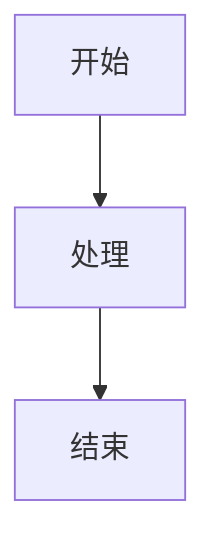
````

### HTML 中使用
```html
<script type="module">
  import mermaid from 'https://cdn.jsdelivr.net/npm/mermaid@10/dist/mermaid.esm.min.mjs';
  mermaid.initialize({ startOnLoad: true });
</script>

<div class="mermaid">
graph TD
    A --> B
</div>
```

---

## 1. 流程图 (Flowchart)

### 基本语法
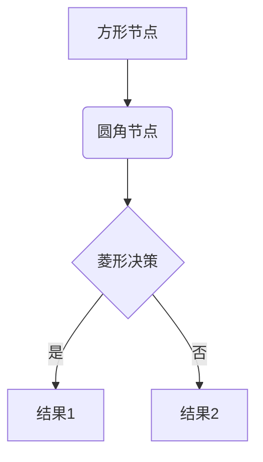

### 节点形状
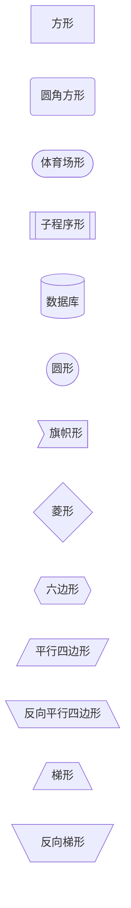

### 方向

**从上到下 (Top to Bottom)**
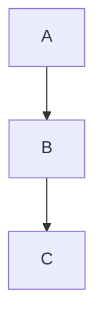

**从下到上 (Bottom to Top)**
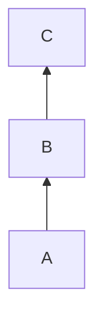

**从左到右 (Left to Right)**
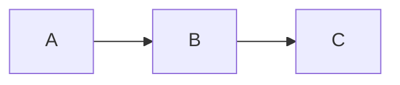

**从右到左 (Right to Left)**
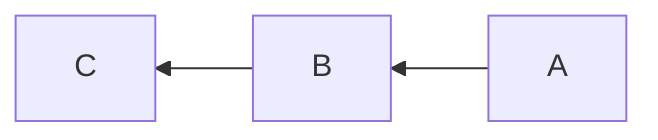

---

`flowchart` 是更新的语法，功能更强大：

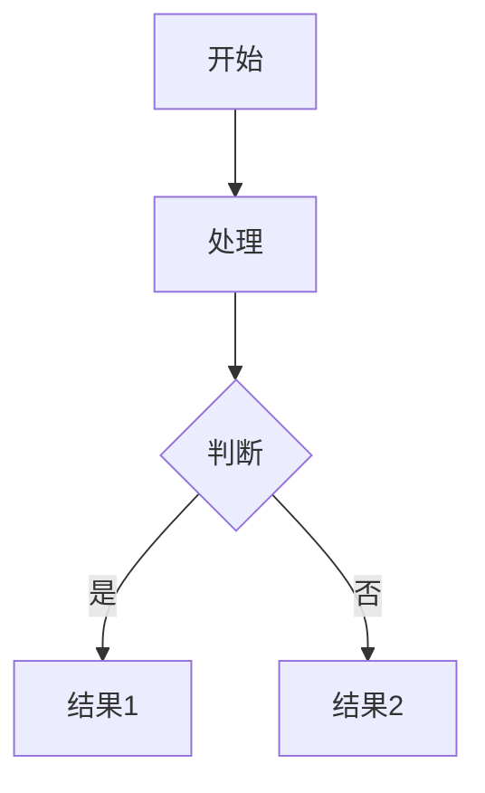

---

#### 方向代码对比

| 代码 | 方向 | 英文全称 | 效果 |
|------|------|----------|------|
| `TB` 或 `TD` | 从上到下 | Top to Bottom / Top Down | ↓ |
| `BT` | 从下到上 | Bottom to Top | ↑ |
| `LR` | 从左到右 | Left to Right | → |
| `RL` | 从右到左 | Right to Left | ← |


### 连接线类型
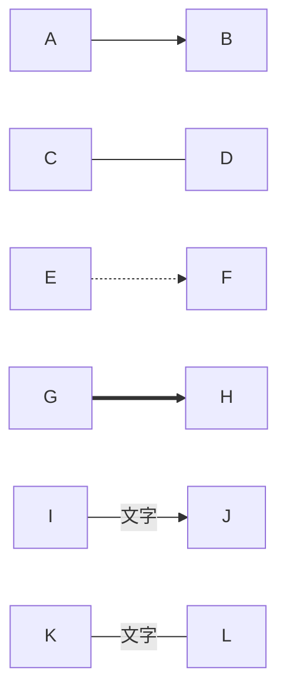

### 实际例子：用户登录流程
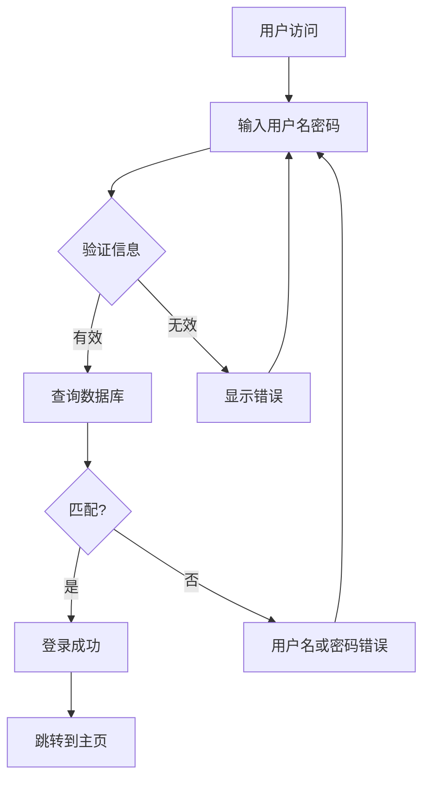

---

## 2. 时序图 (Sequence Diagram)

### 基本语法
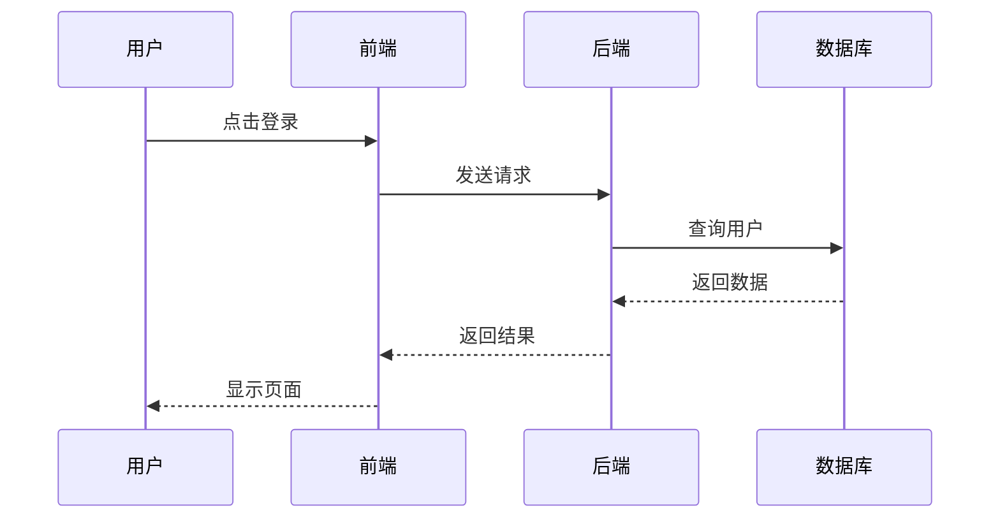

### 箭头类型
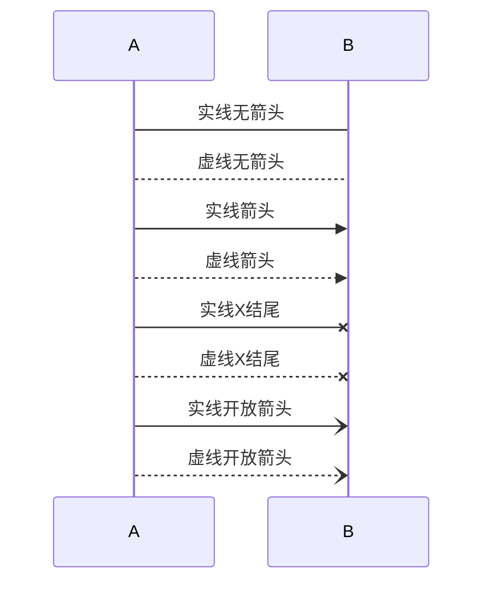

### 激活框和注释
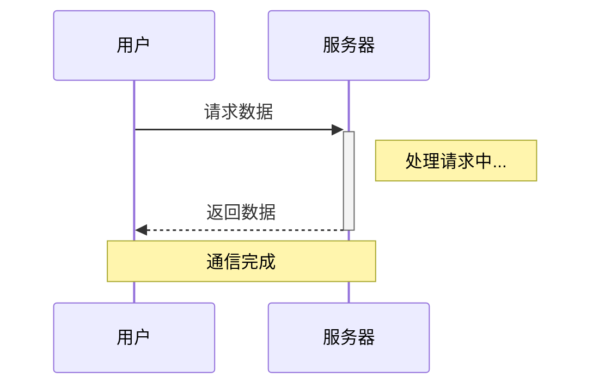

### 循环和条件
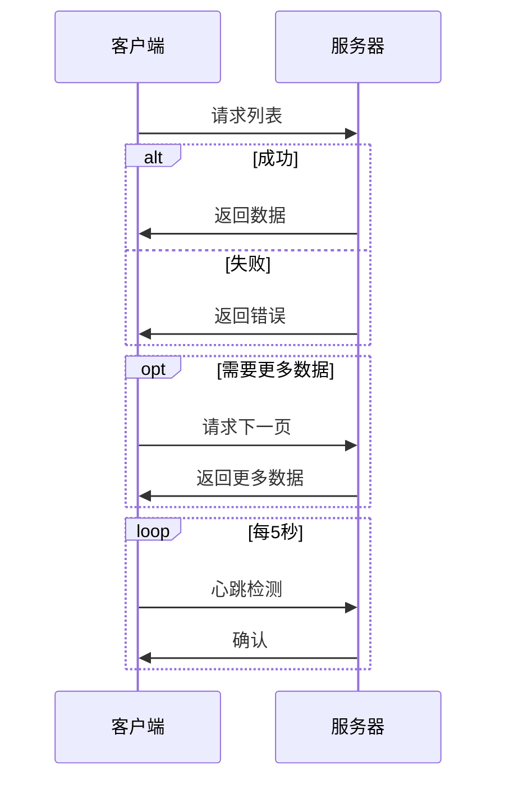

### 实际例子：支付流程
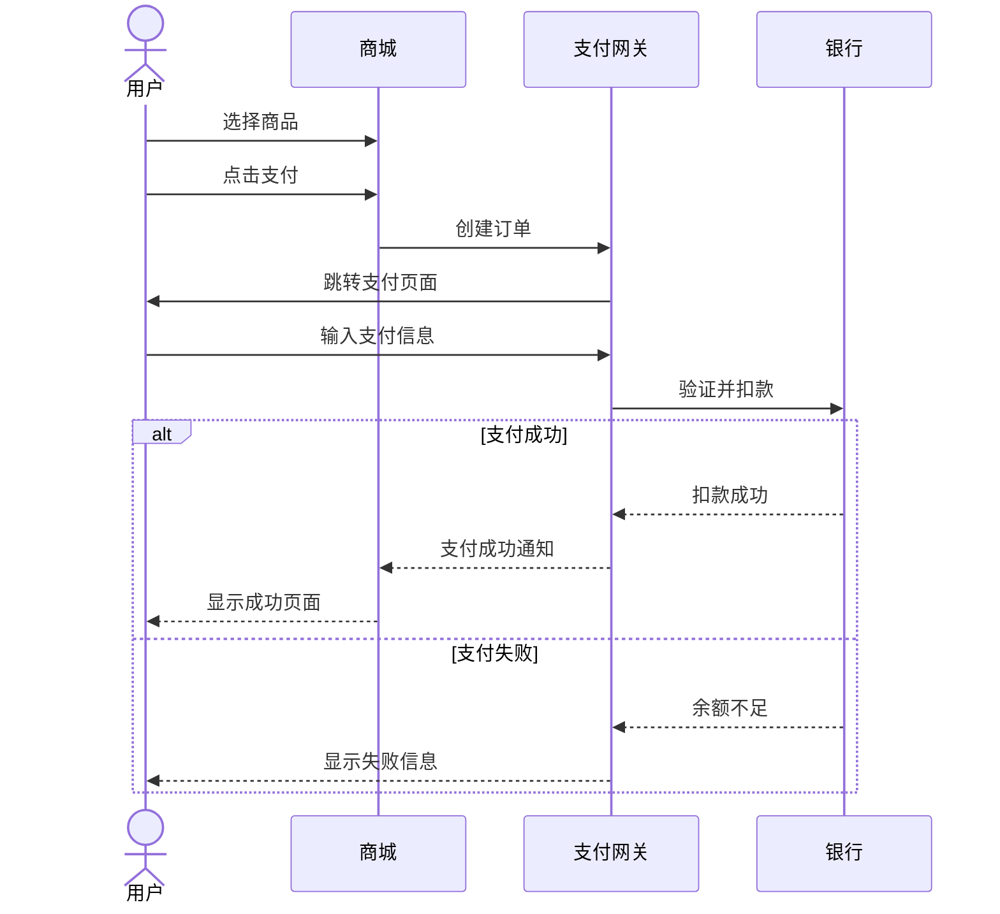

---

## 3. 类图 (Class Diagram)

### 基本语法
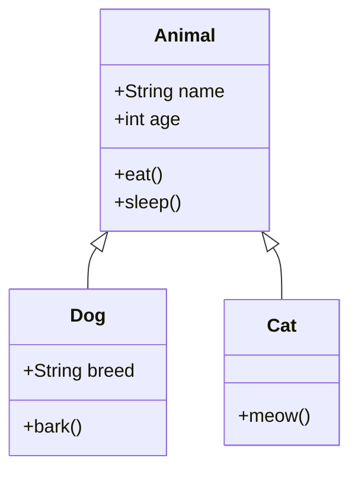

### 关系类型
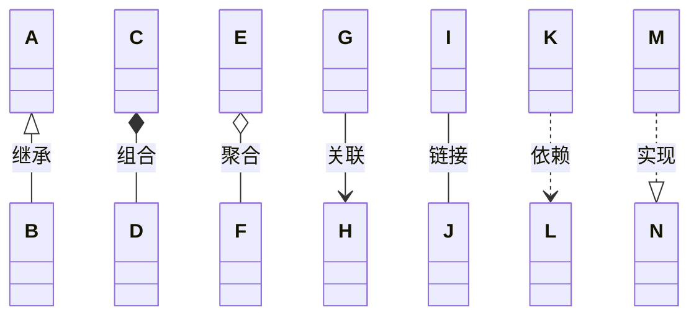

### 可见性
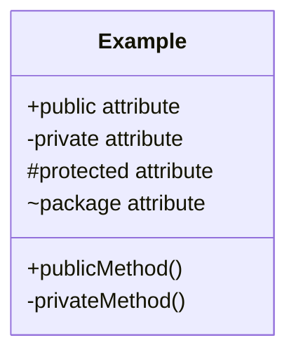

### 实际例子：电商系统
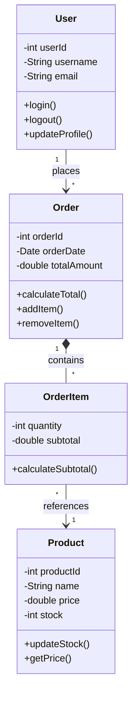

---

## 4. 状态图 (State Diagram)

### 基本语法
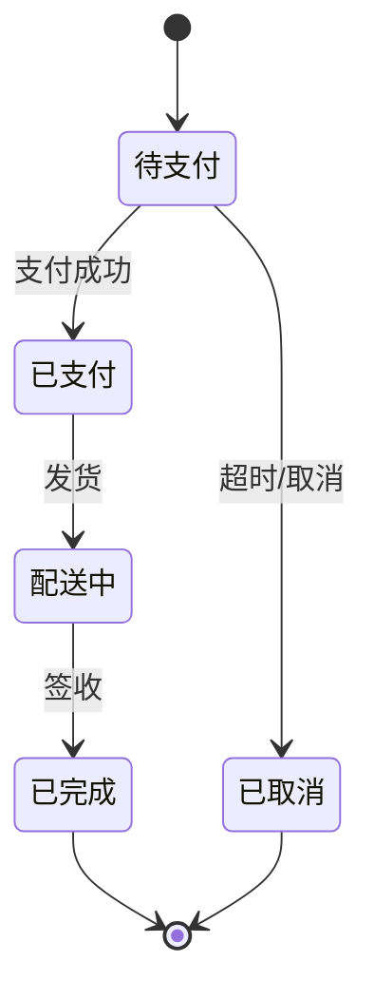

### 复合状态
```mermaid
stateDiagram-v2
    [*] --> 活跃
    
    state 活跃 {
        [*] --> 空闲
        空闲 --> 工作中 : 开始任务
        工作中 --> 空闲 : 完成任务
    }
    
    活跃 --> 暂停 : 暂停
    暂停 --> 活跃 : 恢复
    活跃 --> [*] : 结束
```

### 实际例子：订单状态
```mermaid
stateDiagram-v2
    [*] --> 待支付
    
    待支付 --> 已支付 : 支付成功
    待支付 --> 已关闭 : 超时未支付
    
    已支付 --> 待发货
    待发货 --> 已发货 : 商家发货
    
    已发货 --> 运输中
    运输中 --> 派送中
    派送中 --> 已签收 : 用户签收
    
    已签收 --> 已完成 : 7天后自动确认
    已签收 --> 退货中 : 申请退货
    
    退货中 --> 已退货 : 退货成功
    退货中 --> 已签收 : 拒绝退货
    
    已完成 --> [*]
    已关闭 --> [*]
    已退货 --> [*]
    
    note right of 待支付
        15分钟内未支付
        自动关闭订单
    end note
```

---

## 5. 实体关系图 (ER Diagram)

### 基本语法
```mermaid
erDiagram
    USER ||--o{ ORDER : places
    ORDER ||--|{ ORDER_ITEM : contains
    PRODUCT ||--o{ ORDER_ITEM : "ordered in"
    
    USER {
        int user_id PK
        string username
        string email
        date created_at
    }
    
    ORDER {
        int order_id PK
        int user_id FK
        date order_date
        decimal total_amount
    }
    
    PRODUCT {
        int product_id PK
        string name
        decimal price
        int stock
    }
    
    ORDER_ITEM {
        int order_id FK
        int product_id FK
        int quantity
        decimal subtotal
    }
```

### 关系类型
```mermaid
erDiagram
    A ||--|| B : "一对一"
    C ||--o{ D : "一对多"
    E }o--o{ F : "多对多"
    
    %% 符号说明：
    %% ||  正好一个
    %% o|  零或一个
    %% }|  一个或多个
    %% }o  零个或多个
```

### 实际例子：博客系统
```mermaid
erDiagram
    USER ||--o{ POST : writes
    USER ||--o{ COMMENT : writes
    POST ||--o{ COMMENT : has
    POST }o--o{ TAG : tagged_with
    POST }o--|| CATEGORY : belongs_to
    
    USER {
        int id PK
        string username UK
        string email UK
        string password_hash
        datetime created_at
    }
    
    POST {
        int id PK
        int author_id FK
        int category_id FK
        string title
        text content
        datetime published_at
        int view_count
    }
    
    COMMENT {
        int id PK
        int post_id FK
        int user_id FK
        text content
        datetime created_at
    }
    
    TAG {
        int id PK
        string name UK
    }
    
    CATEGORY {
        int id PK
        string name UK
        string description
    }
    
    POST_TAG {
        int post_id FK
        int tag_id FK
    }
```

---

## 6. 甘特图 (Gantt Chart)

### 基本语法
```mermaid
gantt
    title 项目开发计划
    dateFormat YYYY-MM-DD
    
    section 需求阶段
    需求收集           :a1, 2024-01-01, 7d
    需求分析           :a2, after a1, 5d
    
    section 设计阶段
    系统设计           :b1, after a2, 10d
    数据库设计         :b2, after a2, 7d
    
    section 开发阶段
    前端开发           :c1, after b1, 20d
    后端开发           :c2, after b1, 25d
    
    section 测试阶段
    单元测试           :d1, after c2, 5d
    集成测试           :d2, after d1, 7d
    
    section 上线
    部署上线           :e1, after d2, 2d
```

### 任务状态
```mermaid
gantt
    title 任务状态示例
    dateFormat YYYY-MM-DD
    
    已完成任务         :done, t1, 2024-01-01, 5d
    进行中任务         :active, t2, 2024-01-06, 7d
    未来任务           :t3, 2024-01-13, 5d
    关键任务           :crit, t4, 2024-01-13, 5d
    关键且完成         :crit, done, t5, 2024-01-01, 3d
```

### 实际例子：网站开发
```mermaid
gantt
    title 电商网站开发时间线
    dateFormat YYYY-MM-DD
    
    section 规划
    项目启动           :done, p1, 2024-01-01, 2d
    需求调研           :done, p2, after p1, 5d
    技术选型           :done, p3, after p2, 3d
    
    section 设计
    UI设计             :active, d1, 2024-01-11, 10d
    数据库设计         :active, d2, 2024-01-11, 7d
    API设计            :d3, after d2, 5d
    
    section 前端开发
    首页               :crit, f1, after d1, 7d
    商品列表           :f2, after f1, 5d
    商品详情           :f3, after f2, 5d
    购物车             :f4, after f3, 5d
    订单页面           :f5, after f4, 7d
    
    section 后端开发
    用户模块           :crit, b1, after d3, 7d
    商品模块           :b2, after b1, 7d
    订单模块           :b3, after b2, 10d
    支付集成           :crit, b4, after b3, 7d
    
    section 测试
    功能测试           :t1, after b4, 7d
    性能测试           :t2, after t1, 5d
    安全测试           :crit, t3, after t1, 5d
    
    section 部署
    服务器配置         :crit, deploy1, after t3, 2d
    上线               :milestone, deploy2, after deploy1, 1d
```

---

## 7. 饼图 (Pie Chart)

```mermaid
pie title 编程语言使用占比
    "JavaScript" : 35
    "Python" : 25
    "Java" : 20
    "Go" : 12
    "其他" : 8
```

---

## 8. Git 图 (Git Graph)

```mermaid
gitGraph
    commit id: "初始化项目"
    commit id: "添加README"
    branch develop
    checkout develop
    commit id: "开发功能A"
    commit id: "开发功能B"
    checkout main
    merge develop
    commit id: "发布v1.0"
    branch hotfix
    commit id: "修复bug"
    checkout main
    merge hotfix
    commit id: "发布v1.0.1"
```

---

## 9. 用户旅程图 (User Journey)

```mermaid
journey
    title 用户购物体验
    section 浏览
      访问首页: 5: 用户
      搜索商品: 4: 用户
      查看详情: 5: 用户
    section 购买
      加入购物车: 4: 用户
      填写地址: 3: 用户
      选择支付: 4: 用户
      完成支付: 5: 用户
    section 售后
      查看物流: 4: 用户
      收货确认: 5: 用户
      评价商品: 3: 用户
```

---

## 10. 象限图 (Quadrant Chart)

```mermaid
quadrantChart
    title 任务优先级矩阵
    x-axis 低紧急度 --> 高紧急度
    y-axis 低重要度 --> 高重要度
    quadrant-1 立即执行
    quadrant-2 计划执行
    quadrant-3 委托他人
    quadrant-4 减少或消除
    
    修复严重bug: [0.8, 0.9]
    开发新功能: [0.3, 0.8]
    代码重构: [0.2, 0.6]
    写文档: [0.4, 0.5]
    回复邮件: [0.7, 0.3]
    社交媒体: [0.2, 0.2]
```

---

## 11. 时间线 (Timeline)

```mermaid
timeline
    title 公司发展历程
    2020 : 公司成立
         : 获得天使轮融资
    2021 : 产品上线
         : 用户突破10万
    2022 : 获得A轮融资
         : 团队扩展到50人
    2023 : 营收破亿
         : 开设海外分公司
    2024 : 上市准备
```

---

## 12. 思维导图 (Mindmap)

```mermaid
mindmap
  root((Web开发))
    前端
      HTML
      CSS
        Sass
        Less
      JavaScript
        React
        Vue
        Angular
    后端
      Node.js
      Python
        Django
        Flask
      Java
        Spring Boot
    数据库
      MySQL
      PostgreSQL
      MongoDB
      Redis
    DevOps
```
