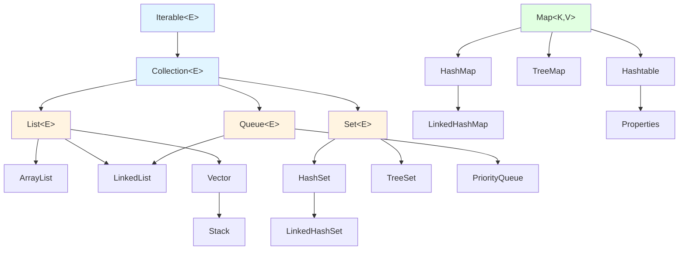

# 1. Java 入门
### 1.1 Java 简介
Java 是由 Sun Microsystems 公司于 1995 年 5 月推出的 Java 面向对象程序设计语言和 Java 平台的总称。由 James Gosling和同事们共同研发，并在 1995 年正式推出。

后来 Sun 公司被 Oracle （甲骨文）公司收购，Java 也随之成为 Oracle 公司的产品。

Java分为三个体系：

- JavaSE（J2SE）（Java2 Platform Standard Edition，java平台标准版）
- JavaEE(J2EE)(Java 2 Platform,Enterprise Edition，java平台企业版)
- JavaME(J2ME)(Java 2 Platform Micro Edition，java平台微型版)。

2005 年 6 月，JavaOne 大会召开，SUN 公司公开 Java SE 6。此时，Java 的各种版本已经更名，以取消其中的数字 "2"：J2EE 更名为 Java EE，J2SE 更名为Java SE，J2ME 更名为 Java ME。
#### 主要特性

- **Java 语言是简单的：**
    
    Java 语言的语法与 C 语言和 C++ 语言很接近，使得大多数程序员很容易学习和使用。另一方面，Java 丢弃了 C++ 中很少使用的、很难理解的、令人迷惑的那些特性，如操作符重载、多继承、自动的强制类型转换。特别地，Java 语言不使用指针，而是引用。并提供了自动分配和回收内存空间，使得程序员不必为内存管理而担忧。
    
- **Java 语言是面向对象的：**
    
    Java 语言提供类、接口和继承等面向对象的特性，为了简单起见，只支持类之间的单继承，但支持接口之间的多继承，并支持类与接口之间的实现机制（关键字为 implements）。Java 语言全面支持动态绑定，而 C++语言只对虚函数使用动态绑定。总之，Java语言是一个纯的面向对象程序设计语言。
    
- **Java语言是分布式的：**
    
    Java 语言支持 Internet 应用的开发，在基本的 Java 应用编程接口中有一个网络应用编程接口（java net），它提供了用于网络应用编程的类库，包括 URL、URLConnection、Socket、ServerSocket 等。Java 的 RMI（远程方法激活）机制也是开发分布式应用的重要手段。
    
- **Java 语言是健壮的：**
    
    Java 的强类型机制、异常处理、垃圾的自动收集等是 Java 程序健壮性的重要保证。对指针的丢弃是 Java 的明智选择。Java 的安全检查机制使得 Java 更具健壮性。
    
- **Java语言是安全的：**
    
    Java通常被用在网络环境中，为此，Java 提供了一个安全机制以防恶意代码的攻击。除了Java 语言具有的许多安全特性以外，Java 对通过网络下载的类具有一个安全防范机制（类 ClassLoader），如分配不同的名字空间以防替代本地的同名类、字节代码检查，并提供安全管理机制（类 SecurityManager）让 Java 应用设置安全哨兵。
    
- **Java 语言是体系结构中立的：**
    
    Java 程序（后缀为 java 的文件）在 Java 平台上被编译为体系结构中立的字节码格式（后缀为 class 的文件），然后可以在实现这个 Java 平台的任何系统中运行。这种途径适合于异构的网络环境和软件的分发。
    
- **Java 语言是可移植的：**
    
    这种可移植性来源于体系结构中立性，另外，Java 还严格规定了各个基本数据类型的长度。Java 系统本身也具有很强的可移植性，Java 编译器是用 Java 实现的，Java 的运行环境是用 ANSI C 实现的。
    
- **Java 语言是解释型的：**
    
    如前所述，Java 程序在 Java 平台上被编译为字节码格式，然后可以在实现这个 Java 平台的任何系统中运行。在运行时，Java 平台中的 Java 解释器对这些字节码进行解释执行，执行过程中需要的类在联接阶段被载入到运行环境中。
    
- **Java 是高性能的：**
    
    与那些解释型的高级脚本语言相比，Java 的确是高性能的。事实上，Java 的运行速度随着 JIT(Just-In-Time）编译器技术的发展越来越接近于 C++。
    
- **Java 语言是多线程的：**
    
    在 Java 语言中，线程是一种特殊的对象，它必须由 Thread 类或其子（孙）类来创建。通常有两种方法来创建线程：其一，使用型构为 Thread(Runnable) 的构造子类将一个实现了 Runnable 接口的对象包装成一个线程，其二，从 Thread 类派生出子类并重写 run 方法，使用该子类创建的对象即为线程。值得注意的是 Thread 类已经实现了 Runnable 接口，因此，任何一个线程均有它的 run 方法，而 run 方法中包含了线程所要运行的代码。线程的活动由一组方法来控制。Java 语言支持多个线程的同时执行，并提供多线程之间的同步机制（关键字为 synchronized）。
    
- **Java 语言是动态的：**
    
    Java 语言的设计目标之一是适应于动态变化的环境。Java 程序需要的类能够动态地被载入到运行环境，也可以通过网络来载入所需要的类。这也有利于软件的升级。另外，Java 中的类有一个运行时刻的表示，能进行运行时刻的类型检查。

#### 发展历史

- 1995 年 5 月 23 日，Java 语言诞生
- 1996 年 1 月，第一个 JDK-JDK1.0 诞生
- 1996 年 4 月，10 个最主要的操作系统供应商申明将在其产品中嵌入 JAVA 技术
- 1996 年 9 月，约 8.3 万个网页应用了 JAVA 技术来制作
- 1997 年 2 月 18 日，JDK1.1 发布
- 1997 年 4 月 2 日，JavaOne 会议召开，参与者逾一万人，创当时全球同类会议规模之纪录
- 1997 年 9 月，JavaDeveloperConnection 社区成员超过十万
- 1998 年 2 月，JDK1.1 被下载超过 2,000,000次
- 1998 年 12 月 8 日，JAVA2 企业平台 J2EE 发布
- 1999 年 6月，SUN 公司发布 Java 的三个版本：标准版（JavaSE, 以前是 J2SE）、企业版（JavaEE 以前是 J2EE）和微型版（JavaME，以前是 J2ME）
- 2000 年 5 月 8 日，JDK1.3 发布
- 2000 年 5 月 29 日，JDK1.4 发布
- 2001 年 6 月 5 日，NOKIA 宣布，到 2003 年将出售 1 亿部支持 Java 的手机
- 2001 年 9 月 24 日，J2EE1.3 发布
- 2002 年 2 月 26 日，J2SE1.4 发布，自此 Java 的计算能力有了大幅提升
- 2004 年 9 月 30 日 18:00PM，J2SE1.5 发布，成为 Java 语言发展史上的又一里程碑。为了表示该版本的重要性，J2SE1.5 更名为 Java SE 5.0
- 2005 年 6 月，JavaOne 大会召开，SUN 公司公开 Java SE 6。此时，Java 的各种版本已经更名，以取消其中的数字 "2"：J2EE 更名为 Java EE，J2SE 更名为 Java SE，J2ME 更名为 Java ME
- 2006 年 12 月，SUN 公司发布 JRE6.0
- **2009 年 04 月 20 日，甲骨文 74 亿美元收购 Sun，取得 Java 的版权。**
- 2010 年 11 月，由于甲骨文对于 Java 社区的不友善，因此 Apache 扬言将退出 JCP。
- 2011 年 7 月 28 日，甲骨文发布 Java7.0 的正式版。
- 2014 年 3 月 18 日，Oracle 公司发表 Java SE 8。
- 2017 年 9 月 21 日，Oracle 公司发表 Java SE 9
- 2018 年 3 月 21 日，Oracle 公司发表 Java SE 10
- 2018 年 9 月 25 日，Java SE 11 发布
- 2019 年 3 月 20 日，Java SE 12 发布

---

#### Java 开发工具

Java 语言尽量保证系统内存在 1G 以上，其他工具如下所示：

- Linux 系统、Mac OS 系统、Windows 95/98/2000/XP，WIN 7/8系统。
- [Java JDK 7、8……](http://www.oracle.com/technetwork/cn/java/javase/downloads/index.html)
- [vscode](https://code.visualstudio.com/) 编辑器或者其他编辑器。
- IDE：[Eclipse](http://www.eclipse.org/downloads/)、 [IntelliJ IDEA](https://www.jetbrains.com/idea/)、[NetBeans](https://netbeans.org/) 等。

### 1.2 开发环境搭建
#### window系统安装java

##### 下载JDK

首先我们需要下载 java 开发工具包 JDK，下载地址：[https://www.oracle.com/java/technologies/downloads/](https://www.oracle.com/java/technologies/downloads/)，在下载页面中根据自己的系统选择对应的版本，本文以 Window 64位系统为例：


下载后 JDK 的安装根据提示进行，还有安装 JDK 的时候也会安装 JRE，一并安装就可以了。

安装JDK，安装过程中可以自定义安装目录等信息，例如我们选择安装目录为 **C:\Program Files (x86)\Java\jdk1.8.0_91**。

#### 配置环境变量

1.安装完成后，右击"我的电脑"，点击"属性"，选择"高级系统设置"；


2.选择"高级"选项卡，点击"环境变量"；


在 "系统变量" 中设置 3 项属性，JAVA_HOME、PATH、CLASSPATH(大小写无所谓),若已存在则点击"编辑"，不存在则点击"新建"。

> **注意：**如果使用 1.5 以上版本的 JDK，不用设置 CLASSPATH 环境变量，也可以正常编译和运行 Java 程序。

变量设置参数如下：

- 变量名：**JAVA_HOME**
- 变量值：**C:\Program Files (x86)\Java\jdk1.8.0_91**        // 要根据自己的实际路径配置

- 变量名：**CLASSPATH**
- 变量值：**.;%JAVA_HOME%\lib\dt.jar;%JAVA_HOME%\lib\tools.jar;**         //记得前面有个"."

- 变量名：**Path**
- 变量值：**%JAVA_HOME%\bin;%JAVA_HOME%\jre\bin;**

#### JAVA_HOME 设置


#### PATH设置


> **注意：**在 Windows10 中，Path 变量里是分条显示的，我们需要将 **%JAVA_HOME%\bin;%JAVA_HOME%\jre\bin;** 分开添加，否则无法识别：
> 
> %JAVA_HOME%\bin;
> %JAVA_HOME%\jre\bin;
> 
> 
> 
> 更多内容可参考：[Windows 10 配置Java 环境变量](https://www.runoob.com/w3cnote/windows10-java-setup.html)

#### CLASSPATH 设置


这是 Java 的环境配置，配置完成后，你可以启动 Eclipse 来编写代码，它会自动完成java环境的配置。

#### 测试JDK是否安装成功

1、"开始"->"运行"，键入"cmd"；

2、键入命令: **java -version**、**java**、**javac** 几个命令，出现以下信息，说明环境变量配置成功；


---

#### Linux，UNIX，Solaris，FreeBSD环境变量设置

环境变量PATH应该设定为指向Java二进制文件安装的位置。如果设置遇到困难，请参考shell文档。

例如，假设你使用bash作为shell，你可以把下面的内容添加到你的 .bashrc文件结尾: export PATH=/path/to/java:$PATH

---

#### 流行 Java 开发工具

正所谓工欲善其事必先利其器，我们在开发 Java 语言过程中同样需要一款不错的开发工具，目前市场上的 IDE 很多，本文为大家推荐以下下几款 Java 开发工具：

- **JetBrains** 的 IDEA， 现在很多人开始使用了，功能很强大，下载地址：[https://www.jetbrains.com/idea/download/](https://www.jetbrains.com/idea/download/)
    
    
    
- **VSCode :** VSCode（全称：Visual Studio Code）是一款由微软开发且跨平台的免费源代码编辑器。
    
    下载地址：[https://code.visualstudio.com/](https://code.visualstudio.com/)
    
    安装教程： [https://www.runoob.com/w3cnote/vscode-tutorial.html](https://www.runoob.com/w3cnote/vscode-tutorial.html)
    
    
    
- **Netbeans:**开源免费的 Java IDE，下载地址： [https://www.netbeans.org/index.html](https://www.netbeans.org/)
    
    
    
- **Eclipse:**另一个免费开源的 Java IDE，下载地址： [https://www.eclipse.org/downloads/packages/](https://www.eclipse.org/downloads/packages/)
    
    选择 **Eclipse IDE for Java Developers**：  
    

---
## 1.3 第一个Java程序
```java
public class HelloWorld { /* 第一个Java程序 * 它将输出字符串 Hello World */ 
	public static void main(String[] args) { 
	System.out.println("Hello World"); // 输出 Hello World } }
```
![[Pasted image 20260512003149.png]]
下面将逐步介绍如何保存、编译以及运行这个程序：

- 打开代码编辑器，把上面的代码添加进去；
- 把文件名保存为：HelloWorld.java；
- 打开 cmd 命令窗口，进入目标文件所在的位置，假设是 C:\
- 在命令行窗口输入 javac HelloWorld.java 按下回车键编译代码。如果代码没有错误，cmd 命令提示符会进入下一行（假设环境变量都设置好了）。
- 再键输入 java HelloWorld 按下回车键就可以运行程序了
---

# 2. 基础语法

### 2.1 注释（Comment）

Java 中有三种注释方式：

#### 单行注释（Single-line Comment）
```java
// 这是单行注释
int age = 25; // 也可以写在代码后面
```

#### 多行注释（Multi-line Comment）
```java
/*
 * 这是多行注释
 * 可以写多行内容
 * 用于较长的说明
 */
int count = 0;

/* 也可以写成一行 */
```

#### 文档注释（Documentation Comment）
```java
/**
 * 这是文档注释，用于生成 API 文档
 * @author 张三
 * @version 1.0
 * @param name 用户名
 * @return 返回值说明
 */
public String getUserInfo(String name) {
    return "User: " + name;
}
```

**注意**：
- 注释不会被编译和执行
- 文档注释可以通过 javadoc 工具生成 HTML 文档
- 良好的注释习惯能提高代码可读性

---

### 2.2 标识符与关键字

#### 命名规则（Naming Rules）

标识符（Identifier）是给类、方法、变量等起的名字，必须遵守以下规则：

1. **只能包含**：字母、数字、下划线（_）、美元符号（$）
2. **不能以数字开头**
3. **不能使用 Java 关键字**
4. **区分大小写**

```java
// 合法的标识符
int age;
int _count;
int $price;
int user123;
int userName;

// 非法的标识符
int 123user;    // 不能以数字开头
int class;      // 不能使用关键字
int user-name;  // 不能包含连字符
```

#### 命名规范（Naming Conventions）

虽然不是强制要求，但遵循规范能让代码更易读：

| 类型 | 规范 | 示例 |
|------|------|------|
| **类名（Class）** | 大驼峰命名法（PascalCase） | `UserService`, `StudentInfo` |
| **方法名（Method）** | 小驼峰命名法（camelCase） | `getUserName()`, `calculateTotal()` |
| **变量名（Variable）** | 小驼峰命名法 | `userName`, `totalPrice` |
| **常量名（Constant）** | 全大写，下划线分隔 | `MAX_VALUE`, `DEFAULT_SIZE` |
| **包名（Package）** | 全小写 | `com.example.project` |

```java
// 命名规范示例
public class UserService {                    // 类名：大驼峰
    private static final int MAX_COUNT = 100; // 常量：全大写
    private String userName;                  // 变量：小驼峰
    
    public void getUserInfo() {               // 方法：小驼峰
        int totalCount = 0;                   // 局部变量：小驼峰
    }
}
```

#### Java 关键字（Keywords）

Java 保留了一些特殊用途的单词，不能用作标识符：

**访问控制（Access Control）**
```
public      protected   private
```

**类、方法、变量修饰符（Modifiers）**
```
abstract    static      final       synchronized
native      transient   volatile    strictfp
```

**类相关（Class-related）**
```
class       interface   enum        extends
implements  package     import
```

**流程控制（Control Flow）**
```
if          else        switch      case
default     for         while       do
break       continue    return
```

**异常处理（Exception Handling）**
```
try         catch       finally     throw
throws      assert
```

**基本数据类型（Primitive Types）**
```
byte        short       int         long
float       double      char        boolean
```

**其他（Others）**
```
new         this        super       void
null        true        false       instanceof
```

**保留字（Reserved but not used）**
```
goto        const
```

---

### 2.3 数据类型（Data Type）

Java 是强类型语言，所有变量必须先声明类型才能使用。

#### 基本数据类型（Primitive Data Type）

Java 有 8 种基本数据类型：

##### 整数类型（Integer Types）

| 类型 | 字节数 | 取值范围 | 默认值 |
|------|--------|----------|--------|
| `byte` | 1 字节 | -128 ~ 127 | 0 |
| `short` | 2 字节 | -32,768 ~ 32,767 | 0 |
| `int` | 4 字节 | -2³¹ ~ 2³¹-1（约 ±21 亿） | 0 |
| `long` | 8 字节 | -2⁶³ ~ 2⁶³-1 | 0L |

```java
byte b = 100;
short s = 30000;
int i = 1000000;
long l = 9999999999L;  // long 类型需要加 L 或 l 后缀

// 不同进制表示
int decimal = 100;      // 十进制
int binary = 0b1100100; // 二进制（0b 开头）
int octal = 0144;       // 八进制（0 开头）
int hex = 0x64;         // 十六进制（0x 开头）
```

##### 浮点类型（Floating-point Types）

| 类型 | 字节数 | 取值范围 | 默认值 | 精度 |
|------|--------|----------|--------|------|
| `float` | 4 字节 | ±3.4E+38 | 0.0f | 约 6-7 位有效数字 |
| `double` | 8 字节 | ±1.7E+308 | 0.0d | 约 15 位有效数字 |

```java
float f = 3.14f;        // float 类型需要加 F 或 f 后缀
double d = 3.14159;     // double 是默认的浮点类型
double d2 = 3.14d;      // 也可以加 D 或 d 后缀

// 科学计数法
double d3 = 3.14e2;     // 314.0
double d4 = 3.14e-2;    // 0.0314

// 注意：浮点数不精确
System.out.println(0.1 + 0.2);  // 0.30000000000000004
```

##### 字符类型（Character Type）

| 类型 | 字节数 | 取值范围 | 默认值 |
|------|--------|----------|--------|
| `char` | 2 字节 | 0 ~ 65535（Unicode） | '\u0000' |

```java
char c1 = 'A';          // 单个字符
char c2 = '中';         // 中文字符
char c3 = 65;           // ASCII 码（A）
char c4 = '\u0041';     // Unicode 编码（A）

// 转义字符
char newline = '\n';    // 换行
char tab = '\t';        // 制表符
char backslash = '\\';  // 反斜杠
char quote = '\'';      // 单引号
char doubleQuote = '\"';// 双引号
```

##### 布尔类型（Boolean Type）

| 类型 | 字节数 | 取值范围 | 默认值 |
|------|--------|----------|--------|
| `boolean` | 1 字节 | true / false | false |

```java
boolean isActive = true;
boolean hasPermission = false;

// 常用于条件判断
if (isActive) {
    System.out.println("激活状态");
}
```

#### 引用数据类型（Reference Data Type）

除了基本数据类型，其他都是引用类型：

##### 类（Class）
```java
String name = "张三";           // String 是类
Scanner scanner = new Scanner(System.in);
Integer num = 100;              // 包装类
```

##### 接口（Interface）
```java
List<String> list = new ArrayList<>();  // List 是接口
```

##### 数组（Array）
```java
int[] numbers = {1, 2, 3, 4, 5};
String[] names = new String[10];
```

**基本类型 vs 引用类型**：

| 特性 | 基本类型 | 引用类型 |
|------|----------|----------|
| 存储位置 | 栈内存（Stack） | 堆内存（Heap） |
| 存储内容 | 实际值 | 对象地址（引用） |
| 默认值 | 0、false、'\u0000' | null |
| 比较方式 | 值比较（==） | 地址比较（==）或内容比较（equals） |

```java
// 基本类型
int a = 10;
int b = 10;
System.out.println(a == b);  // true（值相等）

// 引用类型
String s1 = new String("hello");
String s2 = new String("hello");
System.out.println(s1 == s2);       // false（地址不同）
System.out.println(s1.equals(s2));  // true（内容相同）
```

#### 类型转换（Type Conversion）

##### 自动类型转换（Implicit Conversion / Widening）

小范围类型自动转换为大范围类型（无数据丢失）：

**转换路径**：
```
byte → short → int → long → float → double
       char  → int
```

```java
// 自动类型转换
byte b = 10;
int i = b;          // byte → int（自动）
long l = i;         // int → long（自动）
float f = l;        // long → float（自动）
double d = f;       // float → double（自动）

// 运算中的自动转换
int x = 10;
double y = 3.5;
double result = x + y;  // int 自动转为 double，结果为 13.5

// char 与 int
char c = 'A';
int code = c;       // char → int（65）
System.out.println(code);  // 65

// byte/short/char 运算时自动提升为 int
byte b1 = 10;
byte b2 = 20;
int sum = b1 + b2;  // 结果是 int 类型
// byte b3 = b1 + b2;  // 编译错误！需要强制转换
```

##### 强制类型转换（Explicit Conversion / Narrowing）

大范围类型转换为小范围类型（可能丢失精度）：

**语法**：`(目标类型) 变量`

```java
// 强制类型转换
double d = 3.14;
int i = (int) d;        // 3（小数部分丢失）

long l = 100L;
int i2 = (int) l;       // 100

// 可能溢出
int bigNum = 130;
byte b = (byte) bigNum; // -126（超出 byte 范围，发生溢出）

// 运算中的强制转换
int x = 10;
int y = 3;
double result = (double) x / y;  // 3.3333...
// 如果不转换：int result = x / y;  // 结果是 3

// 修正 byte/short 运算
byte b1 = 10;
byte b2 = 20;
byte b3 = (byte) (b1 + b2);  // 需要强制转换

// char 与数字
int code = 65;
char c = (char) code;   // 'A'
```

**注意事项**：
1. boolean 类型不能与其他类型转换
2. 强制转换可能导致精度丢失或溢出
3. 多个数据混合运算时，先统一为最大类型再运算

```java
// 混合运算示例
byte b = 10;
short s = 20;
int i = 30;
long l = 40L;
float f = 50.0f;
double d = 60.0;

// 结果类型为 double（最大类型）
double result = b + s + i + l + f + d;
```

---

### 2.4 变量与常量

#### 变量声明与初始化（Variable Declaration and Initialization）

变量是内存中的一块存储空间，用于存储数据。

**语法**：
```java
数据类型 变量名;              // 声明
数据类型 变量名 = 初始值;     // 声明并初始化
```

```java
// 声明变量
int age;
String name;

// 初始化变量
age = 25;
name = "张三";

// 声明并初始化
int count = 0;
double price = 99.99;
boolean isActive = true;

// 同时声明多个变量
int a, b, c;
int x = 1, y = 2, z = 3;

// 变量必须先赋值才能使用
int num;
// System.out.println(num);  // 编译错误！局部变量未初始化
```

#### 变量作用域（Variable Scope）

变量的作用域决定了变量的可见范围和生命周期。

##### 局部变量（Local Variable）
```java
public class Demo {
    public void method() {
        int localVar = 10;  // 局部变量
        // 作用域：方法内部
        // 生命周期：方法调用时创建，方法结束时销毁
        // 必须初始化才能使用
    }
    
    public void test() {
        // System.out.println(localVar);  // 错误！无法访问
    }
}
```

##### 成员变量（Member Variable / Instance Variable）
```java
public class Student {
    String name;        // 成员变量
    int age;            // 成员变量
    
    // 作用域：整个类
    // 生命周期：对象创建时创建，对象销毁时销毁
    // 有默认值（数值型为 0，boolean 为 false，引用型为 null）
    
    public void showInfo() {
        System.out.println(name);  // 可以访问
        System.out.println(age);   // 可以访问
    }
}
```

##### 静态变量（Static Variable / Class Variable）
```java
public class Counter {
    static int count = 0;  // 静态变量
    
    // 作用域：整个类
    // 生命周期：类加载时创建，程序结束时销毁
    // 所有对象共享同一个静态变量
    
    public Counter() {
        count++;
    }
}

// 使用
Counter c1 = new Counter();
Counter c2 = new Counter();
System.out.println(Counter.count);  // 2
```

**变量作用域对比**：

| 类型 | 声明位置 | 作用域 | 生命周期 | 默认值 |
|------|----------|--------|----------|--------|
| 局部变量 | 方法内 | 方法内 | 方法调用期间 | 无（必须初始化） |
| 成员变量 | 类中方法外 | 整个类 | 对象存在期间 | 有 |
| 静态变量 | 类中方法外（static） | 整个类 | 类加载到程序结束 | 有 |

```java
public class ScopeDemo {
    int memberVar = 10;         // 成员变量
    static int staticVar = 20;  // 静态变量
    
    public void method(int param) {  // param 是参数（局部变量）
        int localVar = 30;           // 局部变量
        
        System.out.println(memberVar);  // 10
        System.out.println(staticVar);  // 20
        System.out.println(localVar);   // 30
        System.out.println(param);      // 参数值
        
        if (true) {
            int blockVar = 40;          // 块级作用域
            System.out.println(blockVar);  // 40
        }
        // System.out.println(blockVar);  // 错误！超出作用域
    }
}
```

#### 常量（Constant）

常量是值不能改变的量，使用 `final` 关键字声明。

**语法**：
```java
final 数据类型 常量名 = 值;
```

```java
// 常量声明
final int MAX_COUNT = 100;
final double PI = 3.14159;
final String APP_NAME = "MyApp";

// 常量必须初始化
// final int NUM;  // 错误！常量必须赋值

// 常量不能修改
// MAX_COUNT = 200;  // 错误！常量不能重新赋值

// 常量命名规范：全大写，下划线分隔
final int MAX_SIZE = 1024;
final String DEFAULT_COLOR = "red";
```

**常量的优点**：
1. 提高代码可读性
2. 便于维护（修改一处即可）
3. 防止意外修改

```java
// 不使用常量
if (status == 1) {  // 1 是什么意思？
    // ...
}

// 使用常量
final int STATUS_ACTIVE = 1;
if (status == STATUS_ACTIVE) {  // 清晰易懂
    // ...
}
```

**静态常量（Static Constant）**：
```java
public class Config {
    // 静态常量：类级别的常量，所有对象共享
    public static final int MAX_USERS = 1000;
    public static final String VERSION = "1.0.0";
}

// 使用
System.out.println(Config.MAX_USERS);
System.out.println(Config.VERSION);
```

---

### 2.5 运算符（Operator）

运算符用于对变量和值进行操作。

#### 算术运算符（Arithmetic Operator）

| 运算符 | 说明 | 示例 | 结果 |
|--------|------|------|------|
| `+` | 加法 | `5 + 3` | 8 |
| `-` | 减法 | `5 - 3` | 2 |
| `*` | 乘法 | `5 * 3` | 15 |
| `/` | 除法 | `5 / 3` | 1（整数除法） |
| `%` | 取模（取余） | `5 % 3` | 2 |
| `++` | 自增 | `i++` 或 `++i` | i = i + 1 |
| `--` | 自减 | `i--` 或 `--i` | i = i - 1 |

```java
int a = 10, b = 3;

// 基本运算
System.out.println(a + b);  // 13
System.out.println(a - b);  // 7
System.out```java
System.out.println(a * b);  // 30
System.out.println(a / b);  // 3（整数除法，舍弃小数部分）
System.out.println(a % b);  // 1（10 除以 3 余 1）

// 浮点数除法
double x = 10.0;
double y = 3.0;
System.out.println(x / y);  // 3.3333333333333335

// 整数除法注意事项
System.out.println(5 / 2);      // 2（不是 2.5）
System.out.println(5.0 / 2);    // 2.5
System.out.println(5 / 2.0);    // 2.5
System.out.println((double) 5 / 2);  // 2.5

// 取模运算
System.out.println(10 % 3);     // 1
System.out.println(-10 % 3);    // -1（结果符号与被除数相同）
System.out.println(10 % -3);    // 1

// 自增自减
int i = 5;
i++;            // i = 6（后自增）
++i;            // i = 7（前自增）
i--;            // i = 6（后自减）
--i;            // i = 5（前自减）

// 前缀 vs 后缀
int m = 5;
int n = m++;    // n = 5, m = 6（先赋值，后自增）
System.out.println("m=" + m + ", n=" + n);  // m=6, n=5

int p = 5;
int q = ++p;    // q = 6, p = 6（先自增，后赋值）
System.out.println("p=" + p + ", q=" + q);  // p=6, q=6

// 字符串连接（+ 的特殊用法）
String str = "Hello" + "World";     // "HelloWorld"
String result = "Count: " + 10;     // "Count: 10"
System.out.println(1 + 2 + "3");    // "33"（1+2=3，然后 3+"3"="33"）
System.out.println("1" + 2 + 3);    // "123"（从左到右连接）
```

#### 赋值运算符（Assignment Operator）

| 运算符 | 说明 | 示例 | 等价于 |
|--------|------|------|--------|
| `=` | 赋值 | `a = 5` | - |
| `+=` | 加后赋值 | `a += 5` | `a = a + 5` |
| `-=` | 减后赋值 | `a -= 5` | `a = a - 5` |
| `*=` | 乘后赋值 | `a *= 5` | `a = a * 5` |
| `/=` | 除后赋值 | `a /= 5` | `a = a / 5` |
| `%=` | 取模后赋值 | `a %= 5` | `a = a % 5` |

```java
int a = 10;

// 基本赋值
a = 20;         // a = 20

// 复合赋值
a += 5;         // a = a + 5 = 25
a -= 3;         // a = a - 3 = 22
a *= 2;         // a = a * 2 = 44
a /= 4;         // a = a / 4 = 11
a %= 3;         // a = a % 3 = 2

// 复合赋值的类型转换
byte b = 10;
// b = b + 5;   // 错误！b + 5 结果是 int 类型
b += 5;         // 正确！复合赋值自动强制转换
System.out.println(b);  // 15

// 连续赋值
int x, y, z;
x = y = z = 100;  // 从右到左执行
System.out.println(x + ", " + y + ", " + z);  // 100, 100, 100
```

#### 比较运算符（Comparison Operator / Relational Operator）

比较运算符用于比较两个值，返回 `boolean` 类型结果。

| 运算符  | 说明   | 示例       | 结果    |
| ---- | ---- | -------- | ----- |
| `==` | 等于   | `5 == 3` | false |
| `!=` | 不等于  | `5 != 3` | true  |
| `>`  | 大于   | `5 > 3`  | true  |
| `<`  | 小于   | `5 < 3`  | false |
| `>=` | 大于等于 | `5 >= 5` | true  |
| `<=` | 小于等于 | `5 <= 3` | false |

```java
int a = 10, b = 20;

// 比较运算
System.out.println(a == b);  // false
System.out.println(a != b);  // true
System.out.println(a > b);   // false
System.out.println(a < b);   // true
System.out.println(a >= 10); // true
System.out.println(a <= 10); // true

// 常用于条件判断
if (a < b) {
    System.out.println("a 小于 b");
}

// 注意：基本类型比较值，引用类型比较地址
int x = 100;
int y = 100;
System.out.println(x == y);  // true（值相等）

String s1 = new String("hello");
String s2 = new String("hello");
System.out.println(s1 == s2);       // false（地址不同）
System.out.println(s1.equals(s2));  // true（内容相同）

// 字符比较（比较 ASCII 码）
char c1 = 'A';  // 65
char c2 = 'B';  // 66
System.out.println(c1 < c2);  // true
```

#### 逻辑运算符（Logical Operator）

逻辑运算符用于连接多个布尔表达式。

| 运算符 | 说明 | 示例 | 结果 |
|--------|------|------|------|
| `&&` | 逻辑与（AND） | `true && false` | false |
| `||` | 逻辑或（OR） | `true || false` | true |
| `!` | 逻辑非（NOT） | `!true` | false |
| `&` | 按位与（非短路） | `true & false` | false |
| `|` | 按位或（非短路） | `true | false` | true |

**逻辑与（&&）**：两个条件都为 true 时结果才为 true
```java
int age = 25;
boolean hasLicense = true;

// 逻辑与
if (age >= 18 && hasLicense) {
    System.out.println("可以开车");
}

// 真值表
System.out.println(true && true);   // true
System.out.println(true && false);  // false
System.out.println(false && true);  // false
System.out.println(false && false); // false
```

**逻辑或（||）**：只要有一个条件为 true，结果就为 true
```java
boolean isWeekend = false;
boolean isHoliday = true;

// 逻辑或
if (isWeekend || isHoliday) {
    System.out.println("可以休息");
}

// 真值表
System.out.println(true || true);   // true
System.out.println(true || false);  // true
System.out.println(false || true);  // true
System.out.println(false || false); // false
```

**逻辑非（!）**：取反
```java
boolean isRaining = false;

// 逻辑非
if (!isRaining) {
    System.out.println("不下雨，可以出门");
}

System.out.println(!true);   // false
System.out.println(!false);  // true
```

**短路特性（Short-circuit Evaluation）**：
```java
int a = 10, b = 20;

// && 短路：左边为 false，右边不执行
if (a > 20 && ++b > 20) {  // a > 20 为 false，++b 不执行
    System.out.println("条件成立");
}
System.out.println(b);  // 20（b 没有自增）

// || 短路：左边为 true，右边不执行
if (a < 20 || ++b > 20) {  // a < 20 为 true，++b 不执行
    System.out.println("条件成立");
}
System.out.println(b);  // 20（b 没有自增）

// & 和 | 不短路：两边都会执行
int x = 10, y = 20;
if (x > 20 & ++y > 20) {  // 两边都执行
    System.out.println("条件成立");
}
System.out.println(y);  // 21（y 自增了）
```

**复杂逻辑表达式**：
```java
int score = 85;
boolean isVIP = true;

// 复杂条件
if ((score >= 80 && score < 90) || isVIP) {
    System.out.println("享受优惠");
}

// 德摩根定律（De Morgan's Laws）
// !(A && B) 等价于 !A || !B
// !(A || B) 等价于 !A && !B
boolean A = true, B = false;
System.out.println(!(A && B));        // true
System.out.println(!A || !B);         // true（等价）

System.out.println(!(A || B));        // false
System.out.println(!A && !B);         // false（等价）
```

#### 位运算符（Bitwise Operator）

位运算符对整数的二进制位进行操作。

| 运算符   | 说明          | 示例         | 结果         |     |     |
| ----- | ----------- | ---------- | ---------- | --- | --- |
| `&`   | 按位与         | `5 & 3`    | 1          |     |     |
| `\|`  | 按位或         | `0111`     | 1          |     |     |
| `^`   | 按位异或        | `5 ^ 3`    | 6          |     |     |
| `~`   | 按位取反        | `~5`       | -6         |     |     |
| `<<`  | 左移          | `5 << 1`   | 10         |     |     |
| `>>`  | 右移（算术右移）    | `5 >> 1`   | 2          |     |     |
| `>>>` | 无符号右移（逻辑右移） | `-5 >>> 1` | 2147483645 |     |     |

```java
// 按位与（&）：两位都为 1 时结果为 1
int a = 5;   // 0101
int b = 3;   // 0011
System.out.println(a & b);  // 0001 = 1

// 按位或（|）：有一位为 1 时结果为 1
System.out.println(a | b);  // 0111 = 7

// 按位异或（^）：两位不同时结果为 1
System.out.println(a ^ b);  // 0110 = 6

// 按位取反（~）：0 变 1，1 变 0
System.out.println(~a);     // -6（补码表示）

// 左移（<<）：向左移动 n 位，右边补 0（相当于乘以 2^n）
System.out.println(5 << 1);  // 1010 = 10（5 * 2）
System.out.println(5 << 2);  // 10100 = 20（5 * 4）

// 右移（>>）：向右移动 n 位，左边补符号位（相当于除以 2^n）
System.out.println(20 >> 1); // 10（20 / 2）
System.out.println(20 >> 2); // 5（20 / 4）
System.out.println(-20 >> 1);// -10（负数右移，左边补 1）

// 无符号右移（>>>）：向右移动 n 位，左边补 0
System.out.println(20 >>> 1);  // 10
System.out.println(-20 >>> 1); // 2147483638（左边补 0）

// 位运算的应用
// 1. 判断奇偶
int num = 7;
if ((num & 1) == 0) {
    System.out.println("偶数");
} else {
    System.out.println("奇数");  // 输出
}

// 2. 交换两个数（不使用临时变量）
int x = 10, y = 20;
x = x ^ y;
y = x ^ y;  // y = x
x = x ^ y;  // x = y
System.out.println("x=" + x + ", y=" + y);  // x=20, y=10

// 3. 快速计算 2 的幂
int power = 1 << 10;  // 2^10 = 1024
System.out.println(power);
```

#### 三元运算符（Ternary Operator / Conditional Operator）

三元运算符是 if-else 的简化形式。

**语法**：
```java
条件表达式 ? 值1 : 值2
```

如果条件为 true，返回值1；否则返回值2。

```java
int a = 10, b = 20;

// 基本用法
int max = (a > b) ? a : b;
System.out.println("最大值: " + max);  // 20

// 等价于
int max2;
if (a > b) {
    max2 = a;
} else {
    max2 = b;
}

// 判断奇偶
int num = 7;
String result = (num % 2 == 0) ? "偶数" : "奇数";
System.out.println(result);  // "奇数"

// 嵌套三元运算符（不推荐，可读性差）
int score = 85;
String grade = (score >= 90) ? "A" : 
               (score >= 80) ? "B" : 
               (score >= 70) ? "C" : 
               (score >= 60) ? "D" : "F";
System.out.println(grade);  // "B"

// 三元运算符的类型
int x = 10;
double y = 20.5;
// 结果类型为两个值中范围更大的类型
double result2 = (x > 5) ? x : y;  // 结果类型为 double

// 实际应用
int age = 17;
String message = (age >= 18) ? "成年人" : "未成年人";
System.out.println(message);

// 设置默认值
String username = null;
String displayName = (username != null) ? username : "游客";
System.out.println(displayName);  // "游客"
```

#### 运算符优先级（Operator Precedence）

当表达式中有多个运算符时，按优先级顺序执行。

| 优先级    | 运算符                               | 说明           |     |     |
| ------ | --------------------------------- | ------------ | --- | --- |
| 1（最高）  | `()`, `[]`, `.`                   | 括号、数组下标、成员访问 |     |     |
| 2      | `++`, `--`, `!`, `~`              | 一元运算符        |     |     |
| 3      | `*`, `/`, `%`                     | 乘法、除法、取模     |     |     |
| 4      | `+`, `-`                          | 加法、减法        |     |     |
| 5      | `<<`, `>>`, `>>>`                 | 位移运算符        |     |     |
| 6      | `<`, `<=`, `>`, `>=`              | 关系运算符        |     |     |
| 7      | `==`, `!=`                        | 相等运算符        |     |     |
| 8      | `&`                               | 按位与          |     |     |
| 9      | `^`                               | 按位异或         |     |     |
| 10     | `\|`                              | 按位或          |     |     |
| 11     | `&&`                              | 逻辑与          |     |     |
| 12     | `\|\|`                            | 逻辑或          |     |     |
| 13     | `?:`                              | 三元运算符        |     |     |
| 14（最低） | `=`, `+=`, `-=`, `*=`, `/=`, `%=` | 赋值运算符        |     |     |

```java
// 优先级示例
int result1 = 2 + 3 * 4;        // 14（先乘后加）
int result2 = (2 + 3) * 4;      // 20（括号优先）

boolean b1 = 5 > 3 && 10 < 20;  // true（先比较后逻辑）
boolean b2 = 5 > 3 || 10 > 20 && 15 < 20;  // true（&& 优先于 ||）

int x = 10;
int y = x++ + ++x;  // y = 10 + 12 = 22, x = 12

// 复杂表达式
int a = 5, b = 10, c = 15;
int result3 = a + b * c / 5 - 2;  // 5 + 10*15/5 - 2 = 5 + 30 - 2 = 33

// 建议：复杂表达式使用括号提高可读性
int result4 = a + ((b * c) / 5) - 2;  // 更清晰

// 逻辑运算符优先级
boolean result5 = true || false && false;  // true（&& 优先于 ||）
// 等价于
boolean result6 = true || (false && false);  // true

// 赋值运算符优先级最低
int m = 5;
int n = m = m + 10;  // n = 15, m = 15（先计算 m + 10，再赋值）
```

**最佳实践**：
1. 不确定优先级时，使用括号明确顺序
2. 避免在一个表达式中使用过多运算符
3. 复杂逻辑拆分成多个语句，提高可读性

```java
// 不推荐：难以理解
int result = a++ + ++b * c-- / 2 > 10 ? a : b;

// 推荐：清晰易懂
int temp1 = a++;
int temp2 = ++b * c--;
int temp3 = temp2 / 2;
int result = (temp1 + temp3 > 10) ? a : b;
```

---

**本节总结**：

1. **注释**：单行（//）、多行（/* */）、文档（/** */）
2. **标识符**：命名规则（字母数字下划线$）、命名规范（驼峰命名）
3. **数据类型**：8种基本类型 + 引用类型，类型转换（自动/强制）
4. **变量**：声明、初始化、作用域（局部/成员/静态）
5. **常量**：final 关键字，不可修改
6. **运算符**：算术、赋值、比较、逻辑、位运算、三元、优先级


---

# 3. 流程控制（Control Flow）

流程控制用于控制程序的执行顺序，Java 提供了三种基本结构：顺序结构、分支结构、循环结构。

---

### 3.1 顺序结构（Sequential Structure）

顺序结构是最基本的程序结构，代码按照从上到下的顺序依次执行。

```java
public class SequentialDemo {
    public static void main(String[] args) {
        // 语句按顺序执行
        System.out.println("第一步");
        System.out.println("第二步");
        System.out.println("第三步");
        
        // 示例：计算圆的面积
        double radius = 5.0;                    // 1. 定义半径
        double pi = 3.14159;                    // 2. 定义圆周率
        double area = pi * radius * radius;     // 3. 计算面积
        System.out.println("圆的面积: " + area); // 4. 输出结果
    }
}
```

**特点**：
- 代码从上到下依次执行
- 每条语句只执行一次
- 是最简单、最常用的结构

---

### 3.2 分支结构（Branching Structure / Selection Structure）

分支结构根据条件判断选择不同的执行路径。

#### if 语句

**语法**：
```java
if (条件表达式) {
    // 条件为 true 时执行的代码
}
```

```java
// 基本 if 语句
int age = 20;
if (age >= 18) {
    System.out.println("已成年");
}

// 单行语句可以省略大括号（不推荐）
if (age >= 18)
    System.out.println("已成年");

// 推荐：始终使用大括号，提高可读性
if (age >= 18) {
    System.out.println("已成年");
}

// 示例：判断正数
int num = 10;
if (num > 0) {
    System.out.println(num + " 是正数");
}

// 示例：判断闰年
int year = 2024;
if ((year % 4 == 0 && year % 100 != 0) || (year % 400 == 0)) {
    System.out.println(year + " 是闰年");
}
```

#### if-else 语句

**语法**：
```java
if (条件表达式) {
    // 条件为 true 时执行
} else {
    // 条件为 false 时执行
}
```

```java
// 基本 if-else
int age = 15;
if (age >= 18) {
    System.out.println("已成年");
} else {
    System.out.println("未成年");
}

// 示例：判断奇偶
int num = 7;
if (num % 2 == 0) {
    System.out.println(num + " 是偶数");
} else {
    System.out.println(num + " 是奇数");
}

// 示例：比较两个数
int a = 10, b = 20;
if (a > b) {
    System.out.println("最大值: " + a);
} else {
    System.out.println("最大值: " + b);
}

// 示例：登录验证
String username = "admin";
String password = "123456";
if (username.equals("admin") && password.equals("123456")) {
    System.out.println("登录成功");
} else {
    System.out.println("用户名或密码错误");
}
```

#### if-else if-else 语句

**语法**：
```java
if (条件1) {
    // 条件1为 true 时执行
} else if (条件2) {
    // 条件2为 true 时执行
} else if (条件3) {
    // 条件3为 true 时执行
} else {
    // 所有条件都为 false 时执行
}
```

```java
// 基本 if-else if-else
int score = 85;
if (score >= 90) {
    System.out.println("优秀");
} else if (score >= 80) {
    System.out.println("良好");
} else if (score >= 70) {
    System.out.println("中等");
} else if (score >= 60) {
    System.out.println("及格");
} else {
    System.out.println("不及格");
}

// 示例：判断季节
int month = 8;
if (month >= 3 && month <= 5) {
    System.out.println("春季");
} else if (month >= 6 && month <= 8) {
    System.out.println("夏季");
} else if (month >= 9 && month <= 11) {
    System.out.println("秋季");
} else if (month == 12 || month == 1 || month == 2) {
    System.out.println("冬季");
} else {
    System.out.println("月份输入错误");
}

// 示例：BMI 计算
double height = 1.75;  // 米
double weight = 70;    // 千克
double bmi = weight / (height * height);

if (bmi < 18.5) {
    System.out.println("体重过轻");
} else if (bmi < 24) {
    System.out.println("正常体重");
} else if (bmi < 28) {
    System.out.println("超重");
} else {
    System.out.println("肥胖");
}

// 嵌套 if 语句
int age = 25;
boolean hasLicense = true;
if (age >= 18) {
    if (hasLicense) {
        System.out.println("可以开车");
    } else {
        System.out.println("需要考驾照");
    }
} else {
    System.out.println("年龄不够");
}
```

#### switch 语句

**语法**：
```java
switch (表达式) {
    case 值1:
        // 代码块1
        break;
    case 值2:
        // 代码块2
        break;
    case 值3:
        // 代码块3
        break;
    default:
        // 默认代码块
        break;
}
```

**支持的数据类型**：
- 基本类型：byte, short, int, char
- 包装类：Byte, Short, Integer, Character
- 枚举类型（Enum）
- String（Java 7+）

```java
// 基本 switch 语句
int day = 3;
switch (day) {
    case 1:
        System.out.println("星期一");
        break;
    case 2:
        System.out.println("星期二");
        break;
    case 3:
        System.out.println("星期三");
        break;
    case 4:
        System.out.println("星期四");
        break;
    case 5:
        System.out.println("星期五");
        break;
    case 6:
        System.out.println("星期六");
        break;
    case 7:
        System.out.println("星期日");
        break;
    default:
        System.out.println("输入错误");
        break;
}

// case 穿透（fall-through）：没有 break 会继续执行下一个 case
int month = 2;
int days;
switch (month) {
    case 1:
    case 3:
    case 5:
    case 7:
    case 8:
    case 10:
    case 12:
        days = 31;
        break;
    case 4:
    case 6:
    case 9:
    case 11:
        days = 30;
        break;
    case 2:
        days = 28;  // 简化处理，不考虑闰年
        break;
    default:
        days = 0;
        System.out.println("月份错误");
        break;
}
System.out.println(month + "月有 " + days + " 天");

// String 类型的 switch（Java 7+）
String grade = "B";
switch (grade) {
    case "A":
        System.out.println("优秀：90-100分");
        break;
    case "B":
        System.out.println("良好：80-89分");
        break;
    case "C":
        System.out.println("中等：70-79分");
        break;
    case "D":
        System.out.println("及格：60-69分");
        break;
    case "F":
        System.out.println("不及格：0-59分");
        break;
    default:
        System.out.println("等级错误");
        break;
}

// 示例：简单计算器
char operator = '+';
int num1 = 10, num2 = 5;
int result = 0;

switch (operator) {
    case '+':
        result = num1 + num2;
        break;
    case '-':
        result = num1 - num2;
        break;
    case '*':
        result = num1 * num2;
        break;
    case '/':
        if (num2 != 0) {
            result = num1 / num2;
        } else {
            System.out.println("除数不能为0");
        }
        break;
    default:
        System.out.println("运算符错误");
        break;
}
System.out.println("结果: " + result);

// Java 12+ 新特性：switch 表达式（预览功能）
// int days = switch (month) {
//     case 1, 3, 5, 7, 8, 10, 12 -> 31;
//     case 4, 6, 9, 11 -> 30;
//     case 2 -> 28;
//     default -> 0;
// };
```

**if vs switch 选择建议**：

| 场景 | 推荐使用 |
|------|----------|
| 范围判断（如 score >= 90） | if-else if |
| 等值判断（如 day == 1） | switch |
| 复杂条件（如 age > 18 && hasLicense） | if-else |
| 多个固定值匹配 | switch |
| 布尔类型判断 | if-else |

```java
// 适合用 if
int score = 85;
if (score >= 90) {
    System.out.println("A");
} else if (score >= 80) {
    System.out.println("B");
}

// 适合用 switch
int choice = 2;
switch (choice) {
    case 1:
        System.out.println("选项1");
        break;
    case 2:
        System.out.println("选项2");
        break;
}
```

---

### 3.3 循环结构（Loop Structure）

循环结构用于重复执行某段代码，直到满足退出条件。

#### for 循环

**语法**：
```java
for (初始化; 条件判断; 更新) {
    // 循环体
}
```

**执行流程**：
1. 执行初始化（只执行一次）
2. 判断条件，为 true 则执行循环体，为 false 则退出循环
3. 执行更新
4. 回到步骤 2

```java
// 基本 for 循环
for (int i = 1; i <= 5; i++) {
    System.out.println("第 " + i + " 次循环");
}
// 输出：第 1 次循环、第 2 次循环...第 5 次循环

// 示例：计算 1 到 100 的和
int sum = 0;
for (int i = 1; i <= 100; i++) {
    sum += i;
}
System.out.println("1到100的和: " + sum);  // 5050

// 示例：打印九九乘法表
for (int i = 1; i <= 9; i++) {
    for (int j = 1; j <= i; j++) {
        System.out.print(j + "×" + i + "=" + (i * j) + "\t");
    }
    System.out.println();
}

// 示例：倒序循环
for (int i = 10; i >= 1; i--) {
    System.out.print(i + " ");
}
System.out.println();  // 10 9 8 7 6 5 4 3 2 1

// 示例：步长为 2
for (int i = 0; i <= 10; i += 2) {
    System.out.print(i + " ");
}
System.out.println();  // 0 2 4 6 8 10

// 多个变量初始化
for (int i = 0, j = 10; i < j; i++, j--) {
    System.out.println("i=" + i + ", j=" + j);
}

// 省略部分表达式
int i = 0;
for (; i < 5; ) {  // 省略初始化和更新
    System.out.println(i);
    i++;
}

// 无限循环（需要用 break 退出）
// for (;;) {
//     System.out.println("无限循环");
// }

// 示例：遍历数组
int[] numbers = {10, 20, 30, 40, 50};
for (int index = 0; index < numbers.length; index++) {
    System.out.println("numbers[" + index + "] = " + numbers[index]);
}

// 示例：查找数组中的最大值
int[] arr = {23, 45, 12, 67, 34};
int max = arr[0];
for (int k = 1; k < arr.length; k++) {
    if (arr[k] > max) {
        max = arr[k];
    }
}
System.out.println("最大值: " + max);  // 67

// 嵌套循环：打印矩形
for (int row = 1; row <= 5; row++) {
    for (int col = 1; col <= 10; col++) {
        System.out.print("* ");
    }
    System.out.println();
}
```

#### while 循环

**语法**：
```java
while (条件表达式) {
    // 循环体
}
```

**执行流程**：
1. 判断条件，为 true 则执行循环体，为 false 则退出循环
2. 执行循环体
3. 回到步骤 1

**特点**：先判断后执行，可能一次都不执行

```java
// 基本 while 循环
int i = 1;
while (i <= 5) {
    System.out.println("第 " + i + " 次循环");
    i++;
}

// 示例：计算 1 到 100 的和
int sum = 0;
int num = 1;
while (num <= 100) {
    sum += num;
    num++;
}
System.out.println("1到100的和: " + sum);  // 5050

// 示例：猜数字游戏
import java.util.Scanner;
Scanner scanner = new Scanner(System.in);
int target = 50;
int guess = 0;

while (guess != target) {
    System.out.print("请猜一个数字: ");
    guess = scanner.nextInt();
    
    if (guess > target) {
        System.out.println("太大了");
    } else if (guess < target) {
        System.out.println("太小了");
    } else {
        System.out.println("恭喜你猜对了！");
    }
}

// 示例：计算阶乘
int n = 5;
int factorial = 1;
int count = 1;
while (count <= n) {
    factorial *= count;
    count++;
}
System.out.println(n + "! = " + factorial);  // 120

// 示例：反转数字
int number = 12345;
int reversed = 0;
while (number != 0) {
    int digit = number % 10;      // 取最后一位
    reversed = reversed * 10 + digit;
    number /= 10;                 // 去掉最后一位
}
System.out.println("反转后: " + reversed);  // 54321

// 无限循环
// while (true) {
//     System.out.println("无限循环");
// }

// 条件一开始就为 false，循环体不执行
int x = 10;
while (x < 5) {
    System.out.println("不会执行");
}
```

#### do-while 循环

**语法**：
```java
do {
    // 循环体
} while (条件表达式);
```

**执行流程**：
1. 执行循环体
2. 判断条件，为 true 则回到步骤 1，为 false 则退出循环

**特点**：先执行后判断，至少执行一次

```java
// 基本 do-while 循环
int i = 1;
do {
    System.out.println("第 " + i + " 次循环");
    i++;
} while (i <= 5);

// 示例：菜单系统
import java.util.Scanner;
Scanner scanner = new Scanner(System.in);
int choice;

do {
    System.out.println("\n===== 菜单 =====");
    System.out.println("1. 选项1");
    System.out.println("2. 选项2");
    System.out.println("3. 选项3");
    System.out.println("0. 退出");
    System.out.print("请选择: ");
    choice = scanner.nextInt();
    
    switch (choice) {
        case 1:
            System.out.println("执行选项1");
            break;
        case 2:
            System.out.println("执行选项2");
            break;
        case 3:
            System.out.println("执行选项3");
            break;
        case 0:
            System.out.println("退出程序");
            break;
        default:
            System.out.println("无效选择");
            break;
    }
} while (choice != 0);

// 示例：输入验证
Scanner input = new Scanner(System.in);
int age;
do {
    System.out.print("请输入年龄(1-120): ");
    age = input.nextInt();
    if (age < 1 || age > 120) {
        System.out.println("年龄输入错误，请重新输入");
    }
} while (age < 1 || age > 120);
System.out.printl```java
System.out.println("您的年龄是: " + age);

// while vs do-while 的区别
// while：条件为 false 时，一次都不执行
int x = 10;
while (x < 5) {
    System.out.println("while: 不会执行");
}

// do-while：至少执行一次
int y = 10;
do {
    System.out.println("do-while: 至少执行一次");
} while (y < 5);

// 示例：计算数字位数
int number = 12345;
int count = 0;
do {
    number /= 10;
    count++;
} while (number != 0);
System.out.println("位数: " + count);  // 5

// 示例：求最大公约数（辗转相除法）
int a = 48, b = 18;
int temp;
do {
    temp = a % b;
    a = b;
    b = temp;
} while (temp != 0);
System.out.println("最大公约数: " + a);  // 6
```

#### 增强 for 循环（Enhanced for Loop / for-each）

**语法**：
```java
for (元素类型 变量名 : 数组或集合) {
    // 循环体
}
```

**特点**：
- 专门用于遍历数组或集合
- 代码简洁，不需要索引
- 只能读取元素，不能修改数组内容
- 无法获取当前索引位置

```java
// 基本 for-each 循环
int[] numbers = {10, 20, 30, 40, 50};
for (int num : numbers) {
    System.out.println(num);
}

// 示例：计算数组元素总和
int[] arr = {5, 10, 15, 20, 25};
int sum = 0;
for (int value : arr) {
    sum += value;
}
System.out.println("总和: " + sum);  // 75

// 示例：遍历字符串数组
String[] names = {"张三", "李四", "王五"};
for (String name : names) {
    System.out.println("姓名: " + name);
}

// 示例：查找元素
int[] data = {12, 45, 23, 67, 34};
int target = 67;
boolean found = false;
for (int item : data) {
    if (item == target) {
        found = true;
        break;
    }
}
System.out.println(found ? "找到了" : "未找到");

// 注意：for-each 不能修改数组元素
int[] nums = {1, 2, 3, 4, 5};
for (int n : nums) {
    n = n * 2;  // 只修改了局部变量 n，不影响数组
}
System.out.println(Arrays.toString(nums));  // [1, 2, 3, 4, 5]（未改变）

// 如果需要修改，使用普通 for 循环
for (int i = 0; i < nums.length; i++) {
    nums[i] = nums[i] * 2;
}
System.out.println(Arrays.toString(nums));  // [2, 4, 6, 8, 10]

// 遍历二维数组
int[][] matrix = {
    {1, 2, 3},
    {4, 5, 6},
    {7, 8, 9}
};
for (int[] row : matrix) {
    for (int value : row) {
        System.out.print(value + " ");
    }
    System.out.println();
}

// 遍历集合（Collection）
import java.util.ArrayList;
import java.util.List;

List<String> list = new ArrayList<>();
list.add("Java");
list.add("Python");
list.add("C++");

for (String language : list) {
    System.out.println(language);
}

// for vs for-each 选择
// 需要索引 → 使用 for
for (int i = 0; i < arr.length; i++) {
    System.out.println("索引 " + i + ": " + arr[i]);
}

// 只需遍历元素 → 使用 for-each
for (int value : arr) {
    System.out.println(value);
}
```

#### break 和 continue

##### break 语句

**作用**：立即终止当前循环，跳出循环体

```java
// 基本 break
for (int i = 1; i <= 10; i++) {
    if (i == 5) {
        break;  // 当 i 等于 5 时，终止循环
    }
    System.out.println(i);
}
// 输出：1 2 3 4

// 示例：查找元素
int[] numbers = {12, 45, 23, 67, 34};
int target = 67;
int index = -1;

for (int i = 0; i < numbers.length; i++) {
    if (numbers[i] == target) {
        index = i;
        break;  // 找到后立即退出循环
    }
}
System.out.println(index != -1 ? "找到了，索引: " + index : "未找到");

// 示例：判断质数
int num = 17;
boolean isPrime = true;

for (int i = 2; i <= Math.sqrt(num); i++) {
    if (num % i == 0) {
        isPrime = false;
        break;  // 发现能整除的数，不是质数，退出循环
    }
}
System.out.println(num + (isPrime ? " 是质数" : " 不是质数"));

// break 在嵌套循环中只跳出当前循环
for (int i = 1; i <= 3; i++) {
    for (int j = 1; j <= 3; j++) {
        if (j == 2) {
            break;  // 只跳出内层循环
        }
        System.out.println("i=" + i + ", j=" + j);
    }
}
// 输出：i=1,j=1  i=2,j=1  i=3,j=1

// 带标签的 break（跳出外层循环）
outer:
for (int i = 1; i <= 3; i++) {
    for (int j = 1; j <= 3; j++) {
        if (j == 2) {
            break outer;  // 跳出外层循环
        }
        System.out.println("i=" + i + ", j=" + j);
    }
}
// 输出：i=1,j=1

// 示例：在矩阵中查找元素
int[][] matrix = {
    {1, 2, 3},
    {4, 5, 6},
    {7, 8, 9}
};
int searchTarget = 5;
boolean found = false;

outerLoop:
for (int i = 0; i < matrix.length; i++) {
    for (int j = 0; j < matrix[i].length; j++) {
        if (matrix[i][j] == searchTarget) {
            System.out.println("找到了，位置: [" + i + "][" + j + "]");
            found = true;
            break outerLoop;  // 跳出外层循环
        }
    }
}

// break 在 switch 中的使用
int day = 3;
switch (day) {
    case 1:
        System.out.println("星期一");
        break;  // 防止 case 穿透
    case 2:
        System.out.println("星期二");
        break;
    case 3:
        System.out.println("星期三");
        break;
    default:
        System.out.println("其他");
        break;
}
```

##### continue 语句

**作用**：跳过本次循环剩余代码，进入下一次循环

```java
// 基本 continue
for (int i = 1; i <= 5; i++) {
    if (i == 3) {
        continue;  // 跳过 i=3 的循环
    }
    System.out.println(i);
}
// 输出：1 2 4 5（跳过了 3）

// 示例：只打印偶数
for (int i = 1; i <= 10; i++) {
    if (i % 2 != 0) {
        continue;  // 跳过奇数
    }
    System.out.print(i + " ");
}
System.out.println();  // 2 4 6 8 10

// 示例：跳过负数
int[] numbers = {5, -3, 8, -1, 10, -7, 15};
int sum = 0;
for (int num : numbers) {
    if (num < 0) {
        continue;  // 跳过负数
    }
    sum += num;
}
System.out.println("正数之和: " + sum);  // 38

// 示例：过滤无效数据
String[] inputs = {"10", "abc", "20", "xyz", "30"};
int total = 0;
for (String input : inputs) {
    try {
        int value = Integer.parseInt(input);
        total += value;
    } catch (NumberFormatException e) {
        continue;  // 跳过无效数据
    }
}
System.out.println("总和: " + total);  // 60

// continue 在嵌套循环中只跳过当前循环
for (int i = 1; i <= 3; i++) {
    for (int j = 1; j <= 3; j++) {
        if (j == 2) {
            continue;  // 只跳过内层循环的当前迭代
        }
        System.out.println("i=" + i + ", j=" + j);
    }
}
// 输出：i=1,j=1  i=1,j=3  i=2,j=1  i=2,j=3  i=3,j=1  i=3,j=3

// 带标签的 continue（跳到外层循环的下一次迭代）
outer:
for (int i = 1; i <= 3; i++) {
    for (int j = 1; j <= 3; j++) {
        if (j == 2) {
            continue outer;  // 跳到外层循环的下一次迭代
        }
        System.out.println("i=" + i + ", j=" + j);
    }
}
// 输出：i=1,j=1  i=2,j=1  i=3,j=1

// 示例：打印 1-100 中不能被 3 整除的数
for (int i = 1; i <= 100; i++) {
    if (i % 3 == 0) {
        continue;
    }
    System.out.print(i + " ");
}
System.out.println();

// while 循环中使用 continue
int i = 0;
while (i < 10) {
    i++;
    if (i % 2 == 0) {
        continue;  // 跳过偶数
    }
    System.out.print(i + " ");
}
System.out.println();  // 1 3 5 7 9

// do-while 循环中使用 continue
int count = 0;
do {
    count++;
    if (count == 5) {
        continue;  // 跳过 count=5
    }
    System.out.print(count + " ");
} while (count < 10);
System.out.println();  // 1 2 3 4 6 7 8 9 10
```

**break vs continue 对比**：

| 特性 | break | continue |
|------|-------|----------|
| 作用 | 终止循环 | 跳过本次循环 |
| 循环是否继续 | 否 | 是 |
| 后续代码 | 不执行 | 不执行（本次） |
| 适用场景 | 找到目标、满足条件退出 | 过滤、跳过特定情况 |

```java
// 对比示例
System.out.println("=== break 示例 ===");
for (int i = 1; i <= 5; i++) {
    if (i == 3) {
        break;
    }
    System.out.print(i + " ");
}
System.out.println("\n循环结束");
// 输出：1 2
// 循环结束

System.out.println("\n=== continue 示例 ===");
for (int i = 1; i <= 5; i++) {
    if (i == 3) {
        continue;
    }
    System.out.print(i + " ");
}
System.out.println("\n循环结束");
// 输出：1 2 4 5
// 循环结束
```

---

### 循环结构综合示例

#### 示例1：打印图案

```java
// 直角三角形
for (int i = 1; i <= 5; i++) {
    for (int j = 1; j <= i; j++) {
        System.out.print("* ");
    }
    System.out.println();
}
/*
*
* *
* * *
* * * *
* * * * *
*/

// 倒直角三角形
for (int i = 5; i >= 1; i--) {
    for (int j = 1; j <= i; j++) {
        System.out.print("* ");
    }
    System.out.println();
}
/*
* * * * *
* * * *
* * *
* *
*
*/

// 等腰三角形
for (int i = 1; i <= 5; i++) {
    // 打印空格
    for (int j = 1; j <= 5 - i; j++) {
        System.out.print(" ");
    }
    // 打印星号
    for (int k = 1; k <= 2 * i - 1; k++) {
        System.out.print("*");
    }
    System.out.println();
}
/*
    *
   ***
  *****
 *******
*********
*/

// 菱形
int n = 5;
// 上半部分
for (int i = 1; i <= n; i++) {
    for (int j = 1; j <= n - i; j++) {
        System.out.print(" ");
    }
    for (int k = 1; k <= 2 * i - 1; k++) {
        System.out.print("*");
    }
    System.out.println();
}
// 下半部分
for (int i = n - 1; i >= 1; i--) {
    for (int j = 1; j <= n - i; j++) {
        System.out.print(" ");
    }
    for (int k = 1; k <= 2 * i - 1; k++) {
        System.out.print("*");
    }
    System.out.println();
}
/*
    *
   ***
  *****
 *******
*********
 *******
  *****
   ***
    *
*/
```

#### 示例2：数学问题

```java
// 计算斐波那契数列前 10 项
int a = 1, b = 1;
System.out.print(a + " " + b + " ");
for (int i = 3; i <= 10; i++) {
    int c = a + b;
    System.out.print(c + " ");
    a = b;
    b = c;
}
System.out.println();
// 输出：1 1 2 3 5 8 13 21 34 55

// 求 100 以内的所有质数
System.out.println("100以内的质数:");
for (int num = 2; num <= 100; num++) {
    boolean isPrime = true;
    for (int i = 2; i <= Math.sqrt(num); i++) {
        if (num % i == 0) {
            isPrime = false;
            break;
        }
    }
    if (isPrime) {
        System.out.print(num + " ");
    }
}
System.out.println();

// 求水仙花数（三位数，各位数字立方和等于该数本身）
System.out.println("\n水仙花数:");
for (int num = 100; num <= 999; num++) {
    int hundreds = num / 100;        // 百位
    int tens = (num / 10) % 10;      // 十位
    int ones = num % 10;             // 个位
    
    if (hundreds * hundreds * hundreds + 
        tens * tens * tens + 
        ones * ones * ones == num) {
        System.out.println(num);
    }
}
// 输出：153, 370, 371, 407

// 求最大公约数和最小公倍数
int m = 48, n = 18;
int a = m, b = n;

// 辗转相除法求最大公约数
while (b != 0) {
    int temp = a % b;
    a = b;
    b = temp;
}
int gcd = a;  // 最大公约数
int lcm = (m * n) / gcd;  // 最小公倍数

System.out.println(m + " 和 " + n + " 的最大公约数: " + gcd);
System.out.println(m + " 和 " + n + " 的最小公倍数: " + lcm);
```

#### 示例3：实用程序

```java
// 猜数字游戏（完整版）
import java.util.Random;
import java.util.Scanner;

Random random = new Random();
Scanner scanner = new Scanner(System.in);

int target = random.nextInt(100) + 1;  // 1-100 的随机数
int attempts = 0;
int maxAttempts = 7;

System.out.println("=== 猜数字游戏 ===");
System.out.println("我想了一个 1-100 之间的数字，你有 " + maxAttempts + " 次机会");

while (attempts < maxAttempts) {
    System.out.print("第 " + (attempts + 1) + " 次猜测: ");
    int guess = scanner.nextInt();
    attempts++;
    
    if (guess == target) {
        System.out.println("恭喜你猜对了！用了 " + attempts + " 次");
        break;
    } else if (guess > target) {
        System.out.println("太大了！");
    } else {
        System.out.println("太小了！");
    }
    
    if (attempts == maxAttempts) {
        System.out.println("机会用完了，正确答案是: " + target);
    }
}

// 简单的 ATM 系统
double balance = 1000.0;
boolean running = true;

while (running) {
    System.out.println("\n=== ATM 系统 ===");
    System.out.println("1. 查询余额");
    System.out.println("2. 存款");
    System.out.println("3. 取款");
    System.out.println("4. 退出");
    System.out.print("请选择: ");
    
    int choice = scanner.nextInt();
    
    switch (choice) {
        case 1:
            System.out.println("当前余额: " + balance + " 元");
            break;
        case 2:
            System.out.print("请输入存款金额: ");
            double deposit = scanner.nextDouble();
            if (deposit > 0) {
                balance += deposit;
                System.out.println("存款成功，当前余额: " + balance + " 元");
            } else {
```
---


# 4. 数组（Array）

数组是一种容器，用于存储多个相同类型的数据。数组是引用数据类型，在内存中连续存储。

**数组的特点**：
- 长度固定，创建后不可改变
- 元素类型相同
- 内存连续分配
- 通过索引访问，索引从 0 开始

---

### 4.1 一维数组（One-Dimensional Array）

#### 数组声明与初始化

**声明语法**：
```java
数据类型[] 数组名;        // 推荐
数据类型 数组名[];        // 不推荐（C 语言风格）
```

**初始化方式**：

##### 1. 静态初始化（指定元素值）

```java
// 方式1：声明并初始化
int[] numbers = {10, 20, 30, 40, 50};

// 方式2：完整写法
int[] scores = new int[]{85, 90, 78, 92, 88};

// 方式3：分步写法
int[] ages;
ages = new int[]{18, 20, 22, 25};

// 不同数据类型的数组
double[] prices = {19.9, 29.9, 39.9};
String[] names = {"张三", "李四", "王五"};
boolean[] flags = {true, false, true};
char[] chars = {'A', 'B', 'C'};

// 注意：以下写法错误
// int[] arr;
// arr = {1, 2, 3};  // 错误！分步初始化必须使用 new int[]{}
```

##### 2. 动态初始化（指定长度）

```java
// 声明并分配空间
int[] numbers = new int[5];  // 创建长度为 5 的数组

// 默认值
// 整数类型：0
// 浮点类型：0.0
// 布尔类型：false
// 字符类型：'\u0000'（空字符）
// 引用类型：null

System.out.println(numbers[0]);  // 0（默认值）

// 手动赋值
numbers[0] = 10;
numbers[1] = 20;
numbers[2] = 30;
numbers[3] = 40;
numbers[4] = 50;

// 不同类型的动态初始化
double[] prices = new double[3];     // {0.0, 0.0, 0.0}
String[] names = new String[4];      // {null, null, null, null}
boolean[] flags = new boolean[2];    // {false, false}

// 分步声明和初始化
int[] scores;           // 声明
scores = new int[5];    // 分配空间
scores[0] = 85;         // 赋值
```

**静态初始化 vs 动态初始化**：

| 特性 | 静态初始化 | 动态初始化 |
|------|-----------|-----------|
| 使用场景 | 已知元素值 | 只知道长度 |
| 语法 | `int[] arr = {1, 2, 3}` | `int[] arr = new int[3]` |
| 长度 | 由元素个数决定 | 手动指定 |
| 初始值 | 指定的值 | 默认值 |

```java
// 示例：学生成绩管理
// 静态初始化：已知所有成绩
int[] scores = {85, 90, 78, 92, 88};

// 动态初始化：先创建数组，后续输入成绩
Scanner scanner = new Scanner(System.in);
int[] studentScores = new int[5];
for (int i = 0; i < studentScores.length; i++) {
    System.out.print("请输入第 " + (i + 1) + " 个学生的成绩: ");
    studentScores[i] = scanner.nextInt();
}
```

#### 数组访问与遍历

##### 数组访问

```java
int[] numbers = {10, 20, 30, 40, 50};

// 通过索引访问元素（索引从 0 开始）
System.out.println(numbers[0]);  // 10（第一个元素）
System.out.println(numbers[2]);  // 30（第三个元素）
System.out.println(numbers[4]);  // 50（最后一个元素）

// 修改元素
numbers[1] = 25;
System.out.println(numbers[1]);  // 25

// 数组越界异常（ArrayIndexOutOfBoundsException）
// System.out.println(numbers[5]);   // 错误！索引超出范围
// System.out.println(numbers[-1]);  // 错误！负数索引

// 访问最后一个元素
int lastElement = numbers[numbers.length - 1];
System.out.println("最后一个元素: " + lastElement);  // 50
```

##### 数组遍历

**方式1：普通 for 循环**

```java
int[] numbers = {10, 20, 30, 40, 50};

// 遍历数组
for (int i = 0; i < numbers.length; i++) {
    System.out.println("numbers[" + i + "] = " + numbers[i]);
}

// 倒序遍历
for (int i = numbers.length - 1; i >= 0; i--) {
    System.out.println(numbers[i]);
}

// 示例：计算数组元素总和
int[] scores = {85, 90, 78, 92, 88};
int sum = 0;
for (int i = 0; i < scores.length; i++) {
    sum += scores[i];
}
double average = (double) sum / scores.length;
System.out.println("总分: " + sum);
System.out.println("平均分: " + average);
```

**方式2：增强 for 循环（for-each）**

```java
int[] numbers = {10, 20, 30, 40, 50};

// for-each 遍历
for (int num : numbers) {
    System.out.println(num);
}

// 示例：查找最大值
int[] scores = {85, 90, 78, 92, 88};
int max = scores[0];
for (int score : scores) {
    if (score > max) {
        max = score;
    }
}
System.out.println("最高分: " + max);

// 注意：for-each 不能修改数组元素
int[] arr = {1, 2, 3, 4, 5};
for (int num : arr) {
    num = num * 2;  // 只修改局部变量，不影响数组
}
System.out.println(Arrays.toString(arr));  // [1, 2, 3, 4, 5]（未改变）
```

**方式3：使用 Arrays.toString() 快速打印**

```java
int[] numbers = {10, 20, 30, 40, 50};
System.out.println(Arrays.toString(numbers));  // [10, 20, 30, 40, 50]

// 直接打印数组对象（不推荐）
System.out.println(numbers);  // [I@15db9742（内存地址）
```

#### 数组长度

```java
int[] numbers = {10, 20, 30, 40, 50};

// 获取数组长度
int length = numbers.length;  // 注意：length 是属性，不是方法
System.out.println("数组长度: " + length);  // 5

// 遍历时使用 length
for (int i = 0; i < numbers.length; i++) {
    System.out.println(numbers[i]);
}

// 注意：数组长度不可改变
// numbers.length = 10;  // 错误！length 是 final 属性

// 空数组
int[] emptyArray = new int[0];
System.out.println("空数组长度: " + emptyArray.length);  // 0

// null 数组
int[] nullArray = null;
// System.out.println(nullArray.length);  // 错误！NullPointerException
```

---

### 4.2 二维数组（Two-Dimensional Array）

二维数组可以理解为"数组的数组"，常用于表示表格、矩阵等数据。

#### 二维数组声明与初始化

**声明语法**：
```java
数据类型[][] 数组名;        // 推荐
数据类型 数组名[][];
数据类型[] 数组名[];
```

##### 1. 静态初始化

```java
// 方式1：标准写法
int[][] matrix = {
    {1, 2, 3},
    {4, 5, 6},
    {7, 8, 9}
};

// 方式2：完整写法
int[][] arr = new int[][]{
    {1, 2, 3},
    {4, 5, 6}
};

// 方式3：一行写法
int[][] numbers = {{1, 2}, {3, 4}, {5, 6}};

// 不规则数组（每行长度可以不同）
int[][] irregular = {
    {1, 2, 3, 4},
    {5, 6},
    {7, 8, 9}
};

// 示例：学生成绩表（3个学生，每人4门课）
int[][] scores = {
    {85, 90, 78, 92},  // 第1个学生的成绩
    {88, 76, 95, 89},  // 第2个学生的成绩
    {92, 88, 84, 90}   // 第3个学生的成绩
};
```

##### 2. 动态初始化

```java
// 规则二维数组（每行长度相同）
int[][] matrix = new int[3][4];  // 3行4列

// 默认值：所有元素为 0
System.out.println(matrix[0][0]);  // 0

// 手动赋值
matrix[0][0] = 1;
matrix[0][1] = 2;
matrix[1][0] = 3;

// 不规则二维数组（每行长度不同）
int[][] irregular = new int[3][];  // 3行，每行长度未定
irregular[0] = new int[2];  // 第1行：2列
irregular[1] = new int[4];  // 第2行：4列
irregular[2] = new int[3];  // 第3行：3列

// 示例：动态创建成绩表
Scanner scanner = new Scanner(System.in);
System.out.print("请输入学生人数: ");
int studentCount = scanner.nextInt();
System.out.print("请输入科目数量: ");
int subjectCount = scanner.nextInt();

int[][] scores = new int[studentCount][subjectCount];
for (int i = 0; i < studentCount; i++) {
    System.out.println("请输入第 " + (i + 1) + " 个学生的成绩:");
    for (int j = 0; j < subjectCount; j++) {
        System.out.print("  科目 " + (j + 1) + ": ");
        scores[i][j] = scanner.nextInt();
    }
}
```

**二维数组的内存结构**：

```java
int[][] arr = new int[3][4];

// arr.length：行数（3）
// arr[0].length：第1行的列数（4）
// arr[1].length：第2行的列数（4）
// arr[2].length：第3行的列数（4）

System.out.println("行数: " + arr.length);           // 3
System.out.println("第1行列数: " + arr[0].length);   // 4
```

#### 二维数组遍历

##### 方式1：嵌套 for 循环

```java
int[][] matrix = {
    {1, 2, 3},
    {4, 5, 6},
    {7, 8, 9}
};

// 遍历二维数组
for (int i = 0; i < matrix.length; i++) {           // 遍历行
    for (int j = 0; j < matrix[i].length; j++) {    // 遍历列
        System.out.print(matrix[i][j] + " ");
    }
    System.out.println();
}
/*
1 2 3
4 5 6
7 8 9
*/

// 示例：计算每个学生的总分和平均分
int[][] scores = {
    {85, 90, 78, 92},
    {88, 76, 95, 89},
    {92, 88, 84, 90}
};

for (int i = 0; i < scores.length; i++) {
    int sum = 0;
    for (int j = 0; j < scores[i].length; j++) {
        sum += scores[i][j];
    }
    double average = (double) sum / scores[i].length;
    System.out.println("学生 " + (i + 1) + " - 总分: " + sum + ", 平均分: " + average);
}

// 示例：计算每门课的平均分
System.out.println("\n各科平均分:");
for (int j = 0; j < scores[0].length; j++) {  // 遍历列
    int sum = 0;
    for (int i = 0; i < scores.length; i++) {  // 遍历行
        sum += scores[i][j];
    }
    double average = (double) sum / scores.length;
    System.out.println("科目 " + (j + 1) + " 平均分: " + average);
}
```

##### 方式2：增强 for 循环

```java
int[][] matrix = {
    {1, 2, 3},
    {4, 5, 6},
    {7, 8, 9}
};

// for-each 遍历
for (int[] row : matrix) {        // 遍历每一行
    for (int value : row) {       // 遍历行中的每个元素
        System.out.print(value + " ");
    }
    System.out.println();
}

// 示例：查找二维数组中的最大值
int[][] numbers = {
    {12, 45, 23},
    {67, 34, 89},
    {56, 78, 90}
};

int max = numbers[0][0];
for (int[] row : numbers) {
    for (int value : row) {
        if (value > max) {
            max = value;
        }
    }
}
System.out.println("最大值: " + max);  // 90
```

##### 方式3：使用 Arrays.deepToString() 打印

```java
int[][] matrix = {
    {1, 2, 3},
    {4, 5, 6},
    {7, 8, 9}
};

// 快速打印二维数组
System.out.println(Arrays.deepToString(matrix));
// [[1, 2, 3], [4, 5, 6], [7, 8, 9]]

// 注意：Arrays.toString() 不适用于二维数组
System.out.println(Arrays.toString(matrix));
// [[I@15db9742, [I@6d06d69c, [I@7852e922]（内存地址）
```

**二维数组综合示例**：

```java
// 示例1：矩阵转置
int[][] matrix = {
    {1, 2, 3},
    {4, 5, 6}
};

int[][] transposed = new int[matrix[0].length][matrix.length];
for (int i = 0; i < matrix.length; i++) {
    for (int j = 0; j < matrix[i].length; j++) {
        transposed[j][i] = matrix[i][j];
    }
}

System.out.println("原矩阵:");
for (int[] row : matrix) {
    System.out.println(Arrays.toString(row));
}
System.out.println("转置后:");
for (int[] row : transposed) {
    System.out.println(Arrays.toString(row));
}

// 示例2：杨辉三角
int n = 5;
int[][] triangle = new int[n][];

for (int i = 0; i < n; i++) {
    triangle[i] = new int[i + 1];
    triangle[i][0] = 1;  // 每行第一个元素为 1
    triangle[i][i] = 1;  // 每行最后一个元素为 1
    
    for (int j = 1; j < i; j++) {
        triangle[i][j] = triangle[i - 1][j - 1] + triangle[i - 1][j];
    }
}

System.out.println("杨辉三角:");
for (int[] row : triangle) {
    for (int value : row) {
        System.out.print(value + " ");
    }
    System.out.println();
}
/*
1
1 1
1 2 1
1 3 3 1
1 4 6 4 1
*/
```

---

### 4.3 数组常用操作

#### Arrays 工具类

`java.util.Arrays` 提供了一系列操作数组的静态方法。

```java
import java.util.Arrays;

int[] numbers = {5, 2, 8, 1, 9, 3};

// 1. 数组转字符串
String str = Arrays.toString(numbers);
System.out.println(str);  // [5, 2, 8, 1, 9, 3]

// 2. 数组排序（升序）
Arrays.sort(numbers);
System.out.println(Arrays.toString(numbers));  // [1, 2, 3, 5, 8, 9]

// 3. 二分查找（数组必须已排序）
int index = Arrays.binarySearch(numbers, 5);
System.out.println("5 的索引: " + index);  // 3

// 4. 数组填充
int[] arr = new int[5];
Arrays.fill(arr, 10);
System.out.println(Arrays.toString(arr));  // [10, 10, 10, 10, 10]

// 5. 数组复制
int[] original = {1, 2, 3, 4, 5};
int[] copy = Arrays.copyOf(original, 3);  // 复制前3个元素
System.out.println(Arrays.toString(copy));  // [1, 2, 3]

int[] copy2 = Arrays.copyOf(original, 8);  // 长度超过原数组，用0填充
System.out.println(Arrays.toString(copy2));  // [1, 2, 3, 4, 5, 0, 0, 0]

// 6. 数组范围复制
int[] rangeCopy = Arrays.copyOfRange(original, 1, 4);  // 复制索引 [1, 4)
System.out.println(Arrays.toString(rangeCopy));  // [2, 3, 4]

// 7. 数组比较
int[] arr1 = {1, 2, 3};
int[] arr2 = {1, 2, 3};
int[] arr3 = {1, 2, 4};
System.out.println(Arrays.equals(arr1, arr2));  // true
System.out.println(Arrays.equals(arr1, arr3));  // false

// 8. 数组填充（指定范围）
int[] arr4 = new int[10];
Arrays.fill(arr4, 2, 7, 5);  // 索引 [2, 7) 填充为 5
System.out.println(Arrays.toString(arr4));  // [0, 0, 5, 5, 5, 5, 5, 0, 0, 0]

// 9. 二维数组转字符串
int[][] matrix = {{1, 2}, {3, 4}};
System.out.println(Arrays.deepToString(matrix));  // [[1, 2], [3, 4]]

// 10. 二维数组比较
int[][] matrix1 = {{1, 2}, {3, 4}};
int[][] matrix2 = {{1, 2}, {3, 4}};
System.out.println(Arrays.deepEquals(matrix1, matrix2));  // true
```

#### 数组排序

##### 1. 使用 Arrays.sort()

```java
// 升序排序
int[] numbers = {5, 2, 8, 1, 9, 3};
Arrays.sort(numb```java
Arrays.sort(numbers);
System.out.println(Arrays.toString(numbers));  // [1, 2, 3, 5, 8, 9]

// 部分排序（指定范围）
int[] arr = {5, 2, 8, 1, 9, 3, 7, 4};
Arrays.sort(arr, 2, 6);  // 对索引 [2, 6) 排序
System.out.println(Arrays.toString(arr));  // [5, 2, 1, 8, 9, 3, 7, 4]

// 字符串数组排序（字典序）
String[] names = {"张三", "李四", "王五", "赵六"};
Arrays.sort(names);
System.out.println(Arrays.toString(names));  // [李四, 张三, 王五, 赵六]

// 降序排序（需要使用包装类）
Integer[] nums = {5, 2, 8, 1, 9, 3};
Arrays.sort(nums, Collections.reverseOrder());
System.out.println(Arrays.toString(nums));  // [9, 8, 5, 3, 2, 1]
```

##### 2. 冒泡排序（手动实现）

```java
int[] arr = {5, 2, 8, 1, 9, 3};

// 冒泡排序（升序）
for (int i = 0; i < arr.length - 1; i++) {
    for (int j = 0; j < arr.length - 1 - i; j++) {
        if (arr[j] > arr[j + 1]) {
            // 交换元素
            int temp = arr[j];
            arr[j] = arr[j + 1];
            arr[j + 1] = temp;
        }
    }
}
System.out.println(Arrays.toString(arr));  // [1, 2, 3, 5, 8, 9]

// 优化版冒泡排序（提前退出）
int[] arr2 = {5, 2, 8, 1, 9, 3};
for (int i = 0; i < arr2.length - 1; i++) {
    boolean swapped = false;
    for (int j = 0; j < arr2.length - 1 - i; j++) {
        if (arr2[j] > arr2[j + 1]) {
            int temp = arr2[j];
            arr2[j] = arr2[j + 1];
            arr2[j + 1] = temp;
            swapped = true;
        }
    }
    if (!swapped) {
        break;  // 如果没有发生交换，说明已经有序
    }
}
System.out.println(Arrays.toString(arr2));  // [1, 2, 3, 5, 8, 9]
```

##### 3. 选择排序（手动实现）

```java
int[] arr = {5, 2, 8, 1, 9, 3};

// 选择排序（升序）
for (int i = 0; i < arr.length - 1; i++) {
    int minIndex = i;
    // 找到未排序部分的最小值索引
    for (int j = i + 1; j < arr.length; j++) {
        if (arr[j] < arr[minIndex]) {
            minIndex = j;
        }
    }
    // 交换
    if (minIndex != i) {
        int temp = arr[i];
        arr[i] = arr[minIndex];
        arr[minIndex] = temp;
    }
}
System.out.println(Arrays.toString(arr));  // [1, 2, 3, 5, 8, 9]
```

##### 4. 插入排序（手动实现）

```java
int[] arr = {5, 2, 8, 1, 9, 3};

// 插入排序（升序）
for (int i = 1; i < arr.length; i++) {
    int key = arr[i];
    int j = i - 1;
    
    // 将大于 key 的元素向后移动
    while (j >= 0 && arr[j] > key) {
        arr[j + 1] = arr[j];
        j--;
    }
    arr[j + 1] = key;
}
System.out.println(Arrays.toString(arr));  // [1, 2, 3, 5, 8, 9]
```

#### 数组查找

##### 1. 线性查找（顺序查找）

```java
int[] numbers = {5, 2, 8, 1, 9, 3};
int target = 8;

// 查找元素
int index = -1;
for (int i = 0; i < numbers.length; i++) {
    if (numbers[i] == target) {
        index = i;
        break;
    }
}

if (index != -1) {
    System.out.println("找到了，索引: " + index);
} else {
    System.out.println("未找到");
}

// 封装成方法
public static int linearSearch(int[] arr, int target) {
    for (int i = 0; i < arr.length; i++) {
        if (arr[i] == target) {
            return i;
        }
    }
    return -1;  // 未找到返回 -1
}

// 使用
int result = linearSearch(numbers, 8);
System.out.println(result);  // 2

// 查找所有匹配的索引
int[] arr = {1, 3, 5, 3, 7, 3, 9};
int searchTarget = 3;
System.out.print("所有匹配的索引: ");
for (int i = 0; i < arr.length; i++) {
    if (arr[i] == searchTarget) {
        System.out.print(i + " ");
    }
}
System.out.println();  // 1 3 5
```

##### 2. 二分查找（折半查找）

**前提条件**：数组必须已排序

```java
// 使用 Arrays.binarySearch()
int[] numbers = {1, 2, 3, 5, 8, 9};  // 已排序
int index = Arrays.binarySearch(numbers, 5);
System.out.println("5 的索引: " + index);  // 3

// 未找到时返回负数：-(插入点) - 1
int notFound = Arrays.binarySearch(numbers, 4);
System.out.println("4 的索引: " + notFound);  // -4（应插入位置为3）

// 手动实现二分查找
public static int binarySearch(int[] arr, int target) {
    int left = 0;
    int right = arr.length - 1;
    
    while (left <= right) {
        int mid = left + (right - left) / 2;  // 防止溢出
        
        if (arr[mid] == target) {
            return mid;  // 找到了
        } else if (arr[mid] < target) {
            left = mid + 1;  // 在右半部分
        } else {
            right = mid - 1;  // 在左半部分
        }
    }
    return -1;  // 未找到
}

// 使用
int[] sortedArr = {1, 2, 3, 5, 8, 9};
int result = binarySearch(sortedArr, 8);
System.out.println("8 的索引: " + result);  // 4

// 递归实现二分查找
public static int binarySearchRecursive(int[] arr, int target, int left, int right) {
    if (left > right) {
        return -1;  // 未找到
    }
    
    int mid = left + (right - left) / 2;
    
    if (arr[mid] == target) {
        return mid;
    } else if (arr[mid] < target) {
        return binarySearchRecursive(arr, target, mid + 1, right);
    } else {
        return binarySearchRecursive(arr, target, left, mid - 1);
    }
}

// 使用
int result2 = binarySearchRecursive(sortedArr, 5, 0, sortedArr.length - 1);
System.out.println("5 的索引: " + result2);  // 3
```

##### 3. 查找最大值和最小值

```java
int[] numbers = {5, 2, 8, 1, 9, 3};

// 查找最大值
int max = numbers[0];
int maxIndex = 0;
for (int i = 1; i < numbers.length; i++) {
    if (numbers[i] > max) {
        max = numbers[i];
        maxIndex = i;
    }
}
System.out.println("最大值: " + max + ", 索引: " + maxIndex);  // 9, 4

// 查找最小值
int min = numbers[0];
int minIndex = 0;
for (int i = 1; i < numbers.length; i++) {
    if (numbers[i] < min) {
        min = numbers[i];
        minIndex = i;
    }
}
System.out.println("最小值: " + min + ", 索引: " + minIndex);  // 1, 3

// 同时查找最大值和最小值
int[] arr = {5, 2, 8, 1, 9, 3};
int maxVal = arr[0], minVal = arr[0];
for (int value : arr) {
    if (value > maxVal) maxVal = value;
    if (value < minVal) minVal = value;
}
System.out.println("最大值: " + maxVal + ", 最小值: " + minVal);  // 9, 1
```

#### 数组复制

##### 1. 使用 Arrays.copyOf()

```java
int[] original = {1, 2, 3, 4, 5};

// 复制整个数组
int[] copy1 = Arrays.copyOf(original, original.length);
System.out.println(Arrays.toString(copy1));  // [1, 2, 3, 4, 5]

// 复制部分元素
int[] copy2 = Arrays.copyOf(original, 3);
System.out.println(Arrays.toString(copy2));  // [1, 2, 3]

// 扩展数组（多余部分用默认值填充）
int[] copy3 = Arrays.copyOf(original, 8);
System.out.println(Arrays.toString(copy3));  // [1, 2, 3, 4, 5, 0, 0, 0]
```

##### 2. 使用 Arrays.copyOfRange()

```java
int[] original = {1, 2, 3, 4, 5};

// 复制指定范围 [from, to)
int[] copy = Arrays.copyOfRange(original, 1, 4);
System.out.println(Arrays.toString(copy));  // [2, 3, 4]

// 从索引2到末尾
int[] copy2 = Arrays.copyOfRange(original, 2, original.length);
System.out.println(Arrays.toString(copy2));  // [3, 4, 5]
```

##### 3. 使用 System.arraycopy()

```java
int[] src = {1, 2, 3, 4, 5};
int[] dest = new int[5];

// System.arraycopy(源数组, 源起始位置, 目标数组, 目标起始位置, 复制长度)
System.arraycopy(src, 0, dest, 0, src.length);
System.out.println(Arrays.toString(dest));  // [1, 2, 3, 4, 5]

// 部分复制
int[] dest2 = new int[10];
System.arraycopy(src, 1, dest2, 3, 3);  // 复制 src[1-3] 到 dest2[3-5]
System.out.println(Arrays.toString(dest2));  // [0, 0, 0, 2, 3, 4, 0, 0, 0, 0]

// 数组内部复制（移动元素）
int[] arr = {1, 2, 3, 4, 5};
System.arraycopy(arr, 0, arr, 2, 3);  // 将前3个元素复制到索引2开始的位置
System.out.println(Arrays.toString(arr));  // [1, 2, 1, 2, 3]
```

##### 4. 手动复制

```java
int[] original = {1, 2, 3, 4, 5};
int[] copy = new int[original.length];

// 使用循环复制
for (int i = 0; i < original.length; i++) {
    copy[i] = original[i];
}
System.out.println(Arrays.toString(copy));  // [1, 2, 3, 4, 5]

// 注意：直接赋值只是复制引用
int[] arr1 = {1, 2, 3};
int[] arr2 = arr1;  // arr2 和 arr1 指向同一个数组
arr2[0] = 100;
System.out.println(Arrays.toString(arr1));  // [100, 2, 3]（arr1 也被修改）
```

##### 5. 二维数组复制

```java
int[][] original = {
    {1, 2, 3},
    {4, 5, 6}
};

// 浅复制（只复制第一层）
int[][] shallowCopy = original.clone();
shallowCopy[0][0] = 100;
System.out.println(original[0][0]);  // 100（原数组也被修改）

// 深复制（完全独立）
int[][] deepCopy = new int[original.length][];
for (int i = 0; i < original.length; i++) {
    deepCopy[i] = Arrays.copyOf(original[i], original[i].length);
}
deepCopy[0][0] = 200;
System.out.println(original[0][0]);  // 100（原数组不受影响）
```

---

### 数组综合应用示例

#### 示例1：数组反转

```java
int[] arr = {1, 2, 3, 4, 5};

// 方法1：使用临时数组
int[] reversed = new int[arr.length];
for (int i = 0; i < arr.length; i++) {
    reversed[i] = arr[arr.length - 1 - i];
}
System.out.println(Arrays.toString(reversed));  // [5, 4, 3, 2, 1]

// 方法2：原地反转（推荐）
int[] arr2 = {1, 2, 3, 4, 5};
for (int i = 0; i < arr2.length / 2; i++) {
    int temp = arr2[i];
    arr2[i] = arr2[arr2.length - 1 - i];
    arr2[arr2.length - 1 - i] = temp;
}
System.out.println(Arrays.toString(arr2));  // [5, 4, 3, 2, 1]
```

#### 示例2：数组去重

```java
int[] arr = {1, 2, 2, 3, 3, 3, 4, 5, 5};

// 方法1：使用临时数组
int[] temp = new int[arr.length];
int uniqueCount = 0;

for (int i = 0; i < arr.length; i++) {
    boolean isDuplicate = false;
    for (int j = 0; j < uniqueCount; j++) {
        if (arr[i] == temp[j]) {
            isDuplicate = true;
            break;
        }
    }
    if (!isDuplicate) {
        temp[uniqueCount++] = arr[i];
    }
}

int[] unique = Arrays.copyOf(temp, uniqueCount);
System.out.println(Arrays.toString(unique));  // [1, 2, 3, 4, 5]

// 方法2：先排序再去重（效率更高）
int[] arr2 = {1, 2, 2, 3, 3, 3, 4, 5, 5};
Arrays.sort(arr2);

int[] temp2 = new int[arr2.length];
temp2[0] = arr2[0];
int count = 1;

for (int i = 1; i < arr2.length; i++) {
    if (arr2[i] != arr2[i - 1]) {
        temp2[count++] = arr2[i];
    }
}

int[] result = Arrays.copyOf(temp2, count);
System.out.println(Arrays.toString(result));  // [1, 2, 3, 4, 5]
```

#### 示例3：数组合并

```java
int[] arr1 = {1, 2, 3};
int[] arr2 = {4, 5, 6};

// 合并两个数组
int[] merged = new int[arr1.length + arr2.length];
System.arraycopy(arr1, 0, merged, 0, arr1.length);
System.arraycopy(arr2, 0, merged, arr1.length, arr2.length);
System.out.println(Arrays.toString(merged));  // [1, 2, 3, 4, 5, 6]

// 使用循环合并
int[] merged2 = new int[arr1.length + arr2.length];
int index = 0;
for (int value : arr1) {
    merged2[index++] = value;
}
for (int value : arr2) {
    merged2[index++] = value;
}
System.out.println(Arrays.toString(merged2));  // [1, 2, 3, 4, 5, 6]
```

#### 示例4：数组扩容

```java
int[] arr = {1, 2, 3, 4, 5};

// 扩容为原来的 1.5 倍
int newLength = arr.length + arr.length / 2;
int[] expanded = Arrays.copyOf(arr, newLength);
System.out.println(Arrays.toString(expanded));  // [1, 2, 3, 4, 5, 0, 0]

// 添加新元素
expanded[5] = 6;
expanded[6] = 7;
System.out.println(Arrays.toString(expanded));  // [1, 2, 3, 4, 5, 6, 7]
```

#### 示例5：统计数组元素出现次数

```java
int[] arr = {1, 2, 2, 3, 3, 3, 4, 4, 4, 4};

// 统计每个元素出现的次数
int[] counts = new int[5];  // 假设元素范围 0-4
for (int value : arr) {
    counts[value]++;
}

for (int i = 0; i < counts.length; i++) {
    if (counts[i] > 0) {
        System.out.println(i + " 出现了 " + counts[i] + " 次");
    }
}
/*
1 出现了 1 次
2 出现了 2 次
3 出现了 3 次
4 出现了 4 次
*/
```

#### 示例6：数组旋转

```java
int[] arr = {1, 2, 3, 4, 5};
int k = 2;  // 向右旋转 2 位

// 向右旋转
k = k % arr.length;  // 处理 k 大于数组长度的情况
int[] rotated = new int[arr.length];

for (int i = 0; i < arr.length; i++) {
    rotated[(i + k) % arr.length] = arr[i];
}
System.out.println(Arrays.toString(rotated));  // [4, 5, 1, 2, 3]
```

---
# 5. 方法（Method / 函数 Function）

方法是一段完成特定功能的代码块，可以被重复调用。方法可以提高代码的复用性和可维护性。

**方法的优点**：
- 代码复用：避免重复编写相同的代码
- 模块化：将复杂问题分解为小问题
- 易于维护：修改功能只需修改方法
- 提高可读性：通过方法名表达代码意图

---

### 5.1 方法定义

#### 方法语法

**基本语法**：
```java
修饰符 返回值类型 方法名(参数列表) {
    // 方法体
    return 返回值;  // 如果返回值类型不是 void
}
```

**语法说明**：
- **修饰符**：`public`、`private`、`static` 等（可选）
- **返回值类型**：方法执行后返回的数据类型，如 `int`、`String`、`void`（无返回值）
- **方法名**：遵循标识符命名规则，建议使用驼峰命名法
- **参数列表**：方法接收的输入参数，可以有多个或没有
- **方法体**：实现具体功能的代码
- **return**：返回结果并结束方法（void 方法可省略）

```java
// 示例1：无参数无返回值
public static void sayHello() {
    System.out.println("Hello, World!");
}

// 示例2：有参数无返回值
public static void greet(String name) {
    System.out.println("你好, " + name + "!");
}

// 示例3：有参数有返回值
public static int add(int a, int b) {
    int sum = a + b;
    return sum;
}

// 示例4：无参数有返回值
public static double getPi() {
    return 3.14159;
}

// 示例5：多个参数
public static int max(int a, int b, int c) {
    int maxValue = a;
    if (b > maxValue) maxValue = b;
    if (c > maxValue) maxValue = c;
    return maxValue;
}

// 示例6：返回数组
public static int[] createArray(int size) {
    int[] arr = new int[size];
    for (int i = 0; i < size; i++) {
        arr[i] = i + 1;
    }
    return arr;
}

// 示例7：返回字符串
public static String getFullName(String firstName, String lastName) {
    return firstName + " " + lastName;
}
```

#### 方法命名规范

**命名规则**：
1. 使用小驼峰命名法（camelCase）
2. 方法名应该是动词或动词短语
3. 见名知意，清晰表达方法功能
4. 避免使用拼音、单个字母（除循环变量）

```java
// 推荐的方法命名
public static void printMessage() { }           // 打印消息
public static int calculateSum() { }            // 计算总和
public static boolean isValid() { }             // 判断是否有效
public static String getUserName() { }          // 获取用户名
public static void setAge(int age) { }          // 设置年龄
public static double getAverage() { }           // 获取平均值
public static void updateData() { }             // 更新数据
public static boolean hasPermission() { }       // 是否有权限
public static void deleteFile() { }             // 删除文件

// 不推荐的方法命名
public static void a() { }                      // 太简短，不明确
public static void dayin() { }                  // 使用拼音
public static void get_user_name() { }          // 使用下划线（非 Java 风格）
public static void CALCULATE() { }              // 全大写（常量风格）
public static void doSomething() { }            // 太模糊

// 常见命名模式
// get/set：获取/设置属性
public static int getAge() { return 18; }
public static void setAge(int age) { }

// is/has：布尔判断
public static boolean isEmpty() { return true; }
public static boolean hasData() { return false; }

// calculate/compute：计算
public static double calculateTotal() { return 0.0; }

// find/search：查找
public static int findIndex(int value) { return -1; }

// create/build：创建
public static String createMessage() { return ""; }

// validate/check：验证
public static boolean validateInput(String input) { return true; }
```

#### 方法调用

```java
public class MethodDemo {
    // 定义方法
    public static void sayHello() {
        System.out.println("Hello!");
    }
    
    public static int add(int a, int b) {
        return a + b;
    }
    
    public static void main(String[] args) {
        // 调用无返回值方法
        sayHello();  // 输出：Hello!
        
        // 调用有返回值方法
        int result = add(10, 20);
        System.out.println("结果: " + result);  // 30
        
        // 直接使用返回值
        System.out.println("和: " + add(5, 15));  // 20
        
        // 多次调用
        sayHello();
        sayHello();
        
        // 嵌套调用
        int sum = add(add(1, 2), add(3, 4));
        System.out.println(sum);  // 10
    }
}

// 示例：实用方法
public static void printLine() {
    System.out.println("====================");
}

public static void printArray(int[] arr) {
    System.out.print("[");
    for (int i = 0; i < arr.length; i++) {
        System.out.print(arr[i]);
        if (i < arr.length - 1) {
            System.out.print(", ");
        }
    }
    System.out.println("]");
}

public static boolean isEven(int num) {
    return num % 2 == 0;
}

public static int[] getEvenNumbers(int[] arr) {
    int count = 0;
    for (int num : arr) {
        if (isEven(num)) count++;
    }
    
    int[] result = new int[count];
    int index = 0;
    for (int num : arr) {
        if (isEven(num)) {
            result[index++] = num;
        }
    }
    return result;
}

// 使用
public static void main(String[] args) {
    printLine();
    
    int[] numbers = {1, 2, 3, 4, 5, 6};
    printArray(numbers);
    
    int[] evenNumbers = getEvenNumbers(numbers);
    printArray(evenNumbers);  // [2, 4, 6]
    
    printLine();
}
```

---

### 5.2 方法参数

#### 形参与实参

**形参（形式参数）**：方法定义时的参数，用于接收数据  
**实参（实际参数）**：方法调用时传入的具体值

```java
// 形参：a 和 b
public static int add(int a, int b) {
    return a + b;
}

public static void main(String[] args) {
    int x = 10;
    int y = 20;
    
    // 实参：x 和 y
    int result = add(x, y);
    System.out.println(result);  // 30
    
    // 实参也可以是字面量
    int result2 = add(5, 15);
    System.out.println(result2);  // 20
    
    // 实参也可以是表达式
    int result3 = add(x + 5, y - 10);
    System.out.println(result3);  // 25
}
```

**参数匹配规则**：
1. 参数个数必须匹配
2. 参数类型必须兼容（可以自动类型转换）
3. 参数顺序必须对应

```java
public static void printInfo(String name, int age) {
    System.out.println("姓名: " + name + ", 年龄: " + age);
}

public static void main(String[] args) {
    printInfo("张三", 20);        // 正确
    // printInfo(20, "张三");     // 错误：参数顺序不对
    // printInfo("张三");         // 错误：参数个数不够
    
    // 自动类型转换
    byte b = 10;
    printInfo("李四", b);         // 正确：byte 自动转为 int
}
```

#### 参数传递机制（值传递）

**Java 中的参数传递都是值传递**：
- **基本数据类型**：传递的是值的副本，方法内修改不影响原变量
- **引用数据类型**：传递的是引用的副本，方法内可以修改对象内容，但不能改变引用本身

##### 1. 基本数据类型参数传递

```java
public static void changeValue(int num) {
    num = 100;  // 修改的是副本
    System.out.println("方法内: " + num);  // 100
}

public static void main(String[] args) {
    int x = 10;
    System.out.println("调用前: " + x);  // 10
    
    changeValue(x);  // 传递 x 的副本
    
    System.out.println("调用后: " + x);  // 10（原变量未改变）
}

// 示例：交换两个数（错误示范）
public static void swap(int a, int b) {
    int temp = a;
    a = b;
    b = temp;
    System.out.println("方法内: a=" + a + ", b=" + b);
}

public static void main(String[] args) {
    int x = 10, y = 20;
    System.out.println("交换前: x=" + x + ", y=" + y);  // x=10, y=20
    
    swap(x, y);  // 方法内: a=20, b=10
    
    System.out.println("交换后: x=" + x + ", y=" + y);  // x=10, y=20（未交换）
}
```

##### 2. 引用数据类型参数传递

```java
// 数组参数传递
public static void modifyArray(int[] arr) {
    arr[0] = 100;  // 修改数组内容（影响原数组）
    System.out.println("方法内: " + Arrays.toString(arr));
}

public static void reassignArray(int[] arr) {
    arr = new int[]{100, 200, 300};  // 重新赋值（不影响原数组）
    System.out.println("方法内: " + Arrays.toString(arr));
}

public static void main(String[] args) {
    int[] numbers = {1, 2, 3, 4, 5};
    
    System.out.println("原数组: " + Arrays.toString(numbers));  // [1, 2, 3, 4, 5]
    
    modifyArray(numbers);
    System.out.println("修改后: " + Arrays.toString(numbers));  // [100, 2, 3, 4, 5]
    
    reassignArray(numbers);
    System.out.println("重新赋值后: " + Arrays.toString(numbers));  // [100, 2, 3, 4, 5]（未改变）
}

// 示例：数组排序方法
public static void sortArray(int[] arr) {
    Arrays.sort(arr);  // 直接修改原数组
}

public static void main(String[] args) {
    int[] numbers = {5, 2, 8, 1, 9};
    sortArray(numbers);
    System.out.println(Arrays.toString(numbers));  // [1, 2, 5, 8, 9]（已排序）
}
```

**值传递总结**：

| 类型 | 传递内容 | 方法内修改 | 是否影响原变量 |
|------|---------|-----------|--------------|
| 基本类型 | 值的副本 | 修改副本 | 不影响 |
| 引用类型 | 引用的副本 | 修改对象内容 | 影响 |
| 引用类型 | 引用的副本 | 重新赋值引用 | 不影响 |

```java
// 综合示例
public static void test(int num, int[] arr) {
    num = 100;           // 不影响原变量
    arr[0] = 100;        // 影响原数组
    arr = new int[3];    // 不影响原数组引用
}

public static void main(String[] args) {
    int x = 10;
    int[] numbers = {1, 2, 3};
    
    test(x, numbers);
    
    System.out.println("x = " + x);                      // 10
    System.out.println(Arrays.toString(numbers));        // [100, 2, 3]
}
```

#### 可变参数（Varargs）

**语法**：`数据类型... 参数名`

可变参数允许方法接收 0 个或多个同类型的参数，本质上是一个数组。

```java
// 基本语法
public static int sum(int... numbers) {
    int total = 0;
    for (int num : numbers) {
        total += num;
    }
    return total;
}

public static void main(String[] args) {
    // 可以传递任意个参数
    System.out.println(sum());              // 0
    System.out.println(sum(10));            // 10
    System.out.println(sum(10, 20));        // 30
    System.out.println(sum(10, 20, 30));    // 60
    System.out.println(sum(1, 2, 3, 4, 5)); // 15
    
    // 也可以传递数组
    int[] arr = {10, 20, 30};
    System.out.println(sum(arr));           // 60
}

// 示例：打印多个值
public static void print(String... messages) {
    for (String msg : messages) {
        System.out.println(msg);
    }
}

public static void main(String[] args) {
    print("Hello");
    print("Hello", "World");
    print("Java", "Python", "C++");
}

// 示例：查找最大值
public static int max(int... numbers) {
    if (numbers.length == 0) {
        throw new IllegalArgumentException("至少需要一个参数");
    }
    
    int maxValue = numbers[0];
    for (int num : numbers) {
        if (num > maxValue) {
            maxValue = num;
        }
    }
    return maxValue;
}

public static void main(String[] args) {
    System.out.println(max(5, 2, 8, 1, 9));  // 9
}
```

**可变参数的注意事项**：

1. **可变参数必须是参数列表的最后一个参数**

```java
// 正确
public static void method1(String name, int... scores) { }

// 错误：可变参数不是最后一个
// public static void method2(int... scores, String name) { }
```

2. **一个方法只能有一个可变参数**

```java
// 错误：不能有多个可变参数
// public static void method(int... nums, String... strs) { }
```

3. **可变参数可以与普通参数混用**

```java
public static void printScores(String name, int... scores) {
    System.out.print(name + " 的成绩: ");
    for (int score : scores) {
        System.out.print(score + " ");
    }
    System.out.println();
}

public static void main(String[] args) {
    printScores("张三", 85, 90, 78);
    printScores("李四", 92, 88, 95, 89);
}
```

4. **可变参数本质是数组**

```java
public static void test(int... numbers) {
    System.out.println("参数类型: " + numbers.getClass().getName());  // [I（int 数组）
    System.out.println("参数长度: " + numbers.length);
}

public static void main(String[] args) {
    test(1, 2, 3);
}
```

---

### 5.3 方法返回值

#### return 语句

**return 的作用**：
1. 返回方法的执行结果
2. 结束方法的执行

```java
// 基本返回
public static int add(int a, int b) {
    return a + b;  // 返回计算结果
}

// 多个 return 语句
public static int abs(int num) {
    if (num >= 0) {
        return num;      // 正数直接返回
    } else {
        return -num;     // 负数返回相反数
    }
}

// 提前返回（结束方法）
public static int divide(int a, int b) {
    if (b == 0) {
        System.out.println("除数不能为0");
        return 0;  // 提前返回
    }
```java
    return a / b;
}

// 示例：查找元素索引
public static int findIndex(int[] arr, int target) {
    for (int i = 0; i < arr.length; i++) {
        if (arr[i] == target) {
            return i;  // 找到后立即返回
        }
    }
    return -1;  // 未找到返回 -1
}

// 示例：判断是否为质数
public static boolean isPrime(int num) {
    if (num <= 1) {
        return false;
    }
    for (int i = 2; i <= Math.sqrt(num); i++) {
        if (num % i == 0) {
            return false;  // 找到因数，不是质数
        }
    }
    return true;  // 没有找到因数，是质数
}

// 返回数组
public static int[] getRange(int start, int end) {
    int[] arr = new int[end - start + 1];
    for (int i = 0; i < arr.length; i++) {
        arr[i] = start + i;
    }
    return arr;
}

public static void main(String[] args) {
    int[] range = getRange(1, 5);
    System.out.println(Arrays.toString(range));  // [1, 2, 3, 4, 5]
}

// 返回字符串
public static String repeat(String str, int count) {
    String result = "";
    for (int i = 0; i < count; i++) {
        result += str;
    }
    return result;
}

public static void main(String[] args) {
    System.out.println(repeat("*", 5));  // *****
}

// 返回布尔值
public static boolean isValidAge(int age) {
    return age >= 0 && age <= 150;
}

public static void main(String[] args) {
    System.out.println(isValidAge(25));   // true
    System.out.println(isValidAge(-5));   // false
    System.out.println(isValidAge(200));  // false
}
```

**return 注意事项**：

```java
// 1. return 后的代码不会执行（编译错误）
public static int test1() {
    return 10;
    // System.out.println("不会执行");  // 错误：无法访问的语句
}

// 2. 所有分支都必须有返回值
public static int test2(int num) {
    if (num > 0) {
        return 1;
    } else if (num < 0) {
        return -1;
    }
    // 错误：缺少 return 语句（num == 0 的情况）
}

// 正确写法
public static int test3(int num) {
    if (num > 0) {
        return 1;
    } else if (num < 0) {
        return -1;
    } else {
        return 0;
    }
}

// 或者
public static int test4(int num) {
    if (num > 0) {
        return 1;
    } else if (num < 0) {
        return -1;
    }
    return 0;  // 默认返回
}

// 3. 返回值类型必须匹配
public static int test5() {
    // return "Hello";  // 错误：类型不匹配
    return 10;  // 正确
}

// 4. 可以返回表达式
public static int max(int a, int b) {
    return a > b ? a : b;  // 三元运算符
}

public static boolean isEven(int num) {
    return num % 2 == 0;  // 布尔表达式
}
```

#### void 方法

**void** 表示方法没有返回值。

```java
// 基本 void 方法
public static void printMessage(String msg) {
    System.out.println(msg);
    // 不需要 return 语句
}

// void 方法也可以使用 return（用于提前结束方法）
public static void printPositive(int num) {
    if (num <= 0) {
        System.out.println("请输入正数");
        return;  // 提前结束方法
    }
    System.out.println("正数: " + num);
}

public static void main(String[] args) {
    printPositive(-5);  // 请输入正数
    printPositive(10);  // 正数: 10
}

// 示例：打印数组
public static void printArray(int[] arr) {
    if (arr == null || arr.length == 0) {
        System.out.println("数组为空");
        return;
    }
    
    for (int num : arr) {
        System.out.print(num + " ");
    }
    System.out.println();
}

// 示例：打印九九乘法表
public static void printMultiplicationTable() {
    for (int i = 1; i <= 9; i++) {
        for (int j = 1; j <= i; j++) {
            System.out.print(j + "×" + i + "=" + (i * j) + "\t");
        }
        System.out.println();
    }
}

// 示例：打印分割线
public static void printSeparator(char ch, int length) {
    for (int i = 0; i < length; i++) {
        System.out.print(ch);
    }
    System.out.println();
}

public static void main(String[] args) {
    printSeparator('=', 30);
    System.out.println("标题");
    printSeparator('=', 30);
}

// void 方法不能用于赋值或表达式
public static void test() {
    System.out.println("测试");
}

public static void main(String[] args) {
    test();  // 正确：直接调用
    
    // int x = test();  // 错误：void 方法没有返回值
    // System.out.println(test());  // 错误：不能打印 void
}
```

---

### 5.4 方法重载（Overload）

**方法重载**：在同一个类中，方法名相同但参数列表不同的多个方法。

**重载的条件**：
1. 方法名必须相同
2. 参数列表必须不同（参数个数、类型或顺序）
3. 返回值类型可以相同也可以不同
4. 修饰符可以相同也可以不同

```java
// 基本重载示例
public static int add(int a, int b) {
    return a + b;
}

public static double add(double a, double b) {
    return a + b;
}

public static int add(int a, int b, int c) {
    return a + b + c;
}

public static void main(String[] args) {
    System.out.println(add(10, 20));           // 30（调用第1个）
    System.out.println(add(10.5, 20.5));       // 31.0（调用第2个）
    System.out.println(add(10, 20, 30));       // 60（调用第3个）
}

// 示例：打印方法重载
public static void print(int num) {
    System.out.println("整数: " + num);
}

public static void print(double num) {
    System.out.println("小数: " + num);
}

public static void print(String str) {
    System.out.println("字符串: " + str);
}

public static void print(int[] arr) {
    System.out.println("数组: " + Arrays.toString(arr));
}

public static void main(String[] args) {
    print(10);                    // 整数: 10
    print(3.14);                  // 小数: 3.14
    print("Hello");               // 字符串: Hello
    print(new int[]{1, 2, 3});    // 数组: [1, 2, 3]
}

// 示例：max 方法重载
public static int max(int a, int b) {
    return a > b ? a : b;
}

public static int max(int a, int b, int c) {
    return max(max(a, b), c);  // 复用两参数版本
}

public static int max(int... numbers) {
    if (numbers.length == 0) {
        throw new IllegalArgumentException("至少需要一个参数");
    }
    int maxValue = numbers[0];
    for (int num : numbers) {
        if (num > maxValue) {
            maxValue = num;
        }
    }
    return maxValue;
}

public static void main(String[] args) {
    System.out.println(max(10, 20));              // 20
    System.out.println(max(10, 20, 30));          // 30
    System.out.println(max(5, 2, 8, 1, 9, 3));    // 9
}
```

**参数顺序不同也构成重载**：

```java
public static void display(int num, String str) {
    System.out.println("整数: " + num + ", 字符串: " + str);
}

public static void display(String str, int num) {
    System.out.println("字符串: " + str + ", 整数: " + num);
}

public static void main(String[] args) {
    display(10, "Hello");      // 整数: 10, 字符串: Hello
    display("World", 20);      // 字符串: World, 整数: 20
}
```

**不构成重载的情况**：

```java
// 1. 仅返回值类型不同（不构成重载，编译错误）
/*
public static int test() {
    return 10;
}

public static double test() {  // 错误：已定义
    return 10.0;
}
*/

// 2. 仅参数名不同（不构成重载，编译错误）
/*
public static int add(int a, int b) {
    return a + b;
}

public static int add(int x, int y) {  // 错误：已定义
    return x + y;
}
*/

// 3. 仅修饰符不同（不构成重载，编译错误）
/*
public static void method() { }
private static void method() { }  // 错误：已定义
*/
```

**重载的实际应用**：

```java
// 示例1：构造不同格式的字符串
public static String format(int num) {
    return String.valueOf(num);
}

public static String format(double num) {
    return String.format("%.2f", num);
}

public static String format(String str) {
    return "\"" + str + "\"";
}

public static void main(String[] args) {
    System.out.println(format(10));      // 10
    System.out.println(format(3.14159)); // 3.14
    System.out.println(format("Hello")); // "Hello"
}

// 示例2：数组求和
public static int sum(int[] arr) {
    int total = 0;
    for (int num : arr) {
        total += num;
    }
    return total;
}

public static double sum(double[] arr) {
    double total = 0;
    for (double num : arr) {
        total += num;
    }
    return total;
}

public static void main(String[] args) {
    int[] intArr = {1, 2, 3, 4, 5};
    double[] doubleArr = {1.5, 2.5, 3.5};
    
    System.out.println(sum(intArr));     // 15
    System.out.println(sum(doubleArr));  // 7.5
}

// 示例3：查找元素
public static int indexOf(int[] arr, int target) {
    for (int i = 0; i < arr.length; i++) {
        if (arr[i] == target) {
            return i;
        }
    }
    return -1;
}

public static int indexOf(String[] arr, String target) {
    for (int i = 0; i < arr.length; i++) {
        if (arr[i].equals(target)) {
            return i;
        }
    }
    return -1;
}

public static void main(String[] args) {
    int[] numbers = {1, 2, 3, 4, 5};
    String[] names = {"张三", "李四", "王五"};
    
    System.out.println(indexOf(numbers, 3));      // 2
    System.out.println(indexOf(names, "李四"));   // 1
}
```

**重载与可变参数的冲突**：

```java
public static void test(int num) {
    System.out.println("单个参数: " + num);
}

public static void test(int... nums) {
    System.out.println("可变参数: " + Arrays.toString(nums));
}

public static void main(String[] args) {
    test(10);           // 单个参数: 10（优先调用精确匹配）
    test(10, 20);       // 可变参数: [10, 20]
    test(10, 20, 30);   // 可变参数: [10, 20, 30]
}
```

---

### 5.5 递归方法

**递归**：方法直接或间接调用自己。

**递归的组成**：
1. **递归出口（基准情况）**：终止递归的条件
2. **递归体**：将问题分解为更小的子问题

```java
// 基本递归示例：计算阶乘
// n! = n × (n-1) × (n-2) × ... × 1
public static int factorial(int n) {
    // 递归出口
    if (n == 1) {
        return 1;
    }
    // 递归体
    return n * factorial(n - 1);
}

public static void main(String[] args) {
    System.out.println(factorial(5));  // 120
    // 执行过程：
    // factorial(5) = 5 * factorial(4)
    // factorial(4) = 4 * factorial(3)
    // factorial(3) = 3 * factorial(2)
    // factorial(2) = 2 * factorial(1)
    // factorial(1) = 1
    // 结果：5 * 4 * 3 * 2 * 1 = 120
}

// 示例1：计算斐波那契数列
// F(0) = 0, F(1) = 1
// F(n) = F(n-1) + F(n-2)
public static int fibonacci(int n) {
    // 递归出口
    if (n == 0) return 0;
    if (n == 1) return 1;
    
    // 递归体
    return fibonacci(n - 1) + fibonacci(n - 2);
}

public static void main(String[] args) {
    for (int i = 0; i < 10; i++) {
        System.out.print(fibonacci(i) + " ");
    }
    // 输出：0 1 1 2 3 5 8 13 21 34
}

// 示例2：计算幂次方
// x^n = x × x^(n-1)
public static double power(double x, int n) {
    // 递归出口
    if (n == 0) return 1;
    if (n == 1) return x;
    
    // 递归体
    if (n > 0) {
        return x * power(x, n - 1);
    } else {
        return 1 / power(x, -n);
    }
}

public static void main(String[] args) {
    System.out.println(power(2, 3));   // 8.0
    System.out.println(power(2, -3));  // 0.125
}

// 示例3：数组求和
public static int sumArray(int[] arr, int index) {
    // 递归出口
    if (index == arr.length) {
        return 0;
    }
    // 递归体
    return arr[index] + sumArray(arr, index + 1);
}

public static void main(String[] args) {
    int[] numbers = {1, 2, 3, 4, 5};
    System.out.println(sumArray(numbers, 0));  // 15
}

// 示例4：反转字符串
public static String reverse(String str) {
    // 递归出口
    if (str.isEmpty()) {
        return str;
    }
    // 递归体
    return reverse(str.substring(1)) + str.charAt(0);
}

public static void main(String[] args) {
    System.out.println(reverse("Hello"));  // olleH
    // 执行过程：
    // reverse("Hello") = reverse("ello") + "H"
    // reverse("ello") = reverse("llo") + "e"
    // reverse("llo") = reverse("lo") + "l"
    // reverse("lo") = reverse("o") + "l"
    // reverse("o") = reverse("") + "o"
    // reverse("") = ""
    // 结果："" + "o" + "l" + "l" + "e" + "H" = "olleH"
}

// 示例5：判断回文字符串
public static boolean isPalindrome(String str, int left, int right) {
    // 递归出口
    if (left >= right) {
        return true;
    }
    // 递归体
    if (str.charAt(left) != str.charAt(right)) {
        return false;
    }
    return isPalindrome(str, left + 1, right - 1);
}

public static void main(String[] args) {
    String str = "```java
    String str = "abcba";
    System.out.println(isPalindrome(str, 0, str.length() - 1));  // true
    
    String str2 = "hello";
    System.out.println(isPalindrome(str2, 0, str2.length() - 1));  // false
}

// 示例6：最大公约数（辗转相除法）
// gcd(a, b) = gcd(b, a % b)
public static int gcd(int a, int b) {
    // 递归出口
    if (b == 0) {
        return a;
    }
    // 递归体
    return gcd(b, a % b);
}

public static void main(String[] args) {
    System.out.println(gcd(48, 18));  // 6
    // 执行过程：
    // gcd(48, 18) = gcd(18, 12)
    // gcd(18, 12) = gcd(12, 6)
    // gcd(12, 6) = gcd(6, 0)
    // gcd(6, 0) = 6
}

// 示例7：二分查找（递归实现）
public static int binarySearch(int[] arr, int target, int left, int right) {
    // 递归出口
    if (left > right) {
        return -1;  // 未找到
    }
    
    int mid = left + (right - left) / 2;
    
    if (arr[mid] == target) {
        return mid;  // 找到了
    } else if (arr[mid] < target) {
        // 在右半部分查找
        return binarySearch(arr, target, mid + 1, right);
    } else {
        // 在左半部分查找
        return binarySearch(arr, target, left, mid - 1);
    }
}

public static void main(String[] args) {
    int[] arr = {1, 3, 5, 7, 9, 11, 13};
    System.out.println(binarySearch(arr, 7, 0, arr.length - 1));   // 3
    System.out.println(binarySearch(arr, 10, 0, arr.length - 1));  // -1
}

// 示例8：打印数字（递归）
public static void printNumbers(int n) {
    // 递归出口
    if (n == 0) {
        return;
    }
    // 递归体
    printNumbers(n - 1);  // 先递归
    System.out.print(n + " ");  // 后打印
}

public static void main(String[] args) {
    printNumbers(5);  // 1 2 3 4 5
}

// 倒序打印
public static void printNumbersReverse(int n) {
    // 递归出口
    if (n == 0) {
        return;
    }
    // 递归体
    System.out.print(n + " ");  // 先打印
    printNumbersReverse(n - 1);  // 后递归
}

public static void main(String[] args) {
    printNumbersReverse(5);  // 5 4 3 2 1
}

// 示例9：汉诺塔问题
public static void hanoi(int n, char from, char to, char aux) {
    // 递归出口
    if (n == 1) {
        System.out.println("移动盘子 1 从 " + from + " 到 " + to);
        return;
    }
    
    // 递归体
    // 1. 将 n-1 个盘子从 from 移动到 aux（借助 to）
    hanoi(n - 1, from, aux, to);
    
    // 2. 将第 n 个盘子从 from 移动到 to
    System.out.println("移动盘子 " + n + " 从 " + from + " 到 " + to);
    
    // 3. 将 n-1 个盘子从 aux 移动到 to（借助 from）
    hanoi(n - 1, aux, to, from);
}

public static void main(String[] args) {
    hanoi(3, 'A', 'C', 'B');
    /*
    移动盘子 1 从 A 到 C
    移动盘子 2 从 A 到 B
    移动盘子 1 从 C 到 B
    移动盘子 3 从 A 到 C
    移动盘子 1 从 B 到 A
    移动盘子 2 从 B 到 C
    移动盘子 1 从 A 到 C
    */
}

// 示例10：计算数字各位之和
public static int digitSum(int n) {
    // 递归出口
    if (n < 10) {
        return n;
    }
    // 递归体
    return n % 10 + digitSum(n / 10);
}

public static void main(String[] args) {
    System.out.println(digitSum(12345));  // 15
    // 执行过程：
    // digitSum(12345) = 5 + digitSum(1234)
    // digitSum(1234) = 4 + digitSum(123)
    // digitSum(123) = 3 + digitSum(12)
    // digitSum(12) = 2 + digitSum(1)
    // digitSum(1) = 1
    // 结果：5 + 4 + 3 + 2 + 1 = 15
}
```

#### 递归的优缺点

**优点**：
- 代码简洁，易于理解
- 适合解决树形结构、分治算法等问题
- 某些问题用递归实现更自然（如树的遍历、图的搜索）

**缺点**：
- 性能开销大（函数调用、栈空间）
- 可能导致栈溢出（StackOverflowError）
- 某些递归效率低（如斐波那契数列有大量重复计算）

```java
// 递归的性能问题示例：斐波那契数列
public static int fibonacci(int n) {
    if (n == 0) return 0;
    if (n == 1) return 1;
    return fibonacci(n - 1) + fibonacci(n - 2);
}

// 问题：fibonacci(5) 会重复计算 fibonacci(3) 两次
// fibonacci(5)
//   ├─ fibonacci(4)
//   │    ├─ fibonacci(3)  ← 重复
//   │    │    ├─ fibonacci(2)
//   │    │    └─ fibonacci(1)
//   │    └─ fibonacci(2)
//   └─ fibonacci(3)  ← 重复
//        ├─ fibonacci(2)
//        └─ fibonacci(1)

// 优化：使用循环实现
public static int fibonacciIterative(int n) {
    if (n == 0) return 0;
    if (n == 1) return 1;
    
    int prev = 0, curr = 1;
    for (int i = 2; i <= n; i++) {
        int next = prev + curr;
        prev = curr;
        curr = next;
    }
    return curr;
}

public static void main(String[] args) {
    System.out.println(fibonacciIterative(10));  // 55（效率更高）
}
```

#### 递归与循环的对比

```java
// 示例：计算 1 到 n 的和

// 递归实现
public static int sumRecursive(int n) {
    if (n == 1) {
        return 1;
    }
    return n + sumRecursive(n - 1);
}

// 循环实现
public static int sumIterative(int n) {
    int sum = 0;
    for (int i = 1; i <= n; i++) {
        sum += i;
    }
    return sum;
}

public static void main(String[] args) {
    System.out.println(sumRecursive(100));   // 5050
    System.out.println(sumIterative(100));   // 5050
}

// 示例：阶乘

// 递归实现
public static int factorialRecursive(int n) {
    if (n == 1) return 1;
    return n * factorialRecursive(n - 1);
}

// 循环实现
public static int factorialIterative(int n) {
    int result = 1;
    for (int i = 1; i <= n; i++) {
        result *= i;
    }
    return result;
}

public static void main(String[] args) {
    System.out.println(factorialRecursive(5));   // 120
    System.out.println(factorialIterative(5));   // 120
}
```

**选择递归还是循环**：

| 场景 | 推荐方式 | 原因 |
|------|---------|------|
| 简单累加、循环 | 循环 | 性能好，不占用栈空间 |
| 树形结构遍历 | 递归 | 代码简洁，逻辑清晰 |
| 分治算法 | 递归 | 自然表达问题分解 |
| 大数据量计算 | 循环 | 避免栈溢出 |
| 需要回溯的问题 | 递归 | 便于状态恢复 |

#### 递归的注意事项

```java
// 1. 必须有明确的递归出口
public static void badRecursion(int n) {
    System.out.println(n);
    badRecursion(n - 1);  // 错误：没有递归出口，会导致栈溢出
}

// 正确写法
public static void goodRecursion(int n) {
    if (n == 0) {
        return;  // 递归出口
    }
    System.out.println(n);
    goodRecursion(n - 1);
}

// 2. 递归深度不能太大
public static int deepRecursion(int n) {
    if (n == 0) return 0;
    return 1 + deepRecursion(n - 1);
}

public static void main(String[] args) {
    // System.out.println(deepRecursion(100000));  // StackOverflowError
    System.out.println(deepRecursion(1000));  // 1000（可能成功）
}

// 3. 避免重复计算（使用记忆化）
public static int fibonacciMemo(int n, int[] memo) {
    if (n == 0) return 0;
    if (n == 1) return 1;
    
    // 如果已经计算过，直接返回
    if (memo[n] != 0) {
        return memo[n];
    }
    
    // 计算并保存结果
    memo[n] = fibonacciMemo(n - 1, memo) + fibonacciMemo(n - 2, memo);
    return memo[n];
}

public static void main(String[] args) {
    int n = 40;
    int[] memo = new int[n + 1];
    System.out.println(fibonacciMemo(n, memo));  // 102334155（快速计算）
}
```

---

### 方法综合练习

#### 练习1：判断素数

```java
public static boolean isPrime(int num) {
    if (num <= 1) {
        return false;
    }
    for (int i = 2; i <= Math.sqrt(num); i++) {
        if (num % i == 0) {
            return false;
        }
    }
    return true;
}

// 打印 1-100 之间的所有素数
public static void main(String[] args) {
    System.out.print("1-100 之间的素数: ");
    for (int i = 1; i <= 100; i++) {
        if (isPrime(i)) {
            System.out.print(i + " ");
        }
    }
}
```

#### 练习2：数组操作工具类

```java
public class ArrayUtils {
    // 打印数组
    public static void printArray(int[] arr) {
        System.out.print("[");
        for (int i = 0; i < arr.length; i++) {
            System.out.print(arr[i]);
            if (i < arr.length - 1) {
                System.out.print(", ");
            }
        }
        System.out.println("]");
    }
    
    // 查找最大值
    public static int max(int[] arr) {
        int maxValue = arr[0];
        for (int num : arr) {
            if (num > maxValue) {
                maxValue = num;
            }
        }
        return maxValue;
    }
    
    // 查找最小值
    public static int min(int[] arr) {
        int minValue = arr[0];
        for (int num : arr) {
            if (num < minValue) {
                minValue = num;
            }
        }
        return minValue;
    }
    
    // 计算平均值
    public static double average(int[] arr) {
        int sum = 0;
        for (int num : arr) {
            sum += num;
        }
        return (double) sum / arr.length;
    }
    
    // 反转数组
    public static void reverse(int[] arr) {
        for (int i = 0; i < arr.length / 2; i++) {
            int temp = arr[i];
            arr[i] = arr[arr.length - 1 - i];
            arr[arr.length - 1 - i] = temp;
        }
    }
    
    // 数组是否包含某个元素
    public static boolean contains(int[] arr, int target) {
        for (int num : arr) {
            if (num == target) {
                return true;
            }
        }
        return false;
    }
    
    // 测试
    public static void main(String[] args) {
        int[] numbers = {5, 2, 8, 1, 9, 3};
        
        printArray(numbers);
        System.out.println("最大值: " + max(numbers));
        System.out.println("最小值: " + min(numbers));
        System.out.println("平均值: " + average(numbers));
        System.out.println("包含 8: " + contains(numbers, 8));
        
        reverse(numbers);
        System.out.print("反转后: ");
        printArray(numbers);
    }
}
```

#### 练习3：字符串工具类

```java
public class StringUtils {
    // 统计字符出现次数
    public static int countChar(String str, char ch) {
        int count = 0;
        for (int i = 0; i < str.length(); i++) {
            if (str.charAt(i) == ch) {
                count++;
            }
        }
        return count;
    }
    
    // 判断是否为回文
    public static boolean isPalindrome(String str) {
        int left = 0, right = str.length() - 1;
        while (left < right) {
            if (str.charAt(left) != str.charAt(right)) {
                return false;
            }
            left++;
            right--;
        }
        return true;
    }
    
    // 反转字符串
    public static String reverse(String str) {
        String result = "";
        for (int i = str.length() - 1; i >= 0; i--) {
            result += str.charAt(i);
        }
        return result;
    }
    
    // 统计单词个数
    public static int countWords(String str) {
        if (str == null || str.trim().isEmpty()) {
            return 0;
        }
        String[] words = str.trim().split("\\s+");
        return words.length;
    }
    
    // 测试
    public static void main(String[] args) {
        String text = "hello world";
        
        System.out.println("字符 'l' 出现次数: " + countChar(text, 'l'));
        System.out.println("是否为回文: " + isPalindrome("abcba"));
        System.out.println("反转: " + reverse(text));
        System.out.println("单词个数: " + countWords(text));
    }
}
```

---

# 6. 面向对象基础 (Object-Oriented Programming Basics)
---

## 6.1 Classes and Objects | 类与对象

### Class Definition | 类的定义

A class is a blueprint or template for creating objects. It defines the properties (member variables) and behaviors (methods) that objects of that class will have.

类是创建对象的蓝图或模板。它定义了该类对象将具有的属性（成员变量）和行为（方法）。

### Object Creation | 对象的创建

Objects are instances of a class, created using the `new` keyword.

对象是类的实例，使用 `new` 关键字创建。

### Member Variables vs Local Variables | 成员变量与局部变量

- **Member variables** (instance variables): Defined inside a class but outside methods, belong to objects
- **Local variables**: Defined inside methods, only exist during method execution

- **成员变量**（实例变量）：在类中但在方法外定义，属于对象
- **局部变量**：在方法内定义，仅在方法执行期间存在

### Member Methods | 成员方法

Methods define the behaviors of objects.

方法定义对象的行为。

**Example | 示例：**

```java
public class Student {
    // Member variables | 成员变量
    String name;
    int age;
    String studentId;
    
    // Member method | 成员方法
    public void study(String subject) {
        // Local variable | 局部变量
        String message = name + " is studying " + subject;
        System.out.println(message);
    }
    
    public void introduce() {
        System.out.println("My name is " + name + ", I am " + age + " years old.");
        System.out.println("我的名字是" + name + "，我" + age + "岁了。");
    }
}

// Usage | 使用
public class Main {
    public static void main(String[] args) {
        // Create object | 创建对象
        Student student1 = new Student();
        student1.name = "Alice";
        student1.age = 20;
        student1.studentId = "S001";
        
        student1.introduce();
        student1.study("Java Programming");
    }
}
```

**Output | 输出：**
```
My name is Alice, I am 20 years old.
我的名字是Alice，我20岁了。
Alice is studying Java Programming
```

---

## 6.2 Constructor Methods | 构造方法

### Constructor Definition | 构造方法定义

A constructor is a special method used to initialize objects. It has the same name as the class and no return type.

构造方法是用于初始化对象的特殊方法。它与类同名且没有返回类型。

### Constructor Overloading | 构造方法重载

Multiple constructors with different parameters can exist in the same class.

同一个类中可以存在多个参数不同的构造方法。

### this Keyword | this 关键字

`this` refers to the current object and is used to distinguish between member variables and parameters with the same name.

`this` 指向当前对象，用于区分同名的成员变量和参数。

**Example | 示例：**

```java
public class Book {
    private String title;
    private String author;
    private double price;
    
    // No-argument constructor | 无参构造方法
    public Book() {
        this.title = "Unknown";
        this.author = "Unknown";
        this.price = 0.0;
    }
    
    // Constructor with parameters | 带参数的构造方法
    public Book(String title, String author) {
        this.title = title;
        this.author = author;
        this.price = 0.0;
    }
    
    // Full constructor | 全参构造方法
    public Book(String title, String author, double price) {
        this.title = title;
        this.author = author;
        this.price = price;
    }
    
    // Constructor calling another constructor | 构造方法调用另一个构造方法
    public Book(String title) {
        this(title, "Unknown", 0.0);
    }
    
    public void displayInfo() {
        System.out.println("Title: " + title + " | 书名：" + title);
        System.out.println("Author: " + author + " | 作者：" + author);
        System.out.println("Price: $" + price + " | 价格：$" + price);
    }
}

// Usage | 使用
public class Main {
    public static void main(String[] args) {
        Book book1 = new Book();
        Book book2 = new Book("Java Programming", "John Smith");
        Book book3 = new Book("Python Basics", "Jane Doe", 39.99);
        
        book1.displayInfo();
        System.out.println("---");
        book2.displayInfo();
        System.out.println("---");
        book3.displayInfo();
    }
}
```

---

## 6.3 Encapsulation | 封装

### Access Modifiers | 访问修饰符

- **private**: Accessible only within the same class | 仅在同一类内可访问
- **default** (no modifier): Accessible within the same package | 在同一包内可访问
- **protected**: Accessible within the same package and subclasses | 在同一包内和子类中可访问
- **public**: Accessible everywhere | 在任何地方都可访问

### Getter and Setter Methods | getter 和 setter 方法

Provide controlled access to private member variables.

提供对私有成员变量的受控访问。

### JavaBean Specification | JavaBean 规范

- All member variables should be private | 所有成员变量应为私有
- Provide public getter and setter methods | 提供公共的 getter 和 setter 方法
- Provide a no-argument constructor | 提供无参构造方法

**Example | 示例：**

```java
public class BankAccount {
    // Private member variables | 私有成员变量
    private String accountNumber;
    private String accountHolder;
    private double balance;
    
    // No-argument constructor | 无参构造方法
    public BankAccount() {
    }
    
    // Constructor with parameters | 带参数的构造方法
    public BankAccount(String accountNumber, String accountHolder, double balance) {
        this.accountNumber = accountNumber;
        this.accountHolder = accountHolder;
        this.balance = balance;
    }
    
    // Getter methods | Getter 方法
    public String getAccountNumber() {
        return accountNumber;
    }
    
    public String getAccountHolder() {
        return accountHolder;
    }
    
    public double getBalance() {
        return balance;
    }
    
    // Setter methods | Setter 方法
    public void setAccountNumber(String accountNumber) {
        this.accountNumber = accountNumber;
    }
    
    public void setAccountHolder(String accountHolder) {
        this.accountHolder = accountHolder;
    }
    
    public void setBalance(double balance) {
        if (balance >= 0) {
            this.balance = balance;
        } else {
            System.out.println("Balance cannot be negative | 余额不能为负数");
        }
    }
    
    // Business methods | 业务方法
    public void deposit(double amount) {
        if (amount > 0) {
            balance += amount;
            System.out.println("Deposited: $" + amount + " | 存入：$" + amount);
        }
    }
    
    public void withdraw(double amount) {
        if (amount > 0 && amount <= balance) {
            balance -= amount;
            System.out.println("Withdrawn: $" + amount + " | 取出：$" + amount);
        } else {
            System.out.println("Insufficient balance | 余额不足");
        }
    }
}

// Usage | 使用
public class Main {
    public static void main(String[] args) {
        BankAccount account = new BankAccount("ACC001", "Alice Wang", 1000.0);
        
        System.out.println("Account Holder: " + account.getAccountHolder());
        System.out.println("Balance: $" + account.getBalance());
        
        account.deposit(500.0);
        account.withdraw(300.0);
        
        System.out.println("Final Balance: $" + account.getBalance());
    }
}
```

---

## 6.4 Inheritance | 继承

### extends Keyword | extends 关键字

Inheritance allows a class to inherit properties and methods from another class.

继承允许一个类从另一个类继承属性和方法。

### Method Overriding | 方法重写

A subclass can provide a specific implementation of a method already defined in its parent class.

子类可以提供父类中已定义方法的特定实现。

### super Keyword | super 关键字

`super` is used to access parent class members and constructors.

`super` 用于访问父类成员和构造方法。

### Characteristics of Inheritance | 继承的特点

- Java supports single inheritance only (one parent class) | Java 只支持单继承（一个父类）
- All classes inherit from `Object` class | 所有类都继承自 `Object` 类
- Subclass inherits non-private members | 子类继承非私有成员

**Example | 示例：**

```java
// Parent class | 父类
public class Animal {
    protected String name;
    protected int age;
    
    public Animal(String name, int age) {
        this.name = name;
        this.age = age;
    }
    
    public void eat() {
        System.out.println(name + " is eating. | " + name + "正在吃东西。");
    }
    
    public void sleep() {
        System.out.println(name + " is sleeping. | " + name + "正在睡觉。");
    }
    
    public void makeSound() {
        System.out.println(name + " makes a sound. | " + name + "发出声音。");
    }
}

// Child class | 子类
public class Dog extends Animal {
    private String breed;
    
    public Dog(String name, int age, String breed) {
        // Call parent constructor | 调用父类构造方法
        super(name, age);
        this.breed = breed;
    }
    
    // Override parent method | 重写父类方法
    @Override
    public void makeSound() {
        System.out.println(name + " barks: Woof! Woof! | " + name + "叫：汪！汪！");
    }
    
    // New method specific to Dog | Dog 特有的新方法
    public void fetch() {
        System.out.println(name + " is fetching the ball. | " + name + "正在捡球。");
    }
    
    public void displayInfo() {
        System.out.println("Name: " + name + ", Age: " + age + ", Breed: " + breed);
        System.out.println("名字：" + name + "，年龄：" + age + "，品种：" + breed);
    }
}

// Another child class | 另一个子类
public class Cat extends Animal {
    private String color;
    
    public Cat(String name, int age, String color) {
        super(name, age);
        this.color = color;
    }
    
    @Override
    public void makeSound() {
        System.out.println(name + " meows: Meow! Meow! | " + name + "叫：喵！喵！");
    }
    
    public void climb() {
        System.out.println(name + " is climbing a tree. | " + name + "正在爬树。");
    }
}

// Usage | 使用
public class Main {
    public static void main(String[] args) {
        Dog dog = new Dog("Buddy", 3, "Golden Retriever");
        dog.displayInfo();
        dog.eat();
        dog.makeSound();
        dog.fetch();
        
        System.out.println("\n---\n");
        
        Cat cat = new Cat("Whiskers", 2, "Orange");
        cat.eat();
        cat.makeSound();
        cat.climb();
    }
}
```

---

## 6.5 Polymorphism | 多态

### Concept of Polymorphism | 多态的概念

Polymorphism allows objects of different classes to be treated as objects of a common parent class.

多态允许将不同类的对象视为共同父类的对象。

### Upcasting and Downcasting | 向上转型与向下转型

- **Upcasting**: Automatic conversion from subclass to parent class | 向上转型：从子类到父类的自动转换
- **Downcasting**: Manual conversion from parent class to subclass | 向下转型：从父类到子类的手动转换

### instanceof Keyword | instanceof 关键字

Used to check if an object is an instance of a specific class.

用于检查对象是否是特定类的实例。

### Application of Polymorphism | 多态的应用

Enables flexible and extensible code design.

实现灵活和可扩展的代码设计。

**Example | 示例：**

```java
// Parent class | 父类
public abstract class Shape {
    protected String color;
    
    public Shape(String color) {
        this.color = color;
    }
    
    // Abstract method | 抽象方法
    public abstract double calculateArea();
    
    public abstract void draw();
    
    public void displayColor() {
        System.out.println("Color: " + color + " | 颜色：" + color);
    }
}

// Child class 1 | 子类1
public class Circle extends Shape {
    private double radius;
    
    public Circle(String color, double radius) {
        super(color);
        this.radius = radius;
    }
    
    @Override
    public double calculateArea() {
        return Math.PI * radius * radius;
    }
    
    @Override
    public void draw() {
        System.out.println("Drawing a circle | 绘制圆形");
    }
}

// Child class 2 | 子类2
public class Rectangle extends Shape {
    private double width;
    priva```java
// Child class 2 | 子类2
public class Rectangle extends Shape {
    private double width;
    private double height;
    
    public Rectangle(String color, double width, double height) {
        super(color);
        this.width = width;
        this.height = height;
    }
    
    @Override
    public double calculateArea() {
        return width * height;
    }
    
    @Override
    public void draw() {
        System.out.println("Drawing a rectangle | 绘制矩形");
    }
}

// Child class 3 | 子类3
public class Triangle extends Shape {
    private double base;
    private double height;
    
    public Triangle(String color, double base, double height) {
        super(color);
        this.base = base;
        this.height = height;
    }
    
    @Override
    public double calculateArea() {
        return 0.5 * base * height;
    }
    
    @Override
    public void draw() {
        System.out.println("Drawing a triangle | 绘制三角形");
    }
}

// Usage | 使用
public class Main {
    public static void main(String[] args) {
        // Polymorphism - parent reference to child objects | 多态 - 父类引用指向子类对象
        Shape shape1 = new Circle("Red", 5.0);
        Shape shape2 = new Rectangle("Blue", 4.0, 6.0);
        Shape shape3 = new Triangle("Green", 3.0, 4.0);
        
        // Array of shapes | 形状数组
        Shape[] shapes = {shape1, shape2, shape3};
        
        // Process all shapes polymorphically | 多态地处理所有形状
        for (Shape shape : shapes) {
            shape.displayColor();
            shape.draw();
            System.out.println("Area: " + shape.calculateArea() + " | 面积：" + shape.calculateArea());
            
            // Downcasting with instanceof check | 使用 instanceof 检查后向下转型
            if (shape instanceof Circle) {
                System.out.println("This is a Circle | 这是一个圆形");
            } else if (shape instanceof Rectangle) {
                System.out.println("This is a Rectangle | 这是一个矩形");
            } else if (shape instanceof Triangle) {
                System.out.println("This is a Triangle | 这是一个三角形");
            }
            
            System.out.println("---");
        }
        
        // Demonstrating downcasting | 演示向下转型
        if (shape1 instanceof Circle) {
            Circle circle = (Circle) shape1;  // Downcasting | 向下转型
            System.out.println("Successfully downcasted to Circle | 成功向下转型为 Circle");
        }
    }
    
    // Method demonstrating polymorphism | 演示多态的方法
    public static void printShapeInfo(Shape shape) {
        System.out.println("Shape area: " + shape.calculateArea());
        shape.draw();
    }
}
```

**Output | 输出：**
```
Color: Red | 颜色：Red
Drawing a circle | 绘制圆形
Area: 78.53981633974483 | 面积：78.53981633974483
This is a Circle | 这是一个圆形
---
Color: Blue | 颜色：Blue
Drawing a rectangle | 绘制矩形
Area: 24.0 | 面积：24.0
This is a Rectangle | 这是一个矩形
---
Color: Green | 颜色：Green
Drawing a triangle | 绘制三角形
Area: 6.0 | 面积：6.0
This is a Triangle | 这是一个三角形
---
Successfully downcasted to Circle | 成功向下转型为 Circle
```

---

## 6.6 Abstract Classes and Interfaces | 抽象类与接口

### Abstract Class | 抽象类

An abstract class cannot be instantiated and may contain abstract methods (methods without implementation).

抽象类不能被实例化，可以包含抽象方法（没有实现的方法）。

**Characteristics | 特点：**
- Declared with `abstract` keyword | 使用 `abstract` 关键字声明
- Can have both abstract and concrete methods | 可以有抽象方法和具体方法
- Can have constructors and member variables | 可以有构造方法和成员变量
- Subclasses must implement all abstract methods | 子类必须实现所有抽象方法

### Interface | 接口

An interface is a contract that defines what methods a class must implement.

接口是定义类必须实现哪些方法的契约。

**Characteristics | 特点：**
- Declared with `interface` keyword | 使用 `interface` 关键字声明
- All methods are public and abstract by default (before Java 8) | 所有方法默认是公共和抽象的（Java 8之前）
- Can have constants (public static final) | 可以有常量（public static final）
- A class can implement multiple interfaces | 一个类可以实现多个接口
- Java 8+: Can have default and static methods | Java 8+：可以有默认方法和静态方法

### Abstract Class vs Interface | 抽象类 vs 接口

| Feature | Abstract Class | Interface |
|---------|---------------|-----------|
| Inheritance | Single inheritance | Multiple implementation |
| 继承 | 单继承 | 多实现 |
| Methods | Can have concrete methods | All abstract (before Java 8) |
| 方法 | 可以有具体方法 | 全部抽象（Java 8之前）|
| Variables | Can have instance variables | Only constants |
| 变量 | 可以有实例变量 | 只能有常量 |
| Constructor | Can have constructors | Cannot have constructors |
| 构造方法 | 可以有构造方法 | 不能有构造方法 |
| Use Case | "is-a" relationship | "can-do" capability |
| 使用场景 | "是一个"关系 | "能做"能力 |

**Example | 示例：**

```java
// Abstract class | 抽象类
public abstract class Employee {
    protected String name;
    protected String employeeId;
    protected double baseSalary;
    
    public Employee(String name, String employeeId, double baseSalary) {
        this.name = name;
        this.employeeId = employeeId;
        this.baseSalary = baseSalary;
    }
    
    // Abstract method | 抽象方法
    public abstract double calculateSalary();
    
    // Concrete method | 具体方法
    public void displayInfo() {
        System.out.println("Employee: " + name + " | 员工：" + name);
        System.out.println("ID: " + employeeId + " | 编号：" + employeeId);
        System.out.println("Salary: $" + calculateSalary() + " | 工资：$" + calculateSalary());
    }
    
    // Getters
    public String getName() {
        return name;
    }
    
    public String getEmployeeId() {
        return employeeId;
    }
}

// Interface 1 | 接口1
public interface Workable {
    void work();
    void takeBreak();
}

// Interface 2 | 接口2
public interface Manageable {
    void manage();
    void conductMeeting();
}

// Concrete class implementing abstract class and interfaces
// 实现抽象类和接口的具体类
public class Manager extends Employee implements Workable, Manageable {
    private int teamSize;
    private double bonus;
    
    public Manager(String name, String employeeId, double baseSalary, int teamSize) {
        super(name, employeeId, baseSalary);
        this.teamSize = teamSize;
        this.bonus = 0.0;
    }
    
    @Override
    public double calculateSalary() {
        return baseSalary + bonus + (teamSize * 100);  // Bonus based on team size
    }
    
    @Override
    public void work() {
        System.out.println(name + " is managing the team. | " + name + "正在管理团队。");
    }
    
    @Override
    public void takeBreak() {
        System.out.println(name + " is taking a break. | " + name + "正在休息。");
    }
    
    @Override
    public void manage() {
        System.out.println(name + " is managing " + teamSize + " team members. | " 
                          + name + "正在管理" + teamSize + "名团队成员。");
    }
    
    @Override
    public void conductMeeting() {
        System.out.println(name + " is conducting a meeting. | " + name + "正在主持会议。");
    }
    
    public void setBonus(double bonus) {
        this.bonus = bonus;
    }
}

// Another concrete class | 另一个具体类
public class Developer extends Employee implements Workable {
    private String programmingLanguage;
    private int projectCount;
    
    public Developer(String name, String employeeId, double baseSalary, String programmingLanguage) {
        super(name, employeeId, baseSalary);
        this.programmingLanguage = programmingLanguage;
        this.projectCount = 0;
    }
    
    @Override
    public double calculateSalary() {
        return baseSalary + (projectCount * 500);  // Bonus per project
    }
    
    @Override
    public void work() {
        System.out.println(name + " is coding in " + programmingLanguage + ". | " 
                          + name + "正在用" + programmingLanguage + "编程。");
    }
    
    @Override
    public void takeBreak() {
        System.out.println(name + " is taking a coffee break. | " + name + "正在喝咖啡休息。");
    }
    
    public void completeProject() {
        projectCount++;
        System.out.println(name + " completed a project! Total: " + projectCount 
                          + " | " + name + "完成了一个项目！总计：" + projectCount);
    }
}

// Interface with constants | 带常量的接口
public interface Company {
    String COMPANY_NAME = "Tech Solutions Inc.";
    String COMPANY_MOTTO = "Innovation First | 创新第一";
    
    void clockIn();
    void clockOut();
}

// Class implementing Company interface | 实现 Company 接口的类
public class Intern extends Employee implements Workable, Company {
    private int internshipMonths;
    
    public Intern(String name, String employeeId, double baseSalary, int internshipMonths) {
        super(name, employeeId, baseSalary);
        this.internshipMonths = internshipMonths;
    }
    
    @Override
    public double calculateSalary() {
        return baseSalary;  // Fixed salary for interns
    }
    
    @Override
    public void work() {
        System.out.println(name + " is learning and assisting. | " + name + "正在学习和协助。");
    }
    
    @Override
    public void takeBreak() {
        System.out.println(name + " is taking a lunch break. | " + name + "正在午休。");
    }
    
    @Override
    public void clockIn() {
        System.out.println(name + " clocked in at " + COMPANY_NAME 
                          + " | " + name + "在" + COMPANY_NAME + "打卡上班");
    }
    
    @Override
    public void clockOut() {
        System.out.println(name + " clocked out. | " + name + "打卡下班。");
    }
}

// Usage | 使用
public class Main {
    public static void main(String[] args) {
        // Create different types of employees | 创建不同类型的员工
        Manager manager = new Manager("Alice Chen", "M001", 8000, 5);
        manager.setBonus(2000);
        
        Developer developer = new Developer("Bob Li", "D001", 6000, "Java");
        developer.completeProject();
        developer.completeProject();
        
        Intern intern = new Intern("Charlie Wang", "I001", 2000, 6);
        
        System.out.println("=== Manager Info | 经理信息 ===");
        manager.displayInfo();
        manager.work();
        manager.manage();
        manager.conductMeeting();
        manager.takeBreak();
        
        System.out.println("\n=== Developer Info | 开发者信息 ===");
        developer.displayInfo();
        developer.work();
        developer.takeBreak();
        
        System.out.println("\n=== Intern Info | 实习生信息 ===");
        intern.displayInfo();
        intern.clockIn();
        intern.work();
        intern.takeBreak();
        intern.clockOut();
        
        System.out.println("\n=== Company Motto | 公司座右铭 ===");
        System.out.println(Company.COMPANY_MOTTO);
        
        // Polymorphism with interfaces | 接口的多态
        System.out.println("\n=== All Workable Employees | 所有可工作的员工 ===");
        Workable[] workers = {manager, developer, intern};
        for (Workable worker : workers) {
            worker.work();
        }
        
        // Check interface implementation | 检查接口实现
        System.out.println("\n=== Interface Check | 接口检查 ===");
        if (manager instanceof Manageable) {
            System.out.println(manager.getName() + " can manage | " 
                              + manager.getName() + "可以管理");
        }
        
        if (developer instanceof Manageable) {
            System.out.println(developer.getName() + " can manage");
        } else {
            System.out.println(developer.getName() + " cannot manage | " 
                              + developer.getName() + "不能管理");
        }
    }
}
```

**Output | 输出：**
```
=== Manager In```
=== Manager Info | 经理信息 ===
Employee: Alice Chen | 员工：Alice Chen
ID: M001 | 编号：M001
Salary: $10500.0 | 工资：$10500.0
Alice Chen is managing the team. | Alice Chen正在管理团队。
Alice Chen is managing 5 team members. | Alice Chen正在管理5名团队成员。
Alice Chen is conducting a meeting. | Alice Chen正在主持会议。
Alice Chen is taking a break. | Alice Chen正在休息。

=== Developer Info | 开发者信息 ===
Bob Li completed a project! Total: 1 | Bob Li完成了一个项目！总计：1
Bob Li completed a project! Total: 2 | Bob Li完成了一个项目！总计：2
Employee: Bob Li | 员工：Bob Li
ID: D001 | 编号：D001
Salary: $7000.0 | 工资：$7000.0
Bob Li is coding in Java. | Bob Li正在用Java编程。
Bob Li is taking a coffee break. | Bob Li正在喝咖啡休息。

=== Intern Info | 实习生信息 ===
Employee: Charlie Wang | 员工：Charlie Wang
ID: I001 | 编号：I001
Salary: $2000.0 | 工资：$2000.0
Charlie Wang clocked in at Tech Solutions Inc. | Charlie Wang在Tech Solutions Inc.打卡上班
Charlie Wang is learning and assisting. | Charlie Wang正在学习和协助。
Charlie Wang is taking a lunch break. | Charlie Wang正在午休。
Charlie Wang clocked out. | Charlie Wang打卡下班。

=== Company Motto | 公司座右铭 ===
Innovation First | 创新第一

=== All Workable Employees | 所有可工作的员工 ===
Alice Chen is managing the team. | Alice Chen正在管理团队。
Bob Li is coding in Java. | Bob Li正在用Java编程。
Charlie Wang is learning and assisting. | Charlie Wang正在学习和协助。

=== Interface Check | 接口检查 ===
Alice Chen can manage | Alice Chen可以管理
Bob Li cannot manage | Bob Li不能管理
```

---

## Summary | 总结

### Key Concepts | 关键概念

**1. Classes and Objects | 类与对象**
- Classes are blueprints, objects are instances | 类是蓝图，对象是实例
- Member variables belong to objects, local variables exist only in methods | 成员变量属于对象，局部变量仅存在于方法中

**2. Constructors | 构造方法**
- Special methods for object initialization | 用于对象初始化的特殊方法
- Can be overloaded with different parameters | 可以用不同参数重载
- `this` refers to the current object | `this` 指向当前对象

**3. Encapsulation | 封装**
- Hide internal details using access modifiers | 使用访问修饰符隐藏内部细节
- Provide controlled access through getters and setters | 通过 getter 和 setter 提供受控访问
- Follow JavaBean conventions for better code organization | 遵循 JavaBean 规范以更好地组织代码

**4. Inheritance | 继承**
- Enables code reuse through parent-child relationships | 通过父子关系实现代码重用
- Use `extends` keyword for inheritance | 使用 `extends` 关键字继承
- `super` accesses parent class members | `super` 访问父类成员
- Method overriding allows customization in subclasses | 方法重写允许在子类中自定义

**5. Polymorphism | 多态**
- Same interface, different implementations | 相同接口，不同实现
- Enables flexible and extensible code | 实现灵活和可扩展的代码
- Use `instanceof` to check object types before downcasting | 向下转型前使用 `instanceof` 检查对象类型

**6. Abstract Classes and Interfaces | 抽象类与接口**
- **Abstract classes**: Partial implementation, single inheritance | 抽象类：部分实现，单继承
- **Interfaces**: Contract definition, multiple implementation | 接口：契约定义，多实现
- Abstract classes for "is-a" relationships | 抽象类用于"是一个"关系
- Interfaces for "can-do" capabilities | 接口用于"能做"能力

---

## Best Practices | 最佳实践

1. **Encapsulation | 封装**
   - Always make member variables private | 始终将成员变量设为私有
   - Provide public getters and setters when needed | 需要时提供公共 getter 和 setter
   - Validate data in setter methods | 在 setter 方法中验证数据

2. **Inheritance | 继承**
   - Use inheritance for "is-a" relationships | 对"是一个"关系使用继承
   - Don't inherit just to reuse code | 不要仅为重用代码而继承
   - Favor composition over inheritance when appropriate | 适当时优先使用组合而非继承

3. **Polymorphism | 多态**
   - Program to interfaces, not implementations | 面向接口编程，而非实现
   - Use polymorphism to write flexible code | 使用多态编写灵活的代码
   - Always check with `instanceof` before downcasting | 向下转型前始终用 `instanceof` 检查

4. **Abstract Classes vs Interfaces | 抽象类 vs 接口**
   - Use abstract classes when you have common implementation | 有共同实现时使用抽象类
   - Use interfaces to define contracts and capabilities | 使用接口定义契约和能力
   - A class can implement multiple interfaces but extend only one class | 一个类可以实现多个接口但只能继承一个类

5. **Method Overriding | 方法重写**
   - Always use `@Override` annotation | 始终使用 `@Override` 注解
   - Don't change the method signature | 不要改变方法签名
   - Maintain the contract of the parent method | 维护父方法的契约

---

## Common Mistakes to Avoid | 常见错误避免

1. **Forgetting to call super() in constructors | 忘记在构造方法中调用 super()**
   ```java
   // Wrong | 错误
   public class Child extends Parent {
       public Child(String name) {
           this.name = name;  // May cause error if Parent has no default constructor
       }
   }
   
   // Correct | 正确
   public class Child extends Parent {
       public Child(String name) {
           super(name);  // Call parent constructor first
       }
   }
   ```

2. **Trying to instantiate abstract classes or interfaces | 试图实例化抽象类或接口**
   ```java
   // Wrong | 错误
   Animal animal = new Animal();  // Error if Animal is abstract
   Workable worker = new Workable();  // Error - cannot instantiate interface
   
   // Correct | 正确
   Animal animal = new Dog();  // Instantiate concrete subclass
   Workable worker = new Manager();  // Instantiate class that implements interface
   ```

3. **Downcasting without instanceof check | 不用 instanceof 检查就向下转型**
   ```java
   // Wrong | 错误
   Shape shape = new Circle();
   Rectangle rect = (Rectangle) shape;  // ClassCastException!
   
   // Correct | 正确
   Shape shape = new Circle();
   if (shape instanceof Rectangle) {
       Rectangle rect = (Rectangle) shape;
   }
   ```

4. **Not implementing all abstract methods | 未实现所有抽象方法**
   ```java
   // Wrong | 错误
   public class MyClass extends AbstractClass {
       // Missing implementation of abstract methods
   }
   
   // Correct | 正确
   public class MyClass extends AbstractClass {
       @Override
       public void abstractMethod1() {
           // Implementation
       }
       
       @Override
       public void abstractMethod2() {
           // Implementation
       }
   }
   ```

5. **Confusing method overloading with overriding | 混淆方法重载和重写**
   ```java
   // Overloading (same class, different parameters) | 重载（同一类，不同参数）
   public void print(String s) { }
   public void print(int i) { }
   
   // Overriding (parent-child, same signature) | 重写（父子类，相同签名）
   @Override
   public void print(String s) { }  // Must match parent method exactly
   ```

---

# 7. 常用类（Commonly Used Classes)

---

## 7.1 Object Class | Object 类

The `Object` class is the root of the Java class hierarchy. Every class in Java inherits from `Object` either directly or indirectly.

`Object` 类是 Java 类层次结构的根。Java 中的每个类都直接或间接继承自 `Object`。

### toString()

Returns a string representation of the object. By default, it returns `className@hashCode`.

返回对象的字符串表示。默认情况下，返回 `类名@哈希码`。

```java
// Default behavior | 默认行为
Object obj = new Object();
System.out.println(obj.toString()); // java.lang.Object@15db9742

// Override toString() | 重写 toString()
public class Person {
    private String name;
    private int age;
    
    @Override
    public String toString() {
        return "Person{name='" + name + "', age=" + age + "}";
    }
}
```

### equals()

Compares two objects for equality. By default, it compares memory addresses (same as `==`).

比较两个对象是否相等。默认情况下，比较内存地址（与 `==` 相同）。

```java
// Default behavior | 默认行为
Object obj1 = new Object();
Object obj2 = new Object();
System.out.println(obj1.equals(obj2)); // false

// Override equals() | 重写 equals()
@Override
public boolean equals(Object obj) {
    if (this == obj) return true;
    if (obj == null || getClass() != obj.getClass()) return false;
    Person person = (Person) obj;
    return age == person.age && Objects.equals(name, person.name);
}
```

### hashCode()

Returns a hash code value for the object. Objects that are equal (according to `equals()`) must have the same hash code.

返回对象的哈希码值。相等的对象（根据 `equals()`）必须具有相同的哈希码。

```java
@Override
public int hashCode() {
    return Objects.hash(name, age);
}
```

**Important Rule | 重要规则:**
- If you override `equals()`, you must also override `hashCode()` | 如果重写 `equals()`，也必须重写 `hashCode()`
- Equal objects must have equal hash codes | 相等的对象必须有相等的哈希码
- Unequal objects may have the same hash code (collision) | 不相等的对象可能有相同的哈希码（冲突）

### getClass()

Returns the runtime class of the object.

返回对象的运行时类。

```java
Person person = new Person();
Class<?> clazz = person.getClass();
System.out.println(clazz.getName()); // Person
System.out.println(clazz.getSimpleName()); // Person
```

---

## 7.2 String Class | String 类

### String Characteristics | String 特性

**Immutability | 不可变性:**
- String objects are immutable - once created, their value cannot be changed | String 对象是不可变的 - 一旦创建，其值就不能改变
- Any modification creates a new String object | 任何修改都会创建一个新的 String 对象
- Stored in the String Pool for memory efficiency | 存储在字符串池中以提高内存效率

```java
String str = "Hello";
str = str + " World";  // Creates a new String object | 创建一个新的 String 对象
```

### String Creation Methods | String 对象创建方式

```java
// 1. String literal | 字符串字面量
String s1 = "Hello";

// 2. Using new keyword | 使用 new 关键字
String s2 = new String("Hello");

// 3. From char array | 从字符数组
char[] chars = {'H', 'e', 'l', 'l', 'o'};
String s3 = new String(chars);

// 4. From byte array | 从字节数组
byte[] bytes = {72, 101, 108, 108, 111};
String s4 = new String(bytes);
```

**Difference | 区别:**
```java
String s1 = "Hello";           // Stored in String Pool | 存储在字符串池中
String s2 = "Hello";           // References same object in pool | 引用池中的同一对象
String s3 = new String("Hello"); // Creates new object in heap | 在堆中创建新对象

System.out.println(s1 == s2);  // true (same reference) | true（相同引用）
System.out.println(s1 == s3);  // false (different reference) | false（不同引用）
System.out.println(s1.equals(s3)); // true (same content) | true（相同内容）
```

### String Comparison | 字符串比较

```java
String s1 = "Hello";
String s2 = "Hello";
String s3 = new String("Hello");

// == compares references | == 比较引用
System.out.println(s1 == s2);      // true
System.out.println(s1 == s3);      // false

// equals() compares content | equals() 比较内容
System.out.println(s1.equals(s3)); // true

// equalsIgnoreCase() ignores case | equalsIgnoreCase() 忽略大小写
System.out.println("Hello".equalsIgnoreCase("hello")); // true

// compareTo() lexicographic comparison | compareTo() 字典顺序比较
System.out.println("abc".compareTo("abd")); // -1 (negative: less than)
System.out.println("abc".compareTo("abc")); // 0 (equal)
System.out.println("abd".compareTo("abc")); // 1 (positive: greater than)
```

### Common String Methods | String 常用方法

```java
String str = "Hello World";

// Length | 长度
str.length();                    // 11

// Character access | 字符访问
str.charAt(0);                   // 'H'
str.indexOf('o');                // 4 (first occurrence)
str.lastIndexOf('o');            // 7 (last occurrence)

// Substring | 子字符串
str.substring(0, 5);             // "Hello"
str.substring(6);                // "World"

// Case conversion | 大小写转换
str.toLowerCase();               // "hello world"
str.toUpperCase();               // "HELLO WORLD"

// Trimming | 去除空格
"  Hello  ".trim();              // "Hello"
"  Hello  ".strip();             // "Hello" (Java 11+, handles Unicode)

// Replacement | 替换
str.replace('o', 'a');           // "Hella Warld"
str.replaceAll("o", "a");        // "Hella Warld"
str.replaceFirst("o", "a");      // "Hella World"

// Splitting | 分割
str.split(" ");                  // ["Hello", "World"]

// Checking | 检查
str.startsWith("Hello");         // true
str.endsWith("World");           // true
str.contains("lo");              // true
str.isEmpty();                   // false
str.isBlank();                   // false (Java 11+)

// Concatenation | 连接
str.concat("!");                 // "Hello World!"
String.join("-", "a", "b", "c"); // "a-b-c"

// Conversion | 转换
str.toCharArray();               // ['H','e','l','l','o',' ','W','o','r','l','d']
String.valueOf(123);             // "123"
```

---

## 7.3 StringBuilder and StringBuffer | StringBuilder 和 StringBuffer

### Mutable Strings | 可变字符串

Unlike `String`, `StringBuilder` and `StringBuffer` are mutable - they can be modified without creating new objects.

与 `String` 不同，`StringBuilder` 和 `StringBuffer` 是可变的 - 可以在不创建新对象的情况下修改它们。

### Common Methods | 常用方法

```java
StringBuilder sb = new StringBuilder("Hello");

// Append | 追加
sb.append(" World");             // "Hello World"
sb.append(123);                  // "Hello World123"

// Insert | 插入
sb.insert(5, ",");               // "Hello, World123"

// Delete | 删除
sb.delete(5, 6);                 // "Hello World123"
sb.deleteCharAt(5);              // "HelloWorld123"

// Replace | 替换
sb.replace(0, 5, "Hi");          // "HiWorld123"

// Reverse | 反转
sb.reverse();                    // "321dlroWiH"

// Length and capacity | 长度和容量
sb.length();                     // Current length | 当前长度
sb.capacity();                   // Current capacity | 当前容量
sb.setLength(5);                 // Truncate or extend | 截断或扩展

// Convert to String | 转换为 String
String result = sb.toString();
```

### StringBuilder vs StringBuffer | StringBuilder vs StringBuffer

| Feature | StringBuilder | StringBuffer |
|---------|--------------|--------------|
| Thread Safety | Not thread-safe | Thread-safe (synchronized) |
| 线程安全 | 非线程安全 | 线程安全（同步） |
| Performance | Faster | Slower (due to synchronization) |
| 性能 | 更快 | 更慢（由于同步） |
| Use Case | Single-threaded | Multi-threaded |
| 使用场景 | 单线程 | 多线程 |
| Since | Java 5 | Java 1.0 |
| 引入版本 | Java 5 | Java 1.0 |

```java
// StringBuilder - faster, not thread-safe | 更快，非线程安全
StringBuilder sb = new StringBuilder();
sb.append("Hello");

// StringBuffer - slower, thread-safe | 更慢，线程安全
StringBuffer sbf = new StringBuffer();
sbf.append("Hello");
```

**When to use | 何时使用:**
- Use `StringBuilder` for single-threaded string manipulation | 单线程字符串操作使用 `StringBuilder`
- Use `StringBuffer` for multi-threaded environments | 多线程环境使用 `StringBuffer`
- Use `String` for immutable strings | 不可变字符串使用 `String`

---

## 7.4 Wrapper Classes | 包装类

### 8 Primitive Types and Their Wrapper Classes | 8种基本类型的包装类

| Primitive Type | Wrapper Class | Size |
|----------------|---------------|------|
| byte | Byte | 8 bits |
| short | Short | 16 bits |
| int | Integer | 32 bits |
| long | Long | 64 bits |
| float | Float | 32 bits |
| double | Double | 64 bits |
| char | Character | 16 bits |
| boolean | Boolean | 1 bit |

### Autoboxing and Unboxing | 自动装箱与拆箱

**Autoboxing | 自动装箱:** Automatic conversion from primitive to wrapper class

**Unboxing | 自动拆箱:** Automatic conversion from wrapper class to primitive

```java
// Autoboxing | 自动装箱
Integer num1 = 100;              // int -> Integer (automatic)
Double num2 = 3.14;              // double -> Double (automatic)

// Unboxing | 自动拆箱
int n1 = num1;                   // Integer -> int (automatic)
double n2 = num2;                // Double -> double (automatic)

// Manual boxing/unboxing | 手动装箱/拆箱
Integer num3 = Integer.valueOf(100);  // Manual boxing | 手动装箱
int n3 = num3.intValue();             // Manual unboxing | 手动拆箱
```

**Integer Cache | 整数缓存:**
```java
Integer a = 127;
Integer b = 127;
System.out.println(a == b);      // true (cached: -128 to 127)

Integer c = 128;
Integer d = 128;
System.out.println(c == d);      // false (not cached)
System.out.println(c.equals(d)); // true (content comparison)
```

### Common Wrapper Class Methods | 包装类常用方法

```java
// Integer methods | Integer 方法
Integer.parseInt("123");         // String to int | 字符串转 int: 123
Integer.valueOf("123");          // String to Integer | 字符串转 Integer
Integer.toString(123);           // int to String | int 转字符串: "123"
Integer.toBinaryString(10);      // "1010"
Integer.toHexString(255);        // "ff"
Integer.toOctalString(8);        // "10"
Integer.max(10, 20);             // 20
Integer.min(10, 20);             // 10
Integer.compare(10, 20);         // -1

// Double methods | Double 方法
Double.parseDouble("3.14");      // String to double: 3.14
Double.valueOf("3.14");          // String to Double
Double.toString(3.14);           // double to String: "3.14"
Double.isNaN(0.0 / 0.0);         // true
Double.isInfinite(1.0 / 0.0);    // true

// Character methods | Character 方法
Character.isDigit('5');          // true
Character.isLetter('A');         // true
Character.isUpperCase('A');      // true
Character.isLowerCase('a');      // true
Character.isWhitespace(' ');     // true
Character.toUpperCase('a');      // 'A'
Character.toLowerCase('A');      // 'a'

// Boolean methods | Boolean 方法
Boolean.parseBoolean("true");    // true
Boolean.valueOf("false");        // false
Boolean.toString(true);          // "true"
```

---

## 7.5 Math Class | Math 类

The `Math` class provides methods for performing basic numeric operations.

`Math` 类提供执行基本数值运算的方法。

### Common Math Methods | 常用数学方法

```java
// Constants | 常量
Math.PI;                         // 3.141592653589793
Math.E;                          // 2.718281828459045

// Basic operations | 基本运算
Math.abs(-10);                   // 10 (absolute value | 绝对值)
Math.max(10, 20);                // 20 (maximum | 最大值)
Math.min(10, 20);                // 10 (minimum | 最小值)

// Power and root | 幂和根
Math.pow(2, 3);                  // 8.0 (2^3)
Math.sqrt(16);                   // 4.0 (square root | 平方根)
Math.cbrt(27);                   // 3.0 (cube root | 立方根)

// Rounding | 舍入
Math.ceil(3.2);                  // 4.0 (round up | 向上取整)
Math.floor(3.8);                 // 3.0 (round down | 向下取整)
Math.round(3.5);                 // 4 (round to nearest | 四舍五入)
Math.round(3.4);                 // 3

// Trigonometric functions | 三角函数
Math.sin(Math.PI / 2);           // 1.0
Math.cos(0);                     // 1.0
```java
Math.tan(Math.PI / 4);           // 1.0
Math.toRadians(180);             // 3.141592653589793 (degrees to radians | 角度转弧度)
Math.toDegrees(Math.PI);         // 180.0 (radians to degrees | 弧度转角度)

// Exponential and logarithmic | 指数和对数
Math.exp(1);                     // 2.718281828459045 (e^1)
Math.log(Math.E);                // 1.0 (natural logarithm | 自然对数)
Math.log10(100);                 // 2.0 (base 10 logarithm | 以10为底的对数)

// Random number | 随机数
Math.random();                   // Random double between 0.0 and 1.0 | 0.0到1.0之间的随机数
int randomInt = (int)(Math.random() * 100); // Random int 0-99 | 0-99的随机整数

// Sign | 符号
Math.signum(-5);                 // -1.0 (negative | 负数)
Math.signum(0);                  // 0.0 (zero | 零)
Math.signum(5);                  // 1.0 (positive | 正数)

// Hyperbolic functions | 双曲函数
Math.sinh(1);                    // Hyperbolic sine | 双曲正弦
Math.cosh(1);                    // Hyperbolic cosine | 双曲余弦
Math.tanh(1);                    // Hyperbolic tangent | 双曲正切
```

---

## 7.6 Date and Time Classes | 日期时间类

### Date Class | Date 类

The `Date` class represents a specific instant in time, with millisecond precision.

`Date` 类表示特定的时间瞬间，精确到毫秒。

```java
import java.util.Date;

// Create Date objects | 创建 Date 对象
Date now = new Date();                    // Current date and time | 当前日期和时间
Date specificDate = new Date(1000000000000L); // From milliseconds | 从毫秒创建

// Get time in milliseconds | 获取毫秒时间
long timestamp = now.getTime();           // Milliseconds since Jan 1, 1970 | 自1970年1月1日以来的毫秒数

// Compare dates | 比较日期
Date date1 = new Date();
Date date2 = new Date(date1.getTime() + 1000);
date1.before(date2);                      // true
date1.after(date2);                       // false
date1.compareTo(date2);                   // -1 (date1 is earlier | date1 更早)

// Set time | 设置时间
date1.setTime(1000000000000L);
```

### SimpleDateFormat Class | SimpleDateFormat 类

Used for formatting and parsing dates in a locale-sensitive manner.

用于以区域敏感的方式格式化和解析日期。

```java
import java.text.SimpleDateFormat;
import java.text.ParseException;
import java.util.Date;

// Create formatter | 创建格式化器
SimpleDateFormat sdf = new SimpleDateFormat("yyyy-MM-dd HH:mm:ss");

// Format Date to String | 将 Date 格式化为 String
Date now = new Date();
String dateStr = sdf.format(now);         // "2026-05-12 14:30:45"

// Parse String to Date | 将 String 解析为 Date
try {
    Date parsedDate = sdf.parse("2026-05-12 14:30:45");
} catch (ParseException e) {
    e.printStackTrace();
}

// Common date format patterns | 常用日期格式模式
// yyyy - 4-digit year | 4位年份
// MM   - 2-digit month | 2位月份
// dd   - 2-digit day | 2位日期
// HH   - 24-hour format | 24小时制
// hh   - 12-hour format | 12小时制
// mm   - minutes | 分钟
// ss   - seconds | 秒
// SSS  - milliseconds | 毫秒
// E    - day of week | 星期
// a    - AM/PM marker | 上午/下午标记

SimpleDateFormat sdf1 = new SimpleDateFormat("yyyy年MM月dd日");
SimpleDateFormat sdf2 = new SimpleDateFormat("yyyy/MM/dd HH:mm:ss");
SimpleDateFormat sdf3 = new SimpleDateFormat("E, MMM dd yyyy");
SimpleDateFormat sdf4 = new SimpleDateFormat("hh:mm:ss a");
```

### Calendar Class | Calendar 类

Provides methods for converting between a specific instant in time and calendar fields.

提供在特定时间瞬间和日历字段之间转换的方法。

```java
import java.util.Calendar;

// Get Calendar instance | 获取 Calendar 实例
Calendar cal = Calendar.getInstance();    // Current date and time | 当前日期和时间

// Get calendar fields | 获取日历字段
int year = cal.get(Calendar.YEAR);        // 2026
int month = cal.get(Calendar.MONTH);      // 4 (0-based, so May is 4) | 从0开始，所以5月是4
int day = cal.get(Calendar.DAY_OF_MONTH); // 12
int hour = cal.get(Calendar.HOUR_OF_DAY); // 14 (24-hour format | 24小时制)
int minute = cal.get(Calendar.MINUTE);    // 30
int second = cal.get(Calendar.SECOND);    // 45
int dayOfWeek = cal.get(Calendar.DAY_OF_WEEK); // 1-7 (Sunday=1) | 1-7（周日=1）

// Set calendar fields | 设置日历字段
cal.set(Calendar.YEAR, 2025);
cal.set(Calendar.MONTH, 11);              // December (0-based) | 12月（从0开始）
cal.set(Calendar.DAY_OF_MONTH, 25);
cal.set(2025, 11, 25);                    // Set year, month, day | 设置年、月、日
cal.set(2025, 11, 25, 10, 30, 0);         // Set year, month, day, hour, minute, second

// Add or subtract time | 增加或减少时间
cal.add(Calendar.DAY_OF_MONTH, 7);        // Add 7 days | 增加7天
cal.add(Calendar.MONTH, -2);              // Subtract 2 months | 减少2个月
cal.add(Calendar.YEAR, 1);                // Add 1 year | 增加1年

// Convert between Date and Calendar | Date 和 Calendar 之间转换
Date date = cal.getTime();                // Calendar to Date
cal.setTime(date);                        // Date to Calendar

// Get time in milliseconds | 获取毫秒时间
long timeInMillis = cal.getTimeInMillis();

// Clear and reset | 清除和重置
cal.clear();                              // Clear all fields | 清除所有字段
cal.clear(Calendar.HOUR_OF_DAY);          // Clear specific field | 清除特定字段

// Get maximum/minimum values | 获取最大/最小值
int maxDay = cal.getActualMaximum(Calendar.DAY_OF_MONTH); // Days in current month | 当前月的天数
int minDay = cal.getActualMinimum(Calendar.DAY_OF_MONTH); // 1
```

### Java 8 New Date/Time API | Java 8 新日期时间 API

Java 8 introduced a new date and time API that is immutable and thread-safe.

Java 8 引入了新的日期时间 API，它是不可变的且线程安全的。

#### LocalDate

Represents a date without time (year-month-day).

表示没有时间的日期（年-月-日）。

```java
import java.time.LocalDate;
import java.time.Month;
import java.time.temporal.ChronoUnit;

// Create LocalDate | 创建 LocalDate
LocalDate today = LocalDate.now();        // Current date | 当前日期
LocalDate specificDate = LocalDate.of(2026, 5, 12);
LocalDate fromMonth = LocalDate.of(2026, Month.MAY, 12);

// Parse from string | 从字符串解析
LocalDate parsed = LocalDate.parse("2026-05-12");

// Get date components | 获取日期组件
int year = today.getYear();               // 2026
int month = today.getMonthValue();        // 5
Month monthEnum = today.getMonth();       // MAY
int day = today.getDayOfMonth();          // 12
int dayOfYear = today.getDayOfYear();     // 133
java.time.DayOfWeek dayOfWeek = today.getDayOfWeek(); // MONDAY

// Modify dates (returns new LocalDate) | 修改日期（返回新的 LocalDate）
LocalDate tomorrow = today.plusDays(1);
LocalDate nextWeek = today.plusWeeks(1);
LocalDate nextMonth = today.plusMonths(1);
LocalDate nextYear = today.plusYears(1);
LocalDate yesterday = today.minusDays(1);

// With methods (set specific field) | with 方法（设置特定字段）
LocalDate newDate = today.withYear(2025);
LocalDate firstDay = today.withDayOfMonth(1);
LocalDate lastDay = today.withDayOfMonth(today.lengthOfMonth());

// Compare dates | 比较日期
today.isBefore(tomorrow);                 // true
today.isAfter(yesterday);                 // true
today.isEqual(specificDate);              // true/false

// Calculate period between dates | 计算日期之间的间隔
long daysBetween = ChronoUnit.DAYS.between(today, nextWeek); // 7
long monthsBetween = ChronoUnit.MONTHS.between(today, nextYear); // 12

// Check leap year | 检查闰年
boolean isLeap = today.isLeapYear();

// Format to string | 格式化为字符串
String formatted = today.toString();      // "2026-05-12"
```

#### LocalTime

Represents a time without date (hour-minute-second-nanosecond).

表示没有日期的时间（时-分-秒-纳秒）。

```java
import java.time.LocalTime;

// Create LocalTime | 创建 LocalTime
LocalTime now = LocalTime.now();          // Current time | 当前时间
LocalTime specificTime = LocalTime.of(14, 30, 45);
LocalTime withNanos = LocalTime.of(14, 30, 45, 123456789);

// Parse from string | 从字符串解析
LocalTime parsed = LocalTime.parse("14:30:45");

// Get time components | 获取时间组件
int hour = now.getHour();                 // 14
int minute = now.getMinute();             // 30
int second = now.getSecond();             // 45
int nano = now.getNano();                 // Nanoseconds | 纳秒

// Modify times | 修改时间
LocalTime later = now.plusHours(2);
LocalTime earlier = now.minusMinutes(30);
LocalTime newTime = now.withHour(10);

// Compare times | 比较时间
now.isBefore(later);                      // true
now.isAfter(earlier);                     // true

// Format to string | 格式化为字符串
String formatted = now.toString();        // "14:30:45.123456789"
```

#### LocalDateTime

Represents both date and time without timezone.

表示没有时区的日期和时间。

```java
import java.time.LocalDateTime;
import java.time.format.DateTimeFormatter;

// Create LocalDateTime | 创建 LocalDateTime
LocalDateTime now = LocalDateTime.now();  // Current date and time | 当前日期和时间
LocalDateTime specific = LocalDateTime.of(2026, 5, 12, 14, 30, 45);
LocalDateTime fromDateAndTime = LocalDateTime.of(LocalDate.now(), LocalTime.now());

// Parse from string | 从字符串解析
LocalDateTime parsed = LocalDateTime.parse("2026-05-12T14:30:45");

// Get components | 获取组件
LocalDate date = now.toLocalDate();       // Extract date | 提取日期
LocalTime time = now.toLocalTime();       // Extract time | 提取时间
int year = now.getYear();
int hour = now.getHour();

// Modify date-time | 修改日期时间
LocalDateTime tomorrow = now.plusDays(1);
LocalDateTime nextHour = now.plusHours(1);
LocalDateTime modified = now.withYear(2025).withHour(10);

// Format with DateTimeFormatter | 使用 DateTimeFormatter 格式化
DateTimeFormatter formatter = DateTimeFormatter.ofPattern("yyyy-MM-dd HH:mm:ss");
String formatted = now.format(formatter); // "2026-05-12 14:30:45"

// Parse with custom format | 使用自定义格式解析
LocalDateTime parsedCustom = LocalDateTime.parse("2026-05-12 14:30:45", formatter);

// Common formatters | 常用格式化器
DateTimeFormatter iso = DateTimeFormatter.ISO_LOCAL_DATE_TIME;
DateTimeFormatter custom1 = DateTimeFormatter.ofPattern("yyyy年MM月dd日 HH:mm:ss");
DateTimeFormatter custom2 = DateTimeFormatter.ofPattern("E, MMM dd yyyy HH:mm:ss");

// Compare | 比较
now.isBefore(tomorrow);                   // true
now.isAfter(tomorrow);                    // false
now.isEqual(specific);                    // true/false
```

#### Other Useful Classes | 其他有用的类

```java
import java.time.*;
import java.time.temporal.ChronoUnit;

// ZonedDateTime - with timezone | 带时区的日期时间
ZonedDateTime zonedNow = ZonedDateTime.now();
ZonedDateTime tokyo = ZonedDateTime.now(ZoneId.of("Asia/Tokyo"));
ZonedDateTime newYork = ZonedDateTime.now(ZoneId.of("America/New_York"));

// Instant - timestamp | 时间戳
Instant instant = Instant.now();          // Current timestamp | 当前时间戳
long epochSecond = instant.getEpochSecond(); // Seconds since epoch | 自纪元以来的秒数
long epochMilli = instant.toEpochMilli(); // Milliseconds since epoch | 自纪元以来的毫秒数

// Duration - time-based amount | 基于时间的时长
Duration duration = Duration.between(LocalTime.of(10, 0), LocalTime.of(14, 30));
long hours = duration.toHours();          // 4
long minutes = duration.toMinutes();      // 270

// Period - date-based amount | 基于日期的时长
Period period = Period.between(LocalDate.of(2020, 1, 1), LocalDate.of(2026, 5, 12));
int years = period.getYears();            // 6
int months = period.getMonths();          // 4
int days = period.getDays();              // 11

// YearMonth - year and month | 年月
YearMonth yearMonth = YearMonth.now();
YearMonth specific = YearMonth.of(2026, 5);
int lengthOfMonth = yearMonth.lengthOfMonth(); // Days in month | 月份天数

// MonthDay - month and day | 月日
MonthDay birthday = MonthDay.of(5, 12);
boolean isBirthday = birthday.equals(MonthDay.from(LocalDate.now()));
```

---

## 7.7 System Class | System 类

The `System` class provides access to system resources and utilities.

`System` 类提供对系统资源和实用工具的访问。

### Common System Methods | 常用方法

```java
// Standard input/output/error streams | 标准输入/输出/错误流
System.out.println("Output");             // Standard output | 标准输出
System.err.println("Error");              // Standard error | 标准错误
// System.in - Standard input | 标准输入

// Current time in milliseconds | 当前时间（毫秒）
long currentTime = System.currentTimeMillis(); // Milliseconds since Jan 1, 1970 | 自1970年1月1日以来的毫秒数

// High-precision timer (nanoseconds) | 高精度计时器（纳秒）
long startTime = System.nanoTime();
// ... some operation ...
long endTime = System.nanoTime();
long duration = endTime - startTime;      // Time elapsed in nanoseconds | 经过的时间（纳秒）

// Exit the program | 退出程序
System.exit(0);                           // 0 = normal termination | 0 = 正常终止
System.exit(1);                           // Non-zero = abnormal termination | 非零 = 异常终止

// Garbage collection | 垃圾回收
System.gc();                              // Suggest JVM to run garbage collector | 建议JVM运行垃圾回收器

// Get system properties | 获取系统属性
String javaVersion = System.getProperty("java.version");
String osName = System.getProperty("os.name");
String osVersion = System.getProperty("os.version");
String userName = System.getProperty("user.name");
String userHome = System.getProperty("user.home");
String userDir = System.getProperty("user.dir");
String fileSeparator = System.getProperty("file.separator");
String pathSeparator = System.getProperty("path.separator");
String lineSeparator = System.getProperty("line.separator");

// Set system property | 设置系统属性
System.setProperty("myProperty", "myValue");

// Get all system properties | 获取所有系统属性
java.util.Properties props = System.getProperties();

// Get environment variables | 获取环境变量
String path = System.getenv("PATH");
String javaHome = System.getenv("JAVA_HOME");
java.util.Map<String, String> env = System.getenv(); // All environment variables | 所有环境变量

// Array copy | 数组复制
int[] source = {1, 2, 3, 4, 5};
int[] dest = new int[5];
System.arraycopy(source, 0, dest, 0, 5);
// arraycopy(src, srcPos, dest, destPos, length)

// Identity hash code | 身份哈希码
Object obj = new Object();
int hashCode = System.identityHashCode(obj); // Same as obj.hashCode() for Object | 对于Object与obj.hashCode()相同

// Load native library | 加载本地库
// System.loadLibrary("libraryName");
// System.load("/path/to/library.so");

// Console access | 控制台访问
java.io.Console console = System.console();
if (console != null) {
    String input = console.readLine("Enter text: ");
    char[] password = console.readPassword("Enter password: ");
}
```

### Practical Examples | 实际应用示例

```java
// Example 1: Measure execution time | 示例1：测量执行时间
long startTime = System.currentTimeMillis();
// Perform some operation | 执行某些操作
for (int i = 0; i < 1000000; i++) {
    Math.sqrt(i);
}
long endTime = System.currentTimeMillis();
System.out.println("Execution time: " + (endTime - startTime) + " ms");

// Example 2: High-precision timing | 示例2：高精度计时
long start = System.nanoTime();
// Perform operation | 执行操作
Thread.sleep(100);
long end = System.nanoTime();
System.out.println("Duration: " + (end - start) / 1_000_000.0 + " ms");

// Example 3: Display system information | 示例3：显示系统信息
System.out.println("Java Version: " + System.getProperty("java.version"));
System.out.println("OS: " + System.getProperty("os.name"));
System.out.println("User: " + System.getProperty("user.name"));
System.out.println("Working Directory: " + System.getProperty("user.dir"));

// Example 4: Efficient array copy | 示例4：高效数组复制
int[] original = {1, 2, 3, 4, 5, 6, 7, 8, 9, 10};
int[] copy = new int[5];
System.arraycopy(original, 2, copy, 0, 5); // Copy elements 2-6 | 复制元素2-6
// copy = {3, 4, 5, 6, 7}

// Example 5: Conditional exit | 示例5：条件退出
if (criticalError) {
    System.err.println("Critical error occurred!");
    System.exit(1);
}
```

---

## Summary | 总结

### Key Points | 要点

**Object Class | Object 类:**
- Root of all Java classes | 所有Java类的根
- Override `toString()`, `equals()`, and `hashCode()` when needed | 需要时重写 `toString()`、`equals()` 和 `hashCode()`
- Always override `hashCode()` when overriding `equals()` | 重写 `equals()` 时始终重写 `hashCode()`

**String Class | String 类:**
- Immutable - cannot be changed after creation | 不可变 - 创建后无法更改
- Use `==` for reference comparison, `equals()` for content comparison | 使用 `==` 比较引用，使用 `equals()` 比较内容
- String literals are stored in String Pool | 字符串字面量存储在字符串池中

**StringBuilder/StringBuffer | StringBuilder/StringBuffer:**
- Mutable - can be modified without creating new objects | 可变 - 可以在不创建新对象的情况下修改
- `StringBuilder` for single-threaded (faster) | `StringBuilder` 用于单线程（更快）
- `StringBuffer` for multi-threaded (thread-safe) | `StringBuffer` 用于多线程（线程安全）

**Wrapper Classes | 包装类:**
- Convert between primitives and objects | 在基本类型和对象之间转换
- Autoboxing and unboxing happen automatically | 自动装箱和拆箱自动发生
- Integer cache: -128 to 127 | 整数缓存：-128 到 127

**Math Class | Math 类:**
- Provides mathematical operations | 提供数学运算
- All methods are static | 所有方法都是静态的
- Use for calculations, rounding, trigonometry, etc. | 用于计算、舍入、三角函数等

**Date/Time Classes | 日期时间类:**
- **Old API**: `Date`, `Calendar`, `SimpleDateFormat` (mutable, not thread-safe) | 旧API：`Date`、`Calendar`、`SimpleDateFormat`（可变，非线程安全）
- **New API (Java 8+)**: `LocalDate`, `LocalTime`, `LocalDateTime` (immutable, thread-safe) | 新API（Java 8+）：`LocalDate`、`LocalTime`、`LocalDateTime`（不可变，线程安全）
- Prefer Java 8+ API for new projects | 新项目优先使用 Java 8+ API

**System Class | System 类:**
- Access to system resources and utilities | 访问系统资源和实用工具
- Timing, properties, environment variables, array operations | 计时、属性、环境变量、数组操作
- All methods are static | 所有方法都是静态的

---

## Best Practices | 最佳实践

1. **String Operations | 字符串操作**
   - Use `StringBuilder` for multiple string concatenations | 多次字符串连接使用 `StringBuilder`
   - Use `String.format()` or formatted strings for complex formatting | 复杂格式化使用 `String.format()` 或格式化字符串
   - Always use `equals()` to compare string content | 始终使用 `equals()` 比较字符串内容

2. **Date/Time Handling | 日期时间处理**
   - Use Java 8+ date/time API for new code | 新代码使用 Java 8+ 日期时间 API
   - Store dates in UTC and convert to local time for display | 以 UTC 存储日期，显示时转换为本地时间
   - Use `DateTimeFormatter` for thread-safe formatting | 使用 `DateTimeFormatter` 进行线程安全的格式化

3. **Wrapper Classes | 包装类**
   - Be aware of Integer cache behavior | 注意整数缓存行为
   - Avoid unnecessary boxing/unboxing in loops | 避免在循环中进行不必要的装箱/拆箱
   - Use primitive types when possible for better performance | 尽可能使用基本类型以获得更好的性能

4. **Object Methods | Object 方法**
   - Always override `toString()` for debugging | 始终重写 `toString()` 以便调试
   - Follow the contract when overriding `equals()` and `hashCode()` | 重写 `equals()` 和 `hashCode()` 时遵循契约
   - Use `Objects.equals()` and `Objects.hash()` for null-safe operations | 使用 `Objects.equals()` 和 `Objects.hash()` 进行空安全操作

5. **Performance | 性能**
   - Use `System.arraycopy()` for efficient array copying | 使用 `System.arraycopy()` 进行高效的数组复制
   - Use `System.nanoTime()` for precise timing measurements | 使用 `System.nanoTime()` 进行精确的时间测量
   - Avoid creating unnecessary objects (especially Strings) | 避免创建不必要的对象（尤其是字符串）

---

## Common Mistakes to Avoid | 常见错误避免

1. **String comparison with == | 使用 == 比较字符串**
   ```java
   // Wrong | 错误
   String s1 = new String("Hello");
   String s2 = new String("Hello");
   if (s1 == s2) { }  // false - compares references | false - 比较引用
   
   // Correct | 正确
   if (s1.equals(s2)) { }  // true - compares content | true - 比较内容
   ```

2. **Modifying strings in loops | 在循环中修改字符串**
   ```java
   // Wrong - creates many String objects | 错误 - 创建许多字符串对象
   String result = "";
   for (int i = 0; i < 1000; i++) {
       result += i;  // Creates new String each time | 每次创建新字符串
   }
   
   // Correct - uses mutable StringBuilder | 正确 - 使用可变的 StringBuilder
   StringBuilder sb = new StringBuilder();
   for (int i = 0; i < 1000; i++) {
       sb.append(i);
   }
   String result = sb.toString();
   ```

3. **Not overriding hashCode() with equals() | 重写 equals() 时不重写 hashCode()**
   ```java
   // Wrong | 错误
   @Override
   public boolean equals(Object obj) {
       // ... implementation
   }
   // Missing hashCode() override | 缺少 hashCode() 重写
   
   // Correct | 正确
   @Override
   public boolean equals(Object obj) {
       // ... implementation
   }
   
   @Override
   public int hashCode() {
       return Objects.hash(field1, field2);
   }
   ```

4. **Using Date/Calendar incorrectly | 错误使用 Date/Calendar**
   ```java
   // Wrong - month is 0-based | 错误 - 月份从0开始
   Calendar cal = Calendar.getInstance();
   cal.set(2026, 5, 12);  // This is June 12, not May 12! | 这是6月12日，不是5月12日！
   
   // Correct | 正确
   cal.set(2026, 4, 12);  // May 12, 2026 | 2026年5月12日
   // Or use Java 8+ API | 或使用 Java 8+ API
   LocalDate date = LocalDate.of(2026, 5, 12);  // May 12, 2026 | 2026年5月12日
   ```

5. **Ignoring null values in wrapper classes | 忽略包装类中的空值**
   ```java
   // Wrong - NullPointerException risk | 错误 - 空指针异常风险
   Integer num = null;
   int value = num;  // NullPointerException during unboxing | 拆箱时空指针异常
   
   // Correct - check for null | 正确 - 检查空值
   Integer num = null;
   int value = (num != null) ? num : 0;
   ```

6. **Using SimpleDateFormat in multi-threaded environment | 在多线程环境中使用 SimpleDateFormat**
   ```java
   // Wrong - SimpleDateFormat is not thread-safe | 错误 - SimpleDateFormat 不是线程安全的
   private static final SimpleDateFormat sdf = new SimpleDateFormat("yyyy-MM-dd");
   // Multiple threads using sdf can cause issues | 多个线程使用 sdf 会导致问题
   
   // Correct - use DateTimeFormatter (thread-safe) | 正确 - 使用 DateTimeFormatter（线程安全）
   private static final DateTimeFormatter formatter = DateTimeFormatter.ofPattern("yyyy-MM-dd");
   ```

---

## Quick Reference | 快速参考

### String Methods Cheat Sheet | String 方法速查表

| Method | Description | Example |
|--------|-------------|---------|
| `length()` | Get string length | `"Hello".length()` → 5 |
| `charAt(int)` | Get character at index | `"Hello".charAt(1)` → 'e' |
| `substring(int, int)` | Extract substring | `"Hello".substring(1, 4)` → "ell" |
| `indexOf(String)` | Find first occurrence | `"Hello".indexOf("l")` → 2 |
| `toLowerCase()` | Convert to lowercase | `"Hello".toLowerCase()` → "hello" |
| `toUpperCase()` | Convert to uppercase | `"Hello".toUpperCase()` → "HELLO" |
| `trim()` | Remove whitespace | `" Hello ".trim()` → "Hello" |
| `replace(char, char)` | Replace characters | `"Hello".replace('l', 'x')` → "Hexxo" |
| `split(String)` | Split into array | `"a,b,c".split(",")` → ["a","b","c"] |
| `equals(Object)` | Compare content | `"Hello".equals("Hello")` → true |
| `contains(String)` | Check if contains | `"Hello".contains("ell")` → true |
| `startsWith(String)` | Check prefix | `"Hello".startsWith("He")` → true |
| `endsWith(String)` | Check suffix | `"Hello".endsWith("lo")` → true |

### Date/Time API Comparison | 日期时间 API 对比

| Old API            | Java 8+ API         | Purpose     |       |
| ------------------ | ------------------- | ----------- | ----- |
| `Date`             | `Instant`           | Timestamp   | 时间戳   |
| `Calendar`         | `LocalDate`         | Date only   | 仅日期   |
| -                  | `LocalTime`         | Time only   | 仅时间   |
| `Calendar`         | `LocalDateTime`     | Date + Time | 日期+时间 |
| `TimeZone`         | `ZoneId`            | Timezone    | 时区    |
| `SimpleDateFormat` | `DateTimeFormatter` | Formatting  | 格式化   |

---

# 8. 集合框架 (Collections Framework)

---

## 8.1 Collections Overview | 集合概述

### What is a Collection? | 什么是集合？

A collection is a container that groups multiple elements into a single unit. The Java Collections Framework provides a unified architecture for representing and manipulating collections.

集合是将多个元素组合成单个单元的容器。Java 集合框架提供了一个统一的架构来表示和操作集合。

### Collections vs Arrays | 集合与数组的区别

| Feature             | Array  | Collection                       |               |                                        |                                |
| ------------------- | ------ | -------------------------------- | ------------- | -------------------------------------- | ------------------------------ |
| **Size              | 大小**   | Fixed                            | 固定            | Dynamic                                | 动态                             |
| **Type              | 类型**   | Can store primitives and objects | 可存储基本类型和对象    | Only stores objects                    | 仅存储对象                          |
| **Performance       | 性能**   | Faster for indexed access        | 索引访问更快        | More flexible, various implementations | 更灵活，多种实现                       |
| **Type Safety       | 类型安全** | Not type-safe (before generics)  | 不类型安全（泛型之前）   | Type-safe with generics                | 使用泛型类型安全                       |
| **Built-in Methods  | 内置方法** | Limited (length property)        | 有限（length 属性） | Rich API (add, remove, contains, etc.) | 丰富的 API（add、remove、contains 等） |
| **Multi-dimensional | 多维**   | Supported                        | 支持            | Not directly supported                 | 不直接支持                          |

```java
// Array example | 数组示例
int[] numbers = new int[5];           // Fixed size | 固定大小
numbers[0] = 10;
int length = numbers.length;          // Cannot change size | 无法改变大小

// Collection example | 集合示例
List<Integer> list = new ArrayList<>(); // Dynamic size | 动态大小
list.add(10);
list.add(20);
list.remove(0);                       // Can add/remove elements | 可以添加/删除元素
int size = list.size();
```

### Collections Framework Hierarchy | 集合框架体系



**Key Interfaces | 关键接口:**

1. **Collection**: Root interface for most collection types | 大多数集合类型的根接口
2. **List**: Ordered collection (sequence), allows duplicates | 有序集合（序列），允许重复
3. **Set**: Unordered collection, no duplicates | 无序集合，不允许重复
4. **Queue**: Collection for holding elements prior to processing | 用于在处理前保存元素的集合
5. **Map**: Key-value pairs, keys are unique | 键值对，键唯一

---

## 8.2 Collection Interface | Collection 接口

The `Collection` interface is the root of the collection hierarchy and defines basic operations.

`Collection` 接口是集合层次结构的根，定义了基本操作。

### Common Collection Methods | 常用 Collection 方法

```java
import java.util.*;

Collection<String> collection = new ArrayList<>();

// Adding elements | 添加元素
collection.add("Apple");              // Add single element | 添加单个元素
collection.addAll(Arrays.asList("Banana", "Cherry")); // Add multiple | 添加多个

// Removing elements | 删除元素
collection.remove("Apple");           // Remove specific element | 删除特定元素
collection.removeAll(Arrays.asList("Banana", "Cherry")); // Remove multiple | 删除多个
collection.clear();                   // Remove all elements | 删除所有元素

// Querying | 查询
boolean isEmpty = collection.isEmpty(); // Check if empty | 检查是否为空
int size = collection.size();         // Get size | 获取大小
boolean contains = collection.contains("Apple"); // Check if contains | 检查是否包含
boolean containsAll = collection.containsAll(Arrays.asList("Apple", "Banana"));

// Conversion | 转换
Object[] array = collection.toArray(); // To array | 转为数组
String[] strArray = collection.toArray(new String[0]); // To typed array | 转为类型数组

// Iteration | 迭代
for (String item : collection) {
    System.out.println(item);
}

// Retain only specified elements | 仅保留指定元素
collection.retainAll(Arrays.asList("Apple", "Banana"));
```

---

## 8.2.1 List Interface | List 接口

`List` is an ordered collection (sequence) that allows duplicate elements and provides positional access.

`List` 是一个有序集合（序列），允许重复元素并提供位置访问。

### ArrayList

`ArrayList` is a resizable array implementation. It provides fast random access but slower insertion/deletion in the middle.

`ArrayList` 是可调整大小的数组实现。它提供快速随机访问，但在中间插入/删除较慢。

```java
import java.util.ArrayList;
import java.util.List;

// Create ArrayList | 创建 ArrayList
List<String> list = new ArrayList<>();
ArrayList<Integer> numbers = new ArrayList<>(10); // Initial capacity | 初始容量
List<String> copy = new ArrayList<>(list);        // Copy constructor | 复制构造器

// Adding elements | 添加元素
list.add("Apple");                    // Add at end | 在末尾添加
list.add(0, "Banana");                // Add at index | 在索引处添加
list.addAll(Arrays.asList("Cherry", "Date")); // Add multiple | 添加多个
list.addAll(1, Arrays.asList("Elderberry", "Fig")); // Add at index | 在索引处添加

// Accessing elements | 访问元素
String first = list.get(0);           // Get element at index | 获取索引处的元素
String last = list.get(list.size() - 1); // Get last element | 获取最后一个元素

// Modifying elements | 修改元素
list.set(0, "Apricot");               // Replace element at index | 替换索引处的元素

// Removing elements | 删除元素
list.remove(0);                       // Remove by index | 按索引删除
list.remove("Apple");                 // Remove by object | 按对象删除
list.removeIf(s -> s.startsWith("A")); // Remove with condition | 按条件删除

// Searching | 搜索
int index = list.indexOf("Cherry");   // First occurrence | 第一次出现
int lastIndex = list.lastIndexOf("Cherry"); // Last occurrence | 最后一次出现
boolean contains = list.contains("Apple"); // Check if contains | 检查是否包含

// Sublist | 子列表
List<String> subList = list.subList(1, 3); // From index 1 to 3 (exclusive) | 从索引1到3（不包括）

// Sorting | 排序
Collections.sort(list);               // Natural order | 自然顺序
list.sort(Comparator.reverseOrder()); // Reverse order | 逆序
list.sort((a, b) -> a.length() - b.length()); // Custom comparator | 自定义比较器

// Size and capacity | 大小和容量
int size = list.size();               // Number of elements | 元素数量
list.trimToSize();                    // Trim capacity to size | 将容量调整为大小

// Iteration | 迭代
for (String item : list) {
    System.out.println(item);
}

list.forEach(item -> System.out.println(item)); // Lambda | Lambda 表达式

for (int i = 0; i < list.size(); i++) {
    System.out.println(list.get(i));
}

// Clear | 清空
list.clear();                         // Remove all elements | 删除所有元素
```

**ArrayList Characteristics | ArrayList 特点:**
- **Advantages | 优点:**
  - Fast random access O(1) | 快速随机访问 O(1)
  - Fast iteration | 快速迭代
  - Memory efficient for storage | 存储内存效率高
  
- **Disadvantages | 缺点:**
  - Slow insertion/deletion in middle O(n) | 中间插入/删除慢 O(n)
  - Resizing overhead when capacity exceeded | 超出容量时调整大小的开销

### LinkedList

`LinkedList` is a doubly-linked list implementation. It provides fast insertion/deletion but slower random access.

`LinkedList` 是双向链表实现。它提供快速插入/删除，但随机访问较慢。

```java
import java.util.LinkedList;

// Create LinkedList | 创建 LinkedList
LinkedList<String> list = new LinkedList<>();
LinkedList<Integer> numbers = new LinkedList<>(Arrays.asList(1, 2, 3));

// Adding elements | 添加元素
list.add("Apple");                    // Add at end | 在末尾添加
list.addFirst("Banana");              // Add at beginning | 在开头添加
list.addLast("Cherry");               // Add at end | 在末尾添加
list.add(1, "Date");                  // Add at index | 在索引处添加

// Accessing elements | 访问元素
String first = list.getFirst();       // Get first element | 获取第一个元素
String last = list.getLast();         // Get last element | 获取最后一个元素
String element = list.get(2);         // Get by index (slower) | 按索引获取（较慢）

// Removing elements | 删除元素
String removed = list.removeFirst(); // Remove and return first | 删除并返回第一个
String removedLast = list.removeLast(); // Remove and return last | 删除并返回最后一个
list.remove(1);                       // Remove by index | 按索引删除
list.remove("Apple");                 // Remove by object | 按对象删除

// Peek (view without removing) | 查看（不删除）
String peekFirst = list.peekFirst(); // View first | 查看第一个
String peekLast = list.peekLast();   // View last | 查看最后一个

// Poll (remove and return) | 轮询（删除并返回）
String polled = list.poll();         // Remove and return first | 删除并返回第一个
String pollFirst = list.pollFirst(); // Remove and return first | 删除并返回第一个
String pollLast = list.pollLast();   // Remove and return last | 删除并返回最后一个

// Offer (add) | 提供（添加）
list.offer("Elderberry");            // Add at end | 在末尾添加
list.offerFirst("Fig");              // Add at beginning | 在开头添加
list.offerLast("Grape");             // Add at end | 在末尾添加

// Push and Pop (Stack operations) | 压入和弹出（栈操作）
list.push("Honeydew");               // Add at beginning | 在开头添加
String popped = list.pop();          // Remove and return first | 删除并返回第一个

// Use as Queue | 用作队列
LinkedList<String> queue = new LinkedList<>();
queue.offer("First");                // Enqueue | 入队
queue.offer("Second");
String dequeued = queue.poll();      // Dequeue | 出队

// Use as Stack | 用作栈
LinkedList<String> stack = new LinkedList<>();
stack.push("Bottom");                // Push | 压入
stack.push("Top");
String top = stack.pop();            // Pop | 弹出
```

**LinkedList Characteristics | LinkedList 特点:**
- **Advantages | 优点:**
  - Fast insertion/deletion at beginning/end O(1) | 开头/末尾快速插入/删除 O(1)
  - Fast insertion/deletion in middle O(1) if position known | 如果位置已知，中间插入/删除快 O(1)
  - Can be used as Queue, Deque, or Stack | 可用作队列、双端队列或栈
  
- **Disadvantages | 缺点:**
  - Slow random access O(n) | 随机访问慢 O(n)
  - More memory overhead (stores node references) | 更多内存开销（存储节点引用）

### Vector

`Vector` is a synchronized (thread-safe) version of ArrayList. It's legacy and generally not recommended for new code.

`Vector` 是 ArrayList 的同步（线程安全）版本。它是遗留类，通常不建议在新代码中使用。

```java
import java.util.Vector;

// Create Vector | 创建 Vector
Vector<String> vector = new Vector<>();
Vector<Integer> numbers = new Vector<>(10); // Initial capacity | 初始容量
Vector<String> copy = new Vector<>(vector); // Copy constructor | 复制构造器

// Similar methods to ArrayList | 与 ArrayList 类似的方法
vector.add("Apple");
vector.addElement("Banana");         // Legacy method | 遗留方法
vector.insertElementAt("Cherry", 0); // Legacy method | 遗留方法

String element = vector.get(0);
String firstElement = vector.firstElement(); // Legacy method | 遗留方法
String lastElement = vector.lastElement();   // Legacy method | 遗留方法

vector.remove(0);
vector.removeElement("Apple");       // Legacy method | 遗留方法
vector.removeElementAt(0);           // Legacy method | 遗留方法
vector.removeAllElements();          // Legacy method | 遗留方法

// Capacity management | 容量管理
int capacity = vector.capacity();    // Current capacity | 当前容量
vector.ensureCapacity(20);           // Ensure minimum capacity | 确保最小容量
vector.trimToSize();                 // Trim to current size | 调整为当前大小

// Thread-safe operations | 线程安全操作
// All methods are synchronized | 所有方法都是同步的
```

**Vector vs ArrayList | Vector 与 ArrayList:**
- Vector is synchronized (thread-safe) | Vector 是同步的（线程安全）
- ArrayList is not synchronized (faster) | ArrayList 不是同步的（更快）
- Use `Collections.synchronizedList()` for thread-safe ArrayList | 使用 `Collections.synchronizedList()` 获得线程安全的 ArrayList
- Vector is legacy, prefer ArrayList for new code | Vector 是遗留类，新代码优先使用 ArrayList

```java
// Modern alternative to Vector | Vector 的现代替代方案
List<String> syncList = Collections.synchronizedList(new ArrayList<>());
```

### ArrayList vs LinkedList Comparison | ArrayList 与 LinkedList 对比

```java
import java.util.*;

public class ListComparison {
    public static void main(String[] args) {
        // Performance comparison | 性能对比
        
        // ArrayList - Fast random access | ArrayList - 快速随机访问
        List<Integer> arrayList = new ArrayList<>();
        long start = System.nanoTime();
        for (int i = 0; i < 100000; i++) {
            arrayList.add(i);
        }
        long end = System.nanoTime();
        System.out.println("ArrayList add: " + (end - start) / 1_000_000 + " ms");
        
        // LinkedList - Fast insertion at beginning | LinkedList - 开头快速插入
        LinkedList<Integer> linkedList = new LinkedList<>();
        start = System.nanoTime();
        for (int i = 0; i < 100000; i++) {
            linkedList.addFirst(i);  // Fast for LinkedList | LinkedList 快速
        }
        end = System.nanoTime();
        System.out.println("LinkedList addFirst: " + (end - start) / 1_000_000 + " ms");
        
        // Random access comparison | 随机访问对比
        start = System.nanoTime();
        for (int i = 0; i < 10000; i++) {
            arrayList.get(i);  // Fast O(1) | 快速 O(1)
        }
        end = System.nanoTime();
        System.out.println("ArrayList get: " + (end - start) / 1_000_000 + " ms");
        
        start = System.nanoTime();
        for (int i = 0; i < 10000; i++) {
            linkedList.get(i);  // Slow O(n) | 慢 O(n)
        }
        end = System.nanoTime();
        System.out.println("LinkedList get: " + (end - start) / 1_000_000 + " ms");
    }
}
```

**When to use which? | 何时使用哪个？**

**Use ArrayList when | 使用 ArrayList 当:**
- You need fast random access | 需要快速随机访问
- You mostly add/remove at the end | 主要在末尾添加/删除
- Memory efficiency is important | 内存效率重要
- You iterate frequently | 频繁迭代

**Use LinkedList when | 使用 LinkedList 当:**
- You frequently add/remove at beginning/middle | 频繁在开头/中间添加/删除
- You need Queue/Deque functionality | 需要队列/双端队列功能
- Random access is rare | 随机访问很少
- You implement Stack or Queue | 实现栈或队列

---

## 8.2.2 Set Interface | Set 接口

`Set` is a collection that contains no duplicate elements. It models the mathematical set abstraction.

`Set` 是不包含重复元素的集合。它模拟数学集合抽象。

### HashSet

`HashSet` is backed by a hash table. It offers constant-time performance for basic operations but doesn't maintain order.

`HashSet` 由哈希表支持。它为基本操作提供常量时间性能，但不维护顺序。

```java
import java.util.HashSet;
import java.util.Set;

// Create HashSet | 创建 HashSet
Set<String> set = new HashSet<>();
HashSet<Integer> numbers = new HashSet<>(20); // Initial capacity | 初始容量
HashSet<String> copy = new HashSet<>(set);    // Copy constructor | 复制构造器

// Adding elements | 添加元素
set.add("Apple");                     // Returns true if added | 如果添加则返回 true
set.add("Banana");
set.add("Apple");                     // Returns false (duplicate) | 返回 false（重复）
set.addAll(Arrays.asList("Cherry", "Date", "Elderberry"));

// Removing elements | 删除元素
set.remove("Apple");                  // Remove specific element | 删除特定元素
set.removeAll(Arrays.asList("Banana", "Cherry")); // Remove multiple | 删除多个
set.removeIf(s -> s.startsWith("D")); // Remove with condition | 按条件删除
set.clear();                          // Remove all | 删除所有

// Querying | 查询
boolean contains = set.contains("Apple"); // Check if contains | 检查是否包含
boolean isEmpty = set.isEmpty();      // Check if empty | 检查是否为空
int size = set.size();                // Get size | 获取大小

// Set operations | 集合操作
Set<String> set1 = new HashSet<>(Arrays.asList("A", "B", "C"));
Set<String> set2 = new HashSet<>(Arrays.asList("B", "C", "D"));

// Union (合并) | 并集
Set<String> union = new HashSet<>(set1);
union.addAll(set2);                   // {A, B, C, D}

// Intersection (交集) | 交集
Set<String> intersection = new HashSet<>(set1);
intersection.retainAll(set2);         // {B, C}

// Difference (差集) | 差集
Set<String> difference = new HashSet<>(set1);
difference.removeAll(set2);           // {A}

// Symmetric Difference (对称差) | 对称差
Set<String> symDiff = new HashSet<>(set1);
symDiff.addAll(set2);
Set<String> temp = new HashSet<>(set1);
temp.retainAll(set2);
symDiff.removeAll(temp);              // {A, D}

// Subset check | 子集检查
boolean isSubset = set2.containsAll(set1); // Is set1 subset of set2? | set1 是 set2 的子集吗？

// Iteration | 迭代
for (String item : set) {
    System.out.println(item);         // Order not guaranteed | 顺序不保证
}

set.forEach(System.out::println);

// Convert to array | 转换为数组
String[] array = set.toArray(new String[0]);

// Convert to list | 转换为列表
List<String> list = new ArrayList<>(set);
```

**HashSet Characteristics | HashSet 特点:**
- No duplicates allowed | 不允许重复
- No guaranteed order | 不保证顺序
- Allows one null element | 允许一个 null 元素
- Fast operations O(1) for add, remove, contains | 快速操作 O(1) 用于 add、remove、contains
- Not thread-safe | 非线程安全

### LinkedHashSet

`LinkedHashSet` maintains insertion order using a linked list. It's slightly slower than HashSet but preserves order.

`LinkedHashSet` 使用链表维护插入顺序。它比 HashSet 稍慢，但保留顺序。

```java
import java.util.LinkedHashSet;
import java.util.Set;

// Create LinkedHashSet | 创建 LinkedHashSet
Set<String> set = new LinkedHashSet<>();
LinkedHashSet<Integer> numbers = new LinkedHashSet<>(20);

// Adding elements | 添加元素
set.add("Apple");
set.add("Banana");
set.add("Cherry");
set.add("Apple");                     // Duplicate, not added | 重复，不添加

// Iteration maintains insertion order | 迭代维护插入顺序
for (String item : set) {
    System.out.println(item);         // Apple, Banana, Cherry (in order) | 按顺序
}

// All other operations same as HashSet | 所有其他操作与 HashSet 相同
set.remove("Banana");
boolean contains = set.contains("Cherry");
int size = set.size();
```

**LinkedHashSet Characteristics | LinkedHashSet 特点:**
- Maintains insertion order | 维护插入顺序
- No duplicates | 不允许重复
- Slightly slower than HashSet | 比 HashSet 稍慢
- More memory overhead (maintains linked list) | 更多内存开销（维护链表）

### TreeSet

`TreeSet` is a sorted set backed by a TreeMap. Elements are sorted in natural order or by a custom Comparator.

`TreeSet` 是由 TreeMap 支持的排序集合。元素按自然顺序或自定义 Comparator 排序。

```java
import java.util.TreeSet;
import java.util.Set;
import java.util.Comparator;

// Create TreeSet | 创建 TreeSet
Set<Integer> set = new TreeSet<>();  // Natural order | 自然顺序
TreeSet<String> strings = new TreeSet<>();
TreeSet<String> reverseSet = new TreeSet<>(Comparator.reverseOrder()); // Reverse order | 逆序

// Custom comparator | 自定义比较器
TreeSet<String> lengthSet = new TreeSet<>((a, b) -> {
    int lengthCompare = Integer.compare(a.length(), b.length());
    return lengthCompare != 0 ? lengthCompare : a.compareTo(b);
});

// Adding elements | 添加元素
set.add(5);
set.add(2);
set.add(8);
set.add(1);
set.add(5);                           // Duplicate, not added | 重复，不添加

// Elements are automatically sorted | 元素自动排序
System.out.println(set);              // [1, 2, 5, 8]

// TreeSet specific methods | TreeSet 特定方法
TreeSet<Integer> numbers = new TreeSet<>(Arrays.asList(1, 3, 5, 7, 9, 11, 13));

// First and last | 第一个和最后一个
Integer first = numbers.first();      // 1
Integer last = numbers.last();        // 13

// Lower and higher | 更低和更高
Integer lower = numbers.lower(7);    // 5 (greatest element < 7) | 小于 7 的最大元素
Integer higher = numbers.higher(7);  // 9 (smallest element > 7) | 大于 7 的最小元素

// Floor and ceiling | 下限和上限
Integer floor = numbers.floor(6);    // 5 (greatest element <= 6) | 小于等于 6 的最大元素
Integer ceiling = numbers.ceiling(6); // 7 (smallest element >= 6) | 大于等于 6 的最小元素

// Poll (remove and return) | 轮询（删除并返回）
Integer pollFirst = numbers.pollFirst(); // Remove and return first | 删除并返回第一个
Integer pollLast = numbers.pollLast();   // Remove and return last | 删除并返回最后一个

// Subset views | 子集视图
TreeSet<Integer> subset = new TreeSet<>(Arrays.asList(1, 3, 5, 7, 9, 11, 13, 15, 17));

// HeadSet (elements < toElement) | 头集（元素 < toElement）
Set<Integer> headSet = subset.headSet(9);        // [1, 3, 5, 7]
Set<Integer> headSetInclusive = subset.headSet(9, true); // [1, 3, 5, 7, 9]

// TailSet (elements >= fromElement) | 尾集（元素 >= fromElement）
Set<Integer> tailSet = subset.tailSet(9);        // [9, 11, 13, 15, 17]
Set<Integer> tailSetExclusive = subset.tailSet(9, false); // [11, 13, 15, 17]

// SubSet (fromElement <= elements < toElement) | 子集
Set<Integer> subSet = subset.subSet(5, 13);     // [5, 7, 9, 11]
Set<Integer> subSetInclusive = subset.subSet(5, true, 13, true); // [5, 7, 9, 11, 13]

// Descending order | 降序
TreeSet<Integer> descendingSet = (TreeSet<Integer>) subset.descendingSet();
System.out.println(descendingSet);    // [17, 15, 13, 11, 9, 7, 5, 3, 1]

// Descending iterator | 降序迭代器
Iterator<Integer> descIter = subset.descendingIterator();
while (descIter.hasNext()) {
    System.out.println(descIter.next());
}

// Custom object sorting | 自定义对象排序
class Person implements Comparable<Person> {
    String name;
    int age;
    
    Person(String name, int age) {
        this.name = name;
        this.age = age;
    }
    
    @Override
    public int compareTo(Person other) {
        return Integer.compare(this.age, other.age); // Sort by age | 按年龄排序
    }
    
    @Override
    public String toString() {
        return name + "(" + age + ")";
    }
}

TreeSet<Person> people = new TreeSet<>();
people.add(new Person("Alice", 30));
people.add(new Person("Bob", 25));
people.add(new Person("Charlie", 35));
System.out.println(people);           // [Bob(25), Alice(30), Charlie(35)]

// Using Comparator | 使用 Comparator
TreeSet<Person> peopleByName = new TreeSet<>(Comparator.comparing(p -> p.name));
peopleByName.addAll(people);
System.out.println(peopleByName);     // [Alice(30), Bob(25), Charlie(35)]
```

**TreeSet Characteristics | TreeSet 特点:**
- Elements are sorted | 元素已排序
- No duplicates | 不允许重复
- No null elements (throws NullPointerException) | 不允许 null 元素（抛出 NullPointerException）
- Slower than HashSet O(log n) for add, remove, contains | 比 HashSet 慢 O(log n) 用于 add、remove、contains
- Useful for range operations | 适用于范围操作

### Set Comparison | Set 对比

```java
import java.util.*;

public class SetComparison {
    public static void main(String[] args) {
        // HashSet - No order, fastest | HashSet - 无序，最快
        Set<String> hashSet = new HashSet<>();
        hashSet.add("Banana");
        hashSet.add("Apple");
        hashSet.add("Cherry");
        System.out.println("HashSet: " + hashSet); // Random order | 随机顺序
        
        // LinkedHashSet - Insertion order | LinkedHashSet - 插入顺序
        Set<String> linkedHashSet = new LinkedHashSet<>();
        linkedHashSet.add("Banana");
        linkedHashSet.add("Apple");
        linkedHashSet.add("Cherry");
        System.out.println("LinkedHashSet: " + linkedHashSet); // Banana, Apple, Cherry
        
        // TreeSet - Sorted order | TreeSet - 排序顺序
        Set<String> treeSet = new TreeSet<>();
        treeSet.add("Banana");
        treeSet.add("Apple");
        treeSet.add("Cherry");
        System.out.println("TreeSet: " + treeSet); // Apple, Banana, Cherry
    }
}
```

**When to use which Set? | 何时使用哪个 Set？**

| Set Type | Order | Performance | Use Case |
|----------|-------|-------------|----------|
| **HashSet** | No order 无序 | Fastest O(1) 最快 | General purpose, no order needed 通用，不需要顺序 |
| **LinkedHashSet** | Insertion order 插入顺序 | Fast O(1) 快速 | Need predictable iteration order 需要可预测的迭代顺序 |
| **TreeSet** | Sorted 排序 | Slower O(log n) 较慢 | Need sorted elements or range operations 需要排序元素或范围操作 |

---

## 8.3 Map Interface | Map 接口

`Map` stores key-value pairs. Keys are unique, but values can be duplicated.

`Map` 存储键值对。键唯一，但值可以重复。

### Common Map Methods | 常用 Map 方法

```java
import java.util.*;

Map<String, Integer> map = new HashMap<>();

// Adding entries | 添加条目
map.put("Apple", 10);                 // Add or update | 添加或更新
map.put("Banana", 20);
map.putIfAbsent("Cherry", 30);        // Add only if key doesn't exist | 仅当键不存在时添加
map.putAll(Map.of("Date", 40, "Elderberry", 50)); // Add multiple | 添加多个

// Accessing values | 访问值
Integer value = map.get("Apple");     // Get value, null if not found | 获取值，未找到返回 null
Integer defaultValue = map.getOrDefault("Fig", 0); // Get with default | 获取或返回默认值

// Removing entries | 删除条目
map.remove("Apple");                  // Remove by key | 按键删除
map.remove("Banana", 20);             // Remove only if key-value match | 仅当键值匹配时删除
map.clear();                          // Remove all | 删除所有

// Querying | 查询
boolean hasKey = map.containsKey("Apple");     // Check if key exists | 检查键是否存在
boolean hasValue = map.containsValue(10);      // Check if value exists | 检查值是否存在
boolean isEmpty = map.isEmpty();               // Check if empty | 检查是否为空
int size = map.size();                         // Get size | 获取大小

// Views | 视图
Set<String> keys = map.keySet();              // Get all keys | 获取所有键
Collection<Integer> values = map.values();    // Get all values | 获取所有值
Set<Map.Entry<String, Integer>> entries = map.entrySet(); // Get all entries | 获取所有条目

// Iteration | 迭代
for (String key : map.keySet()) {
    System.out.println(key + " = " + map.get(key));
}

for (Map.Entry<String, Integer> entry : map.entrySet()) {
    System.out.println(entry.getKey() + " = " + entry.getValue());
}

map.forEach((key, value) -> System.out.println(key + " = " + value));

// Advanced operations | 高级操作
map.replace("Apple", 15);             // Replace value | 替换值
map.replace("Apple", 10, 15);         // Replace only if old value matches | 仅当旧值匹配时替换
map.replaceAll((k, v) -> v * 2);      // Replace all values | 替换所有值

// Compute operations | 计算操作
map.compute("Apple", (k, v) -> v == null ? 1 : v + 1); // Compute new value | 计算新值
map.computeIfAbsent("Fig", k -> 60);  // Compute if key absent | 键不存在时计算
map.computeIfPresent("Apple", (k, v) -> v + 10); // Compute if key present | 键存在时计算

// Merge | 合并
map.merge("Apple", 5, (oldVal, newVal) -> oldVal + newVal); // Merge values | 合并值
```

### HashMap

`HashMap` is the most commonly used Map implementation. Fast but unordered.

`HashMap` 是最常用的 Map 实现。快速但无序。

```java
import java.util.HashMap;
import java.util.Map;

// Create HashMap | 创建 HashMap
Map<String, Integer> map = new HashMap<>();
HashMap<String, String> stringMap = new HashMap<>(20); // Initial capacity | 初始容量
HashMap<String, Integer> copy = new HashMap<>(map);    // Copy constructor | 复制构造器

// Basic operations | 基本操作
map.put("Alice", 25);
map.put("Bob", 30);
map.put("Charlie", 35);
map.put("Alice", 26);                 // Updates value | 更新值

System.out.println(map.get("Alice")); // 26
System.out.println(map.size());       // 3

// Word frequency counter example | 单词频率计数器示例
String text = "apple banana apple cherry banana apple";
Map<String, Integer> wordCount = new HashMap<>();
for (String word : text.split(" ")) {
    wordCount.put(word, wordCount.getOrDefault(word, 0) + 1);
}
System.out.println(wordCount);        // {apple=3, banana=2, cherry=1}

// Using merge for counting | 使用 merge 计数
Map<String, Integer> count = new HashMap<>();
for (String word : text.split(" ")) {
    count.merge(word, 1, Integer::sum);
}
```

**HashMap Characteristics | HashMap 特点:**
- Fast O(1) average for get/put | 平均 O(1) 用于 get/put
- No order guaranteed | 不保证顺序
- Allows one null key and multiple null values | 允许一个 null 键和多个 null 值
- Not thread-safe | 非线程安全

### LinkedHashMap

`LinkedHashMap` maintains insertion order or access order.

`LinkedHashMap` 维护插入顺序或访问顺序。

```java
import java.util.LinkedHashMap;
import java.util.Map;

// Insertion order (default) | 插入顺序（默认）
Map<String, Integer> map = new LinkedHashMap<>();
map.put("Charlie", 35);
map.put("Alice", 25);
map.put("Bob", 30);
System.out.println(map);              // {Charlie=35, Alice=25, Bob=30}

// Access order | 访问顺序
LinkedHashMap<String, Integer> accessOrderMap = new LinkedHashMap<>(16, 0.75f, true);
accessOrderMap.put("A", 1);
accessOrderMap.put("B", 2);
accessOrderMap.put("C", 3);
accessOrderMap.get("A");              // Access A | 访问 A
System.out.println(accessOrderMap);   // {B=2, C=3, A=1} - A moved to end | A 移到末尾

// LRU Cache implementation | LRU 缓存实现
class LRUCache<K, V> extends LinkedHashMap<K, V> {
    private final int capacity;
    
    public LRUCache(int capacity) {
        super(capacity, 0.75f, true);
        this.capacity = capacity;
    }
    
    @Override
    protected boolean removeEldestEntry(Map.Entry<K, V> eldest) {
        return size() > capacity;     // Remove oldest when capacity exceeded | 超出容量时删除最旧的
    }
}

LRUCache<String, Integer> cache = new LRUCache<>(3);
cache.put("A", 1);
cache.put("B", 2);
cache.put("C", 3);
cache.put("D", 4);                    // A is removed | A 被删除
System.out.println(cache);            // {B=2, C=3, D=4}
```

### TreeMap

`TreeMap` is a sorted map based on keys. Keys must be comparable.

`TreeMap` 是基于键排序的映射。键必须可比较。

```java
import java.util.TreeMap;
import java.util.Map;
import java.util.Comparator;

// Natural order | 自然顺序
TreeMap<String, Integer> map = new TreeMap<>();
map.put("Charlie", 35);
map.put("Alice", 25);
map.put("Bob", 30);
System.out.println(map);              // {Alice=25, Bob=30, Charlie=35}

// Reverse order | 逆序
TreeMap<String, Integer> reverseMap = new TreeMap<>(Comparator.reverseOrder());
reverseMap.putAll(map);
System.out.println(reverseMap);       // {Charlie=35, Bob=30, Alice=25}

// TreeMap specific methods | TreeMap 特定方法
TreeMap<Integer, String> numbers = new TreeMap<>();
numbers.put(5, "Five");
numbers.put(2, "Two");
numbers.put(8, "Eight");
numbers.put(1, "One");

Map.Entry<Integer, String> first = numbers.firstEntry();    // 1=One
Map.Entry<Integer, String> last = numbers.lastEntry();      // 8=Eight
Integer firstKey = numbers.firstKey();                      // 1
Integer lastKey = numbers.lastKey();                        // 8

Integer lower = numbers.lowerKey(5);                        // 2
Integer higher = numbers.higherKey(5);                      // 8
Integer floor = numbers.floorKey(6);                        // 5
Integer ceiling = numbers.ceilingKey(6);                    // 8

// Submap views | 子映射视图
Map<Integer, String> headMap = numbers.headMap(5);          // Keys < 5
Map<Integer, String> tailMap = numbers.tailMap(5);          // Keys >= 5
Map<Integer, String> subMap = numbers.subMap(2, 8);         // 2 <= keys < 8
```

### Hashtable

`Hashtable` is a legacy synchronized Map. Use `ConcurrentHashMap` instead.

`Hashtable` 是遗留的同步 Map。请改用 `ConcurrentHashMap`。

```java
import java.util.Hashtable;

Hashtable<String, Integer> table = new Hashtable<>();
table.put("Alice", 25);
// table.put(null, 30);               // NullPointerException - no null keys/values
// table.put("Bob", null);            // NullPointerException

// Thread-safe but slow | 线程安全但慢
// Modern alternative | 现代替代方案
Map<String, Integer> concurrentMap = new java.util.concurrent.ConcurrentHashMap<>();
```

### Properties

`Properties` is a specialized Hashtable for String key-value pairs, often used for configuration.

`Properties` 是用于字符串键值对的特殊 Hashtable，通常用于配置。

```java
import java.util.Properties;
import java.io.*;

Properties props = new Properties();

// Set properties | 设置属性
props.setProperty("username", "admin");
props.setProperty("password", "12345");
props.setProperty("timeout", "30");

// Get properties | 获取属性
String username = props.getProperty("username");
String port = props.getProperty("port", "8080"); // With default | 带默认值

// Save to file | 保存到文件
try (FileOutputStream out = new FileOutputStream("config.properties")) {
    props.store(out, "Application Configuration");
} catch (IOException e) {
    e.printStackTrace();
}

// Load from file | 从文件加载
Properties loadedProps = new Properties();
try (FileInputStream in = new FileInputStream("config.properties")) {
    loadedProps.load(in);
} catch (IOException e) {
    e.printStackTrace();
}

// List all properties | 列出所有属性
props.list(System.out);
```

---

## 8.4 Collections Utility Class | Collections 工具类

`Collections` provides static methods for operating on collections.

`Collections` 提供用于操作集合的静态方法。

```java
import java.util.*;

List<Integer> list = new ArrayList<>(Arrays.asList(5, 2, 8, 1, 9, 3));

// Sorting | 排序
Collections.sort(list);               // Natural order | 自然顺序: [1, 2, 3, 5, 8, 9]
Collections.sort(list, Comparator.reverseOrder()); // Reverse | 逆序: [9, 8, 5, 3, 2, 1]

// Searching | 搜索
int index = Collections.binarySearch(list, 5); // Binary search (list must be sorted) | 二分查找（列表必须排序）
int max = Collections.max(list);      // 9
int min = Collections.min(list);      // 1

// Reversing | 反转
Collections.reverse(list);            // [1, 3, 5, 8, 2, 9]

// Shuffling | 打乱
Collections.shuffle(list);            // Random order | 随机顺序

// Rotating | 旋转
Collections.rotate(list, 2);          // Rotate right by 2 | 向右旋转 2 位

// Filling | 填充
Collections.fill(list, 0);            // Replace all with 0 | 全部替换为 0

// Copying | 复制
List<Integer> dest = new ArrayList<>(Collections.nCopies(list.size(), 0));
Collections.copy(dest, list);         // Copy list to dest | 复制 list 到 dest

// Frequency | 频率
int freq = Collections.frequency(list, 5); // Count occurrences | 计数出现次数

// Disjoint | 不相交
List<Integer> list2 = Arrays.asList(10, 20, 30);
boolean disjoint = Collections.disjoint(list, list2); // No common elements? | 没有共同元素？

// Swap | 交换
Collections.swap(list, 0, 1);         // Swap elements at index 0 and 1 | 交换索引 0 和 1 的元素

// Replace all | 替换所有
Collections.replaceAll(list, 5, 50);  // Replace all 5 with 50 | 将所有 5 替换为 50

// Synchronized collections | 同步集合
List<String> syncList = Collections.synchronizedList(new ArrayList<>());
Set<String> syncSet = Collections.synchronizedSet(new HashSet<>());
Map<String, Integer> syncMap = Collections.synchronizedMap(new HashMap<>());

// Unmodifiable collections | 不可修改集合
List<String> unmodList = Collections.unmodifiableList(list);
// unmodList.add("X");                // UnsupportedOperationException

// Singleton collections | 单例集合
Set<String> singleton = Collections.singleton("Only");
List<String> singletonList = Collections.singletonList("Only");
Map<String, Integer> singletonMap = Collections.singletonMap("Key", 1);

// Empty collections | 空集合
List<String> emptyList = Collections.emptyList();
Set<String> emptySet = Collections.emptySet();
Map<String, Integer> emptyMap = Collections.emptyMap();

// N copies | N 个副本
List<String> copies = Collections.nCopies(5, "Hello"); // [Hello, Hello, Hello, Hello, Hello]
```

---

## 8.5 Iterators | 迭代器

### Iterator Interface | Iterator 接口

```java
import java.util.*;

// Basic Iterator | 基本迭代器
List<String> list = new ArrayList<>(Arrays.asList("Apple", "Banana", "Cherry"));
Iterator<String> iterator = list.iterator();

while (iterator.hasNext()) {
    String item = iterator.next();
    System.out.println(item);
    
    // Remove during iteration | 迭代时删除
    if (item.equals("Banana")) {
        iterator.remove();            // Safe removal | 安全删除
    }
}

// Set Iterator | Set 迭代器
Set<Integer> set = new HashSet<>(Arrays.asList(1, 2, 3, 4, 5));
Iterator<Integer> setIter = set.iterator();
while (setIter.hasNext()) {
    Integer num = setIter.next();
    if (num % 2 == 0) {
        setIter.remove();             // Remove even numbers | 删除偶数
    }
}

// Map Iterator | Map 迭代器
Map<String, Integer> map = new HashMap<>();
map.put("A", 1);
map.put("B", 2);
map.put("C", 3);

Iterator<Map.Entry<String, Integer>> mapIter = map.entrySet().iterator();
while (mapIter.hasNext()) {
    Map.Entry<String, Integer> entry = mapIter.next();
    System.out.println(entry.getKey() + " = " + entry.getValue());
    if (entry.getValue() == 2) {
        mapIter.remove();
    }
}

// forEachRemaining (Java 8+) | forEachRemaining（Java 8+）
Iterator<String> iter = list.iterator();
iter.forEachRemaining(System.out::println);
```

### ListIterator Interface | ListIterator 接口

`ListIterator` extends `Iterator` with bidirectional traversal and modification.

`ListIterator` 扩展了 `Iterator`，支持双向遍历和修改。

```java
import java.util.*;

List<String> list = new ArrayList<>(Arrays.asList("A", "B", "C", "D"));
ListIterator<String> listIter = list.listIterator();

// Forward iteration | 正向迭代
while (listIter.hasNext()) {
    int index = listIter.nextIndex();
    String item = listIter.next();
    System.out.println(index + ": " + item);
}

// Backward iteration | 反向迭代
while (listIter.hasPrevious()) {
    int index = listIter.previousIndex();
    String item = listIter.previous();
    System.out.println(index + ": " + item);
}

// Modification during iteration | 迭代时修改
ListIterator<String> modIter = list.listIterator();
while (modIter.hasNext()) {
    String item = modIter.next();
    
    if (item.equals("B")) {
        modIter.set("B_Modified");    // Replace current element | 替换当前元素
    }
    
    if (item.equals("C")) {
        modIter.add("C_New");         // Add after current | 在当前后添加
    }
    
    if (item.equals("D")) {
        modIter.remove();             // Remove current | 删除当前
    }
}

System.out.println(list);             // [A, B_Modified, C, C_New]

// Start from specific position | 从特定位置开始
ListIterator<String> posIter = list.listIterator(2); // Start at index 2 | 从索引 2 开始
```

**Iterator vs ListIterator | Iterator 与 ListIterator:**

| Feature | Iterator | ListIterator |
|---------|----------|--------------|
| Direction | Forward only 仅正向 | Bidirectional 双向 |
| Modification | Remove only 仅删除 | Add, remove, set 添加、删除、设置 |
| Index access | No 无 | Yes 有 |
| Applicable to | All collections 所有集合 | List only 仅 List |

---

## 8.6 Generics | 泛型

Generics provide type safety and eliminate the need for casting.

泛型提供类型安全并消除强制转换的需要。

### Generic Classes | 泛型类

```java
// Generic class definition | 泛型类定义
class Box<T> {
    private T content;
    
    public void set(T content) {
        this.content = content;
    }
    
    public T get() {
        return content;
    }
}

// Usage | 使用
Box<String> stringBox = new Box<>();
stringBox.set("Hello");
String str = stringBox.get();         // No casting needed | 无需强制转换

Box<Integer> intBox = new Box<>();
intBox.set(123);
Integer num = intBox.get();

// Multiple type parameters | 多个类型参数
class Pair<K, V> {
    private K key;
    private V value;
    
    public Pair(K key, V value) {
        this.key = key;
        this.value = value;
    }
    
    public K getKey() { return key; }
    public V getValue() { return value; }
}

Pair<String, Integer> pair = new Pair<>("Age", 25);
System.out.println(pair.getKey() + ": " + pair.getValue());

// Bounded type parameters | 有界类型参数
class NumberBox<T extends Number> {
    private T number;
    
    public NumberBox(T number) {
        this.number = number;
    }
    
    public double doubleValue() {
        return number.doubleValue();  // Can call Number methods | 可以调用 Number 方法
    }
}

NumberBox<Integer> intNumBox = new NumberBox<>(10);
NumberBox<Double> doubleNumBox = new NumberBox<>(10.5);
// NumberBox<String> strBox = new NumberBox<>("10"); // Compile error | 编译错误
```

### Generic Methods | 泛型方法

```java
// Generic method | 泛型方法
public class GenericMethods {
    
    // Simple generic method | 简单泛型方法
    public static <T> void printArray(T[] array) {
        for (T element : array) {
            System.out.print(element + " ");
        }
        System.out.println();
    }
    
    // Generic method with return type | 带返回类型的泛型方法
    public static <T> T getFirst(List<T> list) {
        return list.isEmpty() ? null : list.get(0);
    }
    
    // Multiple type parameters | 多个类型参数
    public static <K, V> void printPair(K key, V value) {
        System.out.println(key + " = " + value);
    }
    
    // Bounded type parameter | 有界类型参数
    public static <T extends Comparable<T>> T findMax(T[] array) {
        if (array == null || array.length == 0) return null;
        
        T max = array[0];
        for (T element : array) {
            if (element.compareTo(max) > 0) {
                max = element;
            }
        }
        return max;
    }
    
    public static void main(String[] args) {
        // Usage | 使用
        Integer[] intArray = {1, 2, 3, 4, 5};
        String[] strArray = {"A", "B", "C"};
        
        printArray(intArray);         // 1 2 3 4 5
        printArray(strArray);         // A B C
        
        List<String> list = Arrays.asList("Apple", "Banana");
        String first = getFirst(list); // Apple
        
        printPair("Name", "Alice");   // Name = Alice
        printPair(1, "One");          // 1 = One
        
        Integer max = findMax(intArray); // 5
    }
}
```

### Generic Interfaces | 泛型接口

```java
// Generic interface | 泛型接口
interface Container<T> {
    void add(T item);
    T get(int index);
    int size();
}

// Implementation | 实现
class ListContainer<T> implements Container<T> {
    private List<T> list = new ArrayList<>();
    
    @Override
    public void add(T item) {
        list.add(item);
    }
    
    @Override
    public T get(int index) {
        return list.get(index);
    }
    
    @Override
    public int size() {
        return list.size();
    }
}

// Usage | 使用
Container<String> container = new ListContainer<>();
container.add("Hello");
container.add("World");
System.out.println(container.get(0)); // Hello

// Comparable interface example | Comparable 接口示例
class Person implements Comparable<Person> {
    String name;
    int age;
    
    Person(String name, int age) {
        this.name = name;
        this.age = age;
    }
    
    @Override
    public int compareTo(Person other) {
        return Integer.compare(this.age, other.age);
    }
}
```

### Wildcards | 通配符

```java
import java.util.*;

// Unbounded wildcard (?) | 无界通配符
public static void printList(List<?> list) {
    for (Object item : list) {
        System.out.print(item + " ");
    }
    System.out.println();
}

// Upper bounded wildcard (? extends Type) | 上界通配符
public static double sumNumbers(List<? extends Number> list) {
    double sum = 0;
    for (Number num : list) {
        sum += num.doubleValue();
    }
    return sum;
}

// Lower bounded wildcard (? super Type) | 下界通配符
public static void addIntegers(List<? super Integer> list) {
    list.add(1);
    list.add(2);
    list.add(3);
}

// Usage examples | 使用示例
public static void main(String[] args) {
    // Unbounded wildcard | 无界通配符
    List<String> strings = Arrays.asList("A", "B", "C");
    List<Integer> integers = Arrays.asList(1, 2, 3);
    printList(strings);               // A B C
    printList(integers);              // 1 2 3
    
    // Upper bounded wildcard | 上界通配符
    List<Integer> intList = Arrays.asList(1, 2, 3);
    List<Double> doubleList = Arrays.asList(1.5, 2.5, 3.5);
    System.out.println(sumNumbers(intList));    // 6.0
    System.out.println(sumNumbers(doubleList)); // 7.5
    
    // Lower bounded wildcard | 下界通配符
    List<Number> numbers = new ArrayList<>();
    List<Object> objects = new ArrayList<>();
    addIntegers(numbers);             // OK
    addIntegers(objects);             // OK
    // addIntegers(intList);          // Compile error | 编译错误
    
    System.out.println(numbers);      // [1, 2, 3]
}

// PECS principle: Producer Extends, Consumer Super
// PECS 原则：生产者 Extends，消费者 Super

// Producer (read from) - use extends | 生产者（读取）- 使用 extends
public static void copyFrom(List<? extends Number> source, List<Number> dest) {
    for (Number num : source) {
        dest.add(num);                // Read from source | 从 source 读取
    }
}

// Consumer (write to) - use super | 消费者（写入）- 使用 super
public static void copyTo(List<Integer> source, List<? super Integer> dest) {
    for (Integer num : source) {
        dest.add(num);                // Write to dest | 写入 dest
    }
}
```

**Wildcard Summary | 通配符总结:**

| Wildcard | Usage | Can Read | Can Write |
|----------|-------|----------|-----------|
| `<?>` | Unknown type 未知类型 | Object only 仅 Object | No 否 |
| `<? extends T>` | Upper bound 上界 | T and subtypes T 及子类型 | No 否 |
| `<? super T>` | Lower bound 下界 | Object only 仅 Object | T and subtypes T 及子类型 |

### Type Erasure | 类型擦除

Generics are implemented using type erasure - generic type information is removed at runtime.

泛型使用类型擦除实现 - 泛型类型信息在运行时被删除。

```java
// At compile time | 编译时
List<String> strings = new ArrayList<>();
List<Integer> integers = new ArrayList<>();

// At runtime (after type erasure) | 运行时（类型擦除后）
// Both become List<Object>
System.out.println(strings.getClass() == integers.getClass()); // true

// Cannot do | 不能做
// new T()                           // Cannot create instance | 不能创建实例
// new T[]                           // Cannot create array | 不能创建数组
// T.class                           // Cannot get class | 不能获取类
// instanceof T                      // Cannot use instanceof | 不能使用 instanceof
// static T field                    // Cannot have static generic field | 不能有静态泛型字段
```

---

## Summary | 总结

**Collection Framework Hierarchy | 集合框架层次:**
- **List**: Ordered, allows duplicates (ArrayList, LinkedList, Vector)
- **Set**: No duplicates (HashSet, LinkedHashSet, TreeSet)
- **Map**: Key-value pairs (HashMap, LinkedHashMap, TreeMap)

**Performance Comparison | 性能对比:**

| Operation | ArrayList | LinkedList | HashSet | TreeSet | HashMap |
|-----------|-----------|------------|---------|---------|---------|
| Add | O(1) | O(1) | O(1) | O(log n) | O(1) |
| Remove | O(n) | O(1) | O(1) | O(log n) | O(1) |
| Get | O(1) | O(n) | - | - | O(1) |
| Contains | O(n) | O(n) | O(1) | O(log n) | O(1) |

**Key Points | 关键点:**
- Use generics for type safety | 使用泛型保证类型安全
- Choose appropriate collection based on use case | 根据用例选择合适的集合
- Use Collections utility class for common operations | 使用 Collections 工具类进行常见操作
- Prefer ArrayList over LinkedList for most cases | 大多数情况下优先使用 ArrayList
- Use Iterator for safe removal during iteration | 使用 Iterator 在迭代时安全删除

---

# 9. 异常处理
### 9.1 异常概述
- 异常体系结构
- Error vs Exception
- 编译时异常 vs 运行时异常

### 9.2 异常处理机制
- try-catch-finally
- throws 声明异常
- throw 抛出异常

### 9.3 自定义异常

### 9.4 异常处理最佳实践

---

# 10. IO 流
### 10.1 File 类
- 文件和目录操作
- 常用方法

### 10.2 IO 流概述
- 流的分类
- 字节流 vs 字符流
- 输入流 vs 输出流

### 10.3 字节流
- InputStream
- OutputStream
- FileInputStream
- FileOutputStream
- BufferedInputStream
- BufferedOutputStream

### 10.4 字符流
- Reader
- Writer
- FileReader
- FileWriter
- BufferedReader
- BufferedWriter

### 10.5 转换流
- InputStreamReader
- OutputStreamWriter

### 10.6 对象流（序列化）
- ObjectInputStream
- ObjectOutputStream
- Serializable 接口

### 10.7 其他流
- DataInputStream / DataOutputStream
- PrintStream / PrintWriter

---

# 11. 多线程
### 11.1 线程概述
- 进程与线程
- 并发与并行

### 11.2 线程创建
- 继承 Thread 类
- 实现 Runnable 接口
- 实现 Callable 接口
- 线程池

### 11.3 线程生命周期
- 线程状态

### 11.4 线程常用方法
- start()
- run()
- sleep()
- join()
- yield()
- setPriority()

### 11.5 线程同步
- synchronized 关键字
- Lock 接口
- 死锁问题

### 11.6 线程通信
- wait()
- notify()
- notifyAll()

---

# 12. 常用特性
### 12.1 枚举（Enum）

### 12.2 注解（Annotation）
- 内置注解
- 自定义注解
- 元注解

### 12.3 反射（Reflection）
- Class 类
- 获取类信息
- 动态创建对象
- 调用方法和访问字段

### 12.4 Lambda 表达式（Java 8）
- 函数式接口
- Lambda 语法
- 方法引用

### 12.5 Stream API（Java 8）
- Stream 创建
- 中间操作
- 终止操作

---

# 13. 常见工具与技巧
### 13.1 Scanner 输入
### 13.2 Random 随机数
### 13.3 正则表达式 [[正则表达式 Regular Expression]]
### 13.4 单元测试（JUnit）
### 13.5 日志框架（Log4j、SLF4J）

---

# 14. 面试常见问题
### 14.1 基础概念
### 14.2 面向对象
### 14.3 集合框架
### 14.4 多线程
### 14.5 JVM 相关

---

# 15. 最佳实践与编码规范
### 15.1 命名规范
### 15.2 代码风格
### 15.3 性能优化建议
### 15.4 常见陷阱

---

# 附录
### A. Java 关键字列表
### B. ASCII 码表
### C. 常用快捷键
### D. 学习资源推荐

---

# 【预留扩展章节】

## 16. 网络编程
### 16.1 网络基础
### 16.2 TCP 编程
### 16.3 UDP 编程
### 16.4 URL 和 URLConnection

---

# 17. JDBC 数据库编程
### 17.1 JDBC 概述
### 17.2 连接数据库
### 17.3 执行 SQL 语句
### 17.4 结果集处理
### 17.5 PreparedStatement
### 17.6 事务处理
### 17.7 连接池

---

# 18. Java 新特性
### 18.1 Java 8 新特性
### 18.2 Java 9-11 新特性
### 18.3 Java 12-17 新特性
### 18.4 Java 17+ 新特性

---

# 19. 设计模式（基础）
### 19.1 单例模式
### 19.2 工厂模式
### 19.3 装饰器模式
### 19.4 观察者模式
### 19.5 其他常用模式

---

# 20. JVM 基础
### 20.1 JVM 内存结构
### 20.2 垃圾回收机制
### 20.3 类加载机制
### 20.4 JVM 调优基础

---

