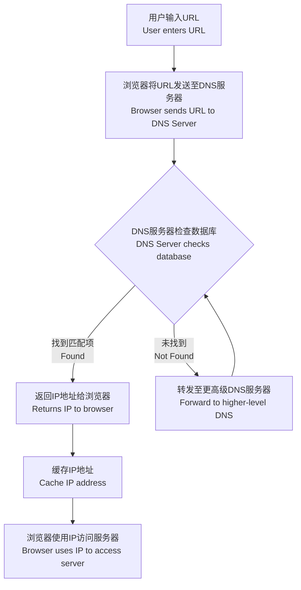
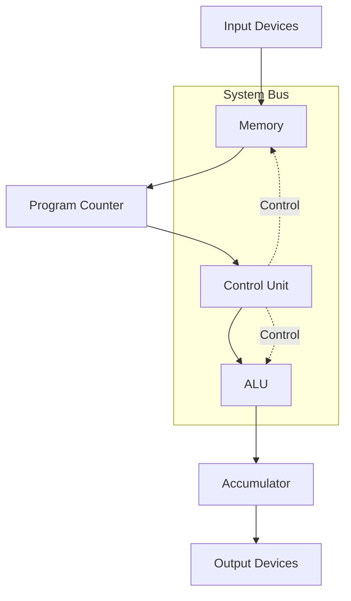

# 附录
---

### **1. 二进制转十进制 (Binary to Decimal)**  
**方法**:  
1. 从右到左，给每一位数字标上位置编号，最右边是第0位，依次向左递增。  
2. 每一位数字乘以 \( 2 \) 的“位置编号次方”，然后把所有结果加起来。

**例子**:  
二进制 \( 1101 \) 转十进制：  
- 从右到左标位置：  
  \( 1(第3位), 1(第2位), 0(第1位), 1(第0位) \)。  
- 计算：  
  \[
  1 \cdot 2^3 + 1 \cdot 2^2 + 0 \cdot 2^1 + 1 \cdot 2^0 = 8 + 4 + 0 + 1 = 13
  \]  
  **结果**: \( 1101_2 = 13_{10} \)。

---

### **2. 十进制转十六进制 (Decimal to Hexadecimal)**  
**方法**:  

1. 用 16 去“除”十进制数，把“余数”记下来。  
2. 再用 16 去除“商”，继续记余数，直到商变成 0。  
3. 把所有余数“倒过来”写，就是十六进制数。  

**例子**:  
十进制 \( 255 \) 转十六进制：  
- 第一次：\( 255 \div 16 = 15 \) 余 \( 15 (F) \)。  
- 第二次：\( 15 \div 16 = 0 \) 余 \( 15 (F) \)。  
- 把余数倒过来写：\( FF \)。  
**结果**: \( 255_{10} = FF_{16} \)。

---

### **3. 十六进制转十进制 (Hexadecimal to Decimal)**   
**方法**:  
1. 把十六进制的每一位数字从右到左标上位置编号，最右边是第0位，依次向左递增。  
2. 每一位数字乘以 \( 16 \) 的“位置编号次方”，然后加起来。  
3. 注意：十六进制的字母要换成数字：\( A=10, B=11, C=12, D=13, E=14, F=15 \)。

**例子**:  
十六进制 \( 1F \) 转十进制：  
- 从右到左标位置：  
  \( 1(第1位), F(第0位) \)。  
- 计算：  
  \[
  1 \cdot 16^1 + 15 \cdot 16^0 = 16 + 15 = 31
  \]  
  **结果**: \( 1F_{16} = 31_{10} \)。

---

### **4. 十进制转二进制 (Decimal to Binary)**  
**方法**:  
1. 用 2 去“除”十进制数，把“余数”记下来。  
2. 再用 2 去除“商”，继续记余数，直到商变成 0。  
3. 把所有余数“倒过来”写，就是二进制数。

**例子**:  
十进制 \( 13 \) 转二进制：  
- 第一次：\( 13 \div 2 = 6 \) 余 \( 1 \)。  
- 第二次：\( 6 \div 2 = 3 \) 余 \( 0 \)。  
- 第三次：\( 3 \div 2 = 1 \) 余 \( 1 \)。  
- 第四次：\( 1 \div 2 = 0 \) 余 \( 1 \)。  
- 把余数倒过来写：\( 1101 \)。  
**结果**: \( 13_{10} = 1101_2 \)。

---

### **5. 进制转换总结 (Cheat Sheet)**

#### **简单记住这些规则：**
- **二进制 → 十进制**：  
  每一位乘以 \( 2 \) 的次方，加起来。  
  **例子**：\( 1101_2 = 8 + 4 + 0 + 1 = 13_{10} \)。

- **十进制 → 十六进制**：  
  用 16 除，不断取余数，倒过来写。  
  **例子**：\( 255_{10} = FF_{16} \)。

- **十六进制 → 十进制**：  
  每一位乘以 \( 16 \) 的次方，加起来。  
  **例子**：\( 1F_{16} = 16 + 15 = 31_{10} \)。

- **十进制 → 二进制**：  
  用 2 除，不断取余数，倒过来写。  
  **例子**：\( 13_{10} = 1101_2 \)。


# 第一单元

## **1. 数字表示系统 (Number Representation Systems)**

### **1.1 二进制系统 (Binary System)**

- **定义 (Definition)**：
  - 二进制是基于0和1的数字系统，使用两个数值表示信息。(Binary is a number system based on the values 0 and 1.)
  - 它是计算机存储和处理数据的基础。(It is the fundamental number system used in computers for storing and processing data.)

---

### **1.2 比特 (Bit)**

- **定义 (Definition)**：
  - 比特是二进制系统中的最小信息单位，可以是0或1。(A bit is the smallest unit of information in the binary system, represented as either a 0 or 1.)

- **常用单位 (Common Units)**：
  - **Kib (Kibibit)**: \(2^{10}\) (1024 bits)
  - **Mib (Mebibit)**: \(2^{20}\) (1,048,576 bits)
  - **Gib (Gibibit)**: \(2^{30}\) (1,073,741,824 bits)

---

### **1.3 补码系统 (Complement Representation)**

1. **一补码 (One's Complement)**:
   - 一补码通过反转二进制位来表示负数。(One’s complement represents negative numbers by flipping the binary digits [0 becomes 1, and 1 becomes 0].)
   - 例如：对于4位二进制数，正数5表示为`0101`，负数-5的一补码为`1010`。(Example: For a 4-bit binary number, positive 5 is `0101`, and the one’s complement of -5 is `1010`.)

2. **二补码 (Two's Complement)**:
   - 在一补码的基础上最右位加1来表示负数。(Two’s complement is created by taking the one’s complement and adding 1 to the least significant bit.)
   - 例如：对于负数-5，二补码为`1011`。(Example: For -5, the two’s complement is `1011`.)

---

### **1.4 二进制编码十进制 (Binary-Coded Decimal, BCD)**

- 用4位二进制表示一个十进制数字。(BCD uses 4 binary bits to represent each decimal digit.)
- 例如：十进制数字“259”用BCD表示为`0010 0101 1001`。(For example, the decimal number “259” is represented as `0010 0101 1001` in BCD.)

---

### **1.5 溢出 (Overflow)**

- 当计算结果超出存储位数限制时，发生溢出。(Overflow occurs when a calculation produces a result too large to fit into the defined number of bits for storage.)
- 例如：对于4位二进制数，`1111`加1会导致溢出。(Example: For a 4-bit binary number, adding 1 to `1111` causes overflow.)

---

### **1.6 字符集 (Character Sets)**

1. **ASCII**：
   - 支持英语字符，使用7或8位表示。(Used for English characters, represented using 7 or 8 bits.)
   - 例如：字母“A”的ASCII码是`01000001`。(For example, the letter “A” is represented as `01000001` in ASCII.)

2. **Unicode**：
   - 支持世界大多数语言字符，使用最多4字节表示。(Supports most languages worldwide, using up to 4 bytes per character.)
   - 与ASCII相比，Unicode覆盖的字符范围更广。(Compared to ASCII, Unicode has a much larger range of characters.)

---

## **2. 图像处理技术 (Image Processing Techniques)**

### **2.1 位图压缩技术 (Bitmap Compression Techniques)**

1. **无损压缩 (Lossless Compression)**：
   - 数据不会丢失，文件可以完整恢复。(No data is lost, and the file can be fully restored.)
   
   - 使用"游程编码 (Run-length Encoding)"存储连续的相同颜色像素数量。(Uses run-length encoding to store sequences of the same color pixels.)

   - 适用于JPEG和GIF文件格式。(Used in JPEG and GIF file formats.)
   
     Run-length encoding\compression in which sequences with same data value in many consecutive
   
     values are stored as a single data value and count
   
2. **有损压缩 (Lossy Compression)**：
   
   - 会丢失部分细节，但文件体积更小。(Some details are lost, but the file size is significantly reduced.)
   
   - 适用于对文件大小要求高的场景。(Used in scenarios where file size is more important than image detail.)
   
     

---

### **2.2 位图图像 (Bitmap Images)**

- **像素 (Pixel)**：构成图像的最小单元。(The smallest unit that makes up an image.)
- **颜色深度 (Colour Depth)**：
  - 每像素颜色的数据位数。(The number of bits used to represent the color of a single pixel.)
  - 例如：8位颜色深度支持256种颜色。(For example, an 8-bit color depth supports 256 colors.)
- **图像分辨率 (Image Resolution)**：
  - 图像的总像素数，例如4096×3192。(The total number of pixels in an image, e.g., 4096×3192.)

---

### **2.3 矢量图形 (Vector Graphics)**

- **定义 (Definition)**：
  - 使用数学公式和几何形状（线条、曲线）描述图像。(Vector graphics describe images using mathematical formulas for shapes like lines and curves.)
- **特点 (Features)**：
  - 可无限缩放且不失真。(Scalable without losing quality.)
  - 文件通常较小。(Files are usually smaller.)
- **常见格式 (Common Formats)**：
  - .svg, .cgm, .odg

---

### **2.4 位图与矢量图对比 (Bitmap vs Vector Graphics)**

| **矢量图 (Vector Graphics)**                | **位图 (Bitmap Images)**               |
| ------------------------------------------- | -------------------------------------- |
| 使用几何形状构成 (Made of geometric shapes) | 使用像素构成 (Made of pixels)          |
| 可无限缩放 (Infinitely scalable)            | 缩放会失真 (Scaling causes distortion) |
| 文件小 (Smaller file size)                  | 文件大 (Larger file size)              |
| 常用于标志设计 (Used for logos)             | 常用于照片 (Used for photos)           |

---

## **3. 声音处理 (Sound Processing)**

### **3.1 采样分辨率 (Sampling Resolution)**

- 定义：表示声音振幅的位数，也称为位深度。(The number of bits used to represent the amplitude of sound, also known as bit depth.)
- 位数越高，声音质量越好。(Higher bit depth provides better sound quality.)

---

### **3.2 采样率 (Sampling Rate)**

- 定义：每秒采集的声音样本数量。(The number of audio samples taken per second.)
- 采样率越高，声音越接近真实。(Higher sampling rates produce sound closer to the original.)

---

### **3.3 模拟到数字转换 (Analog-to-Digital Conversion)**

1. **步骤 (Steps)**：
   - 测量声波振幅 (Measure the amplitude of the sound wave.)
   - 在固定时间间隔采样 (Sample at regular time intervals.)
   - 将样本值转换为二进制数据 (Convert the sample values to binary data.)
2. **关键点 (Key Points)**：
   - 采样分辨率决定精度 (Sampling resolution determines precision.)
   - 采样率影响声音的还原质量 (Sampling rate affects the sound quality.)
   - 文件大小与质量直接相关 (File size is proportional to quality.)

# 第二单元


## **1. 网络类型 (Network Types)**

### **定义 (Definitions)**

- **LAN (Local Area Network 局域网)**:  
  A network that connects computers and devices in a small geographic area, such as a home, school, or office building.  
  在小范围内（如家庭、学校或办公楼）连接计算机和设备的网络。

- **WAN (Wide Area Network 广域网)**:  
  A network that connects multiple LANs over a large geographic area, such as cities or countries, often using leased telecommunication lines.  
  跨越大范围（如城市或国家）连接多个局域网的网络，通常使用租用的通信线路。

### **对比 (Comparison)**

| **特性 (Feature)**   | **LAN (局域网)**                          | **WAN (广域网)**                          |
|-----------------------|------------------------------------------|------------------------------------------|
| **覆盖范围 (Coverage)**  | 单一位置/建筑物 (Single location/building) | 多个位置/城市 (Multiple locations/cities) |
| **速度 (Speed)**       | 较快 (Faster, up to 10 Gbps)            | 较慢 (Slower, varies)                    |
| **成本 (Cost)**        | 较低 (Lower setup & maintenance)        | 较高 (Higher setup & maintenance)        |
| **基础设施 (Infrastructure)** | 由组织所有 (Owned by organization)      | 通常租用 (Often leased)                  |
| **管理 (Management)**  | 易于管理 (Easier to manage)             | 更复杂 (More complex management)         |
| **带宽 (Bandwidth)**   | 高带宽 (Higher bandwidth)               | 低带宽 (Lower bandwidth)                 |

---

## **2. 网络模型 (Network Models)**

### **定义 (Definitions)**

- **Client-Server 模型**:  
  A centralized model where a server provides resources, services, or data to multiple clients.  
  一个中心化的模型，服务器向多个客户端提供资源、服务或数据。

- **Peer-to-Peer 模型 (P2P)**:  
  A decentralized model where devices (peers) share resources and communicate directly without a central server.  
  一个去中心化的模型，设备（节点）直接共享资源和通信，无需中央服务器。

### **对比 (Comparison)**

| **方面 (Aspect)**      | **Client-Server 模型**                  | **Peer-to-Peer 模型**                    |
|-------------------------|----------------------------------------|------------------------------------------|
| **结构 (Structure)**    | 集中化 (Centralized)                  | 分散式 (Decentralized)                   |
| **资源 (Resources)**    | 由服务器管理 (Managed by server)       | 由各节点共享 (Shared among peers)        |
| **安全性 (Security)**    | 更高的安全控制 (Higher security control) | 较低的安全控制 (Lower security control)  |
| **成本 (Cost)**         | 更高 (服务器成本高) (Higher, server costs) | 更低 (No dedicated server)               |
| **可扩展性 (Scalability)**| 适合大型网络 (Better for large networks) | 适合小型网络 (Better for small networks) |
| **维护 (Maintenance)**  | 需要专业维护 (Professional maintenance needed) | 自行维护 (Self-maintained)              |
| **备份 (Backup)**       | 集中备份 (Centralized backup)          | 个体备份 (Individual backups)            |
| **性能 (Performance)**  | 一致性高 (Consistent)                 | 性能可能波动 (Can vary)                  |

---

## **3. 网络拓扑 (Network Topologies)**

### **定义 (Definitions)**

- **Star Topology (星型拓扑)**:  
  Devices are connected to a central node, such as a hub or switch.  
  设备连接到中心节点，如集线器或交换机。

- **Bus Topology (总线拓扑)**:  
  All devices are connected to a single cable (backbone).  
  所有设备通过单一主干线连接。

- **Ring Topology (环形拓扑)**:  
  Devices are connected in a circular arrangement, with data flowing in one or both directions.  
  设备以环形连接，数据可以单向或双向流动。

- **Mesh Topology (网状拓扑)**:  
  Each device is connected to every other device for high redundancy.  
  每个设备与其他设备直接连接，形成高冗余网络。

### **图示与比较 (Diagrams and Comparison)**

#### **星型拓扑 (Star Topology)**  

```
         [Central Node]
             / | | \
            /  | |  \
 [Device 1] [Device 2] [Device 3] [Device 4]
```

#### **总线拓扑 (Bus Topology)**  

```
[Device 1]---[Device 2]---[Device 3]---[Device 4]
```

#### **环形拓扑 (Ring Topology)**  

```
          [Device 1]
        ↗         ↖
   [Device 2]     [Device 4]
        ↘         ↗
          [Device 3]
```

#### **网状拓扑 (Mesh Topology)**  

```
       [Device 1]
       /   |   \
  [Device 2]---[Device 3]
       \   |   /
       [Device 4]
```

| **拓扑类型<br>(Topology Type)** | **优点 (Advantages)** | **缺点 (Disadvantages)** | **适用场景 (Use Cases)** |
|--------------------------------|---------------------|------------------------|------------------------|
| **星型 (Star)** | 易于管理和维护 (Easy management)<br>单点故障可隔离 (Fault isolation) | 中央节点故障影响全网 (Central node failure affects all) | 家庭网络、企业网络 (Home, enterprise networks) |
| **总线 (Bus)** | 布线简单，成本低 (Simple wiring, low cost) | 故障排查困难，网络拥堵 (Hard troubleshooting, congestion) | 小型办公室 (Small offices) |
| **环形 (Ring)** | 性能稳定，无中心节点 (Stable, no central node) | 单点故障影响全网 (Single point failure) | 工业网络 (Industrial networks) |
| **网状 (Mesh)** | 高可靠性，数据可多路径传输 (Reliability, multipath data) | 成本高，维护复杂 (Expensive, complex) | 军事网络、大型企业网络 (Military, large enterprise networks) |

---

## **4. 云计算 (Cloud Computing)**

### **定义 (Definition)**

- **Cloud Computing (云计算)**:  
  A model that enables on-demand access to a shared pool of computing resources, such as servers, storage, and applications, over the internet.  
  云计算是一种通过互联网按需访问共享计算资源（如服务器、存储和应用程序）的模型。

### **优点和缺点 (Advantages and Disadvantages)**

| **优点 (Advantages)**                         | **缺点 (Disadvantages)**                   |
|-----------------------------------------------|--------------------------------------------|
| 可扩展性强 (Scalability)                      | 依赖网络连接 (Internet dependency)         |
| 成本效益高 (Cost-effective)                   | 安全隐患 (Security concerns)               |
| 随时随地访问 (Accessible anywhere)            | 数据控制有限 (Limited control)             |
| 自动更新 (Automatic updates)                  | 潜在停机风险 (Potential downtime)          |
| 灾难恢复 (Disaster recovery)                  | 持续费用 (Ongoing costs)                   |

---

## **5. 网络硬件设备 (Network Hardware)**

| **设备 (Device)**      | **主要功能 (Primary Function)**        | **使用场景 (Use Case)**                   |
|-------------------------|----------------------------------------|------------------------------------------|
| **路由器 (Router)**     | 在网络间路由数据 (Routes data between networks) | 连接不同网络 (Connecting different networks) |
| **网关 (Gateway)**      | 协议转换 (Protocol conversion)         | 连接不兼容网络 (Connecting dissimilar networks) |
| **交换机 (Switch)**     | 连接局域网设备 (Connects devices in LAN) | 本地网络连接 (Local network connectivity) |
| **集线器 (Hub)**        | 基础网络连接 (Basic connectivity)      | 简单网络扩展 (Simple network expansion)   |
| **调制解调器 (Modem)**   | 信号转换 (Signal conversion)           | 提供互联网连接 (Internet connectivity)   |
| **网络接口卡 (NIC)**    | 网络接口 (Network interface)           | 设备连接 (Device connectivity)           |

---

## **6. 流媒体类型 (Streaming Types)**

| **类型 (Type)**          | **实时流 (Real-time Streaming)**                  | **点播流 (On-demand Streaming)**               |
|--------------------------|------------------------------------------------|-----------------------------------------------|
| **时间 (Timing)**         | 实时 (Live)                                    | 预录 (Pre-recorded)                            |
| **播放控制 (Playback)**    | 无法暂停或回放 (No controls)                   | 可暂停和回放 (Full playback control)           |
| **缓冲 (Buffer)**          | 最小缓冲 (Minimal)                            | 较大缓冲可能 (Larger buffer possible)          |
| **延迟 (Latency)**         | 非常低 (Very low)                             | 可能较高 (Can be higher)                       |
| **示例 (Examples)**        | 体育直播、网络会议 (Live sports, webcasts)     | Netflix、YouTube视频 (Netflix, YouTube videos) |

---

## **7. IP地址对比 (IP Address Comparison)**

### **IPv4 vs IPv6**

| **特性 (Feature)**       | **IPv4**                              | **IPv6**                              |
|---------------------------|----------------------------------------|---------------------------------------|
| **地址长度 (Address Length)** | 32位 (32-bit)                       | 128位 (128-bit)                       |
| **格式 (Format)**         | 十进制点分 (Decimal with dots)        | 十六进制冒号分隔 (Hexadecimal with colons) |
| **地址空间 (Address Space)**| ~43亿 (4.3 billion)                 | 极大 (340 undecillion)                |
| **安全性 (Security)**      | 基本 (Basic)                         | 更强 (Enhanced built-in security)     |
| **配置 (Configuration)**   | 手动或DHCP (Manual/DHCP)             | 自动配置可用 (Auto-configuration available) |

---

## **8. URL和DNS系统 (URL and DNS System)**

### **定义 (Definitions)**

- **URL (Uniform Resource Locator 统一资源定位符)**:  
  A URL is a reference address to locate resources on the World Wide Web (WWW).  
  URL是用于定位万维网（WWW）上资源的标准化地址。

- **DNS (Domain Name System 域名系统)**:  
  DNS resolves human-readable domain names (e.g., www.example.com) into machine-readable IP addresses.  
  DNS将人类可读的域名（如www.example.com）解析为机器可读的IP地址。
  
- **以太网 Ethernet**：
  以太网的核心是通过有线连接，以简单、高效和可靠的方式在设备之间传输数据。  
  
- The core of Ethernet is transmitting data between devices through wired connections in a simple, efficient, and reliable manner.
  

#### **DNS解析流程 (DNS Resolution Process)**



# 第三单元

## 3.1 计算机及其组件 (Computers and Their Components)

---

### 1. 通用计算机系统组成 (General-Purpose Computer System Components)
#### 组成部分 (Components)
- **处理器 (Processor)**：执行程序的核心组件。
- **内存 (Memory)**：用于存储当前运行的程序和数据。
- **输入/输出功能 (I/O Functionality)**：与外界交互的接口。

#### 系统功能 (System Functions)
- **输入 (Input)**：从外部世界获取数据 (Take in data from the outside world)。
- **输出 (Output)**：显示数据供人类理解 (Display data for human understanding)。
- **主存储 (Primary Storage)**：计算机主内存，用于存储程序和数据 (Main memory for storing programs and data)。
- **次级存储 (Secondary Storage)**：
  - **非易失性存储 (Non-volatile Storage)**：即使断电也可保留数据 (Retains data even when power is off)。
  - **可移动次级存储 (Removable Storage)**：
    - 用于文件备份与归档 (File backup and archive)。
    - 用于设备间传输文件 (Portable transfer of files between devices)。

---

### 2. 嵌入式系统 (Embedded Systems)
#### 定义 (Definition)
- 小型计算机系统，通常是更大系统的一部分 (Small computer systems, often part of a larger system)。

#### 特点 (Features)
- 每个嵌入式系统执行特定功能 (Each embedded system performs specific functions)。

#### 优缺点对比 (Advantages and Disadvantages)

| **优势 (Advantages)**             | **缺点 (Disadvantages)**                  |
|----------------------------------|-----------------------------------------|
| 可靠性高，无移动部件 (Reliable with no moving parts) | 编程困难 (Difficult to program)            |
| 功耗低 (Consumes less power)      | 维修需要专业知识 (Repairs require expert knowledge) |
| 成本低 (Low-cost mass production) | 功能有限 (Limited functionality)         |

---

### 3. 硬件设备原理和操作 (Hardware Devices: Principles and Operations)

#### 3.1 激光打印机 (Laser Printer)
##### 工作原理 (Principle of Operation)
1. 使用激光束和旋转镜在感光鼓上绘制图像 (Laser beam and rotating mirrors draw an image on a photosensitive drum)。
2. 图像被转化为电荷，吸附墨粉 (The image is converted into electric charge, attracting charged toner)。
3. 纸张经过感光鼓，转移图像 (Paper is rolled against the drum to transfer the image)。
4. 加热装置将墨粉定影到纸张上 (Heat is applied to fuse toner onto the paper)。
5. 清除多余墨粉 (Excess toner is removed)。

---

#### 3.2 3D打印机 (3D Printer)
##### 工作流程 (Workflow)
1. 从数字文件开始 (Process starts with a saved digital file)。
2. 使用分层技术逐层添加材料 (The object is built layer-by-layer, adding material such as polymer resin)。
3. 每一层被固化直到物体完成 (Each layer is cured until the object is created)。

---

#### 3.3 麦克风 (Microphone)
##### 工作原理 (Principle of Operation)
- 声波进入防风罩并振动振膜 (Incoming sound waves enter the windscreen and cause the diaphragm to vibrate)。
- 振动导致线圈通过磁芯产生电流 (The vibration causes a coil to move past a magnetic core, generating an electrical current)。
- 电信号被数字化 (The electrical signal is digitized)。

---

#### 3.4 扬声器 (Speaker)
##### 工作原理 (Principle of Operation)
- 将电信号转化为物理振动，产生声波 (Converts electrical signals into physical vibrations, creating sound waves)。
- 振动通过空气传播形成声音 (The vibrations are transmitted through air to produce sound)。

---

### 4. 存储设备 (Storage Devices)

#### 4.1 磁盘驱动器 (Hard Disk Drive, HDD)
##### 工作原理 (Principle of Operation)
- 磁性盘片存储数据 (Platters with magnetic surfaces store data)。
- 数据通过磁头读取和写入 (Data is accessed via read/write heads)。
- 磁场变化实现数据存储和读取 (Magnetic field variations encode and retrieve data)。

---

#### 4.2 固态存储器 (Solid-State Drive, SSD)
##### 工作原理 (Principle of Operation)
- 使用NAND闪存存储数据 (Uses NAND-based flash memory)。
- 数据存储在浮栅晶体管中 (Data is stored in floating-gate transistors)。
- 无移动部件，速度更快 (No moving parts, faster data access)。

---

#### 4.3 光盘驱动器 (Optical Disc Drive)
##### 工作原理 (Principle of Operation)
- 通过激光束读取或写入数据 (Uses laser beams to read or write data)。
- 数据以晶态和非晶态形式存储 (Data is stored in crystalline and amorphous states)。

---

### 5. 触摸屏 (Touchscreen Technology)

| **类型 (Type)**                 | **电阻式 (Resistive)**                     | **电容式 (Capacitive)**                   |
|--------------------------------|------------------------------------------|------------------------------------------|
| **工作原理 (Working Principle)** | 压力使两层接触形成电路 (Pressure causes conductive layers to touch, completing circuit) | 通过人体触摸引起电容变化 (Detects changes in capacitance caused by human touch) |
| **操作方式 (Operation)**         | 需要施加压力 (Requires pressing)             | 轻触即可 (Works with a light touch)       |
| **支持多点触控 (Multi-Touch Support)** | 不支持 (Not Supported)                      | 支持 (Supported)                          |

---

### 6. 虚拟现实头显 (Virtual Reality Headset)
#### 组成部分 (Components)
- **镜头和显示屏 (Lenses and Screens)**：用于显示3D环境。
- **传感器 (Sensors)**：检测头部运动和方向。
- **控制器 (Controllers)**：与虚拟环境交互。

#### 特点 (Features)
- 提供沉浸式3D体验 (Provides an immersive 3D experience)。
- 通过设备的图形处理单元实时渲染图像 (Renders images in real time using the device's GPU)。

---

### 7. 缓冲区 (Buffer)
#### 定义 (Definition)
- 临时存储区域，用于在不同速度的设备之间传输数据 (Temporary storage area used to transfer data between devices operating at different speeds)。

#### 功能 (Functions)
- 确保数据流的连续性 (Ensures continuous data flow)。
- 防止数据丢失 (Prevents data loss)。

---

### 8. RAM 和 ROM 对比 (RAM vs ROM)

| **特性 (Feature)**              | **RAM**                           | **ROM**                          |
|--------------------------------|----------------------------------|----------------------------------|
| **数据保持 (Data Retention)**   | 易失性，断电丢失 (Volatile: loses data when power is off) | 非易失性，断电后保持 (Non-volatile: retains data when power is off) |
| **读写特性 (Access)**            | 可读可写 (Read and write)          | 只读 (Read-only)                 |
| **主要用途 (Usage)**             | 暂时存储程序和数据 (Temporary storage for programs and data) | 存储启动指令和固件 (Stores boot instructions and firmware) |

---

### 9. 监控与控制系统 (Monitoring and Control Systems)

#### 定义 (Definition)
- 调节设备或其他系统的行为 (Regulates the behavior of devices or systems)。

#### 分类 (Types of Control Systems)
1. **事件驱动系统 (Event-Driven System)**：
   - 基于事件改变系统状态 (Alters the system state based on events)。
2. **时间驱动系统 (Time-Driven System)**：
   - 在特定时间点执行操作 (Takes action at specific points in time)。

#### 硬件组成 (Hardware Components)
- **传感器 (Sensors)**：
  - 测量物理或环境属性 (Measures physical or environmental properties)。
- **执行器 (Actuators)**：
  - 执行机械动作 (Performs mechanical actions)。
- **信号传输电缆 (Transmission Cables)**：
  - 传递信号 (Transfers signals between components)。

#### 反馈系统 (Feedback Systems)
- 系统输出会影响输入 (System output affects input)。
- 自动调整操作 (Automatically adjusts operations based on feedback)。
- 实现连续的调整 (Enables continuous adjustments)。
## 3.2 逻辑门和逻辑电路 (Logic Gates and Logic Circuits)

---

### 3.2.1 基本逻辑门符号和功能

#### 3.2.1.1 AND 门 (与门)
- **功能**: 当且仅当**所有输入都为1**时，输出为1。
- **布尔表达式**: Y = A·B
- **真值表**:

| **A** | **B** | **Y (A·B)** |
|-------|-------|-------------|
|   0   |   0   |      0      |
|   0   |   1   |      0      |
|   1   |   0   |      0      |
|   1   |   1   |      1      |

- **ASCII 符号**:
```
        _______
 A ----|       |
       |  AND  |---- Y
 B ----|_______|
```

---

#### 3.2.1.2 OR 门 (或门)
- **功能**: 当**任意输入为1**时，输出为1。
- **布尔表达式**: Y = A + B
- **真值表**:

| **A** | **B** | **Y (A+B)** |
|-------|-------|-------------|
|   0   |   0   |      0      |
|   0   |   1   |      1      |
|   1   |   0   |      1      |
|   1   |   1   |      1      |

- **ASCII 符号**:
```
        _______
 A ----|       |
       |   OR  |---- Y
 B ----|_______|
```

---

#### 3.2.1.3 NOT 门 (非门)
- **功能**: 对输入取反，输入为1时输出为0，输入为0时输出为1。
- **布尔表达式**: Y = A'
- **真值表**:

| **A** | **Y (A')** |
|-------|------------|
|   0   |     1      |
|   1   |     0      |

- **ASCII 符号**:
```
        _______
 A ----|       |
       |  NOT  |---- Y
      |_______|
```

---

#### 3.2.1.4 NAND 门 (与非门)
- **功能**: AND门的输出取反，**当所有输入都为1时，输出为0**，否则输出为1。
- **布尔表达式**: Y = (A·B)'
- **真值表**:

| **A** | **B** | **Y (A·B')** |
|-------|-------|--------------|
|   0   |   0   |      1       |
|   0   |   1   |      1       |
|   1   |   0   |      1       |
|   1   |   1   |      0       |

- **ASCII 符号**:
```
        _______
 A ----|       |
       |  NAND |---- Y
 B ----|_______|
```

---

#### 3.2.1.5 NOR 门 (或非门)
- **功能**: OR门的输出取反，**当所有输入都为0时，输出为1**，否则输出为0。
- **布尔表达式**: Y = (A+B)'
- **真值表**:

| **A** | **B** | **Y (A+B')** |
|-------|-------|--------------|
|   0   |   0   |      1       |
|   0   |   1   |      0       |
|   1   |   0   |      0       |
|   1   |   1   |      0       |

- **ASCII 符号**:
```
        _______
 A ----|       |
       |  NOR  |---- Y
 B ----|_______|
```

---

#### 3.2.1.6 XOR 门 (异或门)
- **功能**: 当**两个输入不同**时，输出为1；否则输出为0。
- **布尔表达式**: Y = A⊕B
- **真值表**:

| **A** | **B** | **Y (A⊕B)** |
|-------|-------|-------------|
|   0   |   0   |      0      |
|   0   |   1   |      1      |
|   1   |   0   |      1      |
|   1   |   1   |      0      |

- **ASCII 符号**:
```
        _______
 A ----|       |
       |  XOR  |---- Y
 B ----|_______|
```

---

### 3.2.2 真值表总结

| **A** | **B** | **AND (A·B)** | **OR (A+B)** | **NAND (A·B')** | **NOR (A+B')** | **XOR (A⊕B)** |
|-------|-------|---------------|--------------|-----------------|----------------|---------------|
|   0   |   0   |       0       |      0       |        1        |       1        |       0       |
|   0   |   1   |       0       |      1       |        1        |       0        |       1       |
|   1   |   0   |       0       |      1       |        1        |       0        |       1       |
|   1   |   1   |       1       |      1       |        0        |       0        |       0       |

NOT门真值表：

| **A** | **Y (A')** |
|-------|------------|
|   0   |     1      |
|   1   |     0      |

---

### 3.2.3 重要特性

- **NAND门**和**NOR门**是通用门，可以构建所有其他逻辑门。
- 每种逻辑门都有明确的输入与输出规则，通过真值表表示逻辑关系。
- 逻辑门是数字电路的基本单元，可用于构建复杂电路。

以下是重新整理和总结的完整内容，涵盖 **4. Processor Fundamentals (处理器基础)** 的所有章节，并以更加清晰、系统的方式呈现。

---

# 第四单元


---

## 4.1 Central Processing Unit Architecture (中央处理器架构)

中央处理器（CPU）是计算机的核心部件，主要负责执行指令和控制其他硬件组件。以下是 CPU 的主要架构和组成部分：

### 4.1.1 Von Neumann Model (冯·诺依曼模型)

#### 核心理念 (Core Concepts)
冯·诺依曼架构是现代计算机的基础模型，其特点包括：
1. **统一存储器 (Unified Memory)**：数据和指令存储在同一内存中。
2. **顺序执行 (Sequential Execution)**：程序按照“提取 (Fetch)、解码 (Decode)、执行 (Execute)”的顺序执行。
3. **存储器瓶颈 (Memory Bottleneck)**：数据和指令共用内存，可能导致冲突。

#### 流程图 (Flow Chart)


#### 系统组件及功能 (System Components and Functions)
1. **输入设备 (Input Devices)**  
   接收外部数据并传输到内存。  
   *Receives external data and transfers it to memory.*

2. **内存 (Memory)**  
   存储数据和指令，包括指令部分和数据部分。  
   *Stores data and instructions, including instruction and data sections.*

3. **程序计数器 (Program Counter, PC)**  
   指向要执行的下一条指令的内存地址，执行后自动递增。  
   *Points to the memory address of the next instruction and automatically increments after execution.*

4. **控制单元 (Control Unit, CU)**  
   提取、解码并执行指令，负责协调系统组件的操作。  
   *Fetches, decodes, and executes instructions, and coordinates system component operations.*

5. **算术逻辑单元 (Arithmetic Logic Unit, ALU)**  
   执行算术运算（加、减、乘、除）和逻辑运算（与、或、非等）。  
   *Performs arithmetic operations (addition, subtraction, multiplication, division) and logical operations (AND, OR, NOT, etc.).*

6. **累加器 (Accumulator, ACC)**  
   存储运算结果，以便进一步处理或输出。  
   *Stores the results of operations for further processing or output.*

7. **输出设备 (Output Devices)**  
   将处理后的数据传递给用户（如显示器或打印机）。  
   *Delivers processed data to the user (e.g., monitor or printer).*

---

### 4.1.2 寄存器系统 (Register System)

寄存器是处理器中速度最快的存储单元，用于临时存储指令和数据。寄存器分为以下两类：

#### 通用寄存器 (General Purpose Registers)
- 用于存储临时数据或操作结果。
- 可通过汇编语言直接访问。

#### 特殊寄存器 (Special Purpose Registers)
1. **程序计数器 (Program Counter, PC)**  
   存储下一条要执行指令的地址。  

2. **内存数据寄存器 (Memory Data Register, MDR)**  
   存储从内存读取或写入的数据。  

3. **内存地址寄存器 (Memory Address Register, MAR)**  
   存储当前要访问的内存地址。  

4. **累加器 (Accumulator, ACC)**  
   存储算术逻辑单元的结果，用于进一步运算或输出。  

5. **状态寄存器 (Status Register)**  
   存储运算结果的状态（如零标志、进位标志等）。

---

### 4.1.3 总线系统 (Bus System)

总线是连接 CPU、内存和外设的通信通道，分为以下三种：
1. **数据总线 (Data Bus)**：传输数据，双向通信。  
2. **地址总线 (Address Bus)**：传输内存地址，单向通信。  
3. **控制总线 (Control Bus)**：传输控制信号，用于协调系统组件。

---

## 4.2 Assembly Language (汇编语言)

汇编语言是低级编程语言，使用助记符表示机器指令，便于人类阅读和编写。

### 4.2.1 基本概念 (Basic Concepts)
- 汇编语言与机器硬件紧密相关，每条指令对应一条机器码。
- 汇编器 (Assembler) 将汇编代码翻译为机器码。

---

### 4.2.2 指令集分类 (Instruction Set Categories)

| **类别 (Category)**      | **指令 (Instruction)** | **功能 (Function)**                                                                                      | **说明 (Description)**                                                                                      |
|---------------------------|------------------------|----------------------------------------------------------------------------------------------------------|-------------------------------------------------------------------------------------------------------------|
| **数据移动 (Data Movement)** | **LDA**                | 加载数据到累加器 (Load data into the accumulator)                                                        | 从内存加载数据到累加器 (Loads data from memory into the accumulator)                                        |
|                           | **STO**               | 将累加器中的数据存储到内存 (Store data from the accumulator into memory)                                  | 将累加器中的值存储到指定内存地址 (Stores the value from the accumulator into a specified memory location)  |
| **算术运算 (Arithmetic)** | **ADD**                | 将数据加到累加器中 (Add data to the accumulator)                                                         | 将指定数据加到累加器的当前值 (Adds specified data to the current value in the accumulator)                 |
|                           | **SUB**               | 从累加器中减去数据 (Subtract data from the accumulator)                                                  | 将指定数据从累加器的当前值中减去 (Subtracts specified data from the current value in the accumulator)      |
| **跳转 (Jump)**           | **JMP**                | 无条件跳转 (Unconditional jump)                                                                         | 无条件跳转到指定的内存地址 (Jumps unconditionally to a specified memory address)                          |
|                           | **JPZ**               | 如果累加器为零则跳转 (Jump if the accumulator is zero)                                                   | 如果累加器值为 0，则跳转到指定的内存地址 (Jumps to a specified memory address if the accumulator is zero)  |
| **输入/输出 (Input/Output)** | **IN**                 | 从输入设备接收数据 (Receive data from input devices)                                                     | 从指定的输入设备将数据加载到累加器 (Loads data into the accumulator from a specified input device)         |
|                           | **OUT**               | 将数据发送到输出设备 (Send data to output devices)                                                      | 将累加器中的数据发送到指定的输出设备 (Sends data from the accumulator to a specified output device)        |

---

## 4.3 Bit Manipulation (位操作)

位操作是处理器直接操作二进制位的基本功能，主要包括移位操作和按位操作。

### 4.3.1 移位操作 (Shift Operations)
1. **左移 (Left Shift, LSL)**  
   左移将每个位向左移一位，右侧补零，相当于乘以 2。  
   **例子**: `x = 5 (00000101)` → `x << 1 = 10 (00001010)`  

2. **右移 (Right Shift, LSR)**  
   右移将每个位向右移一位，左侧补零，相当于除以 2。  
   **例子**: `x = 20 (00010100)` → `x >> 2 = 5 (00000101)`  

3. **算术右移 (Arithmetic Right Shift)**  
   保留符号位的右移操作，用于带符号数的运算。  
   **例子**: `x = -8 (11111000)` → `x >> 2 = -2 (11111110)`  

---

### 4.3.2 按位操作 (Bit Operations)
1. **与操作 (AND)**  
   `x & y`：仅当对应位都为 1 时结果为 1。  
   **例子**: `x = 6 (00000110)`，`y = 3 (00000011)` → `x & y = 2 (00000010)`  

2. **或操作 (OR)**  
   `x | y`：只要对应位有一个为 1，结果为 1。  
   **例子**: `x = 6 (00000110)`，`y = 3 (00000011)` → `x | y = 7 (00000111)`  

3. **异或操作 (XOR)**  
   `x ^ y`：当对应位不同（一个为 1，一个为 0）时结果为 1。  
   **例子**: `x = 6 (00000110)`，`y = 3 (00000011)` → `x ^ y = 5 (00000101)`  

4. **非操作 (NOT)**  
   `~x`：将所有位取反。  
   **例子**: `x = 6 (00000110)` → `~x = -7 (11111001)`  

---

### 4.3.3 特殊位操作 (Special Bit Operations)
1. 检查某一位是否为 1：`(x & (1 << n)) != 0`  
2. 设置某一位为 1：`x | (1 << n)`  
3. 清除某一位：`x & ~(1 << n)`  
4. 翻转某一位：`x ^ (1 << n)`  

**例子**:  
- `x = 5 (00000101)`，设置第 1 位为 1：`x | (1 << 1)` → `x = 7 (00000111)`  

# 第五单元

### **系统软件 (System Software)**

---

#### **5.1 操作系统 (Operating System)**

##### **定义 (Definition)**  
操作系统是一组在计算机后台运行的程序，用于控制计算机硬件的操作，提供用户界面，并为应用程序提供运行环境。  
(An operating system is a set of programs running in the background to control computer hardware operations, provide a user interface, and offer an environment for applications to run.)

---

##### **关键管理任务 (Key Management Tasks)**

| **任务 (Task)**                       | **定义 (Definition)**                                        | **功能 (Functions)**                                         | **示例 (Example)**                                           |
| ------------------------------------- | ------------------------------------------------------------ | ------------------------------------------------------------ | ------------------------------------------------------------ |
| **内存管理 (Memory Management)**      | 管理系统内存资源的任务，包括分配、保护和优化内存使用。<br>(Task responsible for managing system memory resources, including allocation, protection, and optimization.) | - 确保两个程序不会使用同一块内存。<br>(Ensure two programs do not use the same memory space.)<br>- 支持分页和虚拟内存以扩展内存容量。<br>(Support paging and virtual memory to extend memory capacity.) | 程序A和程序B分配不同的内存区域。<br>(Allocate separate memory for Program A and Program B.) |
| **文件管理 (File Management)**        | 负责组织、存储和访问文件的任务。<br>(Task responsible for organizing, storing, and accessing files.) | - 提供文件命名规则，确保文件名唯一。<br>(Provide file naming conventions and ensure file name uniqueness.)<br>- 维护目录结构，便于文件查找。<br>(Maintain directory structure for easier file access.) | 创建并存储文档到特定目录。<br>(Create and store a document in a specific directory.) |
| **安全管理 (Security Management)**    | 确保系统安全，管理用户访问和数据隐私的任务。<br>(Task to ensure system security, manage user access, and protect data privacy.) | - 通过用户名和密码验证用户身份。<br>(Authenticate user identity through username and password.)<br>- 防止未经授权的访问。<br>(Prevent unauthorized access.) | 登陆时输入密码。<br>(Enter a password during login.)         |
| **硬件管理 (Hardware Management)**    | 管理和控制输入、输出和外围设备的任务。<br>(Task to manage and control input, output, and peripheral devices.) | - 安装设备驱动程序，确保设备正常运行。<br>(Install device drivers to ensure devices work properly.)<br>- 处理硬件中断。<br>(Handle hardware interrupts.) | 安装打印机驱动程序以启用打印功能。<br>(Install a printer driver to enable printing.) |
| **处理器管理 (Processor Management)** | 管理CPU资源的任务，包括调度和分配。<br>(Task to manage CPU resources, including scheduling and allocation.) | - 支持多任务和多用户操作。<br>(Support multitasking and multi-user operations.)<br>- 解决进程之间的资源冲突（如轮询法）。<br>(Resolve resource conflicts between processes, e.g., round-robin method.) | 同时运行多个程序。<br>(Run multiple programs simultaneously.) |
| **自动备份 (Automatic Backup)**       | 定期复制数据以防止丢失的任务。<br>(Task to regularly copy data to prevent loss.) | - 定期备份文件以防硬盘损坏或用户误操作。<br>(Regularly back up files to prevent data loss due to hard disk failure or user error.) | 备份重要文档到云端。<br>(Back up important documents to the cloud.) |

---

#### **实用软件 (Utility Software)**

##### **定义 (Definition)**  
实用软件是辅助操作系统的工具程序，用于执行特定的维护任务，如磁盘管理和数据保护。  
(Utility software is a tool that supports the operating system by performing specific maintenance tasks such as disk management and data protection.)

| **软件类型 (Software Type)**                | **定义 (Definition)**                                        | **功能 (Functions)**                                         | **示例 (Example)**                                           |
| ------------------------------------------- | ------------------------------------------------------------ | ------------------------------------------------------------ | ------------------------------------------------------------ |
| **磁盘格式化 (Disk Formatter)**             | 准备硬盘存储数据的过程。<br>(The process of preparing a hard disk to store data.) | - 删除现有数据并划分磁盘存储区域。<br>(Delete existing data and divide disk storage areas.) | 初始化硬盘以存储文件。<br>(Initialize a hard disk for file storage.) |
| **病毒检查 (Virus Checker)**                | 检测和移除病毒的程序。<br>(A program to detect and remove viruses.) | - 检查系统中的病毒并移除。<br>(Scan for and remove viruses in the system.)<br>- 实时监控文件传输和网络活动。<br>(Monitor file transfers and network activities.) | 使用杀毒软件扫描系统。<br>(Scan the system using antivirus software.) |
| **磁盘碎片整理 (Defragmentation)**          | 重新组织磁盘上的文件存储以减少碎片化。<br>(Reorganizes file storage on the disk to reduce fragmentation.) | - 提高文件访问速度和系统性能。<br>(Improve file access speed and system performance.)<br>- 减少磁盘读写次数。<br>(Reduce disk read/write operations.) | 定期运行磁盘整理工具。<br>(Run a disk defragmentation tool regularly.) |
| **磁盘分析与修复 (Disk Analysis & Repair)** | 用于分析磁盘空间使用情况并修复错误的工具。<br>(Tools to analyze disk space usage and repair errors.) | - 显示文件和文件夹大小分布。<br>(Show size distribution of files and folders.)<br>- 修复磁盘错误，例如坏扇区。<br>(Fix disk errors, such as bad sectors.) | 检测并修复坏扇区。<br>(Detect and repair bad sectors.)       |
| **文件压缩 (File Compression)**             | 减小文件大小以节省存储和加速传输的过程。<br>(The process of reducing file size to save storage and speed up transmission.) | - 删除冗余数据以减小文件大小。<br>(Remove redundant data to reduce file size.)<br>- 提高磁盘使用效率。<br>(Improve disk usage efficiency.) | 压缩大文件为ZIP格式。<br>(Compress large files into ZIP format.) |
| **备份软件 (Backup Software)**              | 定期复制和保存数据的工具。<br>(Tools that regularly copy and save data.) | - 防止因硬件故障或错误操作导致的数据丢失。<br>(Prevent data loss due to hardware failure or user error.) | 备份数据到外部硬盘。<br>(Back up data to an external hard drive.) |

---

#### **动态链接库 (Dynamic Link Library, DLL)**

##### **定义 (Definition)**  
动态链接库是包含代码和数据的共享文件，可以被多个应用程序使用，而无需复制到每个程序中。  
(A dynamic link library is a shared file containing code and data that can be used by multiple applications without being duplicated in each program.)

##### **优点 (Advantages)**  
- **节省内存和存储空间 (Saves memory and storage space):** 共享代码减少文件冗余。  
  (Shared code reduces file redundancy.)  
- **易于更新 (Easy to update):** 只需更新一个 DLL 文件即可影响所有相关程序。  
  (Updating one DLL file affects all related programs.)  
- **模块化设计 (Modular design):** 支持程序模块化，提高开发效率。  
  (Supports program modularity, improving development efficiency.)

##### **缺点 (Disadvantages)**  
- **依赖性问题 (Dependency issues):** DLL 文件丢失或损坏可能导致程序无法运行。  
  (The loss or corruption of a DLL file may cause the program to fail.)  
- **调试复杂 (Complex to debug):** DLL 内部错误难以追踪。  
  (Errors inside DLLs are hard to trace.)  
- **版本冲突 (Version conflicts):** 不同程序可能需要不同版本的 DLL 文件。  
  (Different programs may require different versions of DLLs.)

---

#### **编译器与解释器 (Compiler & Interpreter)**

| **特性 (Feature)**          | **编译器 (Compiler)**                                        | **解释器 (Interpreter)**                                     |
| --------------------------- | ------------------------------------------------------------ | ------------------------------------------------------------ |
| **定义 (Definition)**       | 一次性将程序翻译成机器码生成可执行文件。<br>(Translates the program into machine code all at once to produce an executable file.) | 将程序逐行翻译为机器码并立即执行。<br>(Translates the program line-by-line into machine code and executes it immediately.) |
| **优点 (Advantages)**       | - 运行速度快，适合最终产品使用。<br>(Faster execution, suitable for final products.) | - 调试更容易，适合开发阶段使用。<br>(Easier to debug, suitable for development stages.) |
| **缺点 (Disadvantages)**    | - 编译耗时，需修复所有错误后才能运行。<br>(Time-consuming compilation; all errors must be fixed before execution.) | - 每次运行程序都需翻译一次，速度较慢。<br>(Each program run requires translation, leading to slower execution.) |
| **适用范围 (Applications)** | 适用于高性能需求的程序和商业软件。<br>(Suitable for high-performance requirements and commercial software.) | 适用于开发调试阶段和脚本语言。<br>(Suitable for development and debugging phases, as well as scripting languages.) |
| **示例 (Examples)**         | C、C++<br>(C, C++)                                           | Python、JavaScript<br>(Python, JavaScript)                   |

---

#### **集成开发环境 (Integrated Development Environment, IDE)**

| **功能 (Feature)**                | **定义 (Definition)**                                        | **示例 (Example)**                                           |
| --------------------------------- | ------------------------------------------------------------ | ------------------------------------------------------------ |
| **编码功能 (Coding Features)**    | 提供语法高亮、上下文提示和自动补全功能，帮助开发者快速编码。<br>(Offer syntax highlighting, context suggestions, and auto-completion to assist developers.) | 自动补全函数名。<br>(Auto-complete function names.)          |
| **错误检测 (Error Detection)**    | 在代码编写过程中自动检测并高亮显示语法错误。<br>(Automatically detect and highlight syntax errors during coding.) | 高亮未声明变量。<br>(Highlight undeclared variables.)        |
| **代码展示 (Code Presentation)**  | 提供代码折叠、自动缩进和颜色高亮功能，提高代码可读性和可维护性。<br>(Offer code folding, auto-indentation, and color highlighting for better readability and maintainability.) | 折叠函数代码块。<br>(Fold function blocks.)                  |
| **调试功能 (Debugging Features)** | 提供单步执行、断点设置和变量监控功能，帮助开发者查找和修复错误。<br>(Provide single-step execution, breakpoints, and variable monitoring to help developers find and fix errors.) | 设置断点暂停代码运行。<br>(Set breakpoints to pause code execution.) |
| **项目管理 (Project Management)** | 管理多文件项目，并支持版本控制工具（如Git）。<br>(Manage multi-file projects with support for version control tools like Git.) | 使用Git跟踪代码更改。<br>(Track code changes using Git.)     |


### **6. Ethics and Ownership 总结**

---

# 第六单元

#### **1. Ethics（伦理）**
- **定义**：伦理是一套指导行为的道德原则，基于哲学观点。  
  *(Ethics is a system of moral principles that guide behavior based on philosophical views.)*

---

#### **2. Computer Ethics（计算机伦理）**
- 调节计算机专业人士在专业和社会行为中的决策。  
  *(Regulates how computing professionals make decisions regarding professional and social conduct.)*
- 专业人士可通过加入如 **BCS** 和 **IEEE** 等道德机构获得行为指导。  
  *(Professionals can be ethically guided by joining organizations like BCS and IEEE, which provide codes of conduct.)*

---

#### **3. Ownership（所有权）**
- **数据所有权（Data Ownership）**：拥有对数据的法律权利和完全控制权。  
  *(Having legal rights and complete control over a piece or set of data elements.)*
- **版权（Copyright）**：赋予创作者控制媒体内容使用和分发方式的权利。  
  *(Gives creators rights to control how their media is used and distributed.)*
- **保护编程知识和方法（Protection of Programming Ideas and Methods）**：防止竞争者盗取创意或非法分发软件。  
  *(Protects ideas and methods from being stolen or software from being illegally copied and distributed.)*

---

#### **4. Software Licensing（软件许可）**

| **类型**                  | **特点**                                                                                                                                             |
|---------------------------|----------------------------------------------------------------------------------------------------------------------------------------------------|
| **Free Software Foundation** | - 用户可自由运行、复制、分发、研究和改进软件。<br>*(License gives users freedom to run, copy, distribute, study, and improve software.)*<br>- 修改后版本需保持免费分发。 *(Redistributed versions must remain free.)* |
| **Open Source**            | - 源代码公开供用户查看和改进。<br>*(Source code is available for users to view and improve.)*<br>- 不能随意重新分发软件。 *(Does not allow redistribution of the software.)* |
| **Shareware**              | - 免费分发的试用软件，但试用期过后用户需付费。<br>*(Demonstration software distributed for free but requires payment after a trial period.)* |
| **Commercial Software**    | - 付费软件，解锁所有功能，无限制。<br>*(Requires payment but offers full access without restrictions.)*                                           |

---

#### **5. Artificial Intelligence (AI)（人工智能）**

##### **定义（Definition）**
AI 是计算机模仿人类智能完成任务的能力。  
*(AI is the ability of a computer to perform tasks associated with human intelligence.)*

##### **AI 的能力（Capabilities of AI）**
- 从错误中学习并适应问题。  
  *(Learn from past mistakes and adapt to prevent the same problem.)*
- 提升效率，例如减少系统运行的延迟。  
  *(Improve efficiency, e.g., reduce delays in system performance.)*

##### **AI 应用（Applications of AI）**
- 开发自主机械产品。  
  *(Developing autonomous mechanical products.)*  
- 通过数据集进行机器学习。  
  *(Machine learning through data sets.)*

##### **AI 的影响（Impacts of AI）**

| **领域**            | **影响**                                                                                                                                       |
|---------------------|-----------------------------------------------------------------------------------------------------------------------------------------------|
| **社会（Social）**  | - 自动化可能导致失业问题，但会增加空闲时间。<br>*(Automation could lead to unemployment but also increased leisure time.)*                     |
| **经济（Economic）** | - 通过提高效率和创新降低生产成本。<br>*(Lower manufacturing costs due to innovation and efficiency improvements.)*                            |
| **环境（Environmental）** | - 制造机器人可能对有限资源和废物处理造成负面影响。<br>*(Robot manufacturing may have negative effects on limited resources and waste disposal.)* |

---

### **总结（Summary）**
- **伦理与所有权**：强调计算机行业的行为准则、数据和版权保护的重要性。  
  *(Ethics and ownership emphasize the importance of professional conduct, data, and copyright protection in the computing industry.)*
- **软件许可**：通过许可类型确保软件的使用和分发合法性。  
  *(Software licensing ensures legality in software usage and distribution through different types of licenses.)*
- **人工智能**：AI 带来了效率提升和技术创新，但也伴随着社会、经济和环境方面的挑战。  
  *(AI brings efficiency and innovation but also poses challenges in social, economic, and environmental aspects.)*
  
# 第七单元

## **7. Database and Data Modelling Summary**  数据库和数据建模总结
---

### **1. File-Based System 基于文件的系统**
- **Definition 定义**:  
  Data is stored in discrete files, which can be accessed, altered, or removed by the user.  
  数据存储在离散文件中，用户可以访问、修改或删除。

- **Disadvantages 缺点**:
  - No control over file organization or structure.  
    无文件组织结构控制。  
  - Data duplication and inconsistency.  
    数据重复且不一致。  
  - Manual sorting or programming required for organizing data.  
    数据排序需手动完成或编写程序。  
  - Data formats may differ, making them hard to integrate and use.  
    数据格式不统一，难以整合使用。  
  - Not suitable for multi-user environments.  
    无法支持多用户使用。  
  - Poor security; users can access everything.  
    安全性差，用户可以访问所有内容。

---

### **2. Database Management System (DBMS) 数据库管理系统**
- **Definition 定义**:  
  A system for managing non-redundant interrelated data.  
  管理非冗余的相互关联数据的系统。

- **Features 特点**:
  1. **Data Management 数据管理**:  
     Data is stored in relational databases as tables saved in secondary storage.  
     数据存储在关系数据库的表格中，并保存在辅助存储设备上。
  2. **Data Dictionary 数据字典**:  
     - Contains a list of all files in the database.  
       包含数据库中所有文件的列表。  
     - Includes the number of records, and the names/types of fields.  
       包括记录数量及字段的名称和类型。
  3. **Data Modelling 数据建模**:  
     Analyzes data objects and identifies relationships among them.  
     分析数据对象并确定它们之间的关系。
  4. **Data Integrity 数据完整性**:  
     Ensures consistency when data is modified.  
     确保数据修改时的一致性。
  5. **Data Security 数据安全**:  
     Manages passwords, access rights, and backups automatically.  
     自动管理密码、访问权限和备份。

- **Solutions for Data Change Clashes 数据冲突解决方案**:
  - Exclusive mode for database access (impractical for multiple users).  
    数据库独占模式（不适合多用户）。  
  - Locking records or tables during modifications.  
    修改时对记录或表进行加锁。  
  - Handling deadlocks when multiple users try to access the same resource.  
    处理多用户访问相同资源时的死锁问题。

---

### **3. Relational Database Modelling 关系数据库建模**
- **Key Terms 核心概念**:
  - **Entity 实体**: Distinct object/event that can be identified.  
    可识别的对象或事件。  
  - **Table 表**: A group of related entities stored in rows and columns.  
    存储相关实体的行和列的集合。  
  - **Tuple 元组**: A row or record in a table.  
    表中的一行记录。  
  - **Attribute 属性**: A column or field in a table.  
    表中的列或字段。  
  - **Primary Key 主键**: Uniquely identifies each record (tuple).  
    唯一标识每条记录的属性。  
  - **Foreign Key 外键**: Links different tables together.  
    连接不同表的属性。  
  - **Referential Integrity 参照完整性**: Prevents inconsistent data between linked tables.  
    防止关联表之间数据不一致。  
  - **Index 索引**: Secondary keys used for faster data access.  
    用于快速访问数据的次要键。

---

### **4. Relational Design of a System 系统关系设计**
- **Relationship Types 关系类型**:
  - One-to-One (1:1) 一对一  
  - One-to-Many (1:N) 一对多  
  - Many-to-One (N:1) 多对一  
  - Many-to-Many (M:N) 多对多  

---

### **5. Normalization 规范化**
- **Purpose 目的**:  
  To reduce data redundancy and ensure data integrity.  
  减少数据冗余并确保数据完整性。

- **Three Normal Forms 三大范式**:
  1. **1st Normal Form (1NF) 第一范式**:  
     - No repeating groups of attributes.  
       无重复属性组。  
     - Every field contains only one value.  
       每个字段只包含一个值。

  2. **2nd Normal Form (2NF) 第二范式**:  
     - Satisfies 1NF.  
       满足1NF。  
     - Every non-primary attribute is fully dependent on the primary key.  
       每个非主键属性完全依赖于主键。

  3. **3rd Normal Form (3NF) 第三范式**:  
     - Satisfies 2NF.  
       满足2NF。  
     - No transitive dependencies between attributes.  
       属性之间无传递依赖。

---

### **6. Data Definition Language (DDL) 数据定义语言**
- **Definition 定义**:  
  A set of SQL commands used to define and modify database structure.  
  用于定义和修改数据库结构的一组SQL命令。

- **Common Operations 常见操作**:
  1. **Create a Database 创建数据库**:
     ```sql
     CREATE DATABASE <database-name>;
     ```
  2. **Create a Table 创建表**:
     ```sql
     CREATE TABLE <table-name> (...);
     ```
  3. **Alter a Table 修改表**:
     ```sql
     ALTER TABLE <table-name> ADD <field-name> <data-type>;
     ```
  4. **Delete Records 删除记录**:
     ```sql
     DELETE FROM <table-name> WHERE <condition>;
     ```
  5. **Update Records 更新记录**:
     ```sql
     UPDATE <table-name> SET <field-name> = <value> WHERE <condition>;
     ```
     
# 第八单元
---

## **Key Benefits of a Database 数据库的主要优势**
1. Reduces data redundancy.  
   减少数据冗余。  
2. Ensures data integrity and consistency.  
   确保数据的完整性和一致性。  
3. Provides centralized data management.  
   提供集中化数据管理。  
4. Enhances security with access controls.  
   通过访问控制提高安全性。  
5. Supports multiple users and concurrent transactions.  
   支持多用户和并发事务。
   
   
   
   ### **8.1 数据安全 (Data Security)**

#### **核心概念 | Core Concepts**
- **数据安全 (Data Security)**: 确保数据免受丢失和未经授权的访问。  
  **Data Security**: Ensures that data is protected against loss and unauthorized access.  

- **数据完整性 (Data Integrity)**: 确保数据在传输过程中保持有效且不被破坏。  
  **Data Integrity**: Ensures that data remains valid and does not get corrupted during transmission.  

- **数据隐私 (Data Privacy)**: 决定数据是否可以与第三方共享的能力。  
  **Data Privacy**: The ability to determine which data can be shared with third parties.

---

#### **数据安全与系统安全对比 | Comparison: Data Security vs System Security**

| **数据安全 (Data Security)**                     | **系统安全 (System Security)**                                      |
|--------------------------------------------------|--------------------------------------------------------------------|
| 保护存储在计算机系统中的数据。<br> Protection of data stored on a computer system. | 保护计算机系统本身。<br> Protection of the computer system itself. |
| 防止数据损坏和未经授权的访问或使用。<br> Prevents corruption of data and unauthorized access or usage. | 防止病毒或黑客进入系统。<br> Prevents viruses or hackers from compromising the system. |
| 示例：加密数据。<br> Example: Encrypting sensitive data. | 示例：用户名和密码。<br> Example: Using usernames and passwords. |

---

#### **数据和计算机安全的威胁 | Threats to Data and Computer Security**

1. **恶意软件 (Malware)**  
   - **定义 | Definition**: 恶意设计的软件，用于破坏计算机或网络。  
     **Malicious software designed to harm or compromise a computer system or network.**  
   - **类型 | Types**:  
     - **病毒 (Virus)**: 通过自我复制传播，可能导致系统崩溃或数据损坏。  
       **Self-replicating software that spreads by embedding into files, potentially causing system crashes or corrupting data.**  
     - **间谍软件 (Spyware)**: 秘密收集用户活动信息（例如，访问的网站或下载的文件）。  
       **Software that secretly gathers information about user activities, such as accessed websites or downloaded files.**  
   - **防护措施 | Risk Mitigation**: 安装并定期更新杀毒软件和反间谍软件。  
     **Install and regularly update antivirus and anti-spyware software.**

2. **黑客攻击 (Hacking)**  
   - **定义 | Definition**: 非法访问计算机系统。  
     **Gaining unauthorized access to a computer system.**  
   - **风险 | Risks**:  
     - 窃取机密数据（例如身份盗窃）。  
       **Theft of confidential data (e.g., identity theft).**  
     - 数据删除或损坏。  
       **Deletion or corruption of data.**  
   - **防护措施 | Risk Mitigation**: 使用强密码，启用防火墙，限制访问权限。  
     **Use strong passwords, enable firewalls, and restrict access.**

3. **网络钓鱼 (Phishing)**  
   - **定义 | Definition**: 通过伪造邮件获取用户机密信息（如密码或银行信息）。  
     **Fraudulent attempts (e.g., via email) to acquire sensitive information like passwords or financial data.**  
   - **防护措施 | Risk Mitigation**: 忽略可疑邮件，使用垃圾邮件过滤器，并确保防火墙启用。  
     **Ignore suspicious emails, use spam filters, and ensure that firewalls are active.**

4. **网络欺诈 (Pharming)**  
   - **定义 | Definition**: 将用户重定向至伪造网站以窃取机密数据。  
     **Redirecting users to fake websites that appear legitimate to steal confidential data.**  
   - **防护措施 | Risk Mitigation**: 核实链接是否有效，确保使用 HTTPS。  
     **Verify that links are legitimate and ensure the use of HTTPS.**

---

#### **计算机系统安全措施 | Computer System Security Measures**

1. **用户账户与密码 (User Accounts and Passwords)**  
   - 使用用户名和密码限制未经授权的访问。  
     **Restrict unauthorized access using usernames and passwords.**  
   - 为用户分配权限，防止普通用户访问管理功能。  
     **Assign privileges to users to prevent non-admin users from accessing critical features.**

2. **防火墙 (Firewalls)**  
   - 硬件或软件过滤器，用于监控网络流量并阻止非法访问。  
     **Hardware or software tools that monitor network traffic and block unauthorized access.**

3. **认证 (Authentication)**  
   - 验证用户身份，例如使用数字签名、密码或生物识别技术。  
     **Verify user identity using digital signatures, passwords, or biometric scans.**

4. **反病毒与反间谍软件 (Anti-virus & Anti-spyware Software)**  
   - 检测和移除病毒与间谍软件，并提供实时保护。  
     **Detect and remove viruses and spyware, offering real-time protection.**

5. **加密 (Encryption)**  
   - 将数据编码以保护其内容，仅授权用户可解密。  
     **Encode data to protect its content, requiring decryption by authorized users.**

6. **数据备份与镜像 (Data Backup & Mirroring)**  
   - **备份 (Backup)**: 创建数据的副本以防丢失或损坏。  
     **Create copies of data to prevent loss or corruption.**  
   - **镜像 (Mirroring)**: 实时将数据写入多个磁盘以提供冗余。  
     **Write data to multiple disks simultaneously for redundancy.**

---

### **8.2 数据完整性 (Data Integrity)**

#### **核心概念 | Core Concepts**
- **数据验证 (Data Validation)**: 检查输入数据是否合理，但不检查其准确性。  
  **Checks if entered data is reasonable but does not verify its accuracy.**  

- **数据核实 (Data Verification)**: 确保数据在输入或传输期间保持准确。  
  **Ensures that data remains accurate during input or transmission.**

---

#### **数据验证方法 | Data Validation Methods**

1. **范围检查 (Range Check)**: 数据必须在规定范围内。  
   **Ensures that data falls within a specified range.**  
2. **格式检查 (Format Check)**: 数据必须符合预定格式。  
   **Checks if data adheres to the required format.**  
3. **长度检查 (Length Check)**: 数据的字符数必须符合要求。  
   **Ensures the number of characters matches the requirement.**  
4. **存在检查 (Existence Check)**: 确保输入的数据存在。  
   **Ensures that the entered data exists.**  
5. **校验位 (Check Digit)**: 使用数字运算验证输入数据的有效性。  
   **Uses arithmetic operations to validate numerical data.**

---

#### **数据核实方法 | Data Verification Methods**

1. **人工核对 (Visual Check)**: 人工对照原始数据与输入数据。  
   **Manually compare original data with entered data.**  
2. **双重输入 (Double Entry)**: 数据输入两次并对比，若有差异则修正。  
   **Enter data twice and compare; correct discrepancies if found.**

---

#### **数据传输验证方法 | Data Transfer Verification Methods**

1. **奇偶校验 (Parity Check)**  
   - 检测传输数据是否满足奇偶要求，若不满足则请求重传。  
     **Checks if transmitted data meets parity requirements; requests retransmission if not.**

2. **校验和 (Checksum Check)**  
   - 通过计算字节和验证数据传输的完整性。  
     **Uses byte summation to verify the integrity of transmitted data.**

---

### **总结 | Summary**

**数据安全 (Data Security)** 保护数据免受丢失和未经授权访问；**数据完整性 (Data Integrity)** 确保数据在存储和传输期间保持准确和一致。  
**Data Security** protects data from loss and unauthorized access, while **Data Integrity** ensures that data remains accurate and consistent during storage and transmission.  
通过使用加密、备份、防火墙以及验证方法，可以有效确保数据的安全和完整性。  
By using encryption, backups, firewalls, and validation methods, data security and integrity can be effectively maintained.